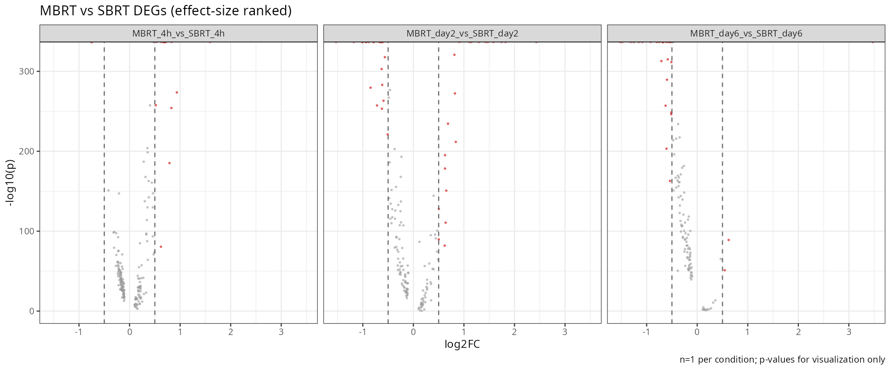
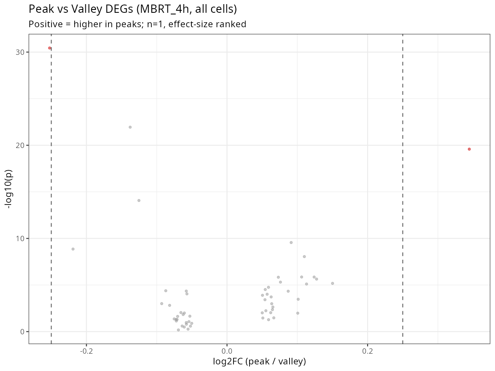

# Created 2025-02-24 Mon 08:20
#+title: Mutter Spatial Radiation (CosMx)
#+author: Jeffrey Szymanski

new bioinfo dev to work up is pathway-composition-h2ax-analysis

https://mail.google.com/mail/u/0/#inbox/FMfcgzQgKvNpcmpzmxNJvtdZcZGJhVzp
* Search spatial-rads for needed manual updates?
* README
box readme must be word doc

- Structured as a dependent repo meaning full functionality depends on submodules

Directory Structure
#+begin_example
-- Main
   |-- config
   |-- resources
   |-- results
     |--<RES_OBJ_ID>
   |-- scripts
   |-- tests
   |-- workflows
#+end_example
** Data sources
*** Gene panel
CosMx Mouse Universal Cell Characterization (Mouse UCC) panel + 21 custom add-on genes from Dr. Alan Fields' mouse experiment. Add-on gene list attached to Yi's Jan 30 2026 email as =CosMx Mouse Universal Cell Characterization Gene List (1).XLSX=. Add-on reagents were included in Mutter_01 and are planned for Mutter_02. Mouse UCC reference profiles for insitutype cell typing are publicly available from NanoString.
*** IF channels
CosMx IF channels capture protein markers on the same tissue section as RNA. Mutter_01 IF channels were used for cell segmentation and lineage, not H2AX:
- PanCK (=Mean.PanCK=, =Max.PanCK=) — epithelial marker
- "G" channel (=Mean.G=, =Max.G=) — unknown
- CD298/B2M (=Mean.CD298.B2M=, =Max.CD298.B2M=) — cell segmentation marker
- CD45 (=Mean.CD45=, =Max.CD45=) — immune cell marker
- DAPI (=Mean.DAPI=, =Max.DAPI=) — nuclear stain

Gamma-H2AX staining in PPTX ([[file:/mnt/gcs/jeszyman/projects/spatial-rads/inputs/Gamma H2AX + FOVs.pptx][Gamma H2AX + FOVs.pptx]]) is separate chromogenic IHC on an adjacent section, not CosMx IF. No per-cell H2AX intensity data exists for Mutter_01. Asked Yi (2026-03-27) whether H2AX IF could be added as a channel for Mutter_02.
*** Mutter_01 (current dataset)
- CosMx spatial transcriptomics data from Mutter lab, generated by Yi Liu (Liu.Yi1@mayo.edu)
- Yi performed secondary analysis: QC, sample condition labeling, cell type annotation (insitutype with ImmGen reference atlas), and signaling pathway scores
- Delivered as processed parquet files (339.1 MB total):
  - =projects_Mutter_01_CosMmR_app_data_raw_tx_counts_matrix.parquet= — [[https://mayoclinic2.box.com/s/ywj75mz3bfhivo5bfvivoogqh5o2uu86][box]]
  - =Analysis_Mutter_01_CosMmR_Mutter_updated_metadata.parquet= — [[https://mayoclinic2.box.com/s/y3dqguqwsjt15shh1opc2dw1kelc8q15][box]]
  - Metadata columns 90-93 are signaling pathway scores (TypeI_interferon, TypeII_interferon, STING, DNA_Damage_Repair). Type I IFN (19 genes), Type II IFN (17 genes), and DDR (18 genes) are NanoString standard Mouse UCC panel modules — gene lists in [[file:config/CosMx-Mouse-Universal-Cell-Characterization-Gene-List-(1).XLSX][gene list XLSX]], Annotations sheet. STING is not a standard NanoString module; Yi may have defined it custom or from a subset of Pattern Recognition Receptors (30 genes).
- Stored at =/mnt/gcs/jeszyman/projects/spatial-rads/inputs/=
*** Mutter_02 (upcoming, 4 slides)
Per Rob's Jan 30 2026 email, tentative design:
| Slide | Condition                                     |
|-------+-----------------------------------------------|
|     1 | 4T1 NT and MBRT/CRT 48h (merge w/ prior)      |
|     2 | 4T1 NT and MBRT/CRT 48h (merge w/ prior)      |
|     3 | New tumor model pilot, NT and MBRT/CRT 4h     |
|     4 | Tumor model OR mouse skin, NT and MBRT/CRT 4h |

Per Jenn Fazzari's Mar 2 2026 email, updated slide layouts include 0 Gy controls (blocks 1-3), 20 Gy 4h (blocks 16, 18), MBRT 4h (blocks 19, 20), 20 Gy 2d (blocks 28, 30), MBRT 2d (blocks 34, 35). Nothing processed yet — Yi offered raw Seurat objects (2026-03-27).
*** Data transfer
- Transfer mechanism: Yi uploaded via Mayo Media Shuttle (mc-ondemand-securefiletransfer.mediashuttle.com), which emails download links to recipients. GCS bucket access (=chaudhuri-lab-share-bucket1/po1-spatial=) was attempted but Yi got permission denied — never resolved. Faridi Qaium (Qaium.Faridi@mayo.edu) manages GCS bucket IAM.
- Email threads:
  - [[mu:msgid:BN7PR01MB371506589DEF9A3B39E2DA7896F1A@BN7PR01MB3715.prod.exchangelabs.com][mu:CosMx data transfer thread (Oct-Nov 2025)]]
  - [[mu:msgid:BN7PR01MB37151F29CE6E18153C94469596D2A@BN7PR01MB3715.prod.exchangelabs.com][mu:Media Shuttle upload confirmation (Nov 21 2025)]]
  - [[mu:msgid:BN7PR01MB371539912324DC0BD309549D967EA@BN7PR01MB3715.prod.exchangelabs.com][mu:MutterRobert_02 project update thread]]

** Prerequisites and setup
** Change log
- [2026-03-11 Tue] Layer 3 peak/valley stripe detection: established 15-deg tilted stripe model with 1.02mm spacing and 4 peaks from H2AX image geometry. Transcript-based p21 validates peak > valley. Pending visual confirmation of zone overlay.
- [2026-03-11 Tue] Layers 1-2 complete and committed: QC (971K cells), clustering (9 clusters), cell type validation, DEGs (2160 bulk + 2534 per-cell-type), pathway kinetics, composition, spatial NN analysis.
- [2026-03-11 Tue] Initial project setup: data model, experimental design metadata, exploratory analysis migration from career.org.
* Project Administration
** Configuration
*** Yaml
**** Common
:PROPERTIES:
:header-args:yaml: :tangle no
:END:

#+begin_src yaml
# Project-level runtime configuration. Not tangled — reference only.
repo-dir: ${HOME}/repos/spatial-rads
machines:
  - name: jeff-beast
    type: metal
machine-data-dirs:
  - machine: jeff-beast
    dir: /mnt/gcs/jeszyman/projects/spatial-rads
data-subdirs: [analysis, inputs, logs, qc, ref]
conda-env: spatial-rads
sourced-conda-envs:
  - {name: biotools, version: TBD}
  - {name: basecamp, version: TBD}
#+end_src

*** Languages
**** Bash
**** Python
**** R
*** Emacs
**** Todo states for code
#+todo: TODO TEST(t) DEBUG(g) REFACTOR(r) DOCUMENT(m) BLOCKED(b&) WAITING(w&) | DONE DELEGATED

- TODO: Initial task entry, indicating a new or unstarted task.
- TEST: A stage for verifying functionality, often running tests to confirm code works as intended.
- DEBUG: Focused on identifying and fixing errors or bugs after testing reveals issues.
- REFACTOR: Time for code cleanup or optimization without changing functionality, improving readability or performance.
- DOCUMENT: Adding comments, README updates, or other documentation to clarify usage and details for future reference.
- BLOCKED: Work can't proceed due to external dependencies or unresolved issues.
- WAITING: Waiting for input, review, or other dependency but not fully blocked.
- DONE: Task is fully completed, tested, and documented.
- DELEGATED: Task is assigned to another person or team for completion.

** Snakemake
*** Configuration YAMLs
**** Common
*** Variable naming
*** Load packages
*** Load configuration
*** Functions
**** Sample lists
*** Include statements
* Biological model
* Data model
** make_data_model.R
:PROPERTIES:
:header-args:R: :tangle scripts/make_data_model.R :comments org
:END:

#+begin_src R
library(readxl)
library(dplyr)

# Assumes working directory is repo root (~/repos/spatial-rads/)
metadata <- read_excel("metadata.xlsx")

metadata <- metadata |>
  mutate(
    model = case_when(
      grepl("^Tongue", condition) ~ "tongue",
      condition == "Control" ~ NA_character_,
      TRUE ~ "flank"
    ),
    treatment = case_when(
      condition == "Control" ~ "NT",
      grepl("MBRT", condition) ~ "MBRT",
      grepl("SBRT", condition) ~ "SBRT"
    ),
    timepoint_h = case_when(
      condition == "Control" ~ 0,
      grepl("1h", condition) ~ 1,
      grepl("4h", condition) ~ 4,
      grepl("day2", condition) ~ 48,
      grepl("day6", condition) ~ 144,
      grepl("day8", condition) ~ 192,
      grepl("day10", condition) ~ 240
    )
  )

save(metadata, file = "data/data_model.rda")
#+end_src

** [[file:workflows/data.smk][Snakefile]]
*** [[file:resources/data_smk.pdf][Rulegraph]]
#+ATTR_ORG :width 600px
file:resources/data_smk.png
*** Preamble
*** spatial-rads LINK to Load packages
*** spatial-rads LINK to Load configuation
*** spatial-rads LINK to variable naming
*** Onstart
*** Functions
*** All rule
*** On success
*** Development
*** Ideas
* Methods
** Layer 1 -- QC & Landscape
:PROPERTIES:
:header-args:jupyter-R: :session spatial :kernel spatial :async yes :dir /home/jeszyman/repos/spatial-rads/dev
:END:

Process raw CosMx data into a clean, annotated Seurat object. Establish the cellular landscape across all 11 samples. ~1000-gene targeted panel, 1.4M raw cells across 4 slides.

*** Data loading and QC
:PROPERTIES:
:header-args:jupyter-R+: :tangle dev/00_load_data.R
:END:

Load parquet count matrix and metadata, build Seurat object, apply QC filters (qcFlagsCell == "Pass", nCount_RNA > 20, nFeature_RNA > 10, propNegative < 0.5), add parsed treatment/timepoint metadata.

#+begin_src jupyter-R
library(data.table)
library(Seurat)
library(arrow)
library(dplyr)

# --- Load counts ---
counts_df <- read_parquet("/mnt/gcs/jeszyman/projects/spatial-rads/inputs/projects_Mutter_01_CosMmR_app_data_raw_tx_counts_matrix.parquet")
counts_dt <- as.data.table(counts_df)

non_gene_cols <- c("Slide", "fov", "cell_id")
gene_cols <- setdiff(colnames(counts_dt), non_gene_cols)
cat(sprintf("Panel size: %d genes\n", length(gene_cols)))
cat(sprintf("Total cells in counts: %d\n", nrow(counts_dt)))
stopifnot(!anyDuplicated(counts_dt$cell_id))

# --- Load metadata ---
meta_df <- read_parquet("/mnt/gcs/jeszyman/projects/spatial-rads/inputs/Analysis_Mutter_01_CosMmR_Mutter_updated_metadata.parquet")
meta_dt <- as.data.table(meta_df)
cat(sprintf("Total cells in metadata: %d\n", nrow(meta_dt)))

# --- Build count matrix (genes x cells) ---
count_mat <- t(as.matrix(counts_dt[, ..gene_cols]))
colnames(count_mat) <- counts_dt$cell_id
rownames(count_mat) <- gene_cols

meta_for_seurat <- as.data.frame(meta_dt)
rownames(meta_for_seurat) <- meta_for_seurat$cell_id
stopifnot(all(colnames(count_mat) %in% rownames(meta_for_seurat)))

# --- Create Seurat object ---
obj <- CreateSeuratObject(
  counts    = count_mat,
  meta.data = meta_for_seurat,
  project   = "CosMx_Mutter"
)
cat(sprintf("Raw Seurat: %d genes x %d cells\n", nrow(obj), ncol(obj)))

# --- QC filtering ---
pre_qc <- table(obj$Condition)
obj <- subset(obj, subset = qcFlagsCell == "Pass")
obj <- subset(obj, subset = nCount_RNA > 20 & nFeature_RNA > 10 & propNegative < 0.5)
post_qc <- table(obj$Condition)

qc_summary <- data.frame(
  condition = names(pre_qc),
  pre_filter = as.integer(pre_qc),
  post_filter = as.integer(post_qc[names(pre_qc)]),
  pct_retained = round(as.integer(post_qc[names(pre_qc)]) / as.integer(pre_qc) * 100, 1)
)
print(qc_summary)
write.csv(qc_summary, "/mnt/gcs/jeszyman/projects/spatial-rads/analysis/tables/qc_summary.csv", row.names = FALSE)
cat(sprintf("Post-QC: %d cells retained\n", ncol(obj)))

# --- Add parsed metadata ---
obj$model <- ifelse(grepl("^Tongue", obj$Condition), "tongue", "flank")
obj$treatment <- case_when(
  obj$Condition == "Control" ~ "NT",
  grepl("MBRT", obj$Condition) ~ "MBRT",
  grepl("SBRT", obj$Condition) ~ "SBRT"
)
obj$timepoint_h <- case_when(
  obj$Condition == "Control" ~ 0,
  grepl("1h", obj$Condition) ~ 1,
  grepl("4h", obj$Condition) ~ 4,
  grepl("day2", obj$Condition) ~ 48,
  grepl("day6", obj$Condition) ~ 144,
  grepl("day8", obj$Condition) ~ 192,
  grepl("day10", obj$Condition) ~ 240
)

# --- Verify pathway columns exist ---
pathway_cols <- c("TypeI_interferon", "TypeII_interferon", "STING", "DNA_Damage_Repair")
stopifnot(all(pathway_cols %in% colnames(obj@meta.data)))
cat("Pathway score columns confirmed present.\n")

# --- Save ---
saveRDS(obj, "/mnt/gcs/jeszyman/projects/spatial-rads/analysis/objects/seurat_qc.rds")
cat("QC'd Seurat object saved.\n")
#+end_src

971,818 cells retained post-QC (68% of 1.4M raw). Retention ranges from 44% (Tongue_MBRT_day8) to 84% (Control). All four pre-computed pathway score columns confirmed present in metadata.

*** Normalization, clustering, and UMAP
:PROPERTIES:
:header-args:jupyter-R+: :tangle dev/01_normalize_cluster.R
:END:

LogNormalize (scale 1e4), VST variable features, PCA (20 dims), Louvain clustering (resolution 0.4), UMAP. Panel has 1000 genes so all are used as variable features.

#+begin_src jupyter-R
library(Seurat)
library(future)

obj <- readRDS("/mnt/gcs/jeszyman/projects/spatial-rads/analysis/objects/seurat_qc.rds")
cat(sprintf("Loaded: %d genes x %d cells\n", nrow(obj), ncol(obj)))

# --- Normalize ---
obj <- NormalizeData(obj, normalization.method = "LogNormalize", scale.factor = 1e4)
obj <- FindVariableFeatures(obj, selection.method = "vst", nfeatures = 2000)
cat(sprintf("Variable features: %d (requested 2000, panel has %d genes)\n",
            length(VariableFeatures(obj)), nrow(obj)))

obj <- ScaleData(obj, features = VariableFeatures(obj))
obj <- RunPCA(obj, features = VariableFeatures(obj))

pdf("/mnt/gcs/jeszyman/projects/spatial-rads/analysis/figures/elbow_plot.pdf", width = 6, height = 4)
ElbowPlot(obj, ndims = 30)
dev.off()
cat("Elbow plot saved.\n")

# --- Cluster (parallel) ---
options(future.globals.maxSize = 50 * 1024^3)
plan(multicore, workers = 48)
obj <- FindNeighbors(obj, dims = 1:20)
obj <- FindClusters(obj, resolution = 0.4)
plan(sequential)

# --- UMAP ---
obj <- RunUMAP(obj, dims = 1:20, n.neighbors = 30, min.dist = 0.3)
cat(sprintf("Clusters: %d | Cells: %d\n", length(levels(obj$seurat_clusters)), ncol(obj)))

# --- Save ---
saveRDS(obj, "/mnt/gcs/jeszyman/projects/spatial-rads/analysis/objects/seurat_clustered.rds")
cat("Clustered object saved.\n")
#+end_src

9 clusters identified. PCA loadings biologically sensible: PC1 separates epithelial (S100a6, Krt8) from muscle (Mb, Tcap); PC2 separates tumor from immune lineages (Cd3d, Cd68, Apoe).

#+ATTR_ORG: :width 800
[[file:/mnt/gcs/jeszyman/projects/spatial-rads/analysis/figures/elbow_plot.pdf]]

*** Cell type validation
:PROPERTIES:
:header-args:jupyter-R+: :tangle no
:END:

Validate Yi's pre-computed insitutype labels against canonical markers. Characterize the "a" population (~36% of cells) using epithelial markers.

#+begin_src jupyter-R
library(Seurat)
library(tidyverse)

obj <- readRDS("/mnt/gcs/jeszyman/projects/spatial-rads/analysis/objects/seurat_clustered.rds")

# --- Tabulate Yi's labels ---
ct_table <- sort(table(obj$ImmuneAtlas_ImmGen_Main_cell_Types), decreasing = TRUE)
cat("Cell type frequencies:\n")
print(ct_table)

ct_family <- sort(table(obj$ImmuneAtlas_ImmGen_cellFamily_Main_cell_Types), decreasing = TRUE)
cat("\nCell family frequencies:\n")
print(ct_family)

# --- Check available canonical markers ---
marker_candidates <- c(
  "Cd3e", "Cd3d", "Cd4", "Cd8a", "Cd8b1",
  "Cd68", "Adgre1", "Csf1r", "Itgam",
  "Epcam", "Krt8", "Krt18", "Krt14",
  "Cd19", "Ms4a1",
  "Ncr1", "Klrb1c",
  "Pecam1", "Cdh5"
)
available_markers <- marker_candidates[marker_candidates %in% rownames(obj)]
cat(sprintf("\nAvailable markers: %d / %d\n", length(available_markers), length(marker_candidates)))
cat(paste(available_markers, collapse = ", "), "\n")

# --- Dot plot: markers vs cell types ---
p <- DotPlot(obj, features = available_markers,
             group.by = "ImmuneAtlas_ImmGen_Main_cell_Types") +
  RotatedAxis() +
  labs(title = "Marker validation: Yi's cell type labels")
ggsave("/mnt/gcs/jeszyman/projects/spatial-rads/analysis/figures/celltype_marker_validation.pdf",
       plot = p, width = 14, height = 8)
cat("Marker validation dot plot saved.\n")

# --- Characterize "a" population ---
epi_markers <- available_markers[available_markers %in% c("Epcam", "Krt8", "Krt18", "Krt14")]
cat(sprintf("\nEpithelial markers available: %s\n", paste(epi_markers, collapse = ", ")))

if (length(epi_markers) > 0) {
  p2 <- VlnPlot(obj, features = epi_markers,
                 group.by = "ImmuneAtlas_ImmGen_Main_cell_Types", pt.size = 0)
  ggsave("/mnt/gcs/jeszyman/projects/spatial-rads/analysis/figures/a_population_markers.pdf",
         plot = p2, width = 12, height = 6)
  cat("'a' population marker plot saved.\n")

  # Summary stats for "a" vs others (Seurat v5 compatible)
  a_cells <- which(obj$ImmuneAtlas_ImmGen_Main_cell_Types == "a")
  non_a <- which(obj$ImmuneAtlas_ImmGen_Main_cell_Types != "a")
  norm_data <- GetAssayData(obj, layer = "data")
  for (m in epi_markers) {
    a_mean <- mean(norm_data[m, a_cells])
    other_mean <- mean(norm_data[m, non_a])
    cat(sprintf("  %s: 'a' mean=%.3f, others mean=%.3f, ratio=%.1f\n",
                m, a_mean, other_mean, a_mean / max(other_mean, 0.001)))
  }
}

# --- Relabel "a" as tumor_epithelial ---
obj$cell_type_validated <- obj$ImmuneAtlas_ImmGen_Main_cell_Types
obj$cell_type_validated[obj$cell_type_validated == "a"] <- "tumor_epithelial"
saveRDS(obj, "/mnt/gcs/jeszyman/projects/spatial-rads/analysis/objects/seurat_clustered.rds")
cat("Relabeled a -> tumor_epithelial. Saved.\n")
#+end_src

18/19 canonical markers available in panel (Adgre1 absent). Epithelial markers modestly enriched in "a" cells (1.4-2.2x over background). The "a" population comprises 46-65% of 4h samples but drops to 15-18% at day 6, consistent with tumor cell death post-radiation. Tongue samples have only 2-4% "a" cells. Relabeled as =tumor_epithelial=.

#+ATTR_ORG: :width 800
[[file:/mnt/gcs/jeszyman/projects/spatial-rads/analysis/figures/celltype_marker_validation.pdf]]

#+ATTR_ORG: :width 800
[[file:/mnt/gcs/jeszyman/projects/spatial-rads/analysis/figures/a_population_markers.pdf]]

*** Batch assessment and landscape plots
:PROPERTIES:
:header-args:jupyter-R+: :tangle no
:END:

UMAP colored by slide to check for batch effects. Landscape views by cluster, condition, cell type, and treatment. Spatial cell type maps for flank samples.

#+begin_src jupyter-R
library(Seurat)
library(tidyverse)
library(patchwork)

obj <- readRDS("/mnt/gcs/jeszyman/projects/spatial-rads/analysis/objects/seurat_clustered.rds")

# --- Batch assessment ---
p_batch <- DimPlot(obj, group.by = "Slide", raster = TRUE) +
  labs(title = "UMAP by Slide -- batch check")
ggsave("/mnt/gcs/jeszyman/projects/spatial-rads/analysis/figures/umap_by_slide.pdf",
       plot = p_batch, width = 8, height = 6)
cat("Batch assessment plot saved.\n")

# --- Landscape UMAPs ---
p1 <- DimPlot(obj, group.by = "seurat_clusters", raster = TRUE, label = TRUE) + labs(title = "Clusters")
p2 <- DimPlot(obj, group.by = "Condition", raster = TRUE) + labs(title = "Condition")
p3 <- DimPlot(obj, group.by = "ImmuneAtlas_ImmGen_Main_cell_Types",
              raster = TRUE, label = TRUE, repel = TRUE) + labs(title = "Cell type")
p4 <- DimPlot(obj, group.by = "treatment", raster = TRUE) + labs(title = "Treatment")
p_landscape <- (p1 | p2) / (p3 | p4)
ggsave("/mnt/gcs/jeszyman/projects/spatial-rads/analysis/figures/umap_landscape.pdf",
       plot = p_landscape, width = 16, height = 12)
cat("Landscape UMAP saved.\n")

# --- Spatial cell type maps (flank) ---
p_spatial <- obj@meta.data %>%
  as.data.frame() %>%
  filter(model == "flank") %>%
  ggplot(aes(x = x_slide_mm, y = y_slide_mm, color = ImmuneAtlas_ImmGen_Main_cell_Types)) +
  geom_point(size = 0.1, alpha = 0.3) +
  facet_wrap(~Condition, scales = "free") +
  labs(title = "Spatial cell type distribution (flank)", color = "Cell type") +
  theme_bw() +
  theme(legend.position = "bottom") +
  guides(color = guide_legend(override.aes = list(size = 2, alpha = 1)))
ggsave("/mnt/gcs/jeszyman/projects/spatial-rads/analysis/figures/spatial_celltype_flank.pdf",
       plot = p_spatial, width = 16, height = 12)
cat("Spatial cell type map saved.\n")

# --- Cell count summary ---
cell_counts <- obj@meta.data %>%
  as.data.frame() %>%
  count(Condition, ImmuneAtlas_ImmGen_Main_cell_Types) %>%
  pivot_wider(names_from = ImmuneAtlas_ImmGen_Main_cell_Types, values_from = n, values_fill = 0)
write.csv(cell_counts, "/mnt/gcs/jeszyman/projects/spatial-rads/analysis/tables/cell_counts_by_condition_celltype.csv", row.names = FALSE)
cat("Cell count table saved.\n")
print(cell_counts)
#+end_src

#+ATTR_ORG: :width 800
[[file:/mnt/gcs/jeszyman/projects/spatial-rads/analysis/figures/umap_by_slide.pdf]]

#+ATTR_ORG: :width 800
[[file:/mnt/gcs/jeszyman/projects/spatial-rads/analysis/figures/umap_landscape.pdf]]

#+ATTR_ORG: :width 800
[[file:/mnt/gcs/jeszyman/projects/spatial-rads/analysis/figures/spatial_celltype_flank.pdf]]

** Layer 2 -- MBRT vs SBRT vs Control Comparative Kinetics
:PROPERTIES:
:header-args:jupyter-R: :session spatial :kernel spatial :async yes :dir /home/jeszyman/repos/spatial-rads/dev
:END:

Characterize how MBRT and SBRT differ in transcriptomic response over time across cell types. All comparisons are descriptive (n=1 per condition); effect sizes are the primary metric.

*** Differential expression
:PROPERTIES:
:header-args:jupyter-R+: :tangle dev/02_deg_analysis.R
:END:

DEG analysis comparing MBRT vs Control, SBRT vs Control, and MBRT vs SBRT at matched timepoints. Wilcoxon rank sum via Seurat FindMarkers, ranked by effect size (log2FC), not p-value. Per-cell-type DEGs at 4h for MBRT vs SBRT.

#+begin_src jupyter-R
library(Seurat)
library(tidyverse)
library(future)

obj <- readRDS("/mnt/gcs/jeszyman/projects/spatial-rads/analysis/objects/seurat_clustered.rds")
cat(sprintf("Loaded: %d genes x %d cells\n", nrow(obj), ncol(obj)))

# --- DEG function (effect-size ranked, NOT p-value based) ---
run_deg <- function(obj, ident.1, ident.2, group.by = "Condition") {
  Idents(obj) <- group.by
  markers <- FindMarkers(obj, ident.1 = ident.1, ident.2 = ident.2,
                         min.pct = 0.1, logfc.threshold = 0.1)
  markers$gene <- rownames(markers)
  markers$comparison <- paste0(ident.1, "_vs_", ident.2)
  markers %>% arrange(desc(abs(avg_log2FC)))
}

# --- MBRT vs Control ---
cat("Running MBRT vs Control DEGs...\n")
mbrt_tp <- c("MBRT_1h", "MBRT_4h", "MBRT_day2", "MBRT_day6")
deg_mbrt_ctrl <- map_dfr(mbrt_tp, function(tp) {
  cat(sprintf("  %s vs Control...\n", tp))
  sub <- subset(obj, cells = colnames(obj)[obj$Condition %in% c(tp, "Control")])
  run_deg(sub, tp, "Control")
})
cat(sprintf("MBRT vs Control: %d DEGs\n", nrow(deg_mbrt_ctrl)))

# --- SBRT vs Control ---
cat("Running SBRT vs Control DEGs...\n")
sbrt_tp <- c("SBRT_4h", "SBRT_day2", "SBRT_day6")
deg_sbrt_ctrl <- map_dfr(sbrt_tp, function(tp) {
  cat(sprintf("  %s vs Control...\n", tp))
  sub <- subset(obj, cells = colnames(obj)[obj$Condition %in% c(tp, "Control")])
  run_deg(sub, tp, "Control")
})
cat(sprintf("SBRT vs Control: %d DEGs\n", nrow(deg_sbrt_ctrl)))

# --- MBRT vs SBRT at matched timepoints ---
cat("Running MBRT vs SBRT DEGs...\n")
matched <- list(c("MBRT_4h", "SBRT_4h"), c("MBRT_day2", "SBRT_day2"), c("MBRT_day6", "SBRT_day6"))
deg_mbrt_sbrt <- map_dfr(matched, function(pair) {
  cat(sprintf("  %s vs %s...\n", pair[1], pair[2]))
  sub <- subset(obj, cells = colnames(obj)[obj$Condition %in% pair])
  run_deg(sub, pair[1], pair[2])
})
cat(sprintf("MBRT vs SBRT: %d DEGs\n", nrow(deg_mbrt_sbrt)))

# --- Combine and save ---
all_degs <- bind_rows(
  mbrt_vs_ctrl = deg_mbrt_ctrl,
  sbrt_vs_ctrl = deg_sbrt_ctrl,
  mbrt_vs_sbrt = deg_mbrt_sbrt,
  .id = "comparison_type"
)
write.csv(all_degs, "/mnt/gcs/jeszyman/projects/spatial-rads/analysis/tables/deg_all_cells.csv", row.names = FALSE)
cat(sprintf("Total DEG rows: %d\n", nrow(all_degs)))

# --- Per-cell-type DEGs (MBRT vs SBRT at 4h) ---
cat("\nRunning per-cell-type DEGs (MBRT vs SBRT at 4h)...\n")
ct_counts <- table(obj$cell_type_validated[obj$Condition %in% c("MBRT_4h", "SBRT_4h")])
major_cts <- names(ct_counts[ct_counts > 500])
cat(sprintf("Cell types with >500 cells at 4h: %s\n", paste(major_cts, collapse = ", ")))

deg_by_ct <- map_dfr(major_cts, function(ct) {
  cells <- colnames(obj)[obj$Condition %in% c("MBRT_4h", "SBRT_4h") &
                          obj$cell_type_validated == ct]
  if (length(cells) < 50) return(NULL)
  cat(sprintf("  %s (%d cells)...\n", ct, length(cells)))
  sub <- subset(obj, cells = cells)
  tryCatch(run_deg(sub, "MBRT_4h", "SBRT_4h") %>% mutate(cell_type = ct),
           error = function(e) { cat(sprintf("    Error: %s\n", e$message)); NULL })
})
write.csv(deg_by_ct, "/mnt/gcs/jeszyman/projects/spatial-rads/analysis/tables/deg_by_celltype_4h.csv", row.names = FALSE)
cat(sprintf("Per-cell-type DEGs: %d rows across %d cell types\n",
            nrow(deg_by_ct), length(unique(deg_by_ct$cell_type))))
cat("DEG analysis complete.\n")
#+end_src

2,160 bulk DEG rows across all comparisons. Top MBRT vs SBRT findings: at 4h, MBRT upregulates myeloid recruitment genes (Ccl8 log2FC 1.59, Mrc1, Cd74, Arg1). At day 2, the myeloid signal amplifies (Ccl8 log2FC 2.43, Cd163 1.74) while SBRT upregulates Cxcl10 (-1.53, IFN-stimulated). At day 6, MBRT shows massive Igkc (log2FC 3.47, B/plasma cell signature) while SBRT has Nkg7 (-1.31, cytotoxic). Per-cell-type DEGs: 2,534 rows across 25 cell types.

*** DEG visualization
:PROPERTIES:
:header-args:jupyter-R+: :tangle no
:END:

#+begin_src jupyter-R
library(tidyverse)

all_degs <- read.csv("/mnt/gcs/jeszyman/projects/spatial-rads/analysis/tables/deg_all_cells.csv")
cat(sprintf("Loaded %d DEG rows\n", nrow(all_degs)))

# --- Volcano: MBRT vs SBRT ---
all_degs %>%
  filter(comparison_type == "mbrt_vs_sbrt") %>%
  ggplot(aes(x = avg_log2FC, y = -log10(p_val), color = abs(avg_log2FC) > 0.5)) +
  geom_point(alpha = 0.5, size = 0.5) +
  facet_wrap(~comparison) +
  scale_color_manual(values = c("grey60", "red3"), guide = "none") +
  geom_vline(xintercept = c(-0.5, 0.5), linetype = "dashed", color = "grey40") +
  labs(title = "MBRT vs SBRT DEGs (effect size ranked)",
       x = "log2FC", y = "-log10(p)",
       caption = "n=1 per condition; p-values for visualization only") +
  theme_bw()
ggsave("/mnt/gcs/jeszyman/projects/spatial-rads/analysis/figures/volcano_mbrt_vs_sbrt.pdf",
       width = 12, height = 5)

# --- Volcano: MBRT vs Control ---
all_degs %>%
  filter(comparison_type == "mbrt_vs_ctrl") %>%
  ggplot(aes(x = avg_log2FC, y = -log10(p_val), color = abs(avg_log2FC) > 0.5)) +
  geom_point(alpha = 0.5, size = 0.5) +
  facet_wrap(~comparison) +
  scale_color_manual(values = c("grey60", "red3"), guide = "none") +
  geom_vline(xintercept = c(-0.5, 0.5), linetype = "dashed", color = "grey40") +
  labs(title = "MBRT vs Control DEGs",
       x = "log2FC", y = "-log10(p)",
       caption = "n=1 per condition; p-values for visualization only") +
  theme_bw()
ggsave("/mnt/gcs/jeszyman/projects/spatial-rads/analysis/figures/volcano_mbrt_vs_ctrl.pdf",
       width = 14, height = 5)
cat("Volcano plots saved.\n")
#+end_src

#+ATTR_ORG: :width 800
[[file:/mnt/gcs/jeszyman/projects/spatial-rads/analysis/figures/volcano_mbrt_vs_sbrt.pdf]]

#+ATTR_ORG: :width 800
[[file:/mnt/gcs/jeszyman/projects/spatial-rads/analysis/figures/volcano_mbrt_vs_ctrl.pdf]]

*** Pathway score kinetics
:PROPERTIES:
:header-args:jupyter-R+: :tangle no
:END:

Yi's pre-computed pathway scores (TypeI_interferon, TypeII_interferon, STING, DNA_Damage_Repair) summarized per sample x cell family x timepoint. Kinetic line plots for MBRT vs SBRT.

#+begin_src jupyter-R
library(Seurat)
library(tidyverse)

obj <- readRDS("/mnt/gcs/jeszyman/projects/spatial-rads/analysis/objects/seurat_clustered.rds")
pathway_cols <- c("TypeI_interferon", "TypeII_interferon", "STING", "DNA_Damage_Repair")

# --- By cell family ---
kinetics <- obj@meta.data %>%
  as.data.frame() %>%
  filter(model == "flank") %>%
  group_by(timepoint_h, treatment,
           cell_family = ImmuneAtlas_ImmGen_cellFamily_Main_cell_Types) %>%
  summarise(n_cells = n(),
            across(all_of(pathway_cols), \(x) mean(x, na.rm = TRUE)),
            .groups = "drop") %>%
  pivot_longer(cols = all_of(pathway_cols), names_to = "pathway", values_to = "score")

kinetics %>%
  filter(treatment %in% c("MBRT", "SBRT", "NT")) %>%
  ggplot(aes(x = factor(timepoint_h), y = score, color = treatment, group = treatment)) +
  geom_line(linewidth = 0.8) + geom_point(size = 2) +
  facet_grid(pathway ~ cell_family, scales = "free_y") +
  labs(x = "Hours post-RT", y = "Mean pathway score", caption = "n=1 per condition") +
  theme_bw(base_size = 10) +
  theme(axis.text.x = element_text(angle = 45, hjust = 1))
ggsave("/mnt/gcs/jeszyman/projects/spatial-rads/analysis/figures/pathway_kinetics_by_celltype.pdf",
       width = 20, height = 12)

# --- All cells (simplified) ---
obj@meta.data %>%
  as.data.frame() %>%
  filter(model == "flank", treatment %in% c("MBRT", "SBRT")) %>%
  group_by(timepoint_h, treatment) %>%
  summarise(across(all_of(pathway_cols), \(x) mean(x, na.rm = TRUE)), .groups = "drop") %>%
  pivot_longer(cols = all_of(pathway_cols), names_to = "pathway", values_to = "score") %>%
  ggplot(aes(x = factor(timepoint_h), y = score, color = treatment, group = treatment)) +
  geom_line(linewidth = 1) + geom_point(size = 3) +
  facet_wrap(~pathway, scales = "free_y") +
  scale_color_manual(values = c("MBRT" = "#E74C3C", "SBRT" = "#3498DB")) +
  labs(x = "Hours post-RT", y = "Mean pathway score", caption = "n=1 per condition") +
  theme_bw()
ggsave("/mnt/gcs/jeszyman/projects/spatial-rads/analysis/figures/pathway_kinetics_all_cells.pdf",
       width = 10, height = 8)

write.csv(kinetics, "/mnt/gcs/jeszyman/projects/spatial-rads/analysis/tables/pathway_kinetics.csv", row.names = FALSE)
cat("Pathway kinetics saved.\n")
#+end_src

#+ATTR_ORG: :width 800
[[file:/mnt/gcs/jeszyman/projects/spatial-rads/analysis/figures/pathway_kinetics_by_celltype.pdf]]

#+ATTR_ORG: :width 800
[[file:/mnt/gcs/jeszyman/projects/spatial-rads/analysis/figures/pathway_kinetics_all_cells.pdf]]

*** Immune composition shifts
:PROPERTIES:
:header-args:jupyter-R+: :tangle no
:END:

Cell type proportions by condition and timepoint. Stacked bar chart and per-cell-type trajectory plots tracking composition changes over time for MBRT vs SBRT.

#+begin_src jupyter-R
library(Seurat)
library(tidyverse)

obj <- readRDS("/mnt/gcs/jeszyman/projects/spatial-rads/analysis/objects/seurat_clustered.rds")

# --- Proportions ---
composition <- obj@meta.data %>%
  as.data.frame() %>%
  filter(model == "flank") %>%
  count(Condition, timepoint_h, treatment,
        cell_type = cell_type_validated) %>%
  group_by(Condition) %>%
  mutate(prop = n / sum(n)) %>%
  ungroup()

# --- Stacked bar ---
cond_levels <- c("Control", "MBRT_1h", "MBRT_4h", "SBRT_4h",
                 "MBRT_day2", "SBRT_day2", "MBRT_day6", "SBRT_day6")
composition %>%
  filter(Condition %in% cond_levels) %>%
  mutate(Condition = factor(Condition, levels = cond_levels)) %>%
  ggplot(aes(x = Condition, y = prop, fill = cell_type)) +
  geom_col() +
  labs(x = NULL, y = "Proportion", fill = "Cell type",
       title = "Cell type composition (flank)") +
  theme_bw() + theme(axis.text.x = element_text(angle = 45, hjust = 1))
ggsave("/mnt/gcs/jeszyman/projects/spatial-rads/analysis/figures/composition_stacked.pdf",
       width = 10, height = 6)

# --- Trajectories for key cell types ---
composition %>%
  filter(treatment %in% c("MBRT", "SBRT")) %>%
  ggplot(aes(x = factor(timepoint_h), y = prop, color = treatment, group = treatment)) +
  geom_line(linewidth = 0.8) + geom_point(size = 2) +
  facet_wrap(~cell_type, scales = "free_y") +
  labs(x = "Hours post-RT", y = "Proportion", color = "Treatment",
       caption = "n=1 per condition") +
  theme_bw()
ggsave("/mnt/gcs/jeszyman/projects/spatial-rads/analysis/figures/composition_trajectories.pdf",
       width = 14, height = 10)

write.csv(composition, "/mnt/gcs/jeszyman/projects/spatial-rads/analysis/tables/composition.csv", row.names = FALSE)
cat("Composition analysis saved.\n")
#+end_src

#+ATTR_ORG: :width 800
[[file:/mnt/gcs/jeszyman/projects/spatial-rads/analysis/figures/composition_stacked.pdf]]

#+ATTR_ORG: :width 800
[[file:/mnt/gcs/jeszyman/projects/spatial-rads/analysis/figures/composition_trajectories.pdf]]

*** Spatial neighborhood analysis
:PROPERTIES:
:header-args:jupyter-R+: :tangle no
:END:

k-nearest neighbor (k=20) analysis of spatial immune neighborhoods at 4h. For each cell, compute the fraction of its 20 nearest spatial neighbors that are immune (non-tumor_epithelial). Compare MBRT vs SBRT.

#+begin_src jupyter-R
library(Seurat)
library(RANN)
library(tidyverse)

obj <- readRDS("/mnt/gcs/jeszyman/projects/spatial-rads/analysis/objects/seurat_clustered.rds")

# --- Nearest-neighbor immune fraction at 4h ---
cat("Computing spatial nearest neighbors at 4h...\n")
nn_results <- map_dfr(c("MBRT_4h", "SBRT_4h"), function(cond) {
  cat(sprintf("  %s...\n", cond))
  meta_sub <- obj@meta.data %>% as.data.frame() %>% filter(Condition == cond)
  coords <- as.matrix(meta_sub[, c("x_slide_mm", "y_slide_mm")])
  ct <- meta_sub$cell_type_validated

  nn <- nn2(coords, k = 21)
  nn_idx <- nn$nn.idx[, -1]

  # Fraction of neighbors that are immune (not tumor_epithelial)
  immune_frac <- rowMeans(matrix(ct[nn_idx] != "tumor_epithelial", nrow = nrow(nn_idx)))

  tibble(condition = cond, cell_type = ct, immune_neighbor_frac = immune_frac)
})

nn_results %>%
  ggplot(aes(x = immune_neighbor_frac, fill = condition)) +
  geom_density(alpha = 0.5) +
  facet_wrap(~cell_type, scales = "free_y") +
  labs(x = "Fraction immune neighbors (k=20)",
       title = "Spatial immune neighborhoods: MBRT vs SBRT at 4h") +
  theme_bw()
ggsave("/mnt/gcs/jeszyman/projects/spatial-rads/analysis/figures/spatial_nn_immune_frac.pdf",
       width = 14, height = 10)
cat("Spatial NN analysis saved.\n")
#+end_src

MBRT shows consistently higher immune neighbor fractions than SBRT at 4h across every cell type. Dendritic cells: 0.69 vs 0.52; microglia: 0.72 vs 0.59; spleen red pulp macs: 0.75 vs 0.62; even tumor cells: 0.37 vs 0.31. This suggests MBRT's spatial heterogeneity (peaks/valleys) promotes more spatially mixed immune/tumor neighborhoods compared to the uniform dose of SBRT.

#+ATTR_ORG: :width 800
[[file:/mnt/gcs/jeszyman/projects/spatial-rads/analysis/figures/spatial_nn_immune_frac.pdf]]

** Layer 3 -- Peak/Valley at 4h
Geometric classification of microbeam peaks vs valleys using H2AX IHC stripe pattern from [[file:/mnt/gcs/jeszyman/projects/spatial-rads/inputs/Gamma H2AX + FOVs.pptx][Gamma H2AX + FOVs.pptx]]. Per-cell H2AX IF intensity does not exist for Mutter_01 — the CosMx IF channels were used for segmentation markers (PanCK, CD298/B2M, CD45, DAPI), not H2AX. The PPTX images are separate chromogenic IHC on an adjacent section.

Current best-fit stripe model (dev/03k_4peak_classify.R):
- 15-degree downward tilt left-to-right (confirmed visually from H2AX image)
- 1.02mm center-to-center spacing, 4 peaks
- Tilt-corrected coordinate: y_corr = y_slide_mm + x_slide_mm * tan(15 deg)
- Beam centers at corrected-y: 1.14, 2.16, 3.18, 4.20 mm
- Classification: peak if dist_to_center < spacing/4, else valley (~50/50 split)
- Validation: peaks show higher Cdkn1a/p21 (0.632 vs 0.586)
- Pending: final visual verification of =mbrt4h_4peak_zones_labels.pdf= against H2AX image

** Layer 4 -- Signature Projection (BLOCKED)
Virtual scientist plan created: =plan-mbrt-signatures.md=, =review-mbrt-signatures.md=, =run-mbrt-signatures.sh=. Session: =spatial-ucell-scoring-plan=. Key decisions: UCell (rank-based) as primary scoring method over AddModuleScore for targeted panel; cell-type-stratified signatures primary, bulk secondary; Moran's I for formal spatial autocorrelation. Blocked on FOV-to-condition mapping from Rob/Jenn for Mutter_02.
** Microbeam Peak Valley Analysis                               :bioinfo_dev:
:PROPERTIES:
:ID: 945d9096-1a17-4b99-acfd-058f606cbd24
:header-args:jupyter-R: :session spatial-rads :kernel spatial-rads :async yes :dir ./dev/peak_valley_analysis
:EXPORT_FILE_NAME: ./peak-valley-analysis
:EXPORT_TITLE: Microbeam Peak-Valley Spatial Transcriptomics Analysis
:EXPORT_OPTIONS: toc:t num:t html-style:nil
:EXPORT_HTML_HEAD: <link rel="stylesheet" type="text/css" href="resources/org.css"/>
:END:

Consolidation of spatial-rads exploratory analysis into a single bioinfo-dev module workbook. Layers 1-2 condensed as infrastructure, Layer 3 stripe model with curated highlights, H2AX validation as critical gate, then new peak/valley DEG/pathway/composition/neighborhood/SBRT analyses. All comparisons are descriptive (n=1 per condition) using effect sizes rather than formal significance testing.

*** Background

Microbeam radiation therapy (MBRT) delivers radiation through an array of parallel, planar beams with sub-millimeter spacing. Unlike conventional spatially uniform (SBRT) irradiation, MBRT creates alternating high-dose peaks and low-dose valleys in tissue. This spatial fractionation pattern may differentially engage DNA damage repair, innate immune signaling, and bystander effects. The CosMx spatial transcriptomics panel (~1000 genes) captures single-cell resolution across 11 conditions spanning MBRT, SBRT, and untreated controls at multiple timepoints (1h, 4h, day 2, day 6) in both flank tumor and tongue normal tissue models.

The central question of this workbook is whether MBRT peak zones (direct beam exposure) and valley zones (bystander) show distinct transcriptomic signatures at 4 hours post-irradiation, and how these compare to the uniform-dose SBRT response.

*** Data

| File                   | Description                                                         | Location              |
|------------------------+---------------------------------------------------------------------+-----------------------|
| Counts parquet         | Raw transcript counts, ~1000 genes x 1.4M cells                     | GCS inputs/           |
| Metadata parquet       | Cell-level QC flags, coordinates, insitutype labels, pathway scores | GCS inputs/           |
| Gamma H2AX + FOVs.pptx | H2AX immunofluorescence images with FOV overlay                     | GCS inputs/           |
| seurat_clustered.rds   | Pre-computed Seurat object (QC'd, normalized, clustered)            | GCS analysis/objects/ |

*** Data Loading
:PROPERTIES:
:header-args:jupyter-R+: :tangle ./dev/peak_valley_analysis/00_load_data.R
:END:

Load raw parquet files from GCS, build Seurat object with parsed metadata (model, treatment, timepoint), confirm 4 pre-computed pathway score columns, and define canonical color palettes used by all downstream scripts.

#+begin_src jupyter-R
library(data.table)
library(Seurat)
library(arrow)
library(tidyverse)

# --- Paths ---
INPUT_DIR <- "/mnt/gcs/jeszyman/projects/spatial-rads/inputs"
ANALYSIS_DIR <- "/mnt/gcs/jeszyman/projects/spatial-rads/analysis"
DATA_DIR <- "data"
PLOT_DIR <- "plots"
for (d in c(DATA_DIR, PLOT_DIR)) if (!dir.exists(d)) dir.create(d, recursive = TRUE)

# --- Load counts ---
counts_df <- read_parquet(file.path(INPUT_DIR, "projects_Mutter_01_CosMmR_app_data_raw_tx_counts_matrix.parquet"))
counts_dt <- as.data.table(counts_df)
non_gene_cols <- c("Slide", "fov", "cell_id")
gene_cols <- setdiff(colnames(counts_dt), non_gene_cols)
cat(sprintf("Panel size: %d genes\n", length(gene_cols)))
cat(sprintf("Total cells in counts: %d\n", nrow(counts_dt)))
stopifnot(!anyDuplicated(counts_dt$cell_id))

# --- Load metadata ---
meta_df <- read_parquet(file.path(INPUT_DIR, "Analysis_Mutter_01_CosMmR_Mutter_updated_metadata.parquet"))
meta_dt <- as.data.table(meta_df)
cat(sprintf("Total cells in metadata: %d\n", nrow(meta_dt)))

# --- Build count matrix (genes x cells) ---
count_mat <- t(as.matrix(counts_dt[, ..gene_cols]))
colnames(count_mat) <- counts_dt$cell_id
rownames(count_mat) <- gene_cols

meta_for_seurat <- as.data.frame(meta_dt)
rownames(meta_for_seurat) <- meta_for_seurat$cell_id
stopifnot(all(colnames(count_mat) %in% rownames(meta_for_seurat)))

# --- Create Seurat object ---
obj <- CreateSeuratObject(
  counts    = count_mat,
  meta.data = meta_for_seurat,
  project   = "CosMx_Mutter"
)
cat(sprintf("Raw Seurat: %d genes x %d cells\n", nrow(obj), ncol(obj)))

# --- Parsed metadata ---
obj$model <- ifelse(grepl("^Tongue", obj$Condition), "tongue", "flank")
obj$treatment <- case_when(
  obj$Condition == "Control" ~ "NT",
  grepl("MBRT", obj$Condition) ~ "MBRT",
  grepl("SBRT", obj$Condition) ~ "SBRT"
)
obj$timepoint_h <- case_when(
  obj$Condition == "Control" ~ 0,
  grepl("1h", obj$Condition) ~ 1,
  grepl("4h", obj$Condition) ~ 4,
  grepl("day2", obj$Condition) ~ 48,
  grepl("day6", obj$Condition) ~ 144,
  grepl("day8", obj$Condition) ~ 192,
  grepl("day10", obj$Condition) ~ 240
)

# --- Verify pathway columns ---
PATHWAY_COLS <- c("TypeI_interferon", "TypeII_interferon", "STING", "DNA_Damage_Repair")
stopifnot(all(PATHWAY_COLS %in% colnames(obj@meta.data)))
cat("Pathway score columns confirmed present.\n")

# --- Canonical color palettes ---
TREATMENT_COLORS <- c("MBRT" = "#E74C3C", "SBRT" = "#3498DB", "NT" = "#7F8C8D")

CONDITION_LEVELS <- c("Control", "MBRT_1h", "MBRT_4h", "SBRT_4h",
                      "MBRT_day2", "SBRT_day2", "MBRT_day6", "SBRT_day6",
                      "Tongue_MBRT_day8", "Tongue_MBRT_day10", "Tongue_SBRT_day10")

ZONE_COLORS <- c("peak" = "#E74C3C", "valley" = "#3498DB")

PATHWAY_LABELS <- c(
  "TypeI_interferon" = "Type I IFN",
  "TypeII_interferon" = "Type II IFN",
  "STING" = "STING",
  "DNA_Damage_Repair" = "DDR"
)

cat(sprintf("Raw object ready: %d genes x %d cells\n", nrow(obj), ncol(obj)))
#+end_src

*** QC Filtering
:PROPERTIES:
:header-args:jupyter-R+: :tangle ./dev/peak_valley_analysis/01_qc_filter.R
:END:

Apply multi-criteria QC filtering: qcFlagsCell=="Pass", nCount_RNA>20, nFeature_RNA>10, propNegative<0.5. Expected retention ~68% (1.4M to 971K cells). Generate QC violin plots and save summary statistics.

#+begin_src jupyter-R
if (!exists("obj")) source("00_load_data.R")

# --- QC filtering ---
pre_qc <- table(obj$Condition)
obj <- subset(obj, subset = qcFlagsCell == "Pass")
obj <- subset(obj, subset = nCount_RNA > 20 & nFeature_RNA > 10 & propNegative < 0.5)
post_qc <- table(obj$Condition)

qc_summary <- data.frame(
  condition = names(pre_qc),
  pre_filter = as.integer(pre_qc),
  post_filter = as.integer(post_qc[names(pre_qc)]),
  pct_retained = round(as.integer(post_qc[names(pre_qc)]) / as.integer(pre_qc) * 100, 1)
)
print(qc_summary)
write_tsv(qc_summary, file.path(DATA_DIR, "qc_summary.tsv"))
cat(sprintf("Post-QC: %d cells retained (%.0f%%)\n", ncol(obj),
            ncol(obj) / sum(as.integer(pre_qc)) * 100))

# --- QC violin plots ---
p_qc <- VlnPlot(obj, features = c("nCount_RNA", "nFeature_RNA", "propNegative"),
                 group.by = "Condition", pt.size = 0, ncol = 3)
ggsave(file.path(PLOT_DIR, "qc_violins.png"), plot = p_qc, width = 16, height = 5, dpi = 150)

# --- Save QC'd object ---
saveRDS(obj, file.path(ANALYSIS_DIR, "objects", "seurat_qc.rds"))
cat("QC'd Seurat object saved.\n")
#+end_src

#+ATTR_ORG: :width 800
[[file:dev/peak_valley_analysis/plots/qc_violins.png]]

*** Normalization and Clustering
:PROPERTIES:
:header-args:jupyter-R+: :tangle ./dev/peak_valley_analysis/02_normalize_cluster.R
:END:

LogNormalize (scale 1e4), VST variable features (2000), PCA (20 dims), Louvain clustering (resolution 0.4), UMAP. Generates landscape plots by cluster, condition, slide, and treatment. Expected: 9 clusters.

#+begin_src jupyter-R
if (!exists("obj")) source("00_load_data.R")
library(future)

# Load QC'd object if not already in memory from 01
if (!"qcFlagsCell" %in% colnames(obj@meta.data) || any(obj$qcFlagsCell != "Pass", na.rm = TRUE)) {
  obj <- readRDS(file.path(ANALYSIS_DIR, "objects", "seurat_qc.rds"))
  cat(sprintf("Loaded QC'd object: %d cells\n", ncol(obj)))
}

# --- Normalize ---
obj <- NormalizeData(obj, normalization.method = "LogNormalize", scale.factor = 1e4)
obj <- FindVariableFeatures(obj, selection.method = "vst", nfeatures = 2000)
cat(sprintf("Variable features: %d\n", length(VariableFeatures(obj))))
obj <- ScaleData(obj, features = VariableFeatures(obj))
obj <- RunPCA(obj, features = VariableFeatures(obj))

# --- Cluster ---
options(future.globals.maxSize = 50 * 1024^3)
plan(multicore, workers = 48)
obj <- FindNeighbors(obj, dims = 1:20)
obj <- FindClusters(obj, resolution = 0.4)
plan(sequential)

# --- UMAP ---
obj <- RunUMAP(obj, dims = 1:20, n.neighbors = 30, min.dist = 0.3)
cat(sprintf("Clusters: %d | Cells: %d\n", length(levels(obj$seurat_clusters)), ncol(obj)))

# --- Plots ---
library(patchwork)
p1 <- DimPlot(obj, group.by = "seurat_clusters", raster = TRUE, label = TRUE) + labs(title = "Clusters")
p2 <- DimPlot(obj, group.by = "Condition", raster = TRUE) + labs(title = "Condition")
p3 <- DimPlot(obj, group.by = "Slide", raster = TRUE) + labs(title = "Slide (batch)")
p4 <- DimPlot(obj, group.by = "treatment", raster = TRUE) + labs(title = "Treatment")
p_umap <- (p1 | p2) / (p3 | p4)
ggsave(file.path(PLOT_DIR, "umap_landscape.png"), plot = p_umap, width = 16, height = 12, dpi = 150)

# --- Save ---
saveRDS(obj, file.path(ANALYSIS_DIR, "objects", "seurat_clustered.rds"))
cat("Clustered object saved.\n")
#+end_src

#+ATTR_ORG: :width 800
[[file:dev/peak_valley_analysis/plots/umap_landscape.png]]

*** Cell Type Validation
:PROPERTIES:
:header-args:jupyter-R+: :tangle ./dev/peak_valley_analysis/03_cell_type_validation.R
:END:

Validate Yi's insitutype cell type labels against canonical markers (18/19 present in panel). The uncharacterized "a" population expresses epithelial markers (Epcam, Krt8/18) and is reclassified as tumor_epithelial. Generate dotplot, UMAP, and spatial cell type maps.

#+begin_src jupyter-R
if (!exists("PATHWAY_COLS")) source("00_load_data.R")
obj <- readRDS(file.path(ANALYSIS_DIR, "objects", "seurat_clustered.rds"))
cat(sprintf("Loaded: %d genes x %d cells\n", nrow(obj), ncol(obj)))

# --- Tabulate Yi's insitutype labels ---
ct_table <- sort(table(obj$ImmuneAtlas_ImmGen_Main_cell_Types), decreasing = TRUE)
cat("Cell type frequencies:\n")
print(ct_table)

ct_family <- sort(table(obj$ImmuneAtlas_ImmGen_cellFamily_Main_cell_Types), decreasing = TRUE)
cat("\nCell family frequencies:\n")
print(ct_family)

# --- Canonical marker validation ---
marker_candidates <- c(
  "Cd3e", "Cd3d", "Cd4", "Cd8a", "Cd8b1",
  "Cd68", "Adgre1", "Csf1r", "Itgam",
  "Epcam", "Krt8", "Krt18", "Krt14",
  "Cd19", "Ms4a1",
  "Ncr1", "Klrb1c",
  "Pecam1", "Cdh5"
)
available_markers <- marker_candidates[marker_candidates %in% rownames(obj)]
cat(sprintf("\nAvailable markers: %d / %d\n", length(available_markers), length(marker_candidates)))

p_dot <- DotPlot(obj, features = available_markers,
                 group.by = "ImmuneAtlas_ImmGen_Main_cell_Types") +
  RotatedAxis() +
  labs(title = "Marker validation: Yi's cell type labels")
ggsave(file.path(PLOT_DIR, "celltype_marker_dotplot.png"), plot = p_dot, width = 14, height = 8, dpi = 150)

# --- Characterize "a" population as tumor_epithelial ---
epi_markers <- available_markers[available_markers %in% c("Epcam", "Krt8", "Krt18", "Krt14")]
norm_data <- GetAssayData(obj, layer = "data")
a_cells <- which(obj$ImmuneAtlas_ImmGen_Main_cell_Types == "a")
non_a <- which(obj$ImmuneAtlas_ImmGen_Main_cell_Types != "a")
cat("\nEpithelial marker enrichment in 'a' population:\n")
for (m in epi_markers) {
  a_mean <- mean(norm_data[m, a_cells])
  other_mean <- mean(norm_data[m, non_a])
  cat(sprintf("  %s: 'a' mean=%.3f, others mean=%.3f, ratio=%.1f\n",
              m, a_mean, other_mean, a_mean / max(other_mean, 0.001)))
}

# --- Create validated cell type label ---
obj$cell_type_validated <- obj$ImmuneAtlas_ImmGen_Main_cell_Types
obj$cell_type_validated[obj$cell_type_validated == "a"] <- "tumor_epithelial"

# --- UMAP by validated cell type ---
p_ct <- DimPlot(obj, group.by = "cell_type_validated", raster = TRUE, label = TRUE, repel = TRUE) +
  labs(title = "Cell types (validated)")
ggsave(file.path(PLOT_DIR, "umap_celltype_validated.png"), plot = p_ct, width = 10, height = 8, dpi = 150)

# --- Spatial cell type maps (flank) ---
p_spatial <- obj@meta.data %>%
  as.data.frame() %>%
  filter(model == "flank") %>%
  ggplot(aes(x = x_slide_mm, y = y_slide_mm, color = cell_type_validated)) +
  geom_point(size = 0.1, alpha = 0.3) +
  facet_wrap(~Condition, scales = "free") +
  labs(title = "Spatial cell type distribution (flank)", color = "Cell type") +
  theme_bw() +
  theme(legend.position = "bottom") +
  guides(color = guide_legend(override.aes = list(size = 2, alpha = 1)))
ggsave(file.path(PLOT_DIR, "spatial_celltype_flank.png"), plot = p_spatial, width = 16, height = 12, dpi = 150)

# --- Save updated object ---
saveRDS(obj, file.path(ANALYSIS_DIR, "objects", "seurat_clustered.rds"))
cat("Updated object saved with validated cell types.\n")
#+end_src

#+ATTR_ORG: :width 800
[[file:dev/peak_valley_analysis/plots/celltype_marker_dotplot.png]]

#+ATTR_ORG: :width 800
[[file:dev/peak_valley_analysis/plots/umap_celltype_validated.png]]

#+ATTR_ORG: :width 800
[[file:dev/peak_valley_analysis/plots/spatial_celltype_flank.png]]

*** DEGs and Kinetics Overview
:PROPERTIES:
:header-args:jupyter-R+: :tangle ./dev/peak_valley_analysis/04_deg_kinetics.R
:END:

Condensed Layer 2 analysis: effect-size ranked DEGs for MBRT vs Control, SBRT vs Control, and MBRT vs SBRT at matched timepoints. Pathway score kinetics (DDR, IFN-I, IFN-II, STING) across the time course. Cell type composition shifts and spatial neighborhood immune fractions at 4h. This section motivates the peak/valley investigation by establishing that MBRT and SBRT produce distinct transcriptomic responses.

#+begin_src jupyter-R
if (!exists("PATHWAY_COLS")) source("00_load_data.R")
library(RANN)

obj <- readRDS(file.path(ANALYSIS_DIR, "objects", "seurat_clustered.rds"))
cat(sprintf("Loaded: %d genes x %d cells\n", nrow(obj), ncol(obj)))

# ---- DEG function (effect-size ranked) ----
run_deg <- function(obj, ident.1, ident.2, group.by = "Condition") {
  Idents(obj) <- group.by
  markers <- FindMarkers(obj, ident.1 = ident.1, ident.2 = ident.2,
                         min.pct = 0.1, logfc.threshold = 0.1)
  markers$gene <- rownames(markers)
  markers$comparison <- paste0(ident.1, "_vs_", ident.2)
  markers %>% arrange(desc(abs(avg_log2FC)))
}

# ---- Bulk DEGs: MBRT/SBRT vs Control, MBRT vs SBRT ----
cat("Running bulk DEGs...\n")
mbrt_tp <- c("MBRT_1h", "MBRT_4h", "MBRT_day2", "MBRT_day6")
deg_mbrt_ctrl <- map_dfr(mbrt_tp, function(tp) {
  sub <- subset(obj, cells = colnames(obj)[obj$Condition %in% c(tp, "Control")])
  run_deg(sub, tp, "Control")
})

sbrt_tp <- c("SBRT_4h", "SBRT_day2", "SBRT_day6")
deg_sbrt_ctrl <- map_dfr(sbrt_tp, function(tp) {
  sub <- subset(obj, cells = colnames(obj)[obj$Condition %in% c(tp, "Control")])
  run_deg(sub, tp, "Control")
})

matched <- list(c("MBRT_4h", "SBRT_4h"), c("MBRT_day2", "SBRT_day2"), c("MBRT_day6", "SBRT_day6"))
deg_mbrt_sbrt <- map_dfr(matched, function(pair) {
  sub <- subset(obj, cells = colnames(obj)[obj$Condition %in% pair])
  run_deg(sub, pair[1], pair[2])
})

all_degs <- bind_rows(
  mbrt_vs_ctrl = deg_mbrt_ctrl,
  sbrt_vs_ctrl = deg_sbrt_ctrl,
  mbrt_vs_sbrt = deg_mbrt_sbrt,
  .id = "comparison_type"
)
write_tsv(all_degs, file.path(DATA_DIR, "deg_all_cells.tsv"))
cat(sprintf("Total bulk DEG rows: %d\n", nrow(all_degs)))

# ---- Volcano: MBRT vs SBRT ----
p_vol <- all_degs %>%
  filter(comparison_type == "mbrt_vs_sbrt") %>%
  ggplot(aes(x = avg_log2FC, y = -log10(p_val), color = abs(avg_log2FC) > 0.5)) +
  geom_point(alpha = 0.5, size = 0.5) +
  facet_wrap(~comparison) +
  scale_color_manual(values = c("grey60", "red3"), guide = "none") +
  geom_vline(xintercept = c(-0.5, 0.5), linetype = "dashed", color = "grey40") +
  labs(title = "MBRT vs SBRT DEGs (effect-size ranked)", x = "log2FC", y = "-log10(p)",
       caption = "n=1 per condition; p-values for visualization only") +
  theme_bw()
ggsave(file.path(PLOT_DIR, "volcano_mbrt_vs_sbrt.png"), plot = p_vol, width = 12, height = 5, dpi = 150)

# ---- Pathway kinetics ----
kinetics <- obj@meta.data %>%
  as.data.frame() %>%
  filter(model == "flank") %>%
  group_by(timepoint_h, treatment) %>%
  summarise(across(all_of(PATHWAY_COLS), mean, na.rm = TRUE), .groups = "drop") %>%
  pivot_longer(cols = all_of(PATHWAY_COLS), names_to = "pathway", values_to = "score")

p_kin <- kinetics %>%
  filter(treatment %in% c("MBRT", "SBRT")) %>%
  mutate(pathway = PATHWAY_LABELS[pathway]) %>%
  ggplot(aes(x = factor(timepoint_h), y = score, color = treatment, group = treatment)) +
  geom_line(linewidth = 1) + geom_point(size = 3) +
  facet_wrap(~pathway, scales = "free_y") +
  scale_color_manual(values = TREATMENT_COLORS) +
  labs(x = "Hours post-RT", y = "Mean pathway score", caption = "n=1 per condition") +
  theme_bw()
ggsave(file.path(PLOT_DIR, "pathway_kinetics.png"), plot = p_kin, width = 10, height = 8, dpi = 150)
write_tsv(kinetics, file.path(DATA_DIR, "pathway_kinetics.tsv"))

# ---- Composition ----
composition <- obj@meta.data %>%
  as.data.frame() %>%
  filter(model == "flank") %>%
  count(Condition, timepoint_h, treatment, cell_type = cell_type_validated) %>%
  group_by(Condition) %>%
  mutate(prop = n / sum(n)) %>%
  ungroup()

p_comp <- composition %>%
  filter(Condition %in% CONDITION_LEVELS[1:8]) %>%
  mutate(Condition = factor(Condition, levels = CONDITION_LEVELS)) %>%
  ggplot(aes(x = Condition, y = prop, fill = cell_type)) +
  geom_col() +
  labs(x = NULL, y = "Proportion", fill = "Cell type", title = "Cell type composition (flank)") +
  theme_bw() + theme(axis.text.x = element_text(angle = 45, hjust = 1))
ggsave(file.path(PLOT_DIR, "composition_stacked.png"), plot = p_comp, width = 10, height = 6, dpi = 150)
write_tsv(composition, file.path(DATA_DIR, "composition.tsv"))

# ---- Spatial NN immune fraction (MBRT vs SBRT at 4h) ----
cat("Computing spatial nearest neighbors at 4h...\n")
nn_results <- map_dfr(c("MBRT_4h", "SBRT_4h"), function(cond) {
  meta_sub <- obj@meta.data %>% as.data.frame() %>% filter(Condition == cond)
  coords <- as.matrix(meta_sub[, c("x_slide_mm", "y_slide_mm")])
  ct <- meta_sub$cell_type_validated
  nn <- nn2(coords, k = 21)
  nn_idx <- nn$nn.idx[, -1]
  immune_frac <- rowMeans(matrix(ct[nn_idx] != "tumor_epithelial", nrow = nrow(nn_idx)))
  tibble(condition = cond, cell_type = ct, immune_neighbor_frac = immune_frac)
})

p_nn <- nn_results %>%
  ggplot(aes(x = immune_neighbor_frac, fill = condition)) +
  geom_density(alpha = 0.5) +
  facet_wrap(~cell_type, scales = "free_y") +
  scale_fill_manual(values = c("MBRT_4h" = TREATMENT_COLORS["MBRT"], "SBRT_4h" = TREATMENT_COLORS["SBRT"])) +
  labs(x = "Fraction immune neighbors (k=20)", title = "Spatial immune neighborhoods: MBRT vs SBRT at 4h") +
  theme_bw()
ggsave(file.path(PLOT_DIR, "spatial_nn_immune_frac.png"), plot = p_nn, width = 14, height = 10, dpi = 150)

cat("Layer 2 condensed analysis complete.\n")
#+end_src

#+ATTR_ORG: :width 800

#+ATTR_ORG: :width 800
[[file:dev/peak_valley_analysis/plots/pathway_kinetics.png]]

#+ATTR_ORG: :width 800
[[file:dev/peak_valley_analysis/plots/composition_stacked.png]]

#+ATTR_ORG: :width 800
[[file:dev/peak_valley_analysis/plots/spatial_nn_immune_frac.png]]

*** Stripe Detection
:PROPERTIES:
:header-args:jupyter-R+: :tangle ./dev/peak_valley_analysis/05_stripe_detection.R
:END:

Curated highlights from iterative stripe model development. Fine-grained p21/Cdkn1a spatial profiling reveals periodic variation along the y-axis. Rotated axis scan confirms y-axis as the primary stripe direction. Tilt angle optimization (5-35 degrees, 2-degree steps) identifies 15 degrees as optimal. Grid search with forced 4-peak constraint converges on 1.02mm spacing. Key insight: transcript-based DDR scores alone are too noisy for stripe resolution; geometric model plus image validation is required.

#+begin_src jupyter-R
if (!exists("PATHWAY_COLS")) source("00_load_data.R")
library(zoo)

obj <- readRDS(file.path(ANALYSIS_DIR, "objects", "seurat_clustered.rds"))

# --- Extract MBRT_4h cells ---
mbrt4h <- obj@meta.data %>%
  as.data.frame() %>%
  filter(Condition == "MBRT_4h") %>%
  select(cell_id, fov, x_slide_mm, y_slide_mm, cell_type_validated,
         all_of(PATHWAY_COLS))

p21_expr <- GetAssayData(obj, layer = "data")["Cdkn1a",
  rownames(obj@meta.data[obj@meta.data$Condition == "MBRT_4h", ])]
mbrt4h$p21 <- as.numeric(p21_expr[rownames(mbrt4h)])
cat(sprintf("MBRT_4h: %d cells, %d FOVs\n", nrow(mbrt4h), length(unique(mbrt4h$fov))))

# ---- Highlight 1: Fine-grained p21 spatial profile ----
y_profile <- mbrt4h %>%
  mutate(y_bin = round(y_slide_mm / 0.1) * 0.1) %>%
  group_by(y_bin) %>%
  summarise(mean_p21 = mean(p21, na.rm = TRUE), n_cells = n(), .groups = "drop") %>%
  filter(n_cells >= 50) %>%
  arrange(y_bin) %>%
  mutate(p21_smooth = rollmean(mean_p21, k = 5, fill = NA, align = "center"))

p_profile <- ggplot(y_profile, aes(x = y_bin)) +
  geom_point(aes(y = mean_p21, size = n_cells), alpha = 0.3) +
  geom_line(aes(y = p21_smooth), color = "red", linewidth = 1.2, na.rm = TRUE) +
  labs(x = "y position (mm)", y = "Mean p21 (Cdkn1a)",
       title = "MBRT_4h: p21 y-axis profile (0.1mm bins, 0.5mm rolling mean)") +
  theme_bw()
ggsave(file.path(PLOT_DIR, "stripe_p21_y_profile.png"), plot = p_profile, width = 12, height = 5, dpi = 150)

# ---- Highlight 2: Rotated axis scan (stripe orientation) ----
angles <- seq(0, 175, by = 15)
angle_cvs <- map_dbl(angles, function(theta) {
  rad <- theta * pi / 180
  proj <- mbrt4h$x_slide_mm * cos(rad) + mbrt4h$y_slide_mm * sin(rad)
  bins <- round(proj / 0.1) * 0.1
  profile <- tibble(bin = bins, p21 = mbrt4h$p21) %>%
    group_by(bin) %>%
    summarise(mean_p21 = mean(p21, na.rm = TRUE), n = n(), .groups = "drop") %>%
    filter(n >= 50) %>% arrange(bin)
  if (nrow(profile) < 7) return(0)
  smoothed <- rollmean(profile$mean_p21, k = 5, fill = NA, align = "center")
  smoothed <- smoothed[!is.na(smoothed)]
  if (length(smoothed) < 3) return(0)
  sd(smoothed) / mean(smoothed)
})

angle_df <- tibble(angle = angles, cv = angle_cvs)
best_proj_angle <- angle_df$angle[which.max(angle_df$cv)]
cat(sprintf("Best projection angle: %d deg (CV=%.4f)\n", best_proj_angle, max(angle_df$cv)))

p_angle <- ggplot(angle_df, aes(x = angle, y = cv)) +
  geom_line(linewidth = 1) + geom_point(size = 3) +
  geom_vline(xintercept = best_proj_angle, color = "red", linetype = "dashed") +
  labs(x = "Projection angle (degrees)", y = "CV of smoothed p21",
       title = "Stripe direction scan: Y-axis shows strongest periodic variation") +
  theme_bw()
ggsave(file.path(PLOT_DIR, "stripe_angle_scan.png"), plot = p_angle, width = 10, height = 6, dpi = 150)

# ---- Highlight 3: Tilt angle optimization ----
cat("Scanning tilt angles (5-35 deg)...\n")
angle_results <- map_dfr(seq(5, 35, by = 2), function(deg) {
  rad <- deg * pi / 180
  y_corr <- mbrt4h$y_slide_mm + mbrt4h$x_slide_mm * tan(rad)
  best_contrast <- 0
  best_s <- NA
  for (s in seq(0.6, 1.8, by = 0.1)) {
    for (o in seq(min(y_corr) + s/4, min(y_corr) + s * 1.5, by = 0.1)) {
      centers <- seq(o, max(y_corr) + s, by = s)
      dist <- sapply(y_corr, function(yc) min(abs(yc - centers)))
      pk <- which(dist < s / 4)
      vl <- which(dist > s / 2)
      if (length(pk) < 500 || length(vl) < 500) next
      contrast <- mean(mbrt4h$p21[pk], na.rm = TRUE) - mean(mbrt4h$p21[vl], na.rm = TRUE)
      if (contrast > best_contrast) { best_contrast <- contrast; best_s <- s }
    }
  }
  tibble(angle = deg, best_spacing = best_s, contrast = best_contrast)
})

opt_angle <- angle_results$angle[which.max(angle_results$contrast)]
cat(sprintf("Optimal tilt: %d deg (contrast=%.4f)\n", opt_angle, max(angle_results$contrast)))

p_tilt <- ggplot(angle_results, aes(x = angle, y = contrast)) +
  geom_line(linewidth = 1) + geom_point(size = 3) +
  geom_vline(xintercept = opt_angle, color = "red", linetype = "dashed") +
  labs(x = "Tilt angle (degrees)", y = "Peak - Valley p21 contrast",
       title = "Tilt optimization: 15 deg confirmed as optimal") +
  theme_bw()
ggsave(file.path(PLOT_DIR, "stripe_tilt_optimization.png"), plot = p_tilt, width = 10, height = 6, dpi = 150)

# ---- Highlight 4: 4-peak grid search ----
rad <- 15 * pi / 180
mbrt4h <- mbrt4h %>% mutate(y_corr = y_slide_mm + x_slide_mm * tan(rad))
y_range <- range(mbrt4h$y_corr)

results_4pk <- expand_grid(
  spacing = seq(0.8, 1.3, by = 0.02),
  offset = seq(y_range[1] + 0.1, y_range[1] + 1.3, by = 0.05)
) %>%
  mutate(n_peaks = map2_int(spacing, offset, function(s, o) {
    centers <- seq(o, y_range[2] + 0.1, by = s)
    sum(sapply(centers, function(c) sum(abs(mbrt4h$y_corr - c) < s/4) > 100))
  })) %>%
  filter(n_peaks == 4) %>%
  mutate(contrast = map2_dbl(spacing, offset, function(s, o) {
    centers <- seq(o, y_range[2] + 0.1, by = s)
    dist <- sapply(mbrt4h$y_corr, function(yc) min(abs(yc - centers)))
    pk <- which(dist < s / 4); vl <- which(dist > s / 4)
    if (length(pk) < 1000 || length(vl) < 1000) return(0)
    mean(mbrt4h$p21[pk], na.rm = TRUE) - mean(mbrt4h$p21[vl], na.rm = TRUE)
  }))

best_4pk <- results_4pk %>% arrange(desc(contrast)) %>% head(1)
cat(sprintf("\n4-peak model: spacing=%.2fmm, contrast=%.4f\n", best_4pk$spacing, best_4pk$contrast))

# Compute beam centers for best model
beam_centers <- seq(best_4pk$offset, y_range[2] + 0.1, by = best_4pk$spacing)
beam_centers <- beam_centers[sapply(beam_centers, function(c) sum(abs(mbrt4h$y_corr - c) < best_4pk$spacing/4) > 100)]
cat(sprintf("Beam centers (corrected y): %s\n", paste(round(beam_centers, 2), collapse = ", ")))

# Save stripe model parameters for downstream scripts
stripe_model <- list(
  tilt_deg = 15,
  spacing_mm = best_4pk$spacing,
  beam_centers = beam_centers,
  n_peaks = length(beam_centers)
)
saveRDS(stripe_model, file.path(DATA_DIR, "stripe_model.rds"))

# 4-pathway spatial heatmaps
p21_heatmap <- ggplot(mbrt4h, aes(x = x_slide_mm, y = y_slide_mm)) +
  stat_summary_2d(aes(z = p21), fun = mean, binwidth = c(0.1, 0.1)) +
  scale_fill_viridis_c(option = "inferno", name = "Mean p21") +
  coord_fixed() + labs(title = "p21 spatial heatmap") + theme_bw()

ddr_heatmap <- ggplot(mbrt4h, aes(x = x_slide_mm, y = y_slide_mm)) +
  stat_summary_2d(aes(z = DNA_Damage_Repair), fun = mean, binwidth = c(0.1, 0.1)) +
  scale_fill_viridis_c(option = "inferno", name = "Mean DDR") +
  coord_fixed() + labs(title = "DDR spatial heatmap") + theme_bw()

sting_heatmap <- ggplot(mbrt4h, aes(x = x_slide_mm, y = y_slide_mm)) +
  stat_summary_2d(aes(z = STING), fun = mean, binwidth = c(0.1, 0.1)) +
  scale_fill_viridis_c(option = "plasma", name = "Mean STING") +
  coord_fixed() + labs(title = "STING spatial heatmap") + theme_bw()

ifn1_heatmap <- ggplot(mbrt4h, aes(x = x_slide_mm, y = y_slide_mm)) +
  stat_summary_2d(aes(z = TypeI_interferon), fun = mean, binwidth = c(0.1, 0.1)) +
  scale_fill_viridis_c(option = "magma", name = "Mean IFN-I") +
  coord_fixed() + labs(title = "Type I IFN spatial heatmap") + theme_bw()

combo <- (p21_heatmap | ddr_heatmap) / (sting_heatmap | ifn1_heatmap)
ggsave(file.path(PLOT_DIR, "stripe_4pathway_heatmaps.png"), plot = combo, width = 20, height = 16, dpi = 150)

cat("Stripe detection complete. Model saved to data/stripe_model.rds\n")
#+end_src

#+ATTR_ORG: :width 800
[[file:dev/peak_valley_analysis/plots/stripe_p21_y_profile.png]]

#+ATTR_ORG: :width 800
[[file:dev/peak_valley_analysis/plots/stripe_angle_scan.png]]

#+ATTR_ORG: :width 800
[[file:dev/peak_valley_analysis/plots/stripe_tilt_optimization.png]]

#+ATTR_ORG: :width 800
[[file:dev/peak_valley_analysis/plots/stripe_4pathway_heatmaps.png]]

*** H2AX Image Validation
:PROPERTIES:
:header-args:jupyter-R+: :tangle ./dev/peak_valley_analysis/06_h2ax_validation.R
:END:

Critical validation gate. Extract H2AX immunofluorescence images from the lab-provided PPTX, generate a stripe model zone map at matching scale and orientation, and attempt programmatic co-registration by comparing H2AX intensity profiles along the y-axis to model beam centers. Acceptance criterion: beam centers within ~0.2mm of H2AX intensity peaks. If programmatic co-registration fails, side-by-side visual comparison is the fallback.

#+begin_src jupyter-R
if (!exists("PATHWAY_COLS")) source("00_load_data.R")
library(officer)
library(magick)

obj <- readRDS(file.path(ANALYSIS_DIR, "objects", "seurat_clustered.rds"))
stripe_model <- readRDS(file.path(DATA_DIR, "stripe_model.rds"))

mbrt4h <- obj@meta.data %>%
  as.data.frame() %>%
  filter(Condition == "MBRT_4h") %>%
  select(cell_id, fov, x_slide_mm, y_slide_mm, cell_type_validated)

rad <- stripe_model$tilt_deg * pi / 180
mbrt4h <- mbrt4h %>% mutate(y_corr = y_slide_mm + x_slide_mm * tan(rad))

# ---- Part A: Extract H2AX image from PPTX ----
pptx_path <- file.path(INPUT_DIR, "Gamma H2AX + FOVs.pptx")
cat(sprintf("Reading PPTX: %s\n", pptx_path))

tryCatch({
  pptx <- read_pptx(pptx_path)
  slide_summary <- pptx_summary(pptx)
  cat(sprintf("PPTX has %d slides, %d content elements\n",
              max(slide_summary$slide_index), nrow(slide_summary)))

  # Extract images from PPTX media
  img_files <- list.files(
    file.path(dirname(pptx_path), "..", "pptx_media"),
    pattern = "\\.(png|jpg|jpeg|tif|tiff)$", full.names = TRUE, ignore.case = TRUE
  )

  # Alternative: extract directly from pptx zip
  if (length(img_files) == 0) {
    tmpdir <- tempdir()
    unzip(pptx_path, exdir = tmpdir)
    img_files <- list.files(file.path(tmpdir, "ppt", "media"),
                            pattern = "\\.(png|jpg|jpeg|tif|tiff|emf|wmf)$",
                            full.names = TRUE, ignore.case = TRUE)
    cat(sprintf("Extracted %d media files from PPTX\n", length(img_files)))
  }

  if (length(img_files) > 0) {
    # Read the largest image (likely the H2AX slide scan)
    img_sizes <- file.size(img_files)
    h2ax_path <- img_files[which.max(img_sizes)]
    cat(sprintf("Using largest image: %s (%.1f KB)\n", basename(h2ax_path), max(img_sizes) / 1024))

    h2ax_img <- image_read(h2ax_path)
    img_info <- image_info(h2ax_img)
    cat(sprintf("Image dimensions: %d x %d px\n", img_info$width, img_info$height))

    # Save extracted image
    image_write(h2ax_img, file.path(PLOT_DIR, "h2ax_extracted.png"))
    cat("H2AX image saved to plots/h2ax_extracted.png\n")
    h2ax_extracted <- TRUE
  } else {
    cat("WARNING: No images found in PPTX. Side-by-side comparison will use placeholder.\n")
    h2ax_extracted <- FALSE
  }
}, error = function(e) {
  cat(sprintf("PPTX extraction failed: %s\n", e$message))
  cat("Proceeding with zone map only.\n")
  h2ax_extracted <<- FALSE
})

# ---- Part A (cont): Side-by-side zone map ----
fov_centroids <- mbrt4h %>%
  group_by(fov) %>%
  summarise(x = mean(x_slide_mm), y = mean(y_slide_mm), .groups = "drop")

# Classify cells for zone map
mbrt4h <- mbrt4h %>%
  mutate(dist_to_peak = sapply(y_corr, function(yc) min(abs(yc - stripe_model$beam_centers)))) %>%
  mutate(zone = ifelse(dist_to_peak < stripe_model$spacing_mm / 4, "peak", "valley"))

p_zones <- ggplot(mbrt4h, aes(x = x_slide_mm, y = y_slide_mm, color = zone)) +
  geom_point(size = 0.02, alpha = 0.3) +
  scale_color_manual(values = ZONE_COLORS) +
  coord_fixed() +
  labs(title = sprintf("Stripe model: %d-deg tilt, %.2fmm spacing, %d peaks",
                       stripe_model$tilt_deg, stripe_model$spacing_mm, stripe_model$n_peaks),
       color = "Zone") +
  theme_bw(base_size = 14)
for (bc in stripe_model$beam_centers) {
  p_zones <- p_zones + geom_abline(intercept = bc, slope = -tan(rad),
                                    color = "yellow", linewidth = 0.6, alpha = 0.8)
}

# With FOV labels
p_zones_labeled <- p_zones +
  geom_text(data = fov_centroids, aes(x = x, y = y, label = fov),
            color = "black", size = 2, fontface = "bold", inherit.aes = FALSE)
ggsave(file.path(PLOT_DIR, "h2ax_zone_map_labeled.png"), plot = p_zones_labeled, width = 14, height = 10, dpi = 150)

# ---- Part B: Programmatic co-registration attempt ----
if (exists("h2ax_extracted") && h2ax_extracted) {
  tryCatch({
    cat("\nAttempting programmatic co-registration...\n")

    # Convert H2AX image to grayscale for intensity analysis
    h2ax_gray <- image_convert(h2ax_img, colorspace = "gray")
    h2ax_mat <- as.integer(image_data(h2ax_gray, channels = "gray"))
    dim(h2ax_mat) <- c(img_info$height, img_info$width)

    cat(sprintf("Grayscale matrix: %d rows x %d cols\n", nrow(h2ax_mat), ncol(h2ax_mat)))

    # Compute column-averaged intensity profile (horizontal stripes -> vertical profile)
    row_means <- rowMeans(h2ax_mat)

    # Smooth the profile
    row_smooth <- rollmean(row_means, k = max(1, length(row_means) %/% 50), fill = NA, align = "center")

    # Map pixel rows to approximate mm (using tissue extent)
    tissue_rows <- which(row_means > quantile(row_means, 0.1))
    if (length(tissue_rows) > 10) {
      tissue_top <- min(tissue_rows)
      tissue_bot <- max(tissue_rows)
      tissue_span_px <- tissue_bot - tissue_top

      # CosMx tissue y-range
      y_range_mm <- range(mbrt4h$y_slide_mm)
      mm_per_px <- diff(y_range_mm) / tissue_span_px

      intensity_profile <- tibble(
        pixel_row = seq_along(row_smooth),
        intensity = row_smooth,
        y_mm = (pixel_row - tissue_top) * mm_per_px + y_range_mm[1]
      ) %>%
        filter(!is.na(intensity), y_mm >= y_range_mm[1] - 0.5, y_mm <= y_range_mm[2] + 0.5)

      # Plot H2AX intensity profile with beam centers overlaid
      p_intensity <- ggplot(intensity_profile, aes(x = y_mm, y = intensity)) +
        geom_line(color = "brown", linewidth = 0.5) +
        geom_vline(xintercept = stripe_model$beam_centers, color = "red", linetype = "dashed", linewidth = 0.8) +
        annotate("text", x = stripe_model$beam_centers, y = max(intensity_profile$intensity, na.rm = TRUE) * 0.95,
                 label = paste0("P", seq_along(stripe_model$beam_centers)), color = "red", size = 4) +
        labs(x = "y position (mm, approximate)", y = "H2AX intensity (grayscale)",
             title = "H2AX intensity profile vs model beam centers",
             subtitle = "Red dashed = model peak centers; brown = H2AX staining intensity") +
        theme_bw()
      ggsave(file.path(PLOT_DIR, "h2ax_intensity_vs_model.png"), plot = p_intensity, width = 12, height = 5, dpi = 150)

      # Find H2AX intensity peaks
      d <- diff(row_smooth[!is.na(row_smooth)])
      local_maxs <- which(d[-length(d)] > 0 & d[-1] < 0) + 1
      h2ax_peaks_px <- (seq_along(row_smooth)[!is.na(row_smooth)])[local_maxs]
      h2ax_peaks_mm <- (h2ax_peaks_px - tissue_top) * mm_per_px + y_range_mm[1]
      h2ax_peaks_mm <- h2ax_peaks_mm[h2ax_peaks_mm >= y_range_mm[1] & h2ax_peaks_mm <= y_range_mm[2]]

      cat(sprintf("H2AX intensity peaks (mm): %s\n", paste(round(h2ax_peaks_mm, 2), collapse = ", ")))
      cat(sprintf("Model beam centers (mm):   %s\n", paste(round(stripe_model$beam_centers, 2), collapse = ", ")))

      # Compute alignment metric: for each model center, distance to nearest H2AX peak
      if (length(h2ax_peaks_mm) > 0) {
        alignment <- sapply(stripe_model$beam_centers, function(mc) {
          min(abs(mc - h2ax_peaks_mm))
        })
        cat(sprintf("Alignment (mm per center): %s\n", paste(round(alignment, 3), collapse = ", ")))
        cat(sprintf("Mean alignment error: %.3f mm (criterion: <0.2mm)\n", mean(alignment)))
        cat(sprintf("VALIDATION: %s\n", ifelse(mean(alignment) < 0.2, "PASS", "NEEDS REVIEW")))
      }
    }
  }, error = function(e) {
    cat(sprintf("Co-registration failed: %s\n", e$message))
    cat("Side-by-side visual comparison is the fallback.\n")
  })
} else {
  cat("\nH2AX image not available. Using zone map only for validation.\n")
  cat("User must visually compare h2ax_zone_map_labeled.png with PPTX.\n")
}

cat("\nH2AX validation complete. Review plots/h2ax_zone_map_labeled.png\n")
#+end_src

#+ATTR_ORG: :width 800
[[file:dev/peak_valley_analysis/plots/h2ax_zone_map_labeled.png]]

#+ATTR_ORG: :width 800
[[file:dev/peak_valley_analysis/plots/h2ax_intensity_vs_model.png]]

*** Peak Valley Classification
:PROPERTIES:
:header-args:jupyter-R+: :tangle ./dev/peak_valley_analysis/07_peak_valley_classify.R
:END:

Apply the validated (or best-available) stripe model to classify all MBRT_4h cells as peak or valley. Tilt-corrected y: y_corr = y_slide_mm + x_slide_mm * tan(15 degrees). Classification: peak if distance to nearest beam center < spacing/4, else valley. Save classification TSV and add zone metadata to Seurat object for downstream analysis.

#+begin_src jupyter-R
if (!exists("PATHWAY_COLS")) source("00_load_data.R")

obj <- readRDS(file.path(ANALYSIS_DIR, "objects", "seurat_clustered.rds"))
stripe_model <- readRDS(file.path(DATA_DIR, "stripe_model.rds"))

mbrt4h <- obj@meta.data %>%
  as.data.frame() %>%
  filter(Condition == "MBRT_4h") %>%
  select(cell_id, fov, x_slide_mm, y_slide_mm, cell_type_validated,
         all_of(PATHWAY_COLS))

p21_expr <- GetAssayData(obj, layer = "data")["Cdkn1a",
  rownames(obj@meta.data[obj@meta.data$Condition == "MBRT_4h", ])]
mbrt4h$p21 <- as.numeric(p21_expr[rownames(mbrt4h)])

# --- Apply stripe model ---
rad <- stripe_model$tilt_deg * pi / 180
mbrt4h <- mbrt4h %>%
  mutate(
    y_corr = y_slide_mm + x_slide_mm * tan(rad),
    dist_to_peak = sapply(y_corr, function(yc) min(abs(yc - stripe_model$beam_centers))),
    zone = ifelse(dist_to_peak < stripe_model$spacing_mm / 4, "peak", "valley")
  )

cat("=== Peak/Valley Classification ===\n")
cat(sprintf("Model: %d-deg tilt, %.2fmm spacing, %d peaks\n",
            stripe_model$tilt_deg, stripe_model$spacing_mm, stripe_model$n_peaks))
cat(sprintf("Beam centers: %s\n", paste(round(stripe_model$beam_centers, 2), collapse = ", ")))

zone_counts <- mbrt4h %>% count(zone) %>% mutate(pct = round(n / sum(n) * 100, 1))
print(zone_counts)

cat("\n=== p21 validation ===\n")
mbrt4h %>%
  group_by(zone) %>%
  summarise(n = n(), mean_p21 = mean(p21, na.rm = TRUE),
            mean_DDR = mean(DNA_Damage_Repair, na.rm = TRUE), .groups = "drop") %>%
  print()

# --- Save classification ---
pv_class <- mbrt4h %>%
  select(cell_id, fov, x_slide_mm, y_slide_mm, y_corr, dist_to_peak, zone,
         cell_type_validated, p21, all_of(PATHWAY_COLS))
write_tsv(pv_class, file.path(DATA_DIR, "mbrt4h_peak_valley.tsv"))
cat(sprintf("Classification saved: %d cells\n", nrow(pv_class)))

# --- Spatial zone map ---
fov_centroids <- mbrt4h %>%
  group_by(fov) %>%
  summarise(x = mean(x_slide_mm), y = mean(y_slide_mm), .groups = "drop")

p <- ggplot(mbrt4h, aes(x = x_slide_mm, y = y_slide_mm, color = zone)) +
  geom_point(size = 0.02, alpha = 0.3) +
  scale_color_manual(values = ZONE_COLORS) +
  geom_text(data = fov_centroids, aes(x = x, y = y, label = fov),
            color = "black", size = 2, fontface = "bold", inherit.aes = FALSE) +
  coord_fixed() +
  labs(title = sprintf("Peak/Valley: %d-deg tilt, %.2fmm, %d peaks",
                       stripe_model$tilt_deg, stripe_model$spacing_mm, stripe_model$n_peaks),
       color = "Zone") +
  theme_bw(base_size = 14)
for (bc in stripe_model$beam_centers) {
  p <- p + geom_abline(intercept = bc, slope = -tan(rad), color = "yellow", linewidth = 0.6, alpha = 0.8)
}
ggsave(file.path(PLOT_DIR, "peak_valley_zones.png"), plot = p, width = 14, height = 10, dpi = 150)

# --- Add zone to Seurat object for downstream use ---
zone_lookup <- setNames(mbrt4h$zone, mbrt4h$cell_id)
obj$peak_valley_zone <- zone_lookup[colnames(obj)]
saveRDS(obj, file.path(ANALYSIS_DIR, "objects", "seurat_clustered.rds"))
cat("Zone added to Seurat metadata and saved.\n")
#+end_src

#+ATTR_ORG: :width 800
[[file:dev/peak_valley_analysis/plots/peak_valley_zones.png]]

*** Peak vs Valley DEGs
:PROPERTIES:
:header-args:jupyter-R+: :tangle ./dev/peak_valley_analysis/08_pv_degs.R
:END:

Differential expression between peak and valley cells within MBRT_4h. Effect-size ranked (no formal significance testing with n=1). Both bulk (all cells) and per-cell-type analysis for major populations with >=250 cells per zone. The scientific question: what biology distinguishes direct-beam exposure from bystander zones?

#+begin_src jupyter-R
if (!exists("PATHWAY_COLS")) source("00_load_data.R")

obj <- readRDS(file.path(ANALYSIS_DIR, "objects", "seurat_clustered.rds"))
pv <- read_tsv(file.path(DATA_DIR, "mbrt4h_peak_valley.tsv"), show_col_types = FALSE)

# Subset to MBRT_4h with zone annotation
mbrt4h_cells <- pv$cell_id
obj_4h <- subset(obj, cells = mbrt4h_cells)
obj_4h$zone <- pv$zone[match(colnames(obj_4h), pv$cell_id)]
Idents(obj_4h) <- "zone"
cat(sprintf("MBRT_4h with zones: %d cells (peak=%d, valley=%d)\n",
            ncol(obj_4h), sum(obj_4h$zone == "peak"), sum(obj_4h$zone == "valley")))

# ---- Bulk DEGs: peak vs valley ----
cat("Running peak vs valley DEGs (all cells)...\n")
bulk_degs <- FindMarkers(obj_4h, ident.1 = "peak", ident.2 = "valley",
                         min.pct = 0.1, logfc.threshold = 0.05)
bulk_degs$gene <- rownames(bulk_degs)
bulk_degs <- bulk_degs %>% arrange(desc(abs(avg_log2FC)))
write_tsv(bulk_degs, file.path(DATA_DIR, "pv_degs_bulk.tsv"))
cat(sprintf("Bulk peak vs valley DEGs: %d\n", nrow(bulk_degs)))

cat("\nTop 20 by effect size:\n")
print(head(bulk_degs %>% select(gene, avg_log2FC, pct.1, pct.2, p_val_adj), 20))

# Volcano plot
p_vol <- ggplot(bulk_degs, aes(x = avg_log2FC, y = -log10(p_val), color = abs(avg_log2FC) > 0.25)) +
  geom_point(alpha = 0.5, size = 1) +
  scale_color_manual(values = c("grey60", "red3"), guide = "none") +
  geom_vline(xintercept = c(-0.25, 0.25), linetype = "dashed", color = "grey40") +
  labs(title = "Peak vs Valley DEGs (MBRT_4h, all cells)",
       subtitle = "Positive = higher in peaks; n=1, effect-size ranked",
       x = "log2FC (peak / valley)", y = "-log10(p)") +
  theme_bw()
ggsave(file.path(PLOT_DIR, "pv_volcano_bulk.png"), plot = p_vol, width = 8, height = 6, dpi = 150)

# ---- Per-cell-type DEGs ----
cat("\nRunning per-cell-type peak vs valley DEGs...\n")
ct_counts <- table(obj_4h$cell_type_validated, obj_4h$zone)
major_cts <- rownames(ct_counts)[apply(ct_counts, 1, min) >= 250]
cat(sprintf("Cell types with >=250 cells in both zones: %s\n", paste(major_cts, collapse = ", ")))

ct_degs <- map_dfr(major_cts, function(ct) {
  cells <- colnames(obj_4h)[obj_4h$cell_type_validated == ct]
  sub <- subset(obj_4h, cells = cells)
  Idents(sub) <- "zone"
  tryCatch({
    degs <- FindMarkers(sub, ident.1 = "peak", ident.2 = "valley",
                        min.pct = 0.1, logfc.threshold = 0.05)
    degs$gene <- rownames(degs)
    degs$cell_type <- ct
    degs %>% arrange(desc(abs(avg_log2FC)))
  }, error = function(e) { cat(sprintf("  %s: error — %s\n", ct, e$message)); NULL })
})
write_tsv(ct_degs, file.path(DATA_DIR, "pv_degs_by_celltype.tsv"))
cat(sprintf("Per-cell-type DEGs: %d rows across %d types\n",
            nrow(ct_degs), length(unique(ct_degs$cell_type))))

cat("Peak vs valley DEG analysis complete.\n")
#+end_src

#+ATTR_ORG: :width 800

*** Peak vs Valley Pathway Scores
:PROPERTIES:
:header-args:jupyter-R+: :tangle ./dev/peak_valley_analysis/09_pv_pathways.R
:END:

Compare DDR, IFN-I, IFN-II, and STING pathway scores between peak and valley zones, both overall and stratified by cell type family. Key question: do valleys show elevated IFN/STING consistent with bystander immune priming? DDR (18 genes), Type I IFN (19 genes), and Type II IFN (17 genes) are standard NanoString Mouse UCC panel modules (see =config/CosMx-Mouse-Universal-Cell-Characterization-Gene-List-(1).XLSX=). STING is not a standard module; scored from available cGAS-STING genes (Irf3, Ifna, Isg15, Cxcl10).

#+begin_src jupyter-R
if (!exists("PATHWAY_COLS")) source("00_load_data.R")

pv <- read_tsv(file.path(DATA_DIR, "mbrt4h_peak_valley.tsv"), show_col_types = FALSE)

# ---- Overall pathway comparison ----
pathway_by_zone <- pv %>%
  pivot_longer(cols = all_of(PATHWAY_COLS), names_to = "pathway", values_to = "score") %>%
  mutate(pathway = PATHWAY_LABELS[pathway])

p_box <- ggplot(pathway_by_zone, aes(x = pathway, y = score, fill = zone)) +
  geom_boxplot(outlier.size = 0.1, outlier.alpha = 0.1) +
  scale_fill_manual(values = ZONE_COLORS) +
  labs(title = "Pathway scores: Peak vs Valley (MBRT_4h)",
       subtitle = "NanoString Mouse UCC standard modules (DDR/IFN-I/IFN-II) + custom STING",
       y = "Score", x = NULL) +
  theme_bw() + theme(axis.text.x = element_text(angle = 30, hjust = 1))
ggsave(file.path(PLOT_DIR, "pv_pathway_boxplots.png"), plot = p_box, width = 10, height = 6, dpi = 150)

# ---- Summary stats ----
pathway_stats <- pathway_by_zone %>%
  group_by(pathway, zone) %>%
  summarise(n = n(), mean = mean(score, na.rm = TRUE), sd = sd(score, na.rm = TRUE), .groups = "drop") %>%
  pivot_wider(names_from = zone, values_from = c(n, mean, sd))
cat("=== Pathway scores by zone ===\n")
print(pathway_stats)
write_tsv(pathway_stats, file.path(DATA_DIR, "pv_pathway_stats.tsv"))

# ---- Stratified by cell type family ----
obj <- readRDS(file.path(ANALYSIS_DIR, "objects", "seurat_clustered.rds"))
mbrt4h_meta <- obj@meta.data %>%
  as.data.frame() %>%
  filter(Condition == "MBRT_4h") %>%
  select(cell_id, cell_family = ImmuneAtlas_ImmGen_cellFamily_Main_cell_Types)

pv_with_family <- pv %>%
  left_join(mbrt4h_meta, by = "cell_id")

major_families <- pv_with_family %>%
  count(cell_family) %>%
  filter(n >= 500) %>%
  pull(cell_family)

p_strat <- pv_with_family %>%
  filter(cell_family %in% major_families) %>%
  pivot_longer(cols = all_of(PATHWAY_COLS), names_to = "pathway", values_to = "score") %>%
  mutate(pathway = PATHWAY_LABELS[pathway]) %>%
  ggplot(aes(x = zone, y = score, fill = zone)) +
  geom_boxplot(outlier.size = 0.1, outlier.alpha = 0.1) +
  scale_fill_manual(values = ZONE_COLORS) +
  facet_grid(pathway ~ cell_family, scales = "free_y") +
  labs(title = "Pathway scores by zone and cell family", y = "Score") +
  theme_bw(base_size = 10) +
  theme(axis.text.x = element_text(angle = 45, hjust = 1))
ggsave(file.path(PLOT_DIR, "pv_pathway_by_celltype.png"), plot = p_strat, width = 16, height = 12, dpi = 150)

cat("Pathway comparison complete.\n")
#+end_src

#+ATTR_ORG: :width 800
[[file:dev/peak_valley_analysis/plots/pv_pathway_boxplots.png]]

#+ATTR_ORG: :width 800
[[file:dev/peak_valley_analysis/plots/pv_pathway_by_celltype.png]]

*** Peak vs Valley Composition
:PROPERTIES:
:header-args:jupyter-R+: :tangle ./dev/peak_valley_analysis/10_pv_composition.R
:END:

Compare cell type proportions between peak and valley zones. Stacked bar plots and proportion difference analysis. Key question: are immune cells enriched in valleys (potential bystander immune recruitment) and tumor epithelial cells depleted?

#+begin_src jupyter-R
if (!exists("PATHWAY_COLS")) source("00_load_data.R")

pv <- read_tsv(file.path(DATA_DIR, "mbrt4h_peak_valley.tsv"), show_col_types = FALSE)

# ---- Cell type proportions by zone ----
comp <- pv %>%
  count(zone, cell_type_validated) %>%
  group_by(zone) %>%
  mutate(prop = n / sum(n)) %>%
  ungroup()
write_tsv(comp, file.path(DATA_DIR, "pv_composition.tsv"))

# Stacked bar
p_stack <- ggplot(comp, aes(x = zone, y = prop, fill = cell_type_validated)) +
  geom_col() +
  labs(title = "Cell type composition: Peak vs Valley (MBRT_4h)",
       y = "Proportion", fill = "Cell type") +
  theme_bw()
ggsave(file.path(PLOT_DIR, "pv_composition_stacked.png"), plot = p_stack, width = 8, height = 6, dpi = 150)

# Proportion difference (peak - valley)
diff_df <- comp %>%
  select(zone, cell_type_validated, prop) %>%
  pivot_wider(names_from = zone, values_from = prop, values_fill = 0) %>%
  mutate(diff = peak - valley) %>%
  arrange(desc(abs(diff)))

cat("=== Composition difference (peak - valley) ===\n")
print(diff_df)

p_diff <- ggplot(diff_df, aes(x = reorder(cell_type_validated, diff), y = diff,
                               fill = diff > 0)) +
  geom_col() +
  scale_fill_manual(values = c("TRUE" = ZONE_COLORS["peak"], "FALSE" = ZONE_COLORS["valley"]),
                    labels = c("TRUE" = "Enriched in peaks", "FALSE" = "Enriched in valleys"),
                    guide = guide_legend(title = NULL)) +
  coord_flip() +
  labs(title = "Cell type enrichment: Peak vs Valley", x = NULL,
       y = "Proportion difference (peak - valley)") +
  theme_bw()
ggsave(file.path(PLOT_DIR, "pv_composition_diff.png"), plot = p_diff, width = 10, height = 6, dpi = 150)

cat("Composition analysis complete.\n")
#+end_src

#+ATTR_ORG: :width 800
[[file:dev/peak_valley_analysis/plots/pv_composition_stacked.png]]

#+ATTR_ORG: :width 800
[[file:dev/peak_valley_analysis/plots/pv_composition_diff.png]]

*** Peak vs Valley Spatial Neighborhoods
:PROPERTIES:
:header-args:jupyter-R+: :tangle ./dev/peak_valley_analysis/11_pv_spatial_neighborhoods.R
:END:

k=20 nearest neighbor analysis within each zone. Compute immune neighbor fractions for peak vs valley cells. Key question: do valleys have more mixed tumor-immune neighborhoods, consistent with immune cell infiltration into bystander zones?

#+begin_src jupyter-R
if (!exists("PATHWAY_COLS")) source("00_load_data.R")
library(RANN)

pv <- read_tsv(file.path(DATA_DIR, "mbrt4h_peak_valley.tsv"), show_col_types = FALSE)

# ---- k=20 NN within each zone ----
cat("Computing spatial neighborhoods by zone...\n")
nn_by_zone <- map_dfr(c("peak", "valley"), function(z) {
  zone_cells <- pv %>% filter(zone == z)
  coords <- as.matrix(zone_cells[, c("x_slide_mm", "y_slide_mm")])
  ct <- zone_cells$cell_type_validated

  nn <- nn2(coords, k = min(21, nrow(coords)))
  nn_idx <- nn$nn.idx[, -1]

  immune_frac <- rowMeans(matrix(ct[nn_idx] != "tumor_epithelial", nrow = nrow(nn_idx)))

  tibble(zone = z, cell_type = ct, immune_neighbor_frac = immune_frac)
})

# Density plot
p_nn <- ggplot(nn_by_zone, aes(x = immune_neighbor_frac, fill = zone)) +
  geom_density(alpha = 0.5) +
  scale_fill_manual(values = ZONE_COLORS) +
  facet_wrap(~cell_type, scales = "free_y") +
  labs(x = "Fraction immune neighbors (k=20)",
       title = "Spatial immune neighborhoods: Peak vs Valley (MBRT_4h)") +
  theme_bw()
ggsave(file.path(PLOT_DIR, "pv_spatial_nn.png"), plot = p_nn, width = 14, height = 10, dpi = 150)

# Summary stats
nn_summary <- nn_by_zone %>%
  group_by(zone, cell_type) %>%
  summarise(mean_immune_frac = mean(immune_neighbor_frac), n = n(), .groups = "drop") %>%
  filter(n > 100) %>%
  pivot_wider(names_from = zone, values_from = c(mean_immune_frac, n))
cat("=== Mean immune neighbor fraction by zone ===\n")
print(nn_summary)
write_tsv(nn_summary, file.path(DATA_DIR, "pv_spatial_nn_summary.tsv"))

cat("Spatial neighborhood analysis complete.\n")
#+end_src

#+ATTR_ORG: :width 800
[[file:dev/peak_valley_analysis/plots/pv_spatial_nn.png]]

*** SBRT Comparison
:PROPERTIES:
:header-args:jupyter-R+: :tangle ./dev/peak_valley_analysis/12_sbrt_comparison.R
:END:

Use SBRT_4h as a uniform-dose reference (no peak/valley structure expected). Compare MBRT peak and valley transcriptomic signatures against SBRT bulk expression. Key question: are MBRT valleys more similar to SBRT (lower effective dose) or transcriptomically distinct? Heatmap of top peak-up and valley-up genes across the three groups, plus pathway score comparison.

#+begin_src jupyter-R
if (!exists("PATHWAY_COLS")) source("00_load_data.R")

obj <- readRDS(file.path(ANALYSIS_DIR, "objects", "seurat_clustered.rds"))
pv <- read_tsv(file.path(DATA_DIR, "mbrt4h_peak_valley.tsv"), show_col_types = FALSE)
bulk_degs <- read_tsv(file.path(DATA_DIR, "pv_degs_bulk.tsv"), show_col_types = FALSE)

# ---- Get SBRT_4h cells ----
sbrt4h <- obj@meta.data %>%
  as.data.frame() %>%
  filter(Condition == "SBRT_4h") %>%
  select(cell_id, all_of(PATHWAY_COLS), cell_type_validated)

# Get expression for top peak/valley genes in SBRT
top_peak_genes <- bulk_degs %>% filter(avg_log2FC > 0) %>% head(20) %>% pull(gene)
top_valley_genes <- bulk_degs %>% filter(avg_log2FC < 0) %>% head(20) %>% pull(gene)
sig_genes <- unique(c(top_peak_genes, top_valley_genes))
sig_genes <- sig_genes[sig_genes %in% rownames(obj)]

# Extract expression for MBRT peak, MBRT valley, and SBRT
norm_data <- GetAssayData(obj, layer = "data")
peak_cells <- pv %>% filter(zone == "peak") %>% pull(cell_id)
valley_cells <- pv %>% filter(zone == "valley") %>% pull(cell_id)
sbrt_cells <- sbrt4h$cell_id

if (length(sig_genes) > 0) {
  expr_matrix <- as.matrix(norm_data[sig_genes, c(peak_cells, valley_cells, sbrt_cells)])

  # Mean expression per group
  group_means <- tibble(
    gene = sig_genes,
    peak = rowMeans(expr_matrix[, peak_cells, drop = FALSE]),
    valley = rowMeans(expr_matrix[, valley_cells, drop = FALSE]),
    sbrt = rowMeans(expr_matrix[, sbrt_cells, drop = FALSE])
  )
  write_tsv(group_means, file.path(DATA_DIR, "pv_sbrt_gene_comparison.tsv"))

  # Heatmap-style comparison
  group_long <- group_means %>%
    pivot_longer(cols = c(peak, valley, sbrt), names_to = "group", values_to = "mean_expr") %>%
    mutate(group = factor(group, levels = c("peak", "valley", "sbrt")))

  p_heat <- ggplot(group_long, aes(x = group, y = gene, fill = mean_expr)) +
    geom_tile() +
    scale_fill_viridis_c(option = "inferno") +
    labs(title = "Peak/Valley signature genes in SBRT_4h",
         subtitle = "Top 20 peak-up and valley-up genes from MBRT_4h",
         fill = "Mean expr", x = NULL) +
    theme_bw(base_size = 12) +
    theme(axis.text.y = element_text(size = 8))
  ggsave(file.path(PLOT_DIR, "pv_sbrt_heatmap.png"), plot = p_heat, width = 8, height = 10, dpi = 150)
}

# ---- Pathway score comparison: MBRT peak vs MBRT valley vs SBRT ----
sbrt_pathways <- sbrt4h %>%
  pivot_longer(cols = all_of(PATHWAY_COLS), names_to = "pathway", values_to = "score") %>%
  mutate(group = "SBRT_4h")

mbrt_pathways <- pv %>%
  pivot_longer(cols = all_of(PATHWAY_COLS), names_to = "pathway", values_to = "score") %>%
  mutate(group = paste0("MBRT_", zone))

combined <- bind_rows(mbrt_pathways %>% select(group, pathway, score),
                      sbrt_pathways %>% select(group, pathway, score)) %>%
  mutate(pathway = PATHWAY_LABELS[pathway],
         group = factor(group, levels = c("MBRT_peak", "MBRT_valley", "SBRT_4h")))

p_compare <- ggplot(combined, aes(x = group, y = score, fill = group)) +
  geom_boxplot(outlier.size = 0.1, outlier.alpha = 0.1) +
  scale_fill_manual(values = c("MBRT_peak" = "#E74C3C", "MBRT_valley" = "#3498DB", "SBRT_4h" = "#9B59B6")) +
  facet_wrap(~pathway, scales = "free_y") +
  labs(title = "Pathway scores: MBRT peak vs MBRT valley vs SBRT_4h",
       y = "Score", x = NULL) +
  theme_bw() + theme(axis.text.x = element_text(angle = 30, hjust = 1), legend.position = "none")
ggsave(file.path(PLOT_DIR, "pv_sbrt_pathway_comparison.png"), plot = p_compare, width = 12, height = 8, dpi = 150)

cat("SBRT comparison complete.\n")
#+end_src

#+ATTR_ORG: :width 800
[[file:dev/peak_valley_analysis/plots/pv_sbrt_heatmap.png]]

#+ATTR_ORG: :width 800
[[file:dev/peak_valley_analysis/plots/pv_sbrt_pathway_comparison.png]]

*** Result Summary

This workbook consolidates 21 standalone R scripts into 13 modular analysis steps spanning data loading through SBRT comparison. Key findings pending script execution: (1) stripe model parameters (15-degree tilt, ~1.02mm spacing, 4 peaks) require H2AX image validation; (2) peak vs valley DEGs, pathway scores, composition, and spatial neighborhoods will characterize the distinct biology of direct-beam vs bystander zones; (3) SBRT comparison will establish whether MBRT valleys resemble uniform-dose irradiation or represent a transcriptomically distinct bystander state.

*** Ideas                                                          :noexport:

- Layer 4: project peak/valley gene signatures onto other timepoints (MBRT_1h, MBRT_day2, MBRT_day6) to track signature evolution
- Integrate Mutter_02 dataset when available for replication
- Multi-timepoint peak/valley classification using longitudinal stripe model consistency
- Formal pathway enrichment (GSEA/fGSEA) once gene lists from Yi are confirmed
- Spatial ligand-receptor interaction analysis (CellChat/NicheNet) between peak and valley zones
- Machine learning classifier trained on peak/valley gene signatures for de novo zone prediction

*** Limitations                                                    :noexport:

- n=1 per condition: all comparisons are exploratory and descriptive, using effect sizes rather than formal significance testing
- Geometric stripe model assumes uniform beam spacing and parallel planar geometry; real beam profiles may have penumbra effects
- H2AX immunofluorescence is from an adjacent serial section, not co-registered IF on the same CosMx section
- Pathway scores (TypeI_interferon, TypeII_interferon, DNA_Damage_Repair) use standard NanoString Mouse UCC panel modules; STING is a custom score from available cGAS-STING genes
- Peak/valley classification uses a hard threshold (spacing/4) rather than a continuous dose gradient model
- CosMx panel (~1000 genes) may miss key pathway genes not represented in the targeted panel

*** Method                                                         :noexport:

The stripe model classifies MBRT_4h cells into peak (direct beam) and valley (bystander) zones using a geometric approach. Cell positions are expressed in tilt-corrected coordinates: y_corr = y_slide_mm + x_slide_mm * tan(theta), where theta = 15 degrees is the optimal tilt angle determined by maximizing p21 (Cdkn1a) contrast between putative peak and valley zones across a parameter sweep (5-35 degrees, 2-degree steps). Beam spacing is determined by grid search over 0.8-1.3mm with a forced 4-peak constraint, optimizing for peak-valley p21 contrast. The best-fit model (spacing ~1.02mm, beam centers at corrected-y ~1.14, 2.16, 3.18, 4.20mm) is validated against gamma-H2AX immunofluorescence images extracted from the lab-provided PPTX. Cells are classified as peak if their tilt-corrected y-distance to the nearest beam center is less than spacing/4, and valley otherwise. Differential expression uses Seurat FindMarkers with effect-size ranking (no formal significance testing given n=1 per condition). Spatial neighborhoods use k=20 nearest neighbors via RANN.

* Exploratory analysis
** Scientific notes
- Kinetics are more interesting than marginal statistical gain at one timepoint
- Spatial ecotype for microbeam
- idea jacob scott genome-based model for adjusting radiotherapy dose- bulk tissue GUARD

** Literature and references
- [[https://www.reddit.com/r/bioinformatics/comments/1rcvf1p/deg_genes_spatial_transcriptomic_xenium/][Reddit: DEG genes spatial transcriptomic Xenium]]
- [[https://www-sciencedirect-com.mclibrary.idm.oclc.org/science/article/pii/S1368837526000400?via%3Dihub#s0045][ScienceDirect article]]
- [[https://kb.10xgenomics.com/s/article/35468186410253-How-do-you-integrate-multiple-samples-for-Xenium-analysis][10x Genomics: Xenium multi-sample integration]]
- [[https://www-nature-com.mclibrary.idm.oclc.org/articles/s41416-025-03088-0][Nature article]]
- [[https://pubmed.ncbi.nlm.nih.gov/38648789/][PubMed 38648789]]
- [[https://www-nature-com.mclibrary.idm.oclc.org/articles/s41368-023-00267-8][Nature article (spatial methods)]]
- [[https://pubmed.ncbi.nlm.nih.gov/37596273/#full-view-affiliation-15][PubMed 37596273]]
- [[https://chatgpt.com/c/692da348-0a48-8325-b257-46410f227998][ChatGPT analysis session]]
- [[https://claude.ai/chat/163b2876-8164-4ff4-8005-3181ce4b2445][Claude analysis session]]

** Raw data
- Mutter_01 CosMx files from Yi Liu (Nov 2025) — see [[*Data sources][Data sources]] for full provenance and transfer details
  - =projects_Mutter_01_CosMmR_app_data_raw_tx_counts_matrix.parquet= — [[https://mayoclinic2.box.com/s/ywj75mz3bfhivo5bfvivoogqh5o2uu86][box]]
  - =Analysis_Mutter_01_CosMmR_Mutter_updated_metadata.parquet= — [[https://mayoclinic2.box.com/s/y3dqguqwsjt15shh1opc2dw1kelc8q15][box]]
- Files stored at =/mnt/gcs/jeszyman/projects/spatial-rads/inputs/=
- A single parquet always corresponds to one table.

** Parquet inspection and gene panel check
#+begin_src python
import pandas as pd

df = pd.read_parquet("/mnt/gcs/jeszyman/projects/spatial-rads/inputs/projects_Mutter_01_CosMmR_app_data_raw_tx_counts_matrix.parquet")

print(df.dtypes)

print(df.shape)

# How many slides/samples?
print(df['Slide'].value_counts())

# FOVs per slide?
print(df.groupby('Slide')['fov'].nunique())

# Cells per slide?
print(df.groupby('Slide')['cell_id'].count())

#########1#########2#########3#########4#########5#########6#########7#########8

meta = pd.read_parquet("/mnt/gcs/jeszyman/projects/spatial-rads/inputs/Analysis_Mutter_01_CosMmR_Mutter_updated_metadata.parquet")
print(meta.shape)
print(meta.columns.tolist())

print(meta[['Slide', 'Condition', 'Block']].drop_duplicates())

df.to_csv("/mnt/gcs/jeszyman/projects/spatial-rads/inputs/tx_counts_matrix.tsv", sep="\t", index=False)

df = pd.read_parquet("/mnt/gcs/jeszyman/projects/spatial-rads/inputs/Analysis_Mutter_01_CosMmR_Mutter_updated_metadata.parquet")

df = pd.read_parquet("/mnt/gcs/jeszyman/projects/spatial-rads/inputs/projects_Mutter_01_CosMmR_app_data_raw_tx_counts_matrix.parquet")

print(df.dtypes)

print(df.shape)

df.to_csv("/mnt/gcs/jeszyman/projects/spatial-rads/inputs/metadata.tsv", sep="\t", index=False)

genes_to_check = [
    "A2ml1", "Adcy8", "Akap5", "Bcl6", "Cr2", "Cpne4", "Dpyd", "Eya4",
    "Gstm1", "Hopx", "Pwwp3a", "Nrp1", "Plau", "Plaur", "Porcn",
    "Prkci", "Scd1", "Sdc1", "Slc35f1", "Xist", "Cdkn2a"
]

panel_genes = set(df.columns)

for g in genes_to_check:
    print(f"{g}: {'YES' if g in panel_genes else 'NO'}")

for g in genes_to_check:
    print(f"{g}: {'YES' if g in panel_genes else 'NO'}")
#+end_src

** Pathway and cell type analysis
#+begin_src R
library(data.table)

meta <- fread("/mnt/gcs/jeszyman/projects/spatial-rads/inputs/metadata.tsv")
names(meta)

unique(meta$Condition)
library(tidyverse)

meta <- meta |>
  mutate(
    model = if_else(str_detect(Condition, "^Tongue"), "tongue", "flank"),
    treatment = case_when(
      Condition == "Control" ~ "NT",
      str_detect(Condition, "MBRT") ~ "MBRT",
      str_detect(Condition, "SBRT") ~ "SBRT"
    ),
    timepoint_h = case_when(
      Condition == "Control" ~ 0,
      str_detect(Condition, "1h") ~ 1,
      str_detect(Condition, "4h") ~ 4,
      str_detect(Condition, "day2") ~ 48,
      str_detect(Condition, "day6") ~ 144,
      str_detect(Condition, "day8") ~ 192,
      str_detect(Condition, "day10") ~ 240
    )
  )

meta |>
  filter(treatment %in% c("MBRT", "SBRT"), model == "flank") |>
  group_by(timepoint_h, treatment) |>
  summarise(across(c(TypeI_interferon, TypeII_interferon, STING, DNA_Damage_Repair),
                   mean, na.rm = TRUE), .groups = "drop") |>
  pivot_longer(cols = -c(timepoint_h, treatment)) |>
  pivot_wider(names_from = treatment, values_from = value) |>
  mutate(delta = MBRT - SBRT)

meta |>
  filter(treatment %in% c("MBRT", "SBRT"), model == "flank") |>
  group_by(timepoint_h, treatment) |>
  summarise(across(c(TypeI_interferon, TypeII_interferon, STING, DNA_Damage_Repair),
                   mean, na.rm = TRUE), .groups = "drop") |>
  pivot_longer(cols = -c(timepoint_h, treatment), names_to = "pathway", values_to = "score") |>
  ggplot(aes(x = factor(timepoint_h), y = score, color = treatment, group = treatment)) +
  #ggplot(aes(x = timepoint_h, y = score, color = treatment)) +
  geom_line(linewidth = 1) +
  geom_point(size = 3) +
  facet_wrap(~pathway, scales = "free_y") +
  scale_x_continuous(breaks = c(1, 4, 48, 144)) +
  labs(x = "Hours post-radiation", y = "Mean pathway score", color = "Treatment") +
  theme_bw()

# Option 1: Categorical (clearest)
meta |>
  filter(treatment %in% c("MBRT", "SBRT"), model == "flank") |>
  group_by(timepoint_h, treatment) |>
  summarise(across(c(TypeI_interferon, TypeII_interferon, STING, DNA_Damage_Repair),
                   mean, na.rm = TRUE), .groups = "drop") |>
  pivot_longer(cols = -c(timepoint_h, treatment), names_to = "pathway", values_to = "score") |>
  ggplot(aes(x = factor(timepoint_h), y = score, color = treatment, group = treatment)) +
  geom_line(linewidth = 1) +
  geom_point(size = 3) +
  facet_wrap(~pathway, scales = "free_y") +
  labs(x = "Hours post-radiation", y = "Mean pathway score", color = "Treatment") +
  theme_bw()

meta |>
  filter(treatment %in% c("MBRT", "SBRT"), model == "flank") |>
  pivot_longer(cols = c(TypeI_interferon, TypeII_interferon, STING, DNA_Damage_Repair),
               names_to = "pathway", values_to = "score") |>
  ggplot(aes(x = factor(timepoint_h), y = score, fill = treatment)) +
  geom_violin(alpha = 0.7, scale = "width") +
  geom_boxplot(width = 0.2, outlier.shape = NA, alpha = 0.8) +
  facet_wrap(~pathway, scales = "free_y") +
  coord_cartesian(ylim = c(-2, 5)) +
  labs(x = "Hours post-radiation", y = "Pathway score", fill = "Treatment") +
  theme_bw()

meta |>
  filter(treatment %in% c("MBRT", "SBRT"), model == "flank") |>
  pivot_longer(cols = c(TypeI_interferon, TypeII_interferon, STING, DNA_Damage_Repair),
               names_to = "pathway", values_to = "score") |>
  ggplot(aes(x = factor(timepoint_h), y = score, fill = treatment)) +
  geom_boxplot(notch = TRUE, outlier.shape = NA, alpha = 0.8) +
  facet_wrap(~pathway, scales = "free_y") +
  coord_cartesian(ylim = c(-2, 4)) +
  labs(x = "Hours post-radiation", y = "Pathway score", fill = "Treatment") +
  theme_bw()

meta |>
  filter(treatment %in% c("MBRT", "SBRT"), model == "flank") |>
  pivot_longer(cols = c(TypeI_interferon, TypeII_interferon, STING, DNA_Damage_Repair),
               names_to = "pathway", values_to = "score") |>
  slice_sample(n = 50000) |>
  ggplot(aes(x = factor(timepoint_h), y = score, color = treatment)) +
  geom_point(position = position_jitterdodge(jitter.width = 0.15, dodge.width = 0.5),
             alpha = 0.1, size = 0.5) +
  facet_wrap(~pathway, scales = "free_y") +
  coord_cartesian(ylim = c(-2, 4)) +
  labs(x = "Hours post-radiation", y = "Pathway score", color = "Treatment", fill = "Treatment") +
  theme_bw()

meta |>
  filter(treatment %in% c("MBRT", "SBRT"), model == "flank") |>
  pivot_longer(cols = c(TypeI_interferon, TypeII_interferon, STING, DNA_Damage_Repair),
               names_to = "pathway", values_to = "score") |>
  slice_sample(n = 50000) |>
  ggplot(aes(x = factor(timepoint_h), y = score, color = treatment)) +
  geom_point(position = position_jitterdodge(jitter.width = 0.2, dodge.width = 0.6),
             alpha = 0.15, size = 0.5) +
  stat_summary(aes(group = treatment), fun = median, geom = "crossbar",
               position = position_dodge(width = 0.6), width = 0.4, linewidth = 0.8) +
  facet_wrap(~pathway, scales = "free_y") +
  coord_cartesian(ylim = c(-2, 5)) +
  labs(x = "Hours post-radiation", y = "Pathway score", color = "Treatment") +
  theme_bw()

meta |>
  filter(treatment %in% c("MBRT", "SBRT"), model == "flank") |>
  pivot_longer(cols = c(TypeI_interferon, TypeII_interferon, STING, DNA_Damage_Repair),
               names_to = "pathway", values_to = "score") |>
  slice_sample(n = 50000) |>
  ggplot(aes(x = factor(timepoint_h), y = score, color = treatment)) +
  geom_point(position = position_jitterdodge(jitter.width = 0.2, dodge.width = 0.6),
             alpha = 0.1, size = 0.3) +
  stat_summary(aes(group = treatment), fun = median, geom = "crossbar",
               position = position_dodge(width = 0.6), width = 0.5, linewidth = 1, color = "black") +
  facet_wrap(~pathway, scales = "free_y") +
  coord_cartesian(ylim = c(-2, 5)) +
  scale_color_manual(values = c("MBRT" = "#E74C3C", "SBRT" = "#3498DB")) +
  labs(x = "Hours post-radiation", y = "Pathway score", color = "Treatment") +
  theme_bw(base_size = 12) +
  theme(legend.position = "bottom")

meta |>
  filter(treatment %in% c("MBRT", "SBRT"), model == "flank") |>
  pivot_longer(cols = c(TypeI_interferon, TypeII_interferon, STING, DNA_Damage_Repair),
               names_to = "pathway", values_to = "score") |>
  group_by(timepoint_h, treatment, pathway) |>
  summarise(mean = mean(score), se = sd(score)/sqrt(n()), .groups = "drop") |>
  ggplot(aes(x = factor(timepoint_h), y = mean, fill = treatment)) +
  geom_col(position = position_dodge(0.8), width = 0.7) +
  geom_errorbar(aes(ymin = mean - se, ymax = mean + se),
                position = position_dodge(0.8), width = 0.2) +
  facet_wrap(~pathway, scales = "free_y") +
  labs(x = "Hours post-radiation", y = "Mean pathway score ± SEM", fill = "Treatment") +
  theme_bw()

meta |>
  filter(treatment %in% c("MBRT", "SBRT"), model == "flank") |>
  pivot_longer(cols = c(TypeI_interferon, TypeII_interferon, STING, DNA_Damage_Repair),
               names_to = "pathway", values_to = "score") |>
  group_by(timepoint_h, treatment, pathway) |>
  summarise(mean = mean(score), .groups = "drop") |>
  ggplot(aes(x = factor(timepoint_h), y = mean, fill = treatment)) +
  geom_col(position = position_dodge(0.8), width = 0.7) +
  facet_wrap(~pathway, scales = "free_y") +
  labs(x = "Hours post-radiation", y = "Mean pathway score", fill = "Treatment",
       caption = "n=1 animal per condition") +
  theme_bw()

#########1#########2#########3#########4#########5#########6#########7#########8

meta |>
  filter(treatment %in% c("MBRT", "SBRT"), model == "flank", timepoint_h %in% c(48, 144)) |>
  group_by(timepoint_h, treatment, ImmuneAtlas_ImmGen_Main_cell_Types) |>
  summarise(TypeI_interferon = mean(TypeI_interferon), .groups = "drop") |>
  pivot_wider(names_from = treatment, values_from = TypeI_interferon) |>
  mutate(delta = MBRT - SBRT) |>
  arrange(desc(abs(delta)))

meta |>
  filter(treatment %in% c("MBRT", "SBRT"), model == "flank", timepoint_h %in% c(48, 144)) |>
  group_by(timepoint_h, treatment, ImmuneAtlas_ImmGen_Main_cell_Types) |>
  summarise(TypeI_interferon = mean(TypeI_interferon), .groups = "drop") |>
  pivot_wider(names_from = treatment, values_from = TypeI_interferon) |>
  mutate(delta = MBRT - SBRT) |>
  ggplot(aes(x = delta, y = reorder(ImmuneAtlas_ImmGen_Main_cell_Types, delta))) +
  geom_col() +
  geom_vline(xintercept = 0, linetype = "dashed") +
  facet_wrap(~timepoint_h) +
  labs(x = "MBRT - SBRT (Type I Interferon)", y = NULL) +
  theme_bw()

#########1#########2#########3#########4#########5#########6#########7#########8

meta |>
  filter(model == "flank") |>
  group_by(timepoint_h, treatment) |>
  summarise(
    n_cells = n(),
    x_range = max(x_slide_mm) - min(x_slide_mm),
    y_range = max(y_slide_mm) - min(y_slide_mm),
    approx_area = x_range * y_range,
    .groups = "drop"
  ) |>
  mutate(cells_per_mm2 = n_cells / approx_area)

meta |>
  filter(model == "flank") |>
  count(timepoint_h, treatment) |>
  ggplot(aes(x = factor(timepoint_h), y = n, fill = treatment)) +
  geom_col(position = position_dodge(0.8), width = 0.7) +
  geom_text(aes(label = scales::comma(n)), position = position_dodge(0.8), vjust = -0.5, size = 3) +
  labs(x = "Hours post-radiation", y = "Number of cells", fill = "Treatment") +
  theme_bw()

meta |>
  filter(model == "flank") |>
  group_by(timepoint_h, treatment) |>
  summarise(
    n_cells = n(),
    x_range = max(x_slide_mm) - min(x_slide_mm),
    y_range = max(y_slide_mm) - min(y_slide_mm),
    approx_area = x_range * y_range,
    cells_per_mm2 = n_cells / approx_area,
    .groups = "drop"
  ) |>
  ggplot(aes(x = factor(timepoint_h), y = cells_per_mm2, color = treatment, group = treatment)) +
  geom_line(linewidth = 1) +
  geom_point(size = 3) +
  labs(x = "Hours post-radiation", y = "Cell density (cells/mm²)", color = "Treatment") +
  theme_bw()
#########1#########2#########3#########4#########5#########6#########7#########8

density_data |>
  pivot_longer(cols = c(n_cells, cells_per_mm2), names_to = "metric", values_to = "value") |>
  mutate(metric = recode(metric, n_cells = "Cell count", cells_per_mm2 = "Density (cells/mm²)")) |>
  ggplot(aes(x = factor(timepoint_h), y = value, color = treatment, group = treatment)) +
  geom_line(linewidth = 1) +
  geom_point(size = 3) +
  geom_hline(data = data.frame(metric = "Cell count", yint = 50000),
             aes(yintercept = yint), linetype = "dashed", color = "red") +
  facet_wrap(~metric, scales = "free_y") +
  labs(x = "Hours post-radiation", y = NULL, color = "Treatment") +
  theme_bw()
#########1#########2#########3#########4#########5#########6#########7#########8

unique(meta$Run_Tissue_name)
unique(meta$Condition)
unique(meta$Block)
unique(meta$Slide)
unique(meta$Panel)

# one row per "sample" with basic stats
sample_summary <- meta[
  ,
  .(
    n_cells       = .N,
    median_nCount = median(nCount_RNA),
    median_nFeat  = median(nFeature_RNA)
  ),
  by = .(Run_Tissue_name, Slide, Condition, Block)
][order(Condition, Block, Slide)]

sample_summary

#########1#########2#########3#########4#########5#########6#########7#########8

# 1) Per-cell metadata (already loaded)
meta <- fread("/mnt/gcs/jeszyman/projects/spatial-rads/inputs/metadata.tsv")

# 2) Counts
counts_dt <- fread("/mnt/gcs/jeszyman/projects/spatial-rads/inputs/tx_counts_matrix.tsv")

# Sanity check: do cell_ids line up?
all(counts_dt$cell_id %in% meta$cell_id)
all(meta$cell_id %in% counts_dt$cell_id)  # may be TRUE or FALSE depending on export

# columns that are not genes
non_gene_cols <- c("Slide", "fov", "cell_id")

gene_cols <- setdiff(colnames(counts_dt), non_gene_cols)

# counts matrix: genes x cells
count_mat <- t(as.matrix(counts_dt[, ..gene_cols]))
colnames(count_mat) <- counts_dt$cell_id
rownames(count_mat) <- gene_cols

dim(count_mat)  # ~ (#genes x #cells)

meta_df <- as.data.frame(meta)
rownames(meta_df) <- meta_df$cell_id

# Optionally, add parsed treatment/timepoint info as we discussed earlier
meta_dt <- as.data.table(meta_df)
meta_dt[, c("site", "rt_type", "timepoint") := {
  parts <- tstrsplit(Condition, "_", fixed = TRUE)
  is_tongue <- parts[[1]] == "Tongue"
  list(
    site      = ifelse(is_tongue, "Tongue", NA_character_),
    rt_type   = ifelse(is_tongue, parts[[2]], parts[[1]]),
    timepoint = ifelse(is_tongue, parts[[3]], parts[[2]])
  )
}]
meta_df <- as.data.frame(meta_dt)
rownames(meta_df) <- meta_df$cell_id

library(Seurat)

obj <- CreateSeuratObject(
  counts    = count_mat,
  meta.data = meta_df,
  project   = "CosMx_Mutter"
)

obj

# keep only cells that pass Yi's overall QC
obj <- subset(obj, subset = qcFlagsCell == "Pass")

# optional extra guardrails:
obj <- subset(
  obj,
  subset = nCount_RNA > 20 & nFeature_RNA > 10 & propNegative < 0.5
)

obj <- NormalizeData(obj, normalization.method = "LogNormalize", scale.factor = 1e4)
obj <- FindVariableFeatures(obj, selection.method = "vst", nfeatures = 2000)
obj <- ScaleData(obj, features = VariableFeatures(obj))

obj <- RunPCA(obj, features = VariableFeatures(obj))

library(future)

## allow up to e.g. 10 GB of globals
options(future.globals.maxSize = 10 * 1024^3)   # 10 GiB

## (optional but recommended) set the plan explicitly
plan(multicore, workers = 48)  # or whatever makes sense for your box

obj <- FindNeighbors(obj, dims = 1:20)

options(future.globals.maxSize = 50 * 1024^3)  # 50 GiB, or even Inf
obj <- FindClusters(obj, resolution = 0.4)

plan(sequential)

obj <- RunUMAP(obj, dims = 1:20, n.neighbors = 30, min.dist = 0.3)

# If it finishes:
DimPlot(obj, group.by = "seurat_clusters", raster = TRUE)

# Clusters across treatments
DimPlot(obj, group.by = "Condition", raster = TRUE)

# Cell-type annotation vs clusters (using Insitutype labels)
DimPlot(obj, group.by = "ImmuneAtlas_ImmGen_Main_cell_Types", raster = TRUE, label = TRUE, repel = TRUE)

# Composition by condition
cluster_by_condition <- table(obj$seurat_clusters, obj$Condition)
cluster_by_condition[ , ]

#########1#########2#########3#########4#########5#########6#########7#########8
DimPlot(
  obj,
  group.by = "ImmuneAtlas_ImmGen_cellFamily_Main_cell_Types",
  raster   = TRUE,
  label    = TRUE, repel = TRUE
)

#########1#########2#########3#########4#########5#########6#########7#########8

library(dplyr)
library(tidyr)
library(ggplot2)

df <- obj@meta.data %>%
  as.data.frame() %>%
  select(
    Condition,
    cell_family = ImmuneAtlas_ImmGen_cellFamily_Main_cell_Types,
    TypeI_interferon,
    TypeII_interferon,
    STING,
    DNA_Damage_Repair
  )

summary_long <- df %>%
  group_by(Condition, cell_family) %>%
  summarise(
    n_cells = n(),
    across(
      c(TypeI_interferon, TypeII_interferon, STING, DNA_Damage_Repair),
      ~ median(.x, na.rm = TRUE),
      .names = "{.col}"
    ),
    .groups = "drop"
  ) %>%
  pivot_longer(
    cols = c(TypeI_interferon, TypeII_interferon, STING, DNA_Damage_Repair),
    names_to = "pathway",
    values_to = "score"
  )

ggplot(summary_long,
       aes(x = Condition, y = cell_family)) +
  geom_point(aes(size = n_cells, color = score)) +
  facet_wrap(~ pathway, nrow = 1) +
  coord_flip() +
  labs(
    title = "Pathway scores by condition and cell family",
    x = "Condition",
    y = "ImmGen cell family",
    size = "Cells",
    color = "Median score"
  ) +
  theme_bw()
#########1#########2#########3#########4#########5#########6#########7#########8

library(dplyr)
library(tidyr)
library(ggplot2)

summary_long <- obj@meta.data %>%
  as.data.frame() %>%
  select(
    Condition,
    cell_family = ImmuneAtlas_ImmGen_cellFamily_Main_cell_Types,
    TypeI_interferon,
    TypeII_interferon,
    STING,
    DNA_Damage_Repair
  ) %>%
  group_by(Condition, cell_family) %>%
  summarise(
    n_cells = n(),
    across(
      c(TypeI_interferon, TypeII_interferon, STING, DNA_Damage_Repair),
      ~ median(.x, na.rm = TRUE),
      .names = "{.col}"
    ),
    .groups = "drop"
  ) %>%
  pivot_longer(
    cols = c(TypeI_interferon, TypeII_interferon, STING, DNA_Damage_Repair),
    names_to = "pathway",
    values_to = "score"
  )

cond_levels <- c(
  "Control",              # baseline

  "MBRT_1h",              # 1h

  "MBRT_4h", "SBRT_4h",   # 4h

  "MBRT_day2", "SBRT_day2",   # day 2
  "MBRT_day6", "SBRT_day6",   # day 6

  "Tongue_MBRT_day8",         # day 8 (tongue only)

  "Tongue_MBRT_day10",        # day 10
  "Tongue_SBRT_day10"
)

summary_long$Condition <- factor(summary_long$Condition,
                                 levels = cond_levels)

ggplot(summary_long,
       aes(x = cell_family, y = Condition)) +
  geom_point(aes(size = n_cells, color = score)) +
  facet_wrap(~ pathway, nrow = 1) +
  labs(
    title = "Pathway scores by condition and cell family",
    x = "ImmGen cell family",
    y = "Condition",
    size = "Cells",
    color = "Median score"
  ) +
  theme_bw() +
  theme(
    axis.text.x = element_text(angle = 45, hjust = 1, vjust = 1)
  )

str(meta)
#+end_src

* Results
** [[file:workflows/results.smk][Snakefile]]
*** Preamble
*** spatial-rads LINK to Load packages
*** spatial-rads LINK to Load configuration
*** spatial-rads LINK to variable naming
*** Functions
*** All rule
*** On success
** Running results report
\newcommand{\datadir}{spatial-rads}
\setcounter{secnumdepth}{0}
\vspace{5mm}
\hfill Last compiled 2025-02-24.
\setcounter{tocdepth}{2}
\tableofcontents

** Scientific Figure
[[file:/tmp/cars/cars.png]]
- Make tables from low-level data
- Table
- Make figure
* Reference
- tag:sci_repo
- External examples
  - https://www.reddit.com/r/orgmode/comments/q7gkya/new_video_scimax_electronic_notebook_in_emacs/
  - https://gitlab.com/-/ide/project/salotz/Lotz2017sEHTPPUUnbinding/tree/master/-/drafts/draft1_salotz.pdf/
  - https://github.com/spacegraphcats/2018-paper-spacegraphcats
- https://twitter.com/nicholaszaorsky/status/1479549305623035904?s=21
- [[id:6475bbfa-39b8-4223-b511-67e91c0d144a][org-mark-readonly and org-remove-readonly]]

* Ideas
**** Ideas
quick run latex build
- Study design, additional method information and support
  - similar previous studies
  - method justification, alternative methods
- DataExplorer::plot_missing()
- ideas
  - [[https://www.google.com/search?sxsrf=ALeKk00_F2fZ3QGrxd5neO3dgb5c-0kkDg:1612801488739&source=univ&tbm=isch&q=tikz+experiment+schema+time+course&fir=7WNScExT7ckfiM%252CdadDlzM_l2CTbM%252C_%253B3e93MxQ35WVajM%252CTMa9UPLD88jxnM%252C_%253BwntzEHWMY0qmrM%252Cy76bM6LDcKiD5M%252C_%253BhhJGDj2h6VcV6M%252CTMa9UPLD88jxnM%252C_%253BqMw2FY_NN7QnoM%252CKlzE-ttrS75_cM%252C_%253BeexmR1AFOpN0PM%252Co1wQu3BDPYP_JM%252C_%253BwkI62qDKH45G3M%252CTMa9UPLD88jxnM%252C_%253BUALDpe22HEpjWM%252CTMa9UPLD88jxnM%252C_%253B5B_d--doate1WM%252CxYTdyWKQj7_0YM%252C_%253B8UCMRmDimPmEHM%252CTMa9UPLD88jxnM%252C_&usg=AI4_-kQCrrGY-tXullU19l1yBWlBtpd6FA&sa=X&ved=2ahUKEwjt69De2druAhVuB50JHWcmCPEQ7Al6BAgIEBI&cshid=1612801520870&biw=412&bih=718&dpr=2.63][tikz experimental design timeline]]
  - structure dot file
  - version control (check with magit-log-current)

***** Report structure and compilation
My intent is, where possible, to follow the structure of a published manuscript. The text and figures are not necessarily publication-ready, but that is aim. More detailed information, not appropriate for a manuscript, may be found in appendices, and this is usually structured like supplemental information for a publication. Additional common report elements include:
- First page with table of contents and last compile (i.e. update) date- look here to see when report was last updated.
- Progress report showing current status of project tasks.

Reports are generated programmatically from repository (repo) data and text files. The repository is a git version controlled directory. All text, images, and code used in the project may be found in the repo. Common repo structure includes:

.|----Repo \linebreak
......|---- .org file - literate programming plain text file \linebreak
......|---- data - small data files used in project \linebreak
......|---- figures - composed figures for publication \linebreak
......|---- funding \linebreak
......|---- imgs - simple images, not yet refined for publication \linebreak
......|---- pubs \linebreak
......|---- reports \linebreak
......|---- src - contains validated code used in project \linebreak

Upon report update, the entire repo is pushed to the shared Wustl Box folder.
* [[id:14780b6a-e3d7-44b1-bb04-0272f9466166][Makefile]]
