* Spatial Radiomics                                           :sci_proj_repo:

  1. Arm-level differential — confirmatory statistical layer (executed; master-refresh pending) — single master table, 32,856 rows, three contrasts, tiered FDR, Mutter_02 day-2 n=4/arm.
  Pseudobulk DE (SBRT collagen/Acta2 fibrosis; MBRT near-null), detection-vs-level decomposition (SBRT signal = fraction_shift, p21 ambiguous), composition (propeller), data-driven niches
  (k-means), tumor–immune mixing (Keren), myeloid M1/M2, pathway scoring (UCell/AMS) + GSEA. Engine modularization built + validated (two experiment-agnostic engines + producers + single
  correction site; master byte-identical).

  1. Arm-level kinetics — Mutter_01 descriptive, n=1 (in progress) — flank time-course (1h→6d): DEG kinetics, pathway kinetics, composition trajectories, kNN immune-neighbor kinetics,
  spatial CellChat, cell death/senescence, necrosis quantification (SBRT 2.6× MBRT at day-2, day-6 cross-over). Cross-dataset M01↔M02 concordance (myeloid rho 0.44). One retracted
  immune-mixing finding here.

  1. Design & sample-quality characterization (complete) — machine-readable comparison registry + marker/panel provenance & coverage tables; figures: design grid, panel provenance,
  gene-set coverage, and (new this chat) per-cell panel detection.

  1. Exploratory / cross-modality (mixed) — cell-morphology kinetics (MBRT nuclei shrink, SBRT swell; in progress); MALDI lipidomics cross-check (arm-level); IF morphology-channel check;
  p21 kinetics; early parquet/panel QC.

https://www.nature.com/articles/s41588-026-02671-2
https://www.nature.com/articles/s41467-025-56080-w
https://www.reddit.com/r/bioinformatics/comments/1ut3rrv/any_consensus_on_software_being_used_to_detect/

kill out - =analysis/= — legacy exploratory =dev/= outputs (objects, figures, tables) from the Layer 2-3 work, superseded by =processing/= and =aggregate/= for canonical results.

** Plans
- [[file:plan-aggregate.md][aggregate workflow — design, decisions, status]] — cross-sample/cross-dataset workflow. /Cell typing executed and locked (2026-06-02): scVI integration + coarse cluster-then-annotate (res=3.0, all four Q4 gates passed; tumor 48.1% / stroma 40.6% / immune 11.2%), tier-2 immune SingleR/ImmGen with marker rescue (macrophage-dominated; B cells near-absent), and tier-2 stroma UCell with marker rescue (fibroblast-dominated; endothelium and adipocytes recovered). All three tiers joined into the unified per-cell table =results/aggregate/full_labels.parquet=. See v2.5 banner. Split 2026-07-12 into two literate, org-tangled workflows at the typing/differential seam: =aggregate_typing.smk= (merge → scVI typing → =full_labels.parquet= + =merged.rds=) and =aggregate_differential.smk= (MBRT-vs-SBRT differential layer → =results_master.tsv=, consuming the typing outputs as leaf inputs); reproducibility-wiring history in =plan-aggregate-refactor.md=./
- [[file:plan-aggregate-refactor.md][aggregate refactor — reproducibility-wiring, best-practice review, literate transfer]] — decisions resolved 2026-06-22 (=A2 full re-wire= / decision-forcing best-practice review / =C1= orchestration-only literate transfer), harmonized into a seven-step sequence: audit → method shoot-out (scVI vs scANVI/scArches on the 2-slide pilot) → wire the real ~13-node multi-env DAG (authoring =full_scvi.py=, retiring =recover_negprobes= onto the re-based M01 RDS) → full rebuild → re-validate the 4 Q4 gates → refresh =results_master.tsv= → literate transfer. Acceptance = re-validation, not byte-identity. Steps 1–5 executed 2026-06-22 (bit-identical rebuild; =full_scvi.py= authored, DAG wired) and Step 7 literate transfer executed 2026-07-12 as a two-file split (=aggregate_typing.smk= + =aggregate_differential.smk=), not the originally-specified single =aggregate.smk=; Step 6 =results_master.tsv= refresh + =recover_negprobes= retirement remain pending.
- [[file:plan-m01-peak-valley-signature.md][M01 peak/valley signature]] — define the 4h H2AX-anchored peak/valley signature, rebuilt on current QC'd cells + merged-scale atlas labels; FOV-pseudobulk DE + camera/UCell enrichment + coarse-compartment stratification + orthogonal morphology; within-M01 descriptive (n=1). Adjudicated by a 3-lens panel (spatial-omics/radbio/biostat). Supersedes the retired VM-based =plan-mbrt-signatures.md= (failed autonomous run; post-mortem =retro-mbrt-signatures.md=). M02 replication + gated stripe re-detection split to =plan-m02-signature-replication.md=.
- [[file:plan-m02-signature-replication.md][M02 peak/valley signature replication]] :: skeleton (2026-07-13). Day-2 cohort (n=4/arm): whole-compartment module test of the frozen M01 signature (sample-level, positive-only), plus a within-slide peak/valley re-analysis gated on a manual FOV overlay now that M02 H2AX exists. Closes by evaluating then deleting =retro-mbrt-signatures.md= after the new run.
- [[file:plan-rotation-null-reconcile.md][rotation-null reconcile]] :: RESOLVED (2026-07-13, Steps 0-2 executed on beast). Settled the contested tumor peak/valley signature: the 37-gene MHC-I/IFN result is a label/QC plus pseudoreplication artifact. Rerunning the rotation-null statistic reproduces 38 survivors on the retired ImmGen =a= bucket, 7 after swapping to current atlas tumor + QC, and *0* after aggregating to the FOV replicate unit (paired =~ FOV + zone= plus continuous phase regression, flat p-histogram). A phase null was geometrically futile (tumor spans ~4.9 beam periods, p-floor ~0.2-0.47) and skipped. No dose-driven peak/valley signal survives; lone near-miss Clu is a single-gene lead, not the claimed signature. n=1, M02 replication out of scope.
- [[file:plan-mbrt-vs-sbrt-reanalysis.md][MBRT vs SBRT vs Control — arm-level reanalysis]] — CURRENT canonical framing (2026-06-22, post 4/4 devils-advocate panel). Look at all 3 contrasts effect-size-forward on the reproducible labels; the MBRT arm-level "null" is reframed as spatial DILUTION (the real M01 4h peak signature averaged out), not biological absence; symmetric panel coverage + a detectability table (not a fuzzy decision-gate); never "sparing" (MBRT dose unrecorded); resolving spatial gated on M02 peak/valley staining + MBRT dose physics. Impl: =plan-mbrt-vs-sbrt-reanalysis-impl.md=.
- [[file:plan-mbrt-vs-sbrt.md][MBRT vs SBRT downstream analysis — design/run record]] — the EXECUTED differential layer (=results_master.tsv=, 2026-06-03): three a priori hypotheses (H1 immune, H2 vascular, H3 stromal) × MBRT/SBRT/Control + exploratory + spatial-structure scans. /Framing superseded 2026-06-22 by the reanalysis above (null → spatial dilution); retained as the run record./

*** Plan status ledger
Ground-truthed 2026-07-10 against the Change log + committed code + on-disk artifacts, NOT the =Status:= banner in each plan file (those drift). The authoritative record of what actually ran is the Change log timeline, committed code, and produced artifacts.

|  # | Plan                               | State                                                                                                                                                      | Remaining                                                                                                                                     |
|----+------------------------------------+------------------------------------------------------------------------------------------------------------------------------------------------------------+-----------------------------------------------------------------------------------------------------------------------------------------------|
|  4 | [[file:plan-aggregate.md][cross-dataset typing]]               | executed + locked 2026-06-02; reproducible (bit-identical rebuild 2026-06-22); merge now reads norm.rds; typing split into aggregate_typing.smk 2026-07-12 | —                                                                                                                                             |
|  5 | [[file:plan-aggregate-refactor.md][aggregate reproducibility refactor]] | Steps 1-5 done 2026-06-22; Step 7 literate transfer done 2026-07-12 (two-file split: aggregate_typing.smk + aggregate_differential.smk)                    | Step 6 refresh results_master.tsv; negprobe retirement; re-base integration-QC benchmark label off merged labels                              |
|  6 | [[file:plan-mbrt-vs-sbrt.md][MBRT/SBRT/Control differential]]     | executed 2026-06-03                                                                                                                                        | framing superseded by #7; kept as run record                                                                                                  |
|  7 | [[file:plan-mbrt-vs-sbrt-reanalysis.md][arm-level reanalysis]]               | spec + impl written 2026-06-22                                                                                                                             | NOT executed (detectability_summary.tsv missing; master not refreshed)                                                                        |
|  8 | [[file:plan-differential-robustness.md][differential robustness]]            | code Tasks 1-9 committed; sidecars on disk 2026-06-23                                                                                                      | consolidation rerun (Task 11); master lacks the new columns                                                                                   |
| 10 | [[file:plan-m01-peak-valley-signature.md][M01 peak/valley signature]]          | spec written 2026-07-13 (3-lens panel); supersedes retired plan-mbrt-signatures.md                                                                         | build: FOV-size gate → rebuild signature on current QC'd cells → camera/UCell + coarse-compartment + morphology                               |
| 11 | [[file:plan-svg-v2.md][spatially-variable-gene v2]]         | seed + gated                                                                                                                                               | M01-ready; M02 blocked on staining                                                                                                            |
| 12 | [[file:plan-m02-signature-replication.md][M02 signature replication]]          | skeleton written 2026-07-13; H2AX now exists for M02                                                                                                       | analyst does FOV overlay → whole-compartment module test (now) + within-slide peak/valley (gated on overlay); then eval+delete retro          |
| 13 | [[file:plan-rotation-null-reconcile.md][rotation-null reconcile]]            | RESOLVED 2026-07-13 (Steps 0-2): 37-gene signature is a label/QC + pseudoreplication artifact; no dose-driven peak/valley signal survives                  | done: 38 survivors (old =a= bucket) → 7 (atlas tumor + QC) → 0 (FOV replicate unit); phase null futile, skipped; Clu lone single-gene near-miss |

Convergence knot: refreshing =results_master.tsv= is the shared pending deliverable of #5 (Step 6), #7 (impl), and #8 (Task 11) — one ~5h rerun, three owners.

** Key results
:PROPERTIES:
:ID:       af3003a4-dc06-4a49-8edf-c6660829cf13
:END:
- 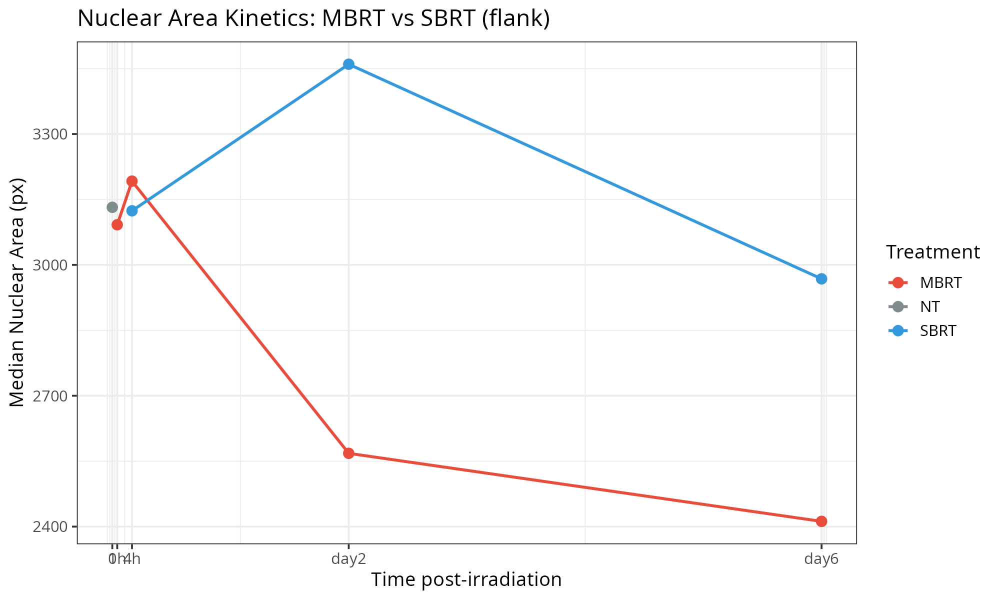 — CosMx cell-segmentation morphology metrics across all flank timepoints. MBRT nuclei progressively shrink from baseline (3192→2568→2412 px median) while SBRT nuclei enlarge at day2 (3460 px) then partially recover (2968 px at day6), yielding 23% MBRT-vs-SBRT nuclear area divergence at day2. Cell area shows the expected SBRT day2 swelling (median 105 vs 82 µm² control) consistent with G2/M arrest-driven hypertrophy at 48h; MBRT cell area is modestly elevated but flat across timepoints. Peak/valley comparison at 4h shows no morphological difference (median 87.6 vs 87.3 µm²), consistent with Harada et al. (J Radiat Res 2025) finding no morphological stripe pattern until 12-16h in minibeam time-lapse imaging. Nuclear condensation in MBRT may reflect apoptosis/pyknosis predominating over arrest-driven swelling — a qualitatively different damage response than SBRT.
- 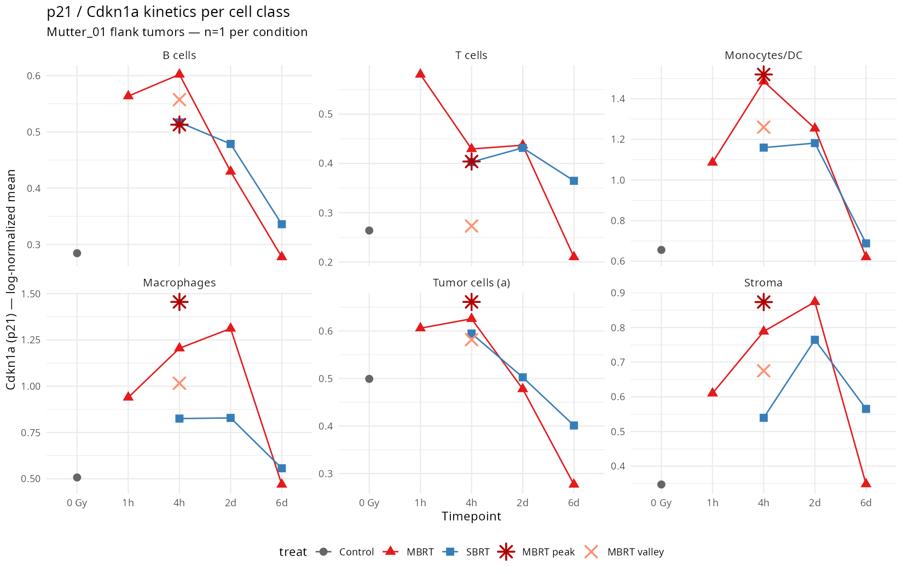 — log-normalized mean Cdkn1a across 0 Gy control, MBRT (1h, 4h, 2d, 6d), and SBRT (4h, 2d, 6d) in six radiobiology-defined cell classes (tumor, macrophages, monocytes/DC, T cells, B cells, stroma). MBRT peak and valley subsets at 4h overlaid as star and cross. Myeloid cells show the largest MBRT-vs-SBRT and peak-vs-valley separation; tumor cells show minimal peak/valley p21 difference despite strong bulk induction.
- 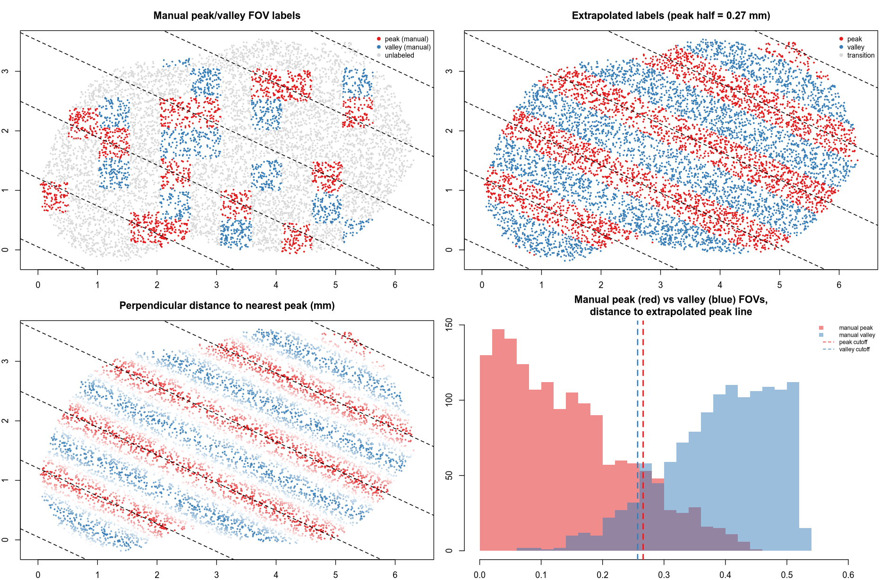 — stripe geometry fit empirically from manual peak FOV centroids: −25° angle from horizontal, 1.046 mm spacing, 0.27 mm beam half-width. Cells labeled by perpendicular distance to nearest peak centerline. 87.5% concordance with manual FOV labels on the labeled subset. Yields 3765 peak + 4235 valley cells across the full tumor, ~5× more than manual FOV labeling. Framework transferable to Mutter_02.
- *MBRT beam geometry dilutes whole-sample DE (method caveat) -- INTERPRETATION RETRACTED 2026-08-16; the count observation stands.* /Retraction (2026-08-16): the causal claim below rests on the clause "spatially-resolved 4h analysis recovered a clear MBRT peak/valley zonation signature". That signature was resolved to an artifact on 2026-07-13: rerunning the rotation-null statistic gives 38 survivors on the retired ImmGen "a" bucket, 7 after swapping to current atlas labels and QC, and 0 genome-wide survivors once aggregated to the FOV replicate unit (paired ~ FOV + zone DESeq2 over 67 paired FOVs; flat p-histogram, frac p<0.05 = 0.046). With its evidence withdrawn, the inference that the weak MBRT bulk signal "reflects beam-geometry dilution, not an absence of response" is unsupported: no dilution has been demonstrated, and the arm-level MBRT reading is a null whose mechanism is unresolved. The gene counts themselves are a real observation and are kept. Note also that the counts quoted are pre-relabel (n=4/condition, before the 2026-08-13 M02 timepoint correction reduced day-2 to n=2/arm) and use the retired ImmGen "a" tumor bucket rather than the locked atlas labels, so they are superseded as numbers even where the observation holds. Spatially-stratified peak/valley DE remains a reasonable thing to want, but it is gated on peak/valley ground truth for M02, which does not exist. Original text kept below for the record; do not cite its conclusion./ Pseudobulk DE understated the MBRT response relative to SBRT in Mutter_02 day2. MBRT delivers dose through ~1 mm-spaced peaks separated by spared valleys, so summing counts across a whole cell type averages directly irradiated peak cells with largely spared valley cells and dilutes the MBRT-vs-Control contrast. In the tumor compartment (ImmGen "a"), MBRT vs Control yielded 5 genes at padj < 0.05 against 127 for SBRT vs Control (DESeq2 ~slide_id+condition with apeglm shrinkage, n=4/condition), even though spatially-resolved 4h analysis recovered a clear MBRT peak/valley zonation signature. The weak bulk MBRT signal reflects beam-geometry dilution, not an absence of response, and argues for spatially-stratified peak/valley DE over whole-sample pseudobulk in the MBRT arms. See [[file:results/aggregate/degs_pseudobulk_m02day2.tsv][degs_pseudobulk_m02day2.tsv]]. /End of retracted text (2026-08-16)./
- *Spatially-variable-gene reframing of the dilution problem (proposed).* The fix for whole-sample dilution is to treat dose position as a continuous spatial covariate rather than a binary peak/valley label. =07_peak_valley_classify.R= already computes a per-cell =dist_to_peak=, the phase within the ~1 mm beam period from the tilt-corrected stripe geometry, then discards it by thresholding to peak versus valley at one quarter of the beam spacing; the binary =FindMarkers= peak-vs-valley test in =08_pv_degs.R= recovered little. Posing the same data as a spatially-variable-gene problem regresses each gene on =dist_to_peak=, or tests spectral power at the known beam frequency by Lomb-Scargle or Fourier analysis along the beam-perpendicular axis, with SpatialDE, SPARK, or Moran's I as model-free checks. This formulation retains every cell's continuous position, so no signal is lost to boundary mis-assignment, it exploits the known ~1 mm period as a prior, and it admits a within-sample permutation null from shuffling cell coordinates, which sidesteps the n=1 biological-replication problem that a group-mean differential test cannot. A null periodicity result is then interpretable as the absence of transcriptional structure at the beam frequency, in contrast to the binary peak-vs-valley null, which conflates absent signal with threshold-induced dilution. See [[file:dev/peak_valley_analysis/07_peak_valley_classify.R][07_peak_valley_classify.R]] and [[file:dev/peak_valley_analysis/08_pv_degs.R][08_pv_degs.R]].
- *MBRT immunostimulation and immature-vascular targeting remain unestablished by current data (mechanism status).* In Mutter_02 day2, whole-sample immune differential expression for MBRT versus Control was near zero across all immune cell types, a consequence of the same beam-geometry dilution, and the MBRT-specific contrast (MBRT versus SBRT) was dominated by Cdkn1a/p21, a cell-cycle-arrest and stress readout rather than immune activation. Canonical activation markers (Cxcl9, Cxcl10, H2-K1, H2-D1, B2m, Tap1, Cd74, Gzmb, Cd80, Cd86, Il12b) are present on the 950-gene panel but largely silent in the MBRT contrasts; an earlier reading that myeloid cells led the MBRT response reflected p21 arrest, not activation. Immature-vascular targeting registered as a weak, non-specific trend only: whole-sample endothelial MBRT versus Control was zero, and on the spatially-resolved Mutter_01 4h peak/valley run (effect size, n=1, not adjusted p) endothelial pan-markers (Pecam1 -0.30, Cdh5 -0.18) and proliferation genes (Ccnd1, Pcna) were modestly lower in peak, compatible with vessel damage at beam peaks but small (|log2FC| <= 0.3), confounded with generic irradiated-cell stress, and uninformative on the diagnostic immature-vessel markers (Dll4, Angpt2, Notch3, Kdr), which fell below detection in the 4h endothelial subset. Both hypotheses are spatial and dose-resolved, so whole-sample pseudobulk is structurally blind to them: averaging peak and valley cells collapses the MBRT versus Control signal toward zero. Panel coverage is adequate for both; the blocker is analysis design, namely per-cell-type un-diluted and peak/valley differential expression, together with improved cell typing, not gene-panel content. See [[file:results/aggregate/degs_pseudobulk_m02day2.tsv][degs_pseudobulk_m02day2.tsv]].
- *ImmGen-only cell typing leaves half the flank cohort unclassified (reference mismatch).* Of the 3.27M-cell flank cohort, 48.5% (1.59M cells) fell into the InSituType de novo "a" bucket, with a further 1.4% in "b". ImmGen is an immune-only reference and cannot classify the roughly half-non-immune 4T1 tumor (epithelium, endothelium, fibroblast, pericyte), and the Mutter_02 tumor compartment in particular was almost entirely unassigned (1.28M of the 1.59M "a" cells). Well-matched single-cell reference mapping typically leaves single-digit to ~15% of cells unassigned, so a 48% rate reflects reference mismatch rather than noise tolerance. We committed to adding a broad off-the-shelf mouse atlas (Tabula Muris Senis, or Mouse Cell Atlas) for the non-immune lineages alongside ImmGen for the immune lineages, applied at the Mutter_01 typing step because Mutter_02 inherits labels by Seurat-anchor TransferData; the malignant identity has no turn-key reference and falls to marker-based assignment.
- *Robustness reanalysis recasts the day-2 arm-level signal as cell-state composition, not per-cell regulation, and revises the MBRT/p21 arrest reading (2026-06-23).* A per-cell-type detection-versus-level decomposition (limma empirical-Bayes on the per-sample expressing-fraction and on the per-expresser level, n=4, Benjamini-Hochberg within cell type by contrast, with a two-count per-expresser floor below which the level is uninterpretable) now classifies every differential-expression result as regulation, fraction_shift, or ambiguous. The SBRT collagen and Acta2 fibrosis program classifies as fraction_shift — significantly more cells expressing with no significant change in per-expresser level — so the strong pseudobulk collagen signal is a shift in stromal cell state, not per-cell upregulation. A pre-registered fibroblast resting-versus-activated split (UCell on on-panel markers gated by a Col5a1/Col5a3 smooth-muscle-specificity anchor; gate passed, 313,088 activated of 732,099 fibroblasts, anchor enrichment 2.6 times) shows the activated-myofibroblast proportion trending up in SBRT versus Control (+0.51 logit) but not significant at n=4 (padj 0.59): the fibrosis signal is myofibroblast expansion, directionally coherent but underpowered to confirm in this cohort. SBRT tumor cells show Ccnd1, Hmgb2 and Mki67 up as fraction_shift with Cdkn1a/p21 down — a proliferative-regrowth skew of p53-mutant 4T1 survivors at 48h, not arrest; this revises the earlier "MBRT-versus-SBRT dominated by p21 equals arrest" reading, since in a p53-null tumor p21 is the proliferation correlate (high in quiescent cells), and at this panel's sparsity p21 is formally ambiguous (detection drops but the roughly 1.4-count per-expresser level is too sparse to separate fraction from regulation), correcting an earlier pooled-log-normalized "fraction shift" claim. The 33% stroma_unresolved is shown non-confounding (arm-stable fraction, no labelled-type call flips with versus without it), and the STING gene set is demoted from independent immune evidence (two of its three on-panel genes are shared with the interferon sets). MBRT remains null at whole-compartment scale. Methods and decisions in plan-differential-robustness.md, informed by a four-lens devils-advocate panel and a deep-solo spec critique. See [[file:results/aggregate/results_master.tsv][results_master.tsv]].
- *Per-cell smiDE DE reveals MBRT is NOT null; three coherent programs emerge (2026-08-14) -- RETRACTED 2026-08-16.* /Retraction (2026-08-16): the smiDE run behind this bullet was configured without two things the method's authors require, a pre-test gene filter on the segmentation-contamination overlap ratio and a spatial random effect. Vasconcelos et al., Genome Biology 2026 (PMC12882255) benchmark a spatially-blind model's type I error at 0.86 to 0.95, against roughly 0.05 to 0.07 with the spatial term, so every hit count and adjusted p-value below carries an uncontrolled false-positive rate and none of them are reportable. The same configuration was applied to a between-animal arm contrast, which the method is neither designed nor benchmarked for; its authors recommend per-sample fits combined by meta-analysis for cross-sample comparisons, so sample-level pseudobulk is the structurally correct arm-level estimator and this bullet does NOT supersede the pseudobulk bullets above. What replaces it: sample-level pseudobulk is the confirmatory arm-level inference (DESeq2 at day 2, slide-blocked moderated-t by limma-voom at 4h, where the cohorts run at 2 to 3 residual degrees of freedom); a corrected higher-resolution analysis carrying both fixes, with cells as observations, fitted within slide and combined across slides by fixed-effect meta-analysis (replication: the 2 to 3 slides), is the exploratory layer, for effect sizes and ranking only; and the intermediate screen mode, which applies the gene filter but no spatial term and fits cells as observations under a sample-level random intercept (replication: nominally samples, 2 to 4 per arm, variance component poorly estimated), is candidate generation feeding the spatial stage and must never be quoted on its own. Note on wording, which the headline of this bullet gets wrong: "per-cell" is the method's shorthand for the observation unit, not the replication unit, so a phrase like "per-cell resolution" never licenses an inferential claim. The per-cell output files from the invalid runs were archived off the results tree on the compute host to =/mnt/data/projects/spatial-rads/archive/invalid_smide_2026-08-16/= (two files) so they cannot be silently consumed. Original text kept below for the record; do not cite it./ Genome-wide per-cell NB GLMM via smiDE/nebula (neighbor-expression covariate for segmentation error, sample RE for pseudoreplication) recovers 1,360 MBRT_vs_Ctrl hits at padj < 0.05 versus near-zero in pseudobulk DESeq2. The MBRT day-2 signature is SASP/senescence (11/17 canonical SASP genes across multiple cell types), early fibrosis (collagens in 5-6 cell types, weaker than SBRT), and immunosuppressive shift (Arg1/Tigit UP, H2-Aa/Ifi27 DOWN), the opposite of immunostimulation. Cdkn1a/p21 resolved: MBRT_vs_SBRT in 6 cell types, but the signal is SBRT driving p21 DOWN (proliferative regrowth) more than MBRT driving it UP. Concordance with pseudobulk: Spearman ~0.57, 299 shared hits, 4,999 smiDE-only. Contamination caveat: smiDE-only hits have higher overlap ratios (median 1.28 vs 0.88). Lipid-metabolism genes (Fabp5, Cyp2u1, Ptgs1, Ldlr, Pparg UP; Srebf1 DOWN) converge with independent MALDI lipidomic imaging (Pandey lab, 4h) showing MUFA enrichment and LPI accumulation under MBRT. Supersedes the "MBRT immunostimulation unestablished" and "beam-geometry dilution" bullets above: per-cell modelling resolves the pseudobulk dilution problem and the MBRT response is immunosuppressive, not null. See [[file:results/aggregate/results_master.tsv][results_master.tsv]]. /End of retracted text (2026-08-16). The supersession asserted in the previous sentence is withdrawn, and the MBRT arm-level reading reverts to the pseudobulk result. Note that the two bullets it claimed to supersede do not both stand either: the beam-geometry dilution bullet had its interpretation retracted the same day, because the peak/valley zonation signature it rested on was resolved to an artifact in 2026-07. So the arm-level MBRT position is a null with an unresolved mechanism, neither rescued by cell-level modelling nor explained by dilution. Flagged additionally as an OVERCLAIM (2026-08-16), over and above the retraction: "per-cell modelling resolves the pseudobulk dilution problem" reads the pseudobulk MBRT null as a power artifact exposed by a cell-level test, which the corrected inference-unit reading does not support. The screen's replication unit is nominally the sample with a poorly estimated variance component, so its excess hits measure anticonservatism rather than added resolution, and no pseudobulk null may be restated as underpowered on the strength of a screen-mode hit count./

** README

*** Prerequisites and setup
*** Change log
:PROPERTIES:
:ID:       2dc86037-02c7-4b51-b806-43dcc1bc1e9f
:END:
- [2026-07-13 Sun] Audited then rebuilt the M01 4h peak/valley signature and found it NULL under honest statistics, overturning the "real 37-gene peak signature" that the whole MBRT spatial-dilution reframe rested on. Retired two stale plans (=plan-outcomes-de.md= seed, =plan-mbrt-signatures.md= failed VM run); wrote =plan-m01-peak-valley-signature.md= (adjudicated by a 3-lens panel: spatial-omics/radbio/biostat) + =plan-m02-signature-replication.md= skeleton. Rebuilt the signature on current QC'd sam0003 + merged-scale atlas labels as paired FOV×zone pseudobulk (=~ FOV + zone= limma-voom AND DESeq2, core bands): *0 genes at FDR<0.05 in all-cells (39 FOVs), tumor (23), stroma (31), flat p-histograms; positive control tumor-vs-stroma 586/940 at FDR, proving the pipeline detects real spatial biology*. Immune underpowered (8 FOVs), inconclusive. The old per-cell FindMarkers myeloid signature (Ccl8/Cd163/Mrc1) was pseudoreplication (~150k cells as fake replicates); flat/valley-leaning under honest replication, spurious in direction AND significance. No cell-type composition shift either (paired per-FOV fractions p=0.88/0.27/0.35). Two verified figures added to =** Results= (Post-IR dynamics): 5-panel p-histogram grid + composition boxplots. Demoted the rotation-null 37-gene MHC-I result from Key Results to a CONTESTED idea-node (B2m/H2-K1 sign-flip vs the FOV test; the two methods differ on 4 axes) and wrote =plan-rotation-null-reconcile.md= (isolate confounds → swap rotation-null for phase-null). Method precedent verified via Scopus: FOV-pseudobulk region DE = GeoMx DSP (Merritt 2020 Nat Biotech platform; standR/Liu 2024 NAR tool), NOT Niche-DE. =CLAUDE.md=, memory =project_mbrt_mechanism_status= + new =reference_fov_pseudobulk_precedent= updated. Commits 786187d (result+figs), aa7832f (reconcile plan). Moved the "always open Emacs in a new frame" rule to global CLAUDE.md.
- [2026-07-12 Sun] Split the monolithic =aggregate.smk= into two literate, org-tangled workflows at the cell-typing/differential seam, mirroring the =data_model.smk= / =preprocessing.smk= rework: =aggregate_typing.smk= (15 rules: merge → recover_negprobes → scVI/GPU integration → Leiden cluster-then-annotate → tier-2 SingleR/UCell + marker rescue → =unify_labels=; terminus =full_labels.parquet= + =merged.rds=) and =aggregate_differential.smk= (21 rules: composition, pseudobulk DE + GSEA, UCell pathway scores, niches, mixing, myeloid, concordance, sub-state, QC confound checks; consumes =full_labels.parquet= / =merged.rds= / =full/obs.parquet= as pre-existing leaf inputs; terminus =results_master.tsv=). Pure reorganization — every rule body, output-path value, and invoked script preserved byte-identical (whole-branch review: 184/184 resolved paths conserved, 36-rule partition exact, seam handoff byte-matched); the only deltas are the header rewrite, =D_=/=R_= path constants, =message:= tags, and the three-file handoff constants. Both files tangle from existing prose headings (=Aggregate atlas cell typing= → typing; =Cross-dataset aggregate= → differential); the old =aggregate.smk= was retired (=git rm=). Executes Step 7 (literate transfer) of =plan-aggregate-refactor.md= as a two-file split rather than the originally-specified single file, motivated by the biological seam (typing is one-time structural; the differential + future peak/valley layer only consume labels). Caveat carried forward: the typing DAG has not been run end-to-end as a pipeline (heavy intermediates absent on disk; current labels are the hand-run 2026-06-22 artifacts) — reproducing them from empty needs the GPU rebuild. =CLAUDE.md=, =plan-aggregate.md=, =plan-aggregate-refactor.md= updated.
- [2026-07-10 Fri] Added published imaging-ST QC metrics (SpatialQM / Plummer et al. Nat Biotechnol 2025) as report-only pipeline steps ([[file:plan-qc-metrics.md][plan-qc-metrics.md]]) — a confound check on the day-2 =fraction_shift= result. Vendored the metric algorithms (NOT the GitHub-only package + its 6 heavy Bioconductor deps) into =scripts/aggregate/spatialqm_metrics.R= (=sqm_sparsity/sqm_snr/sqm_specificity_fdr=, transcribed verbatim from pinned commit 36e1a59d4ca3; the specificityFDR reproduces exactly from summary counts). New org-tangled =preproc_sample_metrics= rule → per-sample =sample_tech_metrics.tsv= (TPC/features/sparsity/SNR/specificityFDR; negprobe background recovered exactly from =propNegative= + =nCount_RNA=, no raw-RDS re-read); new hand-authored =agg_qc_arm_balance= + =agg_qc_reproducibility= rules → =qc_arm_balance.{tsv,png}= + =qc_reproducibility.{tsv,png}=. Result (M02 day-2): 5/6 metrics BALANCED across Control/MBRT/SBRT (SBRT neither more sensitive nor more contaminated; the lone FDR flag immaterial — SBRT cleanest), per-arm pseudobulk concordance 0.94–0.97 with 0 outlier slides and no arm-separating PCA axis — the composition shift is NOT a QC artifact. Dropped entropy/complexity/dynamic-range (Tier-C + BioQC/gene-order hazards); TPN/FTC not computable (no transcript coords). =CLAUDE.md=, =plan-preprocessing.md=, =plan-mbrt-vs-sbrt.md= cross-refs updated.
- [2026-07-10 Fri] Split the per-sample pipeline into an invariant =preprocessing.smk= (adapter → QC filter → LogNormalize + report-only QC; style-guide compliant: =preproc_= rule prefix, D_/R_ path constants, message directives, scripts as =input:= deps, strict-mode + BLAS =shell.prefix=) and DELETED per-sample cell typing + pathway scoring (5 rules + scripts) — canonical typing is cohort-scale. Per-sample terminus is now =norm.rds=; re-pointed the aggregate merge =scored.rds=→=norm.rds= (=merge.R/merge_pilot.R/coords_necrosis.R/recover_negprobes.R= + the aggregate-workflow expands) and removed the vestigial per-sample =cell_type= requirement (=full_export.R= stopifnot + obs write nulled; =merge.R= meta_cols), nulling the integration-QC benchmark label (re-base on merged labels at the next aggregate rebuild). Fixed a latent =probe_qc.R= bug the fresh run exposed (M01 gene means now read from the per-slide RDS, not the =counts_path= parquet the 2026-06-22 rds re-base set to NA). Full run verified end-to-end (51/51 steps, 23 =norm.rds=, all report-only QC); both dry-runs clean. Consolidated docs: wrote [[file:plan-preprocessing.md][plan-preprocessing.md]] absorbing + deleting =plan-processing-pipeline.md= and =plan-mutter01-controls.md=; marked =plan-pathway-genesets= Phase 2 absorbed; refreshed the Plan status ledger + Plans index; redirected broken =CLAUDE.md= links. Branch =preprocessing-split=.
- [2026-06-22 Mon] Made the aggregate typing (now =aggregate_typing.smk=) reproducible (=plan-aggregate-refactor.md= Steps 1–5): wired the real scVI cluster-then-annotate chain replacing the dead InSituType rules, authored the missing =full_scvi.py=; the full 3.27M-cell rebuild reproduced the locked labels BIT-IDENTICALLY (all four Q4 gates pass; every coarse + tier-2 subtype count matches). Built the M01/M02 integration-QC figures (paired unintegrated-vs-scVI UMAP + per-cluster M01/M02 composition bar + atlas). Reframed the MBRT-vs-SBRT analysis after a 4/4 devils-advocate panel: the arm-level MBRT "null" is spatial DILUTION (the real M01 4h peak signature — 37 genes, MHC-I/IFN/damage — averaged out across the valley volume), not biological absence; wrote [[file:plan-mbrt-vs-sbrt-reanalysis.md][plan-mbrt-vs-sbrt-reanalysis.md]] + impl checklist, keeping all 3 contrasts effect-size-forward, symmetric panel coverage, a detectability table, no "sparing" language; resolving spatial gated on M02 peak/valley staining + the MBRT dose physics. Harmonized the plan docs (=plan-mbrt-vs-sbrt.md= run-record banner, the two spatial seeds, =plan-pathway-genesets-impl.md= status), =CLAUDE.md=, and the =project_mbrt_mechanism_status= memory.
- [2026-06-22 Mon] Added report-only contamination QC to =processing.smk= (=contamination_qc= rule + =scripts/contamination_qc.R=, tangled from org): SpatialQM MECR marker-bleed metric over =config/lineage_markers.yaml=, per-sample + per-FOV with necrosis/mixed-biology triage columns; FastReseg infeasible (no transcript coordinates delivered); cohort clean (MECR medians M01 0.030 / M02 0.021; 5/2469 FOVs flagged). Re-based =adapt_mutter01.R= onto the 4 per-slide RDS (M01 now ingests RDS like M02; counts verified byte-identical across all 11 samples, invariance PASS) and flipped the data model to =format=rds=; =recover_negprobes= retirement + the frozen-seed aggregate rebuild remain deferred. Swapped the panel source doc to =data/sources/2026-06-22-bruker-mouse-ucc-gene-list.xlsx= (Bruker LBL-11176-04; adds a Ligand-Receptor Pairs sheet; gene/annotation content identical). Wrote [[file:plan-aggregate-refactor.md][plan-aggregate-refactor.md]] (devils-advocate-restructured: quarantine the dead aggregate InSituType rules + lock =full_labels.parquet=, bounded best-practice investigation, descoped literate transfer); deleted the spent =plan-mbrt-vs-sbrt-impl.md=. Decisions later resolved same day to =A2 full re-wire= / decision-forcing best-practice review / =C1= literate, harmonized into a seven-step plan (audit → method shoot-out → wire DAG → full rebuild → re-validate → refresh =results_master.tsv= → literate); synced the gap memory note, =CLAUDE.md=, and =plan-aggregate.md= (new v2.6 banner). Ground-truthing added two findings: =obs.parquet= is a second orphan input and the full-run scVI step is untracked (no =full_scvi.py=).
- [2026-06-15 Mon] Mutter_01 re-delivered as raw per-slide Seurat RDS (negprobes + falsecode assays; Yi confirmed M01 is MC-SOLVE-processed, so only the raw object exists). Validated bit-identical to the parquet — =nCount_negprobes= and =nCount_RNA= 0 disagreements across all 4 slides, 987-FOV crosswalk each → 1 sample — so the locked aggregate is invariant and was not re-run. Added report-only =control_qc= rule (=processing.smk=): negprobe+falsecode characterization across both cohorts, a per-cell control sidecar (=cell_controls.parquet=, 4.2M cells), and a flag-only per-FOV falsecode QC (3-MAD; 146/2572 FOVs; =fov_falsecode_qc.tsv=); =propNegative= kept negprobe-only. Full raw-RDS adapter re-base deferred to the next aggregate rebuild (staged-sidecar decision via devils-advocate panel). See [[file:plan-mutter01-controls.md][plan-mutter01-controls.md]].
- [2026-06-02 Tue] Aggregate cross-dataset cell typing executed and locked. Full-cohort scVI integration (3,277,090 cells); coarse cluster-then-annotate at res=3.0 passed all four Q4 gates (tumor 48.1% / stroma 40.6% / immune 11.2%, 4 unassigned; scaled iLISI 0.67). Tier-2 immune SingleR/ImmGen with marker rescue (=tier2_immune_rescue.py=): macrophages 300,975 (81.8%), ILC 34,340, T 16,046, DC 5,315, NK 4,991, plasma 3,573, mast 1,121, neutrophils 259 (+1,180 epithelial contamination); B cells near-absent (biological, not panel- or clustering-driven). Tier-2 stroma UCell against =lineage_markers.yaml= with the same identity-marker rescue (=tier2_stroma_rescue.py=): fibroblast 732,099, stroma_unresolved 441,227, smooth muscle 72,124, adipocyte 49,214, endothelial 36,937 (pericyte 0, unresolvable de novo). All three tiers joined by =unify_labels.py= into the canonical per-cell table =results/aggregate/full_labels.parquet= (3,277,090 rows). Aggregate profiles diverge markedly from Yi's original M01 ImmGen typing, which is superseded. Writeup under [[*Aggregate atlas cell typing][Aggregate atlas cell typing]]; see [[file:plan-aggregate.md][aggregate plan]] v2.5.
- [2026-06-01 Mon] Aggregate cross-dataset integration pilot complete → *scVI selected over Harmony*. Two-slide bake-off (M01 sld0002 + M02 sld0005, 50k-cell scIB benchmark): cluster-then-annotate premise PASSED on all embeddings (3/3 coarse compartments, markers above the negprobe floor); scVI scaled iLISI 0.71 vs Harmony 0.20 (Harmony fails the ≥0.5 mixing gate) with best biology preservation (silhouette-label 0.46). Confirms documented imaging-spatial precedent (scVI > Harmony) and validates the v2.3 pivot off per-cell InSituType (which failed at 85% tumor). A GPU (NVIDIA RTX A4000 16 GB) was found on jeff-beast → scVI trains GPU-direct (no CPU sketch-train). Full-cohort scVI integration (3.27M flank cells) launching. Scripts `scripts/aggregate/pilot_{export,scvi,harmony,compare}.*`; see [[file:plan-aggregate.md][aggregate plan]] v2.4 "Pilot results".
- [2026-05-30 Sat] Reproducible per-sample pipeline complete: `processing.smk` produces 23 scored.rds across both datasets (adapter → QC → normalize → cell typing → pathway scoring). M02 cell typing switched from InSituType (collapsed tumor compartment into 38% Lymphatic.endo sink under cross-dataset batch shift) to Seurat anchor TransferData against a 20k pooled-M01 cell reference; validated by marker concordance (Krt8+/Epcam+ → tumor compartment 64-71% across all 12 M02 samples). Cell-typing/pathway/probe-QC layer folded into literate org with `shell.prefix` BLAS pinning + per-rule `threads: 1` baked in. See [[file:plan-processing-pipeline.md][processing pipeline plan]]; next session builds the [[file:plan-aggregate.md][aggregate workflow]].
- [2026-03-11 Tue] Layer 3 peak/valley stripe detection: established 15-deg tilted stripe model with 1.02mm spacing and 4 peaks from H2AX image geometry. Transcript-based p21 validates peak > valley. Pending visual confirmation of zone overlay.
- [2026-03-11 Tue] Layers 1-2 complete and committed: QC (971K cells), clustering (9 clusters), cell type validation, DEGs (2160 bulk + 2534 per-cell-type), pathway kinetics, composition, spatial NN analysis.
- [2026-03-11 Tue] Initial project setup: data model, experimental design metadata, exploratory analysis migration from career.org.
** Project Map
:PROPERTIES:
:ID:       8a364857-4350-4c1a-9cc9-7a1614dca51d
:END:

Forward-looking dashboard for this project. Convention defined under [[id:f9628d19-7816-45ba-aef4-a9ab766aaf3f][sci_proj_repo Project Map]]. Headline findings and named outputs live in [[id:af3003a4-dc06-4a49-8edf-c6660829cf13][Key results]]; past dated progress lives in [[id:2dc86037-02c7-4b51-b806-43dcc1bc1e9f][Change log]].

*** Visualization

#+begin_src dot :file resources/media/project-map.svg :results file :exports results
digraph spatial_rads {
  rankdir=TB;
  ranksep=0.40;
  nodesep=0.45;
  fontname="Helvetica";
  bgcolor="white";
  node [shape=box, style="rounded,filled", fontname="Helvetica", fontsize=11,
        penwidth=1.4, margin="0.20,0.12", color="#90a4ae", fillcolor=white];
  edge [fontname="Helvetica", fontsize=9, color="#546e7a", arrowsize=0.8];

  // Role palette (fill / border): input #e3f2fd/#1565c0 · complete #e8f5e9/#2e7d32 · ongoing #fff8e1/#f9a825

  // --- INPUTS (blue): study design + peak/valley ground truth ---
  design [shape=plaintext, label=<
    <TABLE BORDER="0" CELLBORDER="1" CELLSPACING="0" CELLPADDING="5" COLOR="#1565c0">
      <TR><TD COLSPAN="6" BGCOLOR="#1565c0"><B>Study design</B> &#183; 4T1 flank &#183; MBRT vs SBRT vs Control</TD></TR>
      <TR>
        <TD BGCOLOR="#e3f2fd"></TD>
        <TD BGCOLOR="#e3f2fd"><B>1h</B></TD>
        <TD BGCOLOR="#e3f2fd"><B>4h</B></TD>
        <TD BGCOLOR="#e3f2fd"><B>day 2</B></TD>
        <TD BGCOLOR="#e3f2fd"><B>day 6</B></TD>
        <TD BGCOLOR="#e3f2fd"></TD>
      </TR>
      <TR>
        <TD ALIGN="LEFT" BGCOLOR="#f5faff"><B>Control</B></TD>
        <TD BGCOLOR="#f5faff"></TD>
        <TD BGCOLOR="#f5faff"></TD>
        <TD BGCOLOR="#90caf9"><B>4</B></TD>
        <TD BGCOLOR="#f5faff"></TD>
        <TD BGCOLOR="#fafafa">0h: 1</TD>
      </TR>
      <TR>
        <TD ALIGN="LEFT" BGCOLOR="#f5faff"><B>MBRT</B></TD>
        <TD BGCOLOR="#f5faff">1</TD>
        <TD BGCOLOR="#f5faff">1</TD>
        <TD BGCOLOR="#90caf9"><B>4</B></TD>
        <TD BGCOLOR="#f5faff">1</TD>
        <TD BGCOLOR="#fafafa"></TD>
      </TR>
      <TR>
        <TD ALIGN="LEFT" BGCOLOR="#f5faff"><B>SBRT</B></TD>
        <TD BGCOLOR="#f5faff"></TD>
        <TD BGCOLOR="#f5faff">1</TD>
        <TD BGCOLOR="#90caf9"><B>4</B></TD>
        <TD BGCOLOR="#f5faff">1</TD>
        <TD BGCOLOR="#fafafa"></TD>
      </TR>
      <TR><TD COLSPAN="6" BGCOLOR="#f5faff">n=1 kinetic series (971K cells) &#8195; <B>n=4/arm</B> day-2 replicated inference (2.35M cells)</TD></TR>
    </TABLE>>];

  node [fillcolor="#e3f2fd", color="#1565c0"];
  h2ax [label="H2AX peak/valley ground truth\nsingle 4h block"];

  // --- ANALYSIS COMPLETE (green) ---
  node [fillcolor="#e8f5e9", color="#2e7d32"];
  preproc    [label="Preprocessing\nharmonize panel · QC · normalize\n+ report-only technical QC"];
  agg_typing [label="Merged-scale cell typing\n3.28M cells · scVI + Leiden, cluster-then-annotate\ntumor / stroma / immune + subtypes\nLOCKED"];
  pv_class   [label="Peak/valley classification at 4h\n(H2AX-anchored)"];
  tumor_sig  [label="Tumor peak/valley signature\nRESOLVED: artifact (cell-label/QC +\npseudoreplication); no dose-driven signal"];
  finding    [label="Day-2 signal = SBRT stromal fibrosis\n(myofibroblast expansion; propeller composition)\nMBRT null at whole-compartment scale"];

  // --- ANALYSIS ONGOING (amber) ---
  node [fillcolor="#fff8e1", color="#f9a825"];
  agg_diff [label="MBRT vs SBRT vs Control differential\n6 pre-registered hypotheses (frozen registry)\npseudobulk DE (DESeq2 + limma-voom cross-check) · GSEA-gated pathway (UCell)\nmuscat differential-detection · composition / niches / mixing (propeller)\npooled-BH primary + gatekeeping / IHW auxiliary · n=4 at day-2"];
  m01_pv   [label="Kinetic-cohort signature rebuild\non current labels (descriptive, n=1)"];
  m02_pv   [label="Replication in day-2 cohort\n(gated on stripe re-detection)"];
  paper    [label="First-in-field MBRT vs SBRT spatial paper"];

  // Main pipeline
  design     -> preproc;
  preproc    -> agg_typing;
  agg_typing -> agg_diff;
  agg_diff   -> finding;
  finding    -> paper;

  // Peak/valley branch
  h2ax       -> pv_class;
  agg_typing -> tumor_sig [label="labels"];
  pv_class   -> tumor_sig;
  tumor_sig  -> m01_pv;
  m01_pv     -> m02_pv;
  m02_pv     -> paper;
  tumor_sig  -> paper;

  {rank=same; design h2ax}
  {rank=same; agg_diff tumor_sig}
  {rank=same; finding m01_pv}

  // --- Legend: 3 roles ---
  lg_in   [label="inputs / data",     fillcolor="#e3f2fd", color="#1565c0", fontsize=9, margin="0.10,0.05"];
  lg_done [label="analysis complete", fillcolor="#e8f5e9", color="#2e7d32", fontsize=9, margin="0.10,0.05"];
  lg_on   [label="analysis ongoing",  fillcolor="#fff8e1", color="#f9a825", fontsize=9, margin="0.10,0.05"];

  {rank=sink; lg_in lg_done lg_on}
  finding  -> lg_in [style=invis];
  lg_in -> lg_done -> lg_on [style=invis, minlen=0];
}
#+end_src

*** Current focus

Cross-timepoint MBRT vs SBRT is the primary thread (broader, transferable, where the energy is going next). On Mutter_01 it's comprehensive; the next push is to extend it to the full Mutter_02 cohort once Yi's insitutype cell typing lands, giving us proper replicates and statistical inference. Cell morphology kinetics is the active fresh angle. Peak/valley is a focused side branch — interesting MBRT-specific tumor signature but bounded to 4h because H2AX ground truth exists only for Block_21.

*Maturity*: all analyses are currently =[dev]= — exploratory =dev/= scripts. No =[tangled]= or =[smk]= production wrappers yet; per CLAUDE.md, Snakemake is deferred until analyses stabilize and Mutter_02 replicates arrive. The maturity ladder is =[dev]= → =[tangled]= (org→scripts/) → =[smk]= (Snakemake-orchestrated) → =[frozen]= (deliverable snapshotted, git-tagged).

*** Project foundation

- [[id:ba78a9a7-f35f-478e-b47d-44e60ef306b2][Biological model]] — 4T1 flank tumor model, MBRT (microbeam) vs SBRT (uniform), timepoints 1h / 4h / d2 / d6, peak/valley anatomy from H2AX IHC ground truth on Block_21
- Data model — =metadata.xlsx= as single source of truth, preprocessed into =data/data_model.rda= via =make_data_model.R=; subjects / samples / sequencing schema

*** Branches

**** Cross-timepoint MBRT vs SBRT (primary thread)

- =[dev]= [[id:49023d4a-a8ef-489d-811c-e0d902927cc3][Comprehensive MBRT vs SBRT on Mutter_01 (4T1 flank, all timepoints)]] — *goal*: full MBRT vs SBRT comparison — DEGs, pathways, composition, spatial NN, cell death, necrosis — across 1h/4h/d2/d6 · *deps*: Mutter_01 flank-only filtered, 4T1 purity filter applied · *status*: IN PROGRESS · *blockers*: none
- =[dev]= *Cell morphology kinetics* (no dedicated heading yet) — *goal*: morphological readouts MBRT vs SBRT across all flank timepoints (nuclear & cell area) · *status*: IN PROGRESS (added 2026-04-23) · *blockers*: none
- =[dev]= [[id:908fd83a-16ee-4ca5-9e2f-074d015b652d][Mutter_02 cell typing + normalization]] — *goal*: insitutype cell-type labels + LogNormalize on Mutter_02 · *deps*: Yi Liu's insitutype run · *status*: pending Yi; marker-based fallback in use · *blockers*: Yi's pipeline output
- =[dev → planned]= *Full Mutter_02 MBRT vs SBRT comparison* — *goal*: rerun the comprehensive comparison on Mutter_02 with insitutype labels and proper biological replicates (3 per condition); enables statistical inference · *deps*: Mutter_02 cell typing above · *status*: NEXT · *blockers*: Mutter_02 cell typing

**** Peak/valley (focused side branch, 4h-bound)

- =[dev]= [[id:def10c5f-06d2-4313-850b-e37e55933b6a][Peak/valley classification at 4h]] — *goal*: stripe-geometry classification on the one MBRT 4h block with H2AX ground truth (Block_21) · *deps*: H2AX IHC Block_21 only · *status*: DONE · *limit*: cannot transfer across timepoints without additional H2AX-anchored blocks
- =[dev]= [[id:945d9096-1a17-4b99-acfd-058f606cbd24][Tumor peak/valley signature: RESOLVED to artifact (2026-07-13)]] · *goal*: is there an MBRT-specific tumor peak/valley transcriptional signature at 4h? · *deps*: peak/valley stripe model above · *status*: RESOLVED. The 37-gene signature is a label/QC plus pseudoreplication artifact; no dose-driven peak/valley signal survives (=plan-rotation-null-reconcile.md=, Steps 0-2) · *limit*: 4h, Block_21 only, n=1. Two defensible methods gave opposite answers on the SAME data. (1) /Within-block rotation null/ (=dev/if_channel_check/pv_rotation_null.R=): real stripe geometry rotated to 175 random angles, per-gene peak/valley delta versus rotated-null sd; 37/670 tumor genes survive (empirical p<0.05, |delta|>2×null sd), dominated by MHC-I (B2m, H2-K1, H2-D1), IFN (Ifitm2), damage/stress. This is the basis of the "real peak signature" framing in =plan-mbrt-vs-sbrt-reanalysis.md= and =project_mbrt_mechanism_status=. (2) /FOV-pseudobulk group-mean DE/ (2026-07-13, sam0003 current QC'd counts + atlas labels): cells pooled to paired FOV×zone pseudobulk, =~ FOV + zone= via limma-voom and DESeq2, core bands (dist<0.10 peak / >0.40 valley). Result: *0/891 genes at FDR<0.05 in tumor, 0 in stroma; flat p-histogram (frac p<0.05 near 0.05); immune underpowered (8 FOVs)*. The canonical MHC-I genes run flat-to-valley here (B2m −0.24, H2-K1 −0.23), not peak-up. Positive control (tumor versus stroma, same machinery) gives 589/950 at FDR<0.05, min padj 7e-57, so the pipeline detects real spatial biology when present. The two disagree because they test different nulls: rotation preserves every cell's continuous position and asks whether a small consistent shift exceeds an architecture-rotated null; group-mean demands the shift exceed FOV-to-FOV variance. *RESOLVED 2026-07-13 (=plan-rotation-null-reconcile.md=, Steps 0-2, on beast).* The rotation null was never the culprit: rerunning its own statistic on the retired ImmGen =a= bucket reproduces 38 survivors (the "~37"), but swapping to current atlas tumor cells + current QC collapses that to 7 (the IFN module Ifitm2/3/Ifi27/Oas1a-g falls to zero-spanning bootstrap CIs; MHC-I splits, H2-D1 holds but B2m shrinks and H2-K1 collapses), and aggregating those 7 to the FOV replicate unit (paired =~ FOV + zone= DESeq2, 67 paired FOVs, plus a continuous phase regression at the FOV unit) drives genome-wide survivors to *0*, flat p-histogram (frac p<0.05 = 0.046). So the 37 genes die in two stages: cell-label + QC swap kills the inflammatory program, pseudoreplication kills the residual. A phase null was shown geometrically futile up front (tumor spans ~4.9 beam periods, p-floor ~0.2-0.47), so it was skipped. The lone near-miss is Clu (within-FOV peak-up 0.23 but padj 0.084, null phase slope), a single-gene lead, not the claimed MHC-I/IFN signature; proliferation genes even trend peak-DOWN. Reconciliation figure at =dev/if_channel_check/pv_reconcile_figure.png=. Relates to the continuous SVG reframing (=plan-svg-v2.md=), the principled next escalation (regress on =dist_to_peak=, spectral/Moran's test) if a still-more-powerful test is ever wanted.
- =[dev → planned]= [[id:d6be2ccf-1371-4fac-baf0-89e2c983a9e6][Peak/valley signature projection Mutter_01 → Mutter_02]] — *goal*: project the signature into Mutter_02 for persistence + validation · *deps*: Mutter_02 cell typing · *status*: orchestrator + plan + reviewer scaffolded for autonomous VM run; UCell scoring chosen · *blockers*: Mutter_02 cell typing · *limit*: still bounded by ground-truth-at-4h-only; tests persistence, not whether peak/valley structure exists at other timepoints

**** Past

- QC + landscape (DONE 2026-03-11): 971K cells post-QC, 9 clusters, cell type validation
- MBRT vs SBRT kinetics, condensed (DONE 2026-03-11, superseded by comprehensive version above): 2160 bulk DEGs, 2534 per-cell-type DEGs, pathway kinetics, composition, spatial NN
- Mutter_02 FOV-to-condition mapping (RESOLVED 2026-04-09 per Jenn Fazzari): 0 Gy / MBRT 2d / SBRT 20 Gy 2d per slide; all samples at 2-day timepoint
- VM autonomous-run hardening (2026-04-10): jsonl observability for headless =claude -p=, max-budget-usd guard, launcher conda init, PROJECT_DIR_ESC escape fix

*** Open decisions

- *Radiation dose parameters*: MBRT peak dose in Gy, SBRT matched dose, valley-to-peak ratio, fractionation. Not yet confirmed in reviewed Gmail threads. Needs clarification with Rob Mutter before methods-section writing.
- *Tongue series for v1 paper*: Mutter_01 tongue series (TNG-/NTB- blocks, S3) currently excluded from peak/valley analysis; immune-dominated composition, tumor model not yet confirmed. Decision deferred until Rob/Yi confirm cell-line identity.
- *Han Evelyn abscopal cohort*: 2025-12-20 proposal to add abscopal tumors in a future cohort. Out of scope for v1; flag for v2.

*** Recent progress

See [[id:2dc86037-02c7-4b51-b806-43dcc1bc1e9f][Change log]] for full detail (Change log is currently sparse; recent activity is better tracked via =git log= until the project-map skill backfills entries). Headline items, past 6 weeks:
- Cell morphology kinetics analysis: MBRT nuclei shrink, SBRT nuclei swell at day2 (23% divergence); peak/valley shows no morphological difference at 4h (consistent with Harada et al. 2025)
- Tumor peak/valley signature RESOLVED to artifact (2026-07-13, see Peak/valley idea-node): the rotation null's 37/670 genes (MHC-I/IFN/damage) are an artifact of the retired ImmGen =a= bucket + old QC + per-cell pseudoreplication. Rerunning the rotation-null statistic gives 38 survivors on the =a= bucket, 7 on current atlas tumor + QC, and 0 once aggregated to the FOV replicate unit; the honest within-FOV test is a flat p-histogram. No dose-driven peak/valley signal survives (lone near-miss Clu, a single gene).
- Cell-level peak/valley label extrapolation from manual FOVs: stripe geometry -25 deg, 1.046 mm spacing, 87.5% concordance; framework transferable to Mutter_02
- Mutter_02 day2 concordance: tumor depletion replicates exactly (delta -0.082 vs -0.091); myeloid rho 0.44 cross-dataset
- VM autonomous-run hardening for signature projection (jsonl observability, budget guard)

** Project Administration
*** Configuration
**** Yaml
***** Common
:PROPERTIES:
:header-args:yaml: :tangle no
:END:

#+begin_src yaml
# Project-level runtime configuration. Not tangled — reference only.
repo-dir: ${HOME}/repos/spatial-rads
machines:
  - name: jeff-beast
    type: metal
machine-data-dirs:
  - machine: jeff-beast
    dir: /mnt/gcs/jeszyman/projects/spatial-rads
data-subdirs: [analysis, inputs, logs, qc, ref]
conda-env: spatial-rads
sourced-conda-envs:
  - {name: biotools, version: TBD}
  - {name: basecamp, version: TBD}
#+end_src

**** Languages
***** Bash
***** Python
***** R
**** Emacs
***** Todo states for code
#+todo: TODO TEST(t) DEBUG(g) REFACTOR(r) DOCUMENT(m) BLOCKED(b&) WAITING(w&) | DONE DELEGATED

- TODO: Initial task entry, indicating a new or unstarted task.
- TEST: A stage for verifying functionality, often running tests to confirm code works as intended.
- DEBUG: Focused on identifying and fixing errors or bugs after testing reveals issues.
- REFACTOR: Time for code cleanup or optimization without changing functionality, improving readability or performance.
- DOCUMENT: Adding comments, README updates, or other documentation to clarify usage and details for future reference.
- BLOCKED: Work can't proceed due to external dependencies or unresolved issues.
- WAITING: Waiting for input, review, or other dependency but not fully blocked.
- DONE: Task is fully completed, tested, and documented.
- DELEGATED: Task is assigned to another person or team for completion.

*** Snakemake
**** Configuration YAMLs
***** Common
**** Variable naming
**** Load packages
**** Load configuration
**** Functions
***** Sample lists
**** Include statements
** Biological model
:PROPERTIES:
:ID:       ba78a9a7-f35f-478e-b47d-44e60ef306b2
:END:
- Tumor types?
- γ-H2AX
  - gold-standard immunohistochemical
  - phosphorylated form of histone H2AX at serine 139
  - phosphorylated by the DNA damage kinases ATM, ATR, and DNA-PKcs within minutes of a DNA double-strand break (DSB) for ~1–2 Mb of chromatin flanking each DSB.
  - Each nuclear focus corresponds to roughly one DSB
  - Kinetics after irradiation:
    - 15–30 min: γ-H2AX foci appear at break sites
    - 30 min–1 hour: peak foci density. This is the optimal window for quantifying dose delivered.
    - 1–4 hours: foci gradually resolve as non-homologous end joining (NHEJ, dominant in G0/G1) and homologous recombination (HR, S/G2 only) repair breaks. Repaired DSBs dephosphorylate H2AX.
    - 24 hours: >90% of foci resolved in normally-repairing cells; residual foci mark unrepaired complex lesions, heterochromatic breaks, or cells entering apoptosis.
  - >24 hours: persistent foci = biomarker of genomic instability / failed repair.
** A priori hypotheses
:PROPERTIES:
:ID:       a2f0763f-6675-4d1c-a3bd-b130b9d4eabf
:END:

Literature-grounded predictions, organized by the scale at which the data can resolve them. The MBRT-specific biology is within-tumor peak/valley; whole-compartment arm averaging dilutes any peak-restricted signal, so arm-level lines are exploratory. The originally pre-registered confirmatory family (immune / vascular / stroma, tiered FDR) and all realized findings are in [[file:plan-mbrt-vs-sbrt.md][plan-mbrt-vs-sbrt.md]]. Arm contrasts (MBRT vs SBRT, MBRT vs Control, SBRT vs Control) run on the day-2 replicate cohort (n=4/arm); peak vs valley is within-tumor and needs H2AX registration.

*** Within-tumor peak/valley (needs H2AX registration)
Where the microbeam signal is undiluted. The immune-activation prediction lives here: MBRT drives stronger antigen presentation and IFN response than uniform RT, but the once-claimed peak-restricted signature (4h M01 37-gene MHC-I/IFN from the rotation-null method) was RESOLVED to an artifact on 2026-07-13: it does not survive current atlas tumor labels + QC or FOV-level replication (see the Peak/valley idea-node). No dose-driven peak/valley signal was found, so this undiluted-scale prediction is currently unsupported at 4h and not yet examined at n=4 day-2.

#+caption: Literature-supported SFRT/MBRT immune mechanisms vs what the panel can test.
| Mechanism                    | On panel                             | Askable                 |
|------------------------------+--------------------------------------+-------------------------|
| Type I IFN                   | 7/19                                 | Yes                     |
| Type II IFN / IFN-γ          | 8/17 (Ifng, Cxcl9/10/11)             | Yes                     |
| T-cell infiltration/effector | Cd3e, Cd8a, Gzmb, Prf1, Ccl5, Pdcd1  | Yes                     |
| cGAS-STING sensing           | sensors (Cgas/Sting1/Tbk1) off-panel | Proxy (downstream ISGs) |
| Immunogenic cell death       | Calr/Hmgb1 off-panel; Entpd1 present | Weak/partial            |
| Abscopal / distant control   | not applicable                       | No (out of design)      |

**** Peaks -- direct damage and antigen presentation
High-dose beam tracks show DDR, apoptosis, MHC-I antigen presentation, and IFN response.
- Test: peak vs valley (MBRT). Direction: damage, antigen-presentation, and IFN higher in peaks.
- Support: Kanagavelu 2014 /Radiat Res/; Billena & Khan 2019 /IJROBP/.

**** Peak vascular damage and hypoxia
Immature tumor neovessels in the beam tracks are destroyed while valley vessels are spared, driving localized hypoxia.
- Test: peak vs valley (MBRT). Direction: endothelial disruption and hypoxia higher in peaks.
- Readout: endothelial fraction, angiogenesis program, hypoxia program (Vegfa, Car9, Slc2a1).
- Support: Bouchet 2010 /IJROBP/; Bouchet 2013 /Radiother Oncol/; Sabatasso 2015 /Phys Med/.

**** Valleys -- bystander immune priming
Low-dose valleys are the candidate origin of the immune advantage: bystander IFN/STING and mixed tumor-immune neighborhoods.
- Test: peak vs valley; MBRT valley vs SBRT. Direction: bystander IFN/STING and tumor-immune mixing higher in valleys.
- Support: Yang 2021; Kanagavelu 2014; Smyth 2018.

*** Arm-level (exploratory; MBRT signal diluted by whole-compartment averaging)

**** Myofibroblast expansion (normal-tissue sparing readout)

Normal-tissue sparing cast as its only discrete readout in this tumor-block design: uniform RT drives stromal fibrosis while microbeam RT spares it, seen as a shift in fibroblast state mix (resting to activated), not per-cell upregulation.
- Test: fibroblast substate composition; fibrosis program (collagens, Acta2, Tgfb targets). Direction: activated fraction and fibrosis program higher under SBRT than MBRT.
- Support: Dilmanian 2006 /PNAS/; Crosbie 2010 /IJROBP/; Bazyar 2018 /Sci Rep/.

**** Normal-vessel sparing
Mature normal vasculature survives microbeam tracks and repairs, so normal-tissue endothelium is less perturbed under MBRT than uniform RT. Testable at arm level because it lives in the spared compartment, not a within-tumor gradient; slow to manifest, so day-2 may be early.
- Test: MBRT vs SBRT, normal-tissue endothelium. Direction: less endothelial perturbation under MBRT.
- Support: Bouchet 2015 /Phys Med/ (normal vs tumoral vessels).

**** Myeloid M2 polarization
MBRT myeloid cells skew M2 (Cd163/Mrc1) relative to SBRT.
- Test: MBRT vs SBRT, myeloid-restricted.

**** DNA damage / arrest / senescence
Engaged by both arms; expected to localize to peaks under MBRT.
- Test: arm contrasts and peak vs valley.

*** Signature persistence (gated)
Do the 4h peak and valley signatures remain detectable as gene programs at later timepoints and in the replicate cohort, and are they absent under uniform SBRT? Scored across MBRT timepoints, not a two-group contrast; no H2AX ground truth away from 4h, so high scores cannot be read as retained peak/valley identity.
** Data
:PROPERTIES:
:ID:       025e75ff-f300-477b-96e7-f8c21665fb16
:END:

Spatial transcriptomics originates from two [[id:ae921bef-9995-4e74-9a09-36dcbb2d5fe3][CosMx]] single-cell datasets of irradiated mouse tissue generated by the Mutter Lab (Mayo Clinic).

=Mutter_01= (=dat0001=) is 4 slides of MBRT, SBRT, and control samples in flank (a 0h–6d kinetic series) and tongue (8d, 10d) models across seven timepoints, n=1 per condition, on the full 1000-gene stock CosMx Mouse UCC panel. =Mutter_02= (=dat0002=) is 4 slides of 3 samples each (control, MBRT, and SBRT) at the 2-day timepoint, on a reconfigured panel of 950 stock Mouse UCC genes + 21 custom add-ons (971 total genes). The 950 stock genes common to both datasets are the cross-dataset analysis panel.

#+name: tab:mutter01-samples
#+caption: Mutter_01 flank kinetic series: one 4T1 flank tumor block per treatment by timepoint (n=1, descriptive effect sizes only). Block_21 (MBRT 4h) is the only block with gamma-H2AX IHC peak/valley ground truth. Three tongue-model samples (MBRT day8 TNG-6082, MBRT day10 TNG-1271, SBRT day10 NTB5696) are not shown.
| Time point | MBRT                 | SBRT                 | Control           |
|------------+----------------------+----------------------+-------------------|
| 0h         | -                    | -                    | Control (Block_3) |
| 1h         | MBRT_1h (Block_12)   | -                    | -                 |
| 4h         | MBRT_4h (Block_21)   | SBRT_4h (Block_17)   | -                 |
| 48h        | MBRT_day2 (Block_36) | SBRT_day2 (Block_29) | -                 |
| day6       | MBRT_day6 (Block_54) | SBRT_day6 (Block_48) | -                 |

#+name: tab:mutter02-samples
#+caption: Mutter_02 day-2 cohort: 4 slides by 3 arms (n=4 per arm), 4T1 flank model, all at 48h, supporting formal inference. SBRT 20 Gy, Control 0 Gy, MBRT peak dose unrecorded. Cells are the per-slide sample region ID (with sample_id).
| Slide | MBRT day2          | SBRT day2 (20 Gy)  | Control (0 Gy)    |
|-------+--------------------+--------------------+-------------------|
|     1 | region34 (sam0013) | region28 (sam0014) | region1 (sam0012) |
|     2 | region35 (sam0016) | region30 (sam0017) | region2 (sam0015) |
|     3 | region19 (sam0019) | region16 (sam0020) | region3 (sam0018) |
|     4 | region20 (sam0022) | region18 (sam0023) | region1 (sam0021) |

Hierarchical Data Structure
In the spatial-rads repository

The =data/= here contains:
- =metadata_schema.yaml= — Frictionless-style schema of metadata
- =metadata.xlsx= — single source of truth for external, manually entered metadata; relational sheets =mice=, =datasets=, =slides=, =samples=, =if_channels=.
- =data_model.rda= — relational model (list of tibbles) built by the Snakemake =data_model= rule; the denormalized master sample sheet is derived to =results/data_model/samples.tsv=.
- =sources/= — write-protected documents used to build metadata.xlsx or otherwise referenced

In gcloud bucket storage:
- =inputs/= — raw per-slide post-segmentation Seurat RDS files with cell x gene tables of integer counts, negative control and decoding-error probe counts, and per-cell spatial metadata (=mutter01/=, =mutter02/=).
- =ref/= — external, project-agnostic atlases (NanoString =CellProfileLibrary=, =CosMx-Cell-Profiles=); version-pinned and regenerable.
- =processing/= and =aggregate/= — heavy derived intermediates (per-sample and merged RDS/h5ad) too large for the repo; small derived outputs go to repo =results/= instead.
- =docs/= — heavy source documents (slide-layout and H2AX PPTX/PDF); =tmp/= holds session scratch (=TMPDIR=).

*** Data sources
**** Metadata
Experimental design metadata at [[file:data/metadata.xlsx][data/metadata.xlsx]]. Relational sheet capturing sample-level treatment, timepoint, and model assignments across both Mutter_01 and Mutter_02 runs.
**** Source documents
Write-protected vendor documents under [[file:data/sources/][data/sources/]], all received as attachments on Yi Liu's 2026-01-30 email ([[https://mail.google.com/mail/u/0/#all/19c0fac78dda6cca][Gmail thread: MutterRobert_02_CosMmR - Project Update and Timeline]]):

- [[file:data/sources/2026-06-22-bruker-mouse-ucc-gene-list.xlsx][2026-06-22-bruker-mouse-ucc-gene-list.xlsx]] — NanoString/Bruker Mouse UCC panel documentation (doc LBL-11176-04; adds a Ligand Receptor Pairs sheet). All ~1000 genes with pathway/annotation columns (Annotations sheet drives IFN-I, IFN-II, DDR module gene lists). "Add-On" column here is NanoString's internal panel categorization — distinct from the 21 custom genes below.
- [[file:data/sources/2026-01-30-nanostring-alan-fields-21-custom-panel-design.xlsx][2026-01-30-nanostring-alan-fields-21-custom-panel-design.xlsx]] — NanoString custom RNA probe design report (Oct 16 2024) for the 21 Alan Fields add-on genes, with per-probe sequences and isoform coverage. Canonical list of which 21 genes constitute the custom add-on: A2ml1, Adcy8, Akap5, Bcl6, Cd21, Cpne4, Dpyd, Eya4, Gstm1, Hopx, Mum1, Nrp1, Plau, Plaur, Porcn, Prkci (ex2), Scd1, Sdc1, Slc35f1, Xist, p16.
- [[file:data/sources/2026-01-30-nanostring-alan-fields-21-custom-quote.pdf][2026-01-30-nanostring-alan-fields-21-custom-quote.pdf]] — NanoString quote for Mouse UCC + 21 custom (~$7,000). Reagents were purchased under Dr. Alan Fields' account for his mouse experiment and donated to the Mutter Lab. Included in Mutter_01; planned for Mutter_02.
**** External reference documents
Large reference PPTX files kept on GCS (not checked into repo due to size):

- [[file:/mnt/gcs/jeszyman/projects/spatial-rads/inputs/Gamma H2AX + FOVs.pptx][Gamma H2AX + FOVs.pptx]] (11 MB) — Mutter_01 gamma-H2AX chromogenic IHC images on adjacent tissue sections, with FOV overlays. Ground truth for 4h peak/valley stripe geometry validation. Received from Evelyn Han (Han.Yiqun@mayo.edu) on 2025-12-08 ([[https://mail.google.com/mail/u/0/#all/19affb8105f16df7][Gmail thread: Spatial MBRT peak valley fov]]).
- [[file:/mnt/gcs/jeszyman/projects/spatial-rads/inputs/Mutter02_Slide Powerpoint .pptx][Mutter02_Slide Powerpoint.pptx]] (58 MB) — Mutter_02 slide layout and FOV reference images for the 4-slide × 3-sample run (0 Gy / MBRT 2d / SBRT 20 Gy 2d). Source: MutterRobert_02_CosMmR - QC results thread ([[https://mail.google.com/mail/u/0/#all/19d202d7827d05ad][Gmail thread]]).
**** Gene panel
CosMx Mouse Universal Cell Characterization (Mouse UCC) panel + 21 custom add-on genes originally designed by Dr. Alan Fields for his mouse experiment. See [[*Source documents][Source documents]] above for canonical panel files and the 21-gene list. Mouse UCC reference profiles for insitutype cell typing are publicly available from NanoString.
**** IF channels
CosMx IF channels capture protein markers on the same tissue section as RNA. Mutter_01 IF channels were used for cell segmentation and lineage, not H2AX:
- PanCK (=Mean.PanCK=, =Max.PanCK=) — epithelial marker
- "G" channel (=Mean.G=, =Max.G=) — unknown
- CD298/B2M (=Mean.CD298.B2M=, =Max.CD298.B2M=) — cell segmentation marker
- CD45 (=Mean.CD45=, =Max.CD45=) — immune cell marker
- DAPI (=Mean.DAPI=, =Max.DAPI=) — nuclear stain

Gamma-H2AX staining in PPTX ([[file:/mnt/gcs/jeszyman/projects/spatial-rads/inputs/Gamma H2AX + FOVs.pptx][Gamma H2AX + FOVs.pptx]]) is separate chromogenic IHC on an adjacent section, not CosMx IF. No per-cell H2AX intensity data exists for Mutter_01. Asked Yi (2026-03-27) whether H2AX IF could be added as a channel for Mutter_02.

**Morphology/segmentation images not in delivered data (2026-06-01)**: the delivered files carry only per-cell IF intensity *summaries* (=Mean.*=/=Max.*=), segmentation-derived shape morphometrics (=Area=, =Perimeter=, =Circularity=, =Eccentricity=, =Solidity=), and cell *centroids* (=x_slide_mm=/=y_slide_mm=). They do NOT contain the multichannel morphology rasters (DAPI/CD298/PanCK/CD45 TIFFs) or the Cellpose cell-boundary polygons (verified 2026-06-01: no TIFF/polygon/composite files anywhere under =inputs/=; Mutter_01 metadata parquet has no vertex columns; the Mutter_02 =FOV@boundaries= slot holds only =Centroids=, no =Segmentation= object, and =@molecules= is NULL). Consequence for the He-2022 CosMx SMI Fig 1c workflow row: the *Morphology* and *Segmentation* panels cannot be reproduced locally — they are CosMx-instrument / AtoMx-pipeline outputs. The *Cell assignment* panel reproduces fine as a centroid map colored by =cell_type= (existing example: 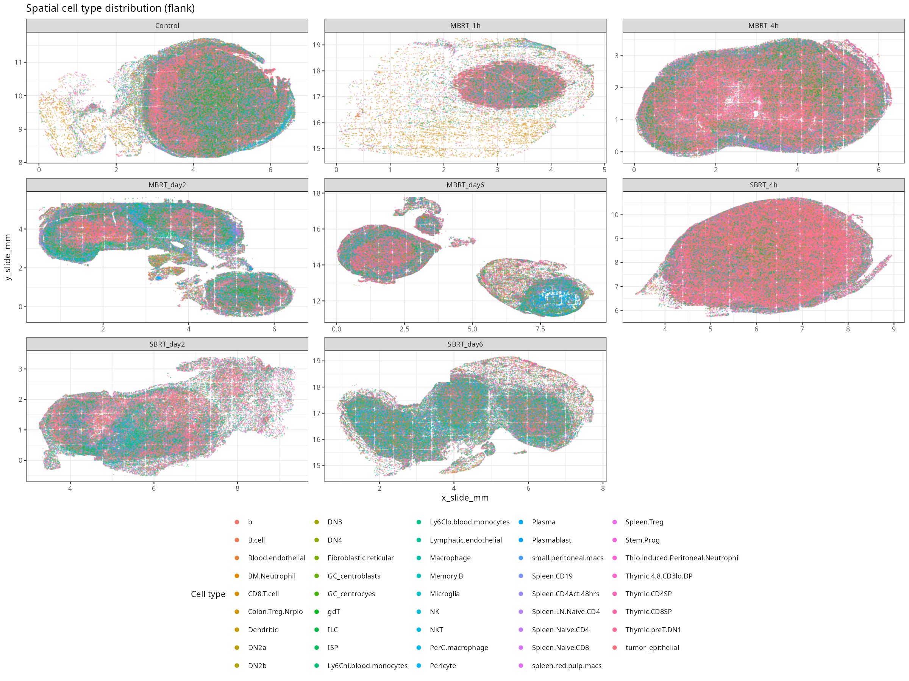). Recreating morph/seg would require the CosMx morphology composite + polygon flat-file export (AtoMx) from Jenn — a *separate* asset from the outstanding =h2ax scanner tiff= item above, which is a chromogenic-IHC image for peak/valley registration, not the CosMx IF composite.
**** Mutter_01 (current dataset)
- CosMx spatial transcriptomics data from Mutter lab, generated by Yi Liu (Liu.Yi1@mayo.edu)
- Yi performed secondary analysis: QC, sample condition labeling, cell type annotation (insitutype with ImmGen reference atlas), and signaling pathway scores
- Delivered as processed parquet files (339.1 MB total):
  - =projects_Mutter_01_CosMmR_app_data_raw_tx_counts_matrix.parquet= — [[https://mayoclinic2.box.com/s/ywj75mz3bfhivo5bfvivoogqh5o2uu86][box]]
  - =Analysis_Mutter_01_CosMmR_Mutter_updated_metadata.parquet= — [[https://mayoclinic2.box.com/s/y3dqguqwsjt15shh1opc2dw1kelc8q15][box]]
  - Metadata columns 90-93 are signaling pathway scores (TypeI_interferon, TypeII_interferon, STING, DNA_Damage_Repair). Type I IFN (19 genes), Type II IFN (17 genes), and DDR (18 genes) are NanoString standard Mouse UCC panel modules — gene lists in [[file:data/sources/2026-06-22-bruker-mouse-ucc-gene-list.xlsx][gene list XLSX]], Annotations sheet. STING is not a standard NanoString module; Yi may have defined it custom or from a subset of Pattern Recognition Receptors (30 genes).
- Stored at =/mnt/gcs/jeszyman/projects/spatial-rads/inputs/=
- Yi Liu confirmed [2026-06-10]: M01 was processed via the MC-SOLVE app, so no processed Seurat object exists — only the raw object is available (includes negprobes + falsecode). M01 carries no probes beyond the standard NanoString set; Mutter_02 adds 50 transcripts (the add-on, e.g. SCD1), so M01/M02 gene lists differ. [[https://mail.google.com/mail/u/0/#all/19ead47bf247d87c][gmail]]
**** Mutter_02 (raw data received, 4 slides, 12 samples)
:PROPERTIES:
:ID:       908fd83a-16ee-4ca5-9e2f-074d015b652d
:END:
Confirmed sample layout per Jenn Fazzari's 2026-04-09 reply ([[https://mail.google.com/mail/u/0/#all/19d202d7827d05ad][Gmail thread: MutterRobert_02_CosMmR - QC results]]). Each slide contains three samples: 0 Gy control, MBRT 2 days, SBRT 20 Gy 2 days. **All Mutter_02 samples are at the 2-day timepoint — no 4h data in this run.** Earlier tentative designs from Rob (Jan 30) and Jenn (Mar 2) are superseded.

| Slide | Sample ID | Treatment         |
|-------+-----------+-------------------|
|     1 |         1 | 0 Gy              |
|     1 |        34 | MBRT 2 days       |
|     1 |        28 | SBRT 20 Gy 2 days |
|     2 |         2 | 0 Gy              |
|     2 |        35 | MBRT 2 days       |
|     2 |        30 | SBRT 20 Gy 2 days |
|     3 |         3 | 0 Gy              |
|     3 |        19 | MBRT 2 days       |
|     3 |        16 | SBRT 20 Gy 2 days |
|     4 |         1 | 0 Gy              |
|     4 |        20 | MBRT 2 days       |
|     4 |        18 | SBRT 20 Gy 2 days |

**No FOV-level map**: Jenn confirmed she has no FOV maps for this run. Sample boundaries on each slide must be inferred from Seurat object metadata (sample ID or tissue region annotations) or from spatial coordinates.

**H2AX IHC in process for Mutter_02**: no yH2AX included in this run, but adjacent tissue sections were cut during original sample prep. Jenn received them back from Florida on 2026-04-09 and is arranging staining at Mayo. Will enable stripe model validation on Mutter_02 once complete.

**H2AX scans received [2026-06-11]**: high-res DAB OME-TIFF scans (the H2AX IHC requested) for slides 2/3/4 (samples per table above) from Jenn Fazzari, for placing peak/valley boundaries precisely on cells (the pptx export was too low-res). Images are whole-slide (uncropped — Fazzari found cropping lost resolution), with the MBRT/minibeam samples centered on each slide. Slide 1 failed to export; Fazzari to retry from her work desktop. Filed at =/mnt/gcs/jeszyman/projects/spatial-rads/inputs/mutter02/h2ax/=. Jeff confirmed [2026-06-12] the whole-slide scans are high-res enough to place peak/valley boundaries on cells. [[https://mail.google.com/mail/u/0/#all/19ead47bf247d87c][gmail]]

**Post-CosMx H&E received [2026-06-11]**: Jenny Kachergus (Mayo genomics core) shared high-resolution H&E images for the 4 slides stained after the CosMx run (Mutter_02_CosMmR), via Mayo Media Shuttle; Jeff confirmed receipt. Useful architectural reference given the CosMx delivery lacks morphology rasters (see the 2026-06-01 note above). [[https://mail.google.com/mail/u/0/#all/19ead47bf247d87c][gmail]]

**Alternative staining for later timepoints (2026-04-28)**: H2AX foci resolve by ~24-48h post-irradiation, so H2AX IHC on later timepoint blocks (day 2/6/8/10) would not show stripe geometry. If unstained adjacent sections exist for these blocks, alternative stains could provide ground truth: H&E (architectural damage), Ki67 (proliferation — expect higher in valleys per Hmgb2 finding), TUNEL or cleaved caspase-3 (cumulative apoptosis in peaks). Worth asking Jenn/Rob whether sections are available. For Mutter_02 at 48h, H2AX may still show residual signal — borderline timing.

Raw Seurat objects staged at =/mnt/gcs/jeszyman/projects/spatial-rads/inputs/mutter02/= (copied from Box 2026-04-10): =seuratObject_01..04_Mutter_02_CosMmR.RDS= (1.0 GB total, ~2.8M cells across 1586 FOVs).
**** Data transfer
- Transfer mechanism: Yi uploaded via Mayo Media Shuttle (mc-ondemand-securefiletransfer.mediashuttle.com), which emails download links to recipients. GCS bucket access (=chaudhuri-lab-share-bucket1/po1-spatial=) was attempted but Yi got permission denied — never resolved. Faridi Qaium (Qaium.Faridi@mayo.edu) manages GCS bucket IAM.
- Email threads:
  - [[mu:msgid:BN7PR01MB371506589DEF9A3B39E2DA7896F1A@BN7PR01MB3715.prod.exchangelabs.com][mu:CosMx data transfer thread (Oct-Nov 2025)]]
  - [[mu:msgid:BN7PR01MB37151F29CE6E18153C94469596D2A@BN7PR01MB3715.prod.exchangelabs.com][mu:Media Shuttle upload confirmation (Nov 21 2025)]]
  - [[mu:msgid:BN7PR01MB371539912324DC0BD309549D967EA@BN7PR01MB3715.prod.exchangelabs.com][mu:MutterRobert_02 project update thread]]

*** build_metadata_xlsx.R
:PROPERTIES:
:header-args:R: :tangle scripts/build_metadata_xlsx.R
:END:

#+begin_src R
#!/usr/bin/env Rscript
# One-time migration: flat metadata.xlsx (Sheet1) -> relational 4-sheet metadata.xlsx
# conforming to the sci_proj_repo Data layout standard (science.org 08049f58).
# Preview:  conda run -n basecamp Rscript scripts/build_metadata_xlsx.R
# Write:    conda run -n basecamp Rscript scripts/build_metadata_xlsx.R --write
suppressMessages({library(readxl); library(dplyr); library(tibble); library(tidyr); library(writexl)})

WRITE <- "--write" %in% commandArgs(trailingOnly = TRUE)
SRC   <- "data/sources/2026-05-29-legacy-flat-metadata.xlsx"  # legacy flat metadata (write-protected source)
XLSX  <- "data/metadata.xlsx"                                  # relational output, built from SRC
INPUT <- "/mnt/data/projects/spatial-rads/inputs"

flat <- read_excel(SRC)  # 11 Mutter_01 rows (legacy flat)

## datasets
datasets <- tibble(
  dataset_id    = c("dat0001", "dat0002"),
  name          = c("Mutter_01", "Mutter_02"),
  platform      = "CosMx",
  panel_n       = c(1000L, 972L),
  panel_base    = "Mouse UCC",                                       # Mouse RNA Universal Cell Characterization
  panel_custom  = c("Alan Fields 21-gene", "1K_Mayo_Thomp-Fields1"), # same Fields add-on; M02 label is the in-object Panel build name
  assay_type    = "RNA",                                             # RNA-only; no protein-expression assay on either run
  n_negprobe    = c(10L, 10L),           # both datasets carry the 10 negprobe assays in the raw per-slide RDS
  n_falsecode   = c(184L, 184L),         # both carry the 184 falsecode assays in the raw per-slide RDS
  provider      = c("Yi Liu / Mutter Lab", "Mutter Lab"),
  format        = c("rds", "rds"),       # M01 re-based onto per-slide raw RDS (Yi 2026-06-10); counts come from slides.input_path
  counts_path   = c(NA, NA),             # counts now sourced from the per-slide RDS, not a monolithic counts parquet
  metadata_path = c(file.path(INPUT, "mutter01/Analysis_Mutter_01_CosMmR_Mutter_updated_metadata.parquet"), NA)  # M01: sole source of Condition + Yi labels
)

## slides (4 Mutter_01 physical slides + 4 Mutter_02)
m01_barcodes <- sort(unique(flat$slide))
slides_m01 <- tibble(
  slide_id         = sprintf("sld%04d", seq_along(m01_barcodes)),
  dataset_id       = "dat0001",
  physical_barcode = m01_barcodes,
  input_path       = file.path(INPUT, sprintf("mutter01/seuratObject_%02d_Mutter_01_CosMmR.RDS", seq_along(m01_barcodes)))  # per-slide raw RDS; sorted barcode _S<i> -> seuratObject_0<i>
)
stopifnot(grepl("_S\\d+$", m01_barcodes))  # positional barcode->RDS mapping holds only if barcodes carry the _S<i> suffix
slides_m02 <- tibble(
  slide_id         = sprintf("sld%04d", 4 + 1:4),
  dataset_id       = "dat0002",
  physical_barcode = sprintf("Mutter_02_slide%02d", 1:4),
  input_path       = file.path(INPUT, sprintf("mutter02/seuratObject_%02d_Mutter_02_CosMmR.RDS", 1:4))
)
slides <- bind_rows(slides_m01, slides_m02)
barcode2sld <- setNames(slides_m01$slide_id, slides_m01$physical_barcode)

## Mutter_02 sample layout: block-to-slide positions from Jenn Fazzari (2026-04-09),
## timepoints from the yH2AX layout doc (slides 1-2 = 2d, slides 3-4 = 4h).
## rank by descending y_slide_mm: 1=top=Control, 2=mid=MBRT, 3=bottom=SBRT
LAYOUT_CSV <- "data/sources/mutter02_block_layout.csv"
layout     <- read.csv(LAYOUT_CSV)
m02 <- tribble(
  ~slide_num, ~rank, ~region_id, ~treatment,
  1, 1, 1,  "Control",
  1, 2, 34, "MBRT",
  1, 3, 28, "SBRT",
  2, 1, 2,  "Control",
  2, 2, 35, "MBRT",
  2, 3, 30, "SBRT",
  3, 1, 3,  "Control",
  3, 2, 19, "MBRT",
  3, 3, 16, "SBRT",
  4, 1, 1,  "Control",
  4, 2, 20, "MBRT",
  4, 3, 18, "SBRT"
)
## Join timepoint from the layout CSV (keyed on block + slide)
m02 <- m02 %>%
  left_join(layout %>% select(block, slide, timepoint_h),
            by = c("region_id" = "block", "slide_num" = "slide"))
stopifnot(!anyNA(m02$timepoint_h),
          length(unique(m02$timepoint_h)) > 1)
stopifnot(all(layout$block %in% m02$region_id))
## Condition suffix encodes timepoint: MBRT_4h / MBRT_day2 etc; Control stays Control
cond_suffix  <- ifelse(m02$timepoint_h == 4, "_4h", "_day2")
cond_map_m02 <- ifelse(m02$treatment == "Control", "Control",
                       paste0(m02$treatment, cond_suffix))
dose_m02     <- c(Control = 0, MBRT = NA_real_, SBRT = 20)  # SBRT 20 Gy per layout note; MBRT peak dose TBD

## samples
samples_m01 <- flat %>% transmute(
  block_label = block_id, condition, treatment, timepoint_h,
  model, tumor_cell_line, tumor_type, strain = host_strain,
  slide_id = unname(barcode2sld[slide]),
  dose_gy = NA_real_,            # Mutter_01 doses not yet recorded
  extract_key = condition        # Condition field that splits the Mutter_01 parquet
) %>% mutate(  # flat-source Control row has blank biology; it is the flank 4T1 baseline
  model           = coalesce(model,           if_else(treatment == "NT", "flank", NA_character_)),
  tumor_cell_line = coalesce(tumor_cell_line, if_else(treatment == "NT", "4T1", NA_character_)),
  tumor_type      = coalesce(tumor_type,      if_else(treatment == "NT", "mammary carcinoma, TNBC/claudin-low", NA_character_)),
  strain          = coalesce(strain,          if_else(treatment == "NT", "Balb/c", NA_character_))
)
samples_m02 <- m02 %>%
  mutate(
    dose_gy   = unname(dose_m02[treatment]),
    condition = cond_map_m02,
    treatment = if_else(treatment == "Control", "NT", treatment)
  ) %>% transmute(
    block_label = paste0("s", slide_num, "_region", region_id),
    condition, treatment, timepoint_h,
    model = "flank", tumor_cell_line = "4T1",
    tumor_type = "mammary carcinoma, TNBC/claudin-low", strain = "Balb/c",
    slide_id = slides_m02$slide_id[slide_num],
    dose_gy,
    extract_key = as.character(rank)  # y-band rank within the per-slide RDS
  )
samples_all <- bind_rows(samples_m01, samples_m02) %>%
  mutate(sample_id = sprintf("sam%04d", row_number()),
         mouse_id  = sprintf("mou%04d", row_number()))

## mice (one per sample; n=1 per condition)
mice <- samples_all %>% transmute(mouse_id, strain, sex = NA_character_, notes = NA_character_)

## final samples sheet (strain lives in mice)
samples <- samples_all %>% select(
  sample_id, mouse_id, slide_id, block_label, condition, treatment,
  dose_gy, timepoint_h, model, tumor_cell_line, tumor_type, extract_key
)

## if_channels: CosMx morphology/IF stains used for segmentation + lineage (NOT a protein-expression assay).
## Both datasets verified to carry the identical 5 channels (M01 parquet IF cols; M02 RDS meta.data),
## so spec x datasets via crossing(); append divergent rows by hand if a future run adds a channel (e.g. H2AX).
if_spec <- tribble(
  ~channel,    ~target,           ~role,                   ~meta_cols,
  "DAPI",      "DNA",             "segmentation_nuclear",  "Mean.DAPI;Max.DAPI",
  "CD298.B2M", "B2M/CD298",       "segmentation_membrane", "Mean.CD298.B2M;Max.CD298.B2M",
  "PanCK",     "pan-cytokeratin", "lineage_epithelial",    "Mean.PanCK;Max.PanCK",
  "CD45",      "PTPRC",           "lineage_immune",        "Mean.CD45;Max.CD45",
  "G",         "unspecified",     "redundant_epithelial",  "Mean.G;Max.G"
)
if_channels <- tidyr::crossing(dataset_id = datasets$dataset_id, if_spec) %>%
  mutate(notes = if_else(channel == "G", "r~0.92 with Mean.PanCK; not a literal duplicate", NA_character_)) %>%
  select(dataset_id, channel, target, role, meta_cols, notes)

cat("=== datasets ===\n");    print(as.data.frame(datasets))
cat("\n=== slides ===\n");     print(as.data.frame(slides))
cat("\n=== mice ===\n");       print(as.data.frame(mice))
cat("\n=== samples ===\n");    print(as.data.frame(samples))
cat("\n=== if_channels ===\n"); print(as.data.frame(if_channels))

if (WRITE) {
  bak <- "(none)"
  if (file.exists(XLSX)) {
    bak <- sprintf("data/metadata-prev-%s.xlsx.bak", format(Sys.time(), "%Y%m%d-%H%M%S"))
    file.copy(XLSX, bak, overwrite = TRUE)
  }
  write_xlsx(list(mice = mice, datasets = datasets, slides = slides, samples = samples, if_channels = if_channels), XLSX)
  cat(sprintf("\nWROTE %s (prev backup: %s)\n", XLSX, bak))
} else {
  cat("\n[preview only -- rerun with --write to write metadata.xlsx]\n")
}
#+end_src

*** Data model
:PROPERTIES:
:header-args:snakemake: :tangle workflows/data_model.smk
:END:

**** Preamble
#+begin_src snakemake
# spatial-rads -- data model workflow (Stage A)
# Builds the relational metadata.xlsx into data_model.rda + the master sample sheet.
# Run: conda run -n basecamp snakemake -s workflows/data_model.smk --cores 1
# R steps run in the spatial-rads env via `conda run` (snakemake driver lives in basecamp).
configfile: "config/config.yaml"

RSCRIPT = "conda run -n spatial-rads Rscript"
#+end_src
**** All rule
#+begin_src snakemake
rule all:
    input:
        config["samplesheet"],
        "data/data_model.rda",
        "results/data_model/panel_provenance_summary.tsv",
        "results/data_model/common_genes.tsv",
        "results/data_model/pathway_sets.tsv",
        "results/data_model/gene_set_panel_coverage.tsv",
        "results/data_model/panel_provenance.tsv",
#+end_src
**** Make data model                                               :smk_rule:
- Snakemake
#+begin_src snakemake
rule make_data_model:
    input:
        xlsx   = config["metadata"]["xlsx"],
        schema = config["metadata"]["schema"],
    output:
        rda         = "data/data_model.rda",
        samplesheet = config["samplesheet"],
    log:
        "logs/make_data_model.log",
    shell:
        "{RSCRIPT} scripts/make_data_model.R {input.xlsx} {input.schema} "
        "{output.rda} {output.samplesheet} > {log} 2>&1"
#+end_src
- R
#+begin_src R :tangle scripts/make_data_model.R
#!/usr/bin/env Rscript
# Build the data model from the relational metadata.xlsx, validating against
# metadata_schema.yaml. Emits data/data_model.rda (named list of tibbles) and the
# master denormalized sample sheet results/data_model/samples.tsv.
# Standalone:  conda run -n spatial-rads Rscript scripts/make_data_model.R
# Snakemake:   via the data_model rule's script: directive
suppressMessages({library(readxl); library(dplyr); library(readr); library(yaml)})
`%||%` <- function(a, b) if (is.null(a)) b else a

# positional args: xlsx schema rda samplesheet (fall back to standard paths for standalone runs)
args   <- commandArgs(trailingOnly = TRUE)
XLSX   <- if (length(args) >= 1) args[1] else "data/metadata.xlsx"
SCHEMA <- if (length(args) >= 2) args[2] else "data/metadata_schema.yaml"
RDA    <- if (length(args) >= 3) args[3] else "data/data_model.rda"
TSV    <- if (length(args) >= 4) args[4] else "results/data_model/samples.tsv"

schema <- yaml::read_yaml(SCHEMA)
dm <- lapply(schema$resources, function(r) readxl::read_excel(XLSX, sheet = r$control$sheet))
names(dm) <- vapply(schema$resources, function(r) r$name, character(1))

## ---- schema-driven validation ----
err <- character(0)
norm_na <- function(x, mv) { x <- as.character(x); x[x %in% mv] <- NA; x }
for (r in schema$resources) {
  d <- dm[[r$name]]; mv <- r$schema$missingValues %||% character(0)
  for (f in r$schema$fields) {
    if (!f$name %in% names(d)) { err <- c(err, sprintf("%s: missing column '%s'", r$name, f$name)); next }
    v <- norm_na(d[[f$name]], mv); cons <- f$constraints
    if (isTRUE(cons$required) && anyNA(v))
      err <- c(err, sprintf("%s.%s: %d missing required value(s)", r$name, f$name, sum(is.na(v))))
    if (isTRUE(cons$unique) && any(duplicated(v[!is.na(v)])))
      err <- c(err, sprintf("%s.%s: duplicate value(s)", r$name, f$name))
    if (!is.null(cons$pattern)) {
      bad <- v[!is.na(v) & !grepl(cons$pattern, v)]
      if (length(bad)) err <- c(err, sprintf("%s.%s: %d value(s) fail pattern %s", r$name, f$name, length(bad), cons$pattern))
    }
    if (!is.null(cons$enum)) {
      bad <- setdiff(na.omit(unique(v)), unlist(cons$enum))
      if (length(bad)) err <- c(err, sprintf("%s.%s: value(s) outside enum: %s", r$name, f$name, paste(bad, collapse = ", ")))
    }
  }
  for (fk in r$foreignKeys %||% list()) {
    child  <- norm_na(dm[[r$name]][[fk$fields]], mv)
    parent <- dm[[fk$reference$resource]][[fk$reference$fields]]
    miss   <- setdiff(na.omit(unique(child)), parent)
    if (length(miss)) err <- c(err, sprintf("%s.%s -> %s.%s unresolved: %s",
      r$name, fk$fields, fk$reference$resource, fk$reference$fields, paste(miss, collapse = ", ")))
  }
}
if (length(err)) stop("metadata_schema validation failed:\n  - ", paste(err, collapse = "\n  - "))

## ---- denormalized master sample sheet ----
## sample-grain only: join the dims that resolve 1:1 to a sample (mouse, slide, dataset).
## dataset-grain dims (e.g. if_channels, 5 rows/dataset) are deliberately NOT joined -- they
## would row-multiply the sheet. They live in data_model.rda; query them there by dataset_id.
master <- dm$samples %>%
  left_join(dm$mice,     by = "mouse_id") %>%
  left_join(dm$slides,   by = "slide_id") %>%
  left_join(dm$datasets, by = "dataset_id") %>%
  mutate(raw_input_path = if_else(format == "rds", input_path, counts_path)) %>%
  relocate(sample_id, dataset_id, name, format, treatment, condition, timepoint_h, model)

## ---- hard checks + summary ----
stopifnot(!anyNA(master$raw_input_path[master$format == "rds"]))         # every rds sample has a slide path
stopifnot(!anyNA(master$raw_input_path[master$format == "parquet"]))     # every parquet sample has counts path
cat(sprintf("data model OK: %d samples, %d mice, %d slides, %d datasets\n",
            nrow(dm$samples), nrow(dm$mice), nrow(dm$slides), nrow(dm$datasets)))
print(as.data.frame(count(master, name, treatment)))

data_model <- dm
dir.create(dirname(RDA), recursive = TRUE, showWarnings = FALSE)
dir.create(dirname(TSV), recursive = TRUE, showWarnings = FALSE)
save(data_model, file = RDA)
write_tsv(master, TSV)
cat(sprintf("wrote %s and %s\n", RDA, TSV))
#+end_src
**** Common gene panel                                             :smk_rule:
- Snakemake
#+begin_src snakemake
# --- common gene panel (Mutter_01 panel INT Mutter_02 panel; read from per-slide RDS) ---
rule common_gene_panel:
    input:
        script = "scripts/common_gene_panel.R",
        ss     = config["samplesheet"],
    output:
        "results/data_model/common_genes.tsv",
    threads: 1
    log: "logs/common_gene_panel.log",
    shell:
        "{RSCRIPT} {input.script} {input.ss} {output} > {log} 2>&1"
#+end_src
- R
#+begin_src R :tangle scripts/common_gene_panel.R
#!/usr/bin/env Rscript
# Common gene panel = Mutter_01 panel INT Mutter_02 panel, both read from the RNA-assay
# rownames of one per-slide raw RDS (both datasets are format=rds; the counts parquet is
# retired). Invariance guard: the freshly-built list must setequal the currently-committed
# common_genes.tsv before overwrite -- this panel is frozen because the locked aggregate
# was typed on it, so identity (not just cardinality) must hold.
# Args: <samplesheet.tsv> <out.tsv>
suppressMessages({library(readr); library(dplyr); library(Seurat)})
args <- commandArgs(trailingOnly = TRUE); SS <- args[1]; OUT <- args[2]
ss <- read_tsv(SS, show_col_types = FALSE)

# One per-slide RDS per dataset suffices for a panel (rownames) lookup; the RNA assay is
# the gene panel (negprobes/falsecode are separate assays in the same object).
rds_genes <- function(ds) {
  p <- ss %>% filter(name == ds) %>% pull(raw_input_path) %>% unique()
  stopifnot(length(p) >= 1, file.exists(p[1]))
  o <- readRDS(p[1]); g <- rownames(o[["RNA"]]); rm(o); gc(); g
}
m01 <- rds_genes("Mutter_01"); m02 <- rds_genes("Mutter_02")
common <- sort(intersect(m01, m02))
cat(sprintf("Mutter_01: %d | Mutter_02: %d | common: %d\n", length(m01), length(m02), length(common)))
stopifnot(length(common) > 500)  # sanity: panels should overlap heavily

## ---- invariance guard vs committed snapshot (identity, not count) ----
if (file.exists(OUT)) {
  old <- readLines(OUT)
  if (!setequal(common, old))
    stop(sprintf("panel invariance FAILED: %d added, %d removed vs committed %s",
                 length(setdiff(common, old)), length(setdiff(old, common)), OUT))
}
dir.create(dirname(OUT), recursive = TRUE, showWarnings = FALSE)
writeLines(common, OUT)
#+end_src
**** Gene sets                                                     :smk_rule:

Pathway sets are defined by a concept registry ([[file:config/pathway_concept_registry.tsv][pathway_concept_registry.tsv]]): one row per (concept, source), where =source= is =nanostring= (genes tagged in the vendor Annotations module column(s)), =hallmark= (mouse-native msigdbr MH collection), or =custom= (hand-curated in [[file:config/pathway_gene_lists.yaml][pathway_gene_lists.yaml]], citation required). Members are derived at build time so they are never hand-duplicated; =source_id= may name several modules/sets joined by =;= (union). Per concept the highest panel-*coverage* set is confirmatory (the panel-designed NanoString module wins all seven dual-source concepts at 83-97%; genome-wide Hallmark twins are diluted off the 950-gene panel and stay exploratory). Tiered FDR keeps the exploratory sweep isolated: the confirmatory family is pooled-BH over the seven pre-registered concepts only, so widening the exploratory tier cannot dilute H1/H2/H3.

Confirmatory concepts (target, 7): Type I IFN, Type II IFN, DNA Damage Repair, Angiogenesis, Hypoxia, Fibrosis remodeling, Stromal stress/senescence. Exploratory (target): all mouse Hallmark sets clearing the panel-gene floor, plus SASP (senescence-associated secretory phenotype, custom-cited).

*Build status (2026-07-13, complete):* the registry, builder, coverage figure, and =assemble_results.R= H1 definition implement the final scope: STING retired from the confirmatory family, the exploratory Hallmark tier widened to every gate-passing mouse Hallmark set (47 of 50), and SASP added (Coppe 2008). The build emits 54 sets (7 primary/confirmatory + 47 exploratory). The ~5h pathway rescore ran to a shadow location, was validated non-destructively, and is *promoted*: =results_master.tsv= (32,910 rows: 2,412 confirmatory / 30,498 exploratory) now carries the new UCell/AddModuleScore scores. Re-validation (=validate_master.R=) confirms the headline results survive the corrected gene sets: SBRT stromal fibrosis (collagen/Acta2 up, 26 confirmatory-significant; H3 dominates SBRT_vs_Ctrl with 54 hits), MBRT arm-level null (4 confirmatory MBRT_vs_Ctrl hits), and p21 ambiguous (not called regulation). Pre-rescore master backed up at =aggregate/_preRescore_backup/=.

STING retirement rationale: its module has only 2 of 3 genes on panel, both shared with the IFN sets (already flagged weak in the 2026-06-23 robustness pass). The cytosolic-DNA-sensing biology it aimed at is a genuine panel blind spot (see the two dropped RT signatures below), not a suppressible signal.

Two radiotherapy-response signatures were evaluated as custom-cited exploratory sets and *dropped* after panel-coverage and method checks; recorded here so they are not re-proposed:
- *RSI (radiosensitivity index)* [cite:@eschrich2009] (doi:10.1016/j.ijrobp.2009.06.014). Dropped for two reasons. (1) RSI is a rank-based weighted linear predictor of SF2, not a co-expression module, so scoring it with UCell/AddModuleScore (which assume set coherence) is methodologically wrong. (2) Only 6/10 genes are on the common panel and the algorithm's per-gene weights are undefined for the missing four, so even a linear reconstruction cannot reproduce the published index. (The 10th hub is a single dual-annotated probeset, PAK2/CDK1, in the primary table; moot given the drop.)
- *ICD / cGAS-STING (immunogenic cell death)* [cite:@vanpouille-box2017] (doi:10.1038/ncomms15618). Dropped for panel coverage: only 3/12 genes on panel, and the three core sensors (=Cgas=, =Sting1=, =Tbk1=) are all off-panel. What remains (=Irf3=, =Cxcl10=, =Ifit1=) is generic IFN-response already captured by the Type I/II IFN modules, so the set would score IFN signal under an ICD label rather than measure cytosolic-DNA sensing. The 950-gene panel cannot observe the cGAS-STING axis.

#+begin_src snakemake
# --- pathway gene-set artifact + panel coverage from the concept registry ---
# Each (concept,source) set is derived at build: nanostring from the vendor Annotations
# sheet, hallmark from msigdbr, custom from the yaml. Registry is the single provenance
# surface; per concept the most on-panel set is confirmatory.
rule build_gene_sets:
    input:
        script   = "scripts/build_gene_sets.R",
        registry = "config/pathway_concept_registry.tsv",
        yaml     = config["pathway"]["gene_lists"],
        vendor   = "data/sources/2026-06-22-bruker-mouse-ucc-gene-list.xlsx",
        panel    = "results/data_model/common_genes.tsv",
    output:
        sets     = "results/data_model/pathway_sets.tsv",
        coverage = "results/data_model/gene_set_panel_coverage.tsv",
    params:
        minpg = config["pathway"]["min_panel_genes"],
    threads: 1
    log: "logs/build_gene_sets.log",
    shell:
        "{RSCRIPT} {input.script} {input.registry} {input.yaml} {input.vendor} {input.panel} "
        "{params.minpg} {output.sets} {output.coverage} > {log} 2>&1"
#+end_src
**** Panel provenance                                              :smk_rule:
- Snakemake
#+begin_src snakemake
# --- panel provenance: UCC-standard vs per-experiment custom (from the delivered objects) ---
rule panel_provenance:
    input:
        script = "scripts/panel_provenance.R",
        vendor = "data/sources/2026-06-22-bruker-mouse-ucc-gene-list.xlsx",
    output:
        membership = "results/data_model/panel_provenance.tsv",
        summary    = "results/data_model/panel_provenance_summary.tsv",
    params:
        m01 = config["datadir"] + "/inputs/mutter01",
        m02 = config["datadir"] + "/inputs/mutter02",
    threads: 1
    log: "logs/panel_provenance.log",
    shell:
        "{RSCRIPT} {input.script} {input.vendor} {params.m01} {params.m02} "
        "{output.membership} {output.summary} > {log} 2>&1"
#+end_src
- R
#+begin_src R :tangle scripts/panel_provenance.R
#!/usr/bin/env Rscript

# -----------------------------------------------------------------------------
# panel_provenance.R
# Partition each dataset's delivered CosMx gene panel into UCC-standard vs custom
# by diffing the actual object gene lists against the Bruker Mouse UCC vendor gene
# list, and mark the cross-dataset common set. Ground truth = the data objects +
# the vendor panel doc, NOT the hand-entered metadata panel fields.
# Args: <vendor_ucc.xlsx> <m01_rds_dir> <m02_rds_dir> <out_membership.tsv> <out_summary.tsv>
# -----------------------------------------------------------------------------

packages <- c("Seurat", "readxl", "data.table")
suppressPackageStartupMessages(invisible(lapply(packages, require, character.only = TRUE)))

args    <- commandArgs(trailingOnly = TRUE)
vendor  <- args[1]
m01_dir <- args[2]
m02_dir <- args[3]
out_mem <- args[4]
out_sum <- args[5]

#' Genes present in a dataset's delivered per-slide object (RNA assay rownames).
dataset_genes <- function(dir, pat) {
  f <- list.files(dir, pattern = pat, full.names = TRUE)[1]
  rownames(UpdateSeuratObject(readRDS(f))[["RNA"]])
}

g01 <- dataset_genes(m01_dir, "Mutter_01.*RDS$")
g02 <- dataset_genes(m02_dir, "Mutter_02.*RDS$")
obj_genes <- union(g01, g02)

# --- vendor UCC standard set: auto-detect the gene-symbol column (max overlap) ---
gp   <- suppressMessages(read_excel(vendor, sheet = "Gene and Probe Details", skip = 1))
ov   <- vapply(gp, function(col) sum(as.character(col) %in% obj_genes), integer(1))
ucc  <- unique(na.omit(as.character(gp[[which.max(ov)]])))
ucc  <- ucc[ucc %in% obj_genes | grepl("^[A-Za-z0-9.-]+$", ucc)]  # gene-like tokens
stopifnot(max(ov) > 500)  # sanity: the detected column really is genes

# Drop platform control probes (negprobes / system controls) -- these are not genes and
# otherwise inflate the standard count (the Mouse UCC is a 1000-plex + 10 negprobes) and
# leak into the "custom" set (e.g. NegativeAdd).
is_control <- function(x) {
  grepl("^Negative[0-9]+$|^NegativeAdd$|^SystemControl|^NegPrb|^FalseCode", x, ignore.case = TRUE)
}
g01 <- g01[!is_control(g01)]
g02 <- g02[!is_control(g02)]
ucc <- ucc[!is_control(ucc)]

# --- per-gene membership across UCC standard + both datasets ---
all_g <- sort(unique(c(ucc, g01, g02)))
mem <- data.table(
  gene         = all_g,
  ucc_standard = all_g %in% ucc,
  mutter_01    = all_g %in% g01,
  mutter_02    = all_g %in% g02)
mem[, class := fifelse(mutter_01 & mutter_02, "common",
                fifelse(mutter_01 | mutter_02, "dataset_specific", "ucc_only"))]
mem[, custom := (mutter_01 | mutter_02) & !ucc_standard]   # in a dataset but not UCC standard
fwrite(mem, out_mem, sep = "\t")

# --- summary counts ---
sm <- data.table(
  metric = c("ucc_standard", "mutter_01_total", "mutter_02_total", "common",
             "mutter_01_custom", "mutter_02_custom",
             "mutter_01_missing_from_ucc", "mutter_02_missing_from_ucc"),
  n = c(length(ucc), length(g01), length(g02), length(intersect(g01, g02)),
        sum(mem$mutter_01 & mem$custom), sum(mem$mutter_02 & mem$custom),
        length(setdiff(g01, ucc)), length(setdiff(g02, ucc))))
fwrite(sm, out_sum, sep = "\t")
print(sm)
cat(sprintf("panel_provenance: UCC standard %d | M01 %d (custom %d) | M02 %d (custom %d) | common %d\n",
            length(ucc), length(g01), sum(mem$mutter_01 & mem$custom),
            length(g02), sum(mem$mutter_02 & mem$custom), length(intersect(g01, g02))))
#+end_src

** Methods

- when analyzing, where is the tumor per section? should we subset?
- each fov is 510 x 510 um, about 6k cells- confirm and add to qc
- beam angle per slide?

*** Animal model and radiation

**** Mutter_01 flank series
Balb/c
Balb/c mice received subcutaneous flank implants of 4T1 mouse mammary carcinoma. 4T1 is a triple-negative / claudin-low breast cancer line that co-expresses epithelial markers (Krt8, Krt18, Epcam, Cdh1) and mesenchymal markers (Vim, S100a4, S100a6) natively, so the baseline expression of mesenchymal genes in tumor cells is real 4T1 biology rather than contamination. Eight blocks, one tumor per treatment × timepoint cell (n=1). Treatments: Control 0 Gy (Block_3, S2); MBRT at 1h, 4h, 2d, 6d post-treatment (Blocks 12, 21, 36, 54 on S4 and S1); SBRT at 4h, 2d, 6d (Blocks 17, 29, 48 on S4 and S2). MBRT delivers dose as approximately 1 mm-spaced parallel minibeams, producing alternating high-dose peak stripes and low-dose valley gaps across the tumor. SBRT delivers uniform high-dose coverage. Block_21 (MBRT 4h) is the only block with ground-truth peak/valley annotation because it is the only flank block with gamma-H2AX chromogenic IHC on an adjacent serial section. The Block_21 stripe geometry is −25° from horizontal, 1.04 mm spacing, 0.27 mm beam half-width, fit empirically from manual peak-FOV centroids.

**** Mutter_01 tongue series (secondary study)
Three blocks on slide S3 at late timepoints. Tumor model not yet confirmed (open question for Yi and Rob): the cell composition is immune-dominated with 36% CD8 T cells, 13% fibroblastic reticular cells, 9% B and plasma cells, and only 7% epithelial "a" bucket — very different from the flank profile. Candidate tumor lines are orthotopic mouse oral carcinoma (MOC1, MOC2, or MEER). The immune-rich profile could reflect late-timepoint adaptive immune infiltration, intrinsic oral tumor microenvironment, or draining submandibular lymph node contamination. Blocks: MBRT day 8 (TNG-6082); MBRT day 10 (TNG-1271); SBRT day 10 (NTB5696). Differing animal-ID prefixes (TNG vs NTB) suggest separate cohorts. Not part of the current peak/valley analysis.

**** Mutter_02 (in production)
Designed per Rob Mutter's 2026-01-28 email: 4 CosMx slides × 3 sections each = approximately 12 tumors. Same 4T1 flank model as Mutter_01. Biological replicates at 2 animals per condition. Candidate designs under discussion include NT + MBRT + CRT at 4h and 48h across the 4 slides, or alternatively three slides concentrated at 4h (6 animals) plus one slide at 1h or 48h. Rob's abbreviation CRT is equivalent to SBRT (conventional uniform radiation). Han Evelyn (2025-12-20 email) additionally proposed including abscopal tumors in a future cohort to test systemic immune effects in distant non-irradiated tumors.

**** Open radiation dose parameters
Radiation dose specifics not yet confirmed in reviewed Gmail threads: MBRT peak dose in Gy, SBRT matched dose, MBRT valley-to-peak dose ratio, field geometry at the tumor, and fractionation scheme (likely single fraction from context but unconfirmed). These should be clarified with Rob Mutter before methods-section writing.

*** Single cell spatial transcriptomics

Spatial transcriptomics was performed on the NanoString CosMx Spatial Molecular Imager (SMI) at the Mayo Clinic Spatial Biology Core (Jacksonville, FL). The probe panel combined the NanoString Mouse Universal Cell Characterization (UCC) panel of approximately 950 genes with 21 custom add-on targets: A2ml1, Adcy8, Akap5, Bcl6, Cd21, Cpne4, Dpyd, Eya4, Gstm1, Hopx, Mum1, Nrp1, Plau, Plaur, Porcn, Prkci, Scd1, Sdc1, Slc35f1, Xist, and p16. The custom add-on was originally designed by Dr. Alan Fields for an unrelated B-cell mouse experiment. Reagents were donated to the Mutter Lab and reused for this radiotherapy project. Cross-project reuse of the panel means a subset of add-on genes has limited prior relevance to radiation biology. The core Mouse UCC panel is immune and stromal cell biased, with known coverage gaps for radiation-specific pathway genes.

CosMx acquires immunofluorescence (IF) images on the same tissue section as the RNA probes and uses them for computational cell boundary detection. Mutter_02 used the standard four-marker NanoString Cell Segmentation Kit: DAPI (nuclear, anchors each cell), PanCK (epithelial and tumor cytoplasm), CD45 (immune cell cytoplasm), and CD298/B2M (pan-membrane, captures stromal and endothelial cells). Mutter_01 carried these four markers plus an additional channel labeled only "G" in the delivered metadata (Mean.G, Max.G). Per-cell Mean.G correlates with Mean.PanCK at Pearson r = 0.924 across all 1.43M cells, while correlation with the other three channels is near zero. The G channel therefore reports PanCK-channel green signal, most likely spectral bleed from the PanCK fluor or a redundant readout of the same stain. Dropping the channel in Mutter_02 is consistent with that interpretation.

Gamma-H2AX was not imaged on CosMx. Mutter_01 gamma-H2AX data came from chromogenic IHC on an adjacent serial section, used only for independent validation of the beam peak and valley stripe geometry at 4 h. Mutter_02 gamma-H2AX staining is pending on adjacent sections held at Mayo.

***** TODO Ask Yi what the Mean.G / Max.G channel was in Mutter_01

Mean.G correlates with Mean.PanCK at r = 0.924 per cell (n = 1.43M) and near-zero with DAPI, CD45, CD298/B2M. Working hypothesis is PanCK spectral bleed into the green filter, but could also be a second epithelial-biased stain (e.g., E-cadherin, EpCAM) that Yi's pipeline did not label. Mutter_02 dropped the channel, so resolving this matters mainly for completeness of the Mutter_01 methods section and for confirming Mean.G can be ignored in downstream IF-based QC.

***** TODO Register H2AX IHC to CosMx coordinate frame (deferred until scanner TIFF arrives)
Current peak/valley labels come from manual Inkscape rotation of the cropped H2AX PNG onto the CosMx-native FOV grid. The FOV grid positions are correct (from =x_slide_mm= / =y_slide_mm= in CosMx metadata), but the H2AX rotation is eyeballed at ±3–5° precision. Page 5 of =Gamma H2AX + FOVs.pptx= has FOV numbers hand-transferred onto the H2AX image but with the same eyeball precision. Automated shape-matching registration failed on PPTX-resolution images due to FOV text labels confounding tumor silhouette segmentation. Proper fix requires either (a) the full-resolution H2AX scanner TIFF for pixel-level feature matching against the CosMx IF composite, or (b) manual landmark picking on both panels followed by affine transform fitting. Deferred until Mutter_02 data arrives with adjacent-section H2AX IHC — at which point formal registration becomes the standard per-slide pipeline step.

**** FOV layout
Fields of view (FOVs) are fixed ~510 × 510 µm imaging tiles. Mayo Spatial Biology Core staff placed FOV boxes manually in NanoString AtoMx over a pre-run tissue preview, and the instrument assigned sequential IDs continuing across all four slides in the run (Slide 4 covers FOVs 154 to 233). FOV placement is not a strict grid, and adjacent tiles frequently overlap. On Mutter_01 Block_21, 22 of 80 FOV pairs have center-to-center distance below 510 µm, and roughly 4% of cells physically sit inside two or three FOV boxes. The NanoString delivery pipeline deduplicates these by assigning each cell to a single FOV, approximately the FOV whose centroid is closest (95.8% agreement with a strict nearest-centroid rule). Cell IDs and coordinates are unique in the delivered data, so no cell is double-counted. Cells in overlap zones inherit whichever FOV's label the pipeline assigned, which matters only when two overlapping FOVs receive different peak or valley annotations.

The FOV manual placement and 545×545 µm tile constraint that drives the overlap pattern documented above is a known CosMx platform property — Ozirmak Lermi et al. report that on a human TMA project, the same constraint (max 47 FOVs per slide there) precluded whole-tissue-core analysis on CosMx, while MERFISH and Xenium covered whole tissue area; FOV selection requires operator-driven placement at the time of the experimental run [cite:@ozirmaklermi2025].

**** Experimental design
Mutter_01 comprised 11 conditions sampled across four CosMx slides, with one biological replicate per condition. The flank tumor model contributed eight conditions: 0 Gy control, MBRT at 1 h, 4 h, 48 h, and 144 h, and SBRT 20 Gy at 4 h, 48 h, and 144 h. The tongue tumor model contributed three conditions sampled at 192 h and 240 h for MBRT, and 240 h for SBRT 20 Gy. MBRT delivered dose through approximately 1 mm-spaced parallel beams, producing alternating peak and valley dose zones on the tissue. SBRT 20 Gy delivered uniform dose. The 4 h timepoint was the anchor for spatial peak vs valley analyses because direct DNA damage signatures are maximal before cell death, migration, or infiltration redistribute the affected cells.

Mutter_02 comprised 12 samples across four CosMx slides, with three biological replicates at a single timepoint. Each slide carried one 0 Gy control, one MBRT tumor at 48 h, and one SBRT 20 Gy tumor at 48 h. All Mutter_02 samples are flank tumors at the day 2 timepoint. No 4 h or late timepoints were collected in this run. Slide and FOV layout was confirmed by Jenn Fazzari on 2026-04-09.

**** Data processing
CosMx instrument does cell segmentation (Cellpose)

Secondary analysis through cell typing was performed by Yi Liu at the Mayo Spatial Biology Core for Mutter_01. Raw transcript counts and per-cell metadata were delivered as parquet files for Mutter_01 and as raw Seurat RDS objects for Mutter_02 (no secondary analysis from Yi on set 2). QC filters were applied to remove low-quality cells: qcFlagsCell set to "Pass", nCount_RNA greater than 20, nFeature_RNA greater than 10, and propNegative less than 0.5. Counts were log-normalized with a scale factor of 10,000. Cell types were assigned by insitutype against the ImmGen mouse reference atlas. Pathway activity scores for Type I interferon (19 genes), Type II interferon (17 genes), DNA damage repair (18 genes), and a custom STING score were precomputed and delivered as metadata columns on Mutter_01. Pathway scores for Mutter_02 are recomputed locally using the same NanoString Mouse UCC module definitions. Mutter_02 sample-to-cell assignment was resolved by k-means clustering on y_slide_mm (k=3 per slide), with top=Control, middle=MBRT, bottom=SBRT verified against CosMx Control Center FOV maps (Mutter02_Slide Powerpoint.pptx). 2.35M cells post-QC across 4 slides.

A cross-platform FFPE benchmark of CosMx, MERFISH, and Xenium documented that CosMx human panels can carry target gene probes that express at negative-control levels — including canonical immune markers like CD3D, FOXP3, MS4A1 (8-31.9% of panel depending on TMA). For the Mouse UCC panel used here, an analogous probe-vs-negative-control QC should be run before relying on InsituType cell typing, since failed probes for lineage markers will collapse cell types into "unknown" clusters [cite:@ozirmaklermi2025].

** Bioinformatics
MAD-based morphology gate

 Neighbor-contamination from imperfect
    segmentation is a primary confound for  DE and warrants
  a
     dedicated removal/resegmentation step (FastReseg
  flagged
     ~22% of cells as spatial doublets on a kidney panel).

  What the literature confirmed (2024–2026)

  #: 1
  Confirmed finding: Neighbor-contamination from imperfect
    segmentation is a primary confound for  DE and warrants
  a
     dedicated removal/resegmentation step (FastReseg
  flagged
     ~22% of cells as spatial doublets on a kidney panel).
  Strength: 3-0
  Key source: FastReseg, Sci Rep 2025; NanoString biostats
    blog; SpatialQM, Nat Biotechnol 2025
  ────────────────────────────────────────
  #: 2
  Confirmed finding: Fixed scRNA-seq QC cutoffs are
    inadequate → data-driven per-cell quality scoring over
    expression + morphology (area, aspect ratio, FOV-border
    distance), MAD/medcouple outliers.
  Strength: 2-1
  Key source: SpaceTrooper, bioRxiv 2025 / Bioc 3.22
  ────────────────────────────────────────
  #: 3
  Confirmed finding: Library-size / total-count
  normalization
     is inappropriate for targeted panels — panels built
    around markers violate its core assumption; use
    area-based or panel-aware normalization.
  Strength: 3-0
  Key source: Atta et al., Genome Biology 2024; Bhuva, Nat
    Genet 2024; SpaNorm
  ────────────────────────────────────────
  #: 4
  Confirmed finding: Markers-alone typing fails at this
    sparsity (official guidance) — but no single method
    (InSituType, cluster-then-annotate) is officially
    endorsed.
  Strength: 3-0
  Key source: NanoString "On the use of marker genes," 2024

*** Initial processing and QC

This pipeline takes that raw output and turns it into labeled, comparable per-cell tables. Briefly, per-slide raw Seurat RDS objects are reshaped to a common format across experiments.

Files are subset from the slide level to tissue experimental condition, experiment 1 by its labeled condition, experiment 2 by physical position on the slide.

The two experiments measured slightly different gene sets, and we keep only the intersect ~950 genes both measured. Cells are quality-filtered by four criteria:

- nCount_RNA > 20 — total counts floor
- nFeature_RNA > 10 — complexity floor (unique genes)
- propNegative < 0.5 — negative-probe background backstop
- |log10(Area) − median| < 3·MAD — robust cell-area outlier gate (segmentation errors/doublets)

Counts are normalized by total counts per cell.

UCC labels from experiment 1 are applied for cell type labels used as a validator / check for full design labeling.

UCell rank-based enrichment scoring is performed per cell.

8. **Quality-control reports (these only flag things; they never change the data):**
   - *Probe check* — are any of the ~1000 genes basically indistinguishable from noise?
   - *Control check* — how much background and decoding-error each cell carries.
   - *Contamination check* **(the new one)** — when the software drew each cell's boundary, did it accidentally scoop in a neighbor's genes? It scores how often genes that belong to *different* cell types show up together in one cell (which shouldn't happen if boundaries are clean), reported per sample and per small image-tile, with extra columns so a high score can be read as a real boundary problem vs. just a dense or damaged tissue patch.
   - Plus plain summary tables and plots.

**End product:** one standardized, quality-checked, labeled, program-scored table per sample — the input the comparison pipeline then uses.

Want me to finish the doc refresh (changelog + CLAUDE.md note) now, or hold while you look this over?

**** preprocessing.smk
:PROPERTIES:
:header-args:snakemake: :tangle workflows/preprocessing.smk
:END:
***** Preamble
#+begin_src snakemake
# spatial-rads -- invariant per-sample preprocessing workflow (pre-aggregate).
# Deterministic function of (raw input, pinned config): dataset adapter (raw per-slide
# RDS -> common 950-gene Seurat) -> 4-criteria QC filter -> LogNormalize, plus report-only
# QC (probe QC, control characterization, SpatialQM contamination MECR, QC summaries/plots).
# Per-sample terminus = norm.rds; canonical cell typing happens at merged scale in the
# aggregate workflow. Run: conda run -n basecamp snakemake -s workflows/preprocessing.smk --cores 8
# R steps run in the spatial-rads env via `conda run` (driver lives in basecamp).

import os
import pandas as pd

configfile: "config/config.yaml"

# --- interpreter (driver runs in basecamp; R steps in spatial-rads) ---
RSCRIPT = "conda run -n spatial-rads Rscript"

# --- paths: D_ data dirs, R_ repo locations ---
D_DATA    = config["datadir"]
D_PROC    = os.path.join(D_DATA, "processing")    # heavy per-sample RDS
D_RES     = "results/processing"                  # small TSV/PNG reports
D_LOGS    = "logs"
R_SCRIPTS = "scripts"

MASTER  = config["samplesheet"]                   # master sheet from the data_model workflow
SCOPED  = f"{D_RES}/samplesheet.tsv"
GENES   = "results/data_model/common_genes.tsv"   # common panel (M01 n M02; built in data_model.smk)
YIREF   = f"{D_RES}/yi_reference.tsv"             # M01 vendor-label side-output (retired with per-sample typing)
QC      = config["qc"]
NRM     = config["normalize"]
M01_RDS_DIR = f"{D_DATA}/inputs/mutter01"
M02_RDS_DIR = f"{D_DATA}/inputs/mutter02"
M01_META_PQ = f"{D_DATA}/inputs/mutter01/Analysis_Mutter_01_CosMmR_Mutter_updated_metadata.parquet"

# Parse-time sample lists from the master sheet.
_s = pd.read_csv(MASTER, sep="\t")
M01 = _s.loc[_s["name"] == "Mutter_01", "sample_id"].tolist()
M02 = _s.loc[_s["name"] == "Mutter_02", "sample_id"].tolist()
ALL = _s["sample_id"].tolist()
#+end_src
***** All rule
#+begin_src snakemake
rule all:
    input:
        expand(f"{D_PROC}/norm/{{s}}.norm.rds", s=ALL),
        f"{D_RES}/qc_summary.tsv",
        f"{D_RES}/probe_qc_report.tsv",
        f"{D_RES}/m01_rds_validation.tsv",
        f"{D_RES}/control_characterization.tsv",
        f"{D_RES}/fov_falsecode_qc.tsv",
        f"{D_RES}/contamination_qc.tsv",
        f"{D_RES}/contamination_fov_qc.tsv",
        f"{D_RES}/sample_tech_metrics.tsv",
        f"{D_PROC}/cell_controls.parquet",
        f"{D_RES}/plots/fov_falsecode_density.png",
        f"{D_RES}/plots/qc_removal_attribution.tsv",
        f"{D_RES}/plots/qc_removal_attribution.png",
        f"{D_RES}/plots/qc_metric_distributions.png",
#+end_src
***** Sample sheet                                                 :smk_rule:
- Snakemake
#+begin_src snakemake
# Workflow-linked sample sheet (scoped view of the data model).
rule preproc_samplesheet:
    message: "[samplesheet] scoped view of the data model"
    input:
        script = f"{R_SCRIPTS}/processing_samplesheet.R",
        rda    = "data/data_model.rda",
    log:
        f"{D_LOGS}/preproc_samplesheet.log",
    threads: 1
    output:
        ss = SCOPED,
    shell:
        "{RSCRIPT} {input.script} {input.rda} {output.ss} > {log} 2>&1"
#+end_src
- R
#+begin_src R :tangle scripts/processing_samplesheet.R
#!/usr/bin/env Rscript
# Workflow-linked sample sheet: scoped view of data_model.rda for the processing workflow.
# Args: <data_model.rda> <out.tsv>
suppressMessages({library(dplyr); library(readr)})
args <- commandArgs(trailingOnly = TRUE)
RDA <- args[1]; OUT <- args[2]
load(RDA)  # -> data_model (named list of tibbles)
dm <- data_model
scoped <- dm$samples %>%
  left_join(dm$slides,   by = "slide_id") %>%
  left_join(dm$datasets, by = "dataset_id") %>%
  mutate(raw_input_path = if_else(format == "rds", input_path, counts_path)) %>%
  transmute(sample_id, dataset = name, format, treatment, condition, timepoint_h, model,
            slide_id, physical_barcode, block_label, extract_key,
            counts_path, metadata_path, raw_input_path)
dir.create(dirname(OUT), recursive = TRUE, showWarnings = FALSE)
write_tsv(scoped, OUT)
cat(sprintf("wrote %s (%d samples: %d Mutter_01, %d Mutter_02)\n",
            OUT, nrow(scoped), sum(scoped$dataset=="Mutter_01"), sum(scoped$dataset=="Mutter_02")))
#+end_src
***** Probe-QC diagnostic                                          :smk_rule:
- Snakemake
#+begin_src snakemake
# Probe-vs-negative-control QC DIAGNOSTIC (report-only; does NOT drop genes).
rule preproc_probe_qc:
    message: "[probe_qc] background-level probe flags"
    input:
        script = f"{R_SCRIPTS}/probe_qc.R",
        ss     = SCOPED,
        panel  = GENES,
    log:
        f"{D_LOGS}/preproc_probe_qc.log",
    threads: 1
    output:
        report = f"{D_RES}/probe_qc_report.tsv",
    shell:
        "{RSCRIPT} {input.script} {input.ss} {input.panel} {output.report} > {log} 2>&1"
#+end_src
- R
#+begin_src R :tangle scripts/probe_qc.R
#!/usr/bin/env Rscript
# Probe-vs-negative-control DIAGNOSTIC -- report-only, does NOT drop genes.
#
# NanoString good practice (Danaher, CosMx Analysis Scratch Space) advises AGAINST removing
# low-expression genes -- that loses rare-cell-type markers -- and instead models background
# per cell; InSituType accounts for background internally via its per-cell neg term. So we keep
# the full panel and only FLAG candidate failed probes (Ozirmak Lermi 2025, Nat Commun
# 10.1038/s41467-025-63414-1): genes sitting at/below the negative-control background in BOTH
# datasets (signal-to-background <= 1), i.e. behaving like a negative probe. Review, do not auto-drop.
# Args: <samplesheet.tsv> <common_genes.tsv> <out_report.tsv>
suppressMessages({library(readr); library(dplyr); library(arrow); library(data.table); library(Seurat); library(Matrix)})
args <- commandArgs(trailingOnly = TRUE)
SS <- args[1]; PANEL <- args[2]; OUT <- args[3]
ss <- read_tsv(SS, show_col_types = FALSE)
panel <- readLines(PANEL)

m02_paths <- unique(ss$raw_input_path[ss$dataset == "Mutter_02"])
o1 <- UpdateSeuratObject(readRDS(m02_paths[1]))
NEG_N <- nrow(GetAssayData(o1, assay = "negprobes", layer = "counts")); rm(o1); gc()

## Mutter_01: per-gene mean (RNA assay from per-slide RDS -- counts_path retired by the 2026-06-22
## rds re-base); per-negprobe background (metadata negprobe summary, byte-identical to the RDS negprobes).
m01 <- ss %>% filter(dataset == "Mutter_01")
gm1 <- list()
for (p in unique(m01$raw_input_path)) {
  o <- UpdateSeuratObject(readRDS(p))
  rna <- GetAssayData(o, assay = "RNA", layer = "counts")
  gm1[[p]] <- Matrix::rowMeans(rna[intersect(panel, rownames(rna)), , drop = FALSE]); rm(o); gc()
}
g01 <- Reduce(intersect, lapply(gm1, names))
m01_mean <- rowMeans(vapply(gm1, function(x) x[g01], numeric(length(g01))))
mdt <- as.data.table(read_parquet(unique(m01$metadata_path)))
m01_bg <- mean(mdt$nCount_NegativeProbes, na.rm = TRUE) / NEG_N; rm(mdt); gc()

## Mutter_02: per-gene mean (RNA assay); per-negprobe background (negprobes assay)
gm <- list(); bgs <- numeric(0)
for (p in m02_paths) {
  o <- UpdateSeuratObject(readRDS(p))
  rna <- GetAssayData(o, assay = "RNA", layer = "counts")
  gm[[p]] <- Matrix::rowMeans(rna[intersect(panel, rownames(rna)), , drop = FALSE])
  bgs <- c(bgs, mean(Matrix::rowMeans(GetAssayData(o, assay = "negprobes", layer = "counts")))); rm(o); gc()
}
g02 <- Reduce(intersect, lapply(gm, names))
m02_mean <- rowMeans(vapply(gm, function(x) x[g02], numeric(length(g02)))); m02_bg <- mean(bgs)

genes <- intersect(names(m01_mean), g02)
rep <- data.frame(gene = genes,
                  m01_mean = m01_mean[genes], m01_bg = m01_bg, m01_s2b = m01_mean[genes] / m01_bg,
                  m02_mean = m02_mean[genes], m02_bg = m02_bg, m02_s2b = m02_mean[genes] / m02_bg)
rep$flagged_failed <- rep$m01_s2b <= 1 & rep$m02_s2b <= 1   # at background in BOTH = candidate failed probe
rep <- rep[order(-rep$flagged_failed, rep$m02_s2b), ]
cat(sprintf("probe-QC diagnostic: %d genes | NEG_N=%d | M01 bg=%.4f M02 bg=%.4f | %d flagged at-background in BOTH (NOT dropped)\n",
            nrow(rep), NEG_N, m01_bg, m02_bg, sum(rep$flagged_failed)))
if (sum(rep$flagged_failed)) cat("flagged failed-probe candidates:", paste(rep$gene[rep$flagged_failed], collapse = ", "), "\n")
dir.create(dirname(OUT), recursive = TRUE, showWarnings = FALSE)
write_tsv(rep, OUT)
#+end_src
***** Control QC                                                   :smk_rule:
#+begin_src snakemake
# Control QC (report-only): negprobe + falsecode characterization & per-cell sidecar.
# Additive; depends on raw RDS + M01 parquet, never scored objects.
rule preproc_control_qc:
    message: "[control_qc] negprobe/falsecode characterization + sidecar"
    input:
        validate     = f"{R_SCRIPTS}/validate_m01_rds.R",
        characterize = f"{R_SCRIPTS}/characterize_controls.R",
        sidecar      = f"{R_SCRIPTS}/control_sidecar.R",
        m01_meta     = M01_META_PQ,
    log:
        f"{D_LOGS}/preproc_control_qc.log",
    threads: 1
    output:
        valid   = f"{D_RES}/m01_rds_validation.tsv",
        charac  = f"{D_RES}/control_characterization.tsv",
        density = f"{D_RES}/plots/fov_falsecode_density.png",
        cells   = f"{D_PROC}/cell_controls.parquet",
        fovqc   = f"{D_RES}/fov_falsecode_qc.tsv",
    shell:
        "{RSCRIPT} {input.validate} " + M01_RDS_DIR + " {input.m01_meta} {output.valid} > {log} 2>&1 && "
        "{RSCRIPT} {input.characterize} " + M01_RDS_DIR + " " + M02_RDS_DIR + " {output.charac} {output.density} >> {log} 2>&1 && "
        "{RSCRIPT} {input.sidecar} " + M01_RDS_DIR + " {input.m01_meta} " + M02_RDS_DIR + " {output.cells} {output.fovqc} >> {log} 2>&1"
#+end_src
***** Contamination QC                                             :smk_rule:
- Snakemake
#+begin_src snakemake
# Contamination QC (report-only): SpatialQM MECR marker-bleed, sample + FOV grain.
rule preproc_contamination_qc:
    message: "[contamination_qc] SpatialQM MECR marker-bleed"
    input:
        script  = f"{R_SCRIPTS}/contamination_qc.R",
        qc      = expand(f"{D_PROC}/qc/{{s}}.qc.rds", s=ALL),
        sqm     = f"{R_SCRIPTS}/aggregate/spatialqm_metrics.R",
        markers = "config/lineage_markers.yaml",
    log:
        f"{D_LOGS}/preproc_contamination_qc.log",
    threads: 1
    output:
        sample = f"{D_RES}/contamination_qc.tsv",
        fov    = f"{D_RES}/contamination_fov_qc.tsv",
    shell:
        "{RSCRIPT} {input.script} {D_PROC}/qc {input.sqm} "
        "{input.markers} {output.sample} {output.fov} > {log} 2>&1"
#+end_src
- R
#+begin_src R :tangle scripts/contamination_qc.R
#!/usr/bin/env Rscript
# Contamination QC (report-only): SpatialQM MECR marker-bleed metric at sample + FOV grain.
# MECR = mean Jaccard co-expression of cross-lineage marker pairs (LOW = clean, HIGH = bleed /
# segmentation contamination). FastReseg / per-cell resegmentation is infeasible here (no transcript
# coords or cell polygons delivered), so MECR -- the feasible peer-reviewed metric (SpatialQM,
# Plummer/Segato-Dezem et al., Nat Biotechnol 2025; vendored in scripts/aggregate/spatialqm_metrics.R)
# -- is computed per sample and per FOV. The per-FOV table carries orthogonal triage columns so a
# high-MECR flag separates segmentation contamination (high MECR, normal counts/background) from
# necrosis / low-quality tissue (high MECR + LOW counts + HIGH propNeg) from genuine mixed biology
# (high MECR, normal QC). REPORT-ONLY -- never excludes cells/FOVs (necrosis is itself radiation signal).
# Args: <qc_dir> <spatialqm_metrics.R> <lineage_markers.yaml> <out_sample.tsv> <out_fov.tsv>
suppressMessages({library(Seurat); library(data.table); library(yaml); library(Matrix)})
a <- commandArgs(trailingOnly = TRUE)
QC_DIR <- a[1]; SQM <- a[2]; MARKERS <- a[3]; OUT_SAMPLE <- a[4]; OUT_FOV <- a[5]
MIN_FOV_CELLS <- 50L                                   # skip tiny FOVs -- the Jaccard rate is unstable
source(SQM)                                            # provides sqm_mecr(counts, marker_df, max_markers, seed)

## marker_df: flatten lineage_markers.yaml (Lineage: [genes]) to a long (gene, cell_type) data.frame
ly <- yaml::read_yaml(MARKERS)
marker_df <- rbindlist(lapply(names(ly), function(ct) data.table(gene = as.character(ly[[ct]]), cell_type = ct)))
marker_df <- as.data.frame(unique(marker_df[!is.na(gene) & nzchar(gene)][!duplicated(gene)]))

files <- sort(list.files(QC_DIR, pattern = "\\.qc\\.rds$", full.names = TRUE)); stopifnot(length(files) > 0)
samp <- list(); fov <- list()
for (f in files) {
  o  <- readRDS(f); md <- o@meta.data
  cm <- LayerData(o, assay = "RNA", layer = "counts")
  sid <- as.character(md$sample_id[1]); ds <- as.character(md$dataset[1])
  samp[[f]] <- data.table(sample_id = sid, dataset = ds, n_cells = ncol(cm), mecr = sqm_mecr(cm, marker_df))
  idx_by_fov <- split(seq_len(ncol(cm)), md$fov)
  rows <- lapply(names(idx_by_fov), function(fv) {
    idx <- idx_by_fov[[fv]]
    if (length(idx) < MIN_FOV_CELLS) return(NULL)
    data.table(sample_id = sid, dataset = ds, fov = as.integer(fv), n_cells = length(idx),
               mecr         = sqm_mecr(cm[, idx, drop = FALSE], marker_df),   # off-label per-FOV: may be NaN if a sampled pair has zero union
               med_nCount   = as.numeric(median(md$nCount_RNA[idx])),
               med_nFeature = as.numeric(median(md$nFeature_RNA[idx])),
               mean_propNeg = mean(md$propNegative[idx]),
               med_area     = as.numeric(median(md$Area[idx])))
  })
  fov[[f]] <- rbindlist(rows)
  cat(sprintf("%-28s %-10s n=%7d  mecr=%.3f  fovs=%d\n", sid, ds, ncol(cm), samp[[f]]$mecr, length(rows)))
  rm(o, cm); invisible(gc())
}
sample_tab <- rbindlist(samp); fov_tab <- rbindlist(fov)

## per-FOV 3-MAD outlier flag on MECR, within dataset (mirrors the falsecode FOV flag in control_sidecar.R)
fov_tab[, `:=`(med = median(mecr, na.rm = TRUE), mad = mad(mecr, na.rm = TRUE)), by = dataset]
fov_tab[, mecr_flag := !is.na(mecr) & mecr > med + 3 * mad][, c("med", "mad") := NULL]

dir.create(dirname(OUT_SAMPLE), recursive = TRUE, showWarnings = FALSE)
fwrite(sample_tab, OUT_SAMPLE, sep = "\t"); fwrite(fov_tab, OUT_FOV, sep = "\t")
cat(sprintf("contamination QC: %d samples; %d FOVs (%d valid MECR), %d flagged (report-only)\n",
            nrow(sample_tab), nrow(fov_tab), sum(!is.na(fov_tab$mecr)), sum(fov_tab$mecr_flag)))
#+end_src
***** Sample technical metrics                                     :smk_rule:
- Snakemake
#+begin_src snakemake
# Per-sample technical-QC metrics (report-only): SpatialQM sensitivity / SNR / specificityFDR,
# one row per sample; compared across arms downstream (aggregate qc_arm_balance).
rule preproc_sample_metrics:
    message: "[sample_metrics] per-sample SpatialQM technical QC"
    input:
        script  = f"{R_SCRIPTS}/sample_metrics.R",
        qc      = expand(f"{D_PROC}/qc/{{s}}.qc.rds", s=ALL),
        sqm     = f"{R_SCRIPTS}/aggregate/spatialqm_metrics.R",
        samples = MASTER,
    log:
        f"{D_LOGS}/preproc_sample_metrics.log",
    threads: 1
    output:
        tsv = f"{D_RES}/sample_tech_metrics.tsv",
    shell:
        "{RSCRIPT} {input.script} {D_PROC}/qc {input.sqm} "
        "{input.samples} {output.tsv} > {log} 2>&1"
#+end_src
- R
#+begin_src R :tangle scripts/sample_metrics.R
#!/usr/bin/env Rscript
# Per-sample technical-QC metrics (report-only): published SpatialQM/Spatial Touchstone metrics
# (Plummer/Segato-Dezem et al., Nat Biotechnol 2025; vendored in scripts/aggregate/spatialqm_metrics.R)
# computed once per sample. One row per sample; the cross-arm driver (qc_arm_balance.R) later compares
# these across Control/MBRT/SBRT -- the confound check on the day-2 composition (fraction-shift) result.
#   tpc            transcripts per cell (mean), on the analyzed common panel  -- SENSITIVITY
#   med_nFeature   genes detected per cell (median), on the analyzed panel    -- SENSITIVITY
#   sparsity       fraction of zero entries in the gene x cell matrix         -- SENSITIVITY (twin)
#   snr            log10 signal-to-noise vs the negprobe background           -- SpatialQM SigNoiseRatio
#   specificity_fdr global false-discovery rate from the negprobe background  -- SpatialQM specificityFDR
# Signal quantities come from the in-memory common-panel counts (self-consistent, = what we analyze);
# the negprobe background is recovered EXACTLY from the per-cell control fraction:
# propNegative = nCount_negprobes/(nCount_RNA+nCount_negprobes) => nCount_RNA*p/(1-p) = vendor negprobe
# total per cell (no raw-RDS re-read). NEG_N (number of negprobes) from the sample sheet. Report-only.
# Args: <qc_dir> <spatialqm_metrics.R> <samples.tsv> <out.tsv>
suppressMessages({library(Seurat); library(data.table); library(Matrix)})
a <- commandArgs(trailingOnly = TRUE)
QC_DIR <- a[1]; SQM <- a[2]; SAMPLES <- a[3]; OUT <- a[4]
source(SQM)                                            # sqm_sparsity, sqm_snr, sqm_specificity_fdr

ss     <- fread(SAMPLES)
neg_n  <- setNames(as.integer(ss$n_negprobe), as.character(ss$sample_id))   # sample_id -> NEG_N

files <- sort(list.files(QC_DIR, pattern = "\\.qc\\.rds$", full.names = TRUE)); stopifnot(length(files) > 0)
rows <- list()
for (f in files) {
  o  <- readRDS(f); md <- o@meta.data
  cm <- LayerData(o, assay = "RNA", layer = "counts")
  sid <- as.character(md$sample_id[1]); ds <- as.character(md$dataset[1])
  NEG_N <- neg_n[[sid]]; stopifnot(is.finite(NEG_N), NEG_N > 0)

  ## negprobe totals recovered exactly from the control fraction (guard p->1, absent post-QC)
  p <- pmin(md$propNegative, 0.999)
  neg_cell   <- md$nCount_RNA * p / (1 - p)             # = vendor nCount_negprobes per cell
  gene_means <- Matrix::rowMeans(cm)
  gene_total <- sum(cm)

  rows[[f]] <- data.table(
    sample_id       = sid,
    dataset         = ds,
    n_cells         = ncol(cm),
    tpc             = mean(Matrix::colSums(cm)),
    med_nFeature    = as.numeric(median(Matrix::colSums(cm > 0))),
    sparsity        = sqm_sparsity(cm),
    snr             = sqm_snr(gene_means, neg_bg = mean(neg_cell) / NEG_N),
    specificity_fdr = sqm_specificity_fdr(gene_total, exp_neg = sum(neg_cell),
                                          n_genes = nrow(cm), n_neg = NEG_N))
  cat(sprintf("%-28s %-10s n=%7d  tpc=%6.1f  sparsity=%.3f  snr=%.3f  fdr=%.4f\n",
              sid, ds, ncol(cm), rows[[f]]$tpc, rows[[f]]$sparsity, rows[[f]]$snr, rows[[f]]$specificity_fdr))
  rm(o, cm); invisible(gc())
}
tab <- rbindlist(rows)
dir.create(dirname(OUT), recursive = TRUE, showWarnings = FALSE)
fwrite(tab, OUT, sep = "\t")
cat(sprintf("sample technical metrics: %d samples -> %s\n", nrow(tab), OUT))
#+end_src
***** Mutter_01 adapter                                            :smk_rule:
- Snakemake
#+begin_src snakemake
rule preproc_adapt_mutter01:
    message: "[adapt_mutter01] raw per-slide RDS -> common Seurat"
    input:
        script = f"{R_SCRIPTS}/adapt_mutter01.R",
        ss     = SCOPED,
        genes  = GENES,
    log:
        f"{D_LOGS}/preproc_adapt_mutter01.log",
    threads: 1
    output:
        rds = expand(f"{D_PROC}/raw/{{s}}.raw.rds", s=M01),
        yi  = YIREF,
    shell:
        "{RSCRIPT} {input.script} {input.ss} {input.genes} {D_DATA} {output.yi} > {log} 2>&1"
#+end_src
- R
#+begin_src R :tangle scripts/adapt_mutter01.R
#!/usr/bin/env Rscript
# Stage B adapter -- Mutter_01: per-slide raw Seurat RDS -> per-sample common-format Seurat.
# Harmonized with adapt_mutter02 on the per-slide-RDS data structure (M01 re-delivered as raw RDS
# with negprobes+falsecode; Yi 2026-06-10: only the raw object exists). RNA counts now come from the
# 4 per-slide RDS (bit-identical to the legacy MC-SOLVE counts parquet); Condition + Yi vendor labels
# + shared morphology/QC metadata are joined from the metadata parquet by reconstructed global
# cell_id (the parquet is their only source). Yi vendor cols -> yi_reference.tsv; objects split by
# Condition. A setequal() guard asserts the RDS cohort reproduces the parquet cell set exactly, so
# per-sample output is numerically INVARIANT vs the prior parquet-counts adapter.
# Args: <samplesheet.tsv> <common_genes.tsv> <DATADIR> <yi_reference_out.tsv>
suppressMessages({library(data.table); library(arrow); library(Seurat); library(Matrix); library(readr); library(dplyr)})
args <- commandArgs(trailingOnly = TRUE)
SS <- args[1]; GENES <- args[2]; DATADIR <- args[3]; YI_OUT <- args[4]

ss <- read_tsv(SS, show_col_types = FALSE) %>% filter(dataset == "Mutter_01")
common    <- readLines(GENES)
meta_path <- unique(ss$metadata_path); stopifnot(length(meta_path) == 1)
rds_paths <- sort(unique(ss$raw_input_path))                         # 4 per-slide RDS (was the counts parquet)

## ---- metadata parquet: Condition + Yi vendor + shared cols live ONLY here, keyed by cell_id ----
mdt <- as.data.table(read_parquet(meta_path)); setkey(mdt, cell_id)

## ---- counts from the per-slide RDS -> sparse genes x cells on the common panel ----
## reconstruct the global parquet cell_id from each object-local barcode c_1_<fov>_<cell> (scheme
## proven in validate_m01_rds.R / control_sidecar.R); assert 100% reconstruction (no NA-fill).
mats <- vector("list", length(rds_paths))
for (i in seq_along(rds_paths)) {
  o   <- readRDS(rds_paths[i])
  rtn <- unique(as.character(o$Run_Tissue_name)); stopifnot(length(rtn) == 1)
  sx  <- paste0("S", as.integer(sub("_.*", "", rtn)))
  slide_full <- grep(paste0("_", sx, "$"), unique(mdt$Slide), value = TRUE); stopifnot(length(slide_full) == 1)
  p   <- tstrsplit(colnames(o), "_")
  gid <- paste0(slide_full, "_", p[[3]], "_", p[[4]])
  stopifnot(sum(gid %in% mdt$cell_id) == ncol(o))
  cm  <- LayerData(o, assay = "RNA", layer = "counts"); colnames(cm) <- gid
  mats[[i]] <- cm[intersect(common, rownames(cm)), , drop = FALSE]
  cat(sprintf("%-42s %s  %7d cells\n", basename(rds_paths[i]), slide_full, ncol(cm)))
  rm(o, cm); invisible(gc())
}
genes_common <- Reduce(intersect, lapply(mats, rownames))
sp <- do.call(cbind, lapply(mats, function(m) m[genes_common, , drop = FALSE])); rm(mats); invisible(gc())
stopifnot(setequal(colnames(sp), mdt$cell_id))                       # RDS cohort == parquet cohort -> invariance
cat(sprintf("counts (from RDS): %d cells x %d common genes\n", ncol(sp), nrow(sp)))

## ---- metadata: sequester Yi vendor cols; keep shared cols (from the parquet, as before) ----
yi_cols <- intersect(c("cell_id", "Condition", "Block", "qcFlagsCell",
  "insitutype_ImmuneAtlas_ImmGen.csv_clust", "ImmuneAtlas_ImmGen_Main_cell_Types",
  "ImmuneAtlas_ImmGen_cellFamily_Main_cell_Types", "RNA_snn_res.0.1", "umap_1", "umap_2",
  "TypeI_interferon", "TypeII_interferon", "STING", "DNA_Damage_Repair"), names(mdt))
dir.create(dirname(YI_OUT), recursive = TRUE, showWarnings = FALSE)
fwrite(mdt[, ..yi_cols], YI_OUT, sep = "\t")

shared <- intersect(c("nCount_RNA", "nFeature_RNA", "propNegative", "qcFlagsCell",
  "x_slide_mm", "y_slide_mm", "fov", "Area", "Mean.PanCK", "Mean.CD45",
  "Mean.CD298.B2M", "Mean.DAPI", "Condition"), names(mdt))
meta <- as.data.frame(mdt[, c("cell_id", ..shared)]); rownames(meta) <- meta$cell_id

## ---- split by Condition -> per-sample objects ----
stopifnot(all(ss$extract_key %in% meta$Condition))   # every sample's split key resolves
outdir <- file.path(DATADIR, "processing", "raw"); dir.create(outdir, recursive = TRUE, showWarnings = FALSE)
for (i in seq_len(nrow(ss))) {
  s <- ss[i, ]
  cells <- meta$cell_id[meta$Condition == s$extract_key]
  stopifnot(length(cells) > 0)
  md <- meta[cells, , drop = FALSE]
  md$sample_id <- s$sample_id; md$dataset <- "Mutter_01"; md$treatment <- s$treatment
  md$condition <- s$condition; md$timepoint_h <- s$timepoint_h; md$model <- s$model
  obj <- CreateSeuratObject(counts = sp[, cells, drop = FALSE], meta.data = md, project = s$sample_id)
  saveRDS(obj, file.path(outdir, paste0(s$sample_id, ".raw.rds")))
  cat(sprintf("%s (%s): %d cells\n", s$sample_id, s$condition, ncol(obj)))
}
cat("adapt_mutter01 done\n")
#+end_src
***** Mutter_02 adapter                                            :smk_rule:
- Snakemake
#+begin_src snakemake
rule preproc_adapt_mutter02:
    message: "[adapt_mutter02] raw per-slide RDS -> common Seurat"
    input:
        script = f"{R_SCRIPTS}/adapt_mutter02.R",
        ss     = SCOPED,
        genes  = GENES,
    log:
        f"{D_LOGS}/preproc_adapt_mutter02.log",
    threads: 1
    output:
        rds = expand(f"{D_PROC}/raw/{{s}}.raw.rds", s=M02),
    shell:
        "{RSCRIPT} {input.script} {input.ss} {input.genes} {D_DATA} > {log} 2>&1"
#+end_src
- R
#+begin_src R :tangle scripts/adapt_mutter02.R
#!/usr/bin/env Rscript
# Stage B adapter -- Mutter_02: per-slide Seurat RDS -> per-sample common-format Seurat.
# Subset to common panel + shared meta; assign 3 y-bands by deterministic k-means; map
# bands to samples via extract_key (y-rank 1=top..3=bottom). Args: <samplesheet.tsv> <common_genes.tsv> <DATADIR>
suppressMessages({library(Seurat); library(readr); library(dplyr)})
args <- commandArgs(trailingOnly = TRUE)
SS <- args[1]; GENES <- args[2]; DATADIR <- args[3]
set.seed(1)

ss <- read_tsv(SS, show_col_types = FALSE) %>% filter(dataset == "Mutter_02")
common <- readLines(GENES)
shared <- c("nCount_RNA", "nFeature_RNA", "propNegative", "qcFlagsCell",
            "x_slide_mm", "y_slide_mm", "fov", "Area", "Mean.PanCK", "Mean.CD45",
            "Mean.CD298.B2M", "Mean.DAPI")
design <- c("sample_id", "dataset", "treatment", "condition", "timepoint_h", "model")
outdir <- file.path(DATADIR, "processing", "raw"); dir.create(outdir, recursive = TRUE, showWarnings = FALSE)

slides <- ss %>% distinct(slide_id, raw_input_path)
for (j in seq_len(nrow(slides))) {
  sl <- slides[j, ]; this <- ss %>% filter(slide_id == sl$slide_id)
  obj <- UpdateSeuratObject(readRDS(sl$raw_input_path))
  obj$propNegative <- obj$nCount_negprobes / (obj$nCount_RNA + obj$nCount_negprobes)  # generate; vendor QC absent for Mutter_02
  DefaultAssay(obj) <- "RNA"
  for (a in setdiff(names(obj@assays), "RNA")) obj[[a]] <- NULL          # drop negprobes/falsecode
  obj <- subset(obj, features = intersect(common, rownames(obj)))

  set.seed(1)
  km <- kmeans(obj$y_slide_mm, centers = 3, nstart = 10)
  rank_of_cluster <- order(km$centers[, 1], decreasing = TRUE)           # 1 = top (highest y)
  cell_rank <- match(km$cluster, rank_of_cluster)
  stopifnot(length(unique(cell_rank)) == 3)                              # 3 separable bands
  obj$spatial_rank <- cell_rank

  for (r in 1:3) {
    srow <- this %>% filter(extract_key == as.character(r))
    stopifnot(nrow(srow) == 1)
    sub <- subset(obj, cells = colnames(obj)[cell_rank == r])
    sub$sample_id <- srow$sample_id; sub$dataset <- "Mutter_02"; sub$treatment <- srow$treatment
    sub$condition <- srow$condition; sub$timepoint_h <- srow$timepoint_h; sub$model <- srow$model
    keep <- intersect(c(shared, design), colnames(sub@meta.data))
    sub@meta.data <- sub@meta.data[, keep, drop = FALSE]
    saveRDS(sub, file.path(outdir, paste0(srow$sample_id, ".raw.rds")))
    cat(sprintf("%s (%s, slide %s rank %d): %d cells\n",
                srow$sample_id, srow$condition, sl$slide_id, r, ncol(sub)))
  }
}
cat("adapt_mutter02 done\n")
#+end_src
***** QC filter                                                    :smk_rule:
- Snakemake
#+begin_src snakemake
rule preproc_qc_filter:
    message: "[qc_filter] {wildcards.s}"
    input:
        script = f"{R_SCRIPTS}/qc_filter.R",
        rds    = f"{D_PROC}/raw/{{s}}.raw.rds",
    log:
        f"{D_LOGS}/preproc_qc_filter/{{s}}.log",
    params:
        min_counts   = QC["min_counts"],
        min_features = QC["min_features"],
        max_propneg  = QC["max_prop_negative"],
        area_nmads   = QC["area_nmads"],
    threads: 1
    output:
        rds     = f"{D_PROC}/qc/{{s}}.qc.rds",
        summary = f"{D_RES}/qc/{{s}}.qcsummary.tsv",
    shell:
        "{RSCRIPT} {input.script} {input.rds} {output.rds} {output.summary} "
        "{params.min_counts} {params.min_features} {params.max_propneg} {params.area_nmads} > {log} 2>&1"
#+end_src
- R
#+begin_src R :tangle scripts/qc_filter.R
#!/usr/bin/env Rscript
# Shared per-sample QC -- identical four-criteria gate on both datasets, all from data in hand:
#   counts (nCount_RNA), complexity (nFeature_RNA), negative-probe proportion (propNegative),
#   and cell-area outliers (robust MAD on log10 Area). This reproduces what NanoString's
#   composite qcFlagsCell bundles, transparently and identically across datasets.
# Args: <in.raw.rds> <out.qc.rds> <out.summary.tsv> <min_counts> <min_features> <max_propneg> [area_nmads=3]
suppressMessages({library(Seurat); library(readr)})
args <- commandArgs(trailingOnly = TRUE)
IN <- args[1]; OUT_RDS <- args[2]; OUT_SUM <- args[3]
min_counts <- as.numeric(args[4]); min_features <- as.numeric(args[5]); max_propneg <- as.numeric(args[6])
area_nmads <- if (length(args) >= 7) as.numeric(args[7]) else 3

obj <- readRDS(IN)
req <- c("nCount_RNA", "nFeature_RNA", "propNegative", "Area")
miss <- setdiff(req, colnames(obj@meta.data))
if (length(miss)) stop(sprintf("%s: missing required QC columns: %s", basename(IN), paste(miss, collapse = ", ")))

pre <- ncol(obj)
la  <- log10(obj$Area)                                   # robust area-outlier gate (identical method both datasets)
med <- median(la, na.rm = TRUE); md <- mad(la, na.rm = TRUE)
area_ok <- !is.na(la) & la > (med - area_nmads * md) & la < (med + area_nmads * md)
keep <- obj$nCount_RNA > min_counts & obj$nFeature_RNA > min_features &
        obj$propNegative < max_propneg & area_ok

obj$qcFlagsCell <- NULL                                  # drop vendor flag (M01-only) so qc objects share one schema
obj <- obj[, keep]
post <- ncol(obj)

sid <- if ("sample_id" %in% colnames(obj@meta.data)) as.character(obj$sample_id[1]) else sub("\\.raw\\.rds$", "", basename(IN))
summ <- data.frame(sample_id = sid, pre_filter = pre, post_filter = post,
                   pct_retained = round(100 * post / pre, 1), area_flagged = sum(!area_ok))
dir.create(dirname(OUT_RDS), recursive = TRUE, showWarnings = FALSE)
dir.create(dirname(OUT_SUM), recursive = TRUE, showWarnings = FALSE)
saveRDS(obj, OUT_RDS)
write_tsv(summ, OUT_SUM)
cat(sprintf("%s QC: %d -> %d (%.1f%%; %d area-flagged)\n", sid, pre, post, 100 * post / pre, sum(!area_ok)))
#+end_src
***** Normalize                                                    :smk_rule:
- Snakemake
#+begin_src snakemake
rule preproc_normalize:
    message: "[normalize] {wildcards.s}"
    input:
        script = f"{R_SCRIPTS}/normalize.R",
        rds    = f"{D_PROC}/qc/{{s}}.qc.rds",
    log:
        f"{D_LOGS}/preproc_normalize/{{s}}.log",
    params:
        scale_factor = NRM["scale_factor"],
        nfeatures    = NRM["n_variable_features"],
    threads: 1
    output:
        rds = f"{D_PROC}/norm/{{s}}.norm.rds",
    shell:
        "{RSCRIPT} {input.script} {input.rds} {output.rds} {params.scale_factor} {params.nfeatures} > {log} 2>&1"
#+end_src
- R
#+begin_src R :tangle scripts/normalize.R
#!/usr/bin/env Rscript
# Shared per-sample normalization: LogNormalize + variable features (full common panel
# is effectively all-variable on a ~1000-gene targeted panel). Args: <in.qc.rds> <out.norm.rds> <scale_factor> <nfeatures>
suppressMessages(library(Seurat))
args <- commandArgs(trailingOnly = TRUE)
IN <- args[1]; OUT <- args[2]
sf <- as.numeric(args[3]); nfeat <- as.numeric(args[4])

obj <- readRDS(IN)
obj <- NormalizeData(obj, normalization.method = "LogNormalize", scale.factor = sf, verbose = FALSE)
nfeat <- min(nfeat, nrow(obj))
obj <- FindVariableFeatures(obj, selection.method = "vst", nfeatures = nfeat, verbose = FALSE)
dir.create(dirname(OUT), recursive = TRUE, showWarnings = FALSE)
saveRDS(obj, OUT)
cat(sprintf("normalized %s: %d cells, %d/%d variable features\n",
            sub("\\.qc\\.rds$", "", basename(IN)), ncol(obj), length(VariableFeatures(obj)), nrow(obj)))
#+end_src
***** QC report                                                    :smk_rule:
- Snakemake
#+begin_src snakemake
rule preproc_qc_report:
    message: "[qc_report] pooled per-sample QC summaries"
    input:
        script = f"{R_SCRIPTS}/qc_report.R",
        sums   = expand(f"{D_RES}/qc/{{s}}.qcsummary.tsv", s=ALL),
    log:
        f"{D_LOGS}/preproc_qc_report.log",
    threads: 1
    output:
        report = f"{D_RES}/qc_summary.tsv",
    shell:
        "{RSCRIPT} {input.script} {D_RES}/qc {output.report} > {log} 2>&1"
#+end_src
- R
#+begin_src R :tangle scripts/qc_report.R
#!/usr/bin/env Rscript
# Aggregate per-sample QC summaries into one table. Args: <qc_summary_dir> <out.tsv>
suppressMessages({library(readr); library(dplyr); library(purrr)})
args <- commandArgs(trailingOnly = TRUE)
DIR <- args[1]; OUT <- args[2]
files <- list.files(DIR, pattern = "\\.qcsummary\\.tsv$", full.names = TRUE)
stopifnot(length(files) > 0)
df <- map_dfr(files, read_tsv, show_col_types = FALSE) %>% arrange(sample_id)
dir.create(dirname(OUT), recursive = TRUE, showWarnings = FALSE)
write_tsv(df, OUT)
cat(sprintf("aggregated %d sample QC rows -> %s\n", nrow(df), OUT))
print(as.data.frame(df))
#+end_src
***** QC plots                                                     :smk_rule:
- Snakemake
#+begin_src snakemake
rule preproc_qc_plots:
    message: "[qc_plots] QC removal attribution + metric distributions"
    input:
        script = f"{R_SCRIPTS}/qc_plots.R",
        raw    = expand(f"{D_PROC}/raw/{{s}}.raw.rds", s=ALL),
        cfg    = "config/config.yaml",
    log:
        f"{D_LOGS}/preproc_qc_plots.log",
    threads: 1
    output:
        attribution   = f"{D_RES}/plots/qc_removal_attribution.png",
        distributions = f"{D_RES}/plots/qc_metric_distributions.png",
        attr_tsv      = f"{D_RES}/plots/qc_removal_attribution.tsv",
    shell:
        "{RSCRIPT} {input.script} {input.cfg} {D_RES}/plots > {log} 2>&1"
#+end_src
- R
#+begin_src R :tangle scripts/qc_plots.R
#!/usr/bin/env Rscript
# QC visualizations as pipeline outputs: (1) per-criterion removal attribution (cells failing
# counts / complexity / propNegative / area -- shows which criteria drive the cuts), and
# (2) metric distributions with cutoff lines. Cutoffs read from config (match scripts/qc_filter.R).
# Args: <config.yaml> <out_dir>
suppressMessages({library(Seurat); library(dplyr); library(tidyr); library(ggplot2); library(patchwork); library(readr); library(yaml)})
args <- commandArgs(trailingOnly = TRUE)
CFG <- args[1]; OUT <- args[2]
cfg <- yaml::read_yaml(CFG); q <- cfg$qc; datadir <- cfg$datadir
min_counts <- q$min_counts; min_features <- q$min_features
max_propneg <- q$max_prop_negative; area_nmads <- q$area_nmads
dir.create(OUT, recursive = TRUE, showWarnings = FALSE)

raw_files <- sort(list.files(file.path(datadir, "processing", "raw"), pattern = "\\.raw\\.rds$", full.names = TRUE))
stopifnot(length(raw_files) > 0)

set.seed(1)
attr_rows <- list(); metric_rows <- list()
for (f in raw_files) {
  m <- readRDS(f)@meta.data
  sid <- if ("sample_id" %in% names(m)) as.character(m$sample_id[1]) else sub("\\.raw\\.rds$", "", basename(f))
  ds  <- if ("dataset" %in% names(m)) as.character(m$dataset[1]) else NA_character_
  la  <- log10(m$Area); med <- median(la, na.rm = TRUE); md <- mad(la, na.rm = TRUE)
  attr_rows[[sid]] <- data.frame(
    sample_id = sid, dataset = ds, n_cells = nrow(m),
    counts       = sum(!(m$nCount_RNA   > min_counts)),
    complexity   = sum(!(m$nFeature_RNA > min_features)),
    propNegative = sum(!(m$propNegative < max_propneg)),
    area         = sum(is.na(la) | !(la > med - area_nmads * md & la < med + area_nmads * md)))
  idx <- sample(seq_len(nrow(m)), min(2000L, nrow(m)))
  metric_rows[[sid]] <- data.frame(sample_id = sid, dataset = ds,
    nCount_RNA = m$nCount_RNA[idx], nFeature_RNA = m$nFeature_RNA[idx],
    propNegative = m$propNegative[idx], Area = m$Area[idx])
  rm(m); gc()
}
attr_df <- bind_rows(attr_rows); met <- bind_rows(metric_rows)
write_tsv(attr_df, file.path(OUT, "qc_removal_attribution.tsv"))

## Plot A -- per-criterion removal attribution
aL <- attr_df %>%
  select(sample_id, dataset, counts, complexity, propNegative, area) %>%
  pivot_longer(c(counts, complexity, propNegative, area), names_to = "criterion", values_to = "n_fail")
pA <- ggplot(aL, aes(sample_id, n_fail, fill = criterion)) +
  geom_col() +
  facet_grid(~dataset, scales = "free_x", space = "free_x") +
  labs(title = "Cells failing each QC criterion (not mutually exclusive)",
       subtitle = "Count + complexity floors drive most removal", x = NULL, y = "cells flagged") +
  theme_bw() + theme(axis.text.x = element_text(angle = 90, hjust = 1, vjust = 0.5, size = 6))

## Plot B -- metric distributions with cutoffs
mk <- function(col, cutoff, logy, lab) {
  p <- ggplot(met, aes(dataset, .data[[col]], fill = dataset)) + geom_violin(scale = "width")
  if (!is.na(cutoff)) p <- p + geom_hline(yintercept = cutoff, linetype = "dashed", color = "red")
  p <- p + labs(x = NULL, y = lab) + theme_bw() + theme(legend.position = "none")
  if (logy) p <- p + scale_y_log10()
  p
}
pB <- (mk("nCount_RNA", min_counts, TRUE, "nCount_RNA (log)") | mk("nFeature_RNA", min_features, TRUE, "nFeature_RNA (log)")) /
      (mk("propNegative", max_propneg, FALSE, "propNegative") | mk("Area", NA, TRUE, "Area (log, per-sample MAD gate)"))

ggsave(file.path(OUT, "qc_removal_attribution.png"), pA, width = 11, height = 5, dpi = 150)
ggsave(file.path(OUT, "qc_metric_distributions.png"), pB, width = 10, height = 7, dpi = 150)
cat(sprintf("wrote QC plots + attribution to %s\n", OUT)); print(attr_df)
#+end_src
*** Quality control
:PROPERTIES:
:header-args:jupyter-R: :session spatial :kernel spatial :async yes :dir /home/jeszyman/repos/spatial-rads/dev
:END:
**** Background and probe QC
:PROPERTIES:
:ID:       3aee569f-4833-4808-9fcb-eadc1dc9ff27
:END:

CosMx data carry off-target "background" counts (~0.01–0.05 counts per plex per cell) from off-target probe binding. Good practice for handling background and negative-control probes follows NanoString's own guidance ([[https://nanostring-biostats.github.io/CosMx-Analysis-Scratch-Space/posts/background/index.html][Danaher, "How does background impact CosMx data"]]; [[https://nanostring-biostats.github.io/CosMx-Analysis-Scratch-Space/posts/normalization/index.html][QC and normalization]]; [[https://nanostring-biostats.github.io/CosMx-Analysis-Scratch-Space/posts/cell-typing-basics/index.html][cell typing]]):

- Estimate each cell's background from its total counts (dataset mean background-per-total-count ratio × the cell's total counts); single-cell negative-probe counts are too sparse to measure directly.
- *Do not remove low-expression genes* — that discards genuinely rare cell-type markers. For sparse-but-crucial markers, smooth/impute from the most-similar cells instead.
- InSituType models background internally (per-cell =neg= term), so cell typing does not require pre-filtering background genes.
- Genuinely *failed* probes are the narrow exception: a probe at background even in the cells that should express it. Ozirmak Lermi et al. found 8–31.9% of a human CosMx panel at negative-control levels, including canonical markers (CD3D, FOXP3, MS4A1) [cite:@ozirmaklermi2025]. Flag and review such probes; prefer smoothing over deletion.

Implementation: =scripts/probe_qc.R= is a *report-only diagnostic* (=results/processing/probe_qc_report.tsv=) flagging genes at/below the negative-control background in *both* Mutter_01 and Mutter_02 (signal-to-background ≤ 1). The analysis panel stays the full Mutter_01 ∩ Mutter_02 intersection — *no genes are dropped*; InSituType's per-cell background model handles background during cell typing.

***** TODO Review =probe_qc_report.tsv= flagged candidates; smooth (not drop) any confirmed failed lineage-marker probes
*** Yi Mutter_01

Yi Liu's secondary analysis of Mutter_01 comprised:

- QC filtering to flag and remove low-quality cells
- Sample and condition labeling
- LogNormalize (scale factor 10,000; SCTransform is an alternative not used here)
- Cell type annotation by InSituType (NanoString's platform-native classifier, which uses pre-built reference profiles for their panels) against the ImmGen mouse immune atlas
- Pathway scoring

**** Limitations of the single-shot run
:PROPERTIES:
:ID:       ec2cac4e-6d89-4447-b165-5c3da8c20d43
:END:

Two parallel InSituType runs were delivered, both single-pass whole-dataset classifications against an immune-only reference: a fine run against =ImmuneAtlas_ImmGen= and a coarser run against =ImmuneAtlas_ImmGen_cellFamily=. Neither performed a hierarchical second pass (coarse lineage first, then compartment-specific subtyping), and the run carries three coupled failures specific to a 4T1 flank tumor on a 950-gene panel:

- *No epithelial anchor.* ImmGen is an immune reference with no epithelial profile, so the 4T1 tumor epithelium had nowhere to land and fell into the uncharacterized ImmGen "a" type. Roughly 48.5% of flank cells collapsed into that single bucket, erasing the tumor compartment the study is about.
- *Biologically impossible immune labels.* Thymic developmental stages (=Thymic.preT.DN1=, =Thymic.4.8.CD3lo.DP=, =DN2a= through =DN4=, =ISP=, =Thymic.CD4SP=/=CD8SP=) were projected onto cells in a flank tumor that contains no thymus. These are ambiguous, low-content cells forced onto the nearest ImmGen state.
- *Poor marker concordance.* Of cells detecting =Cd3e=/=Cd3d=, only about 20% carried any Yi T-cell label, and the T-cell populations never separated as a distinct cluster at any clustering resolution. The cause is a data ceiling: a 950-gene targeted panel plus ambient transcript spillover in a dense tumor leaves too little per-cell immune signal for single-shot fine classification to resolve lymphoid subsets.

The dominant structural lineages (tumor, fibroblast, endothelial) were recovered acceptably; the failures are concentrated in the fine immune labels, which are not treated as ground truth in downstream work.

**** Good-practice second pass
:PROPERTIES:
:ID:       07e8b60d-690a-4ed8-8208-057db3086631
:END:

The field-standard remedy for single-shot misclassification on sparse targeted panels is hierarchical (two-tier) cell typing: assign a coarse lineage first, then subset each compartment and subtype it against a compartment-appropriate reference. The aggregate atlas run below supplies the coarse tier (11 lineages plus =tumor_epithelial=). The immune second pass then subsets the lymphoid and myeloid compartment, re-embeds and re-clusters it on its own (Harmony batch integration across slides [cite:@korsunsky2019harmony]; Leiden community detection [cite:@traag2019leiden]), and assigns subtypes by reference-based annotation with SingleR [cite:@aran2019singler] against the celldex ImmGen reference at =label.fine= resolution [cite:@heng2008immgen], validated by UCell marker-set scoring [cite:@andreatta2021ucell]. Subtyping a clustered, compartment-restricted subset rather than every cell at once gives the annotation the per-cluster signal that single-cell fine classification lacks on a 950-gene panel.

*** Aggregate atlas cell typing
:PROPERTIES:
:header-args:snakemake: :tangle workflows/aggregate_typing.smk
:END:

Cross-dataset comparison of Mutter_01 and Mutter_02 requires both cohorts typed by a single rule applied to the merged data, so cell-type calls are not confounded by a Mutter_01 to Mutter_02 label transfer. An initial per-cell InSituType run [cite:@danaher2022insitutype] against an external mammary-plus-ImmGen reference failed validation: 84.6% of cells were called tumor and immune gold-marker recall fell below 5%, because per-cell reference typing cannot separate lineages at CosMx panel sparsity. Coarse typing was rebuilt as cluster-then-annotate, with an immune second pass and an explicit comparison to the original Mutter_01 labels.

**** scVI integration and coarse cluster-then-annotate

Cluster-then-annotate assigns one identity per cluster rather than per cell, the regime per-cell typing could not reach at a median of 58 of 950 genes per cell. We integrated the merged 3,277,090-cell, 950-gene cohort with scVI [cite:@lopez2018scvi] (30 latent dimensions, 2 hidden layers, negative-binomial likelihood, =slide_id= as the batch key, and per-cell negative-probe count as a continuous covariate; 50 epochs on the RTX A4000 GPU). scVI replaced Harmony, which LAPACK-errored on two or more grouping covariates in version 2.0.2. We built a 15-nearest-neighbor graph on the scVI latent space and clustered it with Leiden [cite:@traag2019leiden] using the =leidenalg= flavor at two optimization iterations; the =igraph= flavor over-partitioned, and the =leidenalg= run-to-convergence default was intractable on the 3.27M-node graph.

Clustering resolution was swept rather than assumed. At resolution 0.5 the partition collapsed to 6 clusters with the immune compartment submerged (0.03% of cells), failing the premise gate. The sweep across resolutions 1.0, 2.0, and 3.0 yielded 106, 56, and 90 clusters (6, 13, and 25 clusters above 1% of cells). Resolutions 1.0 and 2.0 tripped the marker-recall gate on rare-lineage micro-clusters; resolution 3.0 passed all gates and gave the finest stable partition, the best substrate for immune subtyping. We adopted resolution 3.0.

The partition was validated against four pre-registered gates (Q4). The premise gate passed (25 clusters above 1%, immune 11.2%, stroma 40.6%, no annotated label exceeding 48.1% of cells). The batch-mixing gate used the imbalance-corrected scaled iLISI on the integrated embedding (0.67 against a 0.5 floor and a theoretical ceiling of 1.70 for the 29/71 dataset split); the per-cluster minority criterion was demoted to a quality flag, which flagged one Mutter_02-specific tumor cluster (cluster 3, 2.6% Mutter_01). Marker recall passed for every lineage, and the negative-probe gate held as standing quality control (maximum per-cluster mean 0.023, minimum signal-to-background 9.0). A cluster received a label only with at least 100 cells and a signal-to-background of at least 2; this left 4 cells in one fragment cluster unassigned. The coarse layer resolved into tumor (1,577,685 cells, 48.1%), stroma (1,331,601, 40.6%), and immune (367,800, 11.2%) compartments.

**** Immune subtyping by cluster-level SingleR

We subtyped the 367,800 immune cells by rebuilding a neighbor graph on their scVI latent space, subclustering with Leiden, and annotating each subcluster with SingleR [cite:@aran2019singler] against the celldex ImmGen reference (label.main, 20 classes over 22,134 genes). Immune resolution was walked from 1.0 to 3.0 to 6.0 (16, 65, and 298 subclusters). At resolution 1.0 the lymphoid cells over-merged into a single 71,128-cell block that SingleR labeled T cells, and mast and dendritic populations were missed. At resolution 3.0 the block split into marker-confirmed T cells (16,300 cells, highest Cd3d/Cd3e/Cd3g) and an innate-lymphoid population (Ncr1, Nkg7, and Gzma dominant), and a mast population (1,169 cells, Cma1 highest) resolved. Per-cluster gold-marker means adjudicated the calls and confirmed resolution 3.0 over resolution 1.0. Resolution 6.0 added no new SingleR class, but it supplied the fine substrate the marker-rescue step required: 256 of 298 subclusters were macrophage fragments, while two minor subclusters separated cleanly enough for marker adjudication, a plasma core (subcluster 21, 3,573 cells) and a small neutrophil subcluster (subcluster 272, 259 cells).

A marker-rescue step (=tier2_immune_rescue.py=) corrected the SingleR output where reference confidence and identity-marker evidence disagreed. SingleR assigned no B, plasma, or neutrophil class at this panel sparsity, so for each resolution-6.0 subcluster we let lineage-defining identity markers (a non-secreted, non-shared subset of each lineage panel) override the reference call when those markers won the per-cluster argmax and at least two corroborated above twice the negative-probe background. This marker-overrides-reference rule follows the mast-cell precedent of a published Xenium cell-typing benchmark (Cheng et al., BMC Bioinformatics 2025). A plain signal-to-background argmax was rejected for assignment and retained only as the detectability gate, because ambient immunoglobulin (Jchain, Igkc) and non-specific genes (Cd37, Xbp1) corrupt set means: the naive rule falsely flipped an 8,258-cell T-cell subcluster (Cd3e at 44 times background) to plasma. The rescue recovered plasma cells (3,573, subcluster 21, Mzb1 and Xbp1 at 17.8 and 19.7 times background) and neutrophils (259, anchored by Elane, Prtn3, and Mpo), reassigning only 3,832 cells, 1.0% of the immune compartment. NK and ILC were reported as separate populations rather than pooled into a single innate-lymphoid call. The final immune compartment was macrophage-dominated (300,975 cells, 81.8%) with ILC (34,340), T cells (16,046), dendritic cells (5,315), NK cells (4,991), plasma cells (3,573), mast cells (1,121), and neutrophils (259), plus 1,180 cells of epithelial contamination. Final immune labels are at [[file:results/aggregate/full_labels.parquet][full_labels.parquet]] (per-tier intermediate =immune_subtypes_rescued.parquet=, pre-rescue =immune_subtypes.parquet=).

**** B cells are near-absent in the 4T1 flank

No subcluster expressed B-lineage markers as its dominant signal at any resolution, including 0 of 298 subclusters at immune resolution 6.0. A cohort-wide diagnostic distinguished biological absence from technical loss. The B markers Cd19, Ms4a1, Cd79a, and Ighm were present on the 950-gene panel (Cd79b, Cd22, and Iglc1 were not), so marker dropout does not explain the result. Across all 3,277,090 cells, only 2.4 to 3.3% carried any B-marker count (Cd19 2.40%, Ms4a1 2.52%, Cd79a 3.25%, Ighm 2.71%), distributed diffusely rather than concentrated in a population. The B-marker score was 0.22 in the immune compartment against 0.11 in both stroma and tumor, and the highest-scoring cluster of all 90 reached only 0.365, against the 1.0 to 1.8 a genuine lineage scores in its own markers. B cells are therefore near-absent in this 4T1 flank tumor, consistent with the immune-cold, myeloid-dominated biology of the model, and not an artifact of clustering resolution, panel content, or compartment misassignment.

**** Stroma subtyping by UCell with identity-marker rescue

The 1,331,601 stroma cells were subtyped with UCell [cite:@andreatta2021ucell] cluster-level argmax plus margin against the stromal sets in =config/lineage_markers.yaml=, not against SingleR with MouseRNAseqData, whose bulk reference carries no pericyte or smooth-muscle class. UCell alone resolved fibroblast (796,933), smooth muscle (73,570), and unassigned (461,098). A marker-rescue step (=tier2_stroma_rescue.py=), the same identity-marker override built for the immune tier, then recovered the minor lineages the fibroblast-washed rank score had missed but the detectability gate confirmed present: endothelial cells (36,937, anchored by Pecam1 and Cdh5; their best subcluster had been 99.5% mislabeled fibroblast) and adipocytes (49,214, anchored by the lipid-droplet gene Cidea and present in both cohorts, so not a single-dataset artifact). A specificity anchor required at least one lineage-exclusive marker to clear the gate on its own, which blocked shared-gene false flips: Fabp4 is shared by adipocytes, endothelium, and macrophages, so a Fabp4-driven call with no Cidea was rejected, catching two false subclusters (Cidea 0.83 and 1.96). The rescue reassigned 86,151 cells, 6.5% of the stroma, only out of fibroblast, smooth muscle, and unassigned. Pericytes stayed at 0: their best subcluster was shared with and dominated by endothelium, only three pericyte markers were on the panel, and Pdgfrb is fibroblast-shared, so the lineage is present but unresolvable de novo and folds into the perivascular endothelial call. The final stroma compartment was fibroblast (732,099), stroma_unresolved (441,227), smooth muscle (72,124), adipocyte (49,214), and endothelial (36,937). Final stroma labels are at [[file:results/aggregate/full_labels.parquet][full_labels.parquet]] (per-tier intermediate =stroma_subtypes_rescued.parquet=, pre-rescue =stroma_subtypes.parquet=).

**** Unified per-cell label table

The three tiers were joined into a single per-cell table by =scripts/aggregate/unify_labels.py=, written to [[file:results/aggregate/full_labels.parquet][full_labels.parquet]] (3,277,090 rows, one per cell). Each row carries the coarse =compartment= (tumor, stroma, immune), the final =cell_subtype= from the matching tier-2 pass, and the =subtype_source= and =rescued= provenance flags. This table is the single canonical input for all downstream cross-dataset analysis and supersedes the per-sample TransferData labels.

**** Marked divergence from the original Mutter_01 (Yi) typing

The aggregate scheme reassigned a large fraction of Mutter_01 cells at the compartment level relative to the original per-sample labels, which typed Mutter_01 alone with InSituType against an ImmGen immune reference (with a confident-epithelial relabel to =tumor_epithelial=). That reference carried no native epithelial anchor and only four stromal profiles, so a solid tumor that is mostly non-immune was forced into an immune-cell vocabulary. The single largest original label was the uninterpretable ImmGen "a" attractor cluster (315,678 cells, 28.0%); a further 7.1% of cells carried thymocyte-development labels (DN2 through DN4, immature single-positive, and thymic CD4/CD8 single-positive and CD3-low double-positive) that cannot occur in a flank tumor, and splenic, microglial, germinal-center, and peritoneal-macrophage labels appeared at lower frequency by the same mechanism. Stromal identity was largely unrecoverable: the four ImmGen stromal labels (blood and lymphatic endothelium, fibroblastic reticular, pericyte) summed to only 11.5% of Mutter_01.

The aggregate scVI cluster-then-annotate scheme recovered the expected solid-tumor architecture on the same Mutter_01 cells (952,121 after the merged-cohort quality filter): stroma 55.3%, tumor 29.2%, and immune 15.5%, with 3 cells unassigned. The explicit tumor compartment rose from the 6.1% captured by the original =tumor_epithelial= relabel to 29.2%, and stroma rose from 11.5% to 55.3%, because the tissue-matched external reference represents the epithelium and stroma the ImmGen-only reference could not. The immune profile also inverted: the largest original immune label was CD8 T cells (7.9% of Mutter_01), whereas the aggregate immune compartment is macrophage-dominated with marker-confirmed T cells a minority. The two schemes disagree on coarse identity rather than on fine subtype, and the disagreement is structural, not a tuning artifact. The original Mutter_01 labels, and any Mutter_01-to-Mutter_02 transfer derived from them, are superseded for all downstream cross-dataset analysis.

**** Workflow

#+name: aggregate-typing-preamble
#+begin_src snakemake
# spatial-rads -- cross-sample cell-typing workflow (flank cohort, 20 samples).
# Merges the 20 flank per-sample norm.rds into one 3.27M-cell object, then assigns
# identity once at merged scale: scVI integration (GPU) -> Leiden cluster-then-annotate
# (tier-1 coarse) -> tier-2 immune (SingleR/ImmGen + marker rescue) + stroma (UCell +
# marker rescue) -> unified per-cell label table. Terminus = full_labels.parquet.
# The differential workflow consumes merged.rds + full/obs.parquet + full_labels.parquet.
# Run: TMPDIR=/mnt/data/projects/spatial-rads/tmp \
#        conda run -n basecamp snakemake -s workflows/aggregate_typing.smk --cores N --resources gpu=1
# R steps run in spatial-rads; GPU Python steps in spatial-rads-scvi (driver in basecamp).
import pandas as pd
configfile: "config/config.yaml"

# --- interpreters: R (spatial-rads), GPU Python (spatial-rads-scvi) ---
RSCRIPT = "conda run -n spatial-rads Rscript"
PYSCVI  = "conda run -n spatial-rads-scvi python"

# --- paths: D_ data dirs, R_ repo locations ---
D_DATA    = config["datadir"]
D_AGG     = f"{D_DATA}/aggregate"                  # heavy intermediates
D_FULL    = f"{D_AGG}/full"                        # tier-1/2 typing intermediate dir
D_NORM    = f"{D_DATA}/processing/norm"            # per-sample inputs (normalized)
D_RES     = "results/aggregate"                    # small TSV/PNG reports
D_LOGS    = "logs/aggregate"
R_SCRIPTS = "scripts/aggregate"

MASTER  = config["samplesheet"]                   # results/data_model/samples.tsv
PANEL   = "results/data_model/common_genes.tsv"   # 950 shared-panel gene list
MARKERS = "config/lineage_markers.yaml"           # coarse + tier-2 lineage marker sets
M01_META = f"{D_DATA}/inputs/mutter01/Analysis_Mutter_01_CosMmR_Mutter_updated_metadata.parquet"
M02_RAW  = f"{D_DATA}/inputs/mutter02"

# --- cohort: flank only (tongue is separate biology, n=1; out of scope) ---
_s    = pd.read_csv(MASTER, sep="\t")
FLANK = _s.loc[_s["model"] == "flank", "sample_id"].tolist()    # 20: M01 x8, M02 x12

# Total post-QC flank cells, for the merge pilot's cell-based memory projection.
_qc         = pd.read_csv("results/processing/qc_summary.tsv", sep="\t")
FLANK_CELLS = int(_qc.loc[_qc["sample_id"].isin(FLANK), "post_filter"].sum())

# Memory pilot subset: 5 smallest M01 + 5 smallest M02 flank samples.
PILOT = ["sam0002", "sam0007", "sam0005", "sam0008", "sam0001",
         "sam0018", "sam0020", "sam0021", "sam0017", "sam0019"]

rule all:
    input:
        "results/aggregate/merge_pilot_memory.tsv",
        f"{D_AGG}/merged.rds",
        "results/aggregate/merge_summary.tsv",
        "results/aggregate/full_coarse_labels.parquet",
        "results/aggregate/full_labels.parquet",
        f"{D_FULL}/immune_subtypes_rescued.parquet",
        f"{D_FULL}/stroma_subtypes_rescued.parquet",
        "results/aggregate/full_labels_summary.tsv",
        "results/aggregate/full_gates.json",
        "results/aggregate/full_coarse_summary.tsv",
        "results/aggregate/full_sweep_summary.tsv",
        "results/aggregate/stroma_sweep_summary.tsv",
#+end_src

#+name: aggregate-typing-merge-pilot
#+begin_src snakemake
# --- Stage 0a: memory pilot (characterize peak RSS, choose merge strategy) ---
rule merge_pilot:
    message: "merge_pilot: characterize peak RSS on a 10-sample subset, choose merge strategy"
    input:
        script = f"{R_SCRIPTS}/merge_pilot.R",
        rds    = expand(f"{D_NORM}/{{s}}.norm.rds", s=PILOT),
    output:
        "results/aggregate/merge_pilot_memory.tsv",
    params:
        flank_cells = FLANK_CELLS,
    threads: 1
    log:
        f"{D_LOGS}/merge_pilot.log",
    shell:
        "{RSCRIPT} {input.script} {output} {params.flank_cells} {input.rds} > {log} 2>&1"
#+end_src

#+name: aggregate-typing-merge
#+begin_src snakemake
# --- Stage 0b: single-pass merge of all 20 flank scored.rds (sparse, no densify) ---
rule merge:
    message: "merge: single-pass merge of all 20 flank norm.rds (sparse, no densify)"
    input:
        script = f"{R_SCRIPTS}/merge.R",
        ss     = MASTER,
        rds    = expand(f"{D_NORM}/{{s}}.norm.rds", s=FLANK),
    output:
        rds     = f"{D_AGG}/merged.rds",
        summary = "results/aggregate/merge_summary.tsv",
        meta    = f"{D_AGG}/cell_metadata.tsv",
    params:
        scale_factor = config["normalize"]["scale_factor"],
    threads: 1
    log:
        f"{D_LOGS}/merge.log",
    shell:
        "{RSCRIPT} {input.script} {input.ss} {params.scale_factor} {output.rds} {output.summary} {output.meta} {input.rds} > {log} 2>&1"
#+end_src

#+name: aggregate-typing-recover-negprobes
#+begin_src snakemake
# --- Tier-1/2 input: per-cell negative-probe background (feeds the scVI export) ---
# Negprobes (the platform background model) were dropped during 950-gene harmonization;
# recover from raw inputs. M01: metadata parquet nCount_NegativeProbes -- the M01 raw
# per-slide RDS DO carry negprobes, but their object-local barcodes (c_1_*) do NOT match
# the adapter's scored barcodes (0% overlap), so the raw-RDS retire stays DEFERRED; the
# parquet neg is verified byte-identical to the RDS, so this is invariant (see
# typing_provenance.md S2 / plan-mutter01-controls.md). M02: raw slide RDS negprobes assay.
# neg = nCount_neg / 10. Output barcodes match merge.R's {sample_id}_{raw_barcode} key;
# consumed by full_export.R as the scVI continuous covariate.
rule recover_negprobes:
    message: "recover_negprobes: recover per-cell negative-probe background from raw inputs"
    input:
        script = f"{R_SCRIPTS}/recover_negprobes.R",
        m01    = M01_META,
        m02    = expand(f"{M02_RAW}/seuratObject_0{{i}}_Mutter_02_CosMmR.RDS", i=[1,2,3,4]),
        rds    = expand(f"{D_NORM}/{{s}}.norm.rds", s=FLANK),
    output:
        neg = f"{D_AGG}/cell_neg.tsv",
    params:
        m02_dir = M02_RAW,
    threads: 1
    log:
        f"{D_LOGS}/recover_negprobes.log",
    shell:
        "{RSCRIPT} {input.script} {output.neg} {input.m01} {params.m02_dir} "
        "{input.rds} > {log} 2>&1"
#+end_src

#+name: aggregate-typing-full-export
#+begin_src snakemake
# --- T1.0: export merged counts (MTX) + obs (+ neg covariate) for scVI ---
rule full_export:
    message: "full_export: export merged counts (MTX) + obs (+ neg covariate) for scVI"
    input:
        script = f"{R_SCRIPTS}/full_export.R",
        rds    = f"{D_AGG}/merged.rds",
        neg    = f"{D_AGG}/cell_neg.tsv",
    output:
        mtx   = f"{D_FULL}/mtx/counts.mtx",
        feats = f"{D_FULL}/mtx/features.tsv",
        bars  = f"{D_FULL}/mtx/barcodes.tsv",
        obs   = f"{D_FULL}/obs.parquet",
    params:
        outdir = D_FULL,
    threads: 1
    log:
        f"{D_LOGS}/full_export.log",
    shell:
        "{RSCRIPT} {input.script} {input.rds} {input.neg} {params.outdir} > {log} 2>&1"
#+end_src

#+name: aggregate-typing-full-scvi
#+begin_src snakemake
# --- T1.1: scVI integration (GPU-direct on the RTX A4000) -> 30-dim latent ---
# Params pinned to the locked scvi_model/model.pt (typing_provenance.md S3). GPU resource
# serializes this rule; run the workflow with --resources gpu=1.
rule full_scvi:
    message: "full_scvi: scVI integration (GPU-direct) -> 30-dim latent"
    input:
        script = f"{R_SCRIPTS}/full_scvi.py",
        mtx    = f"{D_FULL}/mtx/counts.mtx",
        obs    = f"{D_FULL}/obs.parquet",
    output:
        latent = f"{D_FULL}/scvi_latent.parquet",
        model  = directory(f"{D_FULL}/scvi_model"),
    params:
        full = D_FULL,
    threads: 4
    resources:
        gpu = 1,
    log:
        f"{D_LOGS}/full_scvi.log",
    shell:
        "{PYSCVI} {input.script} {params.full} > {log} 2>&1"
#+end_src

#+name: aggregate-typing-full-cluster
#+begin_src snakemake
# --- T1.2: Leiden sweep on the scVI latent + cluster-level coarse annotation + Q4 gates ---
# out prefix "results/aggregate/full" -> per-res full_r{tag}_*; finalize consumes res=3.0.
rule full_cluster:
    message: "full_cluster: Leiden resolution sweep + cluster-level coarse annotation + Q4 gates"
    input:
        script  = f"{R_SCRIPTS}/full_cluster.py",
        latent  = f"{D_FULL}/scvi_latent.parquet",
        mtx     = f"{D_FULL}/mtx/counts.mtx",
        obs     = f"{D_FULL}/obs.parquet",
        markers = MARKERS,
    output:
        ckpt   = f"{D_FULL}/cluster_checkpoint.h5ad",
        labels = "results/aggregate/full_r3_coarse_labels.parquet",
        qc     = "results/aggregate/full_r3_cluster_qc.tsv",
        gates  = "results/aggregate/full_r3_gates.json",
        sweep  = "results/aggregate/full_sweep_summary.tsv",
    params:
        full   = D_FULL,
        prefix = "results/aggregate/full",
        res    = "1.0,2.0,3.0",
    threads: 4
    log:
        f"{D_LOGS}/full_cluster.log",
    shell:
        "{PYSCVI} {input.script} {params.full} {input.markers} {params.prefix} "
        "{params.res} > {log} 2>&1"
#+end_src

#+name: aggregate-typing-finalize-tier1
#+begin_src snakemake
# --- T1.3: finalize tier-1 at the adopted res=3.0 -> canonical coarse labels ---
rule finalize_tier1:
    message: "finalize_tier1: finalize tier-1 at adopted res=3.0 -> canonical coarse labels"
    input:
        script = f"{R_SCRIPTS}/finalize_tier1.py",
        labels = "results/aggregate/full_r3_coarse_labels.parquet",
        qc     = "results/aggregate/full_r3_cluster_qc.tsv",
        gates  = "results/aggregate/full_r3_gates.json",
    output:
        coarse  = "results/aggregate/full_coarse_labels.parquet",
        gates   = "results/aggregate/full_gates.json",
        summary = "results/aggregate/full_coarse_summary.tsv",
    params:
        dir = "results/aggregate",
    threads: 1
    log:
        f"{D_LOGS}/finalize_tier1.log",
    shell:
        "{PYSCVI} {input.script} {params.dir} > {log} 2>&1"
#+end_src

#+name: aggregate-typing-tier2-immune-subcluster
#+begin_src snakemake
# --- T2.immune.a: subcluster the immune compartment (res=3.0 substrate for SingleR) ---
rule tier2_immune_subcluster:
    message: "tier2_immune_subcluster: subcluster immune compartment (res=3.0 substrate for SingleR)"
    input:
        script = f"{R_SCRIPTS}/tier2_immune_subcluster.py",
        ckpt   = f"{D_FULL}/cluster_checkpoint.h5ad",
        labels = "results/aggregate/full_coarse_labels.parquet",
    output:
        sub   = f"{D_FULL}/immune_subclusters.parquet",
        mtx   = f"{D_FULL}/immune_mtx/counts.mtx",
        feats = f"{D_FULL}/immune_mtx/features.tsv",
        bars  = f"{D_FULL}/immune_mtx/barcodes.tsv",
        ckpt  = f"{D_FULL}/immune_checkpoint.h5ad",
    params:
        outdir = D_FULL,
        res    = "3.0",
    threads: 4
    log:
        f"{D_LOGS}/tier2_immune_subcluster.log",
    shell:
        "{PYSCVI} {input.script} {input.ckpt} {input.labels} {params.outdir} "
        "{params.res} > {log} 2>&1"
#+end_src

#+name: aggregate-typing-tier2-immune-subcluster-r6
#+begin_src snakemake
# --- T2.immune.b: finer res=6.0 subclusters (rare-lineage rescue substrate) ---
rule tier2_immune_subcluster_r6:
    message: "tier2_immune_subcluster_r6: finer res=6.0 immune subclusters (rare-lineage rescue substrate)"
    input:
        script = f"{R_SCRIPTS}/tier2_immune_subcluster.py",
        ckpt   = f"{D_FULL}/cluster_checkpoint.h5ad",
        labels = "results/aggregate/full_coarse_labels.parquet",
    output:
        sub = f"{D_FULL}/immune_r6/immune_subclusters.parquet",
    params:
        outdir = f"{D_FULL}/immune_r6",
        res    = "6.0",
    threads: 4
    log:
        f"{D_LOGS}/tier2_immune_subcluster_r6.log",
    shell:
        "{PYSCVI} {input.script} {input.ckpt} {input.labels} {params.outdir} "
        "{params.res} > {log} 2>&1"
#+end_src

#+name: aggregate-typing-tier2-singler
#+begin_src snakemake
# --- T2.immune.c: cluster-level SingleR vs celldex/ImmGen on the res=3.0 subclusters ---
rule tier2_singler:
    message: "tier2_singler: cluster-level SingleR vs celldex/ImmGen on res=3.0 subclusters"
    input:
        script = f"{R_SCRIPTS}/tier2_singler.R",
        mtx    = f"{D_FULL}/immune_mtx/counts.mtx",
        sub    = f"{D_FULL}/immune_subclusters.parquet",
    output:
        singler  = f"{D_FULL}/immune_subtype_singler.tsv",
        subtypes = f"{D_FULL}/immune_subtypes.parquet",
    params:
        mtxdir = f"{D_FULL}/immune_mtx",
        outdir = D_FULL,
    threads: 1
    log:
        f"{D_LOGS}/tier2_singler.log",
    shell:
        "{RSCRIPT} {input.script} {params.mtxdir} {input.sub} {params.outdir} > {log} 2>&1"
#+end_src

#+name: aggregate-typing-tier2-immune-rescue
#+begin_src snakemake
# --- T2.immune.d: marker-rescue (B/Plasma/Neutrophil) -- res=6.0 identity-marker override ---
rule tier2_immune_rescue:
    message: "tier2_immune_rescue: identity-marker rescue (B/Plasma/Neutrophil) via res=6.0 override"
    input:
        script  = f"{R_SCRIPTS}/tier2_immune_rescue.py",
        mtx     = f"{D_FULL}/immune_mtx/counts.mtx",
        obs     = f"{D_FULL}/obs.parquet",
        sub6    = f"{D_FULL}/immune_r6/immune_subclusters.parquet",
        singler = f"{D_FULL}/immune_subtypes.parquet",
    output:
        rescued = f"{D_FULL}/immune_subtypes_rescued.parquet",
        audit   = f"{D_FULL}/immune_rescue_audit.tsv",
    params:
        mtxdir = f"{D_FULL}/immune_mtx",
    threads: 1
    log:
        f"{D_LOGS}/tier2_immune_rescue.log",
    shell:
        "{PYSCVI} {input.script} {params.mtxdir} {input.obs} {input.sub6} "
        "{input.singler} {output.rescued} {output.audit} > {log} 2>&1"
#+end_src

#+name: aggregate-typing-tier2-stroma-subcluster
#+begin_src snakemake
# --- T2.stroma.a: subcluster stroma; sweep res (r2 base for UCell, r6 for rescue) ---
rule tier2_stroma_subcluster:
    message: "tier2_stroma_subcluster: subcluster stroma; sweep res (r2 base for UCell, r6 for rescue)"
    input:
        script = f"{R_SCRIPTS}/tier2_stroma_subcluster.py",
        ckpt   = f"{D_FULL}/cluster_checkpoint.h5ad",
        labels = "results/aggregate/full_coarse_labels.parquet",
    output:
        mtx   = f"{D_FULL}/stroma_mtx/counts.mtx",
        r2    = f"{D_FULL}/stroma_r2_subclusters.parquet",
        r6    = f"{D_FULL}/stroma_r6_subclusters.parquet",
        ckpt  = f"{D_FULL}/stroma_checkpoint.h5ad",
        sweep = "results/aggregate/stroma_sweep_summary.tsv",
    params:
        ddir   = D_FULL,
        prefix = "results/aggregate/stroma",
        res    = "0.5,1,2,3,4,6",
    threads: 4
    log:
        f"{D_LOGS}/tier2_stroma_subcluster.log",
    shell:
        "{PYSCVI} {input.script} {input.ckpt} {input.labels} {params.ddir} "
        "{params.prefix} {params.res} > {log} 2>&1"
#+end_src

#+name: aggregate-typing-tier2-stroma-ucell
#+begin_src snakemake
# --- T2.stroma.b: UCell cluster-level argmax+margin on the r2 base subclusters ---
rule tier2_stroma_ucell:
    message: "tier2_stroma_ucell: UCell cluster-level argmax+margin on r2 base subclusters"
    input:
        script  = f"{R_SCRIPTS}/tier2_stroma_ucell.R",
        sub     = f"{D_FULL}/stroma_r2_subclusters.parquet",
        mtx     = f"{D_FULL}/stroma_mtx/counts.mtx",
        markers = MARKERS,
    output:
        subtypes = f"{D_FULL}/stroma_subtypes.parquet",
        summary  = f"{D_FULL}/stroma_subtype_summary.tsv",
        ucell    = f"{D_FULL}/stroma_subcluster_ucell.tsv",
    params:
        mtxdir = f"{D_FULL}/stroma_mtx",
        outdir = D_FULL,
    threads: 4
    log:
        f"{D_LOGS}/tier2_stroma_ucell.log",
    shell:
        "{RSCRIPT} {input.script} {params.mtxdir} {input.sub} {input.markers} "
        "{params.outdir} > {log} 2>&1"
#+end_src

#+name: aggregate-typing-tier2-stroma-rescue
#+begin_src snakemake
# --- T2.stroma.c: identity-marker rescue (Endothelial/Adipocyte) -- r6 subclusters ---
rule tier2_stroma_rescue:
    message: "tier2_stroma_rescue: identity-marker rescue (Endothelial/Adipocyte) via r6 subclusters"
    input:
        script = f"{R_SCRIPTS}/tier2_stroma_rescue.py",
        mtx    = f"{D_FULL}/stroma_mtx/counts.mtx",
        obs    = f"{D_FULL}/obs.parquet",
        sub6   = f"{D_FULL}/stroma_r6_subclusters.parquet",
        base   = f"{D_FULL}/stroma_subtypes.parquet",
    output:
        rescued = f"{D_FULL}/stroma_subtypes_rescued.parquet",
        audit   = f"{D_FULL}/stroma_rescue_audit.tsv",
    params:
        mtxdir = f"{D_FULL}/stroma_mtx",
    threads: 1
    log:
        f"{D_LOGS}/tier2_stroma_rescue.log",
    shell:
        "{PYSCVI} {input.script} {params.mtxdir} {input.obs} {input.sub6} "
        "{input.base} {output.rescued} {output.audit} > {log} 2>&1"
#+end_src

#+name: aggregate-typing-unify-labels
#+begin_src snakemake
# --- T2.unify: join tier-1 coarse + tier-2 immune + tier-2 stroma -> canonical labels ---
rule unify_labels:
    message: "unify_labels: join tier-1 coarse + tier-2 immune + tier-2 stroma -> canonical labels"
    input:
        script = f"{R_SCRIPTS}/unify_labels.py",
        coarse = "results/aggregate/full_coarse_labels.parquet",
        immune = f"{D_FULL}/immune_subtypes_rescued.parquet",
        stroma = f"{D_FULL}/stroma_subtypes_rescued.parquet",
    output:
        labels  = "results/aggregate/full_labels.parquet",
        summary = "results/aggregate/full_labels_summary.tsv",
    threads: 1
    log:
        f"{D_LOGS}/unify_labels.log",
    shell:
        "{PYSCVI} {input.script} {input.coarse} {input.immune} {input.stroma} "
        "{output.labels} {output.summary} > {log} 2>&1"
#+end_src
*** M1 Peak and valley analysis
per cell DE does not work
The principle (why FOV-pseudobulk is right, per-cell Wilcoxon wrong) — these are the
  citations to use:
  - Squair et al. 2021, Nature Communications — "Confronting false discoveries in
  single-cell differential expression" (561 cites, 10.1038/s41467-021-25960-2). The
  definitive paper: per-cell DE tests treat cells as replicates and massively inflate false
  positives; aggregating to a pseudobulk replicate unit fixes it. This is the exact
  indictment of the old per-cell signature.
  - Zimmerman et al. 2021, Nature Communications — "A practical solution to
  pseudoreplication bias in single-cell studies" (154 cites, 10.1038/s41467-021-21038-1).
  Names the failure mode ("pseudoreplication") and the fix (aggregate or mixed model).
  - Junttila et al. 2022, Briefings in Bioinformatics — benchmark confirming pseudobulk
  methods (edgeR/limma/DESeq2 on aggregated counts) beat cell-level tests for multi-subject
  designs (10.1093/bib/bbac286).

Found the anchor. The nearest published example of your method's design is GeoMx Digital
  Spatial Profiling — the canonical reference is Merritt et al. 2020, Nature Biotechnology,
  "Multiplex digital spatial profiling of proteins and RNA in fixed tissue" (799 cites,
  10.1038/s41587-020-0472-9). GeoMx's entire paradigm is your design: subdivide a section
  into regions, aggregate each region's counts into a pseudobulk profile, and test
  region-vs-region within the same section, using a linear mixed model with region-in-slide
  as a random effect (~ zone + (1|slide), the direct analog of your ~ FOV + zone).

- standR (Liu 2024, NAR) and GeomxTools = the actual tools that implement the region-level DE with limma/edgeR + a blocking term. standR's limma-voom-with-blocking model is essentially identical to what you hand-rolled.

**** Layer 3 -- Peak/Valley at 4h
:PROPERTIES:
:ID:       def10c5f-06d2-4313-850b-e37e55933b6a
:END:
Geometric classification of microbeam peaks vs valleys using H2AX IHC stripe pattern from [[file:/mnt/gcs/jeszyman/projects/spatial-rads/inputs/Gamma H2AX + FOVs.pptx][Gamma H2AX + FOVs.pptx]]. Per-cell H2AX IF intensity does not exist for Mutter_01 — the CosMx IF channels were used for segmentation markers (PanCK, CD298/B2M, CD45, DAPI), not H2AX. The PPTX images are separate chromogenic IHC on an adjacent section.

Current best-fit stripe model (dev/03k_4peak_classify.R):
- 15-degree downward tilt left-to-right (confirmed visually from H2AX image)
- 1.02mm center-to-center spacing, 4 peaks
- Tilt-corrected coordinate: y_corr = y_slide_mm + x_slide_mm * tan(15 deg)
- Beam centers at corrected-y: 1.14, 2.16, 3.18, 4.20 mm
- Classification: peak if dist_to_center < spacing/4, else valley (~50/50 split)
- Validation: peaks show higher Cdkn1a/p21 (0.632 vs 0.586)
- Pending: final visual verification of =mbrt4h_4peak_zones_labels.pdf= against H2AX image

**** Microbeam Peak Valley Analysis                             :bioinfo_dev:
:PROPERTIES:
:ID: 945d9096-1a17-4b99-acfd-058f606cbd24
:header-args:jupyter-R: :session spatial-rads :kernel spatial-rads :async yes :dir ./dev/peak_valley_analysis
:EXPORT_FILE_NAME: ./peak-valley-analysis
:EXPORT_TITLE: Microbeam Peak-Valley Spatial Transcriptomics Analysis
:EXPORT_OPTIONS: toc:t num:t html-style:nil
:EXPORT_HTML_HEAD: <link rel="stylesheet" type="text/css" href="resources/org.css"/>
:END:

Consolidation of spatial-rads exploratory analysis into a single bioinfo-dev module workbook. Layers 1-2 condensed as infrastructure, Layer 3 stripe model with curated highlights, H2AX validation as critical gate, then new peak/valley DEG/pathway/composition/neighborhood/SBRT analyses. All comparisons are descriptive (n=1 per condition) using effect sizes rather than formal significance testing.

***** Background

Microbeam radiation therapy (MBRT) delivers radiation through an array of parallel, planar beams with sub-millimeter spacing. Unlike conventional spatially uniform (SBRT) irradiation, MBRT creates alternating high-dose peaks and low-dose valleys in tissue. This spatial fractionation pattern may differentially engage DNA damage repair, innate immune signaling, and bystander effects. The CosMx spatial transcriptomics panel (~1000 genes) captures single-cell resolution across 11 conditions spanning MBRT, SBRT, and untreated controls at multiple timepoints (1h, 4h, day 2, day 6) in both flank tumor and tongue normal tissue models.

The central question of this workbook is whether MBRT peak zones (direct beam exposure) and valley zones (bystander) show distinct transcriptomic signatures at 4 hours post-irradiation, and how these compare to the uniform-dose SBRT response.

****** Related work and first-in-field positioning

A targeted literature search across Scopus and PubMed [2026-04-11] returned zero published studies applying spatial transcriptomics to any spatially-fractionated radiation therapy modality (MBRT, GRID, lattice, or SFRT). Full query strings, result counts, and API responses are captured in [[file:./docs/scopus_negative_result_2026-04-11.json][docs/scopus_negative_result_2026-04-11.json]]; the methodological framing for this gap lives at [[file:~/repos/biotools/biotools.org::*Spatial methods at the radiotherapy / tumor microenvironment interface][biotools.org: Spatial methods at the RT/TME interface]]. This project is accordingly first-in-field for MBRT peak/valley spatial transcriptomics.

The closest published analogs all use uniform-dose exposure and can inform manuscript framing around RT-context spatial/single-cell transcriptomics, but none address a dose-gradient, peak/valley, or vertex dimension:

- [cite:@oyoshi2023] — comprehensive single-cell analysis of radiotherapy-induced macrophage infiltration with immunosuppressive phenotype in esophageal squamous cell carcinoma. Tightest RT analog of the three: explicitly characterizes a radiotherapy-induced immune-cell response, though single-cell rather than spatial and restricted to a single tumor type at uniform dose.
- [cite:@shiau2024] — spatially resolved analysis of therapy-associated tumor microenvironment remodeling in pancreatic cancer (Nat Genet). Brings the spatial dimension but "therapy" in PDAC typically bundles chemotherapy with chemoradiation; the paper does not isolate RT-specific effects and does not manipulate dose geometry.
- [cite:@zhou2022pdac] — spatially restricted drivers and transitional cell populations cooperating with the TME in untreated vs chemo-resistant pancreatic cancer (Nat Genet). Establishes the spatially-resolved treatment-response framework but contrasts chemotherapy resistance rather than radiotherapy response; included as the foundational methods template for spatial analysis of therapy-associated TME shifts.

None of these three establishes a precedent for the core peak/valley contrast this project addresses: within-slide comparison of sub-millimeter-spaced high-dose and low-dose zones at cellular resolution. The combined absence of (a) any spatially-fractionated RT spatial-omics study and (b) a dose-geometry-aware analysis framework means the methods used in this workbook are being developed de novo.

***** Data

| File                   | Description                                                         | Location              |
|------------------------+---------------------------------------------------------------------+-----------------------|
| Counts parquet         | Raw transcript counts, ~1000 genes x 1.4M cells                     | GCS inputs/           |
| Metadata parquet       | Cell-level QC flags, coordinates, insitutype labels, pathway scores | GCS inputs/           |
| Gamma H2AX + FOVs.pptx | H2AX immunofluorescence images with FOV overlay                     | GCS inputs/           |
| seurat_clustered.rds   | Pre-computed Seurat object (QC'd, normalized, clustered)            | GCS analysis/objects/ |

***** Data Loading
:PROPERTIES:
:header-args:jupyter-R+: :tangle no
:END:

Retired 2026-08-13: =dev/peak_valley_analysis/00_load_data.R= was deleted from the repo and this block no longer tangles; it is kept here for the record.

Load raw parquet files from GCS, build Seurat object with parsed metadata (model, treatment, timepoint), confirm 4 pre-computed pathway score columns, and define canonical color palettes used by all downstream scripts.

#+begin_src jupyter-R
library(data.table)
library(Seurat)
library(arrow)
library(tidyverse)

# --- Paths ---
INPUT_DIR <- "/mnt/gcs/jeszyman/projects/spatial-rads/inputs"
ANALYSIS_DIR <- "/mnt/gcs/jeszyman/projects/spatial-rads/analysis"
DATA_DIR <- "data"
PLOT_DIR <- "plots"
for (d in c(DATA_DIR, PLOT_DIR)) if (!dir.exists(d)) dir.create(d, recursive = TRUE)

# --- Load counts ---
counts_df <- read_parquet(file.path(INPUT_DIR, "projects_Mutter_01_CosMmR_app_data_raw_tx_counts_matrix.parquet"))
counts_dt <- as.data.table(counts_df)
non_gene_cols <- c("Slide", "fov", "cell_id")
gene_cols <- setdiff(colnames(counts_dt), non_gene_cols)
cat(sprintf("Panel size: %d genes\n", length(gene_cols)))
cat(sprintf("Total cells in counts: %d\n", nrow(counts_dt)))
stopifnot(!anyDuplicated(counts_dt$cell_id))

# --- Load metadata ---
meta_df <- read_parquet(file.path(INPUT_DIR, "Analysis_Mutter_01_CosMmR_Mutter_updated_metadata.parquet"))
meta_dt <- as.data.table(meta_df)
cat(sprintf("Total cells in metadata: %d\n", nrow(meta_dt)))

# --- Build count matrix (genes x cells) ---
count_mat <- t(as.matrix(counts_dt[, ..gene_cols]))
colnames(count_mat) <- counts_dt$cell_id
rownames(count_mat) <- gene_cols

meta_for_seurat <- as.data.frame(meta_dt)
rownames(meta_for_seurat) <- meta_for_seurat$cell_id
stopifnot(all(colnames(count_mat) %in% rownames(meta_for_seurat)))

# --- Create Seurat object ---
obj <- CreateSeuratObject(
  counts    = count_mat,
  meta.data = meta_for_seurat,
  project   = "CosMx_Mutter"
)
cat(sprintf("Raw Seurat: %d genes x %d cells\n", nrow(obj), ncol(obj)))

# --- Parsed metadata ---
obj$model <- ifelse(grepl("^Tongue", obj$Condition), "tongue", "flank")
obj$treatment <- case_when(
  obj$Condition == "Control" ~ "NT",
  grepl("MBRT", obj$Condition) ~ "MBRT",
  grepl("SBRT", obj$Condition) ~ "SBRT"
)
obj$timepoint_h <- case_when(
  obj$Condition == "Control" ~ 0,
  grepl("1h", obj$Condition) ~ 1,
  grepl("4h", obj$Condition) ~ 4,
  grepl("day2", obj$Condition) ~ 48,
  grepl("day6", obj$Condition) ~ 144,
  grepl("day8", obj$Condition) ~ 192,
  grepl("day10", obj$Condition) ~ 240
)

# --- Verify pathway columns ---
PATHWAY_COLS <- c("TypeI_interferon", "TypeII_interferon", "STING", "DNA_Damage_Repair")
stopifnot(all(PATHWAY_COLS %in% colnames(obj@meta.data)))
cat("Pathway score columns confirmed present.\n")

# --- Canonical color palettes ---
TREATMENT_COLORS <- c("MBRT" = "#E74C3C", "SBRT" = "#3498DB", "NT" = "#7F8C8D")

CONDITION_LEVELS <- c("Control", "MBRT_1h", "MBRT_4h", "SBRT_4h",
                      "MBRT_day2", "SBRT_day2", "MBRT_day6", "SBRT_day6",
                      "Tongue_MBRT_day8", "Tongue_MBRT_day10", "Tongue_SBRT_day10")

ZONE_COLORS <- c("peak" = "#E74C3C", "valley" = "#3498DB")

PATHWAY_LABELS <- c(
  "TypeI_interferon" = "Type I IFN",
  "TypeII_interferon" = "Type II IFN",
  "STING" = "STING",
  "DNA_Damage_Repair" = "DDR"
)

cat(sprintf("Raw object ready: %d genes x %d cells\n", nrow(obj), ncol(obj)))
#+end_src

***** QC Filtering
:PROPERTIES:
:header-args:jupyter-R+: :tangle no
:END:

Retired 2026-08-13: =dev/peak_valley_analysis/01_qc_filter.R= was deleted from the repo and this block no longer tangles; it is kept here for the record.

Apply multi-criteria QC filtering: qcFlagsCell=="Pass", nCount_RNA>20, nFeature_RNA>10, propNegative<0.5. Expected retention ~68% (1.4M to 971K cells). Generate QC violin plots and save summary statistics.

#+begin_src jupyter-R
if (!exists("obj")) source("00_load_data.R")

# --- QC filtering ---
pre_qc <- table(obj$Condition)
obj <- subset(obj, subset = qcFlagsCell == "Pass")
obj <- subset(obj, subset = nCount_RNA > 20 & nFeature_RNA > 10 & propNegative < 0.5)
post_qc <- table(obj$Condition)

qc_summary <- data.frame(
  condition = names(pre_qc),
  pre_filter = as.integer(pre_qc),
  post_filter = as.integer(post_qc[names(pre_qc)]),
  pct_retained = round(as.integer(post_qc[names(pre_qc)]) / as.integer(pre_qc) * 100, 1)
)
print(qc_summary)
write_tsv(qc_summary, file.path(DATA_DIR, "qc_summary.tsv"))
cat(sprintf("Post-QC: %d cells retained (%.0f%%)\n", ncol(obj),
            ncol(obj) / sum(as.integer(pre_qc)) * 100))

# --- QC violin plots ---
p_qc <- VlnPlot(obj, features = c("nCount_RNA", "nFeature_RNA", "propNegative"),
                 group.by = "Condition", pt.size = 0, ncol = 3)
ggsave(file.path(PLOT_DIR, "qc_violins.png"), plot = p_qc, width = 16, height = 5, dpi = 150)

# --- Save QC'd object ---
saveRDS(obj, file.path(ANALYSIS_DIR, "objects", "seurat_qc.rds"))
cat("QC'd Seurat object saved.\n")
#+end_src

#+ATTR_ORG: :width 800
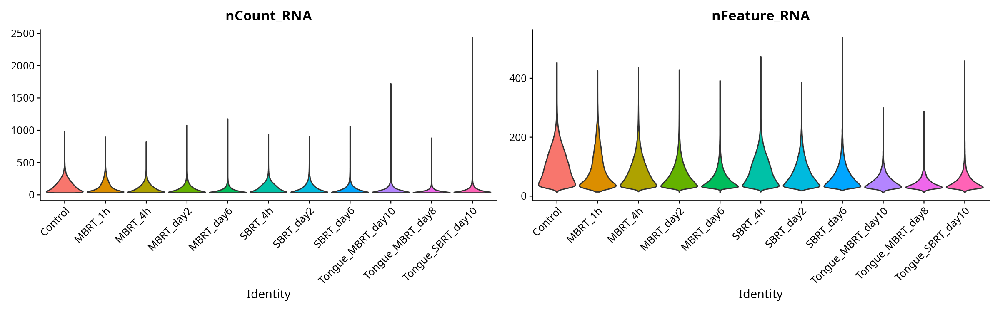

***** Normalization and Clustering
:PROPERTIES:
:header-args:jupyter-R+: :tangle no
:END:

Retired 2026-08-13: =dev/peak_valley_analysis/02_normalize_cluster.R= was deleted from the repo and this block no longer tangles; it is kept here for the record.

LogNormalize (scale 1e4), VST variable features (2000), PCA (20 dims), Louvain clustering (resolution 0.4), UMAP. Generates landscape plots by cluster, condition, slide, and treatment. Expected: 9 clusters.

#+begin_src jupyter-R
if (!exists("obj")) source("00_load_data.R")
library(future)

# Load QC'd object if not already in memory from 01
if (!"qcFlagsCell" %in% colnames(obj@meta.data) || any(obj$qcFlagsCell != "Pass", na.rm = TRUE)) {
  obj <- readRDS(file.path(ANALYSIS_DIR, "objects", "seurat_qc.rds"))
  cat(sprintf("Loaded QC'd object: %d cells\n", ncol(obj)))
}

# --- Normalize ---
obj <- NormalizeData(obj, normalization.method = "LogNormalize", scale.factor = 1e4)
obj <- FindVariableFeatures(obj, selection.method = "vst", nfeatures = 2000)
cat(sprintf("Variable features: %d\n", length(VariableFeatures(obj))))
obj <- ScaleData(obj, features = VariableFeatures(obj))
obj <- RunPCA(obj, features = VariableFeatures(obj))

# --- Cluster ---
options(future.globals.maxSize = 50 * 1024^3)
plan(multicore, workers = 48)
obj <- FindNeighbors(obj, dims = 1:20)
obj <- FindClusters(obj, resolution = 0.4)
plan(sequential)

# --- UMAP ---
obj <- RunUMAP(obj, dims = 1:20, n.neighbors = 30, min.dist = 0.3)
cat(sprintf("Clusters: %d | Cells: %d\n", length(levels(obj$seurat_clusters)), ncol(obj)))

# --- Plots ---
library(patchwork)
p1 <- DimPlot(obj, group.by = "seurat_clusters", raster = TRUE, label = TRUE) + labs(title = "Clusters")
p2 <- DimPlot(obj, group.by = "Condition", raster = TRUE) + labs(title = "Condition")
p3 <- DimPlot(obj, group.by = "Slide", raster = TRUE) + labs(title = "Slide (batch)")
p4 <- DimPlot(obj, group.by = "treatment", raster = TRUE) + labs(title = "Treatment")
p_umap <- (p1 | p2) / (p3 | p4)
ggsave(file.path(PLOT_DIR, "umap_landscape.png"), plot = p_umap, width = 16, height = 12, dpi = 150)

# --- Save ---
saveRDS(obj, file.path(ANALYSIS_DIR, "objects", "seurat_clustered.rds"))
cat("Clustered object saved.\n")
#+end_src

#+ATTR_ORG: :width 800
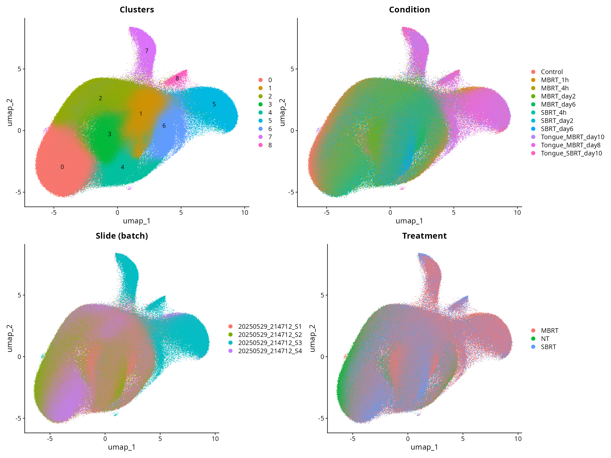

***** Cell Type Validation
:PROPERTIES:
:header-args:jupyter-R+: :tangle no
:END:

Retired 2026-08-13: =dev/peak_valley_analysis/03_cell_type_validation.R= was deleted from the repo and this block no longer tangles; it is kept here for the record.

Validate Yi's insitutype cell type labels against canonical markers (18/19 present in panel). The uncharacterized "a" population expresses epithelial markers (Epcam, Krt8/18) and is reclassified as tumor_epithelial. Generate dotplot, UMAP, and spatial cell type maps.

#+begin_src jupyter-R
if (!exists("PATHWAY_COLS")) source("00_load_data.R")
obj <- readRDS(file.path(ANALYSIS_DIR, "objects", "seurat_clustered.rds"))
cat(sprintf("Loaded: %d genes x %d cells\n", nrow(obj), ncol(obj)))

# --- Tabulate Yi's insitutype labels ---
ct_table <- sort(table(obj$ImmuneAtlas_ImmGen_Main_cell_Types), decreasing = TRUE)
cat("Cell type frequencies:\n")
print(ct_table)

ct_family <- sort(table(obj$ImmuneAtlas_ImmGen_cellFamily_Main_cell_Types), decreasing = TRUE)
cat("\nCell family frequencies:\n")
print(ct_family)

# --- Canonical marker validation ---
marker_candidates <- c(
  "Cd3e", "Cd3d", "Cd4", "Cd8a", "Cd8b1",
  "Cd68", "Adgre1", "Csf1r", "Itgam",
  "Epcam", "Krt8", "Krt18", "Krt14",
  "Cd19", "Ms4a1",
  "Ncr1", "Klrb1c",
  "Pecam1", "Cdh5"
)
available_markers <- marker_candidates[marker_candidates %in% rownames(obj)]
cat(sprintf("\nAvailable markers: %d / %d\n", length(available_markers), length(marker_candidates)))

p_dot <- DotPlot(obj, features = available_markers,
                 group.by = "ImmuneAtlas_ImmGen_Main_cell_Types") +
  RotatedAxis() +
  labs(title = "Marker validation: Yi's cell type labels")
ggsave(file.path(PLOT_DIR, "celltype_marker_dotplot.png"), plot = p_dot, width = 14, height = 8, dpi = 150)

# --- Characterize "a" population as tumor_epithelial ---
epi_markers <- available_markers[available_markers %in% c("Epcam", "Krt8", "Krt18", "Krt14")]
norm_data <- GetAssayData(obj, layer = "data")
a_cells <- which(obj$ImmuneAtlas_ImmGen_Main_cell_Types == "a")
non_a <- which(obj$ImmuneAtlas_ImmGen_Main_cell_Types != "a")
cat("\nEpithelial marker enrichment in 'a' population:\n")
for (m in epi_markers) {
  a_mean <- mean(norm_data[m, a_cells])
  other_mean <- mean(norm_data[m, non_a])
  cat(sprintf("  %s: 'a' mean=%.3f, others mean=%.3f, ratio=%.1f\n",
              m, a_mean, other_mean, a_mean / max(other_mean, 0.001)))
}

# --- Create validated cell type label ---
obj$cell_type_validated <- obj$ImmuneAtlas_ImmGen_Main_cell_Types
obj$cell_type_validated[obj$cell_type_validated == "a"] <- "tumor_epithelial"

# --- UMAP by validated cell type ---
p_ct <- DimPlot(obj, group.by = "cell_type_validated", raster = TRUE, label = TRUE, repel = TRUE) +
  labs(title = "Cell types (validated)")
ggsave(file.path(PLOT_DIR, "umap_celltype_validated.png"), plot = p_ct, width = 10, height = 8, dpi = 150)

# --- Spatial cell type maps (flank) ---
p_spatial <- obj@meta.data %>%
  as.data.frame() %>%
  filter(model == "flank") %>%
  ggplot(aes(x = x_slide_mm, y = y_slide_mm, color = cell_type_validated)) +
  geom_point(size = 0.1, alpha = 0.3) +
  facet_wrap(~Condition, scales = "free") +
  labs(title = "Spatial cell type distribution (flank)", color = "Cell type") +
  theme_bw() +
  theme(legend.position = "bottom") +
  guides(color = guide_legend(override.aes = list(size = 2, alpha = 1)))
ggsave(file.path(PLOT_DIR, "spatial_celltype_flank.png"), plot = p_spatial, width = 16, height = 12, dpi = 150)

# --- Save updated object ---
saveRDS(obj, file.path(ANALYSIS_DIR, "objects", "seurat_clustered.rds"))
cat("Updated object saved with validated cell types.\n")
#+end_src

#+ATTR_ORG: :width 800
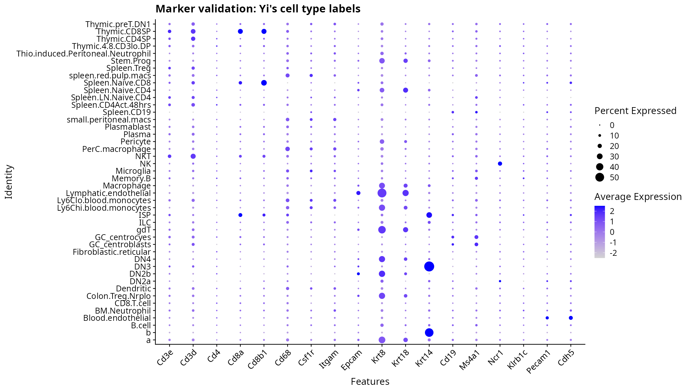

#+ATTR_ORG: :width 800
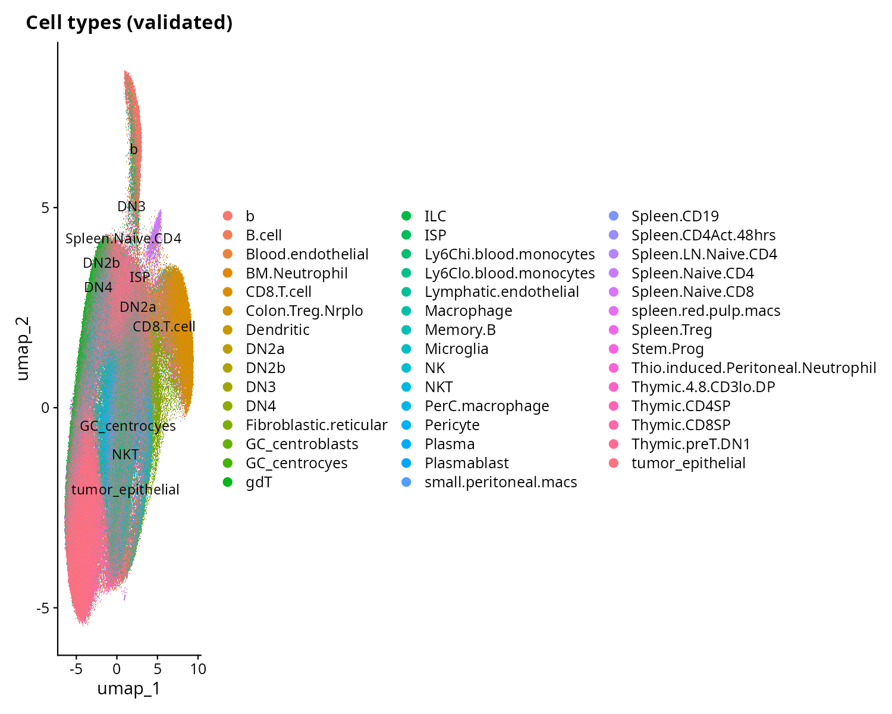

#+ATTR_ORG: :width 800

***** DEGs and Kinetics Overview
:PROPERTIES:
:header-args:jupyter-R+: :tangle no
:END:

Retired 2026-08-13: =dev/peak_valley_analysis/04_deg_kinetics.R= was deleted from the repo and this block no longer tangles; it is kept here for the record.

Condensed Layer 2 analysis: effect-size ranked DEGs for MBRT vs Control, SBRT vs Control, and MBRT vs SBRT at matched timepoints. Pathway score kinetics (DDR, IFN-I, IFN-II, STING) across the time course. Cell type composition shifts and spatial neighborhood immune fractions at 4h. This section motivates the peak/valley investigation by establishing that MBRT and SBRT produce distinct transcriptomic responses.

#+begin_src jupyter-R
if (!exists("PATHWAY_COLS")) source("00_load_data.R")
library(RANN)

obj <- readRDS(file.path(ANALYSIS_DIR, "objects", "seurat_clustered.rds"))
cat(sprintf("Loaded: %d genes x %d cells\n", nrow(obj), ncol(obj)))

# ---- DEG function (effect-size ranked) ----
run_deg <- function(obj, ident.1, ident.2, group.by = "Condition") {
  Idents(obj) <- group.by
  markers <- FindMarkers(obj, ident.1 = ident.1, ident.2 = ident.2,
                         min.pct = 0.1, logfc.threshold = 0.1)
  markers$gene <- rownames(markers)
  markers$comparison <- paste0(ident.1, "_vs_", ident.2)
  markers %>% arrange(desc(abs(avg_log2FC)))
}

# ---- Bulk DEGs: MBRT/SBRT vs Control, MBRT vs SBRT ----
cat("Running bulk DEGs...\n")
mbrt_tp <- c("MBRT_1h", "MBRT_4h", "MBRT_day2", "MBRT_day6")
deg_mbrt_ctrl <- map_dfr(mbrt_tp, function(tp) {
  sub <- subset(obj, cells = colnames(obj)[obj$Condition %in% c(tp, "Control")])
  run_deg(sub, tp, "Control")
})

sbrt_tp <- c("SBRT_4h", "SBRT_day2", "SBRT_day6")
deg_sbrt_ctrl <- map_dfr(sbrt_tp, function(tp) {
  sub <- subset(obj, cells = colnames(obj)[obj$Condition %in% c(tp, "Control")])
  run_deg(sub, tp, "Control")
})

matched <- list(c("MBRT_4h", "SBRT_4h"), c("MBRT_day2", "SBRT_day2"), c("MBRT_day6", "SBRT_day6"))
deg_mbrt_sbrt <- map_dfr(matched, function(pair) {
  sub <- subset(obj, cells = colnames(obj)[obj$Condition %in% pair])
  run_deg(sub, pair[1], pair[2])
})

all_degs <- bind_rows(
  mbrt_vs_ctrl = deg_mbrt_ctrl,
  sbrt_vs_ctrl = deg_sbrt_ctrl,
  mbrt_vs_sbrt = deg_mbrt_sbrt,
  .id = "comparison_type"
)
write_tsv(all_degs, file.path(DATA_DIR, "deg_all_cells.tsv"))
cat(sprintf("Total bulk DEG rows: %d\n", nrow(all_degs)))

# Volcano retired: -log10(p_val) is a cell-level Wilcoxon p, which pseudoreplicates the
# n=1-per-condition design. all_degs (written above) stays valid as a descriptive
# effect-size table. Correct significance test deferred until Mutter_02 (2d) replicates:
# pseudobulk per sample -> DESeq2/edgeR/limma -> MA-plot/volcano with real p-values.

# ---- Pathway kinetics ----
kinetics <- obj@meta.data %>%
  as.data.frame() %>%
  filter(model == "flank") %>%
  group_by(timepoint_h, treatment) %>%
  summarise(across(all_of(PATHWAY_COLS), mean, na.rm = TRUE), .groups = "drop") %>%
  pivot_longer(cols = all_of(PATHWAY_COLS), names_to = "pathway", values_to = "score")

p_kin <- kinetics %>%
  filter(treatment %in% c("MBRT", "SBRT")) %>%
  mutate(pathway = PATHWAY_LABELS[pathway]) %>%
  ggplot(aes(x = factor(timepoint_h), y = score, color = treatment, group = treatment)) +
  geom_line(linewidth = 1) + geom_point(size = 3) +
  facet_wrap(~pathway, scales = "free_y") +
  scale_color_manual(values = TREATMENT_COLORS) +
  labs(x = "Hours post-RT", y = "Mean pathway score", caption = "n=1 per condition") +
  theme_bw()
ggsave(file.path(PLOT_DIR, "pathway_kinetics.png"), plot = p_kin, width = 10, height = 8, dpi = 150)
write_tsv(kinetics, file.path(DATA_DIR, "pathway_kinetics.tsv"))

# ---- Composition ----
composition <- obj@meta.data %>%
  as.data.frame() %>%
  filter(model == "flank") %>%
  count(Condition, timepoint_h, treatment, cell_type = cell_type_validated) %>%
  group_by(Condition) %>%
  mutate(prop = n / sum(n)) %>%
  ungroup()

p_comp <- composition %>%
  filter(Condition %in% CONDITION_LEVELS[1:8]) %>%
  mutate(Condition = factor(Condition, levels = CONDITION_LEVELS)) %>%
  ggplot(aes(x = Condition, y = prop, fill = cell_type)) +
  geom_col() +
  labs(x = NULL, y = "Proportion", fill = "Cell type", title = "Cell type composition (flank)") +
  theme_bw() + theme(axis.text.x = element_text(angle = 45, hjust = 1))
ggsave(file.path(PLOT_DIR, "composition_stacked.png"), plot = p_comp, width = 10, height = 6, dpi = 150)
write_tsv(composition, file.path(DATA_DIR, "composition.tsv"))

# ---- Spatial NN immune fraction (MBRT vs SBRT at 4h) ----
cat("Computing spatial nearest neighbors at 4h...\n")
nn_results <- map_dfr(c("MBRT_4h", "SBRT_4h"), function(cond) {
  meta_sub <- obj@meta.data %>% as.data.frame() %>% filter(Condition == cond)
  coords <- as.matrix(meta_sub[, c("x_slide_mm", "y_slide_mm")])
  ct <- meta_sub$cell_type_validated
  nn <- nn2(coords, k = 21)
  nn_idx <- nn$nn.idx[, -1]
  immune_frac <- rowMeans(matrix(ct[nn_idx] != "tumor_epithelial", nrow = nrow(nn_idx)))
  tibble(condition = cond, cell_type = ct, immune_neighbor_frac = immune_frac)
})

p_nn <- nn_results %>%
  ggplot(aes(x = immune_neighbor_frac, fill = condition)) +
  geom_density(alpha = 0.5) +
  facet_wrap(~cell_type, scales = "free_y") +
  scale_fill_manual(values = c("MBRT_4h" = TREATMENT_COLORS["MBRT"], "SBRT_4h" = TREATMENT_COLORS["SBRT"])) +
  labs(x = "Fraction immune neighbors (k=20)", title = "Spatial immune neighborhoods: MBRT vs SBRT at 4h") +
  theme_bw()
ggsave(file.path(PLOT_DIR, "spatial_nn_immune_frac.png"), plot = p_nn, width = 14, height = 10, dpi = 150)

cat("Layer 2 condensed analysis complete.\n")
#+end_src

#+ATTR_ORG: :width 800
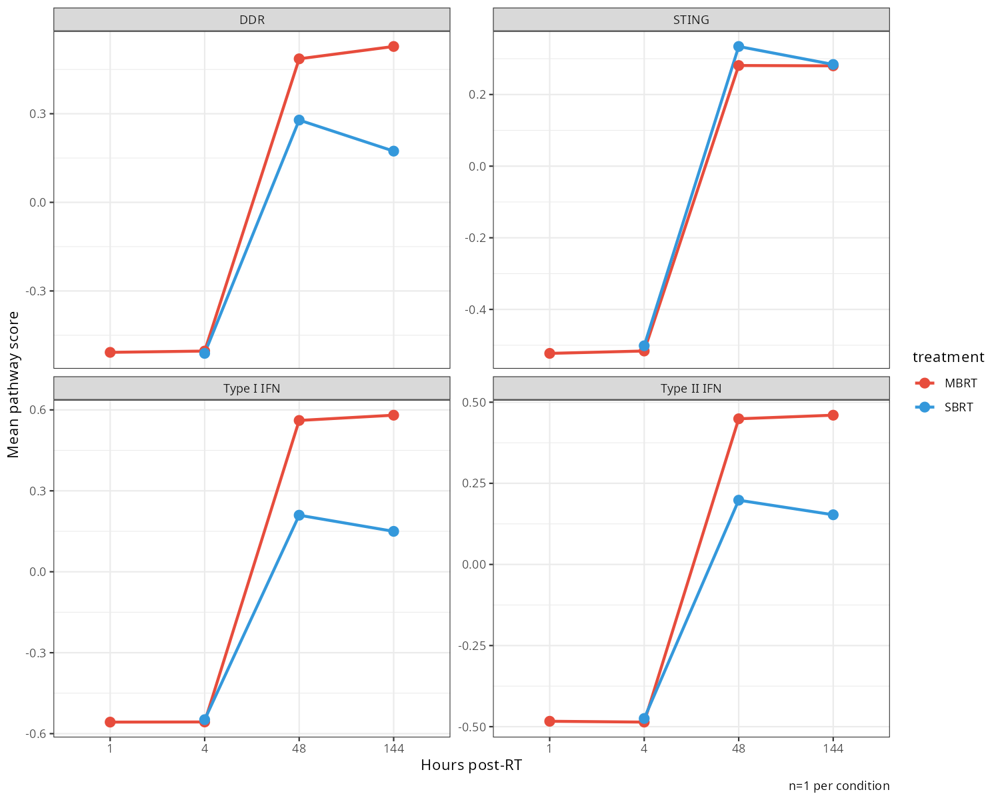

#+ATTR_ORG: :width 800
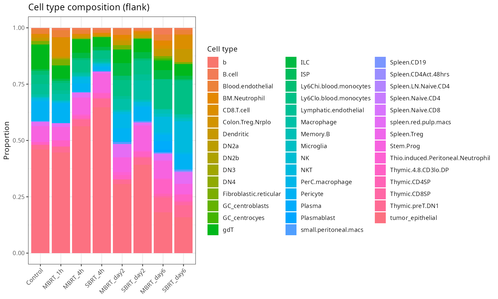

#+ATTR_ORG: :width 800
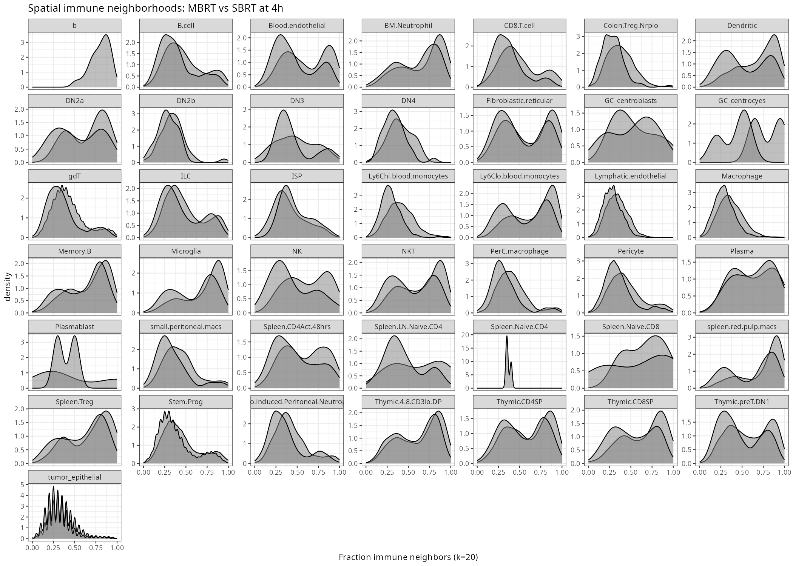

***** Stripe Detection
:PROPERTIES:
:header-args:jupyter-R+: :tangle no
:END:

Retired 2026-08-13: =dev/peak_valley_analysis/05_stripe_detection.R= was deleted from the repo and this block no longer tangles; it is kept here for the record.

Curated highlights from iterative stripe model development. Fine-grained p21/Cdkn1a spatial profiling reveals periodic variation along the y-axis. Rotated axis scan confirms y-axis as the primary stripe direction. Tilt angle optimization (5-35 degrees, 2-degree steps) identifies 15 degrees as optimal. Grid search with forced 4-peak constraint converges on 1.02mm spacing. Key insight: transcript-based DDR scores alone are too noisy for stripe resolution; geometric model plus image validation is required.

#+begin_src jupyter-R
if (!exists("PATHWAY_COLS")) source("00_load_data.R")
library(zoo)

obj <- readRDS(file.path(ANALYSIS_DIR, "objects", "seurat_clustered.rds"))

# --- Extract MBRT_4h cells ---
mbrt4h <- obj@meta.data %>%
  as.data.frame() %>%
  filter(Condition == "MBRT_4h") %>%
  select(cell_id, fov, x_slide_mm, y_slide_mm, cell_type_validated,
         all_of(PATHWAY_COLS))

p21_expr <- GetAssayData(obj, layer = "data")["Cdkn1a",
  rownames(obj@meta.data[obj@meta.data$Condition == "MBRT_4h", ])]
mbrt4h$p21 <- as.numeric(p21_expr[rownames(mbrt4h)])
cat(sprintf("MBRT_4h: %d cells, %d FOVs\n", nrow(mbrt4h), length(unique(mbrt4h$fov))))

# ---- Highlight 1: Fine-grained p21 spatial profile ----
y_profile <- mbrt4h %>%
  mutate(y_bin = round(y_slide_mm / 0.1) * 0.1) %>%
  group_by(y_bin) %>%
  summarise(mean_p21 = mean(p21, na.rm = TRUE), n_cells = n(), .groups = "drop") %>%
  filter(n_cells >= 50) %>%
  arrange(y_bin) %>%
  mutate(p21_smooth = rollmean(mean_p21, k = 5, fill = NA, align = "center"))

p_profile <- ggplot(y_profile, aes(x = y_bin)) +
  geom_point(aes(y = mean_p21, size = n_cells), alpha = 0.3) +
  geom_line(aes(y = p21_smooth), color = "red", linewidth = 1.2, na.rm = TRUE) +
  labs(x = "y position (mm)", y = "Mean p21 (Cdkn1a)",
       title = "MBRT_4h: p21 y-axis profile (0.1mm bins, 0.5mm rolling mean)") +
  theme_bw()
ggsave(file.path(PLOT_DIR, "stripe_p21_y_profile.png"), plot = p_profile, width = 12, height = 5, dpi = 150)

# ---- Highlight 2: Rotated axis scan (stripe orientation) ----
angles <- seq(0, 175, by = 15)
angle_cvs <- map_dbl(angles, function(theta) {
  rad <- theta * pi / 180
  proj <- mbrt4h$x_slide_mm * cos(rad) + mbrt4h$y_slide_mm * sin(rad)
  bins <- round(proj / 0.1) * 0.1
  profile <- tibble(bin = bins, p21 = mbrt4h$p21) %>%
    group_by(bin) %>%
    summarise(mean_p21 = mean(p21, na.rm = TRUE), n = n(), .groups = "drop") %>%
    filter(n >= 50) %>% arrange(bin)
  if (nrow(profile) < 7) return(0)
  smoothed <- rollmean(profile$mean_p21, k = 5, fill = NA, align = "center")
  smoothed <- smoothed[!is.na(smoothed)]
  if (length(smoothed) < 3) return(0)
  sd(smoothed) / mean(smoothed)
})

angle_df <- tibble(angle = angles, cv = angle_cvs)
best_proj_angle <- angle_df$angle[which.max(angle_df$cv)]
cat(sprintf("Best projection angle: %d deg (CV=%.4f)\n", best_proj_angle, max(angle_df$cv)))

p_angle <- ggplot(angle_df, aes(x = angle, y = cv)) +
  geom_line(linewidth = 1) + geom_point(size = 3) +
  geom_vline(xintercept = best_proj_angle, color = "red", linetype = "dashed") +
  labs(x = "Projection angle (degrees)", y = "CV of smoothed p21",
       title = "Stripe direction scan: Y-axis shows strongest periodic variation") +
  theme_bw()
ggsave(file.path(PLOT_DIR, "stripe_angle_scan.png"), plot = p_angle, width = 10, height = 6, dpi = 150)

# ---- Highlight 3: Tilt angle optimization ----
cat("Scanning tilt angles (5-35 deg)...\n")
angle_results <- map_dfr(seq(5, 35, by = 2), function(deg) {
  rad <- deg * pi / 180
  y_corr <- mbrt4h$y_slide_mm + mbrt4h$x_slide_mm * tan(rad)
  best_contrast <- 0
  best_s <- NA
  for (s in seq(0.6, 1.8, by = 0.1)) {
    for (o in seq(min(y_corr) + s/4, min(y_corr) + s * 1.5, by = 0.1)) {
      centers <- seq(o, max(y_corr) + s, by = s)
      dist <- sapply(y_corr, function(yc) min(abs(yc - centers)))
      pk <- which(dist < s / 4)
      vl <- which(dist > s / 2)
      if (length(pk) < 500 || length(vl) < 500) next
      contrast <- mean(mbrt4h$p21[pk], na.rm = TRUE) - mean(mbrt4h$p21[vl], na.rm = TRUE)
      if (contrast > best_contrast) { best_contrast <- contrast; best_s <- s }
    }
  }
  tibble(angle = deg, best_spacing = best_s, contrast = best_contrast)
})

opt_angle <- angle_results$angle[which.max(angle_results$contrast)]
cat(sprintf("Optimal tilt: %d deg (contrast=%.4f)\n", opt_angle, max(angle_results$contrast)))

p_tilt <- ggplot(angle_results, aes(x = angle, y = contrast)) +
  geom_line(linewidth = 1) + geom_point(size = 3) +
  geom_vline(xintercept = opt_angle, color = "red", linetype = "dashed") +
  labs(x = "Tilt angle (degrees)", y = "Peak - Valley p21 contrast",
       title = "Tilt optimization: 15 deg confirmed as optimal") +
  theme_bw()
ggsave(file.path(PLOT_DIR, "stripe_tilt_optimization.png"), plot = p_tilt, width = 10, height = 6, dpi = 150)

# ---- Highlight 4: 4-peak grid search ----
rad <- 15 * pi / 180
mbrt4h <- mbrt4h %>% mutate(y_corr = y_slide_mm + x_slide_mm * tan(rad))
y_range <- range(mbrt4h$y_corr)

results_4pk <- expand_grid(
  spacing = seq(0.8, 1.3, by = 0.02),
  offset = seq(y_range[1] + 0.1, y_range[1] + 1.3, by = 0.05)
) %>%
  mutate(n_peaks = map2_int(spacing, offset, function(s, o) {
    centers <- seq(o, y_range[2] + 0.1, by = s)
    sum(sapply(centers, function(c) sum(abs(mbrt4h$y_corr - c) < s/4) > 100))
  })) %>%
  filter(n_peaks == 4) %>%
  mutate(contrast = map2_dbl(spacing, offset, function(s, o) {
    centers <- seq(o, y_range[2] + 0.1, by = s)
    dist <- sapply(mbrt4h$y_corr, function(yc) min(abs(yc - centers)))
    pk <- which(dist < s / 4); vl <- which(dist > s / 4)
    if (length(pk) < 1000 || length(vl) < 1000) return(0)
    mean(mbrt4h$p21[pk], na.rm = TRUE) - mean(mbrt4h$p21[vl], na.rm = TRUE)
  }))

best_4pk <- results_4pk %>% arrange(desc(contrast)) %>% head(1)
cat(sprintf("\n4-peak model: spacing=%.2fmm, contrast=%.4f\n", best_4pk$spacing, best_4pk$contrast))

# Compute beam centers for best model
beam_centers <- seq(best_4pk$offset, y_range[2] + 0.1, by = best_4pk$spacing)
beam_centers <- beam_centers[sapply(beam_centers, function(c) sum(abs(mbrt4h$y_corr - c) < best_4pk$spacing/4) > 100)]
cat(sprintf("Beam centers (corrected y): %s\n", paste(round(beam_centers, 2), collapse = ", ")))

# Save stripe model parameters for downstream scripts
stripe_model <- list(
  tilt_deg = 15,
  spacing_mm = best_4pk$spacing,
  beam_centers = beam_centers,
  n_peaks = length(beam_centers)
)
saveRDS(stripe_model, file.path(DATA_DIR, "stripe_model.rds"))

# 4-pathway spatial heatmaps
p21_heatmap <- ggplot(mbrt4h, aes(x = x_slide_mm, y = y_slide_mm)) +
  stat_summary_2d(aes(z = p21), fun = mean, binwidth = c(0.1, 0.1)) +
  scale_fill_viridis_c(option = "inferno", name = "Mean p21") +
  coord_fixed() + labs(title = "p21 spatial heatmap") + theme_bw()

ddr_heatmap <- ggplot(mbrt4h, aes(x = x_slide_mm, y = y_slide_mm)) +
  stat_summary_2d(aes(z = DNA_Damage_Repair), fun = mean, binwidth = c(0.1, 0.1)) +
  scale_fill_viridis_c(option = "inferno", name = "Mean DDR") +
  coord_fixed() + labs(title = "DDR spatial heatmap") + theme_bw()

sting_heatmap <- ggplot(mbrt4h, aes(x = x_slide_mm, y = y_slide_mm)) +
  stat_summary_2d(aes(z = STING), fun = mean, binwidth = c(0.1, 0.1)) +
  scale_fill_viridis_c(option = "plasma", name = "Mean STING") +
  coord_fixed() + labs(title = "STING spatial heatmap") + theme_bw()

ifn1_heatmap <- ggplot(mbrt4h, aes(x = x_slide_mm, y = y_slide_mm)) +
  stat_summary_2d(aes(z = TypeI_interferon), fun = mean, binwidth = c(0.1, 0.1)) +
  scale_fill_viridis_c(option = "magma", name = "Mean IFN-I") +
  coord_fixed() + labs(title = "Type I IFN spatial heatmap") + theme_bw()

combo <- (p21_heatmap | ddr_heatmap) / (sting_heatmap | ifn1_heatmap)
ggsave(file.path(PLOT_DIR, "stripe_4pathway_heatmaps.png"), plot = combo, width = 20, height = 16, dpi = 150)

cat("Stripe detection complete. Model saved to data/stripe_model.rds\n")
#+end_src

#+ATTR_ORG: :width 800
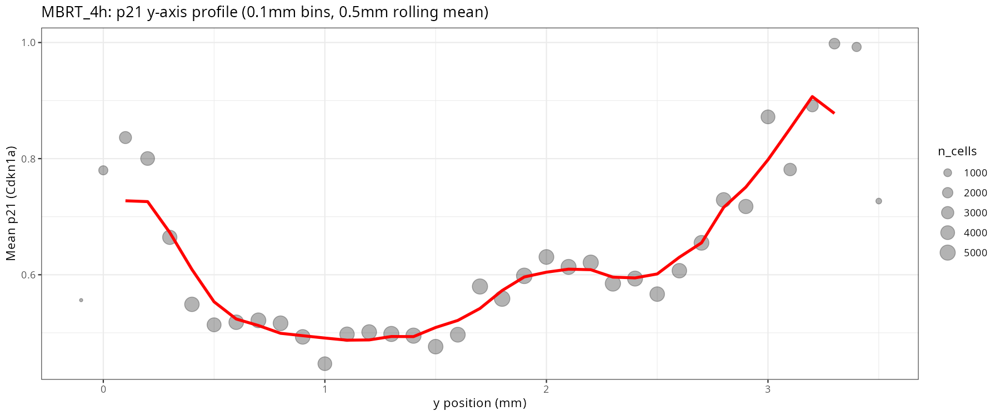

#+ATTR_ORG: :width 800
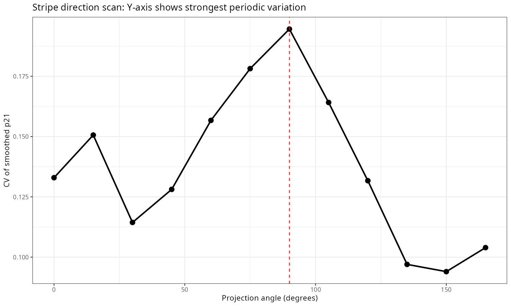

#+ATTR_ORG: :width 800
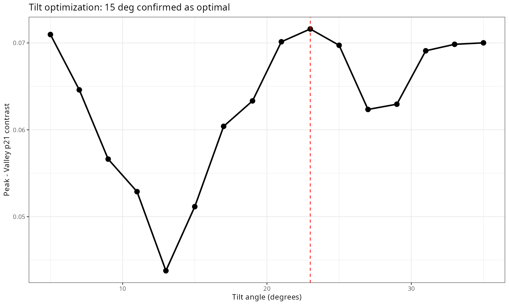

#+ATTR_ORG: :width 800
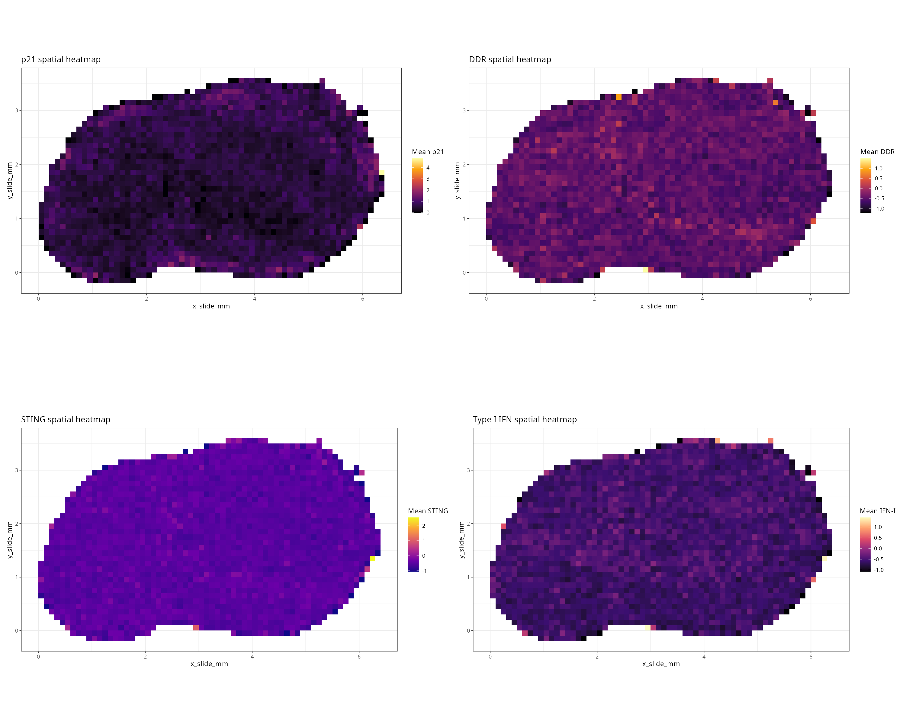

***** H2AX Image Validation
:PROPERTIES:
:header-args:jupyter-R+: :tangle no
:END:

Retired 2026-08-13: =dev/peak_valley_analysis/06_h2ax_validation.R= was deleted from the repo and this block no longer tangles; it is kept here for the record.

Critical validation gate. Extract H2AX immunofluorescence images from the lab-provided PPTX, generate a stripe model zone map at matching scale and orientation, and attempt programmatic co-registration by comparing H2AX intensity profiles along the y-axis to model beam centers. Acceptance criterion: beam centers within ~0.2mm of H2AX intensity peaks. If programmatic co-registration fails, side-by-side visual comparison is the fallback.

#+begin_src jupyter-R
if (!exists("PATHWAY_COLS")) source("00_load_data.R")
library(officer)
library(magick)

obj <- readRDS(file.path(ANALYSIS_DIR, "objects", "seurat_clustered.rds"))
stripe_model <- readRDS(file.path(DATA_DIR, "stripe_model.rds"))

mbrt4h <- obj@meta.data %>%
  as.data.frame() %>%
  filter(Condition == "MBRT_4h") %>%
  select(cell_id, fov, x_slide_mm, y_slide_mm, cell_type_validated)

rad <- stripe_model$tilt_deg * pi / 180
mbrt4h <- mbrt4h %>% mutate(y_corr = y_slide_mm + x_slide_mm * tan(rad))

# ---- Part A: Extract H2AX image from PPTX ----
pptx_path <- file.path(INPUT_DIR, "Gamma H2AX + FOVs.pptx")
cat(sprintf("Reading PPTX: %s\n", pptx_path))

tryCatch({
  pptx <- read_pptx(pptx_path)
  slide_summary <- pptx_summary(pptx)
  cat(sprintf("PPTX has %d slides, %d content elements\n",
              max(slide_summary$slide_index), nrow(slide_summary)))

  # Extract images from PPTX media
  img_files <- list.files(
    file.path(dirname(pptx_path), "..", "pptx_media"),
    pattern = "\\.(png|jpg|jpeg|tif|tiff)$", full.names = TRUE, ignore.case = TRUE
  )

  # Alternative: extract directly from pptx zip
  if (length(img_files) == 0) {
    tmpdir <- tempdir()
    unzip(pptx_path, exdir = tmpdir)
    img_files <- list.files(file.path(tmpdir, "ppt", "media"),
                            pattern = "\\.(png|jpg|jpeg|tif|tiff|emf|wmf)$",
                            full.names = TRUE, ignore.case = TRUE)
    cat(sprintf("Extracted %d media files from PPTX\n", length(img_files)))
  }

  if (length(img_files) > 0) {
    # Read the largest image (likely the H2AX slide scan)
    img_sizes <- file.size(img_files)
    h2ax_path <- img_files[which.max(img_sizes)]
    cat(sprintf("Using largest image: %s (%.1f KB)\n", basename(h2ax_path), max(img_sizes) / 1024))

    h2ax_img <- image_read(h2ax_path)
    img_info <- image_info(h2ax_img)
    cat(sprintf("Image dimensions: %d x %d px\n", img_info$width, img_info$height))

    # Save extracted image
    image_write(h2ax_img, file.path(PLOT_DIR, "h2ax_extracted.png"))
    cat("H2AX image saved to plots/h2ax_extracted.png\n")
    h2ax_extracted <- TRUE
  } else {
    cat("WARNING: No images found in PPTX. Side-by-side comparison will use placeholder.\n")
    h2ax_extracted <- FALSE
  }
}, error = function(e) {
  cat(sprintf("PPTX extraction failed: %s\n", e$message))
  cat("Proceeding with zone map only.\n")
  h2ax_extracted <<- FALSE
})

# ---- Part A (cont): Side-by-side zone map ----
fov_centroids <- mbrt4h %>%
  group_by(fov) %>%
  summarise(x = mean(x_slide_mm), y = mean(y_slide_mm), .groups = "drop")

# Classify cells for zone map
mbrt4h <- mbrt4h %>%
  mutate(dist_to_peak = sapply(y_corr, function(yc) min(abs(yc - stripe_model$beam_centers)))) %>%
  mutate(zone = ifelse(dist_to_peak < stripe_model$spacing_mm / 4, "peak", "valley"))

p_zones <- ggplot(mbrt4h, aes(x = x_slide_mm, y = y_slide_mm, color = zone)) +
  geom_point(size = 0.02, alpha = 0.3) +
  scale_color_manual(values = ZONE_COLORS) +
  coord_fixed() +
  labs(title = sprintf("Stripe model: %d-deg tilt, %.2fmm spacing, %d peaks",
                       stripe_model$tilt_deg, stripe_model$spacing_mm, stripe_model$n_peaks),
       color = "Zone") +
  theme_bw(base_size = 14)
for (bc in stripe_model$beam_centers) {
  p_zones <- p_zones + geom_abline(intercept = bc, slope = -tan(rad),
                                    color = "yellow", linewidth = 0.6, alpha = 0.8)
}

# With FOV labels
p_zones_labeled <- p_zones +
  geom_text(data = fov_centroids, aes(x = x, y = y, label = fov),
            color = "black", size = 2, fontface = "bold", inherit.aes = FALSE)
ggsave(file.path(PLOT_DIR, "h2ax_zone_map_labeled.png"), plot = p_zones_labeled, width = 14, height = 10, dpi = 150)

# ---- Part B: Programmatic co-registration attempt ----
if (exists("h2ax_extracted") && h2ax_extracted) {
  tryCatch({
    cat("\nAttempting programmatic co-registration...\n")

    # Convert H2AX image to grayscale for intensity analysis
    h2ax_gray <- image_convert(h2ax_img, colorspace = "gray")
    h2ax_mat <- as.integer(image_data(h2ax_gray, channels = "gray"))
    dim(h2ax_mat) <- c(img_info$height, img_info$width)

    cat(sprintf("Grayscale matrix: %d rows x %d cols\n", nrow(h2ax_mat), ncol(h2ax_mat)))

    # Compute column-averaged intensity profile (horizontal stripes -> vertical profile)
    row_means <- rowMeans(h2ax_mat)

    # Smooth the profile
    row_smooth <- rollmean(row_means, k = max(1, length(row_means) %/% 50), fill = NA, align = "center")

    # Map pixel rows to approximate mm (using tissue extent)
    tissue_rows <- which(row_means > quantile(row_means, 0.1))
    if (length(tissue_rows) > 10) {
      tissue_top <- min(tissue_rows)
      tissue_bot <- max(tissue_rows)
      tissue_span_px <- tissue_bot - tissue_top

      # CosMx tissue y-range
      y_range_mm <- range(mbrt4h$y_slide_mm)
      mm_per_px <- diff(y_range_mm) / tissue_span_px

      intensity_profile <- tibble(
        pixel_row = seq_along(row_smooth),
        intensity = row_smooth,
        y_mm = (pixel_row - tissue_top) * mm_per_px + y_range_mm[1]
      ) %>%
        filter(!is.na(intensity), y_mm >= y_range_mm[1] - 0.5, y_mm <= y_range_mm[2] + 0.5)

      # Plot H2AX intensity profile with beam centers overlaid
      p_intensity <- ggplot(intensity_profile, aes(x = y_mm, y = intensity)) +
        geom_line(color = "brown", linewidth = 0.5) +
        geom_vline(xintercept = stripe_model$beam_centers, color = "red", linetype = "dashed", linewidth = 0.8) +
        annotate("text", x = stripe_model$beam_centers, y = max(intensity_profile$intensity, na.rm = TRUE) * 0.95,
                 label = paste0("P", seq_along(stripe_model$beam_centers)), color = "red", size = 4) +
        labs(x = "y position (mm, approximate)", y = "H2AX intensity (grayscale)",
             title = "H2AX intensity profile vs model beam centers",
             subtitle = "Red dashed = model peak centers; brown = H2AX staining intensity") +
        theme_bw()
      ggsave(file.path(PLOT_DIR, "h2ax_intensity_vs_model.png"), plot = p_intensity, width = 12, height = 5, dpi = 150)

      # Find H2AX intensity peaks
      d <- diff(row_smooth[!is.na(row_smooth)])
      local_maxs <- which(d[-length(d)] > 0 & d[-1] < 0) + 1
      h2ax_peaks_px <- (seq_along(row_smooth)[!is.na(row_smooth)])[local_maxs]
      h2ax_peaks_mm <- (h2ax_peaks_px - tissue_top) * mm_per_px + y_range_mm[1]
      h2ax_peaks_mm <- h2ax_peaks_mm[h2ax_peaks_mm >= y_range_mm[1] & h2ax_peaks_mm <= y_range_mm[2]]

      cat(sprintf("H2AX intensity peaks (mm): %s\n", paste(round(h2ax_peaks_mm, 2), collapse = ", ")))
      cat(sprintf("Model beam centers (mm):   %s\n", paste(round(stripe_model$beam_centers, 2), collapse = ", ")))

      # Compute alignment metric: for each model center, distance to nearest H2AX peak
      if (length(h2ax_peaks_mm) > 0) {
        alignment <- sapply(stripe_model$beam_centers, function(mc) {
          min(abs(mc - h2ax_peaks_mm))
        })
        cat(sprintf("Alignment (mm per center): %s\n", paste(round(alignment, 3), collapse = ", ")))
        cat(sprintf("Mean alignment error: %.3f mm (criterion: <0.2mm)\n", mean(alignment)))
        cat(sprintf("VALIDATION: %s\n", ifelse(mean(alignment) < 0.2, "PASS", "NEEDS REVIEW")))
      }
    }
  }, error = function(e) {
    cat(sprintf("Co-registration failed: %s\n", e$message))
    cat("Side-by-side visual comparison is the fallback.\n")
  })
} else {
  cat("\nH2AX image not available. Using zone map only for validation.\n")
  cat("User must visually compare h2ax_zone_map_labeled.png with PPTX.\n")
}

cat("\nH2AX validation complete. Review plots/h2ax_zone_map_labeled.png\n")
#+end_src

#+ATTR_ORG: :width 800
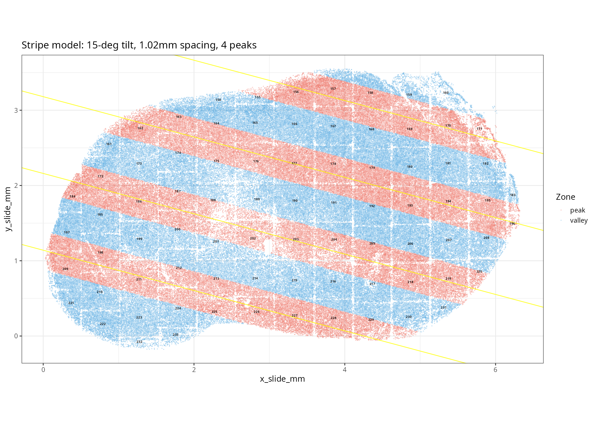

#+ATTR_ORG: :width 800
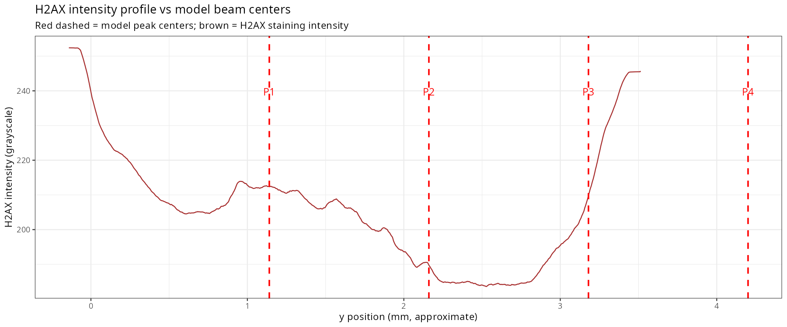

***** Peak Valley Classification
:PROPERTIES:
:header-args:jupyter-R+: :tangle no
:END:

Retired 2026-08-13: =dev/peak_valley_analysis/07_peak_valley_classify.R= was deleted from the repo and this block no longer tangles; it is kept here for the record.

Apply the validated (or best-available) stripe model to classify all MBRT_4h cells as peak or valley. Tilt-corrected y: y_corr = y_slide_mm + x_slide_mm * tan(15 degrees). Classification: peak if distance to nearest beam center < spacing/4, else valley. Save classification TSV and add zone metadata to Seurat object for downstream analysis.

#+begin_src jupyter-R
if (!exists("PATHWAY_COLS")) source("00_load_data.R")

obj <- readRDS(file.path(ANALYSIS_DIR, "objects", "seurat_clustered.rds"))
stripe_model <- readRDS(file.path(DATA_DIR, "stripe_model.rds"))

mbrt4h <- obj@meta.data %>%
  as.data.frame() %>%
  filter(Condition == "MBRT_4h") %>%
  select(cell_id, fov, x_slide_mm, y_slide_mm, cell_type_validated,
         all_of(PATHWAY_COLS))

p21_expr <- GetAssayData(obj, layer = "data")["Cdkn1a",
  rownames(obj@meta.data[obj@meta.data$Condition == "MBRT_4h", ])]
mbrt4h$p21 <- as.numeric(p21_expr[rownames(mbrt4h)])

# --- Apply stripe model ---
rad <- stripe_model$tilt_deg * pi / 180
mbrt4h <- mbrt4h %>%
  mutate(
    y_corr = y_slide_mm + x_slide_mm * tan(rad),
    dist_to_peak = sapply(y_corr, function(yc) min(abs(yc - stripe_model$beam_centers))),
    zone = ifelse(dist_to_peak < stripe_model$spacing_mm / 4, "peak", "valley")
  )

cat("=== Peak/Valley Classification ===\n")
cat(sprintf("Model: %d-deg tilt, %.2fmm spacing, %d peaks\n",
            stripe_model$tilt_deg, stripe_model$spacing_mm, stripe_model$n_peaks))
cat(sprintf("Beam centers: %s\n", paste(round(stripe_model$beam_centers, 2), collapse = ", ")))

zone_counts <- mbrt4h %>% count(zone) %>% mutate(pct = round(n / sum(n) * 100, 1))
print(zone_counts)

cat("\n=== p21 validation ===\n")
mbrt4h %>%
  group_by(zone) %>%
  summarise(n = n(), mean_p21 = mean(p21, na.rm = TRUE),
            mean_DDR = mean(DNA_Damage_Repair, na.rm = TRUE), .groups = "drop") %>%
  print()

# --- Save classification ---
pv_class <- mbrt4h %>%
  select(cell_id, fov, x_slide_mm, y_slide_mm, y_corr, dist_to_peak, zone,
         cell_type_validated, p21, all_of(PATHWAY_COLS))
write_tsv(pv_class, file.path(DATA_DIR, "mbrt4h_peak_valley.tsv"))
cat(sprintf("Classification saved: %d cells\n", nrow(pv_class)))

# --- Spatial zone map ---
fov_centroids <- mbrt4h %>%
  group_by(fov) %>%
  summarise(x = mean(x_slide_mm), y = mean(y_slide_mm), .groups = "drop")

p <- ggplot(mbrt4h, aes(x = x_slide_mm, y = y_slide_mm, color = zone)) +
  geom_point(size = 0.02, alpha = 0.3) +
  scale_color_manual(values = ZONE_COLORS) +
  geom_text(data = fov_centroids, aes(x = x, y = y, label = fov),
            color = "black", size = 2, fontface = "bold", inherit.aes = FALSE) +
  coord_fixed() +
  labs(title = sprintf("Peak/Valley: %d-deg tilt, %.2fmm, %d peaks",
                       stripe_model$tilt_deg, stripe_model$spacing_mm, stripe_model$n_peaks),
       color = "Zone") +
  theme_bw(base_size = 14)
for (bc in stripe_model$beam_centers) {
  p <- p + geom_abline(intercept = bc, slope = -tan(rad), color = "yellow", linewidth = 0.6, alpha = 0.8)
}
ggsave(file.path(PLOT_DIR, "peak_valley_zones.png"), plot = p, width = 14, height = 10, dpi = 150)

# --- Add zone to Seurat object for downstream use ---
zone_lookup <- setNames(mbrt4h$zone, mbrt4h$cell_id)
obj$peak_valley_zone <- zone_lookup[colnames(obj)]
saveRDS(obj, file.path(ANALYSIS_DIR, "objects", "seurat_clustered.rds"))
cat("Zone added to Seurat metadata and saved.\n")
#+end_src

#+ATTR_ORG: :width 800
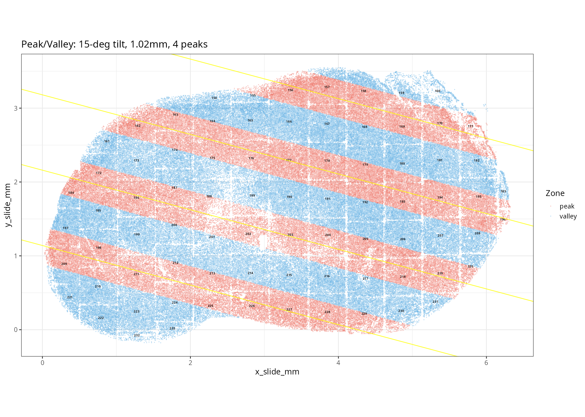

***** Peak vs Valley DEGs
:PROPERTIES:
:header-args:jupyter-R+: :tangle no
:END:

Retired 2026-08-13: =dev/peak_valley_analysis/08_pv_degs.R= was deleted from the repo and this block no longer tangles; it is kept here for the record.

Differential expression between peak and valley cells within MBRT_4h. Effect-size ranked (no formal significance testing with n=1). Both bulk (all cells) and per-cell-type analysis for major populations with >=250 cells per zone. The scientific question: what biology distinguishes direct-beam exposure from bystander zones?

#+begin_src jupyter-R
if (!exists("PATHWAY_COLS")) source("00_load_data.R")

obj <- readRDS(file.path(ANALYSIS_DIR, "objects", "seurat_clustered.rds"))
pv <- read_tsv(file.path(DATA_DIR, "mbrt4h_peak_valley.tsv"), show_col_types = FALSE)

# Subset to MBRT_4h with zone annotation
mbrt4h_cells <- pv$cell_id
obj_4h <- subset(obj, cells = mbrt4h_cells)
obj_4h$zone <- pv$zone[match(colnames(obj_4h), pv$cell_id)]
Idents(obj_4h) <- "zone"
cat(sprintf("MBRT_4h with zones: %d cells (peak=%d, valley=%d)\n",
            ncol(obj_4h), sum(obj_4h$zone == "peak"), sum(obj_4h$zone == "valley")))

# ---- Bulk DEGs: peak vs valley ----
cat("Running peak vs valley DEGs (all cells)...\n")
bulk_degs <- FindMarkers(obj_4h, ident.1 = "peak", ident.2 = "valley",
                         min.pct = 0.1, logfc.threshold = 0.05)
bulk_degs$gene <- rownames(bulk_degs)
bulk_degs <- bulk_degs %>% arrange(desc(abs(avg_log2FC)))
write_tsv(bulk_degs, file.path(DATA_DIR, "pv_degs_bulk.tsv"))
cat(sprintf("Bulk peak vs valley DEGs: %d\n", nrow(bulk_degs)))

cat("\nTop 20 by effect size:\n")
print(head(bulk_degs %>% select(gene, avg_log2FC, pct.1, pct.2, p_val_adj), 20))

# Volcano retired: -log10(p_val) pseudoreplicates the n=1 design. Mutter_02 is 2d-only and
# H2AX peak/valley ground truth is 4h-only, so NO biological replicates are coming for this
# 4h contrast -- the n=1 spatial-descriptive views ARE final: across-stripe profiles +
# spatial pathway maps (05), zone maps (07), gradient + dot/box plots. bulk_degs (written
# above) is the descriptive effect-size table.

# ---- Per-cell-type DEGs ----
cat("\nRunning per-cell-type peak vs valley DEGs...\n")
ct_counts <- table(obj_4h$cell_type_validated, obj_4h$zone)
major_cts <- rownames(ct_counts)[apply(ct_counts, 1, min) >= 250]
cat(sprintf("Cell types with >=250 cells in both zones: %s\n", paste(major_cts, collapse = ", ")))

ct_degs <- map_dfr(major_cts, function(ct) {
  cells <- colnames(obj_4h)[obj_4h$cell_type_validated == ct]
  sub <- subset(obj_4h, cells = cells)
  Idents(sub) <- "zone"
  tryCatch({
    degs <- FindMarkers(sub, ident.1 = "peak", ident.2 = "valley",
                        min.pct = 0.1, logfc.threshold = 0.05)
    degs$gene <- rownames(degs)
    degs$cell_type <- ct
    degs %>% arrange(desc(abs(avg_log2FC)))
  }, error = function(e) { cat(sprintf("  %s: error — %s\n", ct, e$message)); NULL })
})
write_tsv(ct_degs, file.path(DATA_DIR, "pv_degs_by_celltype.tsv"))
cat(sprintf("Per-cell-type DEGs: %d rows across %d types\n",
            nrow(ct_degs), length(unique(ct_degs$cell_type))))

cat("Peak vs valley DEG analysis complete.\n")
#+end_src

***** Peak vs Valley Pathway Scores
:PROPERTIES:
:header-args:jupyter-R+: :tangle no
:END:

Retired 2026-08-13: =dev/peak_valley_analysis/09_pv_pathways.R= was deleted from the repo and this block no longer tangles; it is kept here for the record.

Compare DDR, IFN-I, IFN-II, and STING pathway scores between peak and valley zones, both overall and stratified by cell type family. Key question: do valleys show elevated IFN/STING consistent with bystander immune priming? DDR (18 genes), Type I IFN (19 genes), and Type II IFN (17 genes) are standard NanoString Mouse UCC panel modules (see =data/sources/2026-06-22-bruker-mouse-ucc-gene-list.xlsx=). STING is not a standard module; scored from available cGAS-STING genes (Irf3, Ifna, Isg15, Cxcl10).

#+begin_src jupyter-R
if (!exists("PATHWAY_COLS")) source("00_load_data.R")

pv <- read_tsv(file.path(DATA_DIR, "mbrt4h_peak_valley.tsv"), show_col_types = FALSE)

# ---- Overall pathway comparison ----
pathway_by_zone <- pv %>%
  pivot_longer(cols = all_of(PATHWAY_COLS), names_to = "pathway", values_to = "score") %>%
  mutate(pathway = PATHWAY_LABELS[pathway])

p_box <- ggplot(pathway_by_zone, aes(x = pathway, y = score, fill = zone)) +
  geom_boxplot(outlier.size = 0.1, outlier.alpha = 0.1) +
  scale_fill_manual(values = ZONE_COLORS) +
  labs(title = "Pathway scores: Peak vs Valley (MBRT_4h)",
       subtitle = "NanoString Mouse UCC standard modules (DDR/IFN-I/IFN-II) + custom STING",
       y = "Score", x = NULL) +
  theme_bw() + theme(axis.text.x = element_text(angle = 30, hjust = 1))
ggsave(file.path(PLOT_DIR, "pv_pathway_boxplots.png"), plot = p_box, width = 10, height = 6, dpi = 150)

# ---- Summary stats ----
pathway_stats <- pathway_by_zone %>%
  group_by(pathway, zone) %>%
  summarise(n = n(), mean = mean(score, na.rm = TRUE), sd = sd(score, na.rm = TRUE), .groups = "drop") %>%
  pivot_wider(names_from = zone, values_from = c(n, mean, sd))
cat("=== Pathway scores by zone ===\n")
print(pathway_stats)
write_tsv(pathway_stats, file.path(DATA_DIR, "pv_pathway_stats.tsv"))

# ---- Stratified by cell type family ----
obj <- readRDS(file.path(ANALYSIS_DIR, "objects", "seurat_clustered.rds"))
mbrt4h_meta <- obj@meta.data %>%
  as.data.frame() %>%
  filter(Condition == "MBRT_4h") %>%
  select(cell_id, cell_family = ImmuneAtlas_ImmGen_cellFamily_Main_cell_Types)

pv_with_family <- pv %>%
  left_join(mbrt4h_meta, by = "cell_id")

major_families <- pv_with_family %>%
  count(cell_family) %>%
  filter(n >= 500) %>%
  pull(cell_family)

p_strat <- pv_with_family %>%
  filter(cell_family %in% major_families) %>%
  pivot_longer(cols = all_of(PATHWAY_COLS), names_to = "pathway", values_to = "score") %>%
  mutate(pathway = PATHWAY_LABELS[pathway]) %>%
  ggplot(aes(x = zone, y = score, fill = zone)) +
  geom_boxplot(outlier.size = 0.1, outlier.alpha = 0.1) +
  scale_fill_manual(values = ZONE_COLORS) +
  facet_grid(pathway ~ cell_family, scales = "free_y") +
  labs(title = "Pathway scores by zone and cell family", y = "Score") +
  theme_bw(base_size = 10) +
  theme(axis.text.x = element_text(angle = 45, hjust = 1))
ggsave(file.path(PLOT_DIR, "pv_pathway_by_celltype.png"), plot = p_strat, width = 16, height = 12, dpi = 150)

cat("Pathway comparison complete.\n")
#+end_src

#+ATTR_ORG: :width 800
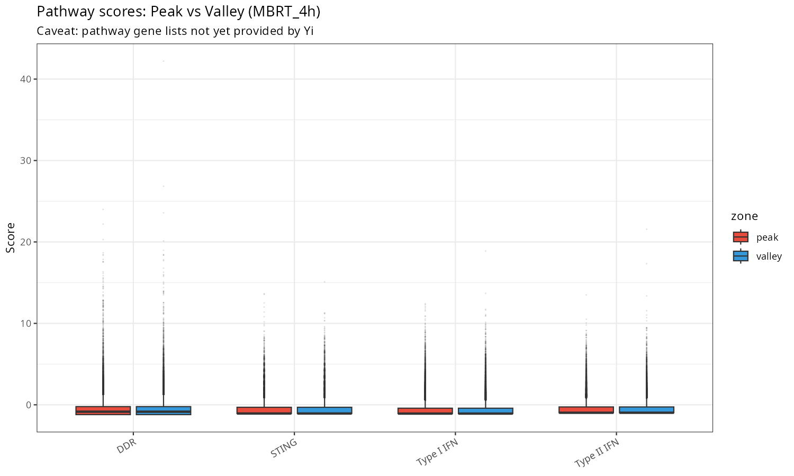

#+ATTR_ORG: :width 800
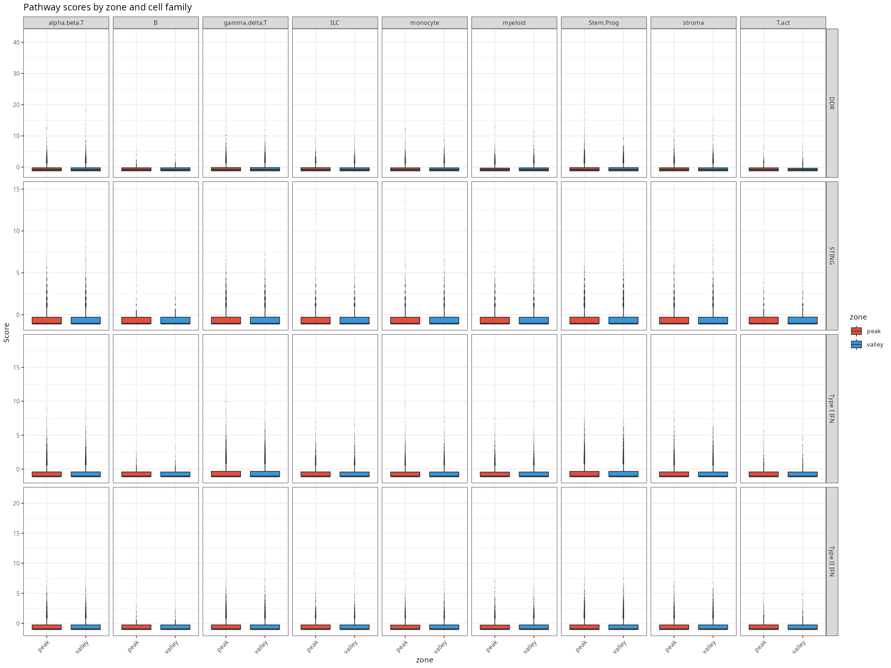

***** Peak vs Valley Composition
:PROPERTIES:
:header-args:jupyter-R+: :tangle no
:END:

Retired 2026-08-13: =dev/peak_valley_analysis/10_pv_composition.R= was deleted from the repo and this block no longer tangles; it is kept here for the record.

Compare cell type proportions between peak and valley zones. Stacked bar plots and proportion difference analysis. Key question: are immune cells enriched in valleys (potential bystander immune recruitment) and tumor epithelial cells depleted?

#+begin_src jupyter-R
if (!exists("PATHWAY_COLS")) source("00_load_data.R")

pv <- read_tsv(file.path(DATA_DIR, "mbrt4h_peak_valley.tsv"), show_col_types = FALSE)

# ---- Cell type proportions by zone ----
comp <- pv %>%
  count(zone, cell_type_validated) %>%
  group_by(zone) %>%
  mutate(prop = n / sum(n)) %>%
  ungroup()
write_tsv(comp, file.path(DATA_DIR, "pv_composition.tsv"))

# Stacked bar
p_stack <- ggplot(comp, aes(x = zone, y = prop, fill = cell_type_validated)) +
  geom_col() +
  labs(title = "Cell type composition: Peak vs Valley (MBRT_4h)",
       y = "Proportion", fill = "Cell type") +
  theme_bw()
ggsave(file.path(PLOT_DIR, "pv_composition_stacked.png"), plot = p_stack, width = 8, height = 6, dpi = 150)

# Proportion difference (peak - valley)
diff_df <- comp %>%
  select(zone, cell_type_validated, prop) %>%
  pivot_wider(names_from = zone, values_from = prop, values_fill = 0) %>%
  mutate(diff = peak - valley) %>%
  arrange(desc(abs(diff)))

cat("=== Composition difference (peak - valley) ===\n")
print(diff_df)

p_diff <- ggplot(diff_df, aes(x = reorder(cell_type_validated, diff), y = diff,
                               fill = diff > 0)) +
  geom_col() +
  scale_fill_manual(values = c("TRUE" = ZONE_COLORS["peak"], "FALSE" = ZONE_COLORS["valley"]),
                    labels = c("TRUE" = "Enriched in peaks", "FALSE" = "Enriched in valleys"),
                    guide = guide_legend(title = NULL)) +
  coord_flip() +
  labs(title = "Cell type enrichment: Peak vs Valley", x = NULL,
       y = "Proportion difference (peak - valley)") +
  theme_bw()
ggsave(file.path(PLOT_DIR, "pv_composition_diff.png"), plot = p_diff, width = 10, height = 6, dpi = 150)

cat("Composition analysis complete.\n")
#+end_src

#+ATTR_ORG: :width 800
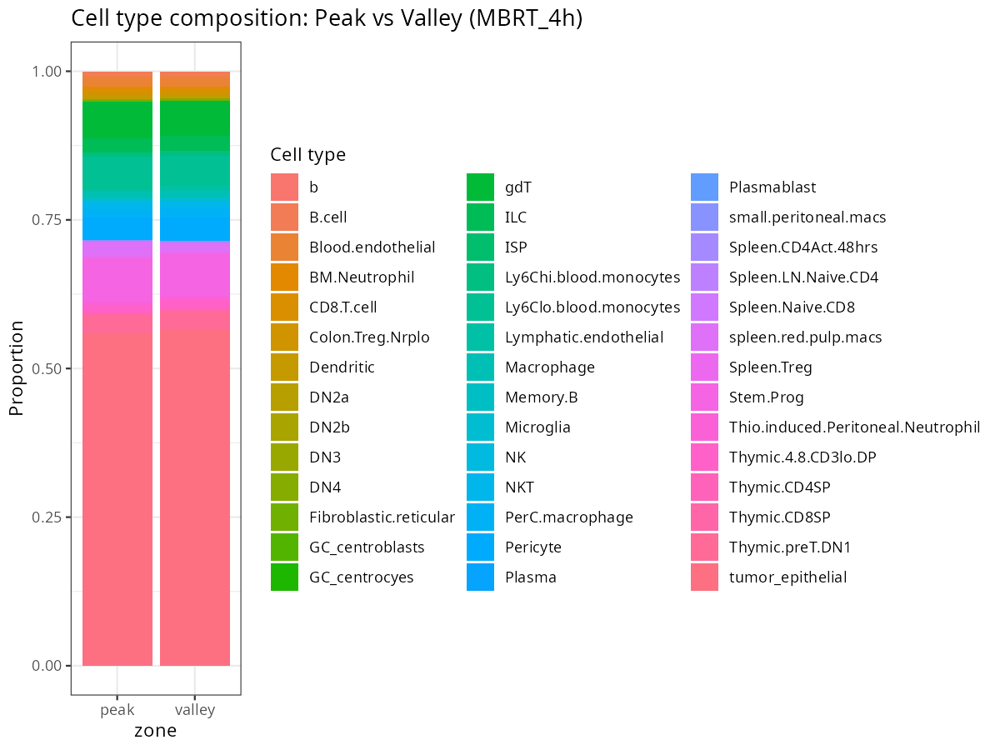

#+ATTR_ORG: :width 800
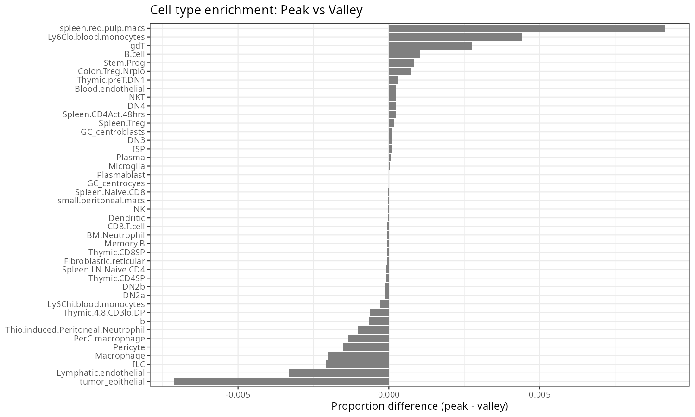

***** Peak vs Valley Spatial Neighborhoods
:PROPERTIES:
:header-args:jupyter-R+: :tangle no
:END:

Retired 2026-08-13: =dev/peak_valley_analysis/11_pv_spatial_neighborhoods.R= was deleted from the repo and this block no longer tangles; it is kept here for the record.

k=20 nearest neighbor analysis within each zone. Compute immune neighbor fractions for peak vs valley cells. Key question: do valleys have more mixed tumor-immune neighborhoods, consistent with immune cell infiltration into bystander zones?

#+begin_src jupyter-R
if (!exists("PATHWAY_COLS")) source("00_load_data.R")
library(RANN)

pv <- read_tsv(file.path(DATA_DIR, "mbrt4h_peak_valley.tsv"), show_col_types = FALSE)

# ---- k=20 NN within each zone ----
cat("Computing spatial neighborhoods by zone...\n")
nn_by_zone <- map_dfr(c("peak", "valley"), function(z) {
  zone_cells <- pv %>% filter(zone == z)
  coords <- as.matrix(zone_cells[, c("x_slide_mm", "y_slide_mm")])
  ct <- zone_cells$cell_type_validated

  nn <- nn2(coords, k = min(21, nrow(coords)))
  nn_idx <- nn$nn.idx[, -1]

  immune_frac <- rowMeans(matrix(ct[nn_idx] != "tumor_epithelial", nrow = nrow(nn_idx)))

  tibble(zone = z, cell_type = ct, immune_neighbor_frac = immune_frac)
})

# Density plot
p_nn <- ggplot(nn_by_zone, aes(x = immune_neighbor_frac, fill = zone)) +
  geom_density(alpha = 0.5) +
  scale_fill_manual(values = ZONE_COLORS) +
  facet_wrap(~cell_type, scales = "free_y") +
  labs(x = "Fraction immune neighbors (k=20)",
       title = "Spatial immune neighborhoods: Peak vs Valley (MBRT_4h)") +
  theme_bw()
ggsave(file.path(PLOT_DIR, "pv_spatial_nn.png"), plot = p_nn, width = 14, height = 10, dpi = 150)

# Summary stats
nn_summary <- nn_by_zone %>%
  group_by(zone, cell_type) %>%
  summarise(mean_immune_frac = mean(immune_neighbor_frac), n = n(), .groups = "drop") %>%
  filter(n > 100) %>%
  pivot_wider(names_from = zone, values_from = c(mean_immune_frac, n))
cat("=== Mean immune neighbor fraction by zone ===\n")
print(nn_summary)
write_tsv(nn_summary, file.path(DATA_DIR, "pv_spatial_nn_summary.tsv"))

cat("Spatial neighborhood analysis complete.\n")
#+end_src

#+ATTR_ORG: :width 800
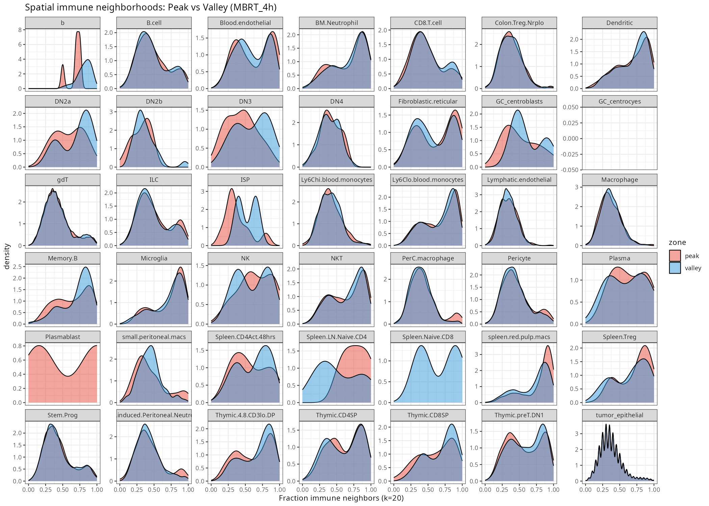

***** SBRT Comparison
:PROPERTIES:
:header-args:jupyter-R+: :tangle no
:END:

Retired 2026-08-13: =dev/peak_valley_analysis/12_sbrt_comparison.R= was deleted from the repo and this block no longer tangles; it is kept here for the record.

Use SBRT_4h as a uniform-dose reference (no peak/valley structure expected). Compare MBRT peak and valley transcriptomic signatures against SBRT bulk expression. Key question: are MBRT valleys more similar to SBRT (lower effective dose) or transcriptomically distinct? Heatmap of top peak-up and valley-up genes across the three groups, plus pathway score comparison.

#+begin_src jupyter-R
if (!exists("PATHWAY_COLS")) source("00_load_data.R")

obj <- readRDS(file.path(ANALYSIS_DIR, "objects", "seurat_clustered.rds"))
pv <- read_tsv(file.path(DATA_DIR, "mbrt4h_peak_valley.tsv"), show_col_types = FALSE)
bulk_degs <- read_tsv(file.path(DATA_DIR, "pv_degs_bulk.tsv"), show_col_types = FALSE)

# ---- Get SBRT_4h cells ----
sbrt4h <- obj@meta.data %>%
  as.data.frame() %>%
  filter(Condition == "SBRT_4h") %>%
  select(cell_id, all_of(PATHWAY_COLS), cell_type_validated)

# Get expression for top peak/valley genes in SBRT
top_peak_genes <- bulk_degs %>% filter(avg_log2FC > 0) %>% head(20) %>% pull(gene)
top_valley_genes <- bulk_degs %>% filter(avg_log2FC < 0) %>% head(20) %>% pull(gene)
sig_genes <- unique(c(top_peak_genes, top_valley_genes))
sig_genes <- sig_genes[sig_genes %in% rownames(obj)]

# Extract expression for MBRT peak, MBRT valley, and SBRT
norm_data <- GetAssayData(obj, layer = "data")
peak_cells <- pv %>% filter(zone == "peak") %>% pull(cell_id)
valley_cells <- pv %>% filter(zone == "valley") %>% pull(cell_id)
sbrt_cells <- sbrt4h$cell_id

if (length(sig_genes) > 0) {
  expr_matrix <- as.matrix(norm_data[sig_genes, c(peak_cells, valley_cells, sbrt_cells)])

  # Mean expression per group
  group_means <- tibble(
    gene = sig_genes,
    peak = rowMeans(expr_matrix[, peak_cells, drop = FALSE]),
    valley = rowMeans(expr_matrix[, valley_cells, drop = FALSE]),
    sbrt = rowMeans(expr_matrix[, sbrt_cells, drop = FALSE])
  )
  write_tsv(group_means, file.path(DATA_DIR, "pv_sbrt_gene_comparison.tsv"))

  # Heatmap-style comparison
  group_long <- group_means %>%
    pivot_longer(cols = c(peak, valley, sbrt), names_to = "group", values_to = "mean_expr") %>%
    mutate(group = factor(group, levels = c("peak", "valley", "sbrt")))

  p_heat <- ggplot(group_long, aes(x = group, y = gene, fill = mean_expr)) +
    geom_tile() +
    scale_fill_viridis_c(option = "inferno") +
    labs(title = "Peak/Valley signature genes in SBRT_4h",
         subtitle = "Top 20 peak-up and valley-up genes from MBRT_4h",
         fill = "Mean expr", x = NULL) +
    theme_bw(base_size = 12) +
    theme(axis.text.y = element_text(size = 8))
  ggsave(file.path(PLOT_DIR, "pv_sbrt_heatmap.png"), plot = p_heat, width = 8, height = 10, dpi = 150)
}

# ---- Pathway score comparison: MBRT peak vs MBRT valley vs SBRT ----
sbrt_pathways <- sbrt4h %>%
  pivot_longer(cols = all_of(PATHWAY_COLS), names_to = "pathway", values_to = "score") %>%
  mutate(group = "SBRT_4h")

mbrt_pathways <- pv %>%
  pivot_longer(cols = all_of(PATHWAY_COLS), names_to = "pathway", values_to = "score") %>%
  mutate(group = paste0("MBRT_", zone))

combined <- bind_rows(mbrt_pathways %>% select(group, pathway, score),
                      sbrt_pathways %>% select(group, pathway, score)) %>%
  mutate(pathway = PATHWAY_LABELS[pathway],
         group = factor(group, levels = c("MBRT_peak", "MBRT_valley", "SBRT_4h")))

p_compare <- ggplot(combined, aes(x = group, y = score, fill = group)) +
  geom_boxplot(outlier.size = 0.1, outlier.alpha = 0.1) +
  scale_fill_manual(values = c("MBRT_peak" = "#E74C3C", "MBRT_valley" = "#3498DB", "SBRT_4h" = "#9B59B6")) +
  facet_wrap(~pathway, scales = "free_y") +
  labs(title = "Pathway scores: MBRT peak vs MBRT valley vs SBRT_4h",
       y = "Score", x = NULL) +
  theme_bw() + theme(axis.text.x = element_text(angle = 30, hjust = 1), legend.position = "none")
ggsave(file.path(PLOT_DIR, "pv_sbrt_pathway_comparison.png"), plot = p_compare, width = 12, height = 8, dpi = 150)

cat("SBRT comparison complete.\n")
#+end_src

#+ATTR_ORG: :width 800
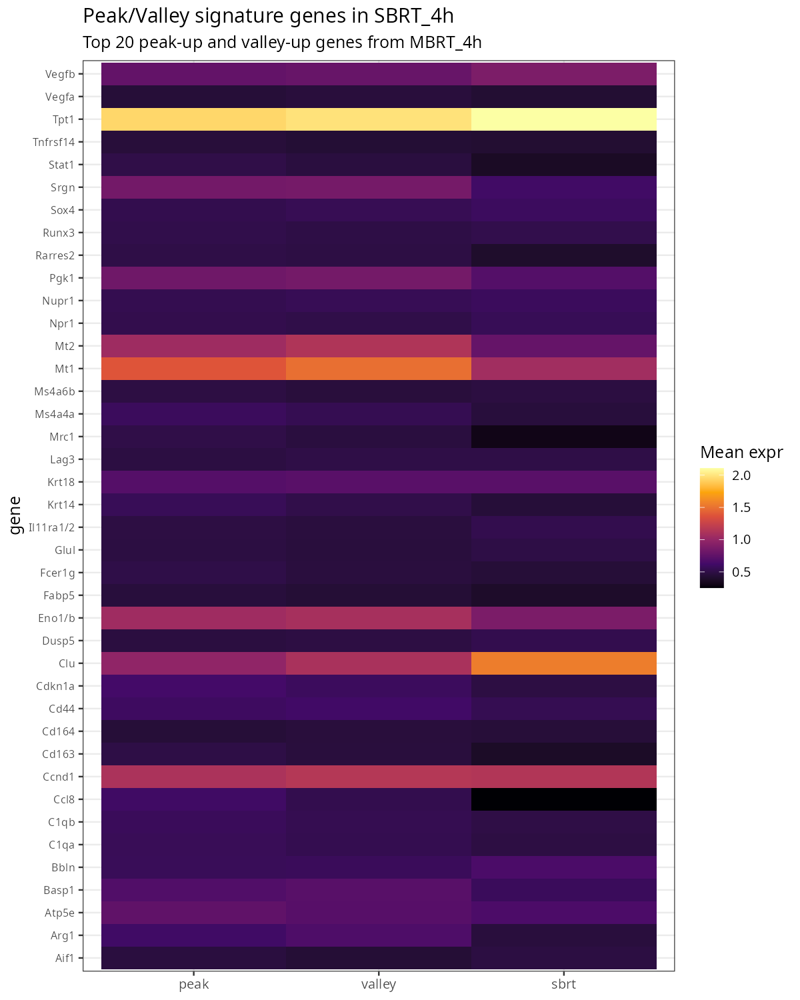

#+ATTR_ORG: :width 800
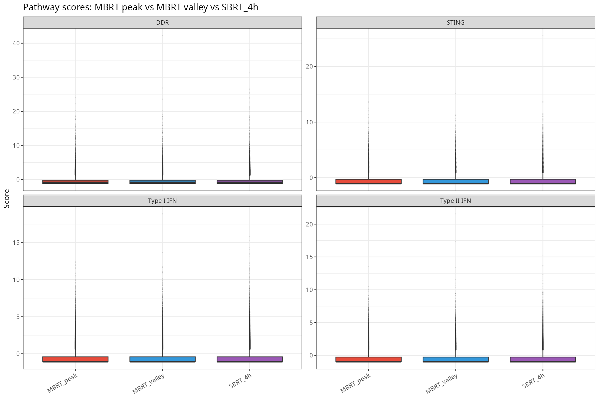

***** Result Summary

This workbook consolidates 21 standalone R scripts into 13 modular analysis steps spanning data loading through SBRT comparison. Key findings pending script execution: (1) stripe model parameters (15-degree tilt, ~1.02mm spacing, 4 peaks) require H2AX image validation; (2) peak vs valley DEGs, pathway scores, composition, and spatial neighborhoods will characterize the distinct biology of direct-beam vs bystander zones; (3) SBRT comparison will establish whether MBRT valleys resemble uniform-dose irradiation or represent a transcriptomically distinct bystander state.

***** Ideas                                                        :noexport:

- Layer 4: project peak/valley gene signatures onto other timepoints (MBRT_1h, MBRT_day2, MBRT_day6) to track signature evolution
- Integrate Mutter_02 dataset when available for replication
- Multi-timepoint peak/valley classification using longitudinal stripe model consistency
- Formal pathway enrichment (GSEA/fGSEA) once gene lists from Yi are confirmed
- Spatial ligand-receptor interaction analysis (CellChat/NicheNet) between peak and valley zones
- Machine learning classifier trained on peak/valley gene signatures for de novo zone prediction

***** Limitations                                                  :noexport:

- n=1 per condition: all comparisons are exploratory and descriptive, using effect sizes rather than formal significance testing
- Geometric stripe model assumes uniform beam spacing and parallel planar geometry; real beam profiles may have penumbra effects
- H2AX immunofluorescence is from an adjacent serial section, not co-registered IF on the same CosMx section
- Pathway scores (TypeI_interferon, TypeII_interferon, DNA_Damage_Repair) use standard NanoString Mouse UCC panel modules; STING is a custom score from available cGAS-STING genes
- Peak/valley classification uses a hard threshold (spacing/4) rather than a continuous dose gradient model
- CosMx panel (~1000 genes) may miss key pathway genes not represented in the targeted panel

***** Method                                                       :noexport:

The stripe model classifies MBRT_4h cells into peak (direct beam) and valley (bystander) zones using a geometric approach. Cell positions are expressed in tilt-corrected coordinates: y_corr = y_slide_mm + x_slide_mm * tan(theta), where theta = 15 degrees is the optimal tilt angle determined by maximizing p21 (Cdkn1a) contrast between putative peak and valley zones across a parameter sweep (5-35 degrees, 2-degree steps). Beam spacing is determined by grid search over 0.8-1.3mm with a forced 4-peak constraint, optimizing for peak-valley p21 contrast. The best-fit model (spacing ~1.02mm, beam centers at corrected-y ~1.14, 2.16, 3.18, 4.20mm) is validated against gamma-H2AX immunofluorescence images extracted from the lab-provided PPTX. Cells are classified as peak if their tilt-corrected y-distance to the nearest beam center is less than spacing/4, and valley otherwise. Differential expression uses Seurat FindMarkers with effect-size ranking (no formal significance testing given n=1 per condition). Spatial neighborhoods use k=20 nearest neighbors via RANN.

*** Layer 2 -- MBRT vs SBRT vs Control Comparative Kinetics
:PROPERTIES:
:header-args:jupyter-R: :session spatial :kernel spatial :async yes :dir /home/jeszyman/repos/spatial-rads/dev
:END:

Characterize how MBRT and SBRT differ in transcriptomic response over time across cell types. All comparisons are descriptive (n=1 per condition); effect sizes are the primary metric.

**** Differential expression
:PROPERTIES:
:header-args:jupyter-R+: :tangle no
:END:

Retired 2026-08-13: =dev/02_deg_analysis.R= was deleted from the repo and this block no longer tangles; it is kept here for the record.

DEG analysis comparing MBRT vs Control, SBRT vs Control, and MBRT vs SBRT at matched timepoints. Wilcoxon rank sum via Seurat FindMarkers, ranked by effect size (log2FC), not p-value. Per-cell-type DEGs at 4h for MBRT vs SBRT.

#+begin_src jupyter-R
library(Seurat)
library(tidyverse)
library(future)

obj <- readRDS("/mnt/gcs/jeszyman/projects/spatial-rads/analysis/objects/seurat_clustered.rds")
cat(sprintf("Loaded: %d genes x %d cells\n", nrow(obj), ncol(obj)))

# --- DEG function (effect-size ranked, NOT p-value based) ---
run_deg <- function(obj, ident.1, ident.2, group.by = "Condition") {
  Idents(obj) <- group.by
  markers <- FindMarkers(obj, ident.1 = ident.1, ident.2 = ident.2,
                         min.pct = 0.1, logfc.threshold = 0.1)
  markers$gene <- rownames(markers)
  markers$comparison <- paste0(ident.1, "_vs_", ident.2)
  markers %>% arrange(desc(abs(avg_log2FC)))
}

# --- MBRT vs Control ---
cat("Running MBRT vs Control DEGs...\n")
mbrt_tp <- c("MBRT_1h", "MBRT_4h", "MBRT_day2", "MBRT_day6")
deg_mbrt_ctrl <- map_dfr(mbrt_tp, function(tp) {
  cat(sprintf("  %s vs Control...\n", tp))
  sub <- subset(obj, cells = colnames(obj)[obj$Condition %in% c(tp, "Control")])
  run_deg(sub, tp, "Control")
})
cat(sprintf("MBRT vs Control: %d DEGs\n", nrow(deg_mbrt_ctrl)))

# --- SBRT vs Control ---
cat("Running SBRT vs Control DEGs...\n")
sbrt_tp <- c("SBRT_4h", "SBRT_day2", "SBRT_day6")
deg_sbrt_ctrl <- map_dfr(sbrt_tp, function(tp) {
  cat(sprintf("  %s vs Control...\n", tp))
  sub <- subset(obj, cells = colnames(obj)[obj$Condition %in% c(tp, "Control")])
  run_deg(sub, tp, "Control")
})
cat(sprintf("SBRT vs Control: %d DEGs\n", nrow(deg_sbrt_ctrl)))

# --- MBRT vs SBRT at matched timepoints ---
cat("Running MBRT vs SBRT DEGs...\n")
matched <- list(c("MBRT_4h", "SBRT_4h"), c("MBRT_day2", "SBRT_day2"), c("MBRT_day6", "SBRT_day6"))
deg_mbrt_sbrt <- map_dfr(matched, function(pair) {
  cat(sprintf("  %s vs %s...\n", pair[1], pair[2]))
  sub <- subset(obj, cells = colnames(obj)[obj$Condition %in% pair])
  run_deg(sub, pair[1], pair[2])
})
cat(sprintf("MBRT vs SBRT: %d DEGs\n", nrow(deg_mbrt_sbrt)))

# --- Combine and save ---
all_degs <- bind_rows(
  mbrt_vs_ctrl = deg_mbrt_ctrl,
  sbrt_vs_ctrl = deg_sbrt_ctrl,
  mbrt_vs_sbrt = deg_mbrt_sbrt,
  .id = "comparison_type"
)
write.csv(all_degs, "/mnt/gcs/jeszyman/projects/spatial-rads/analysis/tables/deg_all_cells.csv", row.names = FALSE)
cat(sprintf("Total DEG rows: %d\n", nrow(all_degs)))

# --- Per-cell-type DEGs (MBRT vs SBRT at 4h) ---
cat("\nRunning per-cell-type DEGs (MBRT vs SBRT at 4h)...\n")
ct_counts <- table(obj$cell_type_validated[obj$Condition %in% c("MBRT_4h", "SBRT_4h")])
major_cts <- names(ct_counts[ct_counts > 500])
cat(sprintf("Cell types with >500 cells at 4h: %s\n", paste(major_cts, collapse = ", ")))

deg_by_ct <- map_dfr(major_cts, function(ct) {
  cells <- colnames(obj)[obj$Condition %in% c("MBRT_4h", "SBRT_4h") &
                          obj$cell_type_validated == ct]
  if (length(cells) < 50) return(NULL)
  cat(sprintf("  %s (%d cells)...\n", ct, length(cells)))
  sub <- subset(obj, cells = cells)
  tryCatch(run_deg(sub, "MBRT_4h", "SBRT_4h") %>% mutate(cell_type = ct),
           error = function(e) { cat(sprintf("    Error: %s\n", e$message)); NULL })
})
write.csv(deg_by_ct, "/mnt/gcs/jeszyman/projects/spatial-rads/analysis/tables/deg_by_celltype_4h.csv", row.names = FALSE)
cat(sprintf("Per-cell-type DEGs: %d rows across %d cell types\n",
            nrow(deg_by_ct), length(unique(deg_by_ct$cell_type))))
cat("DEG analysis complete.\n")
#+end_src

2,160 bulk DEG rows across all comparisons. Top MBRT vs SBRT findings: at 4h, MBRT upregulates myeloid recruitment genes (Ccl8 log2FC 1.59, Mrc1, Cd74, Arg1). At day 2, the myeloid signal amplifies (Ccl8 log2FC 2.43, Cd163 1.74) while SBRT upregulates Cxcl10 (-1.53, IFN-stimulated). At day 6, MBRT shows massive Igkc (log2FC 3.47, B/plasma cell signature) while SBRT has Nkg7 (-1.31, cytotoxic). Per-cell-type DEGs: 2,534 rows across 25 cell types.

***** DONE Send Rob Mutter 4h CosMx DE tables (whole-slide + valley/peak/CRT contrasts) for R01
CLOSED: [2026-08-03 Mon] DEADLINE: <2026-08-03 Mon>
:PROPERTIES:
:ID:       64721f83-c092-460c-abc1-52c496f833d4
:END:
[[https://mail.google.com/mail/u/0/#all/19fc2428d1cd6b8d][Mutter R01 DE request]]
- [2026-08-03 Mon] Sent the 4h expression tables (16 at results/aggregate/m01_4h/: 12 arm-level pseudobulk + 4 peak-valley DESeq2 TSVs) with a methods walkthrough. Findings: both MBRT and SBRT show a clear acute IR response vs control at 4h (p21, HSPs, cytokines up; ECM/structural down); SBRT larger effect sizes but qualitatively identical; MBRT vs SBRT near-indistinguishable (only Ccl8 exceeds |log2FC| > 1); peak vs valley null at gene level (Cdkn1a peak/valley per-cell delta real but ~0.05 log-units, below between-FOV variance at 23 FOV-pairs, 17 tumor).

***** TODO Fix Run 2 4h-timepoint mislabel, then rerun and reply to Mutter
Who owes next: Rob/Yi (confirm meeting time) + Jeff (send corrected results). Thread [[https://mail.google.com/mail/u/0/#all/19fc2428d1cd6b8d][Mutter R01]]. Reply sent 8/12. 3-way meeting with Yi proposed 8/13 (Jeff offered 8/14 9:30-12:30, Mon 10-2, Tue after 12, Wed 10-12:30); awaiting Rob/Yi to confirm slot. Metadata fixed 2026-08-13; analysis reworking ongoing (arm-level rerun done at results/aggregate/combined_4h/; peak-valley rerun pending, needs Run 2 4h zone calling).
- ROOT ISSUE (found 8/12 from Rob's "CosMx Run 2 yH2AX" layout): Run 2 is a 2x2, not day-2-only. Slides 1-2 = 2d, slides 3-4 = 4h. build_metadata_xlsx.R hardcodes timepoint_h = 48 and maps every Run 2 block to _day2 (lines 67, 90), even though it transcribes Rob's block layout for positions/dose. So slides 3-4 (MBRT blocks 19/20, SBRT 16/18, controls 3/1) were mislabeled day-2. Rob was right; the earlier "n=1 at 4h" claim was wrong.
- Corrected 4h counts, VERIFY on beast against raw CosMx metadata + wet-lab record before relying on them: MBRT 3 (Run1 blk21 + Run2 blk19/20), SBRT 3 (Run1 blk17 + Run2 blk16/18), Control 2 (Run2 slides 3-4, blocks 3 and 1; Run1 control is 0h). Control block 1 also sits on the 2d slide s1, so controls are a reused baseline set, not per-timepoint harvests.
- Day-2 consequence: the "n=4/arm day-2" inference cohort is really n=2/arm at 2d (slides 1-2) + n=2/arm at 4h (slides 3-4) pooled as day-2, so the differential layer's day-2 result is timepoint-mixed and needs re-scoping (also update CLAUDE.md + comparisons.yaml, which still call M02 day-2/n=4).
- FIX: replace the hardcoded 48h with real per-block timepoints (slides 1-2 = 2d, slides 3-4 = 4h), re-derive the data model, re-scope comparisons.yaml. Needs beast R env.
- RERUN in two parts: (1) arm-level 4h contrasts (MBRT/SBRT/Control) on corrected metadata, quick, real replication (n=3 treated / n=2 control, slide as batch); (2) peak-vs-valley + prespecified damage/checkpoint/proliferation modules, which need NEW peak/valley zone calling on the Run 2 4h slides (register M02 H2AX beam tracks onto slides 3-4) before pseudobulk.
- Rob Q2 (data): can send the current Run1 peak-valley FOV-zone pseudobulk count matrix in the interim; the rerun supersedes it.
- Rob Q4 (aside): Ccl8 ties to his breast SPORE macrophage biology; one gene, do not over-read.
- Yi (co-leads the CosMx core): agreed on program/module scoring for sparse CosMx (already our standard); reply to her directly to align on the separate SPORE TNBC 6K point, loop her in.
- [2026-08-12 Wed] Reply sent (apology + fix-and-rerun). Rob asked to schedule 3-way call with Yi. Yi confirmed interested.
- [2026-08-13 Thu] Jeff offered meeting times: 8/14 9:30-12:30 CST, Mon 10-2, Tue after 12, Wed 10-12:30.

**** DEG visualization
:PROPERTIES:
:header-args:jupyter-R+: :tangle no
:END:

#+begin_src jupyter-R
library(tidyverse)

all_degs <- read.csv("/mnt/gcs/jeszyman/projects/spatial-rads/analysis/tables/deg_all_cells.csv")
cat(sprintf("Loaded %d DEG rows\n", nrow(all_degs)))

# Volcanoes retired: -log10(p_val) is a cell-level Wilcoxon p, which pseudoreplicates the
# n=1-per-condition design (cells are not biological replicates). all_degs effect sizes
# (avg_log2FC, pct.1/pct.2) stay valid descriptively. Correct significance test deferred
# until Mutter_02 (2d) replicates: pseudobulk per sample -> DESeq2/edgeR/limma -> MA/volcano.
#+end_src

**** Pathway score kinetics
:PROPERTIES:
:header-args:jupyter-R+: :tangle no
:END:

Yi's pre-computed pathway scores (TypeI_interferon, TypeII_interferon, STING, DNA_Damage_Repair) summarized per sample x cell family x timepoint. Kinetic line plots for MBRT vs SBRT.

#+begin_src jupyter-R
library(Seurat)
library(tidyverse)

obj <- readRDS("/mnt/gcs/jeszyman/projects/spatial-rads/analysis/objects/seurat_clustered.rds")
pathway_cols <- c("TypeI_interferon", "TypeII_interferon", "STING", "DNA_Damage_Repair")

# --- By cell family ---
kinetics <- obj@meta.data %>%
  as.data.frame() %>%
  filter(model == "flank") %>%
  group_by(timepoint_h, treatment,
           cell_family = ImmuneAtlas_ImmGen_cellFamily_Main_cell_Types) %>%
  summarise(n_cells = n(),
            across(all_of(pathway_cols), \(x) mean(x, na.rm = TRUE)),
            .groups = "drop") %>%
  pivot_longer(cols = all_of(pathway_cols), names_to = "pathway", values_to = "score")

kinetics %>%
  filter(treatment %in% c("MBRT", "SBRT", "NT")) %>%
  ggplot(aes(x = factor(timepoint_h), y = score, color = treatment, group = treatment)) +
  geom_line(linewidth = 0.8) + geom_point(size = 2) +
  facet_grid(pathway ~ cell_family, scales = "free_y") +
  labs(x = "Hours post-RT", y = "Mean pathway score", caption = "n=1 per condition") +
  theme_bw(base_size = 10) +
  theme(axis.text.x = element_text(angle = 45, hjust = 1))
ggsave("/mnt/gcs/jeszyman/projects/spatial-rads/analysis/figures/pathway_kinetics_by_celltype.pdf",
       width = 20, height = 12)

# --- All cells (simplified) ---
obj@meta.data %>%
  as.data.frame() %>%
  filter(model == "flank", treatment %in% c("MBRT", "SBRT")) %>%
  group_by(timepoint_h, treatment) %>%
  summarise(across(all_of(pathway_cols), \(x) mean(x, na.rm = TRUE)), .groups = "drop") %>%
  pivot_longer(cols = all_of(pathway_cols), names_to = "pathway", values_to = "score") %>%
  ggplot(aes(x = factor(timepoint_h), y = score, color = treatment, group = treatment)) +
  geom_line(linewidth = 1) + geom_point(size = 3) +
  facet_wrap(~pathway, scales = "free_y") +
  scale_color_manual(values = c("MBRT" = "#E74C3C", "SBRT" = "#3498DB")) +
  labs(x = "Hours post-RT", y = "Mean pathway score", caption = "n=1 per condition") +
  theme_bw()
ggsave("/mnt/gcs/jeszyman/projects/spatial-rads/analysis/figures/pathway_kinetics_all_cells.pdf",
       width = 10, height = 8)

write.csv(kinetics, "/mnt/gcs/jeszyman/projects/spatial-rads/analysis/tables/pathway_kinetics.csv", row.names = FALSE)
cat("Pathway kinetics saved.\n")
#+end_src

#+ATTR_ORG: :width 800
[[file:/mnt/gcs/jeszyman/projects/spatial-rads/analysis/figures/pathway_kinetics_by_celltype.pdf]]

#+ATTR_ORG: :width 800
[[file:/mnt/gcs/jeszyman/projects/spatial-rads/analysis/figures/pathway_kinetics_all_cells.pdf]]

**** Immune composition shifts
:PROPERTIES:
:header-args:jupyter-R+: :tangle no
:END:

Cell type proportions by condition and timepoint. Stacked bar chart and per-cell-type trajectory plots tracking composition changes over time for MBRT vs SBRT.

#+begin_src jupyter-R
library(Seurat)
library(tidyverse)

obj <- readRDS("/mnt/gcs/jeszyman/projects/spatial-rads/analysis/objects/seurat_clustered.rds")

# --- Proportions ---
composition <- obj@meta.data %>%
  as.data.frame() %>%
  filter(model == "flank") %>%
  count(Condition, timepoint_h, treatment,
        cell_type = cell_type_validated) %>%
  group_by(Condition) %>%
  mutate(prop = n / sum(n)) %>%
  ungroup()

# --- Stacked bar ---
cond_levels <- c("Control", "MBRT_1h", "MBRT_4h", "SBRT_4h",
                 "MBRT_day2", "SBRT_day2", "MBRT_day6", "SBRT_day6")
composition %>%
  filter(Condition %in% cond_levels) %>%
  mutate(Condition = factor(Condition, levels = cond_levels)) %>%
  ggplot(aes(x = Condition, y = prop, fill = cell_type)) +
  geom_col() +
  labs(x = NULL, y = "Proportion", fill = "Cell type",
       title = "Cell type composition (flank)") +
  theme_bw() + theme(axis.text.x = element_text(angle = 45, hjust = 1))
ggsave("/mnt/gcs/jeszyman/projects/spatial-rads/analysis/figures/composition_stacked.pdf",
       width = 10, height = 6)

# --- Trajectories for key cell types ---
composition %>%
  filter(treatment %in% c("MBRT", "SBRT")) %>%
  ggplot(aes(x = factor(timepoint_h), y = prop, color = treatment, group = treatment)) +
  geom_line(linewidth = 0.8) + geom_point(size = 2) +
  facet_wrap(~cell_type, scales = "free_y") +
  labs(x = "Hours post-RT", y = "Proportion", color = "Treatment",
       caption = "n=1 per condition") +
  theme_bw()
ggsave("/mnt/gcs/jeszyman/projects/spatial-rads/analysis/figures/composition_trajectories.pdf",
       width = 14, height = 10)

write.csv(composition, "/mnt/gcs/jeszyman/projects/spatial-rads/analysis/tables/composition.csv", row.names = FALSE)
cat("Composition analysis saved.\n")
#+end_src

#+ATTR_ORG: :width 800
[[file:/mnt/gcs/jeszyman/projects/spatial-rads/analysis/figures/composition_stacked.pdf]]

#+ATTR_ORG: :width 800
[[file:/mnt/gcs/jeszyman/projects/spatial-rads/analysis/figures/composition_trajectories.pdf]]

**** Spatial neighborhood analysis
:PROPERTIES:
:header-args:jupyter-R+: :tangle no
:END:

k-nearest neighbor (k=20) analysis of spatial immune neighborhoods at 4h. For each cell, compute the fraction of its 20 nearest spatial neighbors that are immune (non-tumor_epithelial). Compare MBRT vs SBRT.

#+begin_src jupyter-R
library(Seurat)
library(RANN)
library(tidyverse)

obj <- readRDS("/mnt/gcs/jeszyman/projects/spatial-rads/analysis/objects/seurat_clustered.rds")

# --- Nearest-neighbor immune fraction at 4h ---
cat("Computing spatial nearest neighbors at 4h...\n")
nn_results <- map_dfr(c("MBRT_4h", "SBRT_4h"), function(cond) {
  cat(sprintf("  %s...\n", cond))
  meta_sub <- obj@meta.data %>% as.data.frame() %>% filter(Condition == cond)
  coords <- as.matrix(meta_sub[, c("x_slide_mm", "y_slide_mm")])
  ct <- meta_sub$cell_type_validated

  nn <- nn2(coords, k = 21)
  nn_idx <- nn$nn.idx[, -1]

  # Fraction of neighbors that are immune (not tumor_epithelial)
  immune_frac <- rowMeans(matrix(ct[nn_idx] != "tumor_epithelial", nrow = nrow(nn_idx)))

  tibble(condition = cond, cell_type = ct, immune_neighbor_frac = immune_frac)
})

nn_results %>%
  ggplot(aes(x = immune_neighbor_frac, fill = condition)) +
  geom_density(alpha = 0.5) +
  facet_wrap(~cell_type, scales = "free_y") +
  labs(x = "Fraction immune neighbors (k=20)",
       title = "Spatial immune neighborhoods: MBRT vs SBRT at 4h") +
  theme_bw()
ggsave("/mnt/gcs/jeszyman/projects/spatial-rads/analysis/figures/spatial_nn_immune_frac.pdf",
       width = 14, height = 10)
cat("Spatial NN analysis saved.\n")
#+end_src

MBRT shows consistently higher immune neighbor fractions than SBRT at 4h across every cell type. Dendritic cells: 0.69 vs 0.52; microglia: 0.72 vs 0.59; spleen red pulp macs: 0.75 vs 0.62; even tumor cells: 0.37 vs 0.31. This suggests MBRT's spatial heterogeneity (peaks/valleys) promotes more spatially mixed immune/tumor neighborhoods compared to the uniform dose of SBRT.

#+ATTR_ORG: :width 800
[[file:/mnt/gcs/jeszyman/projects/spatial-rads/analysis/figures/spatial_nn_immune_frac.pdf]]

*** Layer 2 Extended -- Comprehensive MBRT vs SBRT (4T1 flank)
:PROPERTIES:
:ID:       49023d4a-a8ef-489d-811c-e0d902927cc3
:CUSTOM_ID: layer2-extended-mbrt-vs-sbrt
:header-args:jupyter-R: :session spatial :kernel spatial :async yes :dir /home/jeszyman/repos/spatial-rads/dev/mbrt_vs_sbrt
:END:

Comprehensive MBRT vs SBRT comparison applied to all four Mutter_01 timepoints (1h, 4h, day2, day6), restricted to 4T1 flank tumors. Extends the condensed Layer 2 kinetics with per-cell-type DEGs at every timepoint, expanded pathway scoring (Hallmark + SenMayo + curated antigen-presentation + DAMP), composition trajectories, cell-type-stratified spatial neighborhoods over time, cell death and senescence kinetics, and a first-class necrosis quantification block addressing the central MBRT-vs-SBRT therapeutic-ratio question.

Statistical posture: descriptive only (n=1 per condition × timepoint in Mutter_01). Effect sizes (log2FC, score deltas, ΔProp) are primary; p-values reported for ranking. Mutter_02 day2 (3 reps × 3 conditions × 4 slides) is used as a concordance validation panel via rank correlation against Mutter_01 day2 effects.

**** Headline findings

1. *MBRT engages adaptive-immunity signaling earlier than SBRT.* At 4h, MBRT tumor cells already express antigen presentation (Cd74, B2m), Type II IFN response, and IL-15/IL-24. SBRT tumor cells at 4h show pure stress/scar response (Spp1, Clu, Col18a1).
2. *MBRT recruits more myeloid + skews toward M2c-like / wound-healing phenotype.* MBRT day2 myeloid 0.42 vs SBRT 0.31 (ΔProp +0.105); 2.3x more total myeloid cells than SBRT. Cross-dataset DEG concordance rho = 0.44 (best of all cell types). MBRT-up: Cd163 +2.51 log2FC, Mrc1/CD206 +2.12, Pf4 +2.44, Ccl8 +2.50, Il4ra +1.50, Arg1 +0.74. M2/M1 polarization ratio: MBRT day2 1.11 vs SBRT day2 1.00 — modest M2 skew. Pattern: Mrc1+Cd163+Arg1+Il4ra (debris-clearing / wound-healing arm) elevated; Vegfa, Ccl22, Mmp9, Tgfb1 (angiogenic/Treg-recruiting/pro-invasive arm) NOT elevated. Consistent with acute phagocytic response to spatially-fragmented damage rather than chronic immunosuppressive TAM phenotype.
3. *MBRT day6 B cells become class-switched plasma cells.* Ighg1 +4.40 log2FC, Igkc +3.30, Mzb1, Jchain, Ighm, Xbp1. SBRT lacks this signature. Spatial corollary: niche N3 (B-cell-dominant) emerges in MBRT day6 only (+0.143 frequency vs SBRT 0.000).
4. *SBRT front-loads tumor cell killing; MBRT spreads it across days.* Tumor-only necrosis fraction (proxy: tumor cells in sparse-density regions, Control-calibrated): day2 SBRT 2.11% vs MBRT 0.81% (SBRT 2.6x). Day 6 MBRT 6.10% vs SBRT 3.40% (MBRT 1.8x). The relationship reverses by day 6 — MBRT's tumor killing is delayed, not lesser. Consistent with peak/valley dynamics: acute peak doses spare more tumor short-term, but valley DDR + immune recruitment produce ongoing killing through late timepoints.
5. *Data-driven spatial niches confirm cell-type story at architecture level.* Six niches; key shifts: N1 (tumor-rich) at 4h MBRT −0.218; N4 (myeloid-dominant) at day2 MBRT +0.280; N3 (B-cell-dominant) at day6 MBRT +0.143.

*Retracted finding (kept for transparency):* Initial analysis of "MBRT triggers earlier spatial mixing of immune+tumor cells" was based on per-tumor-cell immune-neighbor fraction (MBRT_4h 0.375 vs SBRT_4h 0.308). Properly normalized using the Keren et al. 2018 mixing score (tumor↔immune edges / immune↔immune edges) and per-tumor-cell enrichment-over-random, MBRT does NOT mix immune+tumor more than SBRT — the difference was an artifact of MBRT having more total immune cells. SBRT is actually slightly more interspersed; MBRT's immune cells cluster among themselves (consistent with peak/valley fractionation creating immune-rich valley pockets).

These five findings together suggest MBRT shifts the post-RT tumor microenvironment toward a delayed-but-engaged immune trajectory: more myeloid (debris-clearing/wound-healing skew rather than pro-tumor TAMs), tumor-cell death distributed temporally rather than concentrated at day 2, and adaptive humoral immunity by day 6. Mutter_02 day 2 concordance (rho 0.44 myeloid, tumor depletion ΔProp −0.091 vs −0.082) supports the day-2 findings; later timepoints await biological replication. Whether the trajectory translates to better tumor control will require independent functional readouts.

#+ATTR_ORG: :width 800
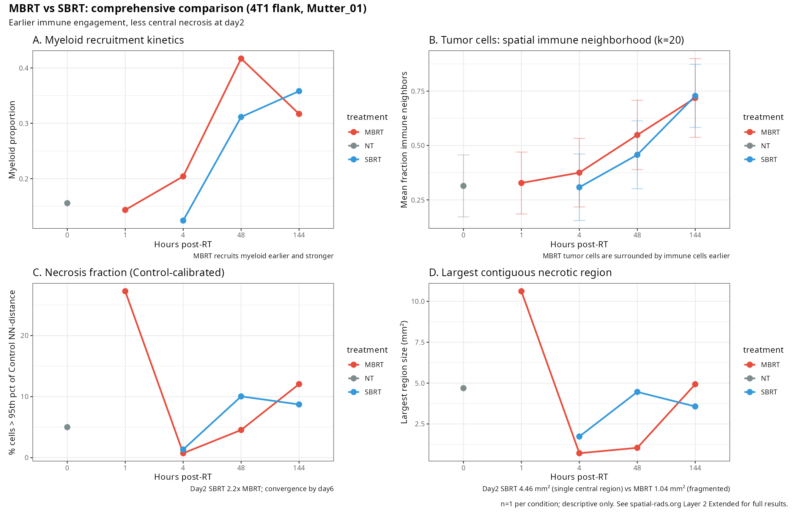

**** Setup, filters, and statistical posture

Three filters applied in sequence in =dev/mbrt_vs_sbrt/00_load_and_filter.R=:

1. *4T1 flank-only* (model filter): keep =model == "flank"=. Drops 138,832 tongue cells (971,818 → 832,986).
2. *4T1 tumor purity*: for cells initially labeled =tumor_epithelial=, keep label only if =epith_score > 0.3 & endo_score < 0.1= using log2-normalized mean expression of Krt8/Krt18/Epcam/Cdh1 (epith) and Pecam1/Cdh5/Vwf (endo). Failures relabeled =tumor_uncertain=. 160,124 of 349,509 retained (45.8%).
3. *Necrosis-zone density flag* (per slide): mean k=20 NN distance per cell; cells in top 10% per slide flagged =necrosis_zone=. Optional secondary criterion combines low Mean.DAPI (10th percentile within slide). Default downstream behavior excludes =necrosis_zone == TRUE= cells at day2 and day6 only; necrosis-zone cells are retained at 1h and 4h (no necrosis yet). Cell death analyses (script 04) keep necrosis-zone cells and stratify.

After mapping granular insitutype labels to 9 major cell types, the analytical universe is 581,913 cells across tumor_epithelial, endothelial, fibroblast, smooth_muscle, T cell, B cell, myeloid, NK, and plasma. DEG strata require ≥100 cells per (Condition × cell_type_major); 66 of 72 strata pass (only plasma fails at low timepoints).

**** DEG kinetics by cell type and contrast

DEGs computed via Seurat::FindMarkers (Wilcox), effect-size ranked, across three contrasts at each available timepoint: MBRT vs Control (1h, 4h, day2, day6), SBRT vs Control (4h, day2, day6), MBRT vs SBRT (4h, day2, day6). Total: 14,704 DEG rows across 90 (contrast × timepoint × cell type) jobs. Sanity check passed: tumor =Cdkn1a= (p21) +0.76 log2FC at 4h MBRT-vs-Control (p_adj=4e-45), confirming canonical DDR response.

Top MBRT-vs-SBRT effect sizes by cell type and timepoint (selected highlights):

- *4h tumor_epithelial* (MBRT-up): Il24 (+0.80), Il15ra (+0.74), Neat1 (+0.73), Cd74 (+0.68), Mt2 (+0.61), Mt1 (+0.54), B2m (+0.54), Vim (+0.51). MBRT-down: Spp1 (-0.86), Clu (-0.68), Col18a1 (-0.36), Hspg2 (-0.28). Interpretation: at 4h, MBRT tumor cells engage antigen presentation (Cd74, B2m), oxidative stress response (Mt1/2), and IL-15/IL-24 signaling. SBRT tumor cells show pure damage/stress response (Clu, Spp1) and ECM/scar (collagen, perlecan).
- *Day2 myeloid* (MBRT-up): Cd163 (+2.51), Ccl8 (+2.50), Pf4 (+2.44), Fabp5 (+2.14), Mrc1/CD206 (+2.12), Il4ra (+1.50), Selenop (+1.49), S100a8 (+1.41). Interpretation: M2-polarized tissue-repair myeloid (Cd163, Mrc1, Il4ra) plus T cell chemokine (Ccl8) plus DAMP (S100a8). MBRT-specific myeloid recruitment program.
- *Day2 T cell* (MBRT-up): Ccl8 (+1.79), Il24 (+1.10), Arg1 (+0.74), Cd44 (+0.58). Activation + chemokine signature.
- *Day6 B cell* (MBRT-up): Ighg1 (+4.40), Igkc (+3.30), Mzb1 (+1.94), Hsp90b1 (+1.71), Jchain (+1.65), Ighm (+1.53), Xbp1 (+1.06). Plasmablast/plasma cell differentiation with class switching to IgG and ER-stress chaperones. MBRT-driven humoral immune response.

Outputs: =dev/mbrt_vs_sbrt/data/degs_kinetics.tsv= (14,704 rows long format), =data/degs_top10_per_stratum.tsv=.

Volcano plots retired: -log10(p_val) is a cell-level Wilcoxon p, which pseudoreplicates the n=1-per-condition design (cells are not biological replicates). The effect-size tables above stay valid descriptively. Correct significance test deferred until Mutter_02 (2d) replicates: pseudobulk per sample → DESeq2/edgeR/limma → MA-plot/volcano with real p-values.

**** Pathway kinetics by cell type

Yi's pre-computed pathway scores (TypeI_interferon, TypeII_interferon, DNA_Damage_Repair, STING) plus 7 curated signatures scored with UCell rank-based method on 547,133 cells (necrosis-zone excluded at day2/day6):

- HALLMARK_APOPTOSIS (66/160 panel coverage = 41%)
- HALLMARK_EPITHELIAL_MESENCHYMAL_TRANSITION (75/206 = 36%)
- HALLMARK_INTERFERON_GAMMA_RESPONSE (66/205 = 32%)
- HALLMARK_TNFA_SIGNALING_VIA_NFKB (78/199 = 39%)
- SENMAYO_SENESCENCE (67/125 = 54%, Saul et al. 2022)
- CURATED_ANTIGEN_PRESENT (8/12 = 67%)
- CURATED_DAMP (10/12 = 83%)

Two signatures dropped below the 30% panel-coverage gate: HALLMARK_HYPOXIA (21%) and HALLMARK_INTERFERON_ALPHA_RESPONSE (24%). Too sparse to score reliably on this 1000-gene panel.

A surprising kinetic pattern emerged in =tumor_epithelial=: DDR and Type I IFN pre-computed scores DROP from baseline at 1h–4h and recover by day2 (e.g., DDR: NT 0.67 → MBRT 1h −0.49 → MBRT day2 +0.37). The most plausible explanation is that early post-RT tumor cells transcribe less overall (acute transcriptional suppression from damage), making rank-based and ratio-based pathway scores look depleted. Surviving cells at day2/day6 recover transcription. This affects interpretation of all pre-computed pathway scores but not the DEG analyses, which compare matched timepoints. Interpret pathway-kinetics plots with this confound in mind.

#+ATTR_ORG: :width 800
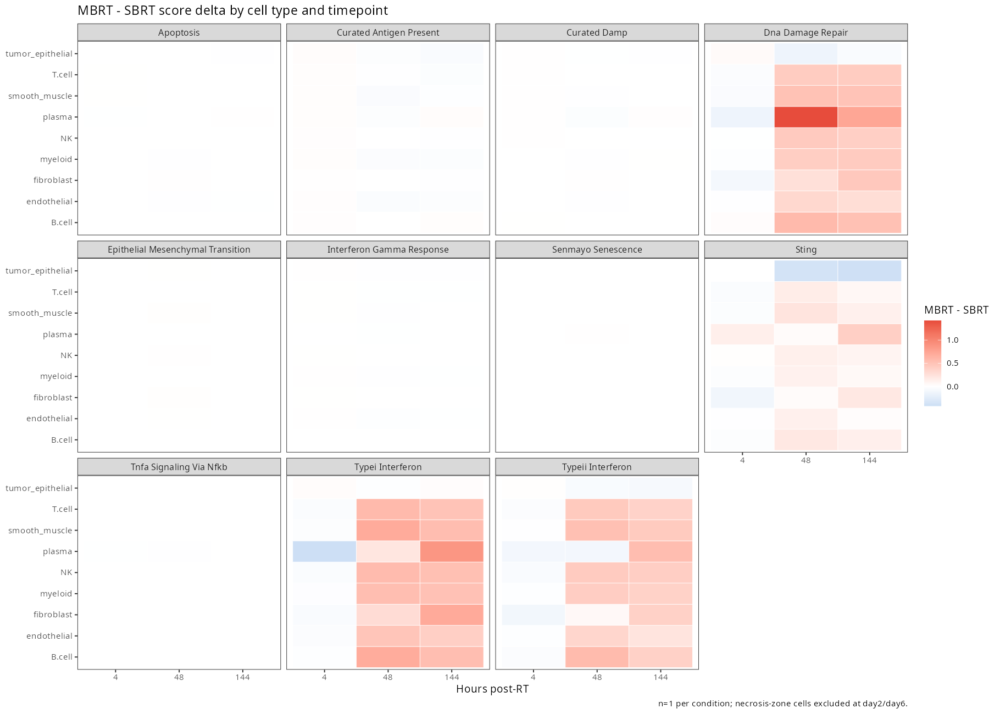

Per-cell-type pathway kinetics plots in =dev/mbrt_vs_sbrt/plots/pathway_kinetics_<celltype>.png=.

**** Composition trajectories

Cell type proportions per (Condition × timepoint × treatment), reported on both the post-Layer-1 universe (preserves total denominator) and the 9-major-only universe (renormalized).

Top MBRT − SBRT proportion deltas:

- *Day2 myeloid: MBRT 0.42 vs SBRT 0.31, ΔMBRT−SBRT = +0.105.* MBRT day2 has substantially more myeloid cells than SBRT day2.
- *4h tumor_epithelial: MBRT 0.41 vs SBRT 0.51, Δ = −0.099.* SBRT preserves more tumor cells at 4h.
- *Day2 tumor_epithelial: MBRT 0.18 vs SBRT 0.26, Δ = −0.082.* SBRT day2 still has more remaining tumor cells.
- *4h myeloid: MBRT 0.20 vs SBRT 0.12, Δ = +0.080.* MBRT 4h already has more myeloid cells.
- *Day6 T cell: MBRT 0.36 vs SBRT 0.42, Δ = −0.065.*

The composition story matches the DEG story: MBRT recruits myeloid cells earlier and more strongly than SBRT. SBRT loses fewer tumor cells in the first 48 hours but eventually catches up.

#+ATTR_ORG: :width 800
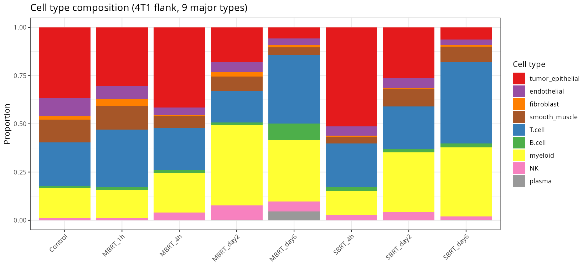

#+ATTR_ORG: :width 800
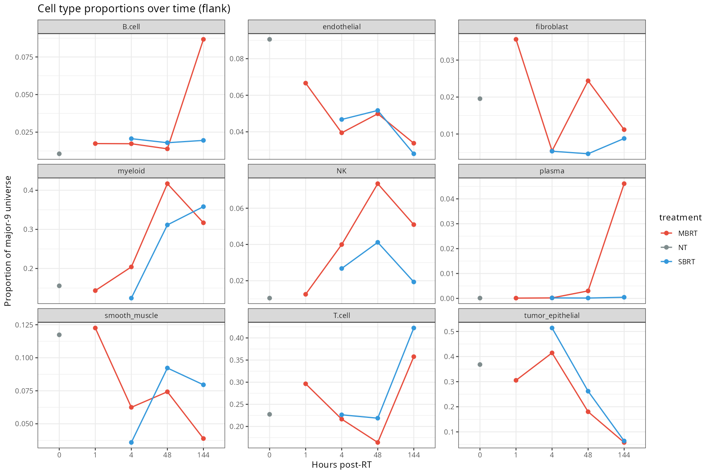

#+ATTR_ORG: :width 800
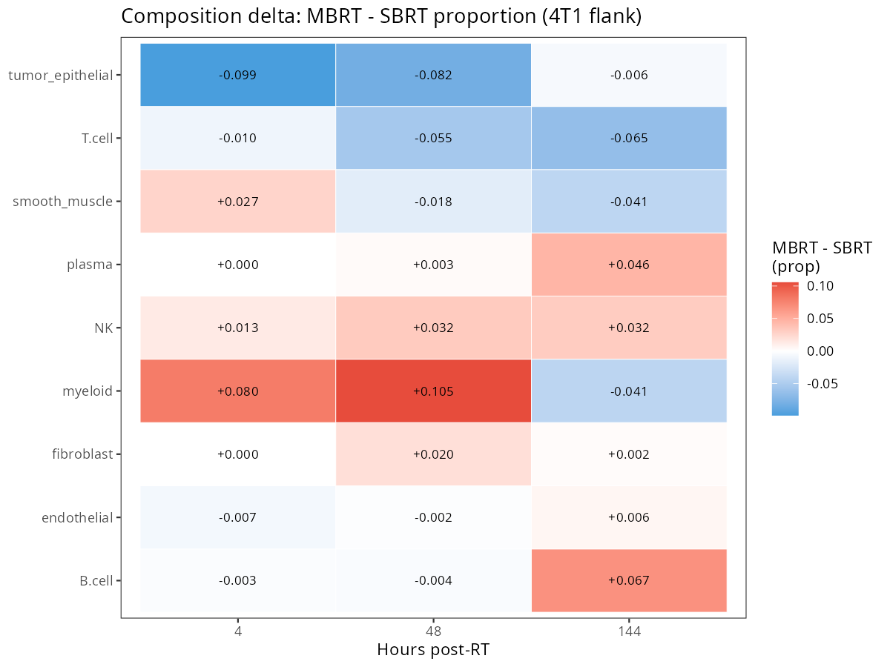

**** Spatial neighborhood evolution

Per-cell k=20 nearest-neighbor immune fraction (=mean(neighbor cell_type_strict %in% c("T.cell","B.cell","myeloid","NK","plasma"))=) computed per slide. Aggregated per (cell_type_major × timepoint × condition).

Headline: *MBRT triggers immune infiltration of tumor 1-2 days earlier than SBRT.* Tumor immune-neighbor fraction kinetics:

| Condition | Mean fraction immune neighbors |
|-----------+--------------------------------|
| Control   | 0.314                          |
| MBRT_1h   | 0.328                          |
| MBRT_4h   | *0.375*                          |
| SBRT_4h   | 0.308 (similar to Control)     |
| MBRT_day2 | *0.548*                          |
| SBRT_day2 | 0.457                          |
| MBRT_day6 | 0.719                          |
| SBRT_day6 | 0.728 (converged)              |

By 4h, MBRT tumor cells have +0.07 higher immune neighborhood than SBRT tumor cells. By day2 the gap widens to +0.09. By day6 both treatments converge near 0.72. The MBRT spatial-architecture dose creates a microenvironment that mixes immune and tumor cells substantially earlier than the uniform SBRT field.

#+ATTR_ORG: :width 800
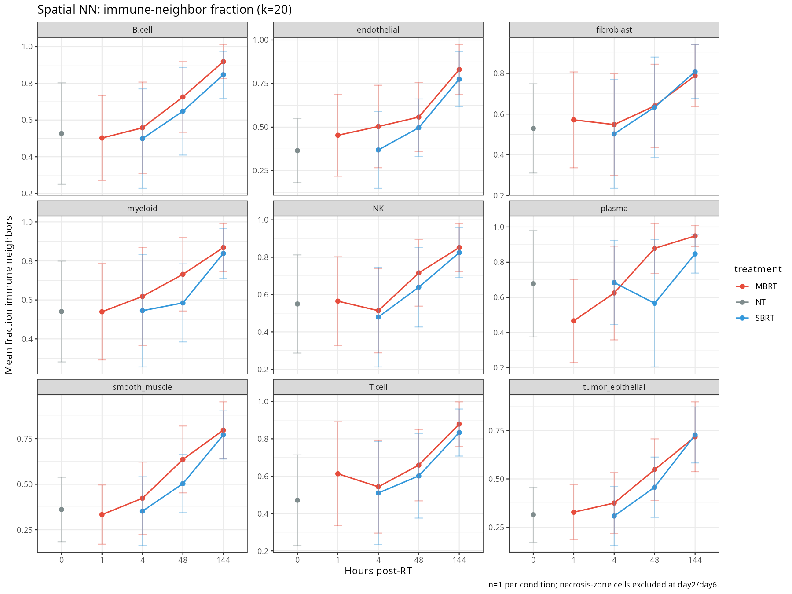

#+ATTR_ORG: :width 800
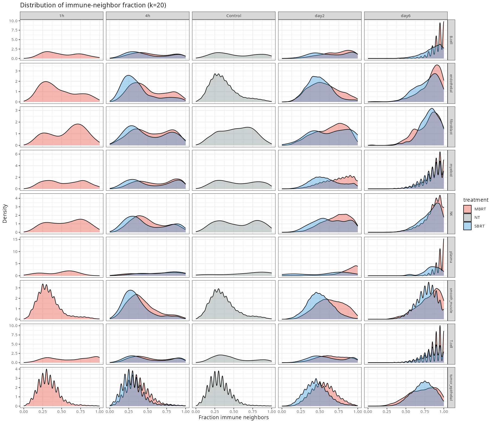

**** Cell death, senescence, and necrosis quantification

Three strands in =dev/mbrt_vs_sbrt/04_celldeath_senescence.R=.

***** Apoptosis and senescence kinetics

UCell-scored Hallmark Apoptosis (60 panel genes) and SenMayo Senescence (67 panel genes), per cell type per timepoint, with =necrosis_zone= cells stratified for biological validation. Unexpectedly, necrosis-zone cells show only marginal elevation of apoptosis or senescence transcriptional scores compared to viable cells (Δmean ≈ 0.01–0.02 across cell types and conditions). Two interpretations: (i) the spatial necrosis-zone flag captures slide-edge sparseness more than truly necrotic cells, and (ii) UCell rank-based scoring is insensitive to absolute transcript loss in dying cells. The CosMx 1000-gene panel also lacks specific apoptosis effectors (no cleaved caspase, limited necroptosis markers). The spatial-extent and Control-calibrated necrosis fraction metrics (4c) remain the more interpretable readouts.

#+ATTR_ORG: :width 800
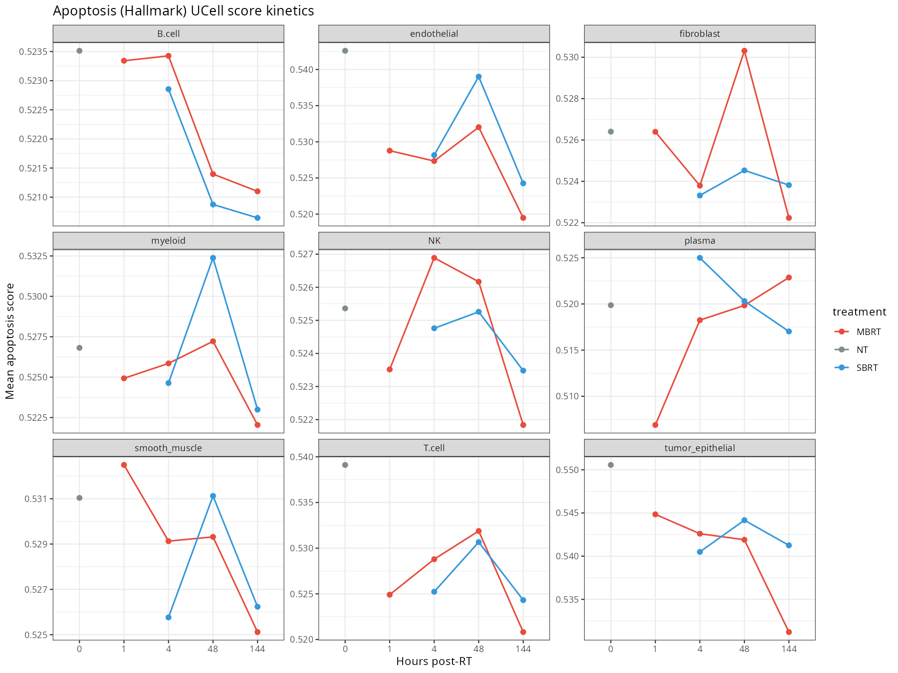

#+ATTR_ORG: :width 800
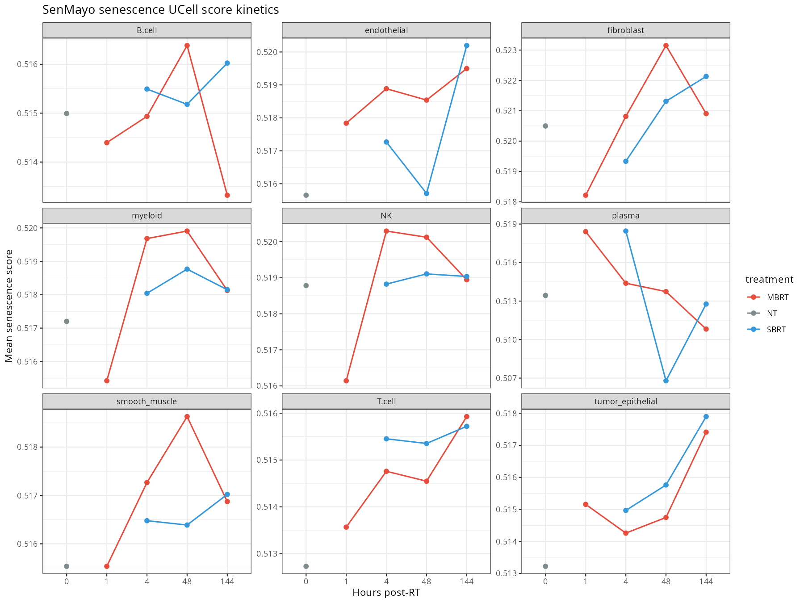

***** DAMP / alarmin signature

12-gene curated DAMP set (Hmgb1, Hmgb2, S100a8/9, Anxa1/2, Il1b, Il6, Nlrp3, Casp1, Tlr2, Tlr4) with 10 in panel. Distance-to-necrosis analysis: cells were binned by Euclidean distance to the nearest necrosis-zone cell within their slide (≤0.05, 0.05–0.1, 0.1–0.2, 0.2–0.5, 0.5–1.0, >1.0 mm). DAMP score is expected to peak adjacent to necrosis at day2/day6, especially in SBRT.

#+ATTR_ORG: :width 800
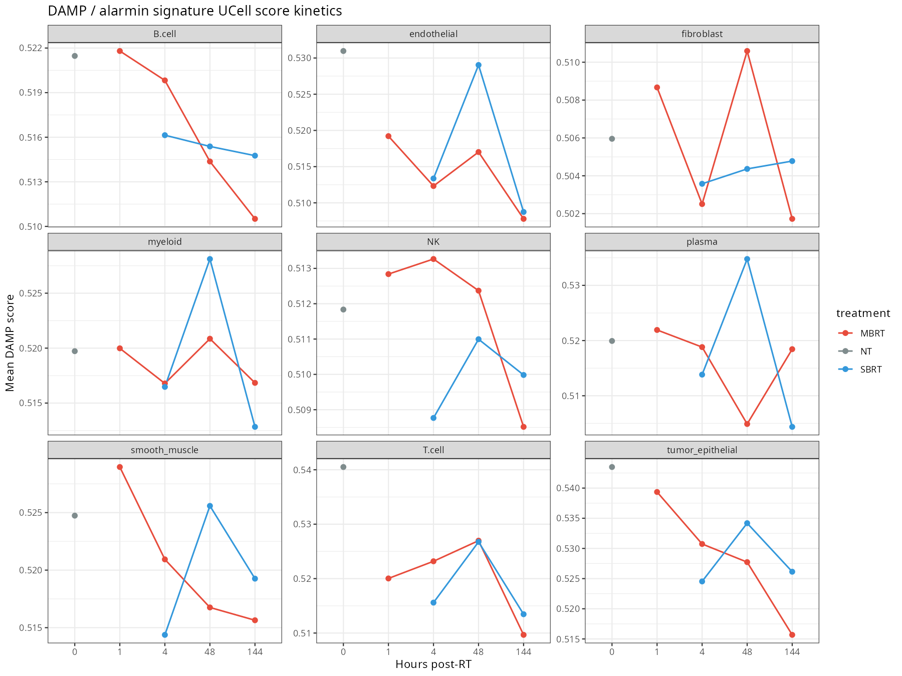

#+ATTR_ORG: :width 800
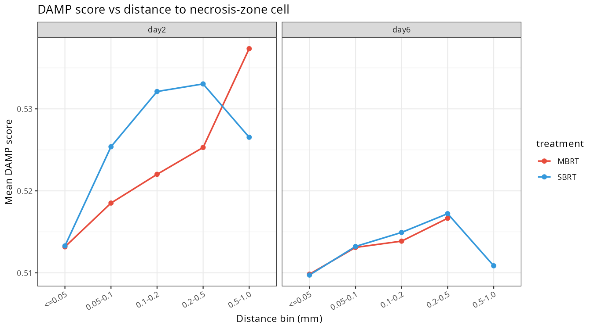

***** Necrosis quantification (first-class biological output)

Necrosis was operationalized as cells in spatially sparse regions, defined per cell as =local_density_d20 > 95th percentile of Control= (Control-calibrated absolute threshold = 0.034 mm). This is a proxy: it does not directly identify necrosis but flags regions of low surviving-cell density. By construction Control gets ~5% flagged.

The all-cell version of this metric mixes tumor cell loss with stromal architecture loss. The cleaner metric restricts the denominator to =cell_type_major == "tumor_epithelial"= (script =14_necrosis_tumor_only.R=).

*Tumor-only necrosis fraction (4T1 flank, primary metric):*

| Condition | n_tumor | % tumor in necrosis-zone |
|-----------+---------+--------------------------|
| Control   | 32,708  | 0.28                     |
| MBRT_4h   | 38,267  | 0.17                     |
| SBRT_4h   | 42,604  | 0.18                     |
| MBRT_day2 | 15,702  | *0.81*                     |
| SBRT_day2 | 13,227  | *2.11*                     |
| MBRT_day6 | 4,015   | *6.10*                     |
| SBRT_day6 | 5,353   | *3.40*                     |

*At day 2, SBRT loses 2.6x more tumor cells to sparse-density regions than MBRT (2.11% vs 0.81%).* By day 6 the relationship inverts: *MBRT exceeds SBRT (6.10% vs 3.40%) — a 1.8x cross-over.* MBRT's tumor-cell loss is delayed, not lesser. This is consistent with peak/valley dynamics: acute peak doses kill less than uniform high dose, but valley regions sustain DDR + immune recruitment producing ongoing tumor killing through late timepoints.

*All-cell version of the metric (for comparison):* Day 2 SBRT calibrated necrosis 10.0% vs MBRT 4.5% (2.2x). The all-cell pattern looked geometrically "consolidated central in SBRT, fragmented in MBRT" (largest contiguous region SBRT 4.46 mm² vs MBRT 1.04 mm²). However, when restricted to tumor cells alone the consolidation metric collapses (largest tumor-necrosis region 0.01–0.03 mm² across all conditions), meaning the consolidated-central pattern was driven mostly by stromal/immune sparseness, not tumor itself. The kinetics signal (day 2 SBRT > MBRT, day 6 cross-over) is the robust biological finding; the central-consolidation framing was an artifact of including stroma + immune in the denominator.

#+ATTR_ORG: :width 800
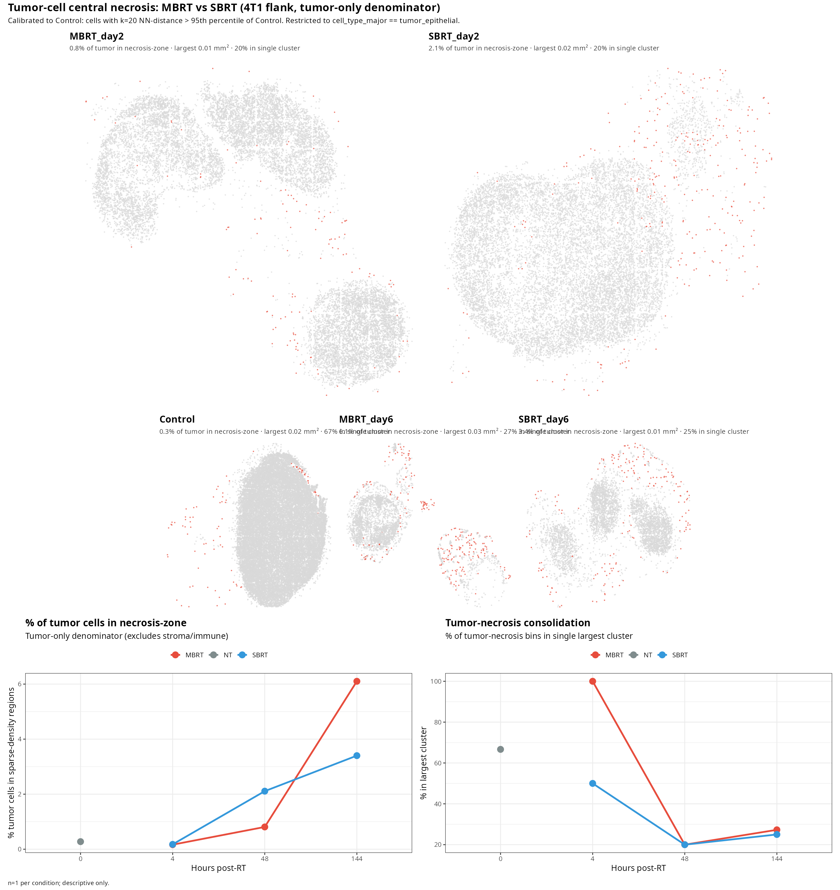

The all-cell supporting figures (necrosis kinetics + connected-component largest-region + cell-type breakdown + spatial maps) remain useful for understanding *where* low-density regions form and *which cell types* fall into them — but should not be read as "tumor-cell death" without the tumor-only restriction:

#+ATTR_ORG: :width 800
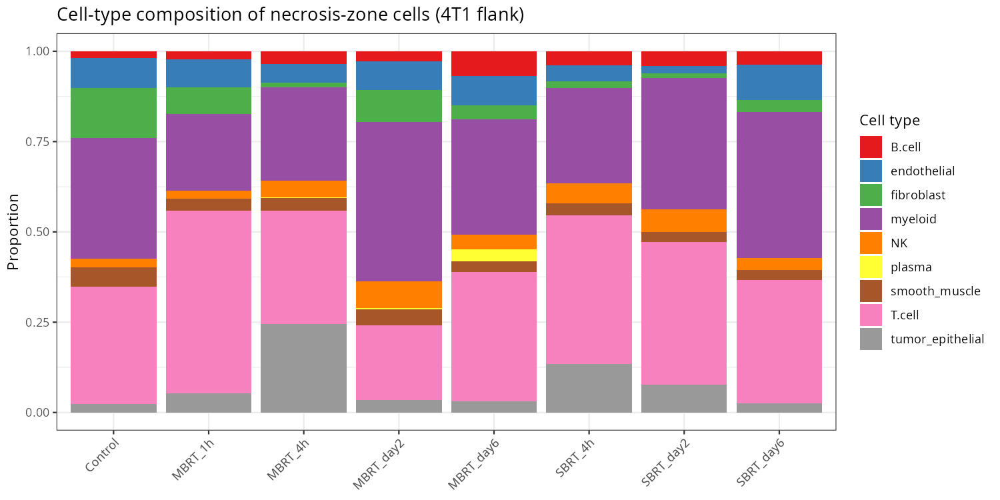

**** Set 2 validation at day2 (Mutter_02)

Mutter_02 day2 cohort: 4 slides × 3 biological replicates × 3 conditions (Control, MBRT, SBRT) = 12 samples, 2.35M cells post-QC. Mutter_02 RDS objects lack cell type labels (Yi's insitutype output not yet incorporated for this set), so marker-based classification was applied in =08_set2_validation.R=: 4T1 filter (epith_score > 0.3 & endo_score < 0.1) followed by priority-ordered marker gates (Cd3e/Cd3d for T cells, Cd19/Ms4a1 for B cells, Cd68/Adgre1/Itgam for myeloid, Ncr1/Klrb1c for NK, Jchain/Mzb1 for plasma, Pecam1/Cdh5 for endothelial, Col1a1/Pdgfra for fibroblast, Acta2/Myh11 for smooth muscle). Subsampled per (Condition × cell_type_major) to 3000 cells before DEG to keep wall-clock manageable (=08b_set2_validation_fast.R=).

***** Composition concordance at day2

Best validation signal. ΔProp(MBRT − SBRT) per cell type compared across the two datasets:

| Cell type        | Mutter_01 ΔMBRT−SBRT | Mutter_02 ΔMBRT−SBRT | Sign agreement           |
|------------------+----------------------+----------------------+--------------------------|
| tumor_epithelial | −0.082               |               *−0.091* | *YES, near-identical*      |
| myeloid          | +0.105               |               +0.036 | YES, same sign           |
| NK               | +0.032               |               +0.004 | YES, both positive       |
| fibroblast       | +0.020               |               +0.014 | YES, both positive       |
| plasma           | +0.003               |               +0.002 | YES, both small positive |
| B.cell           | −0.004               |               +0.002 | both near zero           |
| endothelial      | −0.002               |               +0.006 | both near zero           |
| T.cell           | −0.055               |               +0.023 | NO, opposite signs       |
| smooth_muscle    | −0.018               |               +0.005 | NO, opposite signs       |

*The tumor_epithelial day2 depletion replicates almost exactly (−0.082 vs −0.091).* This is the strongest cross-dataset validation: MBRT day2 has ~9 percentage points fewer tumor cells than SBRT day2, in both n=1 (Mutter_01) and n=4 replicates per condition (Mutter_02). The MBRT myeloid recruitment direction also replicates (both positive) though weaker in Mutter_02. T.cell and smooth_muscle deltas reverse sign across datasets — likely n=1 noise in Mutter_01.

***** DEG concordance (Spearman rho per cell type × contrast)

Per-gene log2FC rank correlation between Mutter_01 day2 and Mutter_02 day2, using subsampled 3000-cell-per-stratum DEGs after re-normalizing Mutter_02. *Important bug found and fixed:* the Mutter_02 RDS "data" layer was identical to "counts" (never normalized), so the original DEG analysis produced log2FC values up to ±187 (nonsensical). Script =08c_set2_validation_normalized.R= re-runs LogNormalize then DEGs; final log2FC range now sensible at [−2.22, 2.10].

Top concordance per contrast (post-normalization):

| Contrast        | Best (positive rho)                                                            | Notable values                  |
|-----------------+--------------------------------------------------------------------------------+---------------------------------|
| MBRT vs SBRT    | *myeloid 0.44*, BULK 0.20, fibroblast 0.19, B.cell 0.08                          | tumor_epithelial −0.25          |
| MBRT vs Control | endothelial 0.31, BULK 0.22, myeloid 0.14, smooth_muscle 0.13, fibroblast 0.13 | NK −0.11                        |
| SBRT vs Control | (all negative, −0.53 to −0.69 across all cell types)                           | smooth_muscle −0.69, BULK −0.69 |

Interpretation:
- *MBRT-vs-SBRT myeloid effect strongly concordant (rho 0.44).* Validates the headline M2 myeloid recruitment finding (Cd163, Mrc1, Ccl8, Pf4) in 12 replicate samples of Mutter_02.
- *MBRT-vs-Control concordance is positive for 8 of 9 major cell types* (rho 0.04 to 0.31) — MBRT effect direction reproduces well.
- *SBRT-vs-Control rho is strongly negative across all cell types* (−0.5 to −0.7). Mutter_02 SBRT effects are systematically opposite to Mutter_01 SBRT effects vs the same Control. Most likely explanation: cohort/batch differences (different mouse cohort, different irradiation session) producing a different SBRT signature; Mutter_01 SBRT was n=1 so cohort variance dominates. The MBRT-vs-SBRT rho remains generally positive because both treatments shift relative to their respective Controls in the same direction even when absolute Control-relative magnitudes differ.
- *tumor_epithelial MBRT-vs-SBRT rho is −0.25*, a real anti-concordance. Possibly the 4T1 marker-based filter retained different tumor populations across datasets, or 3000 tumor cells per group is noisy. Composition concordance for tumor (above) was strong, so the cell-population shift replicates even if per-gene effects are noisier.
- DEG concordance overall weaker than composition concordance — expected because per-gene effects are noisy with n=1 in Mutter_01, while composition aggregates over thousands of cells.

#+ATTR_ORG: :width 800
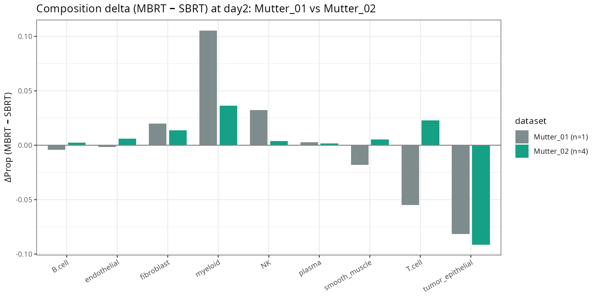

#+ATTR_ORG: :width 800
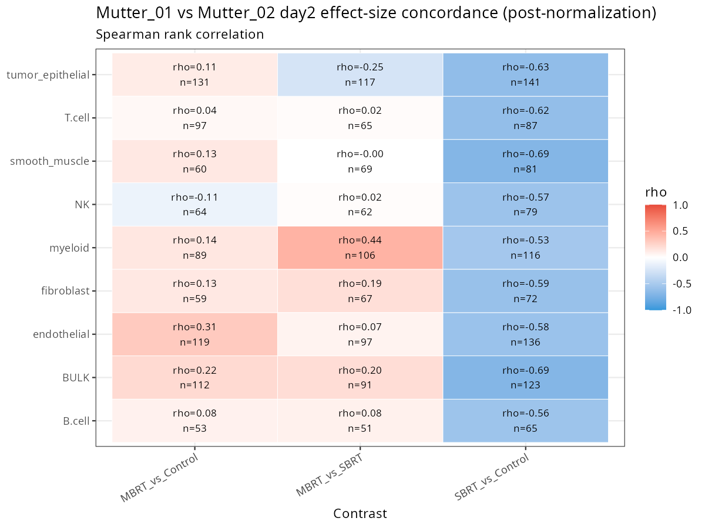

#+ATTR_ORG: :width 800
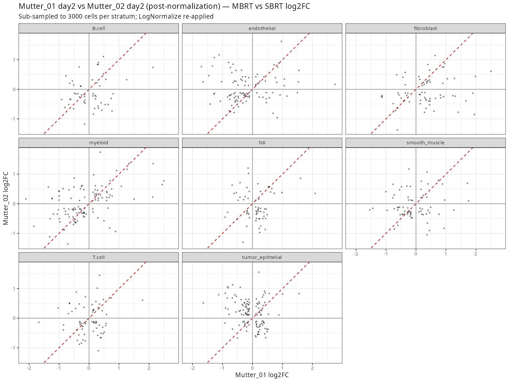

**** Synthesis: what makes MBRT different

Across DEGs, pathways, composition, spatial neighborhoods, and necrosis quantification, a consistent picture emerges:

1. *Earlier immune engagement.* At 4h, MBRT tumor cells already express antigen presentation (Cd74, B2m), Type II IFN response (HALLMARK_INTERFERON_GAMMA_RESPONSE), and IL-15/IL-24. SBRT tumor cells at 4h show the opposite: ECM/scar genes (Spp1, Clu, Col18a1) and stress chaperones, with no immune signature.
2. *Earlier and stronger myeloid recruitment, M2c-like / wound-healing skew.* Composition: MBRT 4h myeloid 0.20 vs SBRT 0.12; MBRT day2 0.42 vs SBRT 0.31. DEGs: MBRT day2 myeloid express Cd163, Mrc1, Il4ra, Pf4, Selenop, Ccl8, Fabp5, Arg1. M2/M1 polarization ratio MBRT day2 1.11 vs SBRT 1.00 (modest M2 skew). The elevated M2 markers are debris-clearing / wound-healing (Mrc1, Cd163, Arg1, Il4ra) — the pro-tumor arm (Vegfa, Ccl22, Mmp9, Tgfb1, Stat6) is NOT elevated — consistent with acute phagocytic response to spatially-fragmented damage rather than chronic immunosuppressive TAM phenotype.
3. *Adaptive humoral response by day6.* MBRT day6 B cells transition to plasma cell phenotype with class-switched antibody production (Ighg1 +4.40 log2FC, Igkc +3.30, Mzb1, Jchain, Ighm, Xbp1). SBRT day6 B cells lack this signature.
4. *Tumor-cell killing kinetics: SBRT day 2 > MBRT day 2; cross-over by day 6.* Tumor-only restricted necrosis fraction: day 2 SBRT 2.11% vs MBRT 0.81% (SBRT 2.6x). Day 6 MBRT 6.10% vs SBRT 3.40% (MBRT 1.8x). MBRT spreads tumor-cell killing across days rather than producing less of it. The "consolidated central" pattern in the all-cell metric was driven by stromal/immune sparseness, not tumor — corrected by tumor-only restriction.

These four findings together suggest MBRT shifts the post-RT tumor microenvironment toward an immune-engaged trajectory while sparing more tumor architecture (less central necrosis) at the day-2 timepoint. Whether the immune trajectory translates to better tumor control will require independent functional readouts.

**** Known limitations

- *1000-gene panel:* HALLMARK_HYPOXIA (21% panel coverage) and HALLMARK_INTERFERON_ALPHA_RESPONSE (24%) below the 30% gate. Cell death markers limited (no cleaved caspase-3, no specific necroptosis effector except Mlkl-pathway proxies in DAMP set).
- *4T1 epithelial purity:* Only 46% of cells initially labeled =tumor_epithelial= retained after marker-based 4T1 filter. The remaining 54% (mislabeled "a" bucket) are excluded from per-tumor-cell analyses.
- *4T1 flank-only:* Tongue model excluded by design from this analysis.
- *Necrosis-zone confound at day2 / day6:* SBRT produces more central necrosis. Default analyses exclude top-10% sparsest cells per slide; necrosis quantification reports both raw and Control-calibrated thresholds.
- *Mutter_01 n=1:* All comparisons are descriptive; p-values are reported for ranking, not formal inference.
- *Pathway-kinetics tumor confound:* tumor_epithelial DDR and Type I IFN pre-computed scores DROP at 1h–4h and recover by day2. Most plausible explanation: damaged cells with reduced overall transcription show depleted ratio-based pathway scores. DEG analyses (matched-timepoint contrasts) are unaffected.
- *Mutter_02 cell typing:* marker-based fallback only (insitutype labels not yet available for Mutter_02). Validates major types only.
- *MBRT_1h necrosis-zone fraction (33%) is anomalous:* small fragmented sample slide, not real biology at 1h. Treat as artifact.

*** Layer 4 -- Signature Projection (BLOCKED)
:PROPERTIES:
:ID:       d6be2ccf-1371-4fac-baf0-89e2c983a9e6
:END:
Virtual scientist plan created: =plan-mbrt-signatures.md=, =review-mbrt-signatures.md=, =run-mbrt-signatures.sh=. Session: =spatial-ucell-scoring-plan=. Key decisions: UCell (rank-based) as primary scoring method over AddModuleScore for targeted panel; cell-type-stratified signatures primary, bulk secondary; Moran's I for formal spatial autocorrelation. Blocked on FOV-to-condition mapping from Rob/Jenn for Mutter_02.
** Exploratory analysis
*** Scientific notes
- Kinetics are more interesting than marginal statistical gain at one timepoint
- Spatial ecotype for microbeam
- idea jacob scott genome-based model for adjusting radiotherapy dose- bulk tissue GUARD
- MALDI lipidomic imaging (Pandey lab, Seul Kee Byeon) at 4h on blocks #3 (control), #14 (SBRT 4Gy), #17 (SBRT 20Gy), #21 (MBRT): no clear peak-vs-valley lipid contrast (consistent with morphology), but global phosphatidylinositol metabolism diverges between MBRT and SBRT: MUFA enrichment and LPI accumulation with MBRT. Integration with 4T1 RNAseq is on Yiqun's plate (Rob, 2026-05-24). [[https://mail.google.com/mail/u/0/#all/19e5f31e3d8acb1b][Gmail: Fw: Tissue Samples]]. *Cross-referenced against smiDE day-2 expression (2026-08-14) -- RETRACTED 2026-08-16:* /the cross-reference below reads off a smiDE configuration with an uncontrolled type I error rate (no overlap-ratio gene filter, no spatial random effect) applied to a between-animal contrast the method is not benchmarked for, so the convergence is not established; the MALDI observation above is unaffected. Original text kept for the record./ lipid-metabolism genes converge with the MALDI finding. Fabp5 (MUFA/PUFA transport) UP in 5 cell types under MBRT_vs_Ctrl, Cyp2u1 (FA hydroxylase) UP in 5, Ptgs1/COX-1 (PI-derived prostaglandin synthesis) UP in 4, Ldlr (lipid uptake) UP in 4, Pparg UP in stroma, Srebf1 (de novo FA synthesis) DOWN in 3: the expression profile (MUFA transport UP, de novo synthesis DOWN, COX-1 UP, HIF1a-driven metabolic shift) is consistent with MALDI MUFA enrichment + LPI accumulation at 4h, suggesting a sustained metabolic adaptation. See =**** Lipidomics cross-reference= under Results.

*** Literature and references
- [[https://www.reddit.com/r/bioinformatics/comments/1rcvf1p/deg_genes_spatial_transcriptomic_xenium/][Reddit: DEG genes spatial transcriptomic Xenium]]
- [[https://www-sciencedirect-com.mclibrary.idm.oclc.org/science/article/pii/S1368837526000400?via%3Dihub#s0045][ScienceDirect article]]
- [[https://kb.10xgenomics.com/s/article/35468186410253-How-do-you-integrate-multiple-samples-for-Xenium-analysis][10x Genomics: Xenium multi-sample integration]]
- [[https://www-nature-com.mclibrary.idm.oclc.org/articles/s41416-025-03088-0][Nature article]]
- [[https://pubmed.ncbi.nlm.nih.gov/38648789/][PubMed 38648789]]
- [[https://www-nature-com.mclibrary.idm.oclc.org/articles/s41368-023-00267-8][Nature article (spatial methods)]]
- [[https://pubmed.ncbi.nlm.nih.gov/37596273/#full-view-affiliation-15][PubMed 37596273]]
- [[https://chatgpt.com/c/692da348-0a48-8325-b257-46410f227998][ChatGPT analysis session]]
- [[https://claude.ai/chat/163b2876-8164-4ff4-8005-3181ce4b2445][Claude analysis session]]

**** TODO Compare Ozirmak Lermi 2025 with Ren 2025 cross-platform benchmarks
:PROPERTIES:
:ID:       55042923-fe06-41a4-a474-43109fd98eac
:END:
Both papers compare CosMx, MERFISH, and Xenium with overlapping but distinct designs: [cite:@ozirmaklermi2025] uses FFPE TMAs of NSCLC and pleural mesothelioma with bulk RNA-seq + GeoMx DSP-WTA orthogonals and pathologist F1-scoring; [cite:@ren2025] is a subcellular-resolution benchmark on whole tumor sections with CODEX as orthogonal. Read ren2025 in full and produce a side-by-side comparison of findings on (a) cell typing accuracy, (b) detection sensitivity, (c) spatial specificity, and (d) probe-design failure modes. Note where the two papers converge or diverge and which framing better fits CosMx mouse spatial-rads validation. Outcome: methods-section paragraph or methodological caveat block.

*** Raw data
- Mutter_01 CosMx files from Yi Liu (Nov 2025) — see [[*Data sources][Data sources]] for full provenance and transfer details
  - =projects_Mutter_01_CosMmR_app_data_raw_tx_counts_matrix.parquet= — [[https://mayoclinic2.box.com/s/ywj75mz3bfhivo5bfvivoogqh5o2uu86][box]]
  - =Analysis_Mutter_01_CosMmR_Mutter_updated_metadata.parquet= — [[https://mayoclinic2.box.com/s/y3dqguqwsjt15shh1opc2dw1kelc8q15][box]]
- Files stored at =/mnt/gcs/jeszyman/projects/spatial-rads/inputs/=
- A single parquet always corresponds to one table.

*** Parquet inspection and gene panel check
#+begin_src python
import pandas as pd

df = pd.read_parquet("/mnt/gcs/jeszyman/projects/spatial-rads/inputs/projects_Mutter_01_CosMmR_app_data_raw_tx_counts_matrix.parquet")

print(df.dtypes)

print(df.shape)

# How many slides/samples?
print(df['Slide'].value_counts())

# FOVs per slide?
print(df.groupby('Slide')['fov'].nunique())

# Cells per slide?
print(df.groupby('Slide')['cell_id'].count())

#########1#########2#########3#########4#########5#########6#########7#########8

meta = pd.read_parquet("/mnt/gcs/jeszyman/projects/spatial-rads/inputs/Analysis_Mutter_01_CosMmR_Mutter_updated_metadata.parquet")
print(meta.shape)
print(meta.columns.tolist())

print(meta[['Slide', 'Condition', 'Block']].drop_duplicates())

df.to_csv("/mnt/gcs/jeszyman/projects/spatial-rads/inputs/tx_counts_matrix.tsv", sep="\t", index=False)

df = pd.read_parquet("/mnt/gcs/jeszyman/projects/spatial-rads/inputs/Analysis_Mutter_01_CosMmR_Mutter_updated_metadata.parquet")

df = pd.read_parquet("/mnt/gcs/jeszyman/projects/spatial-rads/inputs/projects_Mutter_01_CosMmR_app_data_raw_tx_counts_matrix.parquet")

print(df.dtypes)

print(df.shape)

df.to_csv("/mnt/gcs/jeszyman/projects/spatial-rads/inputs/metadata.tsv", sep="\t", index=False)

genes_to_check = [
    "A2ml1", "Adcy8", "Akap5", "Bcl6", "Cr2", "Cpne4", "Dpyd", "Eya4",
    "Gstm1", "Hopx", "Pwwp3a", "Nrp1", "Plau", "Plaur", "Porcn",
    "Prkci", "Scd1", "Sdc1", "Slc35f1", "Xist", "Cdkn2a"
]

panel_genes = set(df.columns)

for g in genes_to_check:
    print(f"{g}: {'YES' if g in panel_genes else 'NO'}")

for g in genes_to_check:
    print(f"{g}: {'YES' if g in panel_genes else 'NO'}")
#+end_src

*** Pathway and cell type analysis
#+begin_src R
library(data.table)

meta <- fread("/mnt/gcs/jeszyman/projects/spatial-rads/inputs/metadata.tsv")
names(meta)

unique(meta$Condition)
library(tidyverse)

meta <- meta |>
  mutate(
    model = if_else(str_detect(Condition, "^Tongue"), "tongue", "flank"),
    treatment = case_when(
      Condition == "Control" ~ "NT",
      str_detect(Condition, "MBRT") ~ "MBRT",
      str_detect(Condition, "SBRT") ~ "SBRT"
    ),
    timepoint_h = case_when(
      Condition == "Control" ~ 0,
      str_detect(Condition, "1h") ~ 1,
      str_detect(Condition, "4h") ~ 4,
      str_detect(Condition, "day2") ~ 48,
      str_detect(Condition, "day6") ~ 144,
      str_detect(Condition, "day8") ~ 192,
      str_detect(Condition, "day10") ~ 240
    )
  )

meta |>
  filter(treatment %in% c("MBRT", "SBRT"), model == "flank") |>
  group_by(timepoint_h, treatment) |>
  summarise(across(c(TypeI_interferon, TypeII_interferon, STING, DNA_Damage_Repair),
                   mean, na.rm = TRUE), .groups = "drop") |>
  pivot_longer(cols = -c(timepoint_h, treatment)) |>
  pivot_wider(names_from = treatment, values_from = value) |>
  mutate(delta = MBRT - SBRT)

meta |>
  filter(treatment %in% c("MBRT", "SBRT"), model == "flank") |>
  group_by(timepoint_h, treatment) |>
  summarise(across(c(TypeI_interferon, TypeII_interferon, STING, DNA_Damage_Repair),
                   mean, na.rm = TRUE), .groups = "drop") |>
  pivot_longer(cols = -c(timepoint_h, treatment), names_to = "pathway", values_to = "score") |>
  ggplot(aes(x = factor(timepoint_h), y = score, color = treatment, group = treatment)) +
  #ggplot(aes(x = timepoint_h, y = score, color = treatment)) +
  geom_line(linewidth = 1) +
  geom_point(size = 3) +
  facet_wrap(~pathway, scales = "free_y") +
  scale_x_continuous(breaks = c(1, 4, 48, 144)) +
  labs(x = "Hours post-radiation", y = "Mean pathway score", color = "Treatment") +
  theme_bw()

# Option 1: Categorical (clearest)
meta |>
  filter(treatment %in% c("MBRT", "SBRT"), model == "flank") |>
  group_by(timepoint_h, treatment) |>
  summarise(across(c(TypeI_interferon, TypeII_interferon, STING, DNA_Damage_Repair),
                   mean, na.rm = TRUE), .groups = "drop") |>
  pivot_longer(cols = -c(timepoint_h, treatment), names_to = "pathway", values_to = "score") |>
  ggplot(aes(x = factor(timepoint_h), y = score, color = treatment, group = treatment)) +
  geom_line(linewidth = 1) +
  geom_point(size = 3) +
  facet_wrap(~pathway, scales = "free_y") +
  labs(x = "Hours post-radiation", y = "Mean pathway score", color = "Treatment") +
  theme_bw()

meta |>
  filter(treatment %in% c("MBRT", "SBRT"), model == "flank") |>
  pivot_longer(cols = c(TypeI_interferon, TypeII_interferon, STING, DNA_Damage_Repair),
               names_to = "pathway", values_to = "score") |>
  ggplot(aes(x = factor(timepoint_h), y = score, fill = treatment)) +
  geom_violin(alpha = 0.7, scale = "width") +
  geom_boxplot(width = 0.2, outlier.shape = NA, alpha = 0.8) +
  facet_wrap(~pathway, scales = "free_y") +
  coord_cartesian(ylim = c(-2, 5)) +
  labs(x = "Hours post-radiation", y = "Pathway score", fill = "Treatment") +
  theme_bw()

meta |>
  filter(treatment %in% c("MBRT", "SBRT"), model == "flank") |>
  pivot_longer(cols = c(TypeI_interferon, TypeII_interferon, STING, DNA_Damage_Repair),
               names_to = "pathway", values_to = "score") |>
  ggplot(aes(x = factor(timepoint_h), y = score, fill = treatment)) +
  geom_boxplot(notch = TRUE, outlier.shape = NA, alpha = 0.8) +
  facet_wrap(~pathway, scales = "free_y") +
  coord_cartesian(ylim = c(-2, 4)) +
  labs(x = "Hours post-radiation", y = "Pathway score", fill = "Treatment") +
  theme_bw()

meta |>
  filter(treatment %in% c("MBRT", "SBRT"), model == "flank") |>
  pivot_longer(cols = c(TypeI_interferon, TypeII_interferon, STING, DNA_Damage_Repair),
               names_to = "pathway", values_to = "score") |>
  slice_sample(n = 50000) |>
  ggplot(aes(x = factor(timepoint_h), y = score, color = treatment)) +
  geom_point(position = position_jitterdodge(jitter.width = 0.15, dodge.width = 0.5),
             alpha = 0.1, size = 0.5) +
  facet_wrap(~pathway, scales = "free_y") +
  coord_cartesian(ylim = c(-2, 4)) +
  labs(x = "Hours post-radiation", y = "Pathway score", color = "Treatment", fill = "Treatment") +
  theme_bw()

meta |>
  filter(treatment %in% c("MBRT", "SBRT"), model == "flank") |>
  pivot_longer(cols = c(TypeI_interferon, TypeII_interferon, STING, DNA_Damage_Repair),
               names_to = "pathway", values_to = "score") |>
  slice_sample(n = 50000) |>
  ggplot(aes(x = factor(timepoint_h), y = score, color = treatment)) +
  geom_point(position = position_jitterdodge(jitter.width = 0.2, dodge.width = 0.6),
             alpha = 0.15, size = 0.5) +
  stat_summary(aes(group = treatment), fun = median, geom = "crossbar",
               position = position_dodge(width = 0.6), width = 0.4, linewidth = 0.8) +
  facet_wrap(~pathway, scales = "free_y") +
  coord_cartesian(ylim = c(-2, 5)) +
  labs(x = "Hours post-radiation", y = "Pathway score", color = "Treatment") +
  theme_bw()

meta |>
  filter(treatment %in% c("MBRT", "SBRT"), model == "flank") |>
  pivot_longer(cols = c(TypeI_interferon, TypeII_interferon, STING, DNA_Damage_Repair),
               names_to = "pathway", values_to = "score") |>
  slice_sample(n = 50000) |>
  ggplot(aes(x = factor(timepoint_h), y = score, color = treatment)) +
  geom_point(position = position_jitterdodge(jitter.width = 0.2, dodge.width = 0.6),
             alpha = 0.1, size = 0.3) +
  stat_summary(aes(group = treatment), fun = median, geom = "crossbar",
               position = position_dodge(width = 0.6), width = 0.5, linewidth = 1, color = "black") +
  facet_wrap(~pathway, scales = "free_y") +
  coord_cartesian(ylim = c(-2, 5)) +
  scale_color_manual(values = c("MBRT" = "#E74C3C", "SBRT" = "#3498DB")) +
  labs(x = "Hours post-radiation", y = "Pathway score", color = "Treatment") +
  theme_bw(base_size = 12) +
  theme(legend.position = "bottom")

meta |>
  filter(treatment %in% c("MBRT", "SBRT"), model == "flank") |>
  pivot_longer(cols = c(TypeI_interferon, TypeII_interferon, STING, DNA_Damage_Repair),
               names_to = "pathway", values_to = "score") |>
  group_by(timepoint_h, treatment, pathway) |>
  summarise(mean = mean(score), se = sd(score)/sqrt(n()), .groups = "drop") |>
  ggplot(aes(x = factor(timepoint_h), y = mean, fill = treatment)) +
  geom_col(position = position_dodge(0.8), width = 0.7) +
  geom_errorbar(aes(ymin = mean - se, ymax = mean + se),
                position = position_dodge(0.8), width = 0.2) +
  facet_wrap(~pathway, scales = "free_y") +
  labs(x = "Hours post-radiation", y = "Mean pathway score ± SEM", fill = "Treatment") +
  theme_bw()

meta |>
  filter(treatment %in% c("MBRT", "SBRT"), model == "flank") |>
  pivot_longer(cols = c(TypeI_interferon, TypeII_interferon, STING, DNA_Damage_Repair),
               names_to = "pathway", values_to = "score") |>
  group_by(timepoint_h, treatment, pathway) |>
  summarise(mean = mean(score), .groups = "drop") |>
  ggplot(aes(x = factor(timepoint_h), y = mean, fill = treatment)) +
  geom_col(position = position_dodge(0.8), width = 0.7) +
  facet_wrap(~pathway, scales = "free_y") +
  labs(x = "Hours post-radiation", y = "Mean pathway score", fill = "Treatment",
       caption = "n=1 animal per condition") +
  theme_bw()

#########1#########2#########3#########4#########5#########6#########7#########8

meta |>
  filter(treatment %in% c("MBRT", "SBRT"), model == "flank", timepoint_h %in% c(48, 144)) |>
  group_by(timepoint_h, treatment, ImmuneAtlas_ImmGen_Main_cell_Types) |>
  summarise(TypeI_interferon = mean(TypeI_interferon), .groups = "drop") |>
  pivot_wider(names_from = treatment, values_from = TypeI_interferon) |>
  mutate(delta = MBRT - SBRT) |>
  arrange(desc(abs(delta)))

meta |>
  filter(treatment %in% c("MBRT", "SBRT"), model == "flank", timepoint_h %in% c(48, 144)) |>
  group_by(timepoint_h, treatment, ImmuneAtlas_ImmGen_Main_cell_Types) |>
  summarise(TypeI_interferon = mean(TypeI_interferon), .groups = "drop") |>
  pivot_wider(names_from = treatment, values_from = TypeI_interferon) |>
  mutate(delta = MBRT - SBRT) |>
  ggplot(aes(x = delta, y = reorder(ImmuneAtlas_ImmGen_Main_cell_Types, delta))) +
  geom_col() +
  geom_vline(xintercept = 0, linetype = "dashed") +
  facet_wrap(~timepoint_h) +
  labs(x = "MBRT - SBRT (Type I Interferon)", y = NULL) +
  theme_bw()

#########1#########2#########3#########4#########5#########6#########7#########8

meta |>
  filter(model == "flank") |>
  group_by(timepoint_h, treatment) |>
  summarise(
    n_cells = n(),
    x_range = max(x_slide_mm) - min(x_slide_mm),
    y_range = max(y_slide_mm) - min(y_slide_mm),
    approx_area = x_range * y_range,
    .groups = "drop"
  ) |>
  mutate(cells_per_mm2 = n_cells / approx_area)

meta |>
  filter(model == "flank") |>
  count(timepoint_h, treatment) |>
  ggplot(aes(x = factor(timepoint_h), y = n, fill = treatment)) +
  geom_col(position = position_dodge(0.8), width = 0.7) +
  geom_text(aes(label = scales::comma(n)), position = position_dodge(0.8), vjust = -0.5, size = 3) +
  labs(x = "Hours post-radiation", y = "Number of cells", fill = "Treatment") +
  theme_bw()

meta |>
  filter(model == "flank") |>
  group_by(timepoint_h, treatment) |>
  summarise(
    n_cells = n(),
    x_range = max(x_slide_mm) - min(x_slide_mm),
    y_range = max(y_slide_mm) - min(y_slide_mm),
    approx_area = x_range * y_range,
    cells_per_mm2 = n_cells / approx_area,
    .groups = "drop"
  ) |>
  ggplot(aes(x = factor(timepoint_h), y = cells_per_mm2, color = treatment, group = treatment)) +
  geom_line(linewidth = 1) +
  geom_point(size = 3) +
  labs(x = "Hours post-radiation", y = "Cell density (cells/mm²)", color = "Treatment") +
  theme_bw()
#########1#########2#########3#########4#########5#########6#########7#########8

density_data |>
  pivot_longer(cols = c(n_cells, cells_per_mm2), names_to = "metric", values_to = "value") |>
  mutate(metric = recode(metric, n_cells = "Cell count", cells_per_mm2 = "Density (cells/mm²)")) |>
  ggplot(aes(x = factor(timepoint_h), y = value, color = treatment, group = treatment)) +
  geom_line(linewidth = 1) +
  geom_point(size = 3) +
  geom_hline(data = data.frame(metric = "Cell count", yint = 50000),
             aes(yintercept = yint), linetype = "dashed", color = "red") +
  facet_wrap(~metric, scales = "free_y") +
  labs(x = "Hours post-radiation", y = NULL, color = "Treatment") +
  theme_bw()
#########1#########2#########3#########4#########5#########6#########7#########8

unique(meta$Run_Tissue_name)
unique(meta$Condition)
unique(meta$Block)
unique(meta$Slide)
unique(meta$Panel)

# one row per "sample" with basic stats
sample_summary <- meta[
  ,
  .(
    n_cells       = .N,
    median_nCount = median(nCount_RNA),
    median_nFeat  = median(nFeature_RNA)
  ),
  by = .(Run_Tissue_name, Slide, Condition, Block)
][order(Condition, Block, Slide)]

sample_summary

#########1#########2#########3#########4#########5#########6#########7#########8

# 1) Per-cell metadata (already loaded)
meta <- fread("/mnt/gcs/jeszyman/projects/spatial-rads/inputs/metadata.tsv")

# 2) Counts
counts_dt <- fread("/mnt/gcs/jeszyman/projects/spatial-rads/inputs/tx_counts_matrix.tsv")

# Sanity check: do cell_ids line up?
all(counts_dt$cell_id %in% meta$cell_id)
all(meta$cell_id %in% counts_dt$cell_id)  # may be TRUE or FALSE depending on export

# columns that are not genes
non_gene_cols <- c("Slide", "fov", "cell_id")

gene_cols <- setdiff(colnames(counts_dt), non_gene_cols)

# counts matrix: genes x cells
count_mat <- t(as.matrix(counts_dt[, ..gene_cols]))
colnames(count_mat) <- counts_dt$cell_id
rownames(count_mat) <- gene_cols

dim(count_mat)  # ~ (#genes x #cells)

meta_df <- as.data.frame(meta)
rownames(meta_df) <- meta_df$cell_id

# Optionally, add parsed treatment/timepoint info as we discussed earlier
meta_dt <- as.data.table(meta_df)
meta_dt[, c("site", "rt_type", "timepoint") := {
  parts <- tstrsplit(Condition, "_", fixed = TRUE)
  is_tongue <- parts[[1]] == "Tongue"
  list(
    site      = ifelse(is_tongue, "Tongue", NA_character_),
    rt_type   = ifelse(is_tongue, parts[[2]], parts[[1]]),
    timepoint = ifelse(is_tongue, parts[[3]], parts[[2]])
  )
}]
meta_df <- as.data.frame(meta_dt)
rownames(meta_df) <- meta_df$cell_id

library(Seurat)

obj <- CreateSeuratObject(
  counts    = count_mat,
  meta.data = meta_df,
  project   = "CosMx_Mutter"
)

obj

# keep only cells that pass Yi's overall QC
obj <- subset(obj, subset = qcFlagsCell == "Pass")

# optional extra guardrails:
obj <- subset(
  obj,
  subset = nCount_RNA > 20 & nFeature_RNA > 10 & propNegative < 0.5
)

obj <- NormalizeData(obj, normalization.method = "LogNormalize", scale.factor = 1e4)
obj <- FindVariableFeatures(obj, selection.method = "vst", nfeatures = 2000)
obj <- ScaleData(obj, features = VariableFeatures(obj))

obj <- RunPCA(obj, features = VariableFeatures(obj))

library(future)

## allow up to e.g. 10 GB of globals
options(future.globals.maxSize = 10 * 1024^3)   # 10 GiB

## (optional but recommended) set the plan explicitly
plan(multicore, workers = 48)  # or whatever makes sense for your box

obj <- FindNeighbors(obj, dims = 1:20)

options(future.globals.maxSize = 50 * 1024^3)  # 50 GiB, or even Inf
obj <- FindClusters(obj, resolution = 0.4)

plan(sequential)

obj <- RunUMAP(obj, dims = 1:20, n.neighbors = 30, min.dist = 0.3)

# If it finishes:
DimPlot(obj, group.by = "seurat_clusters", raster = TRUE)

# Clusters across treatments
DimPlot(obj, group.by = "Condition", raster = TRUE)

# Cell-type annotation vs clusters (using Insitutype labels)
DimPlot(obj, group.by = "ImmuneAtlas_ImmGen_Main_cell_Types", raster = TRUE, label = TRUE, repel = TRUE)

# Composition by condition
cluster_by_condition <- table(obj$seurat_clusters, obj$Condition)
cluster_by_condition[ , ]

#########1#########2#########3#########4#########5#########6#########7#########8
DimPlot(
  obj,
  group.by = "ImmuneAtlas_ImmGen_cellFamily_Main_cell_Types",
  raster   = TRUE,
  label    = TRUE, repel = TRUE
)

#########1#########2#########3#########4#########5#########6#########7#########8

library(dplyr)
library(tidyr)
library(ggplot2)

df <- obj@meta.data %>%
  as.data.frame() %>%
  select(
    Condition,
    cell_family = ImmuneAtlas_ImmGen_cellFamily_Main_cell_Types,
    TypeI_interferon,
    TypeII_interferon,
    STING,
    DNA_Damage_Repair
  )

summary_long <- df %>%
  group_by(Condition, cell_family) %>%
  summarise(
    n_cells = n(),
    across(
      c(TypeI_interferon, TypeII_interferon, STING, DNA_Damage_Repair),
      ~ median(.x, na.rm = TRUE),
      .names = "{.col}"
    ),
    .groups = "drop"
  ) %>%
  pivot_longer(
    cols = c(TypeI_interferon, TypeII_interferon, STING, DNA_Damage_Repair),
    names_to = "pathway",
    values_to = "score"
  )

ggplot(summary_long,
       aes(x = Condition, y = cell_family)) +
  geom_point(aes(size = n_cells, color = score)) +
  facet_wrap(~ pathway, nrow = 1) +
  coord_flip() +
  labs(
    title = "Pathway scores by condition and cell family",
    x = "Condition",
    y = "ImmGen cell family",
    size = "Cells",
    color = "Median score"
  ) +
  theme_bw()
#########1#########2#########3#########4#########5#########6#########7#########8

library(dplyr)
library(tidyr)
library(ggplot2)

summary_long <- obj@meta.data %>%
  as.data.frame() %>%
  select(
    Condition,
    cell_family = ImmuneAtlas_ImmGen_cellFamily_Main_cell_Types,
    TypeI_interferon,
    TypeII_interferon,
    STING,
    DNA_Damage_Repair
  ) %>%
  group_by(Condition, cell_family) %>%
  summarise(
    n_cells = n(),
    across(
      c(TypeI_interferon, TypeII_interferon, STING, DNA_Damage_Repair),
      ~ median(.x, na.rm = TRUE),
      .names = "{.col}"
    ),
    .groups = "drop"
  ) %>%
  pivot_longer(
    cols = c(TypeI_interferon, TypeII_interferon, STING, DNA_Damage_Repair),
    names_to = "pathway",
    values_to = "score"
  )

cond_levels <- c(
  "Control",              # baseline

  "MBRT_1h",              # 1h

  "MBRT_4h", "SBRT_4h",   # 4h

  "MBRT_day2", "SBRT_day2",   # day 2
  "MBRT_day6", "SBRT_day6",   # day 6

  "Tongue_MBRT_day8",         # day 8 (tongue only)

  "Tongue_MBRT_day10",        # day 10
  "Tongue_SBRT_day10"
)

summary_long$Condition <- factor(summary_long$Condition,
                                 levels = cond_levels)

ggplot(summary_long,
       aes(x = cell_family, y = Condition)) +
  geom_point(aes(size = n_cells, color = score)) +
  facet_wrap(~ pathway, nrow = 1) +
  labs(
    title = "Pathway scores by condition and cell family",
    x = "ImmGen cell family",
    y = "Condition",
    size = "Cells",
    color = "Median score"
  ) +
  theme_bw() +
  theme(
    axis.text.x = element_text(angle = 45, hjust = 1, vjust = 1)
  )

str(meta)
#+end_src

** Results
*** Experimental Design
:PROPERTIES:
:ID:       95b433bd-d449-4999-b0c3-ce1052988a08
:END:

**** Design grid

#+begin_src R :tangle scripts/fig_design_grid.R
#!/usr/bin/env Rscript

# -----------------------------------------------------------------------------
# fig_design_grid.R
# Study-design grid: samples per treatment arm x timepoint, faceted by dataset x
# model. Empty cells (grey) expose the design gaps; the fill/label is n. Reads the
# master sample sheet only.
# Args (all optional, canonical defaults): <samples.tsv> <out.png>
# -----------------------------------------------------------------------------

suppressPackageStartupMessages(library(tidyverse))
source("/home/jeszyman/repos/science/R/figure_schema.R")

a   <- commandArgs(trailingOnly = TRUE)
ss  <- if (length(a) >= 1) a[1] else "results/data_model/samples.tsv"
out <- if (length(a) >= 2) sub("\\.png$", "", a[2]) else "results/data_model/plots/design_grid"

tp_lab <- c("0" = "0h", "1" = "1h", "4" = "4h", "48" = "2d",
            "144" = "6d", "192" = "8d", "240" = "10d")
tp_lvl <- c("0h", "1h", "4h", "2d", "6d", "8d", "10d")

d <- read_tsv(ss, show_col_types = FALSE) %>%
  mutate(
    treatment = recode(treatment, NT = "Control"),
    treatment = factor(treatment, levels = c("Control", "MBRT", "SBRT")),
    tp        = factor(tp_lab[as.character(timepoint_h)], levels = tp_lvl),
    panel     = paste0(name, " (", model, ")"))

grid <- d %>%
  count(panel, tp, treatment, name = "n") %>%
  group_by(panel) %>%
  complete(tp, treatment) %>%    # keep observed timepoints x all arms -> gaps show as NA
  ungroup() %>%
  mutate(nlab = ifelse(is.na(n), "", as.character(n)))

legend_text <- str_c(
  "Study design: Mutter_02 is a 2x2 (4h + day-2, n = 2 per arm at each timepoint); ",
  "Mutter_01 is a single-tumour kinetic series (n = 1 per arm x timepoint). ",
  "Cell fill and label give the number of samples; grey cells are ",
  "design gaps (no sample). Faceted by dataset and tumour model; arms are ",
  "Control (0 Gy), MBRT, and SBRT.")

p <- ggplot(grid, aes(treatment, fct_rev(tp), fill = n)) +
  geom_tile(color = "white", linewidth = 0.7) +
  geom_text(aes(label = nlab), color = "white", fontface = "bold", size = 4.2) +
  facet_wrap(~ panel, scales = "free_y") +
  scale_fill_viridis_c(option = "D", begin = 0.25, end = 0.9,
                       na.value = "grey92", breaks = 1:4) +
  labs(x = "Treatment Arm", y = "Timepoint", fill = "Samples (n)",
       caption = str_wrap(legend_text, width = round(9 * 15))) +
  theme_scifig(base_size = 12) +
  theme(strip.text = element_text(face = "bold"),
        legend.position = "bottom",
        legend.key.height = unit(0.4, "cm"),
        axis.title.x = element_text(margin = margin(t = 8)),
        axis.title.y = element_text(margin = margin(r = 8)),
        plot.caption = element_text(size = 10, hjust = 0, color = "gray30",
                                    lineheight = 1.3, margin = margin(t = 20)),
        plot.caption.position = "plot")

save_plot(p, out, w = 9, h = 5.5)
#+end_src

#+ATTR_ORG: :width 600
[[file:results/data_model/plots/design_grid.svg]]

**** Panel provenance figure

#+begin_src R :tangle scripts/fig_panel_provenance.R
#!/usr/bin/env Rscript

# -----------------------------------------------------------------------------
# fig_panel_provenance.R
# Panel provenance: per-dataset decomposition of the delivered gene panel into
# shared-stock / dataset-only-stock / custom, against the UCC stock reference.
# Reads the data-derived panel_provenance membership table.
# Args (all optional, canonical defaults): <panel_provenance.tsv> <out.png>
# -----------------------------------------------------------------------------

suppressPackageStartupMessages(library(tidyverse))
source("/home/jeszyman/repos/science/R/figure_schema.R")

a   <- commandArgs(trailingOnly = TRUE)
pv  <- if (length(a) >= 1) a[1] else "results/data_model/panel_provenance.tsv"
out <- if (length(a) >= 2) sub("\\.png$", "", a[2]) else "results/data_model/plots/panel_provenance"

d <- read_tsv(pv, show_col_types = FALSE)

shared     <- sum(d$mutter_01 & d$mutter_02)          # 950 shared stock
m01_only   <- sum(d$mutter_01 & !d$mutter_02)          # stock genes only in M01
m02_custom <- sum(d$mutter_02 & d$custom)              # M02 non-stock custom
ucc        <- sum(d$ucc_standard)                      # UCC stock size

df <- tribble(
  ~dataset,    ~category,          ~n,
  "Mutter_01", "Shared Stock",     shared,
  "Mutter_01", "M01-Only Stock",   m01_only,
  "Mutter_02", "Shared Stock",     shared,
  "Mutter_02", "M02 Custom",       m02_custom) %>%
  mutate(category = factor(category,
                           levels = c("Shared Stock", "M01-Only Stock", "M02 Custom")))

legend_text <- str_c(
  "The two cohorts share a 950-gene common panel, so cross-dataset differential analysis ",
  "rests on a matched feature space. Mutter_01 carries the full 1000-gene UCC stock panel; ",
  "Mutter_02 drops ~50 stock genes and adds 21 custom genes (Fields add-on). Bars decompose ",
  "each cohort's delivered panel into shared stock, cohort-only stock, and custom; the dashed ",
  "line marks the 1000-gene UCC stock reference.")

# shared-stock (950) label centred in its wide segment; the thin M01-only / M02-custom
# slivers cannot hold a centred label, so those counts read just past the sliver edge.
shared_lab <- df %>% filter(category == "Shared Stock") %>%
  mutate(lab_x = ifelse(dataset == "Mutter_01", m01_only, m02_custom) + shared / 2)
thin_lab <- df %>% filter(category != "Shared Stock") %>% mutate(lab_x = n + 10)

p <- ggplot(df, aes(n, fct_rev(dataset), fill = category)) +
  geom_col(width = 0.6, color = "white") +
  geom_vline(xintercept = ucc, linetype = "dashed", color = "grey30") +
  geom_text(data = shared_lab, aes(x = lab_x, label = n),
            color = "white", fontface = "bold", size = 4) +
  geom_text(data = thin_lab, aes(x = lab_x, label = n), hjust = 0,
            color = "white", fontface = "bold", size = 4) +
  scale_x_continuous(breaks = seq(0, 1000, 250),
                     sec.axis = dup_axis(breaks = ucc, labels = "UCC stock", name = NULL)) +
  scale_fill_manual(values = c("Shared Stock" = "#3c78d8",
                               "M01-Only Stock" = "#8e8e8e",
                               "M02 Custom" = "#e06666")) +
  labs(x = "Genes (n)", y = NULL, fill = NULL,
       caption = str_wrap(legend_text, width = round(8 * 15))) +
  theme_scifig(base_size = 12) +
  theme(legend.position = "bottom",
        legend.key.size = unit(0.4, "cm"),
        axis.title.x = element_text(margin = margin(t = 8)),
        plot.caption = element_text(size = 10, hjust = 0, color = "gray30",
                                    lineheight = 1.3, margin = margin(t = 20)),
        plot.caption.position = "plot")

save_plot(p, out, w = 8, h = 4.2)
#+end_src

#+ATTR_ORG: :width 600
[[file:results/data_model/plots/panel_provenance.svg]]

**** Gene-set coverage

#+begin_src R :tangle scripts/fig_geneset_coverage.R
#!/usr/bin/env Rscript

# -----------------------------------------------------------------------------
# fig_geneset_coverage.R
# Pathway-set panel coverage by provenance: for each study concept, the fraction of
# its genes present on the common 950-gene panel, shown per source (NanoString module,
# MSigDB Hallmark, custom). Concepts with both computational sources get two rows so
# the panel-designed module and the genome-wide Hallmark set are compared directly.
# The confirmatory set per concept (highest coverage) is marked; the rest are scored
# exploratory. Interpretation aid: a null in a low-coverage set is a panel blind spot,
# not necessarily biology. Reads the coverage table from build_gene_sets.R.
# Args (all optional, canonical defaults): <gene_set_panel_coverage.tsv> <out.png>
# -----------------------------------------------------------------------------

suppressPackageStartupMessages(library(tidyverse))
source("/home/jeszyman/repos/science/R/figure_schema.R")

a   <- commandArgs(trailingOnly = TRUE)
cov <- if (length(a) >= 1) a[1] else "results/data_model/gene_set_panel_coverage.tsv"
out <- if (length(a) >= 2) sub("\\.png$", "", a[2]) else "results/data_model/plots/geneset_coverage"

prov_lab <- c(nanostring = "NanoString module", hallmark = "MSigDB Hallmark", custom = "Custom (cited)")
prov_col <- c("NanoString module" = "#3c78d8", "MSigDB Hallmark" = "#e6a817", "Custom (cited)" = "#c0504d")

# concept id -> display label (fix the run-together TypeI/TypeII, strip underscores)
nice_concept <- function(x) x %>%
  str_replace("^TypeI_", "Type I ") %>% str_replace("^TypeII_", "Type II ") %>%
  str_replace_all("_", " ")

d <- read_tsv(cov, show_col_types = FALSE, comment = "#") %>%   # drop msigdbr_version line
  mutate(provenance  = factor(prov_lab[source], levels = prov_lab),
         concept_lab = nice_concept(concept)) %>%
  # order rows: group by concept (confirmatory coverage descending), source within concept
  group_by(concept) %>% mutate(concept_cov = max(coverage)) %>% ungroup() %>%
  arrange(concept_cov, desc(source == "nanostring")) %>%
  mutate(row_lab = paste0(concept_lab, "  [", recode(source, nanostring = "NS", hallmark = "HM", custom = "cu"), "]"),
         band    = as.integer(factor(concept, levels = unique(concept))) %% 2)  # alternating concept shade
d$row_lab <- factor(d$row_lab, levels = d$row_lab)
d$ri <- as.integer(d$row_lab)
# full-width shading spanning every other concept's row pair (baked alpha; no scale to wash it out)
bands <- d %>% filter(band == 1) %>%
  summarise(ymin = min(ri) - 0.5, ymax = max(ri) + 0.5, .by = concept)

legend_text <- str_c(
  "Every confirmatory pathway signature is a panel-designed NanoString module with near-complete ",
  "coverage (83-97%); the genome-wide MSigDB Hallmark sets, shown for comparison, are diluted off ",
  "the 950-gene panel and stay exploratory. A null in a low-coverage set is a panel blind spot, ",
  "not evidence of absent biology. Position gives the on-panel gene fraction per concept and source; dot ",
  "size is the number of on-panel genes (small = statistically thin even at high coverage, e.g. ",
  "STING 2/3). Ring marks the confirmatory set (highest coverage) per concept; STING has no ",
  "computational source and is a cited custom set.")

p <- ggplot(d, aes(coverage, row_lab)) +
  geom_rect(data = bands, inherit.aes = FALSE,
            aes(xmin = -Inf, xmax = Inf, ymin = ymin, ymax = ymax),
            fill = "grey90", alpha = 0.6) +
  geom_segment(aes(x = 0, xend = coverage, yend = row_lab), color = "grey75") +
  geom_point(aes(fill = provenance, size = n_panel), shape = 21, stroke = 0.4, color = "white") +
  geom_point(data = filter(d, confirmatory), aes(size = n_panel),
             shape = 21, stroke = 1.6, color = "grey20", fill = NA) +
  geom_text(aes(label = sprintf("%d/%d", n_panel, n_total)), hjust = -0.5, size = 3.2) +
  scale_x_continuous(labels = scales::percent, limits = c(0, 1.1), breaks = seq(0, 1, 0.25)) +
  scale_size_area(max_size = 8, limits = c(0, max(d$n_panel)),
                  breaks = c(5, 50, 100), name = "On-panel genes (n)") +
  scale_fill_manual(values = prov_col, name = NULL, drop = FALSE) +
  guides(fill = guide_legend(override.aes = list(size = 4.5), order = 1),
         size = guide_legend(order = 2)) +
  labs(x = "Fraction of Set Genes on the Common 950-Gene Panel", y = NULL,
       caption = str_wrap(legend_text, width = round(9 * 15))) +
  theme_scifig(base_size = 12) +
  theme(legend.position = "bottom",
        legend.box = "vertical",
        legend.box.just = "left",
        legend.key.size = unit(0.4, "cm"),
        axis.title.x = element_text(margin = margin(t = 8)),
        plot.caption = element_text(size = 10, hjust = 0, color = "gray30",
                                    lineheight = 1.3, margin = margin(t = 20)),
        plot.caption.position = "plot")

save_plot(p, out, w = 9, h = 6.5)
#+end_src

#+ATTR_ORG: :width 600
[[file:results/data_model/plots/geneset_coverage.svg]]

*** Per-cell panel detection

The platform-sparsity fact behind the cluster-then-annotate typing design: per-cell InSituType is unreachable because each cell detects only ~6% of the panel (median 58/950). The compute step ([[file:workflows/aggregate_differential.smk][aggregate_differential.smk]] rule =agg_qc_panel_sparsity=, script [[file:scripts/aggregate/qc_panel_sparsity.R][qc_panel_sparsity.R]]) joins per-cell detection to the unified compartment labels and arm/dataset design and ends at box quantiles; this block renders the figure.

Retired 2026-08-13: =scripts/fig_qc_panel_sparsity.R= was deleted from the repo and this block no longer tangles; it is kept here for the record.

#+begin_src R :tangle no
#!/usr/bin/env Rscript

# -----------------------------------------------------------------------------
# fig_qc_panel_sparsity.R
# Per-cell panel detection: genes detected per cell out of the 950-gene common panel,
# by coarse compartment (tumor/stroma/immune), faceted by dataset and dodged by treatment
# arm. Precomputed box quantiles (5/25/50/75/95th percentile) from qc_panel_sparsity.R.
# The point of the figure: the boxes sit near the panel floor with the bulk of the panel
# undetected in every compartment, dataset, and arm -- the platform sparsity that makes
# per-cell typing unreachable and motivates cluster-then-annotate.
# Args (all optional, canonical defaults): <qc_panel_sparsity.tsv> <out.png>
# -----------------------------------------------------------------------------

suppressPackageStartupMessages(library(tidyverse))
source("/home/jeszyman/repos/science/R/figure_schema.R")

a   <- commandArgs(trailingOnly = TRUE)
inp <- if (length(a) >= 1) a[1] else "results/aggregate/qc_panel_sparsity.tsv"
out <- if (length(a) >= 2) sub("\\.png$", "", a[2]) else "results/aggregate/plots/qc_panel_sparsity"

d <- read_tsv(inp, show_col_types = FALSE) %>%
  mutate(dataset     = factor(dataset, levels = c("Mutter_01", "Mutter_02")),
         compartment = factor(compartment, levels = c("tumor", "stroma", "immune")),
         arm         = factor(arm, levels = c("Control", "MBRT", "SBRT")))

n_panel <- d$n_panel[1]
med_all <- d$overall_median[1]                        # true pooled per-cell median, carried from compute

legend_text <- str_c(
  "Every cell detects only a small fraction of the ", n_panel, "-gene common panel, so the per-cell ",
  "unit of inference is too sparse for per-cell cell typing -- the reason identity is assigned by ",
  "cluster-then-annotate rather than per cell. Boxes are the per-cell distribution of genes detected ",
  "(5/25/50/75/95th percentile) by coarse compartment, split by dataset and treatment arm; the dashed ",
  "line marks the full ", n_panel, "-gene panel. Median detection is ~", med_all, " genes per cell ",
  "(about ", round(100 * med_all / n_panel), "% of the panel) and is uniformly sparse across every ",
  "compartment, dataset, and arm.")

arm_cols <- c(Control = "#4a86e8", MBRT = "#e69138", SBRT = "#cc0000")

p <- ggplot(d, aes(compartment, group = interaction(compartment, arm), fill = arm)) +
  geom_boxplot(aes(ymin = ymin, lower = lower, middle = middle, upper = upper, ymax = ymax),
               stat = "identity", position = position_dodge(width = 0.8),
               width = 0.7, linewidth = 0.3, outlier.shape = NA) +
  geom_hline(yintercept = n_panel, linetype = "dashed", color = "grey30") +
  facet_wrap(~ dataset) +
  scale_y_continuous(limits = c(0, n_panel),
                     sec.axis = dup_axis(breaks = n_panel,
                                         labels = paste0(n_panel, "-gene panel"), name = NULL)) +
  scale_fill_manual(values = arm_cols, name = NULL) +
  labs(x = NULL, y = "Genes detected per cell",
       caption = str_wrap(legend_text, width = round(9 * 15))) +
  theme_scifig(base_size = 12) +
  theme(strip.text = element_text(face = "bold"),
        legend.position = "bottom",
        legend.key.size = unit(0.4, "cm"),
        axis.title.y = element_text(margin = margin(r = 8)),
        plot.caption = element_text(size = 10, hjust = 0, color = "gray30",
                                    lineheight = 1.3, margin = margin(t = 20)),
        plot.caption.position = "plot")

save_plot(p, out, w = 9, h = 5.5)
#+end_src

#+ATTR_ORG: :width 600
[[file:results/aggregate/plots/qc_panel_sparsity.svg]]
*** Sample quality
:PROPERTIES:
:ID:       099e5bae-c2e0-4320-a760-1088dabecbb7
:END:

Report-only QC bearing on the day-2 composition (fraction-shift) result, in four parts: the per-sample technical metrics that describe each sample, two confound checks that the treatment arms carrying the signal are balanced and internally reproducible, and an independent cross-check against the data provider's pass-list. Compute steps end at tabular output (preprocessing metrics; the =agg_qc_arm_balance= / =agg_qc_reproducibility= rules in [[file:workflows/aggregate_differential.smk][aggregate_differential.smk]]); these blocks render the figures from those tables, matching the standalone pattern of the Experimental Design figures above.

**** Per-sample technical metrics

The per-sample sensitivity and noise summary (SpatialQM / Plummer et al. 2025 metrics, emitted report-only by =preprocessing.smk=): transcripts/cell, genes/cell, sparsity, SNR, and specificity FDR. The descriptive backdrop for the confound checks that follow, and the source of the cross-cohort panel gap (Mutter_02 more sensitive and cleaner). This block renders the figure from [[file:results/processing/sample_tech_metrics.tsv][sample_tech_metrics.tsv]].

Interpretation: the five metrics are not independent axes but one underlying variable -- per-cell capture sensitivity -- measured five ways (across samples, TPC correlates with SNR at rho 0.89, with specificity FDR at rho -0.89, and with sparsity at rho -0.73). The apparent Mutter_01-vs-Mutter_02 separation is therefore a single cohort difference: Mutter_02 is the deeper-sampled cohort (~1.5-2x the transcripts per cell), and its lower specificity FDR follows arithmetically, since FDR is a ratio of a roughly fixed negative-probe background to total signal -- more real transcripts shrink that fraction. The cause of the deeper sampling is not established from these data (candidate contributors: the custom-augmented panel, run chemistry, imaging cycles, tissue and segmentation quality). The implication is bounded: the gap is a between-cohort constant, so it does not confound the within-Mutter_02 day-2 arm contrasts (where the cross-arm balance check confirms the arms are matched), but it does attenuate cross-dataset (M01<->M02) effect-size concordance -- Mutter_01's lower sensitivity compresses and adds noise to its effects, so the concordance understates true agreement rather than reflecting biological divergence.

Retired 2026-08-13: =scripts/fig_sample_tech_metrics.R= was deleted from the repo and this block no longer tangles; it is kept here for the record.

#+begin_src R :tangle no
#!/usr/bin/env Rscript

# -----------------------------------------------------------------------------
# fig_sample_tech_metrics.R
# Per-sample technical QC metrics (SpatialQM / Plummer et al. 2025): each sample's
# sensitivity and noise summary -- transcripts/cell, genes/cell, sparsity, SNR, and
# specificity FDR -- one point per sample, split by dataset, sized by cell count.
# The descriptive backdrop for the confound checks that follow: it shows the panel-
# generation gap (M02 more sensitive and cleaner than M01) that the cross-arm balance
# check then rules out as a within-cohort confound. Reads the preprocessing table.
# Args (all optional, canonical defaults): <sample_tech_metrics.tsv> <out.png>
# -----------------------------------------------------------------------------

suppressPackageStartupMessages(library(tidyverse))
source("/home/jeszyman/repos/science/R/figure_schema.R")

a   <- commandArgs(trailingOnly = TRUE)
inp <- if (length(a) >= 1) a[1] else "results/processing/sample_tech_metrics.tsv"
out <- if (length(a) >= 2) sub("\\.png$", "", a[2]) else "results/processing/plots/sample_tech_metrics"

METRICS <- c(tpc = "TPC (transcripts/cell)", med_nFeature = "genes/cell (median)",
             sparsity = "sparsity", snr = "SNR", specificity_fdr = "specificity FDR")

d <- read_tsv(inp, show_col_types = FALSE) %>%
  pivot_longer(all_of(names(METRICS)), names_to = "metric", values_to = "value") %>%
  mutate(metric  = factor(metric, levels = names(METRICS)),
         dataset = factor(dataset, levels = c("Mutter_01", "Mutter_02")))

legend_text <- str_c(
  "Per-sample sensitivity and noise, the descriptive backdrop for the confound checks that follow. ",
  "Each point is one sample (n = 11 Mutter_01, 12 Mutter_02), sized by cell count; panels are the five ",
  "SpatialQM technical metrics. The custom-augmented Mutter_02 panel is both more sensitive (higher ",
  "transcripts- and genes-per-cell and SNR) and cleaner (lower specificity FDR) than Mutter_01 -- an ",
  "expected panel-generation gap between cohorts, not a within-cohort artifact; the cross-arm balance ",
  "check next confirms it does not separate the treatment arms that carry the biological signal.")

p <- ggplot(d, aes(dataset, value, color = dataset, size = n_cells)) +
  geom_jitter(width = 0.15, height = 0, alpha = 0.8) +
  facet_wrap(~ metric, scales = "free_y", nrow = 1, labeller = as_labeller(METRICS)) +
  scale_color_manual(values = c(Mutter_01 = "#3c78d8", Mutter_02 = "#e69138"), guide = "none") +
  scale_size_continuous(range = c(1.5, 5), labels = scales::label_number(scale = 1e-3, suffix = "k"),
                        name = "cells") +
  labs(x = NULL, y = NULL,
       caption = str_wrap(legend_text, width = round(11 * 13))) +
  theme_scifig(base_size = 12) +
  theme(strip.text = element_text(face = "bold"),
        axis.text.x = element_text(angle = 30, hjust = 1),
        legend.position = "right",
        legend.key.size = unit(0.4, "cm"),
        plot.caption = element_text(size = 10, hjust = 0, color = "gray30",
                                    lineheight = 1.3, margin = margin(t = 20)),
        plot.caption.position = "plot")

save_plot(p, out, w = 11, h = 4.5)
#+end_src

#+ATTR_ORG: :width 600
[[file:results/processing/plots/sample_tech_metrics.svg]]

**** Cross-arm QC balance

Retired 2026-08-13: =scripts/fig_qc_arm_balance.R= was deleted from the repo and this block no longer tangles; it is kept here for the record.

#+begin_src R :tangle no
#!/usr/bin/env Rscript

# -----------------------------------------------------------------------------
# fig_qc_arm_balance.R
# Cross-arm QC balance: each per-sample technical/contamination metric by treatment
# arm (M02 day-2, n=4/arm), the four samples/arm as points with an arm-mean crossbar.
# Confound check on the day-2 composition (fraction-shift) result -- arms overlapping
# means the "more cells expressing collagen/Acta2" signal is not a sensitivity or
# contamination artifact. Reads the per-sample table from qc_arm_balance.R.
# Args (all optional, canonical defaults): <qc_arm_balance_samples.tsv> <out.png>
# -----------------------------------------------------------------------------

suppressPackageStartupMessages(library(tidyverse))
source("/home/jeszyman/repos/science/R/figure_schema.R")

a   <- commandArgs(trailingOnly = TRUE)
inp <- if (length(a) >= 1) a[1] else "results/aggregate/qc_arm_balance_samples.tsv"
out <- if (length(a) >= 2) sub("\\.png$", "", a[2]) else "results/aggregate/plots/qc_arm_balance"

METRIC_LVL <- c("TPC (transcripts/cell)", "genes/cell (median)", "sparsity",
                "SNR (log10)", "specificity FDR", "MECR (contamination)")

d <- read_tsv(inp, show_col_types = FALSE) %>%
  mutate(arm          = factor(arm, levels = c("Control", "MBRT", "SBRT")),
         metric_label = factor(metric_label, levels = METRIC_LVL))

legend_text <- str_c(
  "Confound check on the day-2 composition result: if the treatment arms overlap on every ",
  "sensitivity and contamination metric, the fraction shift toward collagen/Acta2-expressing ",
  "cells reflects biology rather than a QC artifact. Each point is one sample (n = 4 per arm, ",
  "Mutter_02 day-2); the crossbar is the arm mean. Arms overlap on 5 of 6 metrics; the lone ",
  "specificity-FDR gap is immaterial because SBRT, the arm carrying the signal, is the cleanest.")

p <- ggplot(d, aes(arm, value, color = arm)) +
  geom_jitter(width = 0.12, height = 0, size = 2.4, alpha = 0.85) +
  stat_summary(fun = mean, geom = "crossbar", width = 0.5, linewidth = 0.4, color = "grey25") +
  facet_wrap(~ metric_label, scales = "free_y") +
  scale_color_manual(values = c(Control = "#4a86e8", MBRT = "#e69138", SBRT = "#cc0000"),
                     guide = "none") +
  labs(x = NULL, y = NULL,
       caption = str_wrap(legend_text, width = round(9 * 15))) +
  theme_scifig(base_size = 12) +
  theme(strip.text = element_text(face = "bold"),
        plot.caption = element_text(size = 10, hjust = 0, color = "gray30",
                                    lineheight = 1.3, margin = margin(t = 20)),
        plot.caption.position = "plot")

save_plot(p, out, w = 9, h = 6)
#+end_src

#+ATTR_ORG: :width 600
[[file:results/aggregate/plots/qc_arm_balance.svg]]

**** Replicate reproducibility

mean spearman ofpseudobulk to same arm replicate- pseudobulk across cell types, comparison within sample class

#+begin_src R :tangle scripts/fig_qc_reproducibility.R
#!/usr/bin/env Rscript

# -----------------------------------------------------------------------------
# fig_qc_reproducibility.R
# Replicate reproducibility (M02 day-2, n=4/arm): (left) PCA of the scaled per-sample
# technical metrics, (right) each sample's mean pseudobulk Spearman concordance to its
# arm-mates. Outlier check on the composition inference -- a sample sitting apart in
# PCA or poorly concordant with its arm-mates could drive an arm effect. Reads the
# per-sample table from qc_reproducibility.R.
# Args (all optional, canonical defaults): <qc_reproducibility.tsv> <out.png>
# -----------------------------------------------------------------------------

suppressPackageStartupMessages({library(tidyverse); library(patchwork)})
source("/home/jeszyman/repos/science/R/figure_schema.R")

a   <- commandArgs(trailingOnly = TRUE)
inp <- if (length(a) >= 1) a[1] else "results/aggregate/qc_reproducibility.tsv"
out <- if (length(a) >= 2) sub("\\.png$", "", a[2]) else "results/aggregate/plots/qc_reproducibility"

d <- read_tsv(inp, show_col_types = FALSE) %>%
  mutate(arm = factor(arm, levels = c("Control", "MBRT", "SBRT")))

# PC variance-explained travels in the table; fall back to bare labels if absent.
pc1_lab <- if ("pc1_ve" %in% names(d)) sprintf("PC1 (%.0f%%)", d$pc1_ve[1]) else "PC1"
pc2_lab <- if ("pc2_ve" %in% names(d)) sprintf("PC2 (%.0f%%)", d$pc2_ve[1]) else "PC2"

arm_cols <- c(Control = "#4a86e8", MBRT = "#e69138", SBRT = "#cc0000")

p1 <- ggplot(d, aes(PC1, PC2, color = arm)) +
  geom_point(size = 3) +
  ggrepel::geom_text_repel(aes(label = slide_id), size = 3, show.legend = FALSE, max.overlaps = 20) +
  scale_color_manual(values = arm_cols) +
  labs(x = pc1_lab, y = pc2_lab, subtitle = "Technical-metric PCA", color = NULL) +
  theme_scifig(base_size = 12)

p2 <- ggplot(d, aes(arm, mean_r_armmates, color = arm)) +
  geom_jitter(width = 0.12, height = 0, size = 3) +
  scale_color_manual(values = arm_cols, guide = "none") +
  labs(x = NULL, y = "mean Spearman r to arm-mates",
       subtitle = "Pseudobulk replicate concordance") +
  theme_scifig(base_size = 12)

p <- (p1 | p2)

save_plot(p, out, w = 11, h = 5.2)
#+end_src

#+ATTR_ORG: :width 600
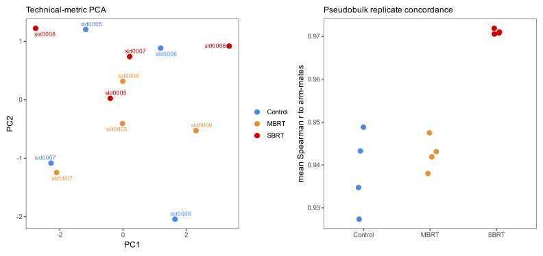

**** Provider concordance

An independent cross-check that our QC did not diverge from the delivered pass-list, in two views: how many cells each filter kept (our count vs the provider's), and which cells -- recall, the fraction of the provider's specific passed cells (matched by barcode) that survive our filter. Per Mutter_01 condition; Mutter_02 has no provider pass-list. This block renders the figure from [[file:results/processing/yi_concordance.tsv][yi_concordance.tsv]].

Retired 2026-08-13: =scripts/fig_provider_concordance.R= was deleted from the repo and this block no longer tangles; it is kept here for the record.

#+begin_src R :tangle no
#!/usr/bin/env Rscript

# -----------------------------------------------------------------------------
# fig_provider_concordance.R
# Provider concordance (Mutter_01 only): the independent cross-check that our QC did
# not diverge from the delivered pass-list, in two views. (left) HOW MANY -- our QC-kept
# cell count vs the count the provider (Yi Liu) passed, per condition; points above the
# identity line mean we retained more. (right) WHICH CELLS -- recall, the fraction of the
# provider's specific passed cells (by barcode) that survive our filter, so a value near
# 100% means we did not drop cells the provider trusted. Reads the preprocessing table
# (Mutter_02 has no provider pass-list, so it is out of scope here).
# Args (all optional, canonical defaults): <yi_concordance.tsv> <out.png>
# -----------------------------------------------------------------------------

suppressPackageStartupMessages({library(tidyverse); library(patchwork)})
source("/home/jeszyman/repos/science/R/figure_schema.R")

a   <- commandArgs(trailingOnly = TRUE)
inp <- if (length(a) >= 1) a[1] else "results/processing/yi_concordance.tsv"
out <- if (length(a) >= 2) sub("\\.png$", "", a[2]) else "results/processing/plots/provider_concordance"

d <- read_tsv(inp, show_col_types = FALSE) %>%
  mutate(recall_pct = 100 * overlap / yi_pass,           # fraction of provider-passed cells (by barcode) we retain
         model      = ifelse(str_detect(condition, "Tongue"), "tongue", "flank"),
         condition  = fct_reorder(condition, recall_pct))

lim <- c(0, max(d$our_kept, d$yi_pass) * 1.05)
recall_min <- min(d$recall_pct); recall_max <- max(d$recall_pct)
extra_min  <- min(d$pct_of_yi);  extra_max  <- max(d$pct_of_yi)

model_cols <- c(flank = "#3c78d8", tongue = "#9c27b0")

# left: how many -- counts, ours vs provider
p1 <- ggplot(d, aes(yi_pass, our_kept, color = model)) +
  geom_abline(slope = 1, intercept = 0, linetype = "dashed", color = "grey40") +
  geom_point(size = 3) +
  ggrepel::geom_text_repel(aes(label = condition), size = 2.8, show.legend = FALSE, max.overlaps = 20) +
  scale_x_continuous(limits = lim, labels = scales::label_number(scale = 1e-3, suffix = "k")) +
  scale_y_continuous(limits = lim, labels = scales::label_number(scale = 1e-3, suffix = "k")) +
  scale_color_manual(values = model_cols, name = NULL) +
  coord_equal() +
  labs(x = "Provider-passed cells (Yi)", y = "Our QC-kept cells", subtitle = "How many: cell counts") +
  theme_scifig(base_size = 12) +
  theme(legend.position = c(0.82, 0.14), legend.key.size = unit(0.4, "cm"),
        axis.title.x = element_text(margin = margin(t = 8)),
        axis.title.y = element_text(margin = margin(r = 8)))

# right: which cells -- recall of the provider's specific barcodes, zoomed near ceiling
p2 <- ggplot(d, aes(recall_pct, condition, color = model)) +
  geom_vline(xintercept = 100, linetype = "dashed", color = "grey40") +
  geom_segment(aes(x = floor(recall_min * 2) / 2, xend = recall_pct,
                   y = condition, yend = condition), color = "grey75") +
  geom_point(size = 3) +
  scale_x_continuous(limits = c(floor(recall_min * 2) / 2, 100.1),
                     breaks = scales::pretty_breaks(4)) +
  scale_color_manual(values = model_cols, guide = "none") +
  labs(x = "Recall of provider-passed cells (%)", y = NULL,
       subtitle = "Which cells: identity overlap") +
  theme_scifig(base_size = 12) +
  theme(axis.title.x = element_text(margin = margin(t = 8)))

legend_text <- str_c(
  "Independent cross-check that QC did not diverge from the delivered pass-list, per Mutter_01 condition. ",
  "Left, how many cells each filter kept -- our count against the provider's (Yi Liu); the dashed line is ",
  "exact agreement, and every condition sits above it because our gate keeps ",
  sprintf("%.0f-%.0f%%", extra_min, extra_max), " as many cells (a looser area filter). Right, which cells ",
  "-- recall, the fraction of the provider's specific passed cells (matched by barcode) that survive our ",
  "filter; all conditions retain ", sprintf("%.1f-%.1f%%", recall_min, recall_max),
  ", so we add cells but drop almost none the provider trusted. Mutter_02 has no provider pass-list and is out of scope.")

p <- (p1 | p2) +
  plot_layout(widths = c(1, 0.9)) +
  plot_annotation(caption = str_wrap(legend_text, width = round(11 * 13)),
                  theme = theme(plot.caption = element_text(size = 10, hjust = 0, color = "gray30",
                                                            lineheight = 1.3, margin = margin(t = 16)),
                                plot.caption.position = "plot"))

save_plot(p, out, w = 11, h = 5.8)

#+end_src

#+ATTR_ORG: :width 600
[[file:results/processing/plots/provider_concordance.svg]]
**** Cell-type neighborhood purity

A coherence check on the locked cross-dataset typing, following the standardized neighborhood-purity metric of [cite:@plummer2025spatial] (Fig 4d). For each cell, purity is the fraction of its 30 nearest neighbors in the tier-1 scVI integrated latent that carry its own final =cell_subtype=; the per-subtype distribution measures whether like-typed cells sit together in the integrated space, complementing the marker-recall gate. The compute step ([[file:workflows/aggregate_differential.smk][aggregate_differential.smk]] rule =agg_celltype_purity=, script [[file:scripts/aggregate/celltype_neighborhood_purity.py][celltype_neighborhood_purity.py]]) reuses the existing latent from the typing run and recomputes the kNN graph on CPU, so it neither retypes cells nor retrains scVI; it ends at per-subtype box quantiles and this block renders the figure. Coarse-compartment purity is near-ceiling by construction (the latent defined those clusters), so the informative signal is at the subtype level, where purity tracks positively with subtype abundance (Spearman rho = 0.82 over per-subtype medians): the lowest-purity subtypes (neutrophil, dendritic-cell, mast, plasma) are the rarest, several of them marker-rescued because they do not separate cleanly, and they form the loosest neighborhoods. The association is not a rule, with smooth muscle and NK cells sitting purer than more abundant subtypes, so the second panel plots purity against cell count directly rather than asserting a mechanism. Neighborhood size is not load-bearing, with per-subtype medians rank-correlating rho = 0.99 between k = 15 and k = 30.

#+begin_src R :tangle scripts/fig_qc_neighborhood_purity.R
#!/usr/bin/env Rscript

# -----------------------------------------------------------------------------
# fig_qc_neighborhood_purity.R
# Transcriptional neighborhood purity by final cell subtype (Plummer et al., Nat
# Biotechnol 2025, Fig 4d): a typing-QC view of whether the locked cross-dataset
# labels are transcriptionally coherent. Per subtype, the distribution of per-cell
# purity (fraction of k=30 scVI-latent neighbors sharing the label), one box per
# subtype, faceted by compartment, ordered by median. Reads the per-subtype box
# quantiles from celltype_neighborhood_purity.py.
# Panel A: per-subtype purity distribution. Panel B: median purity vs subtype abundance,
# showing purity tracks positively with cell count (rarer subtypes form looser neighborhoods),
# a trend with clear exceptions (SmoothMuscle, NK) so it reads as association, not a rule.
# Args (all optional, canonical defaults): <celltype_neighborhood_purity.tsv> <out.png>
# -----------------------------------------------------------------------------

suppressPackageStartupMessages({library(tidyverse); library(patchwork)})
source("/home/jeszyman/repos/science/R/figure_schema.R")

a   <- commandArgs(trailingOnly = TRUE)
inp <- if (length(a) >= 1) a[1] else "results/aggregate/celltype_neighborhood_purity.tsv"
out <- if (length(a) >= 2) sub("\\.png$", "", a[2]) else "results/aggregate/plots/qc_neighborhood_purity"

# facet_grid(space = "free_x") shows only each compartment's own subtypes per panel, so a single
# factor ordered by (compartment, descending median) renders correctly ordered within every facet
# without a tidytext reorder_within dependency.
d <- read_tsv(inp, show_col_types = FALSE) %>%
  mutate(compartment = factor(compartment, levels = c("tumor", "stroma", "immune"))) %>%
  arrange(compartment, desc(middle)) %>%
  mutate(cell_subtype = fct_inorder(cell_subtype))

comp_cols <- c(tumor = "#cc0000", stroma = "#4a86e8", immune = "#e69138")

pA <- ggplot(d, aes(cell_subtype, middle, fill = compartment)) +
  geom_boxplot(aes(ymin = ymin, lower = lower, middle = middle, upper = upper, ymax = ymax),
               stat = "identity", width = 0.7, linewidth = 0.3, alpha = 0.9,
               outlier.shape = NA) +
  facet_grid(~ compartment, scales = "free_x", space = "free_x") +
  scale_y_continuous(limits = c(0, 1), breaks = seq(0, 1, 0.25)) +
  scale_fill_manual(values = comp_cols, guide = "none") +
  labs(x = NULL, y = "neighborhood purity (k = 30)", tag = "A") +
  theme_scifig(base_size = 12) +
  theme(axis.text.x = element_text(angle = 45, hjust = 1),
        strip.text = element_text(face = "bold"))

pB <- ggplot(d, aes(n, middle, color = compartment)) +
  geom_point(size = 2.6, alpha = 0.9) +
  ggrepel::geom_text_repel(aes(label = cell_subtype), size = 3, show.legend = FALSE,
                           max.overlaps = 20, seed = 1) +
  scale_x_log10() +
  scale_y_continuous(limits = c(0, 1), breaks = seq(0, 1, 0.25)) +
  scale_color_manual(values = comp_cols, name = NULL) +
  labs(x = "cells assigned (log scale)", y = "median neighborhood purity", tag = "B") +
  theme_scifig(base_size = 12)

p <- (pA | pB) +
  plot_layout(widths = c(1.5, 1))

save_plot(p, out, w = 13, h = 6)
#+end_src

#+ATTR_ORG: :width 700
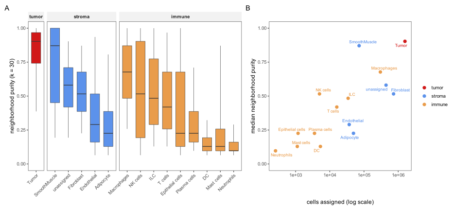

*** Post-IR dynamics
**** Peak and valley signature kinetics

Peak/valley signature kinetics rebuilt on the canonical merged-scale labels (coarse compartment + tier-2 subtypes at [[file:results/aggregate/full_labels.parquet]]), replacing the retired Yi ImmGen buckets. For each cell class with at least 30 peak and 30 valley cells at MBRT 4h (the H2AX-ground-truthed FOVs), a 10-gene peak-up and 10-gene valley-up signature is derived by Wilcoxon peak-vs-valley differential expression, scored as mean LogNormalize expression across all flank cells, and standardized to z within the class so panels are magnitude-comparable on a shared y axis. Lines track Control/MBRT/SBRT over 0 Gy to 6 d; the MBRT 4h peak and valley split is overlaid at a 4h guide. Because the signatures are defined at MBRT 4h peak vs valley, the 4h separation is partly by construction: the interpretable signal is the cross-timepoint decay and the SBRT curve, not the 4h gap itself. Descriptive, n=1 per arm; eight classes clear the 30-cell-per-side floor (tumor; the fibroblast, endothelial, smooth-muscle, and adipocyte stroma; and the macrophage, DC, and ILC immune subsets); the sparser immune lineages (T, NK, plasma, mast, neutrophil; B absent) fall below it and drop out.
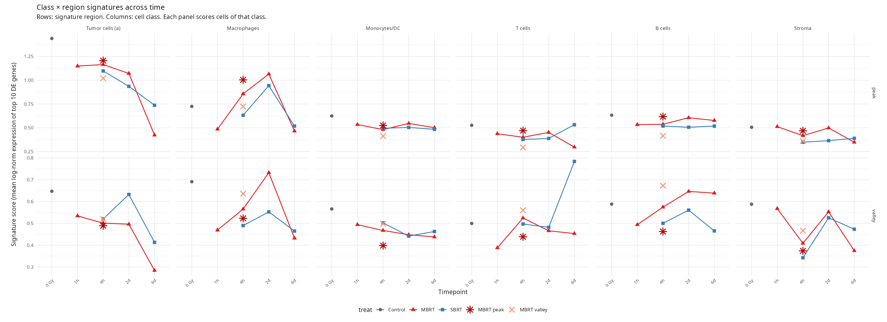

#+name: class-region-signatures
#+begin_src R :tangle dev/if_channel_check/class_region_signatures.R
#!/usr/bin/env Rscript
# Class x region peak/valley signature kinetics (Mutter_01, descriptive n=1).
# Rewired onto the canonical merged-scale labels (results/aggregate/full_labels.parquet):
# coarse compartment + tier-2 subtypes, replacing the retired Yi ImmGen buckets. For each
# canonical cell class a 10-gene peak-up and 10-gene valley-up signature is derived from the
# MBRT 4h peak-vs-valley contrast (manual H2AX FOVs), scored as mean LogNormalize expression
# across all flank cells, and standardized to z within the class so panels are comparable.
# Curves track Control/MBRT/SBRT over 0 Gy->6d; the MBRT 4h peak/valley split is overlaid at 4h.
# Signatures are defined at MBRT 4h, so the 4h peak>valley gap is partly by construction; the
# informative signal is the cross-timepoint decay and the SBRT curve.
# Args (all optional, canonical defaults): <labels> <samplesheet> <normdir> <outdir>
suppressPackageStartupMessages({
  library(arrow); library(data.table); library(Seurat); library(Matrix); library(ggplot2)
})

## ---- args / canonical defaults ----
a       <- commandArgs(trailingOnly = TRUE)
LABELS  <- if (length(a) >= 1) a[1] else "results/aggregate/full_labels.parquet"
SS      <- if (length(a) >= 2) a[2] else "results/data_model/samples.tsv"
NORMDIR <- if (length(a) >= 3) a[3] else "/mnt/data/projects/spatial-rads/processing/norm"
OUT     <- if (length(a) >= 4) a[4] else "dev/if_channel_check"

MBRT4H_SAMPLE <- "sam0003"   # MBRT_4h flank sample (the H2AX-labelled block)
MIN_SIDE      <- 30          # min cells per peak/valley side to derive a class signature
peak_fovs   <- c(224, 209, 201, 186, 172, 225, 229, 215, 175, 176, 206, 181, 168, 167)
valley_fovs <- c(199, 213, 227, 188, 204, 218, 178, 165, 170, 231, 189, 173, 154)

## ---- labels: parse sample + fov + per-sample barcode from the canonical cell id ----
## canonical cell = <sample_id>_<slide>_<fov>_<cellidx>; norm.rds colname drops the sample prefix.
lab <- as.data.table(read_parquet(LABELS))[dataset == "Mutter_01"]
lab[, sample_id := sub("_.*$", "", cell)]
lab[, barcode   := sub("^sam[0-9]+_", "", cell)]
lab[, fov       := as.integer(sub("^.*_([0-9]+)_[0-9]+$", "\\1", cell))]

ss <- fread(SS)
lab <- merge(lab, ss[, .(sample_id, condition, treatment, timepoint_h, model)],
             by = "sample_id", all.x = TRUE)
lab <- lab[model == "flank" & cell_subtype != "stroma_unresolved" & !is.na(cell_subtype)]

## ---- peak/valley labels at MBRT 4h ----
lab[, pv := NA_character_]
lab[sample_id == MBRT4H_SAMPLE & fov %in% peak_fovs,   pv := "peak"]
lab[sample_id == MBRT4H_SAMPLE & fov %in% valley_fovs, pv := "valley"]

## classes with enough cells on both sides to support a peak/valley signature
pv_wide <- dcast(lab[!is.na(pv), .N, by = .(cell_subtype, pv)],
                 cell_subtype ~ pv, value.var = "N", fill = 0)
classes <- pv_wide[peak >= MIN_SIDE & valley >= MIN_SIDE, cell_subtype]
cat("Classes passing peak/valley power floor:\n"); print(classes)

## ---- derive signatures from the MBRT 4h norm object ----
obj4 <- readRDS(file.path(NORMDIR, paste0(MBRT4H_SAMPLE, ".norm.rds")))
m4   <- lab[sample_id == MBRT4H_SAMPLE & !is.na(pv)]; setkey(m4, barcode)
keep <- intersect(colnames(obj4), m4$barcode)
obj4 <- subset(obj4, cells = keep)
md4  <- m4[colnames(obj4)]
obj4$cell_class <- md4$cell_subtype
obj4$pv         <- md4$pv

signatures <- list()
for (cls in classes) {
  sub <- subset(obj4, subset = cell_class == cls)
  if (min(table(factor(sub$pv, c("peak", "valley")))) < MIN_SIDE) next
  Idents(sub) <- "pv"
  mk <- FindMarkers(sub, ident.1 = "peak", ident.2 = "valley", test.use = "wilcox",
                    logfc.threshold = 0.1, min.pct = 0.05, verbose = FALSE)
  mk <- as.data.table(mk, keep.rownames = "gene")
  pk <- head(mk[avg_log2FC >  0.1][order(-avg_log2FC)], 10)$gene
  vl <- head(mk[avg_log2FC < -0.1][order( avg_log2FC)], 10)$gene
  if (length(pk)) signatures[[paste(cls, "peak",   sep = "__")]] <- pk
  if (length(vl)) signatures[[paste(cls, "valley", sep = "__")]] <- vl
}
cat("Signature sizes (genes):\n"); print(sapply(signatures, length))

## ---- score every flank cell with its class signature (mean LogNormalize expression) ----
all_sig_genes <- unique(unlist(signatures))
score_rows <- list()
for (s in sort(unique(lab$sample_id))) {
  o  <- readRDS(file.path(NORMDIR, paste0(s, ".norm.rds")))
  d  <- GetAssayData(o, layer = "data")
  d  <- d[intersect(all_sig_genes, rownames(d)), , drop = FALSE]
  ls <- lab[sample_id == s]; setkey(ls, barcode)
  cc <- intersect(colnames(d), ls$barcode)
  d  <- d[, cc, drop = FALSE]; ls <- ls[cc]
  for (sig in names(signatures)) {
    cls <- sub("__.*", "", sig); reg <- sub(".*__", "", sig)
    sg  <- intersect(signatures[[sig]], rownames(d))
    idx <- which(ls$cell_subtype == cls)
    if (!length(sg) || !length(idx)) next
    score_rows[[paste(s, sig)]] <- data.table(
      cell_class = cls, region = reg,
      score = as.numeric(Matrix::colMeans(d[sg, idx, drop = FALSE])),
      condition = ls$condition[idx], treatment = ls$treatment[idx],
      timepoint_h = ls$timepoint_h[idx], pv = ls$pv[idx])
  }
  rm(o, d); invisible(gc())
}
long <- rbindlist(score_rows)

## z within each class x region signature -> panels comparable on a shared y axis
long[, z := (score - mean(score, na.rm = TRUE)) / sd(score, na.rm = TRUE),
     by = .(cell_class, region)]
tp_map <- c("0" = "0 Gy", "1" = "1h", "4" = "4h", "48" = "2d", "144" = "6d")
long[, tp := factor(tp_map[as.character(timepoint_h)],
                    levels = c("0 Gy", "1h", "4h", "2d", "6d"))]
long[, treat := fifelse(is.na(treatment) | treatment == "NT", "Control", treatment)]

## ---- summarize: arm means + MBRT 4h peak/valley overlay ----
summ <- long[, .(mean_z = mean(z, na.rm = TRUE), n = .N),
             by = .(cell_class, region, treat, tp)]
pvov <- long[treat == "MBRT" & !is.na(pv),
             .(mean_z = mean(z, na.rm = TRUE), n = .N), by = .(cell_class, region, pv)]
pvov[, treat := paste("MBRT", pv)][, tp := factor("4h", levels = levels(summ$tp))][, pv := NULL]
summ <- rbind(summ, pvov, fill = TRUE)

## ---- plot ----
class_order <- intersect(c("Tumor", "Fibroblast", "Endothelial", "SmoothMuscle", "Adipocyte",
                           "Macrophages", "DC", "T cells", "NK cells", "ILC", "Plasma cells",
                           "Mast cells", "Neutrophils"), unique(summ$cell_class))
summ[, cell_class := factor(cell_class, levels = class_order)]
summ[, region := factor(region, levels = c("peak", "valley"),
                        labels = c("peak signature", "valley signature"))]
treat_levels <- c("Control", "MBRT", "SBRT", "MBRT peak", "MBRT valley")
summ[, treat := factor(treat, levels = treat_levels)]
line_s <- summ[treat %in% c("Control", "MBRT", "SBRT")]
pt_s   <- summ[treat %in% c("MBRT peak", "MBRT valley")]
cols <- c(Control = "gray40", MBRT = "#e41a1c", SBRT = "#377eb8",
          "MBRT peak" = "#b30000", "MBRT valley" = "#fc9272")
shps <- c(Control = 16, MBRT = 17, SBRT = 15, "MBRT peak" = 8, "MBRT valley" = 4)
x4 <- which(levels(summ$tp) == "4h")

p <- ggplot() +
  geom_vline(xintercept = x4, color = "grey80", linewidth = 0.4, linetype = "dotted") +
  geom_line(data = line_s, aes(tp, mean_z, color = treat, group = treat), linewidth = 0.7) +
  geom_point(data = line_s, aes(tp, mean_z, color = treat, shape = treat), size = 2.4) +
  geom_point(data = pt_s, aes(tp, mean_z, color = treat, shape = treat),
             size = 3.4, stroke = 1.2) +
  facet_grid(region ~ cell_class) +
  scale_color_manual(values = cols) + scale_shape_manual(values = shps) +
  labs(x = "Timepoint",
       y = "Signature score (z of mean LogNormalize expression, within class)",
       color = NULL, shape = NULL,
       title = "Peak/valley signature kinetics by canonical cell class (Mutter_01)",
       subtitle = paste("Rows: signature region. Columns: cell class.",
                        "Signatures derived from MBRT 4h peak vs valley (dotted guide).")) +
  theme_minimal(base_size = 11) +
  theme(legend.position = "bottom",
        axis.text.x = element_text(angle = 45, hjust = 1, vjust = 1, size = 8),
        panel.spacing.x = unit(0.7, "lines"))

ggsave(file.path(OUT, "class_region_signatures_kinetics.png"), p,
       width = max(8, 3 * length(class_order)), height = 6.5, dpi = 140)

## ---- provenance ----
fwrite(summ, file.path(OUT, "class_region_signature_scores.tsv"), sep = "\t")
fwrite(rbindlist(lapply(names(signatures), function(s)
         data.table(signature = s, cell_class = sub("__.*", "", s),
                    region = sub(".*__", "", s), gene = signatures[[s]]))),
       file.path(OUT, "class_region_signature_members.tsv"), sep = "\t")
cat("Saved class_region_signatures_kinetics.png + score/member TSVs\n")
#+end_src

**** Peak/valley shows no signature at 4h: not expression, not composition

At 4h, the one timepoint with H2AX ground truth, there is no peak-versus-valley transcriptional signature at any scale we can test, and no cell-type composition shift between the zones. This is the strongest case in the project (the only block with dose-zone ground truth), and it is null.

Expression: cells were pooled to paired FOV-by-zone pseudobulk on the current QC'd sam0003 counts with merged-scale atlas labels, and tested with =~ FOV + zone= (limma-voom, core bands: perpendicular distance to beam centerline below 0.10 mm for peak, above 0.40 mm for valley). Zero genes clear FDR whether the cells are pooled across all compartments (39 paired FOVs, 936 genes), restricted to tumor (23 FOVs, 881 genes), or restricted to stroma (31 FOVs, 895 genes); every one of these p-value histograms is flat, the shape a genuinely null contrast produces. The immune panel is right-skewed rather than flat (8 FOVs, 157 genes): underpowered, so inconclusive, not a clean null. The same machinery run on tumor-versus-stroma (the positive control) returns 586/940 genes at FDR<0.05 with a hard spike at p near 0, confirming the pipeline detects real spatial biology emphatically when it is present.

The earlier per-cell FindMarkers signatures (a myeloid list led by Ccl8, Cd163, Mrc1, C1qa) were pseudoreplication artifacts: roughly 150,000 cells scored as independent replicates when the block is n=1, which manufactures significance from near-zero effects. Those genes do not reproduce under honest FOV-level replication; they are flat and even slightly valley-leaning in the all-cells contrast (Ccl8 log2FC -0.03, Cd163 -0.04, Mrc1 -0.03, all p>0.7), so the pseudoreplicated ranking was spurious in both significance and direction, not merely over-significant.

Composition: the myeloid list could have reflected more macrophages in peak stripes rather than per-cell regulation, but there is no such shift. Paired per-FOV compartment fractions are indistinguishable between zones (tumor peak 0.34 vs valley 0.34, paired p=0.88; stroma 0.55 vs 0.54, p=0.27; immune 0.10 vs 0.12, p=0.35, if anything lower in peak). So peak/valley carries neither an expression nor a composition signal at 4h.

This does not settle the within-block rotation-null result, which tests a different null (a small consistent per-gene shift against an architecture-rotated background, on tumor cells) and remains contested (see the Peak/valley idea-node in the Project Map).

#+begin_src R :tangle scripts/fig_pv_phist.R
#!/usr/bin/env Rscript
# -----------------------------------------------------------------------------
# fig_pv_phist.R
# Peak/valley group-mean DE is null (flat p-histogram) in every compartment AND
# all-cells, while the same FOV-pseudobulk machinery detects tumor-vs-stroma
# emphatically (spike at 0). M01 4h block (sam0003), current QC'd + atlas labels.
# -----------------------------------------------------------------------------
suppressPackageStartupMessages({library(Seurat);library(arrow);library(edgeR)
  library(limma);library(dplyr);library(readr);library(Matrix);library(ggplot2)})
source("/home/jeszyman/repos/science/R/figure_schema.R")
DDR <- c("Cdkn1a","Gadd45a","Gadd45b","Mdm2","Bax","Pmaip1","Bbc3","Ddit3","Atm","Atr","Chek1","Chek2","Rad51","Brca1","Brca2","Xrcc5","Xrcc6","Parp1")

o <- readRDS("/mnt/data/projects/spatial-rads/processing/norm/sam0003.norm.rds")
cts <- GetAssayData(o,assay="RNA",layer="counts"); md <- o@meta.data; md$cell <- rownames(md)
a <- read_parquet("results/aggregate/full_labels.parquet")
a <- a[grepl("^sam0003_",a$cell),c("cell","compartment")]; a$cell<-sub("^sam0003_","",a$cell)
z <- read_tsv("dev/peak_valley_analysis/data/mbrt4h_peak_valley.tsv",show_col_types=FALSE)[,c("cell_id","dist_to_peak")]
md <- md %>% left_join(a,by="cell") %>% left_join(z,by=c("cell"="cell_id"))
md <- md[!is.na(md$compartment),]

## generic paired FOV-pseudobulk voom DE; returns p-values + n sig
pv_de <- function(sub, split_col, lvls, floor=30) {
  sub$grp <- paste0("f",sub$fov,"_",sub[[split_col]])
  ag <- t(fac2sparse(sub$grp) %*% t(cts[,sub$cell]))
  g <- data.frame(grp=colnames(ag)); g$fov<-sub("_.*","",g$grp); g$k<-sub(".*_","",g$grp)
  nc<-table(sub$grp); g$ncell<-as.integer(nc[g$grp]); g<-g[g$ncell>=floor,]
  both<-names(which(tapply(g$k,g$fov,function(x)length(unique(x)))==2)); g<-g[g$fov%in%both,]
  ag<-ag[,g$grp]; g$fov<-factor(g$fov); g$k<-factor(g$k,levels=lvls)
  y<-DGEList(ag); des<-model.matrix(~fov+k,g); kg<-filterByExpr(y,des); y<-y[kg,,keep.lib.sizes=FALSE]
  y<-calcNormFactors(y); v<-voom(y,des); fit<-eBayes(lmFit(v,des))
  tt<-topTable(fit,coef=paste0("k",lvls[2]),number=Inf,sort.by="none"); tt<-tt[!rownames(tt)%in%DDR,]
  list(p=tt$P.Value, nsig=sum(tt$adj.P.Val<0.05), nfov=length(both), ngene=nrow(tt))
}

## peak/valley all-cells + per compartment (core bands)
md$zone <- ifelse(md$dist_to_peak<0.10,"peak",ifelse(md$dist_to_peak>0.40,"valley",NA))
res <- list()
res[["Peak vs valley: all cells"]] <- pv_de(md[!is.na(md$zone),],"zone",c("valley","peak"))
for(cp in c("tumor","stroma","immune")){
  s <- md[md$compartment==cp & !is.na(md$zone),]
  res[[paste0("Peak vs valley: ",cp)]] <- pv_de(s,"zone",c("valley","peak"))
}
## positive control: tumor vs stroma (same machinery)
s2 <- md[md$compartment %in% c("tumor","stroma"),]
res[["Positive control: tumor vs stroma"]] <- pv_de(s2,"compartment",c("stroma","tumor"))

df <- do.call(rbind, lapply(names(res), function(nm){
  r<-res[[nm]]
  lab <- sprintf("%s\n(%d FOVs, %d genes; %d at FDR<0.05)", nm, r$nfov, r$ngene, r$nsig)
  data.frame(panel=lab, p=r$p, pos=grepl("Positive",nm))
}))
ord <- unique(df$panel); ord <- c(ord[!grepl("Positive",ord)], ord[grepl("Positive",ord)])
df$panel <- factor(df$panel, levels=ord)

p <- ggplot(df, aes(x=p, fill=pos)) +
  geom_histogram(breaks=seq(0,1,0.05), color="grey30", linewidth=0.2) +
  geom_hline(yintercept=0, linewidth=0.3) +
  facet_wrap(~panel, scales="free_y", ncol=3) +
  scale_fill_manual(values=c("FALSE"="grey65","TRUE"="#0072B2"), guide="none") +
  labs(x="p-value", y="genes",
       title="Peak/valley DE is null in every compartment and all-cells; same machinery detects tumor vs stroma") +
  theme_scifig() +
  theme(strip.text=element_text(size=10), plot.title=element_text(size=12))

save_plot(p, "results/aggregate/plots/pv_phist_null", w=13, h=7)
#+end_src

#+ATTR_ORG: :width 800
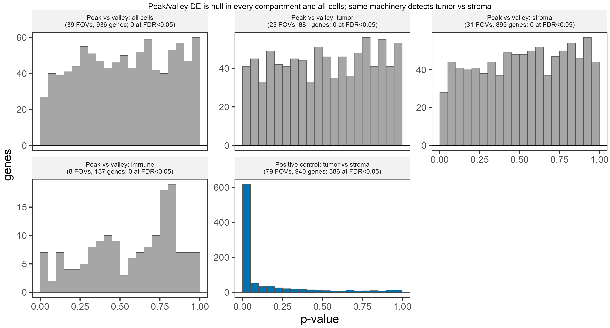

The myeloid genes that led the discarded per-cell signature (Ccl8, Cd163, Mrc1) could in principle mark more macrophages in peak stripes rather than per-cell regulation, but there is no such composition shift: paired per-FOV compartment fractions are indistinguishable between the zones in all three compartments.

#+begin_src R :tangle scripts/fig_pv_composition.R
#!/usr/bin/env Rscript
# -----------------------------------------------------------------------------
# fig_pv_composition.R
# No cell-type composition shift between beam peak and valley zones at 4h.
# Paired per-FOV compartment fractions (core bands), peak vs valley, 39 FOVs.
# M01 4h block (sam0003), current QC'd counts + merged-scale atlas labels.
# -----------------------------------------------------------------------------
suppressPackageStartupMessages({library(Seurat);library(arrow);library(dplyr)
  library(readr);library(tidyr);library(ggplot2)})
source("/home/jeszyman/repos/science/R/figure_schema.R")

o <- readRDS("/mnt/data/projects/spatial-rads/processing/norm/sam0003.norm.rds")
md <- o@meta.data; md$cell <- rownames(md)
a <- read_parquet("results/aggregate/full_labels.parquet")
a <- a[grepl("^sam0003_",a$cell),c("cell","compartment")]; a$cell<-sub("^sam0003_","",a$cell)
z <- read_tsv("dev/peak_valley_analysis/data/mbrt4h_peak_valley.tsv",show_col_types=FALSE)[,c("cell_id","dist_to_peak")]
md <- md %>% left_join(a,by="cell") %>% left_join(z,by=c("cell"="cell_id"))
md <- md[!is.na(md$dist_to_peak) & !is.na(md$compartment),]
md$zone <- ifelse(md$dist_to_peak<0.10,"peak",ifelse(md$dist_to_peak>0.40,"valley",NA))
md <- md[!is.na(md$zone),]
keepf <- md %>% count(fov,zone) %>% filter(n>=30) %>% count(fov) %>% filter(n==2) %>% pull(fov)
md <- md[md$fov %in% keepf,]

comp <- md %>% count(fov,zone,compartment) %>% group_by(fov,zone) %>%
  mutate(frac=n/sum(n)) %>% ungroup()
comp$compartment <- factor(comp$compartment, levels=c("tumor","stroma","immune"))
comp$zone <- factor(comp$zone, levels=c("valley","peak"))

## paired t on logit for annotation
lg <- function(p) log((p+.005)/(1-p+.005))
ann <- comp %>% select(fov,zone,compartment,frac) %>%
  pivot_wider(names_from=zone,values_from=frac,values_fill=0) %>%
  group_by(compartment) %>%
  summarise(p=t.test(lg(peak),lg(valley),paired=TRUE)$p.value,
            ymax=max(c(peak,valley)), .groups="drop") %>%
  mutate(lab=sprintf("paired p=%.2f", p))

p <- ggplot(comp, aes(x=zone, y=frac, fill=zone)) +
  geom_line(aes(group=fov), color="grey75", linewidth=0.3, alpha=0.6) +
  geom_point(aes(group=fov), color="grey55", size=0.7, alpha=0.6) +
  geom_boxplot(width=0.5, alpha=0.55, outlier.shape=NA) +
  facet_wrap(~compartment, scales="free_y") +
  geom_text(data=ann, aes(x=1.5, y=ymax*1.05, label=lab), inherit.aes=FALSE, size=4) +
  scale_fill_manual(values=c("valley"="#85C1E9","peak"="#E74C3C"), guide="none") +
  labs(x=NULL, y="fraction of cells in FOV",
       title="No peak/valley cell-type composition shift at 4h (39 paired FOVs)") +
  theme_scifig() + theme(plot.title=element_text(size=12))

save_plot(p, "results/aggregate/plots/pv_composition", w=10, h=4.8)
#+end_src

#+ATTR_ORG: :width 700
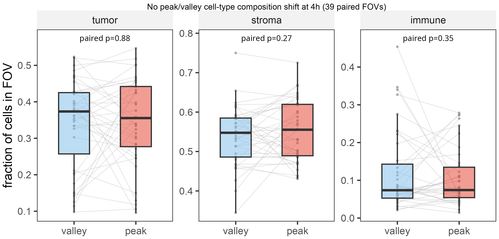

*** Cross-dataset aggregate: MBRT vs SBRT vs Control differential analysis
:PROPERTIES:
:header-args:snakemake: :tangle workflows/aggregate_differential.smk
:END:

We merged the 20 flank samples (Mutter_01 n=1 timecourse, Mutter_02 n=4 per arm at day 2) into a single 3,277,090-cell object and re-typed every cell at merged scale: tier-1 scVI integration with Leiden clustering at resolution 3.0 for the coarse tumor/stroma/immune compartments, then tier-2 SingleR against ImmGen for immune subtypes and UCell against curated stromal markers, each followed by a marker-rescue step. The MBRT-vs-SBRT-vs-Control differential layer then ran on the unified per-cell labels ([[file:results/aggregate/full_labels.parquet]]). Three pre-registered confirmatory hypotheses (H1 immune activation, H2 vascular and oxygenation, H3 stromal sparing) were tested by cell-type composition, pseudobulk DESeq2 differential expression, and UCell program scores across three contrasts (MBRT vs Control, SBRT vs Control, MBRT vs SBRT). Inference rested on effect size with 95% confidence intervals and the n=4 minimum detectable effect under tiered FDR, with the confirmatory family BH-pooled to padj_confirmatory and exploratory readouts keeping their own BH; volcano plots were omitted as uninterpretable on the sparse ~950-gene CosMx panel.

The dominant day-2 signal was SBRT-driven stromal fibrosis. Myofibroblast-activation genes (multiple collagens and Acta2) rose under SBRT versus Control across the fibroblast, adipocyte, and smooth-muscle compartments (padj_confirmatory to 2e-11), and H3 contributed 20 of the 27 SBRT-vs-Control confirmatory hits. The modality-direct MBRT-vs-SBRT contrast recovered the same genes in the SBRT-greater-than-MBRT direction (19 of its 20 confirmatory hits were H3). A smaller set of endothelial rows (Pdgfb and Vwf up under SBRT) and interferon-stimulated immune rows (Ifitm1, Mx1) also cleared the confirmatory threshold. MBRT was essentially null at whole-compartment scale: MBRT versus Control produced 2 of 207 confirmatory hits with a median absolute effect of 0, and all 207 of its confirmatory rows fell below their minimum detectable effect.

Across the confirmatory family, 578 of 621 rows (93%) fell below the n=4 minimum detectable effect, so most MBRT non-results were underpowered rather than established nulls. M01-to-M02 day-2 effect-size concordance on the unified labels was weak (top Spearman rho 0.21 for MBRT, near zero to negative for SBRT). These results are consistent with and extend the earlier whole-sample finding that MBRT immune stimulation was not supported, and the SBRT-versus-MBRT difference cannot be cleanly attributed to dose pattern given the unrecorded MBRT mean dose and the averaging of peak and valley in any whole-compartment contrast. The single canonical output table is [[file:results/aggregate/results_master.tsv]], produced by the [[file:workflows/aggregate_differential.smk][aggregate_differential.smk]] workflow (split from the former =aggregate.smk= on 2026-07-12; consumes the =aggregate_typing.smk= labels); design, decisions, and limitations are in [[file:plan-mbrt-vs-sbrt.md][plan-mbrt-vs-sbrt.md]].

**** Per-cell smiDE genome-wide DE (CosMx best-practice alignment)

*RETRACTION NOTICE (2026-08-16).* The results reported in the four paragraphs that run from "The pseudobulk DESeq2 method above" to the "End of retracted text" marker came from a smiDE configuration that omitted two things the method's authors require: a pre-test gene filter on the segmentation-contamination overlap ratio, and a spatial random effect. Vasconcelos et al., Genome Biology 2026 (PMC12882255) benchmark a spatially-blind model's type I error at 0.86 to 0.95, against roughly 0.05 to 0.07 with the spatial term, so the hit counts and adjusted p-values below have an uncontrolled false-positive rate and are not reportable. The configuration was also applied to a between-animal arm contrast, which the method is neither designed nor benchmarked for; its authors recommend per-sample fits combined by meta-analysis for cross-sample comparisons, so sample-level pseudobulk, not smiDE, is the structurally correct estimator for an arm contrast.

The arrangement that replaces it, in three layers. Sample-level pseudobulk is the confirmatory arm-level inference: DESeq2 for day 2, and moderated-t by limma-voom for the 4h cohorts, which realize 2 to 3 residual degrees of freedom, with every cohort slide-blocked. A corrected higher-resolution analysis carrying both fixes, with cells as observations, fitted within slide and combined across slides by fixed-effect inverse-variance meta-analysis (replication: the 2 to 3 slides), is the exploratory layer; it supplies effect sizes and ranking and never an arm-level claim. The intermediate screen mode, which applies the gene filter but no spatial term and fits cells as observations under a sample-level random intercept (replication: nominally samples, 2 to 4 per arm, with the between-sample variance component poorly estimated at that n), is only an ordered candidate list feeding the spatial stage and must never be quoted on its own. The output files from the invalid runs were archived off the results tree on the compute host to =/mnt/data/projects/spatial-rads/archive/invalid_smide_2026-08-16/= (two files) so they cannot be silently consumed by a downstream step.

*Inference unit: the standing wording rule for this layer (2026-08-16).* "Per-cell" is smiDE's shorthand for the /observation/ unit, and it has repeatedly been mistaken for the /replication/ unit. The two are different, and the difference is what the p-values mean, so documentation must state the replication unit rather than the observation count: do not write "per-cell resolution" or "per-cell DE" as though it named the inferential unit. Screen mode fits individual cells as observations with a random intercept on sample, so arm replication is nominally by sample, but at 2 to 4 samples per arm the between-sample variance component is poorly estimated, and when it is estimated near zero the fit slides toward treating cells as replicates; the roughly ten-fold hit excess over sample-level pseudobulk on the same contrast (about 5,300 against about 500) is the measure of how far it slips, since a test genuinely operating at the sample level could not find ten times the hits. Spatial mode fits cells within a single slide with a spatial random effect and no sample random intercept, then combines slides by fixed-effect inverse-variance meta-analysis; a fixed-effect combination does not charge between-slide heterogeneity, so its effective replication is the 2 to 3 slides. Acceptable phrasing names both, for example "cells as observations with sample-level random intercept (replication: samples, 2 to 4 per arm, variance component poorly estimated)" and, for spatial mode, "fitted within slide, combined across slides by fixed-effect meta-analysis (replication: 2 to 3 slides)".

*Adjudication criteria, pre-specified 2026-08-16 before any spatial-fit output existed.* A per-cell gene by cell-type result may be reported only if the gene passes the contamination filter (overlap ratio below 1) in that cell type /and/ reaches significance in the spatial fit; screen-mode-only hits are never reportable at any effect size; and arm-level confirmatory claims remain with sample-level pseudobulk regardless of what the per-cell layer shows. A spatial hit count far below the screen's is to be read as the screen having been anticonservative, not as the spatial fit lacking power.

The retracted text is kept below for the record, with inline retraction markers added and nothing deleted. Do not cite it.

The pseudobulk DESeq2 method above collapses per-cell counts to sample-level pseudobulk before modelling, discarding within-sample heterogeneity and segmentation-error structure. As part of the CosMx best-practice alignment (plan at [[file:docs/plans/2026-08-13-cosmx-bestpractice-alignment.md]]), a genome-wide per-cell negative-binomial GLMM was added via smiDE/nebula ([[file:scripts/aggregate/smide_de.R]]). The model is =~ RankNorm(otherct_expr) + offset(log(totalcounts)) + condition + (1|sample_id)=: the neighbor-expression covariate absorbs segmentation error (the smiDE innovation; NanoString CosMx Analysis Scratch Space), the per-cell total-count offset accounts for capture depth, and the sample-level random effect handles pseudoreplication. smiDE is the *primary* DE method for exploratory analysis; pseudobulk DESeq2 is the conservative cross-check. /Retracted 2026-08-16: this ordering is inverted. Pseudobulk is the confirmatory arm-level estimator and the corrected higher-resolution analysis is the exploratory layer; see the retraction notice at the top of this section. The description of the model is also corrected: "the sample-level random effect handles pseudoreplication" overstates that term. The =(1|sample_id)= intercept makes arm replication nominally by sample (2 to 4 per arm), not by cell, but at that n the variance component is poorly estimated, so the fit operates somewhere between the sample and the cell. This is a screen, not a sample-level test./

/[Retracted 2026-08-16.]/ smiDE produces 37,854 rows (950 genes x 15 cell types x 3 day-2 contrasts). /[OVERCLAIM, flagged 2026-08-16, over and above the retraction: the sentence that follows reads the pseudobulk MBRT null as a power artifact which a cell-level test exposed. Under the corrected inference-unit reading it is not. The screen's replication unit is nominally the sample with a poorly estimated variance component, so the excess hits are the screen's anticonservatism rather than added resolution. Do not revive this claim even if a corrected spatial run reproduces part of it, and do not restate any pseudobulk null as underpowered on the strength of a screen-mode hit count.]/ MBRT is NOT null at per-cell resolution: 1,360 MBRT_vs_Ctrl hits at padj < 0.05 versus near-zero in pseudobulk, and 2,136 SBRT_vs_Ctrl hits. Three coherent MBRT day-2 programs emerge: (a) SASP/senescence --- 11 of 17 canonical SASP genes significant in MBRT_vs_Ctrl (Il1b, Il1a, Il6, Cxcl1, Cxcl2, Ccl2, Ccl20, Csf2, Vegfa, Timp1, Igfbp7), each across multiple cell types; (b) early fibrosis --- collagen genes (Col1a1, Col1a2, Col5a2, Col6a3) up in 5--6 cell types, weaker than SBRT; (c) immunosuppressive shift --- Arg1 UP in 6 cell types, Tigit UP in 6, Hif1a UP in 5, with concurrent MHC-II loss (H2-Aa DOWN in 6 cell types) and interferon suppression (Ifi27 DOWN in 6). This is the opposite of the old immunostimulation hypothesis.

/[Retracted 2026-08-16. The current p21 reading, from slide-blocked moderated-t pseudobulk at 4h: Cdkn1a is MBRT > SBRT in five cell types (Adipocyte padj 2.3e-04, ILC 0.0029, Fibroblast 0.0032, T cells 0.017, Macrophages 0.030), but only Macrophages passes the segmentation-contamination filter at an overlap ratio of 0.57; Fibroblast 1.02, ILC 1.03, Adipocyte 1.04 and T cells 1.44 all fail, meaning the gene's expression in neighbouring cells matches or exceeds its own, and Tumor is 2.04. The defensible claim is p21 higher in MBRT than SBRT, attributable specifically to macrophages, exploratory tier.]/ Cdkn1a (p21) is resolved: MBRT_vs_SBRT significant in 6 cell types (Macrophages padj 2e-30), but MBRT_vs_Ctrl only in Tumor (padj 3e-11) and stroma_unresolved (0.015). The strong signal is SBRT driving p21 DOWN more than MBRT driving it UP, consistent with proliferative regrowth of p53-mutant 4T1 survivors under SBRT.

/[Retracted 2026-08-16.]/ Pseudobulk-vs-smiDE concordance: Spearman rho ~0.57, sign agreement ~79%, 299 shared hits, 201 pseudobulk-only, 4,999 smiDE-only. Contamination caveat: smiDE-only hits have higher overlap ratios (median 1.28 vs 0.88 for shared hits), so some smiDE-only signal may reflect segmentation bleed rather than biology. The overlap-ratio QC ([[file:scripts/aggregate/overlap_ratio_qc.R]]) joins a per-gene x cell_subtype contamination ratio onto the master table. Of 2,328 confirmatory rows, 391 (17%) pass smiDE. Master table now 88,945 rows with smiDE integrated as =readout_class="smiDE"=.

/End of retracted text (2026-08-16). The paragraph below describes the corrected protocol and stands./

smiDE runs in two modes per cohort. Both take individual cells as the /observation/ unit; they differ in the /replication/ unit, which is what their p-values are about. The screen mode is the nebula negative-binomial GLMM above, with the overlap-ratio gene filter applied and no spatial term, fitting cells as observations with a random intercept on sample: replication is nominally by sample (2 to 4 per arm), but the between-sample variance component is poorly estimated at that n, so the mode is candidate generation for the spatial stage and is never quoted on its own. The spatial mode fits a Gaussian process per spatial unit (GP_INLA), with a spatial random effect and no sample random intercept, and combines the per-unit estimates by fixed-effect inverse-variance meta-analysis, the smiDE authors' correction for the type I error inflation a single pooled fit produces; because a fixed-effect combination does not charge between-unit heterogeneity, its effective replication is the 2 to 3 slides that supply the units. Both modes prefilter genes per cell type on the overlap ratio. Screen runs for every registered cohort; spatial runs only for =mutter02_day2=, =combined_4h_treated=, and =combined_4h=, because a spatial fit needs both contrast levels inside one slide and the pooled-control cohorts lose their borrowed Control slides under that constraint. A per-cohort expression cache ([[file:scripts/aggregate/build_cohort_counts.R]]) supplies the counts: reading the 20-sample merged object inside every fit made memory rather than cores the binding constraint, and the cache drops each fit's reservation far enough to run several cohorts at once inside the 124 GB budget.

**** Lipidomics cross-reference: MALDI convergence with smiDE

*RETRACTED 2026-08-16.* The MALDI observation itself is unaffected, but every gene-level convergence claim in this section is read off the same invalidated per-cell smiDE output (no overlap-ratio gene filter, no spatial random effect, and an arm contrast the method is not benchmarked for), so the per-gene cell-type counts, log2FC ranges and adjusted p-values below are not reportable and the convergence is not established. See the retraction notice under =**** Per-cell smiDE genome-wide DE=. Re-testing this convergence requires the corrected per-cell layer, or pseudobulk if the claim is to be made at arm level. Original text kept for the record; do not cite it.

MALDI lipidomic imaging from the Pandey lab (Seul Kee Byeon, 4h timepoint) found no peak-vs-valley lipid contrast but a global phosphatidylinositol metabolism divergence between MBRT and SBRT: MUFA enrichment and LPI (lysophosphatidylinositol) accumulation with MBRT. The smiDE day-2 expression data shows convergent lipid-metabolism gene changes under MBRT_vs_Ctrl:

- *Fabp5* UP in 5 cell types (Adipocyte, Endothelial, Fibroblast, Macrophages, stroma_unresolved; log2FC 0.35--1.03): fatty acid binding protein that preferentially transports MUFA/PUFA, directly consistent with MALDI MUFA enrichment.
- *Cyp2u1* UP in 5 cell types (log2FC 0.33--0.83, padj to 5e-6): cytochrome P450 fatty acid hydroxylase, active on arachidonic acid and long-chain FA.
- *Ptgs1* (COX-1) UP in 4 cell types: converts PI-derived arachidonic acid to prostaglandins, consistent with PI metabolism divergence and LPI accumulation from the MALDI data.
- *Ldlr* UP in 4 cell types (log2FC 0.14--0.52): LDL receptor, lipid uptake.
- *Pparg* UP in stroma_unresolved (log2FC 0.79): master lipid metabolism transcription factor.
- *Srebf1* DOWN in 3 cell types (Adipocyte, Fibroblast, Tumor): SREBP-1 regulates de novo fatty acid synthesis; downregulation with concurrent Fabp5 upregulation suggests preferential MUFA uptake/transport over de novo synthesis.
- *Hif1a* UP in 5 cell types (log2FC 0.30--0.46, padj to 7e-25): HIF1a stabilization drives lipid metabolic reprogramming including MUFA pathway activation.

The expression profile at day 2 (MUFA-transport UP, de novo synthesis DOWN, COX-1/prostaglandin UP, HIF1a-driven metabolic shift) is consistent with the MALDI lipid findings at 4h, suggesting a sustained metabolic adaptation. The MBRT_vs_SBRT contrast reinforces this: Gpx1 DOWN in 7 cell types (padj to 2e-53), Sod1 DOWN in 8 cell types (padj to 3e-29), and Ldlr DOWN in 7 cell types (padj to 8e-77), all indicating SBRT drives these pathways harder than MBRT but MBRT has its own distinct lipid-metabolism shift relative to Control.

**** Differential test engines (modularization)

The differential layer was originally written as one bespoke script per readout, with the same statistical machinery copy-pasted into each: build the design matrix from =~0 + condition + slide_id=, form the three arm contrasts (MBRT vs Control, SBRT vs Control, MBRT vs SBRT), fit the model, and adjust p-values. That machinery is being factored into two reusable /test engines/ that every readout calls, so each statistical method exists in exactly one place and reads its contrast, formula, and replication unit from the resolved comparison registry ([[file:results/data_model/comparisons.tsv]]) rather than from literals embedded in the script. Design and task breakdown are in [[file:docs/superpowers/specs/2026-07-12-differential-modularization-design.md][the modularization design doc]] and [[file:docs/superpowers/plans/2026-07-12-differential-modularization.md][implementation plan]].

An /engine/ here is just the generic test executor. You hand it a table and a comparison name; it fits the model and returns raw statistics (estimate, standard error, degrees of freedom, test statistic, and unadjusted p-value). It deliberately does NOT adjust p-values: multiple-testing correction moves to a single downstream results step, so a family of tests can be corrected together rather than each analysis silently applying its own within-analysis BH. There are two engines because the two data types need different models.

The *count engine* ([[file:scripts/engines/count_engine.R]]) handles gene-level differential expression on the CosMx counts. It is negative-binomial pseudobulk DESeq2: raw counts are summed within each (sample x cell type) group into one profile per sample, then modelled per cell type. This is the field-standard method for per-cell-type differential expression on imaging-based spatial data, where per-cell counts are too sparse to model directly. It preserves the existing apeglm shrinkage exactly, including the two-fit pattern (one fit with Control as reference for the versus-Control contrasts, a second releveled to SBRT for MBRT-versus-SBRT), because apeglm accepts only a single coefficient, not an arbitrary contrast vector.

The 4h MBRT-versus-SBRT contrast runs in its own 2-condition cohort (MBRT and SBRT only, no controls) rather than the 3-condition model used by the versus-Control contrasts. Pooling untreated controls into the MBRT-versus-SBRT fit was tested (2026-08-13) and rejected: the controls inflated the residual variance (untreated tissue has different dispersion from irradiated tissue), dropping significant hits from 10 to 4 despite the gain from 1 extra residual degree of freedom (df 2 to 3). The dedicated 2-condition fit preserves the variance estimate relevant to the treated-versus-treated comparison.

The *linear-model engine* ([[file:scripts/engines/lm_engine.R]]) does NOT touch transcript counts. It runs a limma moderated-t test on /sample-level derived features/: one number per sample obtained by collapsing that sample's cells. Its primary use is cell-type composition. Stating that fibroblasts are 42% of a sample's cells needs no model; the model exists to /test whether that proportion differs between arms/, computing an effect size, 95% confidence interval, and p-value on the logit-transformed fraction while adjusting for slide, at n=4 mice per arm. That specific test is propeller ([[https://doi.org/10.1093/bioinformatics/btac582][Phipson et al. 2022]]), which is limma applied to logit-transformed cell-type proportions and is a recognized standard for single-cell and spatial composition testing. The same engine runs the analogous arm-comparison test for the other per-sample readouts (pathway module scores, tumor-immune mixing scores, myeloid M1/M2 ratio) via an identity transform; those are sound general-purpose sample-level statistics rather than a CosMx-specific named method, and none of them are new to this refactor, which only relocates code that already existed. The engine reproduces each source script's exact procedure, including whether =eBayes= used its robust variant, verified per engine against the pre-refactor output to floating-point tolerance.

A thin /producer/ script per readout builds the feature table (proportions, niche frequencies, mixing scores) and hands it to the appropriate engine; a single /results/ step then assigns the pre-registered hypotheses (H1 immune, H2 vascular, H3 stromal), applies the cross-family multiple-testing correction, and writes the tier-tagged master table. This is a code-architecture refactor only: the methods and the reported science are unchanged, and the within-tumor peak/valley spatial contrast (a permutation rotation-null test, gated on absent staining) is explicitly out of scope and would need a third engine family it does not preclude.

A third engine covers the low-replication cohorts. [[file:scripts/engines/voom_engine.R]] runs limma-voom on the same pseudobulk SummarizedExperiment, the same registry design, and the same filters as the count engine, and supplies the reported pseudobulk inference for =combined_4h_treated= and =combined_4h=. Those two cohorts are slide-blocked over 6 to 10 samples and realize 1 to 2 residual degrees of freedom per cell type, where a per-gene variance estimate carries almost no information; empirical-Bayes moderation borrows degrees of freedom across genes to give a usable denominator. Day 2 keeps the DESeq2 Wald test, which the results step carries alongside as a secondary column. Every engine rule now takes a cohort wildcard rather than a hardcoded =mutter02_day2=, so composition, pseudobulk DE, niche frequency, spatial mixing, myeloid polarization, sub-state composition, GSEA, and the UCell pathway arm test each run once per registered cohort.

**** Differential detection, spatial module discovery, and per-FOV signal QC

Differential detection asks whether the fraction of cells expressing a gene changed rather than whether the mean level changed, which is the honest descriptor at this panel's sparsity. It runs muscat's =num.detected= aggregation followed by an edgeR pseudobulk test: [[file:scripts/aggregate/dd_prep.R]] exports a SummarizedExperiment from the merged object, and [[file:scripts/aggregate/dd_muscat.R]] fits the test. muscat is neither conda- nor BiocManager-installable on this host, so the test step runs inside a prebuilt biocontainer through apptainer with the data disk bound in, declared on the rule as a =container:= directive. Its rows enter the master table as =readout_class="detection"= and stay exploratory.

[[file:scripts/aggregate/insitucor_discovery.R]] derives spatial gene-gene co-expression modules de novo from the 4h cells across all datasets and arms, at k=100 neighbors with a 100,000-cell subsample cap, conditional on the cell type landscape so that modules reflect spatial co-variation rather than shared cell type identity. It is independent of the curated pathway sets and is a discovery input for the peak/valley signature work rather than a confirmatory readout. The full InSituCor output set is retained: module-level and gene-level cell type attribution ([[file:results/aggregate/insitucor_celltype_attribution.tsv]], [[file:results/aggregate/insitucor_gene_attribution.tsv]]), per-cell and per-neighborhood module scores (parquet in the heavy-intermediates directory), and the conditional correlation network as an edge list ([[file:results/aggregate/insitucor_condcor_edges.tsv]]). [[file:scripts/aggregate/insitucor_prioritize.R]] ranks modules as the method's authors document, by cell type attribution and curated-set overlap. [[file:scripts/aggregate/insitucor_arm_test.R]] then tests module scores across arms; this is our extension of the tool, not part of its documented workflow. The arm test aggregates per-cell scores to one mean per sample and cell type and fits the same registry-driven stratified limma model as the pathway layer; because discovery pooled all 4h cells with no treatment variable, modules were defined blind to treatment and testing them on treatment is not circular. Its rows are exploratory tier only, BH-corrected within cohort, and are reported on the moderated t consistent with the low-residual-df policy for the 4h cohorts.

Discovery assigned 717 of the 950 panel genes to 109 modules, 20 of them with 4 or more genes; a 300-gene catch-all whose per-gene weights sit an order of magnitude below every other module was flagged as diffuse background and excluded from interpretation. The method recapitulated known biology as a positive control: a 24-gene interferon and MHC-I module (Ifit1, Mx1, Cxcl9, Oas3, H2-K1) overlapped HALLMARK_INTERFERON_GAMMA_RESPONSE at 12 of 24 genes and attributed to tumor cells (0.88). The principal discovery product is a 41-gene module combining macrophage identity, MHC-II, and complement genes (Cd74, C1qb, H2-Aa) with fibroblast collagens (Col1a1, Col3a1, Col5a1), the only module with two near-equal driving cell types (macrophages 0.67, fibroblasts 0.66) and at most 32% covered by any single curated set (13 of 41 genes, Fibrosis_remodeling): a macrophage-fibroblast niche program that no curated pathway definition spans. Under a second, independently drawn 100,000-cell subsample, 11 of the 20 modules with 4 or more genes recovered at gene-set Jaccard >= 0.5 (median 0.55); the interpreted modules reproduced (macrophage-fibroblast 0.70, interferon 0.70, damage-response 1.00) while several 4-6-gene modules did not (Jaccard 0.01 to 0.29), so small modules are not interpreted individually. Prioritization table: [[file:results/aggregate/insitucor_module_prioritization.tsv]].

The arm test found one signal surviving correction: a six-gene damage-response module containing Cdkn1a (Coro1b, Cdkn1a, Eng, Sat1, Bax) was lower under SBRT than Control at 4h in endothelium (padj = 2.1e-04 by limma moderated t, residual df 3, n = 3 SBRT vs 2 Control), unresolved stroma (padj = 0.013), fibroblasts (padj = 0.017), and ILC (padj = 0.032), and in the treated-only contrast trended higher under MBRT than SBRT (best padj = 0.15, n = 3 per arm, residual df 2), the module-level counterpart of the gene-level Cdkn1a MBRT-greater-than-SBRT result. The macrophage-fibroblast module trended up under SBRT versus Control across stromal and myeloid compartments (uncorrected P = 0.007 to 0.031, padj >= 0.22) with MBRT below SBRT, and no row reached significance. A keratin-containing module scored significant in ILC, which we read as candidate segmentation spillover rather than lymphocyte biology pending the overlap-ratio check for those genes in that cell type. Module scores are weighted means of member genes, so these rows are not independent of the per-gene results, and all arm rows rest on the same samples as the rest of the 4h analysis. Arm-test tables: [[file:results/aggregate/insitucor_test_combined_4h.tsv]], [[file:results/aggregate/insitucor_test_combined_4h_treated.tsv]]; full report at [[file:.superpowers/sdd/2026-08-14-cross-timepoint-parity/task-insitucor-full-report.md]].

The per-FOV signal-loss check ([[file:scripts/aggregate/qc_fov_signal.R]]) flags any FOV whose mean RNA count falls below 40% of its slide's median per-FOV mean, the CosMx screen for degraded-signal regions such as focal-plane or staining dropout, and reports the arm distribution of the flagged FOVs so a signal-loss confound would be visible. It is report-only and excludes no cells.

**** Workflow

#+name: aggregate-differential-preamble
#+begin_src snakemake
# spatial-rads -- cross-sample differential workflow (MBRT vs SBRT vs Control, day 2).
# Consumes the typing workflow's unified per-cell labels + merged counts + obs table
# and runs the differential layer: composition (propeller), pseudobulk DE + GSEA, UCell
# pathway scores, spatial niches, tumor-immune mixing, myeloid polarization, M01<->M02
# concordance, and QC confound checks. Terminus = results_master.tsv (tier-tagged master).
# Requires aggregate_typing.smk to have produced its three handoff outputs first.
# Run: TMPDIR=/mnt/data/projects/spatial-rads/tmp \
#        conda run -n basecamp snakemake -s workflows/aggregate_differential.smk --cores N
# R steps run in the spatial-rads env via conda run (driver lives in basecamp).
import pandas as pd
configfile: "config/config.yaml"

# --- interpreter (driver runs in basecamp; R steps in spatial-rads) ---
RSCRIPT = "conda run -n spatial-rads Rscript"
# muscat is not conda/BiocManager-installable on this host; the differential-detection
# step runs in the prebuilt biocontainer via apptainer (bind the data disk).
MUSCAT_SIF = f"{config['datadir']}/containers/muscat.sif"

# --- paths: D_ data dirs, R_ repo locations ---
D_DATA    = config["datadir"]
D_AGG     = f"{D_DATA}/aggregate"                  # heavy intermediates
D_FULL    = f"{D_AGG}/full"                        # typing outputs consumed here
D_NORM    = f"{D_DATA}/processing/norm"            # per-sample inputs (coords/necrosis)
D_RES     = "results/aggregate"                    # small TSV/PNG reports
D_LOGS    = "logs/aggregate"
R_SCRIPTS = "scripts/aggregate"

MASTER = config["samplesheet"]                     # results/data_model/samples.tsv

# --- typing handoff: leaf inputs from aggregate_typing.smk ---
LABELS = "results/aggregate/full_labels.parquet"
MERGED = f"{D_AGG}/merged.rds"
OBS    = f"{D_FULL}/obs.parquet"
LATENT = f"{D_FULL}/scvi_latent.parquet"           # tier-1 scVI latent, reused for neighborhood-purity QC

# --- per-cohort expression cache: the per-cell steps' stand-in for MERGED ---
# MERGED carries all 20 samples, so a per-cohort step that reads it pays whole-study
# memory to keep a fraction of the cells. The cache exists to raise concurrency: it
# is built once per cohort and drops each consumer's reservation far enough that
# several cohorts fit in the 124 GB budget at the same time. Heavy intermediate, so
# it lives under D_AGG rather than in results/.
COHORT_CACHE = f"{D_AGG}/cohort_counts/{{cohort}}.counts.rds"

# --- GPU-env Python interpreter (neighborhood-purity QC recomputes kNN on the latent) ---
PYSCVI = "conda run -n spatial-rads-scvi python"

# --- cohort: flank only ---
_s    = pd.read_csv(MASTER, sep="\t")
FLANK = _s.loc[_s["model"] == "flank", "sample_id"].tolist()
DE_COHORTS = ["mutter02_day2", "combined_4h_treated", "combined_4h", "mutter02_day2_pooledctrl"]
LM_COHORTS = ["mutter02_day2", "combined_4h_treated", "combined_4h", "mutter02_day2_pooledctrl"]
# Cohorts whose reported pseudobulk inference is the limma-voom moderated t rather than
# the DESeq2 Wald test. The two 4h cohorts are slide-blocked over 6-10 samples and
# realize 1-2 residual df per cell type, where a per-gene variance estimate carries
# almost no information; empirical-Bayes shrinkage borrows df across genes to give a
# usable denominator. Day-2 has adequate df and keeps DESeq2 Wald as reported.
# assemble_results.R reads the same distinction off which voom_engine files exist, so
# this list is the single place the swap is declared.
VOOM_COHORTS = ["combined_4h_treated", "combined_4h"]
# smiDE model modes: "screen" is the nebula NB GLMM discovery pass, "spatial" is the
# per-spatial-unit Gaussian-process (GP_INLA) fit plus inverse-variance meta-analysis.
SMIDE_MODES = ["screen", "spatial"]
# The two pooled-control cohorts borrow Control blocks from slides that carry no
# treated block. A spatial fit needs both contrast levels inside one slide, so those
# borrowed slides drop out and the pooled cohorts reduce to their non-pooled parents;
# smide_de.R stops rather than emit a result labelled pooled that used no borrowed
# control. They run screen mode only.
SMIDE_SPATIAL_COHORTS = ["mutter02_day2", "combined_4h_treated", "combined_4h"]
# InSituCor module-score arm test runs only where per-cell module scores exist: the 4h
# cohorts, because discovery pooled 4h cells only.
INSITUCOR_COHORTS = ["combined_4h_treated", "combined_4h"]
#+end_src

#+name: aggregate-differential-all
#+begin_src snakemake
rule all:
    input:
        "results/aggregate/composition_by_sample.tsv",
        "results/aggregate/composition_test_m02day2.tsv",
        "results/aggregate/composition_unassigned_sensitivity.tsv",
        expand("results/aggregate/engine/composition_engine_{coh}.tsv", coh=LM_COHORTS),
        expand("results/aggregate/engine/de_engine_{coh}.tsv", coh=DE_COHORTS),
        expand("results/aggregate/engine/voom_engine_{coh}.tsv", coh=VOOM_COHORTS),
        expand("results/aggregate/engine/niche_engine_{coh}.tsv", coh=LM_COHORTS),
        expand("results/aggregate/engine/mixing_engine_{coh}.tsv", coh=LM_COHORTS),
        expand("results/aggregate/engine/myeloid_engine_{coh}.tsv", coh=LM_COHORTS),
        expand("results/aggregate/engine/substate_engine_{coh}.tsv", coh=LM_COHORTS),
        "results/aggregate/plots/composition_m02day2_bars.png",
        "results/aggregate/plots/composition_m02day2_forest.png",
        "results/aggregate/plots/composition_m01_timecourse.png",
        "results/aggregate/pseudobulk_qc.tsv",
        "results/aggregate/differential_detection.tsv",
        expand("results/aggregate/gsea_pseudobulk_{coh}.tsv", coh=DE_COHORTS),
        "results/aggregate/pathway_scores_summary.tsv",
        expand("results/aggregate/pathway_test_{coh}.tsv", coh=LM_COHORTS),
        "results/aggregate/pathway_ucell_ams_concordance.tsv",
        "results/aggregate/plots/pathway_heatmap_m02day2.png",
        "results/aggregate/plots/pathway_timecourse_m01.png",
        "results/aggregate/plots/pathway_ucell_vs_ams_scatter.png",
        "results/aggregate/readout_detection_m02.tsv",
        "results/aggregate/power_mde.tsv",
        "results/aggregate/celltype_qc_markers.tsv",
        "results/aggregate/plots/celltype_qc_dotplot.png",
        "results/aggregate/niche_frequency.tsv",
        "results/aggregate/plots/niche_frequency_m02.png",
        "results/aggregate/plots/niche_centroids_heatmap.png",
        "results/aggregate/spatial_mixing_per_sample.tsv",
        "results/aggregate/plots/mixing_m02.png",
        "results/aggregate/myeloid_m1m2_scores.tsv",
        "results/aggregate/plots/myeloid_m1m2_m02.png",
        "results/aggregate/concordance_m01_m02.tsv",
        "results/aggregate/plots/concordance_scatter.png",
        "results/aggregate/geneset_overlap.tsv",
        "results/aggregate/fibroblast_substate.parquet",
        "results/aggregate/substate_gate_report.tsv",
        "results/aggregate/detectability_summary.tsv",
        "results/aggregate/results_master.tsv",
        "results/aggregate/overlap_ratio_qc.tsv",
        "results/aggregate/qc_arm_balance.tsv",
        "results/aggregate/qc_arm_balance_samples.tsv",
        "results/aggregate/qc_reproducibility.tsv",
        "results/aggregate/qc_panel_sparsity.tsv",
        "results/aggregate/qc_fov_signal.tsv",
        "results/aggregate/celltype_neighborhood_purity.tsv",
        expand("results/aggregate/engine/smide_de_{coh}_screen.tsv", coh=LM_COHORTS),
        expand("results/aggregate/engine/smide_de_{coh}_spatial.tsv", coh=SMIDE_SPATIAL_COHORTS),
        expand("results/aggregate/smide_concordance_{coh}.tsv", coh=LM_COHORTS),
        expand("results/aggregate/plots/smide_concordance_{coh}.png", coh=LM_COHORTS),
        "results/aggregate/insitucor_modules.tsv",
        "results/aggregate/insitucor_module_summary.tsv",
        "results/aggregate/insitucor_celltype_attribution.tsv",
        "results/aggregate/insitucor_gene_attribution.tsv",
        "results/aggregate/insitucor_condcor_edges.tsv",
        "results/aggregate/insitucor_module_prioritization.tsv",
        expand("results/aggregate/insitucor_test_{coh}.tsv", coh=INSITUCOR_COHORTS),
#+end_src

#+name: aggregate-differential-composition
#+begin_src snakemake
# --- Track 1: cell-type composition (M02 day2 propeller test + M01 descriptive) ---
rule composition:
    message: "composition: cell-type composition M02 day2 propeller test + M01 descriptive"
    input:
        script = f"{R_SCRIPTS}/composition.R",
        obs    = OBS,
        labels = LABELS,
    output:
        by_sample  = "results/aggregate/composition_by_sample.tsv",
        test       = "results/aggregate/composition_test_m02day2.tsv",
        dropped    = "results/aggregate/composition_dropped_celltypes.tsv",
        bars       = "results/aggregate/plots/composition_m02day2_bars.png",
        forest     = "results/aggregate/plots/composition_m02day2_forest.png",
        timecourse = "results/aggregate/plots/composition_m01_timecourse.png",
        sensitivity = "results/aggregate/composition_unassigned_sensitivity.tsv",
        lm_input   = "results/aggregate/engine_inputs/composition_cells.tsv",
    threads: 1
    log:
        f"{D_LOGS}/composition.log",
    shell:
        "{RSCRIPT} {input.script} {input.obs} {input.labels} {output.by_sample} "
        "{output.test} {output.dropped} {output.bars} {output.forest} "
        "{output.timecourse} {output.sensitivity} {output.lm_input} > {log} 2>&1"
#+end_src

#+name: aggregate-differential-composition-engine
#+begin_src snakemake
# --- engine: composition arm test (propeller/logit path) on the per-cell labels ---
rule composition_engine:
    message: "composition_engine: lm_engine proportion test ({wildcards.cohort})"
    input:
        script = "scripts/engines/lm_engine.R",
        cells  = "results/aggregate/engine_inputs/composition_cells.tsv",
        comp   = "results/data_model/comparisons.tsv",
        params = "config/engine_params.yaml",
    output:
        stats = "results/aggregate/engine/composition_engine_{cohort}.tsv",
    threads: 1
    log:
        f"{D_LOGS}/composition_engine_{{cohort}}.log",
    shell:
        "{RSCRIPT} {input.script} {input.cells} proportion {wildcards.cohort} composition "
        "{input.comp} {input.params} {output.stats} > {log} 2>&1"
#+end_src

#+name: aggregate-differential-pseudobulk-build
#+begin_src snakemake
# --- Track 2: pseudobulk construction (all flank, sample x cell_type count sums) ---
rule pseudobulk_build:
    message: "pseudobulk_build: sample x cell_type pseudobulk count sums (all flank)"
    input:
        script = f"{R_SCRIPTS}/pseudobulk_build.R",
        rds    = MERGED,
        labels = LABELS,
        ss     = MASTER,
    output:
        se = f"{D_AGG}/pseudobulk_se.rds",
        qc = "results/aggregate/pseudobulk_qc.tsv",
    threads: 1
    log:
        f"{D_LOGS}/pseudobulk_build.log",
    shell:
        "{RSCRIPT} {input.script} {input.rds} {input.labels} {input.ss} {output.se} {output.qc} > {log} 2>&1"
#+end_src

#+name: aggregate-differential-de-engine
#+begin_src snakemake
# --- Track 2 inference: pseudobulk NB DE via the count engine (M02 day2, abundance-floored,
# apeglm two-fit). Sole pseudobulk-DE source: feeds results_master, gsea, and concordance.
# (Superseded the standalone deg_pseudobulk.R -- retired 2026-07-13, output bit-identical.) ---
rule de_engine:
    message: "de_engine: count_engine pseudobulk NB DE ({wildcards.cohort}) -> sufficient stats"
    input:
        script = "scripts/engines/count_engine.R",
        se     = f"{D_AGG}/pseudobulk_se.rds",
        comp   = "results/data_model/comparisons.tsv",
        params = "config/engine_params.yaml",
    output:
        stats   = "results/aggregate/engine/de_engine_{cohort}.tsv",
        skipped = "results/aggregate/engine/de_engine_{cohort}_skipped.tsv",
    threads: 1
    log:
        f"{D_LOGS}/de_engine_{{cohort}}.log",
    shell:
        "{RSCRIPT} {input.script} {input.se} {wildcards.cohort} {input.comp} {input.params} "
        "{output.stats} {output.skipped} > {log} 2>&1"
#+end_src

#+name: aggregate-differential-voom-engine
#+begin_src snakemake
# --- Track 2 inference: moderated-t view of the same pseudobulk fit (VOOM_COHORTS) ---
# Same SE, same registry design, same filters as de_engine; limma-voom instead of DESeq2
# so a 1-2 residual-df cohort is tested against an empirical-Bayes-moderated variance.
# assemble_results.R reports these p-values for these cohorts and carries the DESeq2
# Wald p from de_engine alongside as a secondary column.
rule voom_engine:
    message: "voom_engine: limma-voom moderated-t pseudobulk DE ({wildcards.cohort}) -> sufficient stats"
    input:
        script = "scripts/engines/voom_engine.R",
        se     = f"{D_AGG}/pseudobulk_se.rds",
        comp   = "results/data_model/comparisons.tsv",
        params = "config/engine_params.yaml",
    output:
        stats   = "results/aggregate/engine/voom_engine_{cohort}.tsv",
        skipped = "results/aggregate/engine/voom_engine_{cohort}_skipped.tsv",
    threads: 1
    log:
        f"{D_LOGS}/voom_engine_{{cohort}}.log",
    shell:
        "{RSCRIPT} {input.script} {input.se} {wildcards.cohort} {input.comp} {input.params} "
        "{output.stats} {output.skipped} > {log} 2>&1"
#+end_src

#+name: aggregate-differential-dd-prep
#+begin_src snakemake
# --- Track 3 differential detection: fraction-of-cells-expressing change (muscat) ---
# dd_prep exports an SCE from merged.rds (main env has Seurat/arrow); dd_muscat runs
# muscat's num.detected aggregation + edgeR pbDS INSIDE the biocontainer (aptainer).
rule dd_prep:
    message: "dd_prep: merged.rds -> SCE for muscat differential detection (M02 day2)"
    input:
        script  = f"{R_SCRIPTS}/dd_prep.R",
        merged  = f"{D_FULL}/merged.rds",
        samples = MASTER,
    output:
        sce = f"{D_FULL}/dd_sce.rds",
    threads: 1
    log:
        f"{D_LOGS}/dd_prep.log",
    shell:
        "{RSCRIPT} {input.script} {input.merged} {input.samples} {output.sce} > {log} 2>&1"

rule dd_muscat:
    message: "dd_muscat: muscat differential detection (num.detected + edgeR pbDS) in container"
    input:
        script = f"{R_SCRIPTS}/dd_muscat.R",
        sce    = f"{D_FULL}/dd_sce.rds",
    output:
        tsv = "results/aggregate/differential_detection.tsv",
    threads: 1
    log:
        f"{D_LOGS}/dd_muscat.log",
    shell:
        "apptainer exec --bind {D_DATA} {MUSCAT_SIF} "
        "Rscript {input.script} {input.sce} {output.tsv} > {log} 2>&1"
#+end_src

#+name: aggregate-differential-gsea
#+begin_src snakemake
# --- Track 2 pathway: GSEA on pseudobulk stat-ranked genes (primary + Hallmark) ---
# Ranks on the statistic the cohort REPORTS, so enrichment and DE describe one test:
# moderated t for VOOM_COHORTS, DESeq2 Wald elsewhere. gsea.R resolves that per cohort
# through scripts/aggregate/inference_source.R -- the same module assemble_results.R
# reads -- so the voom file is declared as an input for the DAG edge rather than passed
# on the command line.
rule gsea:
    message: "gsea: GSEA on pseudobulk stat-ranked genes ({wildcards.cohort})"
    input:
        script = f"{R_SCRIPTS}/gsea.R",
        helper = f"{R_SCRIPTS}/inference_source.R",
        degs   = "results/aggregate/engine/de_engine_{cohort}.tsv",
        voom   = lambda w: (f"results/aggregate/engine/voom_engine_{w.cohort}.tsv"
                            if w.cohort in VOOM_COHORTS else []),
        sets   = "results/data_model/pathway_sets.tsv",
    output:
        gsea = "results/aggregate/gsea_pseudobulk_{cohort}.tsv",
    threads: 1
    log:
        f"{D_LOGS}/gsea_{{cohort}}.log",
    shell:
        "{RSCRIPT} {input.script} {input.degs} {input.sets} {output.gsea} > {log} 2>&1"
#+end_src

#+name: aggregate-differential-pathway-scores
#+begin_src snakemake
# --- Track 2 pathway: per-cell UCell + AddModuleScore scoring (cohort-agnostic compute) ---
# threads: 4 -- UCell runs ncores=4 fork (BiocParallel) parallelism, not BLAS.
rule pathway_scores:
    message: "pathway_scores: per-cell UCell + AddModuleScore scoring"
    input:
        script = f"{R_SCRIPTS}/pathway_scores.R",
        rds    = MERGED,   # count-only consumer; labels from full_labels.parquet
        labels = LABELS,
        sets   = "results/data_model/pathway_sets.tsv",
    output:
        summary = "results/aggregate/pathway_scores_summary.tsv",
        conc    = "results/aggregate/pathway_ucell_ams_concordance.tsv",
    threads: 4
    log:
        f"{D_LOGS}/pathway_scores.log",
    shell:
        "{RSCRIPT} {input.script} {input.rds} {input.labels} {input.sets} "
        "{output.summary} {output.conc} > {log} 2>&1"
#+end_src

#+name: aggregate-differential-pathway-arm-test
#+begin_src snakemake
# Per-cohort arm test: reads the cached summary TSV, cheap, parameterized by the comparison
# registry (no hardcoded day-2 literals) so it runs for every LM_COHORTS entry.
rule pathway_arm_test:
    message: "pathway_arm_test: UCell pathway arm test ({wildcards.cohort})"
    input:
        script  = f"{R_SCRIPTS}/pathway_arm_test.R",
        summary = "results/aggregate/pathway_scores_summary.tsv",
        comp    = "results/data_model/comparisons.tsv",
    output:
        test = "results/aggregate/pathway_test_{cohort}.tsv",
    threads: 1
    log:
        f"{D_LOGS}/pathway_arm_test_{{cohort}}.log",
    shell:
        "{RSCRIPT} {input.script} {input.summary} {input.comp} {wildcards.cohort} "
        "{output.test} > {log} 2>&1"
#+end_src

#+name: aggregate-differential-pathway-plots
#+begin_src snakemake
# Plot half: reads the cached score/test TSVs so a plot bug can't roll back the ~5h compute.
rule pathway_plots:
    message: "pathway_plots: pathway heatmap/timecourse/concordance plots from cached scores"
    input:
        script  = f"{R_SCRIPTS}/pathway_plots.R",
        summary = "results/aggregate/pathway_scores_summary.tsv",
        test    = "results/aggregate/pathway_test_mutter02_day2.tsv",
    output:
        heatmap    = "results/aggregate/plots/pathway_heatmap_m02day2.png",
        timecourse = "results/aggregate/plots/pathway_timecourse_m01.png",
        scatter    = "results/aggregate/plots/pathway_ucell_vs_ams_scatter.png",
    threads: 1
    log:
        f"{D_LOGS}/pathway_plots.log",
    shell:
        "{RSCRIPT} {input.script} {input.summary} {input.test} "
        "{output.heatmap} {output.timecourse} {output.scatter} > {log} 2>&1"
#+end_src

#+name: aggregate-differential-panel-coverage
#+begin_src snakemake
# ============================================================================
# MBRT-vs-SBRT downstream differential layer (plan-mbrt-vs-sbrt-impl.md T4-T13).
# All consume the unified per-cell labels (results/aggregate/full_labels.parquet)
# and the day-2 readout tables, terminating in the tier-tagged results_master.tsv.
# ============================================================================
# --- T5: per-cell-type readout detection report (panel detectability in M02) ---
rule panel_coverage:
    message: "panel_coverage: per-cell-type readout detection report (panel detectability in M02)"
    input:
        script = f"{R_SCRIPTS}/panel_coverage.R",
        rds    = MERGED,   # re-pointed off the deleted merged_typed.rds (count-only consumer; labels from full_labels.parquet)
        labels = LABELS,
        sets   = "results/data_model/pathway_sets.tsv",
    output:
        detection = "results/aggregate/readout_detection_m02.tsv",
    threads: 1
    log:
        f"{D_LOGS}/panel_coverage.log",
    shell:
        "{RSCRIPT} {input.script} {input.rds} {input.labels} {input.sets} "
        "{output.detection} > {log} 2>&1"
#+end_src

#+name: aggregate-differential-power-mde
#+begin_src snakemake
# --- T6: power / minimum-detectable-effect table, per registry comparison x contrast ---
rule power_mde:
    message: "power_mde: minimum-detectable-effect table per comparison x contrast"
    input:
        script = f"{R_SCRIPTS}/power_mde.R",
        comp   = "results/aggregate/composition_by_sample.tsv",
        se     = f"{D_AGG}/pseudobulk_se.rds",
        path   = "results/aggregate/pathway_scores_summary.tsv",
        reg    = "results/data_model/comparisons.tsv",
        params = "config/engine_params.yaml",
    output:
        mde = "results/aggregate/power_mde.tsv",
    threads: 1
    log:
        f"{D_LOGS}/power_mde.log",
    shell:
        "{RSCRIPT} {input.script} {input.comp} {input.se} {input.path} {output.mde} "
        "{input.reg} {input.params} > {log} 2>&1"
#+end_src

#+name: aggregate-differential-coords-necrosis
#+begin_src snakemake
# --- T7: per-cell slide coords + per-sample necrosis flag (spatial-track input) ---
rule coords_necrosis:
    message: "coords_necrosis: per-cell slide coords + per-sample necrosis flag"
    input:
        script = f"{R_SCRIPTS}/coords_necrosis.R",
        ss     = MASTER,
        rds    = expand(f"{D_NORM}/{{s}}.norm.rds", s=FLANK),
    output:
        coords = f"{D_AGG}/coords_necrosis.parquet",
    threads: 1
    log:
        f"{D_LOGS}/coords_necrosis.log",
    shell:
        "{RSCRIPT} {input.script} {input.ss} {output.coords} {input.rds} > {log} 2>&1"
#+end_src

#+name: aggregate-differential-celltype-qc
#+begin_src snakemake
# --- T8: cell-type-label QC marker dotplot (does each label express its markers) ---
rule celltype_qc:
    message: "celltype_qc: cell-type-label QC marker dotplot"
    input:
        script = f"{R_SCRIPTS}/celltype_qc.R",
        rds    = MERGED,
        labels = LABELS,
    output:
        markers = "results/aggregate/celltype_qc_markers.tsv",
        dotplot = "results/aggregate/plots/celltype_qc_dotplot.png",
    threads: 1
    log:
        f"{D_LOGS}/celltype_qc.log",
    shell:
        "{RSCRIPT} {input.script} {input.rds} {input.labels} {output.markers} "
        "{output.dotplot} > {log} 2>&1"
#+end_src

#+name: aggregate-differential-niches
#+begin_src snakemake
# --- T9: data-driven spatial niches (k=50 NN composition, SPIN 50%, Mclust BIC K selection) ---
rule niches:
    message: "niches: data-driven spatial niches (k=50 NN composition, SPIN 50%, Mclust BIC K selection)"
    input:
        script = f"{R_SCRIPTS}/niches.R",
        labels = LABELS,
        coords = f"{D_AGG}/coords_necrosis.parquet",
        obs    = OBS,
    output:
        per_cell  = f"{D_AGG}/niche_per_cell.parquet",
        centroids = "results/aggregate/niche_centroids.tsv",
        freq      = "results/aggregate/niche_frequency.tsv",
        lm_input  = "results/aggregate/engine_inputs/niche_cells.tsv",
        heatmap   = "results/aggregate/plots/niche_centroids_heatmap.png",
        freq_plot = "results/aggregate/plots/niche_frequency_m02.png",
    threads: 1
    log:
        f"{D_LOGS}/niches.log",
    shell:
        "{RSCRIPT} {input.script} {input.labels} {input.coords} {input.obs} "
        "{output.per_cell} {output.centroids} {output.freq} {output.lm_input} "
        "{output.heatmap} {output.freq_plot} > {log} 2>&1"
#+end_src

#+name: aggregate-differential-niche-engine
#+begin_src snakemake
# --- engine: niche frequency arm test (propeller/logit path) ---
rule niche_engine:
    message: "niche_engine: lm_engine proportion test on niche frequency ({wildcards.cohort})"
    input:
        script = "scripts/engines/lm_engine.R",
        cells  = "results/aggregate/engine_inputs/niche_cells.tsv",
        comp   = "results/data_model/comparisons.tsv",
        params = "config/engine_params.yaml",
    output:
        stats = "results/aggregate/engine/niche_engine_{cohort}.tsv",
    threads: 1
    log:
        f"{D_LOGS}/niche_engine_{{cohort}}.log",
    shell:
        "{RSCRIPT} {input.script} {input.cells} proportion {wildcards.cohort} niche "
        "{input.comp} {input.params} {output.stats} > {log} 2>&1"
#+end_src

#+name: aggregate-differential-spatial-mixing
#+begin_src snakemake
# --- T10: tumor-immune spatial mixing (k=50 NN, immune-neighbour fraction + Keren score) ---
rule spatial_mixing:
    message: "spatial_mixing: tumor-immune spatial mixing (k=50 NN)"
    input:
        script = f"{R_SCRIPTS}/spatial_mixing.R",
        labels = LABELS,
        coords = f"{D_AGG}/coords_necrosis.parquet",
        obs    = OBS,
    output:
        per_sample = "results/aggregate/spatial_mixing_per_sample.tsv",
        lm_input   = "results/aggregate/engine_inputs/mixing_metrics.tsv",
        per_cell   = f"{D_AGG}/spatial_mixing_per_cell.parquet",
        plot       = "results/aggregate/plots/mixing_m02.png",
    threads: 1
    log:
        f"{D_LOGS}/spatial_mixing.log",
    shell:
        "{RSCRIPT} {input.script} {input.labels} {input.coords} {input.obs} "
        "{output.per_sample} {output.lm_input} {output.per_cell} {output.plot} > {log} 2>&1"
#+end_src

#+name: aggregate-differential-mixing-engine
#+begin_src snakemake
# --- engine: tumor-immune mixing arm test (matrix/identity path, non-robust) ---
rule mixing_engine:
    message: "mixing_engine: lm_engine identity test on spatial mixing metrics ({wildcards.cohort})"
    input:
        script = "scripts/engines/lm_engine.R",
        matrix = "results/aggregate/engine_inputs/mixing_metrics.tsv",
        comp   = "results/data_model/comparisons.tsv",
        params = "config/engine_params.yaml",
    output:
        stats = "results/aggregate/engine/mixing_engine_{cohort}.tsv",
    threads: 1
    log:
        f"{D_LOGS}/mixing_engine_{{cohort}}.log",
    shell:
        "{RSCRIPT} {input.script} {input.matrix} matrix {wildcards.cohort} mixing "
        "{input.comp} {input.params} {output.stats} > {log} 2>&1"
#+end_src

#+name: aggregate-differential-myeloid-polarization
#+begin_src snakemake
# --- T11: myeloid M1/M2 polarization (UCell M1/M2 panels -> per-sample ratio) ---
# threads: 8 -- AddModuleScore_UCell forks UCELL_CORES=8 workers (BiocParallel, not
# BLAS), so reserve 8 to avoid oversubscription.
rule myeloid_polarization:
    message: "myeloid_polarization: myeloid M1/M2 polarization (UCell M1/M2 panels -> per-sample ratio)"
    input:
        script  = f"{R_SCRIPTS}/myeloid_polarization.R",
        rds     = MERGED,
        labels  = LABELS,
        samples = MASTER,
    output:
        scores = "results/aggregate/myeloid_m1m2_scores.tsv",
        lm_input = "results/aggregate/engine_inputs/myeloid_metrics.tsv",
        plot   = "results/aggregate/plots/myeloid_m1m2_m02.png",
    threads: 8
    log:
        f"{D_LOGS}/myeloid_polarization.log",
    shell:
        "{RSCRIPT} {input.script} {input.rds} {input.labels} {input.samples} "
        "{output.scores} {output.lm_input} {output.plot} > {log} 2>&1"
#+end_src

#+name: aggregate-differential-myeloid-engine
#+begin_src snakemake
# --- engine: myeloid M1/M2 arm test (matrix/identity path, non-robust) ---
rule myeloid_engine:
    message: "myeloid_engine: lm_engine identity test on macrophage M1/M2 metrics ({wildcards.cohort})"
    input:
        script = "scripts/engines/lm_engine.R",
        matrix = "results/aggregate/engine_inputs/myeloid_metrics.tsv",
        comp   = "results/data_model/comparisons.tsv",
        params = "config/engine_params.yaml",
    output:
        stats = "results/aggregate/engine/myeloid_engine_{cohort}.tsv",
    threads: 1
    log:
        f"{D_LOGS}/myeloid_engine_{{cohort}}.log",
    shell:
        "{RSCRIPT} {input.script} {input.matrix} matrix {wildcards.cohort} myeloid "
        "{input.comp} {input.params} {output.stats} > {log} 2>&1"
#+end_src

#+name: aggregate-differential-concordance-m01-m02
#+begin_src snakemake
# --- T12: M01<->M02 day-2 effect-size concordance on the unified labels ---
rule concordance_m01_m02:
    message: "concordance_m01_m02: M01<->M02 day-2 effect-size concordance on the unified labels"
    input:
        script = f"{R_SCRIPTS}/concordance_m01_m02.R",
        rds    = MERGED,
        labels = LABELS,
        degs   = "results/aggregate/engine/de_engine_mutter02_day2.tsv",
    output:
        tsv     = "results/aggregate/concordance_m01_m02.tsv",
        scatter = "results/aggregate/plots/concordance_scatter.png",
    threads: 1
    log:
        f"{D_LOGS}/concordance_m01_m02.log",
    shell:
        "{RSCRIPT} {input.script} {input.rds} {input.labels} {input.degs} "
        "{output.tsv} {output.scatter} > {log} 2>&1"
#+end_src

#+name: aggregate-differential-substate-split
#+begin_src snakemake
# --- T13: tier-tagged master results table with confirmatory-family FDR ---
rule substate_split:
    message: "substate_split: fibroblast resting/activated substate split with marker gate"
    input:
        script  = f"{R_SCRIPTS}/substate_split.R",
        rds     = MERGED,
        labels  = LABELS,
        markers = "config/substate_markers.yaml",
    output:
        parquet = "results/aggregate/fibroblast_substate.parquet",
        gate    = "results/aggregate/substate_gate_report.tsv",
    threads: 4
    log:
        f"{D_LOGS}/substate_split.log",
    shell:
        "{RSCRIPT} {input.script} {input.rds} {input.labels} {input.markers} "
        "{output.parquet} {output.gate} > {log} 2>&1"
#+end_src

#+name: aggregate-differential-substate-composition
#+begin_src snakemake
rule substate_composition:
    message: "substate_composition: build fibroblast-split per-cell engine input (M02 day2)"
    input:
        script   = f"{R_SCRIPTS}/substate_composition.R",
        obs      = OBS,
        labels   = LABELS,
        substate = "results/aggregate/fibroblast_substate.parquet",
    output:
        lm_input = "results/aggregate/engine_inputs/substate_cells.tsv",
    threads: 1
    log:
        f"{D_LOGS}/substate_composition.log",
    shell:
        "{RSCRIPT} {input.script} {input.obs} {input.labels} {input.substate} {output.lm_input} > {log} 2>&1"
#+end_src

#+name: aggregate-differential-substate-engine
#+begin_src snakemake
# --- engine: fibroblast sub-state composition arm test (propeller/logit path) ---
rule substate_engine:
    message: "substate_engine: lm_engine proportion test on fibroblast sub-state composition ({wildcards.cohort})"
    input:
        script = "scripts/engines/lm_engine.R",
        cells  = "results/aggregate/engine_inputs/substate_cells.tsv",
        comp   = "results/data_model/comparisons.tsv",
        params = "config/engine_params.yaml",
    output:
        stats = "results/aggregate/engine/substate_engine_{cohort}.tsv",
    threads: 1
    log:
        f"{D_LOGS}/substate_engine_{{cohort}}.log",
    shell:
        "{RSCRIPT} {input.script} {input.cells} proportion {wildcards.cohort} substate "
        "{input.comp} {input.params} {output.stats} > {log} 2>&1"
#+end_src

#+name: aggregate-differential-geneset-overlap
#+begin_src snakemake
rule geneset_overlap:
    message: "geneset_overlap: pairwise gene-set overlap for the curated pathway sets"
    input:
        script = f"{R_SCRIPTS}/geneset_overlap.R",
        sets   = "results/data_model/pathway_sets.tsv",
    output:
        overlap = "results/aggregate/geneset_overlap.tsv",
    threads: 1
    log:
        f"{D_LOGS}/geneset_overlap.log",
    shell:
        "{RSCRIPT} {input.script} {input.sets} {output.overlap} > {log} 2>&1"
#+end_src

#+name: aggregate-differential-assemble-results
#+begin_src snakemake
rule assemble_results:
    message: "assemble_results: tier-tagged master results table with confirmatory-family FDR"
    input:
        script  = f"{R_SCRIPTS}/assemble_results.R",
        # Declared expand()-ed lists give Snakemake DAG tracking over the full cohort
        # roster; assemble_results.R itself globs the per-cohort filename pattern out of
        # results/aggregate (and results/aggregate/engine) rather than taking one path
        # per cohort, so this list only needs to be complete, not individually threaded
        # through to the shell command.
        comp     = expand("results/aggregate/engine/composition_engine_{coh}.tsv", coh=LM_COHORTS),
        degs     = expand("results/aggregate/engine/de_engine_{coh}.tsv", coh=DE_COHORTS),
        voom     = expand("results/aggregate/engine/voom_engine_{coh}.tsv", coh=VOOM_COHORTS),
        gsea     = expand("results/aggregate/gsea_pseudobulk_{coh}.tsv", coh=DE_COHORTS),
        pathway  = expand("results/aggregate/pathway_test_{coh}.tsv", coh=LM_COHORTS),
        niche    = expand("results/aggregate/engine/niche_engine_{coh}.tsv", coh=LM_COHORTS),
        mixing   = expand("results/aggregate/engine/mixing_engine_{coh}.tsv", coh=LM_COHORTS),
        myeloid  = expand("results/aggregate/engine/myeloid_engine_{coh}.tsv", coh=LM_COHORTS),
        substate = expand("results/aggregate/engine/substate_engine_{coh}.tsv", coh=LM_COHORTS),
        smide    = expand("results/aggregate/engine/smide_de_{coh}_screen.tsv", coh=LM_COHORTS),
        smide_sp = expand("results/aggregate/engine/smide_de_{coh}_spatial.tsv", coh=SMIDE_SPATIAL_COHORTS),
        reg      = "results/data_model/comparisons.tsv",
        mde      = "results/aggregate/power_mde.tsv",
        sets     = "results/data_model/pathway_sets.tsv",
        cov      = "results/data_model/gene_set_panel_coverage.tsv",
        dd       = "results/aggregate/differential_detection.tsv",
        overlap  = "results/aggregate/overlap_ratio_qc.tsv",
    output:
        master = "results/aggregate/results_master.tsv",
        detect = "results/aggregate/detectability_summary.tsv",
    threads: 1
    log:
        f"{D_LOGS}/assemble_results.log",
    shell:
        "{RSCRIPT} {input.script} results/aggregate {input.reg} {input.mde} {input.sets} "
        "{input.cov} {input.dd} {input.overlap} {output.master} > {log} 2>&1"
#+end_src

#+name: aggregate-differential-insitucor-discovery
#+begin_src snakemake
# ============================================================================
# Spatial discovery: de novo spatial gene-gene co-expression modules, independent
# of the curated pathway sets. Discovery input for the planned peak/valley signature
# work. Runs on 4h timepoint cells only (all datasets, all arms).
# ============================================================================
rule insitucor_discovery:
    message: "insitucor_discovery: spatial gene-correlation modules on 4h cells (InSituCor k=100)"
    input:
        script = f"{R_SCRIPTS}/insitucor_discovery.R",
        rds    = MERGED,
        labels = LABELS,
        coords = f"{D_AGG}/coords_necrosis.parquet",
        obs    = OBS,
    output:
        modules    = "results/aggregate/insitucor_modules.tsv",
        summary    = "results/aggregate/insitucor_module_summary.tsv",
        ct_attr    = "results/aggregate/insitucor_celltype_attribution.tsv",
        gene_attr  = "results/aggregate/insitucor_gene_attribution.tsv",
        scores_sc  = f"{D_AGG}/insitucor_scores_sc.parquet",
        scores_env = f"{D_AGG}/insitucor_scores_env.parquet",
        condcor    = "results/aggregate/insitucor_condcor_edges.tsv",
    threads: 1
    log:
        f"{D_LOGS}/insitucor_discovery.log",
    shell:
        "{RSCRIPT} {input.script} {input.rds} {input.labels} {input.coords} {input.obs} "
        "{output.modules} {output.summary} {output.ct_attr} {output.gene_attr} "
        "{output.scores_sc} {output.scores_env} {output.condcor} > {log} 2>&1"
#+end_src

#+name: aggregate-differential-insitucor-prioritize
#+begin_src snakemake
# Prioritization is the documented post-discovery workflow (Danaher 2025): attribution +
# curated-set overlap rank modules for analyst review. No statistics.
rule insitucor_prioritize:
    message: "insitucor_prioritize: module prioritization (attribution + curated-set overlap)"
    input:
        script    = f"{R_SCRIPTS}/insitucor_prioritize.R",
        modules   = "results/aggregate/insitucor_modules.tsv",
        ct_attr   = "results/aggregate/insitucor_celltype_attribution.tsv",
        gene_attr = "results/aggregate/insitucor_gene_attribution.tsv",
        sets      = "results/data_model/pathway_sets.tsv",
    output:
        tsv = "results/aggregate/insitucor_module_prioritization.tsv",
    threads: 1
    log:
        f"{D_LOGS}/insitucor_prioritize.log",
    shell:
        "{RSCRIPT} {input.script} {input.modules} {input.ct_attr} {input.gene_attr} "
        "{input.sets} {output.tsv} > {log} 2>&1"
#+end_src

#+name: aggregate-differential-insitucor-arm-test
#+begin_src snakemake
# Arm test on module scores is our extension of InSituCor, not the tool's workflow;
# admissible because discovery pooled all 4h cells blind to treatment. Exploratory tier
# only (BH within cohort); reported inference is the limma moderated t (the same
# low-residual-df policy scripts/aggregate/inference_source.R declares for pseudobulk).
rule insitucor_arm_test:
    message: "insitucor_arm_test: module-score arm test ({wildcards.cohort})"
    input:
        script  = f"{R_SCRIPTS}/insitucor_arm_test.R",
        scores  = f"{D_AGG}/insitucor_scores_sc.parquet",
        labels  = LABELS,
        coords  = f"{D_AGG}/coords_necrosis.parquet",
        modules = "results/aggregate/insitucor_modules.tsv",
        comp    = "results/data_model/comparisons.tsv",
    output:
        test = "results/aggregate/insitucor_test_{cohort}.tsv",
    threads: 1
    log:
        f"{D_LOGS}/insitucor_arm_test_{{cohort}}.log",
    shell:
        "{RSCRIPT} {input.script} {input.scores} {input.labels} {input.coords} "
        "{input.modules} {input.comp} {wildcards.cohort} {output.test} > {log} 2>&1"
#+end_src

#+name: aggregate-differential-agg-qc-arm-balance
#+begin_src snakemake
# --- QC: cross-arm balance -- confound check on the day-2 composition result. Joins the per-sample
# technical metrics + MECR (both from preprocessing.smk) to the arm design; balanced arms => the
# fraction shift is not a sensitivity/contamination artifact. ---
rule agg_qc_arm_balance:
    message: "agg_qc_arm_balance: cross-arm technical/contamination balance confound check"
    input:
        script  = f"{R_SCRIPTS}/qc_arm_balance.R",
        tech    = "results/processing/sample_tech_metrics.tsv",
        contam  = "results/processing/contamination_qc.tsv",
        samples = MASTER,
    output:
        tsv     = "results/aggregate/qc_arm_balance.tsv",
        samples = "results/aggregate/qc_arm_balance_samples.tsv",
    threads: 1
    log:
        f"{D_LOGS}/qc_arm_balance.log",
    shell:
        "{RSCRIPT} {input.script} {input.tech} {input.contam} {input.samples} "
        "{output.tsv} {output.samples} > {log} 2>&1"
#+end_src

#+name: aggregate-differential-overlap-ratio-qc
#+begin_src snakemake
# --- QC: smiDE overlap ratio -- per-gene, per-cell_subtype segmentation-contamination
# metric (avg self expression vs avg neighbor-othertype expression within radius). Joined
# onto results_master as contamination_ratio so a DE hit's segmentation risk is legible
# alongside its effect size. ---
rule overlap_ratio_qc:
    message: "overlap_ratio_qc: smiDE per-gene per-cell_subtype segmentation contamination metric"
    input:
        script = f"{R_SCRIPTS}/overlap_ratio_qc.R",
        rds    = MERGED,
        labels = LABELS,
        coords = f"{D_AGG}/coords_necrosis.parquet",
    output:
        tsv = "results/aggregate/overlap_ratio_qc.tsv",
    threads: 1
    log:
        f"{D_LOGS}/overlap_ratio_qc.log",
    shell:
        "{RSCRIPT} {input.script} {input.rds} {input.labels} {input.coords} "
        "{output.tsv} > {log} 2>&1"
#+end_src

#+name: aggregate-differential-cohort-counts-cache
#+begin_src snakemake
# --- per-cohort expression cache for the per-cell steps ---
# Reads MERGED once, keeps the cohort's counts + log-normalised data matrices and
# nothing else from the Seurat object. The point is concurrency, not speed: reading
# MERGED inside every smiDE fit made memory, not cores, the binding constraint, so the
# 64-core box ran two or three jobs and idled. Consumers detect the cache by class and
# still accept MERGED, so an in-flight run on the old path is unaffected.
rule cohort_counts_cache:
    message: "cohort_counts_cache: per-cohort counts + data matrices ({wildcards.cohort})"
    input:
        script  = f"{R_SCRIPTS}/build_cohort_counts.R",
        rds     = MERGED,
        labels  = LABELS,
        cohorts = "results/data_model/cohort_samples.tsv",
    output:
        rds = COHORT_CACHE,
    threads: 1
    resources:
        # Measured peak RSS on combined_4h_treated is 14.8 GB over a 104 s run, set by
        # holding MERGED (7.0 GB resident) and the cohort's two subsets at the same
        # time plus the readRDS transient. The cohort subset is the smaller half, so
        # the widest cohort here moves this by a couple of GB.
        mem_mb = 18000,
    log:
        f"{D_LOGS}/cohort_counts_{{cohort}}.log",
    shell:
        "{RSCRIPT} {input.script} {input.rds} {input.labels} {input.cohorts} "
        "{wildcards.cohort} {output.rds} > {log} 2>&1"
#+end_src

#+name: aggregate-differential-smide-de
#+begin_src snakemake
# --- genome-wide smiDE per-cell DE (cohort- and mode-parameterized) ---
# Follows the smiDE authors' published protocol: overlap-ratio gene prefilter per
# cell type, adjacency-only pre_de with on-the-fly neighbor expression, inverse-
# distance edge weighting, totalcount-normalized neighbor covariate. Two modes ---
# "screen" (nebula NB GLMM with a sample random intercept; discovery only) and
# "spatial" (per-spatial-unit GP_INLA fits combined by inverse-variance meta-
# analysis; the authors' fix for inflated type I error). Depends on the overlap
# ratio QC table for the prefilter. Runs BEFORE assemble_results, which maps
# screen -> readout_class "smiDE_screen" and spatial meta -> "smiDE_spatial".
#
# The two modes have opposite resource shapes. nebula parallelizes across genes on
# light workers, so screen gets the full thread budget. The GP backends show ~1.0x
# speedup from extra workers while every forked worker holds a 14-22 GB copy of the
# cohort adjacency machinery, so spatial runs single-threaded and its throughput
# comes from running several cohorts at once under the mem_mb budget.
#
# The skipped output carries the spatial fits dropped by the expressing-cells-per-arm
# gate, with the per-arm counts behind each decision.
rule smide_de:
    message: "smide_de: genome-wide per-cell smiDE DE ({wildcards.cohort}, {wildcards.mode})"
    wildcard_constraints:
        mode = "screen|spatial",
    input:
        script  = f"{R_SCRIPTS}/smide_de.R",
        rds     = COHORT_CACHE,
        labels  = LABELS,
        coords  = f"{D_AGG}/coords_necrosis.parquet",
        obs     = OBS,
        comp    = "results/data_model/comparisons.tsv",
        samples = MASTER,
        overlap = "results/aggregate/overlap_ratio_qc.tsv",
    output:
        tsv = "results/aggregate/engine/smide_de_{cohort}_{mode}.tsv",
        skipped = "results/aggregate/engine/smide_de_{cohort}_{mode}_skipped.tsv",
    threads: lambda wc: 1 if wc.mode == "spatial" else 16
    resources:
        # Measured peak RSS of a spatial process on the combined_4h_treated cohort
        # is 37 GB, dominated by the pre_de adjacency machinery rather than by the
        # read-in; screen holds the same cohort object and forks its nebula workers
        # off it. Run with --resources mem_mb so this, not the core count, is what
        # caps concurrency on the 124 GB box.
        #
        # Reading COHORT_CACHE instead of MERGED cut the read-in stage from a
        # measured 14.8 GB peak to 2.3 GB, but the reservation still tracks the
        # pre_de peak that comes later, so it is unchanged until a spatial fit is
        # re-measured on the cache.
        mem_mb = 34000,
    log:
        f"{D_LOGS}/smide_de_{{cohort}}_{{mode}}.log",
    shell:
        "{RSCRIPT} {input.script} {input.rds} {input.labels} {input.coords} {input.obs} "
        "{input.comp} {input.samples} {input.overlap} {wildcards.cohort} {wildcards.mode} "
        "{output.tsv} {output.skipped} > {log} 2>&1"
#+end_src

#+name: aggregate-differential-smide-concordance
#+begin_src snakemake
# --- QC: pseudobulk vs smiDE concordance -- effect-size correlation, hit overlap,
# contamination-ratio enrichment in discordant hits, confirmatory hit survival. Runs
# after both assemble_results (results_master.tsv) and overlap_ratio_qc, scoped to
# one cohort at a time (results_master.tsv rows are filtered by `comparison`). ---
rule smide_concordance:
    message: "smide_concordance: pseudobulk vs smiDE effect-size concordance ({wildcards.cohort})"
    input:
        script  = f"{R_SCRIPTS}/smide_concordance.R",
        master  = "results/aggregate/results_master.tsv",
        overlap = "results/aggregate/overlap_ratio_qc.tsv",
    output:
        tsv  = "results/aggregate/smide_concordance_{cohort}.tsv",
        plot = "results/aggregate/plots/smide_concordance_{cohort}.png",
    threads: 1
    log:
        f"{D_LOGS}/smide_concordance_{{cohort}}.log",
    shell:
        "{RSCRIPT} {input.script} {input.master} {input.overlap} {wildcards.cohort} "
        "{output.tsv} {output.plot} > {log} 2>&1"
#+end_src

#+name: aggregate-differential-agg-qc-reproducibility
#+begin_src snakemake
# --- QC: replicate reproducibility -- per-arm pseudobulk concordance (SpatialQM getCorrelation) +
# technical-metric PCA over the n=4/arm M02 day-2 cohort; flags an outlier slide driving an arm. ---
rule agg_qc_reproducibility:
    message: "agg_qc_reproducibility: per-arm pseudobulk concordance + technical-metric PCA reproducibility check"
    input:
        script = f"{R_SCRIPTS}/qc_reproducibility.R",
        se     = f"{D_AGG}/pseudobulk_se.rds",
        tech   = "results/processing/sample_tech_metrics.tsv",
    output:
        tsv = "results/aggregate/qc_reproducibility.tsv",
    threads: 1
    log:
        f"{D_LOGS}/qc_reproducibility.log",
    shell:
        "{RSCRIPT} {input.script} {input.se} {input.tech} {output.tsv} > {log} 2>&1"
#+end_src

#+name: aggregate-differential-agg-qc-panel-sparsity
#+begin_src snakemake
# --- QC: per-cell panel detection -- the platform-sparsity fact motivating cluster-then-annotate
# typing (per-cell InSituType unreachable at ~6% panel detection). Joins per-cell nFeature (merged.rds)
# to the unified compartment labels + arm/dataset design -> box quantiles by compartment. ---
rule agg_qc_panel_sparsity:
    message: "agg_qc_panel_sparsity: per-cell panel detection by compartment/dataset/arm"
    input:
        script = f"{R_SCRIPTS}/qc_panel_sparsity.R",
        merged = MERGED,
        labels = LABELS,
        samples = MASTER,
    output:
        tsv = "results/aggregate/qc_panel_sparsity.tsv",
    threads: 1
    log:
        f"{D_LOGS}/qc_panel_sparsity.log",
    shell:
        "{RSCRIPT} {input.script} {input.merged} {input.labels} {input.samples} "
        "{output.tsv} > {log} 2>&1"

# --- QC: per-FOV signal-loss screening -- flags FOVs whose mean RNA count falls below
# 40% of the slide's median per-FOV mean (>60% signal loss), a CosMx best-practice check
# for degraded-signal regions (e.g. focal plane / staining dropout). Report-only: does not
# exclude cells. Verifies flagged FOVs do not concentrate in one treatment arm. ---
rule qc_fov_signal:
    message: "qc_fov_signal: per-FOV signal-loss screening (report-only)"
    input:
        script = f"{R_SCRIPTS}/qc_fov_signal.R",
        rds    = MERGED,
        labels = LABELS,
        obs    = OBS,
    output:
        tsv = "results/aggregate/qc_fov_signal.tsv",
    threads: 1
    log:
        f"{D_LOGS}/qc_fov_signal.log",
    shell:
        "{RSCRIPT} {input.script} {input.rds} {input.labels} {input.obs} "
        "{output.tsv} > {log} 2>&1"

# --- QC: transcriptional neighborhood purity (Plummer et al. Nat Biotechnol 2025, Fig 4d) --
# report-only coherence check on the locked typing. Recomputes kNN on the reused tier-1 scVI
# latent (no retyping, no GPU training) and scores per-cell purity by final cell_subtype. Runs
# in the scVI env for scanpy; plotting is the standalone fig_qc_neighborhood_purity.R block.
rule agg_celltype_purity:
    message: "agg_celltype_purity: transcriptional neighborhood purity by cell subtype (typing coherence QC)"
    input:
        script = f"{R_SCRIPTS}/celltype_neighborhood_purity.py",
        latent = LATENT,
        labels = LABELS,
    output:
        tsv = "results/aggregate/celltype_neighborhood_purity.tsv",
    threads: 1
    log:
        f"{D_LOGS}/celltype_neighborhood_purity.log",
    shell:
        "{PYSCVI} {input.script} {input.latent} {input.labels} {output.tsv} > {log} 2>&1"
#+end_src
*** [[file:workflows/results.smk][Snakefile]]
**** Preamble
**** spatial-rads LINK to Load packages
**** spatial-rads LINK to Load configuration
**** spatial-rads LINK to variable naming
**** Functions
**** All rule
**** On success
*** Running results report
\newcommand{\datadir}{spatial-rads}
\setcounter{secnumdepth}{0}
\vspace{5mm}
\hfill Last compiled 2025-02-24.
\setcounter{tocdepth}{2}
\tableofcontents

** Reference
- Alan Fields https://www.mayo.edu/research/faculty/fields-alan-p-ph-d/bio-00028181
- tag:sci_repo
- External examples
  - https://www.reddit.com/r/orgmode/comments/q7gkya/new_video_scimax_electronic_notebook_in_emacs/
  - https://gitlab.com/-/ide/project/salotz/Lotz2017sEHTPPUUnbinding/tree/master/-/drafts/draft1_salotz.pdf/
  - https://github.com/spacegraphcats/2018-paper-spacegraphcats
- https://twitter.com/nicholaszaorsky/status/1479549305623035904?s=21
- org-mark-readonly and org-remove-readonly
*** CosMx
:PROPERTIES:
:ID:       ae921bef-9995-4e74-9a09-36dcbb2d5fe3
:END:
** Ideas
- https://jef.works/blog/2024/08/29/the-many-ways-to-detect-svgs-using-moransI/

- _02 additional probe analysis
- https://claude.ai/design/p/019dd94c-82cc-7402-afca-9a1c4e96427f?file=CosMx+Graphical+Abstract.html
- [ ] fov subdivision

***** Ideas
quick run latex build
- Study design, additional method information and support
  - similar previous studies
  - method justification, alternative methods
- DataExplorer::plot_missing()
- ideas
  - [[https://www.google.com/search?sxsrf=ALeKk00_F2fZ3QGrxd5neO3dgb5c-0kkDg:1612801488739&source=univ&tbm=isch&q=tikz+experiment+schema+time+course&fir=7WNScExT7ckfiM%252CdadDlzM_l2CTbM%252C_%253B3e93MxQ35WVajM%252CTMa9UPLD88jxnM%252C_%253BwntzEHWMY0qmrM%252Cy76bM6LDcKiD5M%252C_%253BhhJGDj2h6VcV6M%252CTMa9UPLD88jxnM%252C_%253BqMw2FY_NN7QnoM%252CKlzE-ttrS75_cM%252C_%253BeexmR1AFOpN0PM%252Co1wQu3BDPYP_JM%252C_%253BwkI62qDKH45G3M%252CTMa9UPLD88jxnM%252C_%253BUALDpe22HEpjWM%252CTMa9UPLD88jxnM%252C_%253B5B_d--doate1WM%252CxYTdyWKQj7_0YM%252C_%253B8UCMRmDimPmEHM%252CTMa9UPLD88jxnM%252C_&usg=AI4_-kQCrrGY-tXullU19l1yBWlBtpd6FA&sa=X&ved=2ahUKEwjt69De2druAhVuB50JHWcmCPEQ7Al6BAgIEBI&cshid=1612801520870&biw=412&bih=718&dpr=2.63][tikz experimental design timeline]]
  - structure dot file
  - version control (check with magit-log-current)

****** Report structure and compilation
My intent is, where possible, to follow the structure of a published manuscript. The text and figures are not necessarily publication-ready, but that is aim. More detailed information, not appropriate for a manuscript, may be found in appendices, and this is usually structured like supplemental information for a publication. Additional common report elements include:
- First page with table of contents and last compile (i.e. update) date- look here to see when report was last updated.
- Progress report showing current status of project tasks.

Reports are generated programmatically from repository (repo) data and text files. The repository is a git version controlled directory. All text, images, and code used in the project may be found in the repo. Common repo structure includes:

.|----Repo \linebreak
......|---- .org file - literate programming plain text file \linebreak
......|---- data - small data files used in project \linebreak
......|---- figures - composed figures for publication \linebreak
......|---- funding \linebreak
......|---- imgs - simple images, not yet refined for publication \linebreak
......|---- pubs \linebreak
......|---- reports \linebreak
......|---- src - contains validated code used in project \linebreak

* Spatial Rads Update
:PROPERTIES:
:ID:       8091391b-231a-441f-8670-c2d5ce47d84c
:EXPORT_FILE_NAME: ./tmp/talk
:EXPORT_TITLE: Spatial Rads Update
:EXPORT_AUTHOR: Jeffrey Szymanski
:EXPORT_DATE: \today
:EXPORT_LATEX_CLASS: present
:EXPORT_OPTIONS: toc:nil num:UNNUMBERED H:2 ^:{}
:EXPORT_LATEX_HEADER: \usepackage{szymanski-present}
:END:
** Method Updates and Changes

*** New Input Level QC
**** Text                                                             :BMCOL:
:PROPERTIES:
:BEAMER_col: 0.5
:END:

#+latex: \ajycite{plummer2025spatial}

#+latex: \vspace{\baselineskip}

- Per-cell data quality across experiments
- Per-cell data quality across cohorts
- Bias
- Between replicate concordance
- Cell neighborhood purity

**** Figure                                                           :BMCOL:
:PROPERTIES:
:BEAMER_col: 0.5
:END:
#+ATTR_LATEX: :height 0.8\textheight
[[/home/jeszyman/repos/spatial-rads/resources/media/plummer2025pg1.png]]

*** Per-cell Data Quality Across Experiments
#+CAPTION: Per-sample metrics of CosMx capture across experiments. Sparsity, zeros of cell x gene counts; SNR, signal to noise; specificity FDR, expected false positives by background probe count. *Overall M_02 has more transcripts per cell.*
#+ATTR_LATEX: :width 0.85\textwidth
#+ATTR_ORG: :width 1000
[[/home/jeszyman/repos/spatial-rads/results/processing/plots/sample_tech_metrics.svg]]

#+latex: \note{First two are sensitivity, last 3 are specificity}

*** Per-cell Data Quality Across M_02 Cohorts

#+ATTR_LATEX: :height .75\textheight
#+CAPTION: Per-sample metrics of CosMx capture across cohorts in Mutter_02 experiment. *Overall treatment does not affect CosMx quality.*
#+ATTR_ORG: :width 1000
[[/home/jeszyman/repos/spatial-rads/results/aggregate/plots/qc_arm_balance.svg]]
*** Bias and Between Replicate Concordance
#+CAPTION: PCA of z-scored technical metrics show no pattern among replicates. Pseudobulk of all sample cells show within-cohort concordance.
#+ATTR_LATEX: :height .75\textheight
#+ATTR_ORG: :width 1000
[[/home/jeszyman/repos/spatial-rads/results/aggregate/plots/qc_reproducibility.svg]]
*** Analysis Updates: Cell Identity
**** Text                                                             :BMCOL:
:PROPERTIES:
:BEAMER_col: 0.5
:END:

- Original: Default CosMx
  - InSituType maximum likelihood
    vs CosMX ImmGen atlas
- New: \ajycite{luecken2019}
  - Unsupervised clustering of unlabeled cells (scVI + Leiden kNN), /then/ label the clusters
  - True tumor / stroma separation

#+latex: \note{ scVI makes the space, Leiden carves it into groups, UCell (plus SingleR/ImmGen for immune) puts names on the groups.}

**** Figure                                                           :BMCOL:
:PROPERTIES:
:BEAMER_col: 0.5
:END:

#+ATTR_LATEX: :height 0.8\textheight
file:/home/jeszyman/repos/spatial-rads/resources/media/sparsity.png
*** Analysis Updates: Cell Identity
#+CAPTION: Transcriptional neighborhood purity of the locked cell-type labels (fraction of k=30 scVI-latent neighbors sharing a cell's subtype). (A) Per-subtype purity by compartment; (B) median purity vs. cells assigned (log scale). Purity tracks positively with subtype abundance (Spearman rho ~0.82).
#+ATTR_LATEX: :width .75\textwidth
[[/home/jeszyman/repos/spatial-rads/results/aggregate/plots/qc_neighborhood_purity.svg]]

*** Analysis Updates: Cell Identity
#+CAPTION: Cell identity between experiments. (A) All time points. (B) Only at 2d.
#+ATTR_LATEX: :width .75\textwidth
[[/home/jeszyman/repos/spatial-rads/results/aggregate/plots/composition_cohort_scatter.svg]]

*** Analysis Updates: M_01 Peak and Valley
**** Text
:PROPERTIES:
:BEAMER_col: 0.5
:END:

- ROI ID is still fine
- Original DGE: Pseudobulk per cell as replicates - inflated by very high replicate count \ajycite{squair2021spatial}
- New: \ajycite{merritt2020geomx}
  - Per FOV
  - Upfront check of cell abundence
  - Narrow peak and valley bands

**** Figure
:PROPERTIES:
:BEAMER_col: 0.5
:END:

#+ATTR_LATEX: :height 0.6\textheight
file:/home/jeszyman/repos/spatial-rads/resources/media/peak-valley.png

#+latex: \note{TMM scales library size, voom converts counts to log cpm weights test DESeq2 neg binomial and limma, agreement .95-.98}
** Results
*** No M_01 4hr Peak Valley Signature
#+CAPTION: Peak-vs-valley FOV-pseudobulk DE at M_01 4h has no signature: p-value histograms are flat in all cells and every compartment.
#+ATTR_LATEX: :width .7\textwidth
[[/home/jeszyman/repos/spatial-rads/results/aggregate/plots/pv_phist_null.png]]
*** Alternative confirmation of peak valley signature loss
#+ATTR_LATEX: :height .8\textheight
file:/home/jeszyman/repos/spatial-rads/dev/if_channel_check/pv_reconcile_figure.png
*** Arm-level Day 2 Results: Composition
#+ATTR_LATEX: :height \textheight
file:~/repos/spatial-rads/results/aggregate/plots/composition_arm.svg

*** Arm-level Day 2 Results: Pathway
#+ATTR_LATEX: :height .9\textheight
file:~/repos/spatial-rads/results/aggregate/plots/pathway_arm.svg

*** Day-2 interferon: suppression, not delayed induction at 48h
Both MBRT and SBRT show interferon program suppression versus control at day-2 (GSEA on moderated-t-ranked pseudobulk; SBRT deeper across 9 cell types including macrophages NES minus 2.55 and tumor minus 2.32, MBRT in a narrower stromal set to NES minus 2.21). The MBRT-vs-SBRT contrast is positive (macrophage IFN-gamma NES 2.58, padj 6e-10), but this is driven by SBRT suppressing interferon further below control, not by MBRT inducing it. No pseudobulk evidence supports delayed interferon induction at 48h in either arm.

Interpretation: 48h may sit between the acute response and the delayed cGAS-STING-driven IFN wave. The Potez 2019 synchrotron MRT cascade [cite:@potez2019] is vascular disruption (day 2 to 5) then senescence and p21 (day 2 to 9) then SASP chemokines and leukocyte recruitment (day 9), with cGAS-STING IFN induction requiring cytoplasmic DNA from aberrant mitosis of cells carrying unrepaired damage. In the p53-mutant 4T1 model (checkpoint-deficient, more likely to attempt mitosis with damage), this mitotic-catastrophe-driven IFN trigger may not peak until several days post-irradiation. The existing interferon baseline is suppressed at 48h by cell death and immunosuppressive feedback including PD-L1 upregulation via IFN-gamma [cite:@dutt2020], and the cGAS-STING induction has not yet fired. This is consistent with the Mutter hypothesis that the delayed propagating interferon response emerges at 48 to 72 hours or later; the 48h result is too early rather than contradictory.

Composition versus regulation remains unresolved for this finding. If radiation clears IFN-producing cells, pseudobulk IFN drops without per-cell expression changing; alternatively, surviving cells may genuinely express lower IFN. The gated smiDE spatial layer, once the separation gate is applied and the assembly glob repointed, can separate these (pending).

*** Cross-timepoint program comparison: 4h to day-2
Gene-level effect sizes between 4h and day-2 are uncorrelated for the MBRT-vs-SBRT contrast (Spearman rho 0.06, direction agreement 52%), confirming these are distinct temporal phases rather than a continuation of the same ranked program.

Two programs persist across both timepoints: (1) Cdkn1a/p21, MBRT higher than SBRT in the same cell types at both 4h (+1.56 macrophages) and day-2 (+1.97 macrophages), the single most stable arm-level difference; (2) fibrosis (Acta2, Col1a1, Col1a2), SBRT higher than MBRT at both timepoints with effect sizes deepening from 4h to day-2.

Two programs flip direction: (1) interferon and MHC-I (IFN-gamma response NES minus 1.31 at 4h to plus 2.58 at day-2 in macrophages; 36 of 47 IFN pathway-by-cell-type combinations flip sign), confirmed by a sign flip in H2-T23/MHC class I across nearly all cell types; (2) Ccl8/MCP-2 (SBRT higher at 4h, MBRT higher at day-2, strongest in T cells +2.13, ILC +1.38, NK +1.37).

Spatial cross-check (gated smiDE on day-2): 19 hits survive after the separation gate plus BH correction. All 19 pass the contamination filter (ratio below 1), all 19 agree in direction with pseudobulk (Spearman 0.59). Top hit H2-T23 in tumor confirms the MHC-I MBRT-over-SBRT direction at day-2.

*** Integrated temporal interpretation
The two-phase temporal structure separates the arms as follows. At 4h, both modalities run the same acute radiation response (damage/arrest, early fibrosis, IFN suppression) but SBRT runs it harder (more genes, larger effects, deeper IFN suppression). By day-2, fibrosis remains SBRT-dominant and deepens, but the IFN/MHC-I axis and macrophage chemokine signaling flip to MBRT-higher.

Ccl8/MCP-2 is a monocyte/macrophage chemoattractant produced under IFN-gamma stimulation. Its flip from SBRT-higher at 4h to MBRT-higher at day-2 tracks the IFN flip and connects to two independent observations: Rob Mutter CyTOF data showing more antigen-presenting monocyte-derived populations after MBRT, and the Potez 2019 day-9 chemokine burst (MCP-1/MIP-1alpha/MIP-1beta/RANTES with concurrent macrophage and CD8 infiltration) [cite:@potez2019]. Ccl8 at day-2 is the same chemokine family as MCP-1/Ccl2 and may represent the leading edge of the SASP-driven recruitment cascade, potentially earlier than Potez due to p53-mutant checkpoint failure allowing earlier aberrant mitosis and DAMP release in 4T1.

The IFN/MHC-I flip does not represent delayed IFN induction under MBRT: both arms are IFN-suppressed versus control at day-2, with SBRT suppressed deeper (9 cell types). MBRT-higher-than-SBRT arises from differential suppression depth, not induction. Two non-exclusive mechanisms: (a) SBRT kills more IFN-producing cells (composition shift consistent with the deeper fibrosis/remodeling), and (b) SBRT stronger acute IFN at 4h triggers stronger PD-L1 negative feedback by day-2 [cite:@dutt2020]. Under either mechanism, MBRT retains more IFN/MHC-I/chemokine capacity at 48h, paired with less fibrosis and more senescence/p21. This is plausibly because the valley cell population preserves viable IFN-competent cells, though arm-level data cannot confirm spatial localization.

Persistent p21 MBRT-over-SBRT across both timepoints: in a p53-mutant model, this reads as SBRT clearing p21-expressing cells more completely via proliferative regrowth of survivors (the Ccnd1/Mki67 signal) while MBRT retains more cells in a quiescent or senescent state, aligning with the Potez day-2-through-9 senescence phase.

Whether the retained IFN capacity under MBRT converts to actual IFN induction above baseline at later timepoints (the day-9 Potez window) is not answered by this dataset.

** Slide generation reference                                      :noexport:
#+begin_comment
Export: python3 ~/repos/latex/scripts/emacs_export_header_to_latex.py --org_file /home/jeszyman/repos/spatial-rads/spatial-rads.org --node_id 8091391b-231a-441f-8670-c2d5ce47d84c
#+end_comment

* Acronyms
- MAD :: median absolute deviation
- UCC :: universal cell characterization
- MBRT :: minibeam radiation therapy
- SBRT ::
* Glossary
- Balb/c :: Albino laboratory mouse ([[https://en.wikipedia.org/wiki/BALB/c][wikipedia]], [[https://www.jax.org/strain/000651][Jackson Labs]])
- Minibeam radiation therapy :: Spatially fractionated radiotherapy that delivers dose through an array of parallel, planar beams spaced ~0.5–1 mm apart, creating alternating high-dose "peak" stripes and low-dose "valley" gaps across the tissue.
- Universal Cell Characterization :: NanoString CosMx RNA probe panel
- CosMX ::
- 4T1 :: Epithelial breast cancer cell line derived from the mammary gland tissue of a mouse BALB/c strain. 4T1 resembles human metastatic triple-negative breast cancer (TNBC), and is poorly immunogenic in mice, which corresponds to the characteristics of human mammary adenocarcinoma.
