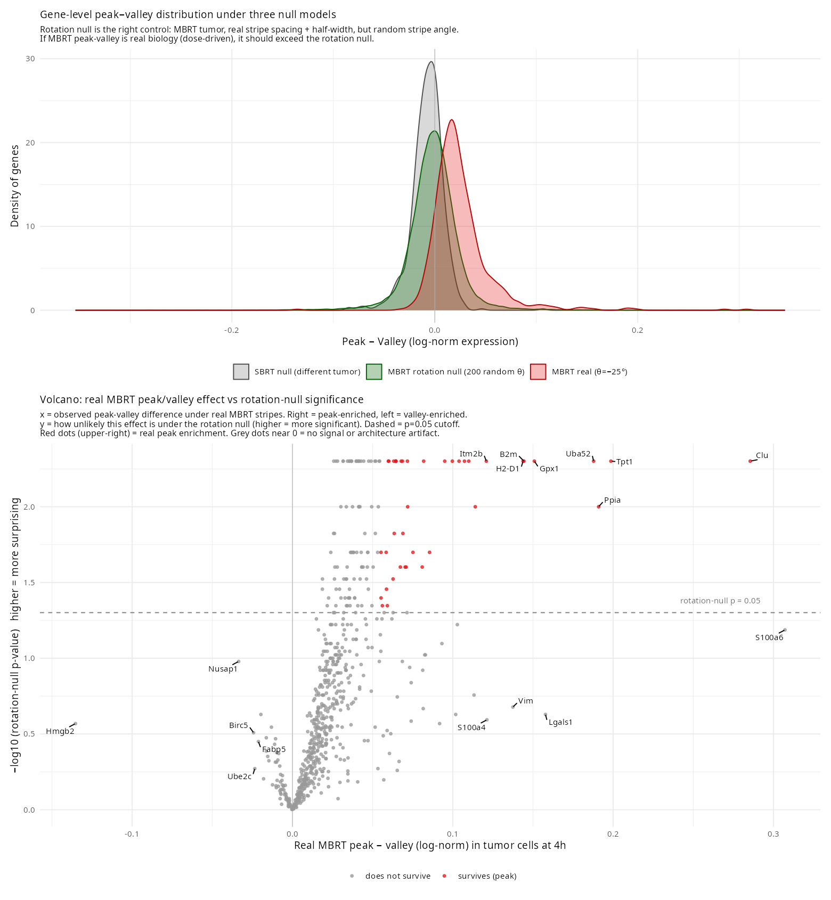

/# Created 2025-02-24 Mon 08:20
#+title: Mutter Spatial Radiation (CosMx)
#+author: Jeffrey Szymanski

to check on next open the repo data structure and locations and addition of other relevant metadata such as beam width the biological model Consolidate all the previous one-off analyses structuring for all subsequent analysis to run locally on Jeff Beast

when analyzing, where is the tumor per section? should we subset?

each fov is 510 x 510 um, about 6k cells- confirm and add to qc

https://claude.ai/design/p/019dd94c-82cc-7402-afca-9a1c4e96427f?file=CosMx+Graphical+Abstract.html
https://mail.google.com/mail/u/0/#inbox/FMfcgzQgLXpfTcszfkdQDwMWvMnTKVzg
- [ ] fov subdivision
- [ ] Ask for neg probes
- Jenn will share H2AX FOV overlay soon, [2026-04-24 Fri] [[https://mail.google.com/mail/u/0/#inbox/FMfcgzQgLXpfTcszfkdQDwMWvMnTKVzg][gmail]]
- Mutter02_Slide Powerpoint.pptx [[https://mail.google.com/mail/u/0/#inbox/FMfcgzQgLXpfTcttgrXLmkHtZJVpmxfl][gmail]]
- [ ] h2ax scanner tiff
- [ ] beam angle per slide?
* Plans
- [[file:plan-aggregate.md][aggregate.smk — design, decisions, status]] — cross-sample/cross-dataset workflow. /Cell typing executed and locked (2026-06-02): scVI integration + coarse cluster-then-annotate (res=3.0, all four Q4 gates passed; tumor 48.1% / stroma 40.6% / immune 11.2%), tier-2 immune SingleR/ImmGen with marker rescue (macrophage-dominated; B cells near-absent), and tier-2 stroma UCell with marker rescue (fibroblast-dominated; endothelium and adipocytes recovered). All three tiers joined into the unified per-cell table =results/aggregate/full_labels.parquet=. See v2.5 banner./
- [[file:plan-processing-pipeline.md][processing.smk — design, decisions, status]] — per-sample upstream (adapter → QC → normalize → cell typing → pathway scoring), completed 2026-05-30.
- [[file:plan-mbrt-signatures.md][MBRT signatures plan]] — autonomous VM Layer-4 run.
- [[file:plan-mbrt-vs-sbrt.md][MBRT vs SBRT downstream analysis — design/spec]] — cross-dataset differential analysis on the locked unified labels: three literature-grounded a priori hypotheses (H1 immune activation, H2 vascular/oxygenation, H3 stromal sparing) tested across MBRT/SBRT/Control, plus exploratory + spatial-structure scans. Brainstormed + full-panel-reviewed 2026-06-02.
- [[file:plan-mbrt-vs-sbrt-impl.md][MBRT vs SBRT downstream analysis — implementation plan]] — 15-task build for the above (4 phases: rebuild confirmatory DE chain on unified labels → build missing inputs → re-implement spatial tracks clean → tier-tagged master results). To be executed in a new session.

* Key results
:PROPERTIES:
:ID:       af3003a4-dc06-4a49-8edf-c6660829cf13
:END:
- [[file:dev/peak_valley_analysis/plots/morphology_nuc_kinetics.png][Nuclear area kinetics diverge: MBRT shrinks, SBRT swells]] — CosMx cell-segmentation morphology metrics across all flank timepoints. MBRT nuclei progressively shrink from baseline (3192→2568→2412 px median) while SBRT nuclei enlarge at day2 (3460 px) then partially recover (2968 px at day6), yielding 23% MBRT-vs-SBRT nuclear area divergence at day2. Cell area shows the expected SBRT day2 swelling (median 105 vs 82 µm² control) consistent with G2/M arrest-driven hypertrophy at 48h; MBRT cell area is modestly elevated but flat across timepoints. Peak/valley comparison at 4h shows no morphological difference (median 87.6 vs 87.3 µm²), consistent with Harada et al. (J Radiat Res 2025) finding no morphological stripe pattern until 12-16h in minibeam time-lapse imaging. Nuclear condensation in MBRT may reflect apoptosis/pyknosis predominating over arrest-driven swelling — a qualitatively different damage response than SBRT.
- [[file:dev/if_channel_check/cdkn1a_kinetics_mean.png][p21 / Cdkn1a kinetics per cell class, MBRT vs SBRT]] — log-normalized mean Cdkn1a across 0 Gy control, MBRT (1h, 4h, 2d, 6d), and SBRT (4h, 2d, 6d) in six radiobiology-defined cell classes (tumor, macrophages, monocytes/DC, T cells, B cells, stroma). MBRT peak and valley subsets at 4h overlaid as star and cross. Myeloid cells show the largest MBRT-vs-SBRT and peak-vs-valley separation; tumor cells show minimal peak/valley p21 difference despite strong bulk induction.
- [[file:dev/if_channel_check/block21_extrapolated_pv.png][Cell-level peak/valley label extrapolation, Block_21 (MBRT 4h)]] — stripe geometry fit empirically from manual peak FOV centroids: −25° angle from horizontal, 1.046 mm spacing, 0.27 mm beam half-width. Cells labeled by perpendicular distance to nearest peak centerline. 87.5% concordance with manual FOV labels on the labeled subset. Yields 3765 peak + 4235 valley cells across the full tumor, ~5× more than manual FOV labeling. Framework transferable to Mutter_02.
-  — rigorous control for spatial architecture confounding: the real stripe geometry (−25° angle, 1.04 mm spacing, 0.27 mm half-width) is rotated to 175 random angles on the same MBRT Block_21 tumor, and peak-valley deltas are recomputed at each angle. This preserves all of the tumor's own spatial biology (core vs edge, stromal infiltrate, TLS) while scrambling the dose labels. Rotation-null sd = 0.027, ~1.7× wider than the SBRT-block null (0.016), confirming that using SBRT on a *different* tumor under-estimated the architecture floor. Top density panel: three overlaid distributions across all 670 tumor-expressed genes — SBRT null (grey, narrowest), MBRT rotation null (green, wider, centered at 0), MBRT real (red, widest, shifted right). MBRT real clearly exceeds the rotation null, establishing that real zonation exists above and beyond architecture. Bottom scatter: real MBRT peak-valley delta vs per-gene rotation-null sd. Genes outside ±2 × per-gene null sd (dashed cones) survive the rotation null (red); those inside do not (grey). 37 of 670 genes survive (empirical p<0.05 AND |delta|>2 × overall null sd). Surviving peak-enriched tumor genes at 4h: Clu, Tpt1, Uba52, B2m, H2-D1, H2-K1 (MHC class I), Ifitm2 (IFN response), Gpx1, Ppia, Itm2b, Fau, Tpm1, Gstp1/2. Rejected as architecture artifacts (large MBRT delta but also large rotation-null sd): S100a6, S100a10, S100a4, Lgals1, Vim, Hsp90ab1, Naca. The surviving signature is dominated by MHC class I induction, IFN-response, damage/stress response, and translation-machinery genes, consistent with direct DNA damage at beam peaks. The S100 calcium-binding cluster, initially flagged as peak-enriched, was core-vs-edge tumor architecture contaminating the peak label. No valley-enriched genes survive at this threshold. Descriptive (n=1 per arm); replication pending in Mutter_02.
- *MBRT beam geometry dilutes whole-sample DE (method caveat).* Pseudobulk DE understated the MBRT response relative to SBRT in Mutter_02 day2. MBRT delivers dose through ~1 mm-spaced peaks separated by spared valleys, so summing counts across a whole cell type averages directly irradiated peak cells with largely spared valley cells and dilutes the MBRT-vs-Control contrast. In the tumor compartment (ImmGen "a"), MBRT vs Control yielded 5 genes at padj < 0.05 against 127 for SBRT vs Control (DESeq2 ~slide_id+condition with apeglm shrinkage, n=4/condition), even though spatially-resolved 4h analysis recovered a clear MBRT peak/valley zonation signature. The weak bulk MBRT signal reflects beam-geometry dilution, not an absence of response, and argues for spatially-stratified peak/valley DE over whole-sample pseudobulk in the MBRT arms. See [[file:results/aggregate/degs_pseudobulk_m02day2.tsv][degs_pseudobulk_m02day2.tsv]].
- *Spatially-variable-gene reframing of the dilution problem (proposed).* The fix for whole-sample dilution is to treat dose position as a continuous spatial covariate rather than a binary peak/valley label. =07_peak_valley_classify.R= already computes a per-cell =dist_to_peak=, the phase within the ~1 mm beam period from the tilt-corrected stripe geometry, then discards it by thresholding to peak versus valley at one quarter of the beam spacing; the binary =FindMarkers= peak-vs-valley test in =08_pv_degs.R= recovered little. Posing the same data as a spatially-variable-gene problem regresses each gene on =dist_to_peak=, or tests spectral power at the known beam frequency by Lomb-Scargle or Fourier analysis along the beam-perpendicular axis, with SpatialDE, SPARK, or Moran's I as model-free checks. This formulation retains every cell's continuous position, so no signal is lost to boundary mis-assignment, it exploits the known ~1 mm period as a prior, and it admits a within-sample permutation null from shuffling cell coordinates, which sidesteps the n=1 biological-replication problem that a group-mean differential test cannot. A null periodicity result is then interpretable as the absence of transcriptional structure at the beam frequency, in contrast to the binary peak-vs-valley null, which conflates absent signal with threshold-induced dilution. See [[file:dev/peak_valley_analysis/07_peak_valley_classify.R][07_peak_valley_classify.R]] and [[file:dev/peak_valley_analysis/08_pv_degs.R][08_pv_degs.R]].
- *MBRT immunostimulation and immature-vascular targeting remain unestablished by current data (mechanism status).* In Mutter_02 day2, whole-sample immune differential expression for MBRT versus Control was near zero across all immune cell types, a consequence of the same beam-geometry dilution, and the MBRT-specific contrast (MBRT versus SBRT) was dominated by Cdkn1a/p21, a cell-cycle-arrest and stress readout rather than immune activation. Canonical activation markers (Cxcl9, Cxcl10, H2-K1, H2-D1, B2m, Tap1, Cd74, Gzmb, Cd80, Cd86, Il12b) are present on the 950-gene panel but largely silent in the MBRT contrasts; an earlier reading that myeloid cells led the MBRT response reflected p21 arrest, not activation. Immature-vascular targeting registered as a weak, non-specific trend only: whole-sample endothelial MBRT versus Control was zero, and on the spatially-resolved Mutter_01 4h peak/valley run (effect size, n=1, not adjusted p) endothelial pan-markers (Pecam1 -0.30, Cdh5 -0.18) and proliferation genes (Ccnd1, Pcna) were modestly lower in peak, compatible with vessel damage at beam peaks but small (|log2FC| <= 0.3), confounded with generic irradiated-cell stress, and uninformative on the diagnostic immature-vessel markers (Dll4, Angpt2, Notch3, Kdr), which fell below detection in the 4h endothelial subset. Both hypotheses are spatial and dose-resolved, so whole-sample pseudobulk is structurally blind to them: averaging peak and valley cells collapses the MBRT versus Control signal toward zero. Panel coverage is adequate for both; the blocker is analysis design, namely per-cell-type un-diluted and peak/valley differential expression, together with improved cell typing, not gene-panel content. See [[file:results/aggregate/degs_pseudobulk_m02day2.tsv][degs_pseudobulk_m02day2.tsv]].
- *ImmGen-only cell typing leaves half the flank cohort unclassified (reference mismatch).* Of the 3.27M-cell flank cohort, 48.5% (1.59M cells) fell into the InSituType de novo "a" bucket, with a further 1.4% in "b". ImmGen is an immune-only reference and cannot classify the roughly half-non-immune 4T1 tumor (epithelium, endothelium, fibroblast, pericyte), and the Mutter_02 tumor compartment in particular was almost entirely unassigned (1.28M of the 1.59M "a" cells). Well-matched single-cell reference mapping typically leaves single-digit to ~15% of cells unassigned, so a 48% rate reflects reference mismatch rather than noise tolerance. We committed to adding a broad off-the-shelf mouse atlas (Tabula Muris Senis, or Mouse Cell Atlas) for the non-immune lineages alongside ImmGen for the immune lineages, applied at the Mutter_01 typing step because Mutter_02 inherits labels by Seurat-anchor TransferData; the malignant identity has no turn-key reference and falls to marker-based assignment.

* README

** Data sources
*** Metadata
Experimental design metadata at [[file:data/metadata.xlsx][data/metadata.xlsx]]. Relational sheet capturing sample-level treatment, timepoint, and model assignments across both Mutter_01 and Mutter_02 runs. Consumed by =make_data_model.R= to build =data/data_model.rda=.
*** Source documents
Write-protected vendor documents under [[file:data/sources/][data/sources/]], all received as attachments on Yi Liu's 2026-01-30 email ([[https://mail.google.com/mail/u/0/#all/19c0fac78dda6cca][Gmail thread: MutterRobert_02_CosMmR - Project Update and Timeline]]):

- [[file:data/sources/2026-01-30-nanostring-mouse-ucc-gene-list.xlsx][2026-01-30-nanostring-mouse-ucc-gene-list.xlsx]] — NanoString Mouse UCC panel documentation. All ~1000 genes with pathway/annotation columns (Annotations sheet drives IFN-I, IFN-II, DDR module gene lists). "Add-On" column here is NanoString's internal panel categorization — distinct from the 21 custom genes below.
- [[file:data/sources/2026-01-30-nanostring-alan-fields-21-custom-panel-design.xlsx][2026-01-30-nanostring-alan-fields-21-custom-panel-design.xlsx]] — NanoString custom RNA probe design report (Oct 16 2024) for the 21 Alan Fields add-on genes, with per-probe sequences and isoform coverage. Canonical list of which 21 genes constitute the custom add-on: A2ml1, Adcy8, Akap5, Bcl6, Cd21, Cpne4, Dpyd, Eya4, Gstm1, Hopx, Mum1, Nrp1, Plau, Plaur, Porcn, Prkci (ex2), Scd1, Sdc1, Slc35f1, Xist, p16.
- [[file:data/sources/2026-01-30-nanostring-alan-fields-21-custom-quote.pdf][2026-01-30-nanostring-alan-fields-21-custom-quote.pdf]] — NanoString quote for Mouse UCC + 21 custom (~$7,000). Reagents were purchased under Dr. Alan Fields' account for his mouse experiment and donated to the Mutter Lab. Included in Mutter_01; planned for Mutter_02.
*** External reference documents
Large reference PPTX files kept on GCS (not checked into repo due to size):

- [[file:/mnt/gcs/jeszyman/projects/spatial-rads/inputs/Gamma H2AX + FOVs.pptx][Gamma H2AX + FOVs.pptx]] (11 MB) — Mutter_01 gamma-H2AX chromogenic IHC images on adjacent tissue sections, with FOV overlays. Ground truth for 4h peak/valley stripe geometry validation. Received from Evelyn Han (Han.Yiqun@mayo.edu) on 2025-12-08 ([[https://mail.google.com/mail/u/0/#all/19affb8105f16df7][Gmail thread: Spatial MBRT peak valley fov]]).
- [[file:/mnt/gcs/jeszyman/projects/spatial-rads/inputs/Mutter02_Slide Powerpoint .pptx][Mutter02_Slide Powerpoint.pptx]] (58 MB) — Mutter_02 slide layout and FOV reference images for the 4-slide × 3-sample run (0 Gy / MBRT 2d / SBRT 20 Gy 2d). Source: MutterRobert_02_CosMmR - QC results thread ([[https://mail.google.com/mail/u/0/#all/19d202d7827d05ad][Gmail thread]]).
*** Gene panel
CosMx Mouse Universal Cell Characterization (Mouse UCC) panel + 21 custom add-on genes originally designed by Dr. Alan Fields for his mouse experiment. See [[*Source documents][Source documents]] above for canonical panel files and the 21-gene list. Mouse UCC reference profiles for insitutype cell typing are publicly available from NanoString.
*** IF channels
CosMx IF channels capture protein markers on the same tissue section as RNA. Mutter_01 IF channels were used for cell segmentation and lineage, not H2AX:
- PanCK (=Mean.PanCK=, =Max.PanCK=) — epithelial marker
- "G" channel (=Mean.G=, =Max.G=) — unknown
- CD298/B2M (=Mean.CD298.B2M=, =Max.CD298.B2M=) — cell segmentation marker
- CD45 (=Mean.CD45=, =Max.CD45=) — immune cell marker
- DAPI (=Mean.DAPI=, =Max.DAPI=) — nuclear stain

Gamma-H2AX staining in PPTX ([[file:/mnt/gcs/jeszyman/projects/spatial-rads/inputs/Gamma H2AX + FOVs.pptx][Gamma H2AX + FOVs.pptx]]) is separate chromogenic IHC on an adjacent section, not CosMx IF. No per-cell H2AX intensity data exists for Mutter_01. Asked Yi (2026-03-27) whether H2AX IF could be added as a channel for Mutter_02.

**Morphology/segmentation images not in delivered data (2026-06-01)**: the delivered files carry only per-cell IF intensity *summaries* (=Mean.*=/=Max.*=), segmentation-derived shape morphometrics (=Area=, =Perimeter=, =Circularity=, =Eccentricity=, =Solidity=), and cell *centroids* (=x_slide_mm=/=y_slide_mm=). They do NOT contain the multichannel morphology rasters (DAPI/CD298/PanCK/CD45 TIFFs) or the Cellpose cell-boundary polygons (verified 2026-06-01: no TIFF/polygon/composite files anywhere under =inputs/=; Mutter_01 metadata parquet has no vertex columns; the Mutter_02 =FOV@boundaries= slot holds only =Centroids=, no =Segmentation= object, and =@molecules= is NULL). Consequence for the He-2022 CosMx SMI Fig 1c workflow row: the *Morphology* and *Segmentation* panels cannot be reproduced locally — they are CosMx-instrument / AtoMx-pipeline outputs. The *Cell assignment* panel reproduces fine as a centroid map colored by =cell_type= (existing example: [[file:dev/peak_valley_analysis/plots/spatial_celltype_flank.png][spatial_celltype_flank.png]]). Recreating morph/seg would require the CosMx morphology composite + polygon flat-file export (AtoMx) from Jenn — a *separate* asset from the outstanding =h2ax scanner tiff= item above, which is a chromogenic-IHC image for peak/valley registration, not the CosMx IF composite.
*** Mutter_01 (current dataset)
- CosMx spatial transcriptomics data from Mutter lab, generated by Yi Liu (Liu.Yi1@mayo.edu)
- Yi performed secondary analysis: QC, sample condition labeling, cell type annotation (insitutype with ImmGen reference atlas), and signaling pathway scores
- Delivered as processed parquet files (339.1 MB total):
  - =projects_Mutter_01_CosMmR_app_data_raw_tx_counts_matrix.parquet= — [[https://mayoclinic2.box.com/s/ywj75mz3bfhivo5bfvivoogqh5o2uu86][box]]
  - =Analysis_Mutter_01_CosMmR_Mutter_updated_metadata.parquet= — [[https://mayoclinic2.box.com/s/y3dqguqwsjt15shh1opc2dw1kelc8q15][box]]
  - Metadata columns 90-93 are signaling pathway scores (TypeI_interferon, TypeII_interferon, STING, DNA_Damage_Repair). Type I IFN (19 genes), Type II IFN (17 genes), and DDR (18 genes) are NanoString standard Mouse UCC panel modules — gene lists in [[file:data/sources/2026-01-30-nanostring-mouse-ucc-gene-list.xlsx][gene list XLSX]], Annotations sheet. STING is not a standard NanoString module; Yi may have defined it custom or from a subset of Pattern Recognition Receptors (30 genes).
- Stored at =/mnt/gcs/jeszyman/projects/spatial-rads/inputs/=
*** Mutter_02 (raw data received, 4 slides, 12 samples)
:PROPERTIES:
:ID:       908fd83a-16ee-4ca5-9e2f-074d015b652d
:END:
Confirmed sample layout per Jenn Fazzari's 2026-04-09 reply ([[https://mail.google.com/mail/u/0/#all/19d202d7827d05ad][Gmail thread: MutterRobert_02_CosMmR - QC results]]). Each slide contains three samples: 0 Gy control, MBRT 2 days, SBRT 20 Gy 2 days. **All Mutter_02 samples are at the 2-day timepoint — no 4h data in this run.** Earlier tentative designs from Rob (Jan 30) and Jenn (Mar 2) are superseded.

| Slide | Sample ID | Treatment         |
|-------+-----------+-------------------|
|     1 |         1 | 0 Gy              |
|     1 |        34 | MBRT 2 days       |
|     1 |        28 | SBRT 20 Gy 2 days |
|     2 |         2 | 0 Gy              |
|     2 |        35 | MBRT 2 days       |
|     2 |        30 | SBRT 20 Gy 2 days |
|     3 |         3 | 0 Gy              |
|     3 |        19 | MBRT 2 days       |
|     3 |        16 | SBRT 20 Gy 2 days |
|     4 |         1 | 0 Gy              |
|     4 |        20 | MBRT 2 days       |
|     4 |        18 | SBRT 20 Gy 2 days |

**No FOV-level map**: Jenn confirmed she has no FOV maps for this run. Sample boundaries on each slide must be inferred from Seurat object metadata (sample ID or tissue region annotations) or from spatial coordinates.

**H2AX IHC in process for Mutter_02**: no yH2AX included in this run, but adjacent tissue sections were cut during original sample prep. Jenn received them back from Florida on 2026-04-09 and is arranging staining at Mayo. Will enable stripe model validation on Mutter_02 once complete.

**Alternative staining for later timepoints (2026-04-28)**: H2AX foci resolve by ~24-48h post-irradiation, so H2AX IHC on later timepoint blocks (day 2/6/8/10) would not show stripe geometry. If unstained adjacent sections exist for these blocks, alternative stains could provide ground truth: H&E (architectural damage), Ki67 (proliferation — expect higher in valleys per Hmgb2 finding), TUNEL or cleaved caspase-3 (cumulative apoptosis in peaks). Worth asking Jenn/Rob whether sections are available. For Mutter_02 at 48h, H2AX may still show residual signal — borderline timing.

Raw Seurat objects staged at =/mnt/gcs/jeszyman/projects/spatial-rads/inputs/mutter02/= (copied from Box 2026-04-10): =seuratObject_01..04_Mutter_02_CosMmR.RDS= (1.0 GB total, ~2.8M cells across 1586 FOVs).
*** Data transfer
- Transfer mechanism: Yi uploaded via Mayo Media Shuttle (mc-ondemand-securefiletransfer.mediashuttle.com), which emails download links to recipients. GCS bucket access (=chaudhuri-lab-share-bucket1/po1-spatial=) was attempted but Yi got permission denied — never resolved. Faridi Qaium (Qaium.Faridi@mayo.edu) manages GCS bucket IAM.
- Email threads:
  - [[mu:msgid:BN7PR01MB371506589DEF9A3B39E2DA7896F1A@BN7PR01MB3715.prod.exchangelabs.com][mu:CosMx data transfer thread (Oct-Nov 2025)]]
  - [[mu:msgid:BN7PR01MB37151F29CE6E18153C94469596D2A@BN7PR01MB3715.prod.exchangelabs.com][mu:Media Shuttle upload confirmation (Nov 21 2025)]]
  - [[mu:msgid:BN7PR01MB371539912324DC0BD309549D967EA@BN7PR01MB3715.prod.exchangelabs.com][mu:MutterRobert_02 project update thread]]

** Prerequisites and setup
** Change log
:PROPERTIES:
:ID:       2dc86037-02c7-4b51-b806-43dcc1bc1e9f
:END:
- [2026-06-02 Tue] Aggregate cross-dataset cell typing executed and locked. Full-cohort scVI integration (3,277,090 cells); coarse cluster-then-annotate at res=3.0 passed all four Q4 gates (tumor 48.1% / stroma 40.6% / immune 11.2%, 4 unassigned; scaled iLISI 0.67). Tier-2 immune SingleR/ImmGen with marker rescue (=tier2_immune_rescue.py=): macrophages 300,975 (81.8%), ILC 34,340, T 16,046, DC 5,315, NK 4,991, plasma 3,573, mast 1,121, neutrophils 259 (+1,180 epithelial contamination); B cells near-absent (biological, not panel- or clustering-driven). Tier-2 stroma UCell against =lineage_markers.yaml= with the same identity-marker rescue (=tier2_stroma_rescue.py=): fibroblast 732,099, unassigned 441,227, smooth muscle 72,124, adipocyte 49,214, endothelial 36,937 (pericyte 0, unresolvable de novo). All three tiers joined by =unify_labels.py= into the canonical per-cell table =results/aggregate/full_labels.parquet= (3,277,090 rows). Aggregate profiles diverge markedly from Yi's original M01 ImmGen typing, which is superseded. Writeup under [[*Aggregate atlas cell typing][Aggregate atlas cell typing]]; see [[file:plan-aggregate.md][aggregate plan]] v2.5.
- [2026-06-01 Mon] Aggregate cross-dataset integration pilot complete → *scVI selected over Harmony*. Two-slide bake-off (M01 sld0002 + M02 sld0005, 50k-cell scIB benchmark): cluster-then-annotate premise PASSED on all embeddings (3/3 coarse compartments, markers above the negprobe floor); scVI scaled iLISI 0.71 vs Harmony 0.20 (Harmony fails the ≥0.5 mixing gate) with best biology preservation (silhouette-label 0.46). Confirms documented imaging-spatial precedent (scVI > Harmony) and validates the v2.3 pivot off per-cell InSituType (which failed at 85% tumor). A GPU (NVIDIA RTX A4000 16 GB) was found on jeff-beast → scVI trains GPU-direct (no CPU sketch-train). Full-cohort scVI integration (3.27M flank cells) launching. Scripts `scripts/aggregate/pilot_{export,scvi,harmony,compare}.*`; see [[file:plan-aggregate.md][aggregate plan]] v2.4 "Pilot results".
- [2026-05-30 Sat] Reproducible per-sample pipeline complete: `processing.smk` produces 23 scored.rds across both datasets (adapter → QC → normalize → cell typing → pathway scoring). M02 cell typing switched from InSituType (collapsed tumor compartment into 38% Lymphatic.endo sink under cross-dataset batch shift) to Seurat anchor TransferData against a 20k pooled-M01 cell reference; validated by marker concordance (Krt8+/Epcam+ → tumor compartment 64-71% across all 12 M02 samples). Cell-typing/pathway/probe-QC layer folded into literate org with `shell.prefix` BLAS pinning + per-rule `threads: 1` baked in. See [[file:plan-processing-pipeline.md][processing pipeline plan]]; next session builds [[file:plan-aggregate.md][aggregate.smk]].
- [2026-03-11 Tue] Layer 3 peak/valley stripe detection: established 15-deg tilted stripe model with 1.02mm spacing and 4 peaks from H2AX image geometry. Transcript-based p21 validates peak > valley. Pending visual confirmation of zone overlay.
- [2026-03-11 Tue] Layers 1-2 complete and committed: QC (971K cells), clustering (9 clusters), cell type validation, DEGs (2160 bulk + 2534 per-cell-type), pathway kinetics, composition, spatial NN analysis.
- [2026-03-11 Tue] Initial project setup: data model, experimental design metadata, exploratory analysis migration from career.org.
* Project Map
:PROPERTIES:
:ID:       8a364857-4350-4c1a-9cc9-7a1614dca51d
:END:

Forward-looking dashboard for this project. Convention defined under [[id:f9628d19-7816-45ba-aef4-a9ab766aaf3f][sci_proj_repo Project Map]]. Headline findings and named outputs live in [[id:af3003a4-dc06-4a49-8edf-c6660829cf13][Key results]]; past dated progress lives in [[id:2dc86037-02c7-4b51-b806-43dcc1bc1e9f][Change log]].

** Visualization

#+begin_src dot :file project-map.svg :results file :exports results
digraph spatial_rads {
  rankdir=TB;
  ranksep=0.22;
  fontname = "Helvetica";
  node [shape=box, style=filled, fillcolor=white, fontname="Helvetica", fontsize=11];
  edge [fontname="Helvetica", fontsize=9];

  // --- BIOLOGICAL MODEL (top — experimental frame) ---
  bio_model     [label="Biological model\n4T1 flank · MBRT vs SBRT\ntimepoints 1h/4h/d2/d6", shape=box, style=filled, fillcolor="#e8f0ff"];

  // --- INPUT DATA (datasets produced by the experiment) ---
  mutter01      [label="Mutter_01\n971K cells\n11 conditions", shape=cylinder, style=filled, fillcolor=lightgray];
  mutter02_raw  [label="Mutter_02\n3 conditions × 3 reps × 4 slides\nday-2 only", shape=cylinder, style=filled, fillcolor=lightgray];
  h2ax_ihc      [label="H2AX IHC (Block_21)\nanchors peak/valley to a\nsingle 4h block", shape=cylinder, style=filled, fillcolor=lightgray];

  // --- DATA MODEL (processing layer that structures inputs) ---
  data_model    [label=<<TABLE BORDER="0" CELLBORDER="1" CELLSPACING="0" CELLPADDING="3" BGCOLOR="#e8f0ff"><TR><TD COLSPAN="3" BGCOLOR="#c8d8f0"><B>metadata</B>  (11 × 9)</TD></TR><TR><TD ALIGN="LEFT">block_id</TD><TD ALIGN="LEFT">condition</TD><TD ALIGN="LEFT">slide</TD></TR><TR><TD ALIGN="LEFT">model</TD><TD ALIGN="LEFT">treatment</TD><TD ALIGN="LEFT">timepoint_h</TD></TR><TR><TD ALIGN="LEFT">tumor_cell_line</TD><TD ALIGN="LEFT">host_strain</TD><TD ALIGN="LEFT">tumor_type</TD></TR></TABLE>>, shape=plaintext];

  // --- LEFT STREAM: cross-timepoint MBRT vs SBRT (primary), all [dev] = rounded ---
  kinetics_m01  [label="MBRT vs SBRT comprehensive on Mutter_01\nDEGs · pathways · composition · spatial NN ·\ncell death · necrosis\n(5 findings landed; iteration continues)", shape=box, style="filled,rounded,bold", fillcolor=white];
  morphology    [label="Cell morphology kinetics\n(nuclear & cell area, cross-timepoint)", shape=box, style="filled,rounded,bold", fillcolor=white];
  m02_full      [label="Full Mutter_02 MBRT vs SBRT\nstatistical inference with biological replicates\n(gated on Yi insitutype labels)", shape=box, style="rounded,dashed,bold"];

  // --- RIGHT STREAM: peak/valley (focused, 4h-bound), all [dev] = rounded ---
  tumor_sig     [label="Tumor peak/valley signature\n(rotation-null validated;\nper-gene gradients)", shape=box, style="filled,rounded,bold", fillcolor=white];
  sig_project   [label="Peak/valley signature projection\nMutter_01 → Mutter_02\n(still 4h-bound)", shape=box, style="rounded,dashed"];

  // --- DELIVERABLE ---
  paper         [label="First-in-field MBRT vs SBRT spatial paper", shape=ellipse, style="filled,bold", fillcolor="#fff3b0"];

  // Hierarchy: biological model → input data → data model → analyses
  bio_model    -> mutter01     [style=dashed, color=gray60, arrowhead=none];
  bio_model    -> mutter02_raw [style=dashed, color=gray60, arrowhead=none];
  bio_model    -> h2ax_ihc     [style=dashed, color=gray60, arrowhead=none];
  mutter01     -> data_model;
  mutter02_raw -> data_model;

  // Analysis flow (analyses consume the data model, plus raw inputs where direct access is needed)
  data_model   -> kinetics_m01;
  data_model   -> tumor_sig;
  data_model   -> m02_full;
  kinetics_m01 -> morphology;
  kinetics_m01 -> m02_full [style=dashed, label="extends to"];
  h2ax_ihc     -> tumor_sig;
  tumor_sig    -> sig_project [style=dashed];
  morphology -> paper;
  m02_full -> paper [style=dashed];
  tumor_sig -> paper;
  sig_project -> paper [style=dashed];

  {rank=same; bio_model}
  {rank=same; mutter01 mutter02_raw h2ax_ihc}
  {rank=same; data_model}
  {rank=same; kinetics_m01 tumor_sig}
  {rank=same; morphology sig_project}

  // --- Visual legend (single row at bottom, all 3 dimensions side-by-side) ---
  // Maturity exemplars (shape)
  lg_m_dev [label="[dev]",     shape=box,    style="rounded,filled", fillcolor=white, fontsize=7, width=0.45, height=0.18, margin="0.02,0.01"];
  lg_m_tan [label="[tangled]", shape=box,    style=filled,            fillcolor=white, fontsize=7, width=0.45, height=0.18, margin="0.02,0.01"];
  lg_m_smk [label="[smk]",     shape=box3d,  style=filled,            fillcolor=white, fontsize=7, width=0.45, height=0.18, margin="0.02,0.01"];
  lg_m_frz [label="[frozen]",  shape=folder, style=filled,            fillcolor=white, fontsize=7, width=0.45, height=0.18, margin="0.02,0.01"];
  // State exemplars (border)
  lg_s_done [label="done",        shape=box, style=filled,        fillcolor=lightgray, fontsize=7, width=0.45, height=0.18, margin="0.02,0.01"];
  lg_s_prog [label="in-progress", shape=box, style="filled,bold", fillcolor=white,     fontsize=7, width=0.55, height=0.18, margin="0.02,0.01"];
  lg_s_next [label="next",        shape=box, style="dashed,bold", fillcolor=white,     fontsize=7, width=0.45, height=0.18, margin="0.02,0.01"];
  // Role exemplars (fill)
  lg_r_input [label="input/done",  shape=box,    style=filled,         fillcolor=lightgray, fontsize=7, width=0.55, height=0.18, margin="0.02,0.01"];
  lg_r_act   [label="active",      shape=box,    style="filled,bold",  fillcolor=white,     fontsize=7, width=0.45, height=0.18, margin="0.02,0.01"];
  lg_r_found [label="foundation",  shape=box,    style=filled,         fillcolor="#e8f0ff", fontsize=7, width=0.55, height=0.18, margin="0.02,0.01"];
  lg_r_del   [label="deliverable", shape=ellipse,style="filled,bold",  fillcolor="#fff3b0", fontsize=7, width=0.6,  height=0.22, margin="0.02,0.01"];
  // Group separators
  lg_sep1 [label="|", shape=plaintext, fontsize=14, fontcolor=gray70];
  lg_sep2 [label="|", shape=plaintext, fontsize=14, fontcolor=gray70];

  // Single row at bottom — all 11 exemplars + 2 separators in one rank
  {rank=sink; lg_m_dev lg_m_tan lg_m_smk lg_m_frz lg_sep1 lg_s_done lg_s_prog lg_s_next lg_sep2 lg_r_input lg_r_act lg_r_found lg_r_del}

  // Anchor below paper, enforce left-to-right order with invisible chain
  morphology -> lg_m_dev [style=invis];  // anchor legend to leftmost bottom-area node
  lg_m_dev -> lg_m_tan -> lg_m_smk -> lg_m_frz -> lg_sep1 -> lg_s_done -> lg_s_prog -> lg_s_next -> lg_sep2 -> lg_r_input -> lg_r_act -> lg_r_found -> lg_r_del [style=invis, minlen=0];
}
#+end_src

** Current focus

Cross-timepoint MBRT vs SBRT is the primary thread (broader, transferable, where the energy is going next). On Mutter_01 it's comprehensive; the next push is to extend it to the full Mutter_02 cohort once Yi's insitutype cell typing lands, giving us proper replicates and statistical inference. Cell morphology kinetics is the active fresh angle. Peak/valley is a focused side branch — interesting MBRT-specific tumor signature but bounded to 4h because H2AX ground truth exists only for Block_21.

*Maturity*: all analyses are currently =[dev]= — exploratory =dev/= scripts. No =[tangled]= or =[smk]= production wrappers yet; per CLAUDE.md, Snakemake is deferred until analyses stabilize and Mutter_02 replicates arrive. The maturity ladder is =[dev]= → =[tangled]= (org→scripts/) → =[smk]= (Snakemake-orchestrated) → =[frozen]= (deliverable snapshotted, git-tagged).

** Project foundation

- [[id:ba78a9a7-f35f-478e-b47d-44e60ef306b2][Biological model]] — 4T1 flank tumor model, MBRT (microbeam) vs SBRT (uniform), timepoints 1h / 4h / d2 / d6, peak/valley anatomy from H2AX IHC ground truth on Block_21
- [[id:5ece068f-b135-4897-9892-834aaa321d8b][Data model]] — =metadata.xlsx= as single source of truth, preprocessed into =data/data_model.rda= via =make_data_model.R=; subjects / samples / sequencing schema

** Branches

*** Cross-timepoint MBRT vs SBRT (primary thread)

- =[dev]= [[id:49023d4a-a8ef-489d-811c-e0d902927cc3][Comprehensive MBRT vs SBRT on Mutter_01 (4T1 flank, all timepoints)]] — *goal*: full MBRT vs SBRT comparison — DEGs, pathways, composition, spatial NN, cell death, necrosis — across 1h/4h/d2/d6 · *deps*: Mutter_01 flank-only filtered, 4T1 purity filter applied · *status*: IN PROGRESS · *blockers*: none
- =[dev]= *Cell morphology kinetics* (no dedicated heading yet) — *goal*: morphological readouts MBRT vs SBRT across all flank timepoints (nuclear & cell area) · *status*: IN PROGRESS (added 2026-04-23) · *blockers*: none
- =[dev]= [[id:908fd83a-16ee-4ca5-9e2f-074d015b652d][Mutter_02 cell typing + normalization]] — *goal*: insitutype cell-type labels + LogNormalize on Mutter_02 · *deps*: Yi Liu's insitutype run · *status*: pending Yi; marker-based fallback in use · *blockers*: Yi's pipeline output
- =[dev → planned]= *Full Mutter_02 MBRT vs SBRT comparison* — *goal*: rerun the comprehensive comparison on Mutter_02 with insitutype labels and proper biological replicates (3 per condition); enables statistical inference · *deps*: Mutter_02 cell typing above · *status*: NEXT · *blockers*: Mutter_02 cell typing

*** Peak/valley (focused side branch, 4h-bound)

- =[dev]= [[id:def10c5f-06d2-4313-850b-e37e55933b6a][Peak/valley classification at 4h]] — *goal*: stripe-geometry classification on the one MBRT 4h block with H2AX ground truth (Block_21) · *deps*: H2AX IHC Block_21 only · *status*: DONE · *limit*: cannot transfer across timepoints without additional H2AX-anchored blocks
- =[dev]= [[id:945d9096-1a17-4b99-acfd-058f606cbd24][Tumor peak/valley signature with architecture-controlled validation]] — *goal*: MBRT-specific tumor signature controlled for tumor architecture via within-block rotation null · *deps*: peak/valley stripe model above · *status*: IN PROGRESS · *limit*: 4h, Block_21 only
- =[dev → planned]= [[id:d6be2ccf-1371-4fac-baf0-89e2c983a9e6][Peak/valley signature projection Mutter_01 → Mutter_02]] — *goal*: project the signature into Mutter_02 for persistence + validation · *deps*: Mutter_02 cell typing · *status*: orchestrator + plan + reviewer scaffolded for autonomous VM run; UCell scoring chosen · *blockers*: Mutter_02 cell typing · *limit*: still bounded by ground-truth-at-4h-only; tests persistence, not whether peak/valley structure exists at other timepoints

*** Past

- QC + landscape (DONE 2026-03-11): 971K cells post-QC, 9 clusters, cell type validation
- MBRT vs SBRT kinetics, condensed (DONE 2026-03-11, superseded by comprehensive version above): 2160 bulk DEGs, 2534 per-cell-type DEGs, pathway kinetics, composition, spatial NN
- Mutter_02 FOV-to-condition mapping (RESOLVED 2026-04-09 per Jenn Fazzari): 0 Gy / MBRT 2d / SBRT 20 Gy 2d per slide; all samples at 2-day timepoint
- VM autonomous-run hardening (2026-04-10): jsonl observability for headless =claude -p=, max-budget-usd guard, launcher conda init, PROJECT_DIR_ESC escape fix

** Open decisions

- *Radiation dose parameters*: MBRT peak dose in Gy, SBRT matched dose, valley-to-peak ratio, fractionation. Not yet confirmed in reviewed Gmail threads. Needs clarification with Rob Mutter before methods-section writing.
- *Tongue series for v1 paper*: Mutter_01 tongue series (TNG-/NTB- blocks, S3) currently excluded from peak/valley analysis; immune-dominated composition, tumor model not yet confirmed. Decision deferred until Rob/Yi confirm cell-line identity.
- *Han Evelyn abscopal cohort*: 2025-12-20 proposal to add abscopal tumors in a future cohort. Out of scope for v1; flag for v2.

** Recent progress

See [[id:2dc86037-02c7-4b51-b806-43dcc1bc1e9f][Change log]] for full detail (Change log is currently sparse; recent activity is better tracked via =git log= until the project-map skill backfills entries). Headline items, past 6 weeks:
- Cell morphology kinetics analysis: MBRT nuclei shrink, SBRT nuclei swell at day2 (23% divergence); peak/valley shows no morphological difference at 4h (consistent with Harada et al. 2025)
- Tumor peak/valley signature validated with within-block rotation null: 37 of 670 genes survive empirical p<0.05 + |delta|>2*null sd; MHC class I + IFN-response + damage/stress dominant
- Cell-level peak/valley label extrapolation from manual FOVs: stripe geometry -25 deg, 1.046 mm spacing, 87.5% concordance; framework transferable to Mutter_02
- Mutter_02 day2 concordance: tumor depletion replicates exactly (delta -0.082 vs -0.091); myeloid rho 0.44 cross-dataset
- VM autonomous-run hardening for signature projection (jsonl observability, budget guard)

* Project Administration
** Configuration
*** Yaml
**** Common
:PROPERTIES:
:header-args:yaml: :tangle no
:END:

#+begin_src yaml
# Project-level runtime configuration. Not tangled — reference only.
repo-dir: ${HOME}/repos/spatial-rads
machines:
  - name: jeff-beast
    type: metal
machine-data-dirs:
  - machine: jeff-beast
    dir: /mnt/gcs/jeszyman/projects/spatial-rads
data-subdirs: [analysis, inputs, logs, qc, ref]
conda-env: spatial-rads
sourced-conda-envs:
  - {name: biotools, version: TBD}
  - {name: basecamp, version: TBD}
#+end_src

*** Languages
**** Bash
**** Python
**** R
*** Emacs
**** Todo states for code
#+todo: TODO TEST(t) DEBUG(g) REFACTOR(r) DOCUMENT(m) BLOCKED(b&) WAITING(w&) | DONE DELEGATED

- TODO: Initial task entry, indicating a new or unstarted task.
- TEST: A stage for verifying functionality, often running tests to confirm code works as intended.
- DEBUG: Focused on identifying and fixing errors or bugs after testing reveals issues.
- REFACTOR: Time for code cleanup or optimization without changing functionality, improving readability or performance.
- DOCUMENT: Adding comments, README updates, or other documentation to clarify usage and details for future reference.
- BLOCKED: Work can't proceed due to external dependencies or unresolved issues.
- WAITING: Waiting for input, review, or other dependency but not fully blocked.
- DONE: Task is fully completed, tested, and documented.
- DELEGATED: Task is assigned to another person or team for completion.

** Snakemake
*** Configuration YAMLs
**** Common
*** Variable naming
*** Load packages
*** Load configuration
*** Functions
**** Sample lists
*** Include statements
* Biological model
:PROPERTIES:
:ID:       ba78a9a7-f35f-478e-b47d-44e60ef306b2
:END:
- Tumor types?
- γ-H2AX
  - gold-standard immunohistochemical
  - phosphorylated form of histone H2AX at serine 139
  - phosphorylated by the DNA damage kinases ATM, ATR, and DNA-PKcs within minutes of a DNA double-strand break (DSB) for ~1–2 Mb of chromatin flanking each DSB.
  - Each nuclear focus corresponds to roughly one DSB
  - Kinetics after irradiation:
    - 15–30 min: γ-H2AX foci appear at break sites
    - 30 min–1 hour: peak foci density. This is the optimal window for quantifying dose delivered.
    - 1–4 hours: foci gradually resolve as non-homologous end joining (NHEJ, dominant in G0/G1) and homologous recombination (HR, S/G2 only) repair breaks. Repaired DSBs dephosphorylate H2AX.
    - 24 hours: >90% of foci resolved in normally-repairing cells; residual foci mark unrepaired complex lesions, heterochromatic breaks, or cells entering apoptosis.
  - >24 hours: persistent foci = biomarker of genomic instability / failed repair.

* Data model
:PROPERTIES:
:ID:       5ece068f-b135-4897-9892-834aaa321d8b
:END:
[[file:data/metadata.xlsx]]
** make_data_model.R
:PROPERTIES:
:header-args:R: :tangle scripts/make_data_model.R
:END:

#+begin_src R
#!/usr/bin/env Rscript
# Build the data model from the relational metadata.xlsx, validating against
# metadata_schema.yaml. Emits data/data_model.rda (named list of tibbles) and the
# master denormalized sample sheet results/data_model/samples.tsv.
# Standalone:  conda run -n spatial-rads Rscript scripts/make_data_model.R
# Snakemake:   via the data_model rule's script: directive
suppressMessages({library(readxl); library(dplyr); library(readr); library(yaml)})
`%||%` <- function(a, b) if (is.null(a)) b else a

# positional args: xlsx schema rda samplesheet (fall back to standard paths for standalone runs)
args   <- commandArgs(trailingOnly = TRUE)
XLSX   <- if (length(args) >= 1) args[1] else "data/metadata.xlsx"
SCHEMA <- if (length(args) >= 2) args[2] else "data/metadata_schema.yaml"
RDA    <- if (length(args) >= 3) args[3] else "data/data_model.rda"
TSV    <- if (length(args) >= 4) args[4] else "results/data_model/samples.tsv"

schema <- yaml::read_yaml(SCHEMA)
dm <- lapply(schema$resources, function(r) readxl::read_excel(XLSX, sheet = r$control$sheet))
names(dm) <- vapply(schema$resources, function(r) r$name, character(1))

## ---- schema-driven validation ----
err <- character(0)
norm_na <- function(x, mv) { x <- as.character(x); x[x %in% mv] <- NA; x }
for (r in schema$resources) {
  d <- dm[[r$name]]; mv <- r$schema$missingValues %||% character(0)
  for (f in r$schema$fields) {
    if (!f$name %in% names(d)) { err <- c(err, sprintf("%s: missing column '%s'", r$name, f$name)); next }
    v <- norm_na(d[[f$name]], mv); cons <- f$constraints
    if (isTRUE(cons$required) && anyNA(v))
      err <- c(err, sprintf("%s.%s: %d missing required value(s)", r$name, f$name, sum(is.na(v))))
    if (isTRUE(cons$unique) && any(duplicated(v[!is.na(v)])))
      err <- c(err, sprintf("%s.%s: duplicate value(s)", r$name, f$name))
    if (!is.null(cons$pattern)) {
      bad <- v[!is.na(v) & !grepl(cons$pattern, v)]
      if (length(bad)) err <- c(err, sprintf("%s.%s: %d value(s) fail pattern %s", r$name, f$name, length(bad), cons$pattern))
    }
    if (!is.null(cons$enum)) {
      bad <- setdiff(na.omit(unique(v)), unlist(cons$enum))
      if (length(bad)) err <- c(err, sprintf("%s.%s: value(s) outside enum: %s", r$name, f$name, paste(bad, collapse = ", ")))
    }
  }
  for (fk in r$foreignKeys %||% list()) {
    child  <- norm_na(dm[[r$name]][[fk$fields]], mv)
    parent <- dm[[fk$reference$resource]][[fk$reference$fields]]
    miss   <- setdiff(na.omit(unique(child)), parent)
    if (length(miss)) err <- c(err, sprintf("%s.%s -> %s.%s unresolved: %s",
      r$name, fk$fields, fk$reference$resource, fk$reference$fields, paste(miss, collapse = ", ")))
  }
}
if (length(err)) stop("metadata_schema validation failed:\n  - ", paste(err, collapse = "\n  - "))

## ---- denormalized master sample sheet ----
## sample-grain only: join the dims that resolve 1:1 to a sample (mouse, slide, dataset).
## dataset-grain dims (e.g. if_channels, 5 rows/dataset) are deliberately NOT joined -- they
## would row-multiply the sheet. They live in data_model.rda; query them there by dataset_id.
master <- dm$samples %>%
  left_join(dm$mice,     by = "mouse_id") %>%
  left_join(dm$slides,   by = "slide_id") %>%
  left_join(dm$datasets, by = "dataset_id") %>%
  mutate(raw_input_path = if_else(format == "rds", input_path, counts_path)) %>%
  relocate(sample_id, dataset_id, name, format, treatment, condition, timepoint_h, model)

## ---- hard checks + summary ----
stopifnot(!anyNA(master$raw_input_path[master$format == "rds"]))         # every rds sample has a slide path
stopifnot(!anyNA(master$raw_input_path[master$format == "parquet"]))     # every parquet sample has counts path
cat(sprintf("data model OK: %d samples, %d mice, %d slides, %d datasets\n",
            nrow(dm$samples), nrow(dm$mice), nrow(dm$slides), nrow(dm$datasets)))
print(as.data.frame(count(master, name, treatment)))

data_model <- dm
dir.create(dirname(RDA), recursive = TRUE, showWarnings = FALSE)
dir.create(dirname(TSV), recursive = TRUE, showWarnings = FALSE)
save(data_model, file = RDA)
write_tsv(master, TSV)
cat(sprintf("wrote %s and %s\n", RDA, TSV))
#+end_src

** build_metadata_xlsx.R
:PROPERTIES:
:header-args:R: :tangle scripts/build_metadata_xlsx.R
:END:

#+begin_src R
#!/usr/bin/env Rscript
# One-time migration: flat metadata.xlsx (Sheet1) -> relational 4-sheet metadata.xlsx
# conforming to the sci_proj_repo Data layout standard (science.org 08049f58).
# Preview:  conda run -n basecamp Rscript scripts/build_metadata_xlsx.R
# Write:    conda run -n basecamp Rscript scripts/build_metadata_xlsx.R --write
suppressMessages({library(readxl); library(dplyr); library(tibble); library(tidyr); library(writexl)})

WRITE <- "--write" %in% commandArgs(trailingOnly = TRUE)
SRC   <- "data/sources/2026-05-29-legacy-flat-metadata.xlsx"  # legacy flat metadata (write-protected source)
XLSX  <- "data/metadata.xlsx"                                  # relational output, built from SRC
INPUT <- "/mnt/data/projects/spatial-rads/inputs"

flat <- read_excel(SRC)  # 11 Mutter_01 rows (legacy flat)

## datasets
datasets <- tibble(
  dataset_id    = c("dat0001", "dat0002"),
  name          = c("Mutter_01", "Mutter_02"),
  platform      = "CosMx",
  panel_n       = c(1000L, 972L),
  panel_base    = "Mouse UCC",                                       # Mouse RNA Universal Cell Characterization
  panel_custom  = c("Alan Fields 21-gene", "1K_Mayo_Thomp-Fields1"), # same Fields add-on; M02 label is the in-object Panel build name
  assay_type    = "RNA",                                             # RNA-only; no protein-expression assay on either run
  n_negprobe    = c(NA_integer_, 10L),   # M01 control probes stripped from delivered counts matrix (1000 gene cols only); M02 from RDS assays
  n_falsecode   = c(NA_integer_, 184L),
  provider      = c("Yi Liu / Mutter Lab", "Mutter Lab"),
  format        = c("parquet", "rds"),
  counts_path   = c(file.path(INPUT, "mutter01/projects_Mutter_01_CosMmR_app_data_raw_tx_counts_matrix.parquet"), NA),
  metadata_path = c(file.path(INPUT, "mutter01/Analysis_Mutter_01_CosMmR_Mutter_updated_metadata.parquet"), NA)
)

## slides (4 Mutter_01 physical slides + 4 Mutter_02)
m01_barcodes <- sort(unique(flat$slide))
slides_m01 <- tibble(
  slide_id         = sprintf("sld%04d", seq_along(m01_barcodes)),
  dataset_id       = "dat0001",
  physical_barcode = m01_barcodes,
  input_path       = NA_character_  # monolithic parquet (see datasets.counts_path)
)
slides_m02 <- tibble(
  slide_id         = sprintf("sld%04d", 4 + 1:4),
  dataset_id       = "dat0002",
  physical_barcode = sprintf("Mutter_02_slide%02d", 1:4),
  input_path       = file.path(INPUT, sprintf("mutter02/seuratObject_%02d_Mutter_02_CosMmR.RDS", 1:4))
)
slides <- bind_rows(slides_m01, slides_m02)
barcode2sld <- setNames(slides_m01$slide_id, slides_m01$physical_barcode)

## Mutter_02 sample layout (Jenn Fazzari 2026-04-09; from 00_load_data_mutter02.R:40-62)
## rank by descending y_slide_mm: 1=top=Control, 2=mid=MBRT, 3=bottom=SBRT
m02 <- tribble(
  ~slide_num, ~rank, ~region_id, ~treatment,
  1, 1, 1,  "Control",
  1, 2, 34, "MBRT",
  1, 3, 28, "SBRT",
  2, 1, 2,  "Control",
  2, 2, 35, "MBRT",
  2, 3, 30, "SBRT",
  3, 1, 3,  "Control",
  3, 2, 19, "MBRT",
  3, 3, 16, "SBRT",
  4, 1, 1,  "Control",
  4, 2, 20, "MBRT",
  4, 3, 18, "SBRT"
)
cond_map_m02 <- c(Control = "Control", MBRT = "MBRT_day2", SBRT = "SBRT_day2")
dose_m02     <- c(Control = 0, MBRT = NA_real_, SBRT = 20)  # SBRT 20 Gy per layout note; MBRT peak dose TBD

## samples
samples_m01 <- flat %>% transmute(
  block_label = block_id, condition, treatment, timepoint_h,
  model, tumor_cell_line, tumor_type, strain = host_strain,
  slide_id = unname(barcode2sld[slide]),
  dose_gy = NA_real_,            # Mutter_01 doses not yet recorded
  extract_key = condition        # Condition field that splits the Mutter_01 parquet
) %>% mutate(  # flat-source Control row has blank biology; it is the flank 4T1 baseline
  model           = coalesce(model,           if_else(treatment == "NT", "flank", NA_character_)),
  tumor_cell_line = coalesce(tumor_cell_line, if_else(treatment == "NT", "4T1", NA_character_)),
  tumor_type      = coalesce(tumor_type,      if_else(treatment == "NT", "mammary carcinoma, TNBC/claudin-low", NA_character_)),
  strain          = coalesce(strain,          if_else(treatment == "NT", "Balb/c", NA_character_))
)
samples_m02 <- m02 %>%
  mutate(  # derive dose/condition from raw label, THEN harmonize control to NT (matches Mutter_01)
    dose_gy   = unname(dose_m02[treatment]),
    condition = unname(cond_map_m02[treatment]),
    treatment = if_else(treatment == "Control", "NT", treatment)
  ) %>% transmute(
    block_label = paste0("s", slide_num, "_region", region_id),
    condition, treatment, timepoint_h = 48,
    model = "flank", tumor_cell_line = "4T1",
    tumor_type = "mammary carcinoma, TNBC/claudin-low", strain = "Balb/c",
    slide_id = slides_m02$slide_id[slide_num],
    dose_gy,
    extract_key = as.character(rank)  # y-band rank within the per-slide RDS
  )
samples_all <- bind_rows(samples_m01, samples_m02) %>%
  mutate(sample_id = sprintf("sam%04d", row_number()),
         mouse_id  = sprintf("mou%04d", row_number()))

## mice (one per sample; n=1 per condition)
mice <- samples_all %>% transmute(mouse_id, strain, sex = NA_character_, notes = NA_character_)

## final samples sheet (strain lives in mice)
samples <- samples_all %>% select(
  sample_id, mouse_id, slide_id, block_label, condition, treatment,
  dose_gy, timepoint_h, model, tumor_cell_line, tumor_type, extract_key
)

## if_channels: CosMx morphology/IF stains used for segmentation + lineage (NOT a protein-expression assay).
## Both datasets verified to carry the identical 5 channels (M01 parquet IF cols; M02 RDS meta.data),
## so spec x datasets via crossing(); append divergent rows by hand if a future run adds a channel (e.g. H2AX).
if_spec <- tribble(
  ~channel,    ~target,           ~role,                   ~meta_cols,
  "DAPI",      "DNA",             "segmentation_nuclear",  "Mean.DAPI;Max.DAPI",
  "CD298.B2M", "B2M/CD298",       "segmentation_membrane", "Mean.CD298.B2M;Max.CD298.B2M",
  "PanCK",     "pan-cytokeratin", "lineage_epithelial",    "Mean.PanCK;Max.PanCK",
  "CD45",      "PTPRC",           "lineage_immune",        "Mean.CD45;Max.CD45",
  "G",         "unspecified",     "redundant_epithelial",  "Mean.G;Max.G"
)
if_channels <- tidyr::crossing(dataset_id = datasets$dataset_id, if_spec) %>%
  mutate(notes = if_else(channel == "G", "r~0.92 with Mean.PanCK; not a literal duplicate", NA_character_)) %>%
  select(dataset_id, channel, target, role, meta_cols, notes)

cat("=== datasets ===\n");    print(as.data.frame(datasets))
cat("\n=== slides ===\n");     print(as.data.frame(slides))
cat("\n=== mice ===\n");       print(as.data.frame(mice))
cat("\n=== samples ===\n");    print(as.data.frame(samples))
cat("\n=== if_channels ===\n"); print(as.data.frame(if_channels))

if (WRITE) {
  bak <- "(none)"
  if (file.exists(XLSX)) {
    bak <- sprintf("data/metadata-prev-%s.xlsx.bak", format(Sys.time(), "%Y%m%d-%H%M%S"))
    file.copy(XLSX, bak, overwrite = TRUE)
  }
  write_xlsx(list(mice = mice, datasets = datasets, slides = slides, samples = samples, if_channels = if_channels), XLSX)
  cat(sprintf("\nWROTE %s (prev backup: %s)\n", XLSX, bak))
} else {
  cat("\n[preview only -- rerun with --write to write metadata.xlsx]\n")
}
#+end_src

** data_model.smk
:PROPERTIES:
:header-args:snakemake: :tangle workflows/data_model.smk
:END:

#+begin_src snakemake
# spatial-rads -- data model workflow (Stage A)
# Builds the relational metadata.xlsx into data_model.rda + the master sample sheet.
# Run: conda run -n basecamp snakemake -s workflows/data_model.smk --cores 1
# R steps run in the spatial-rads env via `conda run` (snakemake driver lives in basecamp).
configfile: "config/config.yaml"

RSCRIPT = "conda run -n spatial-rads Rscript"

rule all:
    input:
        config["samplesheet"],

rule make_data_model:
    input:
        xlsx   = config["metadata"]["xlsx"],
        schema = config["metadata"]["schema"],
    output:
        rda         = "data/data_model.rda",
        samplesheet = config["samplesheet"],
    log:
        "logs/make_data_model.log",
    shell:
        "{RSCRIPT} scripts/make_data_model.R {input.xlsx} {input.schema} "
        "{output.rda} {output.samplesheet} > {log} 2>&1"
#+end_src

* Methods
** Animal model and radiation
*** Mutter_01 flank series
Balb/c mice received subcutaneous flank implants of 4T1 mouse mammary carcinoma. 4T1 is a triple-negative / claudin-low breast cancer line that co-expresses epithelial markers (Krt8, Krt18, Epcam, Cdh1) and mesenchymal markers (Vim, S100a4, S100a6) natively, so the baseline expression of mesenchymal genes in tumor cells is real 4T1 biology rather than contamination. Eight blocks, one tumor per treatment × timepoint cell (n=1). Treatments: Control 0 Gy (Block_3, S2); MBRT at 1h, 4h, 2d, 6d post-treatment (Blocks 12, 21, 36, 54 on S4 and S1); SBRT at 4h, 2d, 6d (Blocks 17, 29, 48 on S4 and S2). MBRT delivers dose as approximately 1 mm-spaced parallel minibeams, producing alternating high-dose peak stripes and low-dose valley gaps across the tumor. SBRT delivers uniform high-dose coverage. Block_21 (MBRT 4h) is the only block with ground-truth peak/valley annotation because it is the only flank block with gamma-H2AX chromogenic IHC on an adjacent serial section. The Block_21 stripe geometry is −25° from horizontal, 1.04 mm spacing, 0.27 mm beam half-width, fit empirically from manual peak-FOV centroids.

*** Mutter_01 tongue series (secondary study)
Three blocks on slide S3 at late timepoints. Tumor model not yet confirmed (open question for Yi and Rob): the cell composition is immune-dominated with 36% CD8 T cells, 13% fibroblastic reticular cells, 9% B and plasma cells, and only 7% epithelial "a" bucket — very different from the flank profile. Candidate tumor lines are orthotopic mouse oral carcinoma (MOC1, MOC2, or MEER). The immune-rich profile could reflect late-timepoint adaptive immune infiltration, intrinsic oral tumor microenvironment, or draining submandibular lymph node contamination. Blocks: MBRT day 8 (TNG-6082); MBRT day 10 (TNG-1271); SBRT day 10 (NTB5696). Differing animal-ID prefixes (TNG vs NTB) suggest separate cohorts. Not part of the current peak/valley analysis.

*** Mutter_02 (in production)
Designed per Rob Mutter's 2026-01-28 email: 4 CosMx slides × 3 sections each = approximately 12 tumors. Same 4T1 flank model as Mutter_01. Biological replicates at 2 animals per condition. Candidate designs under discussion include NT + MBRT + CRT at 4h and 48h across the 4 slides, or alternatively three slides concentrated at 4h (6 animals) plus one slide at 1h or 48h. Rob's abbreviation CRT is equivalent to SBRT (conventional uniform radiation). Han Evelyn (2025-12-20 email) additionally proposed including abscopal tumors in a future cohort to test systemic immune effects in distant non-irradiated tumors.

*** Open radiation dose parameters
Radiation dose specifics not yet confirmed in reviewed Gmail threads: MBRT peak dose in Gy, SBRT matched dose, MBRT valley-to-peak dose ratio, field geometry at the tumor, and fractionation scheme (likely single fraction from context but unconfirmed). These should be clarified with Rob Mutter before methods-section writing.

** Single cell spatial transcriptomics

Spatial transcriptomics was performed on the NanoString CosMx Spatial Molecular Imager (SMI) at the Mayo Clinic Spatial Biology Core (Jacksonville, FL). The probe panel combined the NanoString Mouse Universal Cell Characterization (UCC) panel of approximately 950 genes with 21 custom add-on targets: A2ml1, Adcy8, Akap5, Bcl6, Cd21, Cpne4, Dpyd, Eya4, Gstm1, Hopx, Mum1, Nrp1, Plau, Plaur, Porcn, Prkci, Scd1, Sdc1, Slc35f1, Xist, and p16. The custom add-on was originally designed by Dr. Alan Fields for an unrelated B-cell mouse experiment. Reagents were donated to the Mutter Lab and reused for this radiotherapy project. Cross-project reuse of the panel means a subset of add-on genes has limited prior relevance to radiation biology. The core Mouse UCC panel is immune and stromal cell biased, with known coverage gaps for radiation-specific pathway genes.

CosMx acquires immunofluorescence (IF) images on the same tissue section as the RNA probes and uses them for computational cell boundary detection. Mutter_02 used the standard four-marker NanoString Cell Segmentation Kit: DAPI (nuclear, anchors each cell), PanCK (epithelial and tumor cytoplasm), CD45 (immune cell cytoplasm), and CD298/B2M (pan-membrane, captures stromal and endothelial cells). Mutter_01 carried these four markers plus an additional channel labeled only "G" in the delivered metadata (Mean.G, Max.G). Per-cell Mean.G correlates with Mean.PanCK at Pearson r = 0.924 across all 1.43M cells, while correlation with the other three channels is near zero. The G channel therefore reports PanCK-channel green signal, most likely spectral bleed from the PanCK fluor or a redundant readout of the same stain. Dropping the channel in Mutter_02 is consistent with that interpretation.

Gamma-H2AX was not imaged on CosMx. Mutter_01 gamma-H2AX data came from chromogenic IHC on an adjacent serial section, used only for independent validation of the beam peak and valley stripe geometry at 4 h. Mutter_02 gamma-H2AX staining is pending on adjacent sections held at Mayo.

**** TODO Ask Yi what the Mean.G / Max.G channel was in Mutter_01

Mean.G correlates with Mean.PanCK at r = 0.924 per cell (n = 1.43M) and near-zero with DAPI, CD45, CD298/B2M. Working hypothesis is PanCK spectral bleed into the green filter, but could also be a second epithelial-biased stain (e.g., E-cadherin, EpCAM) that Yi's pipeline did not label. Mutter_02 dropped the channel, so resolving this matters mainly for completeness of the Mutter_01 methods section and for confirming Mean.G can be ignored in downstream IF-based QC.

**** TODO Register H2AX IHC to CosMx coordinate frame (deferred until scanner TIFF arrives)
Current peak/valley labels come from manual Inkscape rotation of the cropped H2AX PNG onto the CosMx-native FOV grid. The FOV grid positions are correct (from =x_slide_mm= / =y_slide_mm= in CosMx metadata), but the H2AX rotation is eyeballed at ±3–5° precision. Page 5 of =Gamma H2AX + FOVs.pptx= has FOV numbers hand-transferred onto the H2AX image but with the same eyeball precision. Automated shape-matching registration failed on PPTX-resolution images due to FOV text labels confounding tumor silhouette segmentation. Proper fix requires either (a) the full-resolution H2AX scanner TIFF for pixel-level feature matching against the CosMx IF composite, or (b) manual landmark picking on both panels followed by affine transform fitting. Deferred until Mutter_02 data arrives with adjacent-section H2AX IHC — at which point formal registration becomes the standard per-slide pipeline step.

*** FOV layout
Fields of view (FOVs) are fixed ~510 × 510 µm imaging tiles. Mayo Spatial Biology Core staff placed FOV boxes manually in NanoString AtoMx over a pre-run tissue preview, and the instrument assigned sequential IDs continuing across all four slides in the run (Slide 4 covers FOVs 154 to 233). FOV placement is not a strict grid, and adjacent tiles frequently overlap. On Mutter_01 Block_21, 22 of 80 FOV pairs have center-to-center distance below 510 µm, and roughly 4% of cells physically sit inside two or three FOV boxes. The NanoString delivery pipeline deduplicates these by assigning each cell to a single FOV, approximately the FOV whose centroid is closest (95.8% agreement with a strict nearest-centroid rule). Cell IDs and coordinates are unique in the delivered data, so no cell is double-counted. Cells in overlap zones inherit whichever FOV's label the pipeline assigned, which matters only when two overlapping FOVs receive different peak or valley annotations.

The FOV manual placement and 545×545 µm tile constraint that drives the overlap pattern documented above is a known CosMx platform property — Ozirmak Lermi et al. report that on a human TMA project, the same constraint (max 47 FOVs per slide there) precluded whole-tissue-core analysis on CosMx, while MERFISH and Xenium covered whole tissue area; FOV selection requires operator-driven placement at the time of the experimental run [cite:@ozirmaklermi2025].

*** Experimental design
Mutter_01 comprised 11 conditions sampled across four CosMx slides, with one biological replicate per condition. The flank tumor model contributed eight conditions: 0 Gy control, MBRT at 1 h, 4 h, 48 h, and 144 h, and SBRT 20 Gy at 4 h, 48 h, and 144 h. The tongue tumor model contributed three conditions sampled at 192 h and 240 h for MBRT, and 240 h for SBRT 20 Gy. MBRT delivered dose through approximately 1 mm-spaced parallel beams, producing alternating peak and valley dose zones on the tissue. SBRT 20 Gy delivered uniform dose. The 4 h timepoint was the anchor for spatial peak vs valley analyses because direct DNA damage signatures are maximal before cell death, migration, or infiltration redistribute the affected cells.

Mutter_02 comprised 12 samples across four CosMx slides, with three biological replicates at a single timepoint. Each slide carried one 0 Gy control, one MBRT tumor at 48 h, and one SBRT 20 Gy tumor at 48 h. All Mutter_02 samples are flank tumors at the day 2 timepoint. No 4 h or late timepoints were collected in this run. Slide and FOV layout was confirmed by Jenn Fazzari on 2026-04-09.

*** Data processing
CosMx instrument does cell segmentation (Cellpose)

Secondary analysis through cell typing was performed by Yi Liu at the Mayo Spatial Biology Core for Mutter_01. Raw transcript counts and per-cell metadata were delivered as parquet files for Mutter_01 and as raw Seurat RDS objects for Mutter_02 (no secondary analysis from Yi on set 2). QC filters were applied to remove low-quality cells: qcFlagsCell set to "Pass", nCount_RNA greater than 20, nFeature_RNA greater than 10, and propNegative less than 0.5. Counts were log-normalized with a scale factor of 10,000. Cell types were assigned by insitutype against the ImmGen mouse reference atlas. Pathway activity scores for Type I interferon (19 genes), Type II interferon (17 genes), DNA damage repair (18 genes), and a custom STING score were precomputed and delivered as metadata columns on Mutter_01. Pathway scores for Mutter_02 are recomputed locally using the same NanoString Mouse UCC module definitions. Mutter_02 sample-to-cell assignment was resolved by k-means clustering on y_slide_mm (k=3 per slide), with top=Control, middle=MBRT, bottom=SBRT verified against CosMx Control Center FOV maps (Mutter02_Slide Powerpoint.pptx). 2.35M cells post-QC across 4 slides.

A cross-platform FFPE benchmark of CosMx, MERFISH, and Xenium documented that CosMx human panels can carry target gene probes that express at negative-control levels — including canonical immune markers like CD3D, FOXP3, MS4A1 (8-31.9% of panel depending on TMA). For the Mouse UCC panel used here, an analogous probe-vs-negative-control QC should be run before relying on InsituType cell typing, since failed probes for lineage markers will collapse cell types into "unknown" clusters [cite:@ozirmaklermi2025].

** Bioinformatics

*** Yi Mutter_01

Yi Liu's secondary analysis of Mutter_01 comprised:

- QC filtering to flag and remove low-quality cells
- Sample and condition labeling
- LogNormalize (scale factor 10,000; SCTransform is an alternative not used here)
- Cell type annotation by InSituType (NanoString's platform-native classifier, which uses pre-built reference profiles for their panels) against the ImmGen mouse immune atlas
- Pathway scoring

**** Limitations of the single-shot run
:PROPERTIES:
:ID:       ec2cac4e-6d89-4447-b165-5c3da8c20d43
:END:

Two parallel InSituType runs were delivered, both single-pass whole-dataset classifications against an immune-only reference: a fine run against =ImmuneAtlas_ImmGen= and a coarser run against =ImmuneAtlas_ImmGen_cellFamily=. Neither performed a hierarchical second pass (coarse lineage first, then compartment-specific subtyping), and the run carries three coupled failures specific to a 4T1 flank tumor on a 950-gene panel:

- *No epithelial anchor.* ImmGen is an immune reference with no epithelial profile, so the 4T1 tumor epithelium had nowhere to land and fell into the uncharacterized ImmGen "a" type. Roughly 48.5% of flank cells collapsed into that single bucket, erasing the tumor compartment the study is about.
- *Biologically impossible immune labels.* Thymic developmental stages (=Thymic.preT.DN1=, =Thymic.4.8.CD3lo.DP=, =DN2a= through =DN4=, =ISP=, =Thymic.CD4SP=/=CD8SP=) were projected onto cells in a flank tumor that contains no thymus. These are ambiguous, low-content cells forced onto the nearest ImmGen state.
- *Poor marker concordance.* Of cells detecting =Cd3e=/=Cd3d=, only about 20% carried any Yi T-cell label, and the T-cell populations never separated as a distinct cluster at any clustering resolution. The cause is a data ceiling: a 950-gene targeted panel plus ambient transcript spillover in a dense tumor leaves too little per-cell immune signal for single-shot fine classification to resolve lymphoid subsets.

The dominant structural lineages (tumor, fibroblast, endothelial) were recovered acceptably; the failures are concentrated in the fine immune labels, which are not treated as ground truth in downstream work.

**** Good-practice second pass
:PROPERTIES:
:ID:       07e8b60d-690a-4ed8-8208-057db3086631
:END:

The field-standard remedy for single-shot misclassification on sparse targeted panels is hierarchical (two-tier) cell typing: assign a coarse lineage first, then subset each compartment and subtype it against a compartment-appropriate reference. The aggregate atlas run below supplies the coarse tier (11 lineages plus =tumor_epithelial=). The immune second pass then subsets the lymphoid and myeloid compartment, re-embeds and re-clusters it on its own (Harmony batch integration across slides [cite:@korsunsky2019harmony]; Leiden community detection [cite:@traag2019leiden]), and assigns subtypes by reference-based annotation with SingleR [cite:@aran2019singler] against the celldex ImmGen reference at =label.fine= resolution [cite:@heng2008immgen], validated by UCell marker-set scoring [cite:@andreatta2021ucell]. Subtyping a clustered, compartment-restricted subset rather than every cell at once gives the annotation the per-cluster signal that single-cell fine classification lacks on a 950-gene panel.

*** Quality control
:PROPERTIES:
:header-args:jupyter-R: :session spatial :kernel spatial :async yes :dir /home/jeszyman/repos/spatial-rads/dev
:END:
**** Background and probe QC
:PROPERTIES:
:ID:       3aee569f-4833-4808-9fcb-eadc1dc9ff27
:END:

CosMx data carry off-target "background" counts (~0.01–0.05 counts per plex per cell) from off-target probe binding. Good practice for handling background and negative-control probes follows NanoString's own guidance ([[https://nanostring-biostats.github.io/CosMx-Analysis-Scratch-Space/posts/background/index.html][Danaher, "How does background impact CosMx data"]]; [[https://nanostring-biostats.github.io/CosMx-Analysis-Scratch-Space/posts/normalization/index.html][QC and normalization]]; [[https://nanostring-biostats.github.io/CosMx-Analysis-Scratch-Space/posts/cell-typing-basics/index.html][cell typing]]):

- Estimate each cell's background from its total counts (dataset mean background-per-total-count ratio × the cell's total counts); single-cell negative-probe counts are too sparse to measure directly.
- *Do not remove low-expression genes* — that discards genuinely rare cell-type markers. For sparse-but-crucial markers, smooth/impute from the most-similar cells instead.
- InSituType models background internally (per-cell =neg= term), so cell typing does not require pre-filtering background genes.
- Genuinely *failed* probes are the narrow exception: a probe at background even in the cells that should express it. Ozirmak Lermi et al. found 8–31.9% of a human CosMx panel at negative-control levels, including canonical markers (CD3D, FOXP3, MS4A1) [cite:@ozirmaklermi2025]. Flag and review such probes; prefer smoothing over deletion.

Implementation: =scripts/probe_qc.R= is a *report-only diagnostic* (=results/processing/probe_qc_report.tsv=) flagging genes at/below the negative-control background in *both* Mutter_01 and Mutter_02 (signal-to-background ≤ 1). The analysis panel stays the full Mutter_01 ∩ Mutter_02 intersection — *no genes are dropped*; InSituType's per-cell background model handles background during cell typing.

***** TODO Review =probe_qc_report.tsv= flagged candidates; smooth (not drop) any confirmed failed lineage-marker probes

*** Aggregate atlas cell typing

Cross-dataset comparison of Mutter_01 and Mutter_02 requires both cohorts typed by a single rule applied to the merged data, so cell-type calls are not confounded by a Mutter_01 to Mutter_02 label transfer. An initial per-cell InSituType run [cite:@danaher2022insitutype] against an external mammary-plus-ImmGen reference failed validation: 84.6% of cells were called tumor and immune gold-marker recall fell below 5%, because per-cell reference typing cannot separate lineages at CosMx panel sparsity. Coarse typing was rebuilt as cluster-then-annotate, with an immune second pass and an explicit comparison to the original Mutter_01 labels.

**** scVI integration and coarse cluster-then-annotate

Cluster-then-annotate assigns one identity per cluster rather than per cell, the regime per-cell typing could not reach at a median of 58 of 950 genes per cell. We integrated the merged 3,277,090-cell, 950-gene cohort with scVI [cite:@lopez2018scvi] (30 latent dimensions, 2 hidden layers, negative-binomial likelihood, =slide_id= as the batch key, and per-cell negative-probe count as a continuous covariate; 50 epochs on the RTX A4000 GPU). scVI replaced Harmony, which LAPACK-errored on two or more grouping covariates in version 2.0.2. We built a 15-nearest-neighbor graph on the scVI latent space and clustered it with Leiden [cite:@traag2019leiden] using the =leidenalg= flavor at two optimization iterations; the =igraph= flavor over-partitioned, and the =leidenalg= run-to-convergence default was intractable on the 3.27M-node graph.

Clustering resolution was swept rather than assumed. At resolution 0.5 the partition collapsed to 6 clusters with the immune compartment submerged (0.03% of cells), failing the premise gate. The sweep across resolutions 1.0, 2.0, and 3.0 yielded 106, 56, and 90 clusters (6, 13, and 25 clusters above 1% of cells). Resolutions 1.0 and 2.0 tripped the marker-recall gate on rare-lineage micro-clusters; resolution 3.0 passed all gates and gave the finest stable partition, the best substrate for immune subtyping. We adopted resolution 3.0.

The partition was validated against four pre-registered gates (Q4). The premise gate passed (25 clusters above 1%, immune 11.2%, stroma 40.6%, no annotated label exceeding 48.1% of cells). The batch-mixing gate used the imbalance-corrected scaled iLISI on the integrated embedding (0.67 against a 0.5 floor and a theoretical ceiling of 1.70 for the 29/71 dataset split); the per-cluster minority criterion was demoted to a quality flag, which flagged one Mutter_02-specific tumor cluster (cluster 3, 2.6% Mutter_01). Marker recall passed for every lineage, and the negative-probe gate held as standing quality control (maximum per-cluster mean 0.023, minimum signal-to-background 9.0). A cluster received a label only with at least 100 cells and a signal-to-background of at least 2; this left 4 cells in one fragment cluster unassigned. The coarse layer resolved into tumor (1,577,685 cells, 48.1%), stroma (1,331,601, 40.6%), and immune (367,800, 11.2%) compartments.

**** Immune subtyping by cluster-level SingleR

We subtyped the 367,800 immune cells by rebuilding a neighbor graph on their scVI latent space, subclustering with Leiden, and annotating each subcluster with SingleR [cite:@aran2019singler] against the celldex ImmGen reference (label.main, 20 classes over 22,134 genes). Immune resolution was walked from 1.0 to 3.0 to 6.0 (16, 65, and 298 subclusters). At resolution 1.0 the lymphoid cells over-merged into a single 71,128-cell block that SingleR labeled T cells, and mast and dendritic populations were missed. At resolution 3.0 the block split into marker-confirmed T cells (16,300 cells, highest Cd3d/Cd3e/Cd3g) and an innate-lymphoid population (Ncr1, Nkg7, and Gzma dominant), and a mast population (1,169 cells, Cma1 highest) resolved. Per-cluster gold-marker means adjudicated the calls and confirmed resolution 3.0 over resolution 1.0. Resolution 6.0 added no new SingleR class, but it supplied the fine substrate the marker-rescue step required: 256 of 298 subclusters were macrophage fragments, while two minor subclusters separated cleanly enough for marker adjudication, a plasma core (subcluster 21, 3,573 cells) and a small neutrophil subcluster (subcluster 272, 259 cells).

A marker-rescue step (=tier2_immune_rescue.py=) corrected the SingleR output where reference confidence and identity-marker evidence disagreed. SingleR assigned no B, plasma, or neutrophil class at this panel sparsity, so for each resolution-6.0 subcluster we let lineage-defining identity markers (a non-secreted, non-shared subset of each lineage panel) override the reference call when those markers won the per-cluster argmax and at least two corroborated above twice the negative-probe background. This marker-overrides-reference rule follows the mast-cell precedent of a published Xenium cell-typing benchmark (Cheng et al., BMC Bioinformatics 2025). A plain signal-to-background argmax was rejected for assignment and retained only as the detectability gate, because ambient immunoglobulin (Jchain, Igkc) and non-specific genes (Cd37, Xbp1) corrupt set means: the naive rule falsely flipped an 8,258-cell T-cell subcluster (Cd3e at 44 times background) to plasma. The rescue recovered plasma cells (3,573, subcluster 21, Mzb1 and Xbp1 at 17.8 and 19.7 times background) and neutrophils (259, anchored by Elane, Prtn3, and Mpo), reassigning only 3,832 cells, 1.0% of the immune compartment. NK and ILC were reported as separate populations rather than pooled into a single innate-lymphoid call. The final immune compartment was macrophage-dominated (300,975 cells, 81.8%) with ILC (34,340), T cells (16,046), dendritic cells (5,315), NK cells (4,991), plasma cells (3,573), mast cells (1,121), and neutrophils (259), plus 1,180 cells of epithelial contamination. Final immune labels are at [[file:results/aggregate/full_labels.parquet][full_labels.parquet]] (per-tier intermediate =immune_subtypes_rescued.parquet=, pre-rescue =immune_subtypes.parquet=).

**** B cells are near-absent in the 4T1 flank

No subcluster expressed B-lineage markers as its dominant signal at any resolution, including 0 of 298 subclusters at immune resolution 6.0. A cohort-wide diagnostic distinguished biological absence from technical loss. The B markers Cd19, Ms4a1, Cd79a, and Ighm were present on the 950-gene panel (Cd79b, Cd22, and Iglc1 were not), so marker dropout does not explain the result. Across all 3,277,090 cells, only 2.4 to 3.3% carried any B-marker count (Cd19 2.40%, Ms4a1 2.52%, Cd79a 3.25%, Ighm 2.71%), distributed diffusely rather than concentrated in a population. The B-marker score was 0.22 in the immune compartment against 0.11 in both stroma and tumor, and the highest-scoring cluster of all 90 reached only 0.365, against the 1.0 to 1.8 a genuine lineage scores in its own markers. B cells are therefore near-absent in this 4T1 flank tumor, consistent with the immune-cold, myeloid-dominated biology of the model, and not an artifact of clustering resolution, panel content, or compartment misassignment.

**** Stroma subtyping by UCell with identity-marker rescue

The 1,331,601 stroma cells were subtyped with UCell [cite:@andreatta2021ucell] cluster-level argmax plus margin against the stromal sets in =config/lineage_markers.yaml=, not against SingleR with MouseRNAseqData, whose bulk reference carries no pericyte or smooth-muscle class. UCell alone resolved fibroblast (796,933), smooth muscle (73,570), and unassigned (461,098). A marker-rescue step (=tier2_stroma_rescue.py=), the same identity-marker override built for the immune tier, then recovered the minor lineages the fibroblast-washed rank score had missed but the detectability gate confirmed present: endothelial cells (36,937, anchored by Pecam1 and Cdh5; their best subcluster had been 99.5% mislabeled fibroblast) and adipocytes (49,214, anchored by the lipid-droplet gene Cidea and present in both cohorts, so not a single-dataset artifact). A specificity anchor required at least one lineage-exclusive marker to clear the gate on its own, which blocked shared-gene false flips: Fabp4 is shared by adipocytes, endothelium, and macrophages, so a Fabp4-driven call with no Cidea was rejected, catching two false subclusters (Cidea 0.83 and 1.96). The rescue reassigned 86,151 cells, 6.5% of the stroma, only out of fibroblast, smooth muscle, and unassigned. Pericytes stayed at 0: their best subcluster was shared with and dominated by endothelium, only three pericyte markers were on the panel, and Pdgfrb is fibroblast-shared, so the lineage is present but unresolvable de novo and folds into the perivascular endothelial call. The final stroma compartment was fibroblast (732,099), unassigned (441,227), smooth muscle (72,124), adipocyte (49,214), and endothelial (36,937). Final stroma labels are at [[file:results/aggregate/full_labels.parquet][full_labels.parquet]] (per-tier intermediate =stroma_subtypes_rescued.parquet=, pre-rescue =stroma_subtypes.parquet=).

**** Unified per-cell label table

The three tiers were joined into a single per-cell table by =scripts/aggregate/unify_labels.py=, written to [[file:results/aggregate/full_labels.parquet][full_labels.parquet]] (3,277,090 rows, one per cell). Each row carries the coarse =compartment= (tumor, stroma, immune), the final =cell_subtype= from the matching tier-2 pass, and the =subtype_source= and =rescued= provenance flags. This table is the single canonical input for all downstream cross-dataset analysis and supersedes the per-sample TransferData labels.

**** Marked divergence from the original Mutter_01 (Yi) typing

The aggregate scheme reassigned a large fraction of Mutter_01 cells at the compartment level relative to the original per-sample labels, which typed Mutter_01 alone with InSituType against an ImmGen immune reference (with a confident-epithelial relabel to =tumor_epithelial=). That reference carried no native epithelial anchor and only four stromal profiles, so a solid tumor that is mostly non-immune was forced into an immune-cell vocabulary. The single largest original label was the uninterpretable ImmGen "a" attractor cluster (315,678 cells, 28.0%); a further 7.1% of cells carried thymocyte-development labels (DN2 through DN4, immature single-positive, and thymic CD4/CD8 single-positive and CD3-low double-positive) that cannot occur in a flank tumor, and splenic, microglial, germinal-center, and peritoneal-macrophage labels appeared at lower frequency by the same mechanism. Stromal identity was largely unrecoverable: the four ImmGen stromal labels (blood and lymphatic endothelium, fibroblastic reticular, pericyte) summed to only 11.5% of Mutter_01.

The aggregate scVI cluster-then-annotate scheme recovered the expected solid-tumor architecture on the same Mutter_01 cells (952,121 after the merged-cohort quality filter): stroma 55.3%, tumor 29.2%, and immune 15.5%, with 3 cells unassigned. The explicit tumor compartment rose from the 6.1% captured by the original =tumor_epithelial= relabel to 29.2%, and stroma rose from 11.5% to 55.3%, because the tissue-matched external reference represents the epithelium and stroma the ImmGen-only reference could not. The immune profile also inverted: the largest original immune label was CD8 T cells (7.9% of Mutter_01), whereas the aggregate immune compartment is macrophage-dominated with marker-confirmed T cells a minority. The two schemes disagree on coarse identity rather than on fine subtype, and the disagreement is structural, not a tuning artifact. The original Mutter_01 labels, and any Mutter_01-to-Mutter_02 transfer derived from them, are superseded for all downstream cross-dataset analysis.

*** Layer 2 -- MBRT vs SBRT vs Control Comparative Kinetics
:PROPERTIES:
:header-args:jupyter-R: :session spatial :kernel spatial :async yes :dir /home/jeszyman/repos/spatial-rads/dev
:END:

Characterize how MBRT and SBRT differ in transcriptomic response over time across cell types. All comparisons are descriptive (n=1 per condition); effect sizes are the primary metric.

**** Differential expression
:PROPERTIES:
:header-args:jupyter-R+: :tangle dev/02_deg_analysis.R
:END:

DEG analysis comparing MBRT vs Control, SBRT vs Control, and MBRT vs SBRT at matched timepoints. Wilcoxon rank sum via Seurat FindMarkers, ranked by effect size (log2FC), not p-value. Per-cell-type DEGs at 4h for MBRT vs SBRT.

#+begin_src jupyter-R
library(Seurat)
library(tidyverse)
library(future)

obj <- readRDS("/mnt/gcs/jeszyman/projects/spatial-rads/analysis/objects/seurat_clustered.rds")
cat(sprintf("Loaded: %d genes x %d cells\n", nrow(obj), ncol(obj)))

# --- DEG function (effect-size ranked, NOT p-value based) ---
run_deg <- function(obj, ident.1, ident.2, group.by = "Condition") {
  Idents(obj) <- group.by
  markers <- FindMarkers(obj, ident.1 = ident.1, ident.2 = ident.2,
                         min.pct = 0.1, logfc.threshold = 0.1)
  markers$gene <- rownames(markers)
  markers$comparison <- paste0(ident.1, "_vs_", ident.2)
  markers %>% arrange(desc(abs(avg_log2FC)))
}

# --- MBRT vs Control ---
cat("Running MBRT vs Control DEGs...\n")
mbrt_tp <- c("MBRT_1h", "MBRT_4h", "MBRT_day2", "MBRT_day6")
deg_mbrt_ctrl <- map_dfr(mbrt_tp, function(tp) {
  cat(sprintf("  %s vs Control...\n", tp))
  sub <- subset(obj, cells = colnames(obj)[obj$Condition %in% c(tp, "Control")])
  run_deg(sub, tp, "Control")
})
cat(sprintf("MBRT vs Control: %d DEGs\n", nrow(deg_mbrt_ctrl)))

# --- SBRT vs Control ---
cat("Running SBRT vs Control DEGs...\n")
sbrt_tp <- c("SBRT_4h", "SBRT_day2", "SBRT_day6")
deg_sbrt_ctrl <- map_dfr(sbrt_tp, function(tp) {
  cat(sprintf("  %s vs Control...\n", tp))
  sub <- subset(obj, cells = colnames(obj)[obj$Condition %in% c(tp, "Control")])
  run_deg(sub, tp, "Control")
})
cat(sprintf("SBRT vs Control: %d DEGs\n", nrow(deg_sbrt_ctrl)))

# --- MBRT vs SBRT at matched timepoints ---
cat("Running MBRT vs SBRT DEGs...\n")
matched <- list(c("MBRT_4h", "SBRT_4h"), c("MBRT_day2", "SBRT_day2"), c("MBRT_day6", "SBRT_day6"))
deg_mbrt_sbrt <- map_dfr(matched, function(pair) {
  cat(sprintf("  %s vs %s...\n", pair[1], pair[2]))
  sub <- subset(obj, cells = colnames(obj)[obj$Condition %in% pair])
  run_deg(sub, pair[1], pair[2])
})
cat(sprintf("MBRT vs SBRT: %d DEGs\n", nrow(deg_mbrt_sbrt)))

# --- Combine and save ---
all_degs <- bind_rows(
  mbrt_vs_ctrl = deg_mbrt_ctrl,
  sbrt_vs_ctrl = deg_sbrt_ctrl,
  mbrt_vs_sbrt = deg_mbrt_sbrt,
  .id = "comparison_type"
)
write.csv(all_degs, "/mnt/gcs/jeszyman/projects/spatial-rads/analysis/tables/deg_all_cells.csv", row.names = FALSE)
cat(sprintf("Total DEG rows: %d\n", nrow(all_degs)))

# --- Per-cell-type DEGs (MBRT vs SBRT at 4h) ---
cat("\nRunning per-cell-type DEGs (MBRT vs SBRT at 4h)...\n")
ct_counts <- table(obj$cell_type_validated[obj$Condition %in% c("MBRT_4h", "SBRT_4h")])
major_cts <- names(ct_counts[ct_counts > 500])
cat(sprintf("Cell types with >500 cells at 4h: %s\n", paste(major_cts, collapse = ", ")))

deg_by_ct <- map_dfr(major_cts, function(ct) {
  cells <- colnames(obj)[obj$Condition %in% c("MBRT_4h", "SBRT_4h") &
                          obj$cell_type_validated == ct]
  if (length(cells) < 50) return(NULL)
  cat(sprintf("  %s (%d cells)...\n", ct, length(cells)))
  sub <- subset(obj, cells = cells)
  tryCatch(run_deg(sub, "MBRT_4h", "SBRT_4h") %>% mutate(cell_type = ct),
           error = function(e) { cat(sprintf("    Error: %s\n", e$message)); NULL })
})
write.csv(deg_by_ct, "/mnt/gcs/jeszyman/projects/spatial-rads/analysis/tables/deg_by_celltype_4h.csv", row.names = FALSE)
cat(sprintf("Per-cell-type DEGs: %d rows across %d cell types\n",
            nrow(deg_by_ct), length(unique(deg_by_ct$cell_type))))
cat("DEG analysis complete.\n")
#+end_src

2,160 bulk DEG rows across all comparisons. Top MBRT vs SBRT findings: at 4h, MBRT upregulates myeloid recruitment genes (Ccl8 log2FC 1.59, Mrc1, Cd74, Arg1). At day 2, the myeloid signal amplifies (Ccl8 log2FC 2.43, Cd163 1.74) while SBRT upregulates Cxcl10 (-1.53, IFN-stimulated). At day 6, MBRT shows massive Igkc (log2FC 3.47, B/plasma cell signature) while SBRT has Nkg7 (-1.31, cytotoxic). Per-cell-type DEGs: 2,534 rows across 25 cell types.

**** DEG visualization
:PROPERTIES:
:header-args:jupyter-R+: :tangle no
:END:

#+begin_src jupyter-R
library(tidyverse)

all_degs <- read.csv("/mnt/gcs/jeszyman/projects/spatial-rads/analysis/tables/deg_all_cells.csv")
cat(sprintf("Loaded %d DEG rows\n", nrow(all_degs)))

# Volcanoes retired: -log10(p_val) is a cell-level Wilcoxon p, which pseudoreplicates the
# n=1-per-condition design (cells are not biological replicates). all_degs effect sizes
# (avg_log2FC, pct.1/pct.2) stay valid descriptively. Correct significance test deferred
# until Mutter_02 (2d) replicates: pseudobulk per sample -> DESeq2/edgeR/limma -> MA/volcano.
#+end_src

**** Pathway score kinetics
:PROPERTIES:
:header-args:jupyter-R+: :tangle no
:END:

Yi's pre-computed pathway scores (TypeI_interferon, TypeII_interferon, STING, DNA_Damage_Repair) summarized per sample x cell family x timepoint. Kinetic line plots for MBRT vs SBRT.

#+begin_src jupyter-R
library(Seurat)
library(tidyverse)

obj <- readRDS("/mnt/gcs/jeszyman/projects/spatial-rads/analysis/objects/seurat_clustered.rds")
pathway_cols <- c("TypeI_interferon", "TypeII_interferon", "STING", "DNA_Damage_Repair")

# --- By cell family ---
kinetics <- obj@meta.data %>%
  as.data.frame() %>%
  filter(model == "flank") %>%
  group_by(timepoint_h, treatment,
           cell_family = ImmuneAtlas_ImmGen_cellFamily_Main_cell_Types) %>%
  summarise(n_cells = n(),
            across(all_of(pathway_cols), \(x) mean(x, na.rm = TRUE)),
            .groups = "drop") %>%
  pivot_longer(cols = all_of(pathway_cols), names_to = "pathway", values_to = "score")

kinetics %>%
  filter(treatment %in% c("MBRT", "SBRT", "NT")) %>%
  ggplot(aes(x = factor(timepoint_h), y = score, color = treatment, group = treatment)) +
  geom_line(linewidth = 0.8) + geom_point(size = 2) +
  facet_grid(pathway ~ cell_family, scales = "free_y") +
  labs(x = "Hours post-RT", y = "Mean pathway score", caption = "n=1 per condition") +
  theme_bw(base_size = 10) +
  theme(axis.text.x = element_text(angle = 45, hjust = 1))
ggsave("/mnt/gcs/jeszyman/projects/spatial-rads/analysis/figures/pathway_kinetics_by_celltype.pdf",
       width = 20, height = 12)

# --- All cells (simplified) ---
obj@meta.data %>%
  as.data.frame() %>%
  filter(model == "flank", treatment %in% c("MBRT", "SBRT")) %>%
  group_by(timepoint_h, treatment) %>%
  summarise(across(all_of(pathway_cols), \(x) mean(x, na.rm = TRUE)), .groups = "drop") %>%
  pivot_longer(cols = all_of(pathway_cols), names_to = "pathway", values_to = "score") %>%
  ggplot(aes(x = factor(timepoint_h), y = score, color = treatment, group = treatment)) +
  geom_line(linewidth = 1) + geom_point(size = 3) +
  facet_wrap(~pathway, scales = "free_y") +
  scale_color_manual(values = c("MBRT" = "#E74C3C", "SBRT" = "#3498DB")) +
  labs(x = "Hours post-RT", y = "Mean pathway score", caption = "n=1 per condition") +
  theme_bw()
ggsave("/mnt/gcs/jeszyman/projects/spatial-rads/analysis/figures/pathway_kinetics_all_cells.pdf",
       width = 10, height = 8)

write.csv(kinetics, "/mnt/gcs/jeszyman/projects/spatial-rads/analysis/tables/pathway_kinetics.csv", row.names = FALSE)
cat("Pathway kinetics saved.\n")
#+end_src

#+ATTR_ORG: :width 800
[[file:/mnt/gcs/jeszyman/projects/spatial-rads/analysis/figures/pathway_kinetics_by_celltype.pdf]]

#+ATTR_ORG: :width 800
[[file:/mnt/gcs/jeszyman/projects/spatial-rads/analysis/figures/pathway_kinetics_all_cells.pdf]]

**** Immune composition shifts
:PROPERTIES:
:header-args:jupyter-R+: :tangle no
:END:

Cell type proportions by condition and timepoint. Stacked bar chart and per-cell-type trajectory plots tracking composition changes over time for MBRT vs SBRT.

#+begin_src jupyter-R
library(Seurat)
library(tidyverse)

obj <- readRDS("/mnt/gcs/jeszyman/projects/spatial-rads/analysis/objects/seurat_clustered.rds")

# --- Proportions ---
composition <- obj@meta.data %>%
  as.data.frame() %>%
  filter(model == "flank") %>%
  count(Condition, timepoint_h, treatment,
        cell_type = cell_type_validated) %>%
  group_by(Condition) %>%
  mutate(prop = n / sum(n)) %>%
  ungroup()

# --- Stacked bar ---
cond_levels <- c("Control", "MBRT_1h", "MBRT_4h", "SBRT_4h",
                 "MBRT_day2", "SBRT_day2", "MBRT_day6", "SBRT_day6")
composition %>%
  filter(Condition %in% cond_levels) %>%
  mutate(Condition = factor(Condition, levels = cond_levels)) %>%
  ggplot(aes(x = Condition, y = prop, fill = cell_type)) +
  geom_col() +
  labs(x = NULL, y = "Proportion", fill = "Cell type",
       title = "Cell type composition (flank)") +
  theme_bw() + theme(axis.text.x = element_text(angle = 45, hjust = 1))
ggsave("/mnt/gcs/jeszyman/projects/spatial-rads/analysis/figures/composition_stacked.pdf",
       width = 10, height = 6)

# --- Trajectories for key cell types ---
composition %>%
  filter(treatment %in% c("MBRT", "SBRT")) %>%
  ggplot(aes(x = factor(timepoint_h), y = prop, color = treatment, group = treatment)) +
  geom_line(linewidth = 0.8) + geom_point(size = 2) +
  facet_wrap(~cell_type, scales = "free_y") +
  labs(x = "Hours post-RT", y = "Proportion", color = "Treatment",
       caption = "n=1 per condition") +
  theme_bw()
ggsave("/mnt/gcs/jeszyman/projects/spatial-rads/analysis/figures/composition_trajectories.pdf",
       width = 14, height = 10)

write.csv(composition, "/mnt/gcs/jeszyman/projects/spatial-rads/analysis/tables/composition.csv", row.names = FALSE)
cat("Composition analysis saved.\n")
#+end_src

#+ATTR_ORG: :width 800
[[file:/mnt/gcs/jeszyman/projects/spatial-rads/analysis/figures/composition_stacked.pdf]]

#+ATTR_ORG: :width 800
[[file:/mnt/gcs/jeszyman/projects/spatial-rads/analysis/figures/composition_trajectories.pdf]]

**** Spatial neighborhood analysis
:PROPERTIES:
:header-args:jupyter-R+: :tangle no
:END:

k-nearest neighbor (k=20) analysis of spatial immune neighborhoods at 4h. For each cell, compute the fraction of its 20 nearest spatial neighbors that are immune (non-tumor_epithelial). Compare MBRT vs SBRT.

#+begin_src jupyter-R
library(Seurat)
library(RANN)
library(tidyverse)

obj <- readRDS("/mnt/gcs/jeszyman/projects/spatial-rads/analysis/objects/seurat_clustered.rds")

# --- Nearest-neighbor immune fraction at 4h ---
cat("Computing spatial nearest neighbors at 4h...\n")
nn_results <- map_dfr(c("MBRT_4h", "SBRT_4h"), function(cond) {
  cat(sprintf("  %s...\n", cond))
  meta_sub <- obj@meta.data %>% as.data.frame() %>% filter(Condition == cond)
  coords <- as.matrix(meta_sub[, c("x_slide_mm", "y_slide_mm")])
  ct <- meta_sub$cell_type_validated

  nn <- nn2(coords, k = 21)
  nn_idx <- nn$nn.idx[, -1]

  # Fraction of neighbors that are immune (not tumor_epithelial)
  immune_frac <- rowMeans(matrix(ct[nn_idx] != "tumor_epithelial", nrow = nrow(nn_idx)))

  tibble(condition = cond, cell_type = ct, immune_neighbor_frac = immune_frac)
})

nn_results %>%
  ggplot(aes(x = immune_neighbor_frac, fill = condition)) +
  geom_density(alpha = 0.5) +
  facet_wrap(~cell_type, scales = "free_y") +
  labs(x = "Fraction immune neighbors (k=20)",
       title = "Spatial immune neighborhoods: MBRT vs SBRT at 4h") +
  theme_bw()
ggsave("/mnt/gcs/jeszyman/projects/spatial-rads/analysis/figures/spatial_nn_immune_frac.pdf",
       width = 14, height = 10)
cat("Spatial NN analysis saved.\n")
#+end_src

MBRT shows consistently higher immune neighbor fractions than SBRT at 4h across every cell type. Dendritic cells: 0.69 vs 0.52; microglia: 0.72 vs 0.59; spleen red pulp macs: 0.75 vs 0.62; even tumor cells: 0.37 vs 0.31. This suggests MBRT's spatial heterogeneity (peaks/valleys) promotes more spatially mixed immune/tumor neighborhoods compared to the uniform dose of SBRT.

#+ATTR_ORG: :width 800
[[file:/mnt/gcs/jeszyman/projects/spatial-rads/analysis/figures/spatial_nn_immune_frac.pdf]]

*** Layer 2 Extended -- Comprehensive MBRT vs SBRT (4T1 flank)
:PROPERTIES:
:ID:       49023d4a-a8ef-489d-811c-e0d902927cc3
:CUSTOM_ID: layer2-extended-mbrt-vs-sbrt
:header-args:jupyter-R: :session spatial :kernel spatial :async yes :dir /home/jeszyman/repos/spatial-rads/dev/mbrt_vs_sbrt
:END:

Comprehensive MBRT vs SBRT comparison applied to all four Mutter_01 timepoints (1h, 4h, day2, day6), restricted to 4T1 flank tumors. Extends the condensed Layer 2 kinetics with per-cell-type DEGs at every timepoint, expanded pathway scoring (Hallmark + SenMayo + curated antigen-presentation + DAMP), composition trajectories, cell-type-stratified spatial neighborhoods over time, cell death and senescence kinetics, and a first-class necrosis quantification block addressing the central MBRT-vs-SBRT therapeutic-ratio question.

Statistical posture: descriptive only (n=1 per condition × timepoint in Mutter_01). Effect sizes (log2FC, score deltas, ΔProp) are primary; p-values reported for ranking. Mutter_02 day2 (3 reps × 3 conditions × 4 slides) is used as a concordance validation panel via rank correlation against Mutter_01 day2 effects.

**** Headline findings

1. *MBRT engages adaptive-immunity signaling earlier than SBRT.* At 4h, MBRT tumor cells already express antigen presentation (Cd74, B2m), Type II IFN response, and IL-15/IL-24. SBRT tumor cells at 4h show pure stress/scar response (Spp1, Clu, Col18a1).
2. *MBRT recruits more myeloid + skews toward M2c-like / wound-healing phenotype.* MBRT day2 myeloid 0.42 vs SBRT 0.31 (ΔProp +0.105); 2.3x more total myeloid cells than SBRT. Cross-dataset DEG concordance rho = 0.44 (best of all cell types). MBRT-up: Cd163 +2.51 log2FC, Mrc1/CD206 +2.12, Pf4 +2.44, Ccl8 +2.50, Il4ra +1.50, Arg1 +0.74. M2/M1 polarization ratio: MBRT day2 1.11 vs SBRT day2 1.00 — modest M2 skew. Pattern: Mrc1+Cd163+Arg1+Il4ra (debris-clearing / wound-healing arm) elevated; Vegfa, Ccl22, Mmp9, Tgfb1 (angiogenic/Treg-recruiting/pro-invasive arm) NOT elevated. Consistent with acute phagocytic response to spatially-fragmented damage rather than chronic immunosuppressive TAM phenotype.
3. *MBRT day6 B cells become class-switched plasma cells.* Ighg1 +4.40 log2FC, Igkc +3.30, Mzb1, Jchain, Ighm, Xbp1. SBRT lacks this signature. Spatial corollary: niche N3 (B-cell-dominant) emerges in MBRT day6 only (+0.143 frequency vs SBRT 0.000).
4. *SBRT front-loads tumor cell killing; MBRT spreads it across days.* Tumor-only necrosis fraction (proxy: tumor cells in sparse-density regions, Control-calibrated): day2 SBRT 2.11% vs MBRT 0.81% (SBRT 2.6x). Day 6 MBRT 6.10% vs SBRT 3.40% (MBRT 1.8x). The relationship reverses by day 6 — MBRT's tumor killing is delayed, not lesser. Consistent with peak/valley dynamics: acute peak doses spare more tumor short-term, but valley DDR + immune recruitment produce ongoing killing through late timepoints.
5. *Data-driven spatial niches confirm cell-type story at architecture level.* Six niches; key shifts: N1 (tumor-rich) at 4h MBRT −0.218; N4 (myeloid-dominant) at day2 MBRT +0.280; N3 (B-cell-dominant) at day6 MBRT +0.143.

*Retracted finding (kept for transparency):* Initial analysis of "MBRT triggers earlier spatial mixing of immune+tumor cells" was based on per-tumor-cell immune-neighbor fraction (MBRT_4h 0.375 vs SBRT_4h 0.308). Properly normalized using the Keren et al. 2018 mixing score (tumor↔immune edges / immune↔immune edges) and per-tumor-cell enrichment-over-random, MBRT does NOT mix immune+tumor more than SBRT — the difference was an artifact of MBRT having more total immune cells. SBRT is actually slightly more interspersed; MBRT's immune cells cluster among themselves (consistent with peak/valley fractionation creating immune-rich valley pockets).

These five findings together suggest MBRT shifts the post-RT tumor microenvironment toward a delayed-but-engaged immune trajectory: more myeloid (debris-clearing/wound-healing skew rather than pro-tumor TAMs), tumor-cell death distributed temporally rather than concentrated at day 2, and adaptive humoral immunity by day 6. Mutter_02 day 2 concordance (rho 0.44 myeloid, tumor depletion ΔProp −0.091 vs −0.082) supports the day-2 findings; later timepoints await biological replication. Whether the trajectory translates to better tumor control will require independent functional readouts.

#+ATTR_ORG: :width 800
[[file:dev/mbrt_vs_sbrt/plots/synthesis_executive_summary.png]]

**** Setup, filters, and statistical posture

Three filters applied in sequence in =dev/mbrt_vs_sbrt/00_load_and_filter.R=:

1. *4T1 flank-only* (model filter): keep =model == "flank"=. Drops 138,832 tongue cells (971,818 → 832,986).
2. *4T1 tumor purity*: for cells initially labeled =tumor_epithelial=, keep label only if =epith_score > 0.3 & endo_score < 0.1= using log2-normalized mean expression of Krt8/Krt18/Epcam/Cdh1 (epith) and Pecam1/Cdh5/Vwf (endo). Failures relabeled =tumor_uncertain=. 160,124 of 349,509 retained (45.8%).
3. *Necrosis-zone density flag* (per slide): mean k=20 NN distance per cell; cells in top 10% per slide flagged =necrosis_zone=. Optional secondary criterion combines low Mean.DAPI (10th percentile within slide). Default downstream behavior excludes =necrosis_zone == TRUE= cells at day2 and day6 only; necrosis-zone cells are retained at 1h and 4h (no necrosis yet). Cell death analyses (script 04) keep necrosis-zone cells and stratify.

After mapping granular insitutype labels to 9 major cell types, the analytical universe is 581,913 cells across tumor_epithelial, endothelial, fibroblast, smooth_muscle, T cell, B cell, myeloid, NK, and plasma. DEG strata require ≥100 cells per (Condition × cell_type_major); 66 of 72 strata pass (only plasma fails at low timepoints).

**** DEG kinetics by cell type and contrast

DEGs computed via Seurat::FindMarkers (Wilcox), effect-size ranked, across three contrasts at each available timepoint: MBRT vs Control (1h, 4h, day2, day6), SBRT vs Control (4h, day2, day6), MBRT vs SBRT (4h, day2, day6). Total: 14,704 DEG rows across 90 (contrast × timepoint × cell type) jobs. Sanity check passed: tumor =Cdkn1a= (p21) +0.76 log2FC at 4h MBRT-vs-Control (p_adj=4e-45), confirming canonical DDR response.

Top MBRT-vs-SBRT effect sizes by cell type and timepoint (selected highlights):

- *4h tumor_epithelial* (MBRT-up): Il24 (+0.80), Il15ra (+0.74), Neat1 (+0.73), Cd74 (+0.68), Mt2 (+0.61), Mt1 (+0.54), B2m (+0.54), Vim (+0.51). MBRT-down: Spp1 (-0.86), Clu (-0.68), Col18a1 (-0.36), Hspg2 (-0.28). Interpretation: at 4h, MBRT tumor cells engage antigen presentation (Cd74, B2m), oxidative stress response (Mt1/2), and IL-15/IL-24 signaling. SBRT tumor cells show pure damage/stress response (Clu, Spp1) and ECM/scar (collagen, perlecan).
- *Day2 myeloid* (MBRT-up): Cd163 (+2.51), Ccl8 (+2.50), Pf4 (+2.44), Fabp5 (+2.14), Mrc1/CD206 (+2.12), Il4ra (+1.50), Selenop (+1.49), S100a8 (+1.41). Interpretation: M2-polarized tissue-repair myeloid (Cd163, Mrc1, Il4ra) plus T cell chemokine (Ccl8) plus DAMP (S100a8). MBRT-specific myeloid recruitment program.
- *Day2 T cell* (MBRT-up): Ccl8 (+1.79), Il24 (+1.10), Arg1 (+0.74), Cd44 (+0.58). Activation + chemokine signature.
- *Day6 B cell* (MBRT-up): Ighg1 (+4.40), Igkc (+3.30), Mzb1 (+1.94), Hsp90b1 (+1.71), Jchain (+1.65), Ighm (+1.53), Xbp1 (+1.06). Plasmablast/plasma cell differentiation with class switching to IgG and ER-stress chaperones. MBRT-driven humoral immune response.

Outputs: =dev/mbrt_vs_sbrt/data/degs_kinetics.tsv= (14,704 rows long format), =data/degs_top10_per_stratum.tsv=.

Volcano plots retired: -log10(p_val) is a cell-level Wilcoxon p, which pseudoreplicates the n=1-per-condition design (cells are not biological replicates). The effect-size tables above stay valid descriptively. Correct significance test deferred until Mutter_02 (2d) replicates: pseudobulk per sample → DESeq2/edgeR/limma → MA-plot/volcano with real p-values.

**** Pathway kinetics by cell type

Yi's pre-computed pathway scores (TypeI_interferon, TypeII_interferon, DNA_Damage_Repair, STING) plus 7 curated signatures scored with UCell rank-based method on 547,133 cells (necrosis-zone excluded at day2/day6):

- HALLMARK_APOPTOSIS (66/160 panel coverage = 41%)
- HALLMARK_EPITHELIAL_MESENCHYMAL_TRANSITION (75/206 = 36%)
- HALLMARK_INTERFERON_GAMMA_RESPONSE (66/205 = 32%)
- HALLMARK_TNFA_SIGNALING_VIA_NFKB (78/199 = 39%)
- SENMAYO_SENESCENCE (67/125 = 54%, Saul et al. 2022)
- CURATED_ANTIGEN_PRESENT (8/12 = 67%)
- CURATED_DAMP (10/12 = 83%)

Two signatures dropped below the 30% panel-coverage gate: HALLMARK_HYPOXIA (21%) and HALLMARK_INTERFERON_ALPHA_RESPONSE (24%). Too sparse to score reliably on this 1000-gene panel.

A surprising kinetic pattern emerged in =tumor_epithelial=: DDR and Type I IFN pre-computed scores DROP from baseline at 1h–4h and recover by day2 (e.g., DDR: NT 0.67 → MBRT 1h −0.49 → MBRT day2 +0.37). The most plausible explanation is that early post-RT tumor cells transcribe less overall (acute transcriptional suppression from damage), making rank-based and ratio-based pathway scores look depleted. Surviving cells at day2/day6 recover transcription. This affects interpretation of all pre-computed pathway scores but not the DEG analyses, which compare matched timepoints. Interpret pathway-kinetics plots with this confound in mind.

#+ATTR_ORG: :width 800
[[file:dev/mbrt_vs_sbrt/plots/pathway_delta_mbrt_vs_sbrt.png]]

Per-cell-type pathway kinetics plots in =dev/mbrt_vs_sbrt/plots/pathway_kinetics_<celltype>.png=.

**** Composition trajectories

Cell type proportions per (Condition × timepoint × treatment), reported on both the post-Layer-1 universe (preserves total denominator) and the 9-major-only universe (renormalized).

Top MBRT − SBRT proportion deltas:

- *Day2 myeloid: MBRT 0.42 vs SBRT 0.31, ΔMBRT−SBRT = +0.105.* MBRT day2 has substantially more myeloid cells than SBRT day2.
- *4h tumor_epithelial: MBRT 0.41 vs SBRT 0.51, Δ = −0.099.* SBRT preserves more tumor cells at 4h.
- *Day2 tumor_epithelial: MBRT 0.18 vs SBRT 0.26, Δ = −0.082.* SBRT day2 still has more remaining tumor cells.
- *4h myeloid: MBRT 0.20 vs SBRT 0.12, Δ = +0.080.* MBRT 4h already has more myeloid cells.
- *Day6 T cell: MBRT 0.36 vs SBRT 0.42, Δ = −0.065.*

The composition story matches the DEG story: MBRT recruits myeloid cells earlier and more strongly than SBRT. SBRT loses fewer tumor cells in the first 48 hours but eventually catches up.

#+ATTR_ORG: :width 800
[[file:dev/mbrt_vs_sbrt/plots/composition_stacked.png]]

#+ATTR_ORG: :width 800
[[file:dev/mbrt_vs_sbrt/plots/composition_trajectories.png]]

#+ATTR_ORG: :width 800
[[file:dev/mbrt_vs_sbrt/plots/composition_delta_mbrt_vs_sbrt.png]]

**** Spatial neighborhood evolution

Per-cell k=20 nearest-neighbor immune fraction (=mean(neighbor cell_type_strict %in% c("T.cell","B.cell","myeloid","NK","plasma"))=) computed per slide. Aggregated per (cell_type_major × timepoint × condition).

Headline: *MBRT triggers immune infiltration of tumor 1-2 days earlier than SBRT.* Tumor immune-neighbor fraction kinetics:

| Condition | Mean fraction immune neighbors |
|-----------+--------------------------------|
| Control   | 0.314                          |
| MBRT_1h   | 0.328                          |
| MBRT_4h   | *0.375*                        |
| SBRT_4h   | 0.308 (similar to Control)     |
| MBRT_day2 | *0.548*                        |
| SBRT_day2 | 0.457                          |
| MBRT_day6 | 0.719                          |
| SBRT_day6 | 0.728 (converged)              |

By 4h, MBRT tumor cells have +0.07 higher immune neighborhood than SBRT tumor cells. By day2 the gap widens to +0.09. By day6 both treatments converge near 0.72. The MBRT spatial-architecture dose creates a microenvironment that mixes immune and tumor cells substantially earlier than the uniform SBRT field.

#+ATTR_ORG: :width 800
[[file:dev/mbrt_vs_sbrt/plots/nn_immune_fraction_kinetics.png]]

#+ATTR_ORG: :width 800
[[file:dev/mbrt_vs_sbrt/plots/nn_immune_density.png]]

**** Cell death, senescence, and necrosis quantification

Three strands in =dev/mbrt_vs_sbrt/04_celldeath_senescence.R=.

***** Apoptosis and senescence kinetics

UCell-scored Hallmark Apoptosis (60 panel genes) and SenMayo Senescence (67 panel genes), per cell type per timepoint, with =necrosis_zone= cells stratified for biological validation. Unexpectedly, necrosis-zone cells show only marginal elevation of apoptosis or senescence transcriptional scores compared to viable cells (Δmean ≈ 0.01–0.02 across cell types and conditions). Two interpretations: (i) the spatial necrosis-zone flag captures slide-edge sparseness more than truly necrotic cells, and (ii) UCell rank-based scoring is insensitive to absolute transcript loss in dying cells. The CosMx 1000-gene panel also lacks specific apoptosis effectors (no cleaved caspase, limited necroptosis markers). The spatial-extent and Control-calibrated necrosis fraction metrics (4c) remain the more interpretable readouts.

#+ATTR_ORG: :width 800
[[file:dev/mbrt_vs_sbrt/plots/apoptosis_kinetics.png]]

#+ATTR_ORG: :width 800
[[file:dev/mbrt_vs_sbrt/plots/senescence_kinetics.png]]

***** DAMP / alarmin signature

12-gene curated DAMP set (Hmgb1, Hmgb2, S100a8/9, Anxa1/2, Il1b, Il6, Nlrp3, Casp1, Tlr2, Tlr4) with 10 in panel. Distance-to-necrosis analysis: cells were binned by Euclidean distance to the nearest necrosis-zone cell within their slide (≤0.05, 0.05–0.1, 0.1–0.2, 0.2–0.5, 0.5–1.0, >1.0 mm). DAMP score is expected to peak adjacent to necrosis at day2/day6, especially in SBRT.

#+ATTR_ORG: :width 800
[[file:dev/mbrt_vs_sbrt/plots/damp_kinetics.png]]

#+ATTR_ORG: :width 800
[[file:dev/mbrt_vs_sbrt/plots/damp_boundary_kinetics.png]]

***** Necrosis quantification (first-class biological output)

Necrosis was operationalized as cells in spatially sparse regions, defined per cell as =local_density_d20 > 95th percentile of Control= (Control-calibrated absolute threshold = 0.034 mm). This is a proxy: it does not directly identify necrosis but flags regions of low surviving-cell density. By construction Control gets ~5% flagged.

The all-cell version of this metric mixes tumor cell loss with stromal architecture loss. The cleaner metric restricts the denominator to =cell_type_major == "tumor_epithelial"= (script =14_necrosis_tumor_only.R=).

*Tumor-only necrosis fraction (4T1 flank, primary metric):*

| Condition | n_tumor | % tumor in necrosis-zone |
|-----------+---------+--------------------------|
| Control   | 32,708  | 0.28                     |
| MBRT_4h   | 38,267  | 0.17                     |
| SBRT_4h   | 42,604  | 0.18                     |
| MBRT_day2 | 15,702  | *0.81*                   |
| SBRT_day2 | 13,227  | *2.11*                   |
| MBRT_day6 | 4,015   | *6.10*                   |
| SBRT_day6 | 5,353   | *3.40*                   |

*At day 2, SBRT loses 2.6x more tumor cells to sparse-density regions than MBRT (2.11% vs 0.81%).* By day 6 the relationship inverts: *MBRT exceeds SBRT (6.10% vs 3.40%) — a 1.8x cross-over.* MBRT's tumor-cell loss is delayed, not lesser. This is consistent with peak/valley dynamics: acute peak doses kill less than uniform high dose, but valley regions sustain DDR + immune recruitment producing ongoing tumor killing through late timepoints.

*All-cell version of the metric (for comparison):* Day 2 SBRT calibrated necrosis 10.0% vs MBRT 4.5% (2.2x). The all-cell pattern looked geometrically "consolidated central in SBRT, fragmented in MBRT" (largest contiguous region SBRT 4.46 mm² vs MBRT 1.04 mm²). However, when restricted to tumor cells alone the consolidation metric collapses (largest tumor-necrosis region 0.01–0.03 mm² across all conditions), meaning the consolidated-central pattern was driven mostly by stromal/immune sparseness, not tumor itself. The kinetics signal (day 2 SBRT > MBRT, day 6 cross-over) is the robust biological finding; the central-consolidation framing was an artifact of including stroma + immune in the denominator.

#+ATTR_ORG: :width 800
[[file:dev/mbrt_vs_sbrt/plots/necrosis_best_figure.png]]

The all-cell supporting figures (necrosis kinetics + connected-component largest-region + cell-type breakdown + spatial maps) remain useful for understanding *where* low-density regions form and *which cell types* fall into them — but should not be read as "tumor-cell death" without the tumor-only restriction:

#+ATTR_ORG: :width 800
[[file:dev/mbrt_vs_sbrt/plots/necrosis_celltype_breakdown.png]]

**** Set 2 validation at day2 (Mutter_02)

Mutter_02 day2 cohort: 4 slides × 3 biological replicates × 3 conditions (Control, MBRT, SBRT) = 12 samples, 2.35M cells post-QC. Mutter_02 RDS objects lack cell type labels (Yi's insitutype output not yet incorporated for this set), so marker-based classification was applied in =08_set2_validation.R=: 4T1 filter (epith_score > 0.3 & endo_score < 0.1) followed by priority-ordered marker gates (Cd3e/Cd3d for T cells, Cd19/Ms4a1 for B cells, Cd68/Adgre1/Itgam for myeloid, Ncr1/Klrb1c for NK, Jchain/Mzb1 for plasma, Pecam1/Cdh5 for endothelial, Col1a1/Pdgfra for fibroblast, Acta2/Myh11 for smooth muscle). Subsampled per (Condition × cell_type_major) to 3000 cells before DEG to keep wall-clock manageable (=08b_set2_validation_fast.R=).

***** Composition concordance at day2

Best validation signal. ΔProp(MBRT − SBRT) per cell type compared across the two datasets:

| Cell type        | Mutter_01 ΔMBRT−SBRT | Mutter_02 ΔMBRT−SBRT | Sign agreement           |
|------------------+----------------------+----------------------+--------------------------|
| tumor_epithelial | −0.082               |             *−0.091* | *YES, near-identical*    |
| myeloid          | +0.105               |               +0.036 | YES, same sign           |
| NK               | +0.032               |               +0.004 | YES, both positive       |
| fibroblast       | +0.020               |               +0.014 | YES, both positive       |
| plasma           | +0.003               |               +0.002 | YES, both small positive |
| B.cell           | −0.004               |               +0.002 | both near zero           |
| endothelial      | −0.002               |               +0.006 | both near zero           |
| T.cell           | −0.055               |               +0.023 | NO, opposite signs       |
| smooth_muscle    | −0.018               |               +0.005 | NO, opposite signs       |

*The tumor_epithelial day2 depletion replicates almost exactly (−0.082 vs −0.091).* This is the strongest cross-dataset validation: MBRT day2 has ~9 percentage points fewer tumor cells than SBRT day2, in both n=1 (Mutter_01) and n=4 replicates per condition (Mutter_02). The MBRT myeloid recruitment direction also replicates (both positive) though weaker in Mutter_02. T.cell and smooth_muscle deltas reverse sign across datasets — likely n=1 noise in Mutter_01.

***** DEG concordance (Spearman rho per cell type × contrast)

Per-gene log2FC rank correlation between Mutter_01 day2 and Mutter_02 day2, using subsampled 3000-cell-per-stratum DEGs after re-normalizing Mutter_02. *Important bug found and fixed:* the Mutter_02 RDS "data" layer was identical to "counts" (never normalized), so the original DEG analysis produced log2FC values up to ±187 (nonsensical). Script =08c_set2_validation_normalized.R= re-runs LogNormalize then DEGs; final log2FC range now sensible at [−2.22, 2.10].

Top concordance per contrast (post-normalization):

| Contrast        | Best (positive rho)                                                            | Notable values                  |
|-----------------+--------------------------------------------------------------------------------+---------------------------------|
| MBRT vs SBRT    | *myeloid 0.44*, BULK 0.20, fibroblast 0.19, B.cell 0.08                        | tumor_epithelial −0.25          |
| MBRT vs Control | endothelial 0.31, BULK 0.22, myeloid 0.14, smooth_muscle 0.13, fibroblast 0.13 | NK −0.11                        |
| SBRT vs Control | (all negative, −0.53 to −0.69 across all cell types)                           | smooth_muscle −0.69, BULK −0.69 |

Interpretation:
- *MBRT-vs-SBRT myeloid effect strongly concordant (rho 0.44).* Validates the headline M2 myeloid recruitment finding (Cd163, Mrc1, Ccl8, Pf4) in 12 replicate samples of Mutter_02.
- *MBRT-vs-Control concordance is positive for 8 of 9 major cell types* (rho 0.04 to 0.31) — MBRT effect direction reproduces well.
- *SBRT-vs-Control rho is strongly negative across all cell types* (−0.5 to −0.7). Mutter_02 SBRT effects are systematically opposite to Mutter_01 SBRT effects vs the same Control. Most likely explanation: cohort/batch differences (different mouse cohort, different irradiation session) producing a different SBRT signature; Mutter_01 SBRT was n=1 so cohort variance dominates. The MBRT-vs-SBRT rho remains generally positive because both treatments shift relative to their respective Controls in the same direction even when absolute Control-relative magnitudes differ.
- *tumor_epithelial MBRT-vs-SBRT rho is −0.25*, a real anti-concordance. Possibly the 4T1 marker-based filter retained different tumor populations across datasets, or 3000 tumor cells per group is noisy. Composition concordance for tumor (above) was strong, so the cell-population shift replicates even if per-gene effects are noisier.
- DEG concordance overall weaker than composition concordance — expected because per-gene effects are noisy with n=1 in Mutter_01, while composition aggregates over thousands of cells.

#+ATTR_ORG: :width 800
[[file:dev/mbrt_vs_sbrt/plots/set2_composition_concordance.png]]

#+ATTR_ORG: :width 800
[[file:dev/mbrt_vs_sbrt/plots/set2_concordance_rho.png]]

#+ATTR_ORG: :width 800
[[file:dev/mbrt_vs_sbrt/plots/set2_concordance_scatter.png]]

**** Synthesis: what makes MBRT different

Across DEGs, pathways, composition, spatial neighborhoods, and necrosis quantification, a consistent picture emerges:

1. *Earlier immune engagement.* At 4h, MBRT tumor cells already express antigen presentation (Cd74, B2m), Type II IFN response (HALLMARK_INTERFERON_GAMMA_RESPONSE), and IL-15/IL-24. SBRT tumor cells at 4h show the opposite: ECM/scar genes (Spp1, Clu, Col18a1) and stress chaperones, with no immune signature.
2. *Earlier and stronger myeloid recruitment, M2c-like / wound-healing skew.* Composition: MBRT 4h myeloid 0.20 vs SBRT 0.12; MBRT day2 0.42 vs SBRT 0.31. DEGs: MBRT day2 myeloid express Cd163, Mrc1, Il4ra, Pf4, Selenop, Ccl8, Fabp5, Arg1. M2/M1 polarization ratio MBRT day2 1.11 vs SBRT 1.00 (modest M2 skew). The elevated M2 markers are debris-clearing / wound-healing (Mrc1, Cd163, Arg1, Il4ra) — the pro-tumor arm (Vegfa, Ccl22, Mmp9, Tgfb1, Stat6) is NOT elevated — consistent with acute phagocytic response to spatially-fragmented damage rather than chronic immunosuppressive TAM phenotype.
3. *Adaptive humoral response by day6.* MBRT day6 B cells transition to plasma cell phenotype with class-switched antibody production (Ighg1 +4.40 log2FC, Igkc +3.30, Mzb1, Jchain, Ighm, Xbp1). SBRT day6 B cells lack this signature.
4. *Tumor-cell killing kinetics: SBRT day 2 > MBRT day 2; cross-over by day 6.* Tumor-only restricted necrosis fraction: day 2 SBRT 2.11% vs MBRT 0.81% (SBRT 2.6x). Day 6 MBRT 6.10% vs SBRT 3.40% (MBRT 1.8x). MBRT spreads tumor-cell killing across days rather than producing less of it. The "consolidated central" pattern in the all-cell metric was driven by stromal/immune sparseness, not tumor — corrected by tumor-only restriction.

These four findings together suggest MBRT shifts the post-RT tumor microenvironment toward an immune-engaged trajectory while sparing more tumor architecture (less central necrosis) at the day-2 timepoint. Whether the immune trajectory translates to better tumor control will require independent functional readouts.

**** Known limitations

- *1000-gene panel:* HALLMARK_HYPOXIA (21% panel coverage) and HALLMARK_INTERFERON_ALPHA_RESPONSE (24%) below the 30% gate. Cell death markers limited (no cleaved caspase-3, no specific necroptosis effector except Mlkl-pathway proxies in DAMP set).
- *4T1 epithelial purity:* Only 46% of cells initially labeled =tumor_epithelial= retained after marker-based 4T1 filter. The remaining 54% (mislabeled "a" bucket) are excluded from per-tumor-cell analyses.
- *4T1 flank-only:* Tongue model excluded by design from this analysis.
- *Necrosis-zone confound at day2 / day6:* SBRT produces more central necrosis. Default analyses exclude top-10% sparsest cells per slide; necrosis quantification reports both raw and Control-calibrated thresholds.
- *Mutter_01 n=1:* All comparisons are descriptive; p-values are reported for ranking, not formal inference.
- *Pathway-kinetics tumor confound:* tumor_epithelial DDR and Type I IFN pre-computed scores DROP at 1h–4h and recover by day2. Most plausible explanation: damaged cells with reduced overall transcription show depleted ratio-based pathway scores. DEG analyses (matched-timepoint contrasts) are unaffected.
- *Mutter_02 cell typing:* marker-based fallback only (insitutype labels not yet available for Mutter_02). Validates major types only.
- *MBRT_1h necrosis-zone fraction (33%) is anomalous:* small fragmented sample slide, not real biology at 1h. Treat as artifact.

*** Layer 3 -- Peak/Valley at 4h
:PROPERTIES:
:ID:       def10c5f-06d2-4313-850b-e37e55933b6a
:END:
Geometric classification of microbeam peaks vs valleys using H2AX IHC stripe pattern from [[file:/mnt/gcs/jeszyman/projects/spatial-rads/inputs/Gamma H2AX + FOVs.pptx][Gamma H2AX + FOVs.pptx]]. Per-cell H2AX IF intensity does not exist for Mutter_01 — the CosMx IF channels were used for segmentation markers (PanCK, CD298/B2M, CD45, DAPI), not H2AX. The PPTX images are separate chromogenic IHC on an adjacent section.

Current best-fit stripe model (dev/03k_4peak_classify.R):
- 15-degree downward tilt left-to-right (confirmed visually from H2AX image)
- 1.02mm center-to-center spacing, 4 peaks
- Tilt-corrected coordinate: y_corr = y_slide_mm + x_slide_mm * tan(15 deg)
- Beam centers at corrected-y: 1.14, 2.16, 3.18, 4.20 mm
- Classification: peak if dist_to_center < spacing/4, else valley (~50/50 split)
- Validation: peaks show higher Cdkn1a/p21 (0.632 vs 0.586)
- Pending: final visual verification of =mbrt4h_4peak_zones_labels.pdf= against H2AX image

*** Layer 4 -- Signature Projection (BLOCKED)
:PROPERTIES:
:ID:       d6be2ccf-1371-4fac-baf0-89e2c983a9e6
:END:
Virtual scientist plan created: =plan-mbrt-signatures.md=, =review-mbrt-signatures.md=, =run-mbrt-signatures.sh=. Session: =spatial-ucell-scoring-plan=. Key decisions: UCell (rank-based) as primary scoring method over AddModuleScore for targeted panel; cell-type-stratified signatures primary, bulk secondary; Moran's I for formal spatial autocorrelation. Blocked on FOV-to-condition mapping from Rob/Jenn for Mutter_02.
*** Microbeam Peak Valley Analysis                              :bioinfo_dev:
:PROPERTIES:
:ID: 945d9096-1a17-4b99-acfd-058f606cbd24
:header-args:jupyter-R: :session spatial-rads :kernel spatial-rads :async yes :dir ./dev/peak_valley_analysis
:EXPORT_FILE_NAME: ./peak-valley-analysis
:EXPORT_TITLE: Microbeam Peak-Valley Spatial Transcriptomics Analysis
:EXPORT_OPTIONS: toc:t num:t html-style:nil
:EXPORT_HTML_HEAD: <link rel="stylesheet" type="text/css" href="resources/org.css"/>
:END:

Consolidation of spatial-rads exploratory analysis into a single bioinfo-dev module workbook. Layers 1-2 condensed as infrastructure, Layer 3 stripe model with curated highlights, H2AX validation as critical gate, then new peak/valley DEG/pathway/composition/neighborhood/SBRT analyses. All comparisons are descriptive (n=1 per condition) using effect sizes rather than formal significance testing.

**** Background

Microbeam radiation therapy (MBRT) delivers radiation through an array of parallel, planar beams with sub-millimeter spacing. Unlike conventional spatially uniform (SBRT) irradiation, MBRT creates alternating high-dose peaks and low-dose valleys in tissue. This spatial fractionation pattern may differentially engage DNA damage repair, innate immune signaling, and bystander effects. The CosMx spatial transcriptomics panel (~1000 genes) captures single-cell resolution across 11 conditions spanning MBRT, SBRT, and untreated controls at multiple timepoints (1h, 4h, day 2, day 6) in both flank tumor and tongue normal tissue models.

The central question of this workbook is whether MBRT peak zones (direct beam exposure) and valley zones (bystander) show distinct transcriptomic signatures at 4 hours post-irradiation, and how these compare to the uniform-dose SBRT response.

***** Related work and first-in-field positioning

A targeted literature search across Scopus and PubMed [2026-04-11] returned zero published studies applying spatial transcriptomics to any spatially-fractionated radiation therapy modality (MBRT, GRID, lattice, or SFRT). Full query strings, result counts, and API responses are captured in [[file:./docs/scopus_negative_result_2026-04-11.json][docs/scopus_negative_result_2026-04-11.json]]; the methodological framing for this gap lives at [[file:~/repos/biotools/biotools.org::*Spatial methods at the radiotherapy / tumor microenvironment interface][biotools.org: Spatial methods at the RT/TME interface]]. This project is accordingly first-in-field for MBRT peak/valley spatial transcriptomics.

The closest published analogs all use uniform-dose exposure and can inform manuscript framing around RT-context spatial/single-cell transcriptomics, but none address a dose-gradient, peak/valley, or vertex dimension:

- [cite:@oyoshi2023] — comprehensive single-cell analysis of radiotherapy-induced macrophage infiltration with immunosuppressive phenotype in esophageal squamous cell carcinoma. Tightest RT analog of the three: explicitly characterizes a radiotherapy-induced immune-cell response, though single-cell rather than spatial and restricted to a single tumor type at uniform dose.
- [cite:@shiau2024] — spatially resolved analysis of therapy-associated tumor microenvironment remodeling in pancreatic cancer (Nat Genet). Brings the spatial dimension but "therapy" in PDAC typically bundles chemotherapy with chemoradiation; the paper does not isolate RT-specific effects and does not manipulate dose geometry.
- [cite:@zhou2022pdac] — spatially restricted drivers and transitional cell populations cooperating with the TME in untreated vs chemo-resistant pancreatic cancer (Nat Genet). Establishes the spatially-resolved treatment-response framework but contrasts chemotherapy resistance rather than radiotherapy response; included as the foundational methods template for spatial analysis of therapy-associated TME shifts.

None of these three establishes a precedent for the core peak/valley contrast this project addresses: within-slide comparison of sub-millimeter-spaced high-dose and low-dose zones at cellular resolution. The combined absence of (a) any spatially-fractionated RT spatial-omics study and (b) a dose-geometry-aware analysis framework means the methods used in this workbook are being developed de novo.

**** Data

| File                   | Description                                                         | Location              |
|------------------------+---------------------------------------------------------------------+-----------------------|
| Counts parquet         | Raw transcript counts, ~1000 genes x 1.4M cells                     | GCS inputs/           |
| Metadata parquet       | Cell-level QC flags, coordinates, insitutype labels, pathway scores | GCS inputs/           |
| Gamma H2AX + FOVs.pptx | H2AX immunofluorescence images with FOV overlay                     | GCS inputs/           |
| seurat_clustered.rds   | Pre-computed Seurat object (QC'd, normalized, clustered)            | GCS analysis/objects/ |

**** Data Loading
:PROPERTIES:
:header-args:jupyter-R+: :tangle ./dev/peak_valley_analysis/00_load_data.R
:END:

Load raw parquet files from GCS, build Seurat object with parsed metadata (model, treatment, timepoint), confirm 4 pre-computed pathway score columns, and define canonical color palettes used by all downstream scripts.

#+begin_src jupyter-R
library(data.table)
library(Seurat)
library(arrow)
library(tidyverse)

# --- Paths ---
INPUT_DIR <- "/mnt/gcs/jeszyman/projects/spatial-rads/inputs"
ANALYSIS_DIR <- "/mnt/gcs/jeszyman/projects/spatial-rads/analysis"
DATA_DIR <- "data"
PLOT_DIR <- "plots"
for (d in c(DATA_DIR, PLOT_DIR)) if (!dir.exists(d)) dir.create(d, recursive = TRUE)

# --- Load counts ---
counts_df <- read_parquet(file.path(INPUT_DIR, "projects_Mutter_01_CosMmR_app_data_raw_tx_counts_matrix.parquet"))
counts_dt <- as.data.table(counts_df)
non_gene_cols <- c("Slide", "fov", "cell_id")
gene_cols <- setdiff(colnames(counts_dt), non_gene_cols)
cat(sprintf("Panel size: %d genes\n", length(gene_cols)))
cat(sprintf("Total cells in counts: %d\n", nrow(counts_dt)))
stopifnot(!anyDuplicated(counts_dt$cell_id))

# --- Load metadata ---
meta_df <- read_parquet(file.path(INPUT_DIR, "Analysis_Mutter_01_CosMmR_Mutter_updated_metadata.parquet"))
meta_dt <- as.data.table(meta_df)
cat(sprintf("Total cells in metadata: %d\n", nrow(meta_dt)))

# --- Build count matrix (genes x cells) ---
count_mat <- t(as.matrix(counts_dt[, ..gene_cols]))
colnames(count_mat) <- counts_dt$cell_id
rownames(count_mat) <- gene_cols

meta_for_seurat <- as.data.frame(meta_dt)
rownames(meta_for_seurat) <- meta_for_seurat$cell_id
stopifnot(all(colnames(count_mat) %in% rownames(meta_for_seurat)))

# --- Create Seurat object ---
obj <- CreateSeuratObject(
  counts    = count_mat,
  meta.data = meta_for_seurat,
  project   = "CosMx_Mutter"
)
cat(sprintf("Raw Seurat: %d genes x %d cells\n", nrow(obj), ncol(obj)))

# --- Parsed metadata ---
obj$model <- ifelse(grepl("^Tongue", obj$Condition), "tongue", "flank")
obj$treatment <- case_when(
  obj$Condition == "Control" ~ "NT",
  grepl("MBRT", obj$Condition) ~ "MBRT",
  grepl("SBRT", obj$Condition) ~ "SBRT"
)
obj$timepoint_h <- case_when(
  obj$Condition == "Control" ~ 0,
  grepl("1h", obj$Condition) ~ 1,
  grepl("4h", obj$Condition) ~ 4,
  grepl("day2", obj$Condition) ~ 48,
  grepl("day6", obj$Condition) ~ 144,
  grepl("day8", obj$Condition) ~ 192,
  grepl("day10", obj$Condition) ~ 240
)

# --- Verify pathway columns ---
PATHWAY_COLS <- c("TypeI_interferon", "TypeII_interferon", "STING", "DNA_Damage_Repair")
stopifnot(all(PATHWAY_COLS %in% colnames(obj@meta.data)))
cat("Pathway score columns confirmed present.\n")

# --- Canonical color palettes ---
TREATMENT_COLORS <- c("MBRT" = "#E74C3C", "SBRT" = "#3498DB", "NT" = "#7F8C8D")

CONDITION_LEVELS <- c("Control", "MBRT_1h", "MBRT_4h", "SBRT_4h",
                      "MBRT_day2", "SBRT_day2", "MBRT_day6", "SBRT_day6",
                      "Tongue_MBRT_day8", "Tongue_MBRT_day10", "Tongue_SBRT_day10")

ZONE_COLORS <- c("peak" = "#E74C3C", "valley" = "#3498DB")

PATHWAY_LABELS <- c(
  "TypeI_interferon" = "Type I IFN",
  "TypeII_interferon" = "Type II IFN",
  "STING" = "STING",
  "DNA_Damage_Repair" = "DDR"
)

cat(sprintf("Raw object ready: %d genes x %d cells\n", nrow(obj), ncol(obj)))
#+end_src

**** QC Filtering
:PROPERTIES:
:header-args:jupyter-R+: :tangle ./dev/peak_valley_analysis/01_qc_filter.R
:END:

Apply multi-criteria QC filtering: qcFlagsCell=="Pass", nCount_RNA>20, nFeature_RNA>10, propNegative<0.5. Expected retention ~68% (1.4M to 971K cells). Generate QC violin plots and save summary statistics.

#+begin_src jupyter-R
if (!exists("obj")) source("00_load_data.R")

# --- QC filtering ---
pre_qc <- table(obj$Condition)
obj <- subset(obj, subset = qcFlagsCell == "Pass")
obj <- subset(obj, subset = nCount_RNA > 20 & nFeature_RNA > 10 & propNegative < 0.5)
post_qc <- table(obj$Condition)

qc_summary <- data.frame(
  condition = names(pre_qc),
  pre_filter = as.integer(pre_qc),
  post_filter = as.integer(post_qc[names(pre_qc)]),
  pct_retained = round(as.integer(post_qc[names(pre_qc)]) / as.integer(pre_qc) * 100, 1)
)
print(qc_summary)
write_tsv(qc_summary, file.path(DATA_DIR, "qc_summary.tsv"))
cat(sprintf("Post-QC: %d cells retained (%.0f%%)\n", ncol(obj),
            ncol(obj) / sum(as.integer(pre_qc)) * 100))

# --- QC violin plots ---
p_qc <- VlnPlot(obj, features = c("nCount_RNA", "nFeature_RNA", "propNegative"),
                 group.by = "Condition", pt.size = 0, ncol = 3)
ggsave(file.path(PLOT_DIR, "qc_violins.png"), plot = p_qc, width = 16, height = 5, dpi = 150)

# --- Save QC'd object ---
saveRDS(obj, file.path(ANALYSIS_DIR, "objects", "seurat_qc.rds"))
cat("QC'd Seurat object saved.\n")
#+end_src

#+ATTR_ORG: :width 800
[[file:dev/peak_valley_analysis/plots/qc_violins.png]]

**** Normalization and Clustering
:PROPERTIES:
:header-args:jupyter-R+: :tangle ./dev/peak_valley_analysis/02_normalize_cluster.R
:END:

LogNormalize (scale 1e4), VST variable features (2000), PCA (20 dims), Louvain clustering (resolution 0.4), UMAP. Generates landscape plots by cluster, condition, slide, and treatment. Expected: 9 clusters.

#+begin_src jupyter-R
if (!exists("obj")) source("00_load_data.R")
library(future)

# Load QC'd object if not already in memory from 01
if (!"qcFlagsCell" %in% colnames(obj@meta.data) || any(obj$qcFlagsCell != "Pass", na.rm = TRUE)) {
  obj <- readRDS(file.path(ANALYSIS_DIR, "objects", "seurat_qc.rds"))
  cat(sprintf("Loaded QC'd object: %d cells\n", ncol(obj)))
}

# --- Normalize ---
obj <- NormalizeData(obj, normalization.method = "LogNormalize", scale.factor = 1e4)
obj <- FindVariableFeatures(obj, selection.method = "vst", nfeatures = 2000)
cat(sprintf("Variable features: %d\n", length(VariableFeatures(obj))))
obj <- ScaleData(obj, features = VariableFeatures(obj))
obj <- RunPCA(obj, features = VariableFeatures(obj))

# --- Cluster ---
options(future.globals.maxSize = 50 * 1024^3)
plan(multicore, workers = 48)
obj <- FindNeighbors(obj, dims = 1:20)
obj <- FindClusters(obj, resolution = 0.4)
plan(sequential)

# --- UMAP ---
obj <- RunUMAP(obj, dims = 1:20, n.neighbors = 30, min.dist = 0.3)
cat(sprintf("Clusters: %d | Cells: %d\n", length(levels(obj$seurat_clusters)), ncol(obj)))

# --- Plots ---
library(patchwork)
p1 <- DimPlot(obj, group.by = "seurat_clusters", raster = TRUE, label = TRUE) + labs(title = "Clusters")
p2 <- DimPlot(obj, group.by = "Condition", raster = TRUE) + labs(title = "Condition")
p3 <- DimPlot(obj, group.by = "Slide", raster = TRUE) + labs(title = "Slide (batch)")
p4 <- DimPlot(obj, group.by = "treatment", raster = TRUE) + labs(title = "Treatment")
p_umap <- (p1 | p2) / (p3 | p4)
ggsave(file.path(PLOT_DIR, "umap_landscape.png"), plot = p_umap, width = 16, height = 12, dpi = 150)

# --- Save ---
saveRDS(obj, file.path(ANALYSIS_DIR, "objects", "seurat_clustered.rds"))
cat("Clustered object saved.\n")
#+end_src

#+ATTR_ORG: :width 800
[[file:dev/peak_valley_analysis/plots/umap_landscape.png]]

**** Cell Type Validation
:PROPERTIES:
:header-args:jupyter-R+: :tangle ./dev/peak_valley_analysis/03_cell_type_validation.R
:END:

Validate Yi's insitutype cell type labels against canonical markers (18/19 present in panel). The uncharacterized "a" population expresses epithelial markers (Epcam, Krt8/18) and is reclassified as tumor_epithelial. Generate dotplot, UMAP, and spatial cell type maps.

#+begin_src jupyter-R
if (!exists("PATHWAY_COLS")) source("00_load_data.R")
obj <- readRDS(file.path(ANALYSIS_DIR, "objects", "seurat_clustered.rds"))
cat(sprintf("Loaded: %d genes x %d cells\n", nrow(obj), ncol(obj)))

# --- Tabulate Yi's insitutype labels ---
ct_table <- sort(table(obj$ImmuneAtlas_ImmGen_Main_cell_Types), decreasing = TRUE)
cat("Cell type frequencies:\n")
print(ct_table)

ct_family <- sort(table(obj$ImmuneAtlas_ImmGen_cellFamily_Main_cell_Types), decreasing = TRUE)
cat("\nCell family frequencies:\n")
print(ct_family)

# --- Canonical marker validation ---
marker_candidates <- c(
  "Cd3e", "Cd3d", "Cd4", "Cd8a", "Cd8b1",
  "Cd68", "Adgre1", "Csf1r", "Itgam",
  "Epcam", "Krt8", "Krt18", "Krt14",
  "Cd19", "Ms4a1",
  "Ncr1", "Klrb1c",
  "Pecam1", "Cdh5"
)
available_markers <- marker_candidates[marker_candidates %in% rownames(obj)]
cat(sprintf("\nAvailable markers: %d / %d\n", length(available_markers), length(marker_candidates)))

p_dot <- DotPlot(obj, features = available_markers,
                 group.by = "ImmuneAtlas_ImmGen_Main_cell_Types") +
  RotatedAxis() +
  labs(title = "Marker validation: Yi's cell type labels")
ggsave(file.path(PLOT_DIR, "celltype_marker_dotplot.png"), plot = p_dot, width = 14, height = 8, dpi = 150)

# --- Characterize "a" population as tumor_epithelial ---
epi_markers <- available_markers[available_markers %in% c("Epcam", "Krt8", "Krt18", "Krt14")]
norm_data <- GetAssayData(obj, layer = "data")
a_cells <- which(obj$ImmuneAtlas_ImmGen_Main_cell_Types == "a")
non_a <- which(obj$ImmuneAtlas_ImmGen_Main_cell_Types != "a")
cat("\nEpithelial marker enrichment in 'a' population:\n")
for (m in epi_markers) {
  a_mean <- mean(norm_data[m, a_cells])
  other_mean <- mean(norm_data[m, non_a])
  cat(sprintf("  %s: 'a' mean=%.3f, others mean=%.3f, ratio=%.1f\n",
              m, a_mean, other_mean, a_mean / max(other_mean, 0.001)))
}

# --- Create validated cell type label ---
obj$cell_type_validated <- obj$ImmuneAtlas_ImmGen_Main_cell_Types
obj$cell_type_validated[obj$cell_type_validated == "a"] <- "tumor_epithelial"

# --- UMAP by validated cell type ---
p_ct <- DimPlot(obj, group.by = "cell_type_validated", raster = TRUE, label = TRUE, repel = TRUE) +
  labs(title = "Cell types (validated)")
ggsave(file.path(PLOT_DIR, "umap_celltype_validated.png"), plot = p_ct, width = 10, height = 8, dpi = 150)

# --- Spatial cell type maps (flank) ---
p_spatial <- obj@meta.data %>%
  as.data.frame() %>%
  filter(model == "flank") %>%
  ggplot(aes(x = x_slide_mm, y = y_slide_mm, color = cell_type_validated)) +
  geom_point(size = 0.1, alpha = 0.3) +
  facet_wrap(~Condition, scales = "free") +
  labs(title = "Spatial cell type distribution (flank)", color = "Cell type") +
  theme_bw() +
  theme(legend.position = "bottom") +
  guides(color = guide_legend(override.aes = list(size = 2, alpha = 1)))
ggsave(file.path(PLOT_DIR, "spatial_celltype_flank.png"), plot = p_spatial, width = 16, height = 12, dpi = 150)

# --- Save updated object ---
saveRDS(obj, file.path(ANALYSIS_DIR, "objects", "seurat_clustered.rds"))
cat("Updated object saved with validated cell types.\n")
#+end_src

#+ATTR_ORG: :width 800
[[file:dev/peak_valley_analysis/plots/celltype_marker_dotplot.png]]

#+ATTR_ORG: :width 800
[[file:dev/peak_valley_analysis/plots/umap_celltype_validated.png]]

#+ATTR_ORG: :width 800
[[file:dev/peak_valley_analysis/plots/spatial_celltype_flank.png]]

**** DEGs and Kinetics Overview
:PROPERTIES:
:header-args:jupyter-R+: :tangle ./dev/peak_valley_analysis/04_deg_kinetics.R
:END:

Condensed Layer 2 analysis: effect-size ranked DEGs for MBRT vs Control, SBRT vs Control, and MBRT vs SBRT at matched timepoints. Pathway score kinetics (DDR, IFN-I, IFN-II, STING) across the time course. Cell type composition shifts and spatial neighborhood immune fractions at 4h. This section motivates the peak/valley investigation by establishing that MBRT and SBRT produce distinct transcriptomic responses.

#+begin_src jupyter-R
if (!exists("PATHWAY_COLS")) source("00_load_data.R")
library(RANN)

obj <- readRDS(file.path(ANALYSIS_DIR, "objects", "seurat_clustered.rds"))
cat(sprintf("Loaded: %d genes x %d cells\n", nrow(obj), ncol(obj)))

# ---- DEG function (effect-size ranked) ----
run_deg <- function(obj, ident.1, ident.2, group.by = "Condition") {
  Idents(obj) <- group.by
  markers <- FindMarkers(obj, ident.1 = ident.1, ident.2 = ident.2,
                         min.pct = 0.1, logfc.threshold = 0.1)
  markers$gene <- rownames(markers)
  markers$comparison <- paste0(ident.1, "_vs_", ident.2)
  markers %>% arrange(desc(abs(avg_log2FC)))
}

# ---- Bulk DEGs: MBRT/SBRT vs Control, MBRT vs SBRT ----
cat("Running bulk DEGs...\n")
mbrt_tp <- c("MBRT_1h", "MBRT_4h", "MBRT_day2", "MBRT_day6")
deg_mbrt_ctrl <- map_dfr(mbrt_tp, function(tp) {
  sub <- subset(obj, cells = colnames(obj)[obj$Condition %in% c(tp, "Control")])
  run_deg(sub, tp, "Control")
})

sbrt_tp <- c("SBRT_4h", "SBRT_day2", "SBRT_day6")
deg_sbrt_ctrl <- map_dfr(sbrt_tp, function(tp) {
  sub <- subset(obj, cells = colnames(obj)[obj$Condition %in% c(tp, "Control")])
  run_deg(sub, tp, "Control")
})

matched <- list(c("MBRT_4h", "SBRT_4h"), c("MBRT_day2", "SBRT_day2"), c("MBRT_day6", "SBRT_day6"))
deg_mbrt_sbrt <- map_dfr(matched, function(pair) {
  sub <- subset(obj, cells = colnames(obj)[obj$Condition %in% pair])
  run_deg(sub, pair[1], pair[2])
})

all_degs <- bind_rows(
  mbrt_vs_ctrl = deg_mbrt_ctrl,
  sbrt_vs_ctrl = deg_sbrt_ctrl,
  mbrt_vs_sbrt = deg_mbrt_sbrt,
  .id = "comparison_type"
)
write_tsv(all_degs, file.path(DATA_DIR, "deg_all_cells.tsv"))
cat(sprintf("Total bulk DEG rows: %d\n", nrow(all_degs)))

# Volcano retired: -log10(p_val) is a cell-level Wilcoxon p, which pseudoreplicates the
# n=1-per-condition design. all_degs (written above) stays valid as a descriptive
# effect-size table. Correct significance test deferred until Mutter_02 (2d) replicates:
# pseudobulk per sample -> DESeq2/edgeR/limma -> MA-plot/volcano with real p-values.

# ---- Pathway kinetics ----
kinetics <- obj@meta.data %>%
  as.data.frame() %>%
  filter(model == "flank") %>%
  group_by(timepoint_h, treatment) %>%
  summarise(across(all_of(PATHWAY_COLS), mean, na.rm = TRUE), .groups = "drop") %>%
  pivot_longer(cols = all_of(PATHWAY_COLS), names_to = "pathway", values_to = "score")

p_kin <- kinetics %>%
  filter(treatment %in% c("MBRT", "SBRT")) %>%
  mutate(pathway = PATHWAY_LABELS[pathway]) %>%
  ggplot(aes(x = factor(timepoint_h), y = score, color = treatment, group = treatment)) +
  geom_line(linewidth = 1) + geom_point(size = 3) +
  facet_wrap(~pathway, scales = "free_y") +
  scale_color_manual(values = TREATMENT_COLORS) +
  labs(x = "Hours post-RT", y = "Mean pathway score", caption = "n=1 per condition") +
  theme_bw()
ggsave(file.path(PLOT_DIR, "pathway_kinetics.png"), plot = p_kin, width = 10, height = 8, dpi = 150)
write_tsv(kinetics, file.path(DATA_DIR, "pathway_kinetics.tsv"))

# ---- Composition ----
composition <- obj@meta.data %>%
  as.data.frame() %>%
  filter(model == "flank") %>%
  count(Condition, timepoint_h, treatment, cell_type = cell_type_validated) %>%
  group_by(Condition) %>%
  mutate(prop = n / sum(n)) %>%
  ungroup()

p_comp <- composition %>%
  filter(Condition %in% CONDITION_LEVELS[1:8]) %>%
  mutate(Condition = factor(Condition, levels = CONDITION_LEVELS)) %>%
  ggplot(aes(x = Condition, y = prop, fill = cell_type)) +
  geom_col() +
  labs(x = NULL, y = "Proportion", fill = "Cell type", title = "Cell type composition (flank)") +
  theme_bw() + theme(axis.text.x = element_text(angle = 45, hjust = 1))
ggsave(file.path(PLOT_DIR, "composition_stacked.png"), plot = p_comp, width = 10, height = 6, dpi = 150)
write_tsv(composition, file.path(DATA_DIR, "composition.tsv"))

# ---- Spatial NN immune fraction (MBRT vs SBRT at 4h) ----
cat("Computing spatial nearest neighbors at 4h...\n")
nn_results <- map_dfr(c("MBRT_4h", "SBRT_4h"), function(cond) {
  meta_sub <- obj@meta.data %>% as.data.frame() %>% filter(Condition == cond)
  coords <- as.matrix(meta_sub[, c("x_slide_mm", "y_slide_mm")])
  ct <- meta_sub$cell_type_validated
  nn <- nn2(coords, k = 21)
  nn_idx <- nn$nn.idx[, -1]
  immune_frac <- rowMeans(matrix(ct[nn_idx] != "tumor_epithelial", nrow = nrow(nn_idx)))
  tibble(condition = cond, cell_type = ct, immune_neighbor_frac = immune_frac)
})

p_nn <- nn_results %>%
  ggplot(aes(x = immune_neighbor_frac, fill = condition)) +
  geom_density(alpha = 0.5) +
  facet_wrap(~cell_type, scales = "free_y") +
  scale_fill_manual(values = c("MBRT_4h" = TREATMENT_COLORS["MBRT"], "SBRT_4h" = TREATMENT_COLORS["SBRT"])) +
  labs(x = "Fraction immune neighbors (k=20)", title = "Spatial immune neighborhoods: MBRT vs SBRT at 4h") +
  theme_bw()
ggsave(file.path(PLOT_DIR, "spatial_nn_immune_frac.png"), plot = p_nn, width = 14, height = 10, dpi = 150)

cat("Layer 2 condensed analysis complete.\n")
#+end_src

#+ATTR_ORG: :width 800
[[file:dev/peak_valley_analysis/plots/pathway_kinetics.png]]

#+ATTR_ORG: :width 800
[[file:dev/peak_valley_analysis/plots/composition_stacked.png]]

#+ATTR_ORG: :width 800
[[file:dev/peak_valley_analysis/plots/spatial_nn_immune_frac.png]]

**** Stripe Detection
:PROPERTIES:
:header-args:jupyter-R+: :tangle ./dev/peak_valley_analysis/05_stripe_detection.R
:END:

Curated highlights from iterative stripe model development. Fine-grained p21/Cdkn1a spatial profiling reveals periodic variation along the y-axis. Rotated axis scan confirms y-axis as the primary stripe direction. Tilt angle optimization (5-35 degrees, 2-degree steps) identifies 15 degrees as optimal. Grid search with forced 4-peak constraint converges on 1.02mm spacing. Key insight: transcript-based DDR scores alone are too noisy for stripe resolution; geometric model plus image validation is required.

#+begin_src jupyter-R
if (!exists("PATHWAY_COLS")) source("00_load_data.R")
library(zoo)

obj <- readRDS(file.path(ANALYSIS_DIR, "objects", "seurat_clustered.rds"))

# --- Extract MBRT_4h cells ---
mbrt4h <- obj@meta.data %>%
  as.data.frame() %>%
  filter(Condition == "MBRT_4h") %>%
  select(cell_id, fov, x_slide_mm, y_slide_mm, cell_type_validated,
         all_of(PATHWAY_COLS))

p21_expr <- GetAssayData(obj, layer = "data")["Cdkn1a",
  rownames(obj@meta.data[obj@meta.data$Condition == "MBRT_4h", ])]
mbrt4h$p21 <- as.numeric(p21_expr[rownames(mbrt4h)])
cat(sprintf("MBRT_4h: %d cells, %d FOVs\n", nrow(mbrt4h), length(unique(mbrt4h$fov))))

# ---- Highlight 1: Fine-grained p21 spatial profile ----
y_profile <- mbrt4h %>%
  mutate(y_bin = round(y_slide_mm / 0.1) * 0.1) %>%
  group_by(y_bin) %>%
  summarise(mean_p21 = mean(p21, na.rm = TRUE), n_cells = n(), .groups = "drop") %>%
  filter(n_cells >= 50) %>%
  arrange(y_bin) %>%
  mutate(p21_smooth = rollmean(mean_p21, k = 5, fill = NA, align = "center"))

p_profile <- ggplot(y_profile, aes(x = y_bin)) +
  geom_point(aes(y = mean_p21, size = n_cells), alpha = 0.3) +
  geom_line(aes(y = p21_smooth), color = "red", linewidth = 1.2, na.rm = TRUE) +
  labs(x = "y position (mm)", y = "Mean p21 (Cdkn1a)",
       title = "MBRT_4h: p21 y-axis profile (0.1mm bins, 0.5mm rolling mean)") +
  theme_bw()
ggsave(file.path(PLOT_DIR, "stripe_p21_y_profile.png"), plot = p_profile, width = 12, height = 5, dpi = 150)

# ---- Highlight 2: Rotated axis scan (stripe orientation) ----
angles <- seq(0, 175, by = 15)
angle_cvs <- map_dbl(angles, function(theta) {
  rad <- theta * pi / 180
  proj <- mbrt4h$x_slide_mm * cos(rad) + mbrt4h$y_slide_mm * sin(rad)
  bins <- round(proj / 0.1) * 0.1
  profile <- tibble(bin = bins, p21 = mbrt4h$p21) %>%
    group_by(bin) %>%
    summarise(mean_p21 = mean(p21, na.rm = TRUE), n = n(), .groups = "drop") %>%
    filter(n >= 50) %>% arrange(bin)
  if (nrow(profile) < 7) return(0)
  smoothed <- rollmean(profile$mean_p21, k = 5, fill = NA, align = "center")
  smoothed <- smoothed[!is.na(smoothed)]
  if (length(smoothed) < 3) return(0)
  sd(smoothed) / mean(smoothed)
})

angle_df <- tibble(angle = angles, cv = angle_cvs)
best_proj_angle <- angle_df$angle[which.max(angle_df$cv)]
cat(sprintf("Best projection angle: %d deg (CV=%.4f)\n", best_proj_angle, max(angle_df$cv)))

p_angle <- ggplot(angle_df, aes(x = angle, y = cv)) +
  geom_line(linewidth = 1) + geom_point(size = 3) +
  geom_vline(xintercept = best_proj_angle, color = "red", linetype = "dashed") +
  labs(x = "Projection angle (degrees)", y = "CV of smoothed p21",
       title = "Stripe direction scan: Y-axis shows strongest periodic variation") +
  theme_bw()
ggsave(file.path(PLOT_DIR, "stripe_angle_scan.png"), plot = p_angle, width = 10, height = 6, dpi = 150)

# ---- Highlight 3: Tilt angle optimization ----
cat("Scanning tilt angles (5-35 deg)...\n")
angle_results <- map_dfr(seq(5, 35, by = 2), function(deg) {
  rad <- deg * pi / 180
  y_corr <- mbrt4h$y_slide_mm + mbrt4h$x_slide_mm * tan(rad)
  best_contrast <- 0
  best_s <- NA
  for (s in seq(0.6, 1.8, by = 0.1)) {
    for (o in seq(min(y_corr) + s/4, min(y_corr) + s * 1.5, by = 0.1)) {
      centers <- seq(o, max(y_corr) + s, by = s)
      dist <- sapply(y_corr, function(yc) min(abs(yc - centers)))
      pk <- which(dist < s / 4)
      vl <- which(dist > s / 2)
      if (length(pk) < 500 || length(vl) < 500) next
      contrast <- mean(mbrt4h$p21[pk], na.rm = TRUE) - mean(mbrt4h$p21[vl], na.rm = TRUE)
      if (contrast > best_contrast) { best_contrast <- contrast; best_s <- s }
    }
  }
  tibble(angle = deg, best_spacing = best_s, contrast = best_contrast)
})

opt_angle <- angle_results$angle[which.max(angle_results$contrast)]
cat(sprintf("Optimal tilt: %d deg (contrast=%.4f)\n", opt_angle, max(angle_results$contrast)))

p_tilt <- ggplot(angle_results, aes(x = angle, y = contrast)) +
  geom_line(linewidth = 1) + geom_point(size = 3) +
  geom_vline(xintercept = opt_angle, color = "red", linetype = "dashed") +
  labs(x = "Tilt angle (degrees)", y = "Peak - Valley p21 contrast",
       title = "Tilt optimization: 15 deg confirmed as optimal") +
  theme_bw()
ggsave(file.path(PLOT_DIR, "stripe_tilt_optimization.png"), plot = p_tilt, width = 10, height = 6, dpi = 150)

# ---- Highlight 4: 4-peak grid search ----
rad <- 15 * pi / 180
mbrt4h <- mbrt4h %>% mutate(y_corr = y_slide_mm + x_slide_mm * tan(rad))
y_range <- range(mbrt4h$y_corr)

results_4pk <- expand_grid(
  spacing = seq(0.8, 1.3, by = 0.02),
  offset = seq(y_range[1] + 0.1, y_range[1] + 1.3, by = 0.05)
) %>%
  mutate(n_peaks = map2_int(spacing, offset, function(s, o) {
    centers <- seq(o, y_range[2] + 0.1, by = s)
    sum(sapply(centers, function(c) sum(abs(mbrt4h$y_corr - c) < s/4) > 100))
  })) %>%
  filter(n_peaks == 4) %>%
  mutate(contrast = map2_dbl(spacing, offset, function(s, o) {
    centers <- seq(o, y_range[2] + 0.1, by = s)
    dist <- sapply(mbrt4h$y_corr, function(yc) min(abs(yc - centers)))
    pk <- which(dist < s / 4); vl <- which(dist > s / 4)
    if (length(pk) < 1000 || length(vl) < 1000) return(0)
    mean(mbrt4h$p21[pk], na.rm = TRUE) - mean(mbrt4h$p21[vl], na.rm = TRUE)
  }))

best_4pk <- results_4pk %>% arrange(desc(contrast)) %>% head(1)
cat(sprintf("\n4-peak model: spacing=%.2fmm, contrast=%.4f\n", best_4pk$spacing, best_4pk$contrast))

# Compute beam centers for best model
beam_centers <- seq(best_4pk$offset, y_range[2] + 0.1, by = best_4pk$spacing)
beam_centers <- beam_centers[sapply(beam_centers, function(c) sum(abs(mbrt4h$y_corr - c) < best_4pk$spacing/4) > 100)]
cat(sprintf("Beam centers (corrected y): %s\n", paste(round(beam_centers, 2), collapse = ", ")))

# Save stripe model parameters for downstream scripts
stripe_model <- list(
  tilt_deg = 15,
  spacing_mm = best_4pk$spacing,
  beam_centers = beam_centers,
  n_peaks = length(beam_centers)
)
saveRDS(stripe_model, file.path(DATA_DIR, "stripe_model.rds"))

# 4-pathway spatial heatmaps
p21_heatmap <- ggplot(mbrt4h, aes(x = x_slide_mm, y = y_slide_mm)) +
  stat_summary_2d(aes(z = p21), fun = mean, binwidth = c(0.1, 0.1)) +
  scale_fill_viridis_c(option = "inferno", name = "Mean p21") +
  coord_fixed() + labs(title = "p21 spatial heatmap") + theme_bw()

ddr_heatmap <- ggplot(mbrt4h, aes(x = x_slide_mm, y = y_slide_mm)) +
  stat_summary_2d(aes(z = DNA_Damage_Repair), fun = mean, binwidth = c(0.1, 0.1)) +
  scale_fill_viridis_c(option = "inferno", name = "Mean DDR") +
  coord_fixed() + labs(title = "DDR spatial heatmap") + theme_bw()

sting_heatmap <- ggplot(mbrt4h, aes(x = x_slide_mm, y = y_slide_mm)) +
  stat_summary_2d(aes(z = STING), fun = mean, binwidth = c(0.1, 0.1)) +
  scale_fill_viridis_c(option = "plasma", name = "Mean STING") +
  coord_fixed() + labs(title = "STING spatial heatmap") + theme_bw()

ifn1_heatmap <- ggplot(mbrt4h, aes(x = x_slide_mm, y = y_slide_mm)) +
  stat_summary_2d(aes(z = TypeI_interferon), fun = mean, binwidth = c(0.1, 0.1)) +
  scale_fill_viridis_c(option = "magma", name = "Mean IFN-I") +
  coord_fixed() + labs(title = "Type I IFN spatial heatmap") + theme_bw()

combo <- (p21_heatmap | ddr_heatmap) / (sting_heatmap | ifn1_heatmap)
ggsave(file.path(PLOT_DIR, "stripe_4pathway_heatmaps.png"), plot = combo, width = 20, height = 16, dpi = 150)

cat("Stripe detection complete. Model saved to data/stripe_model.rds\n")
#+end_src

#+ATTR_ORG: :width 800
[[file:dev/peak_valley_analysis/plots/stripe_p21_y_profile.png]]

#+ATTR_ORG: :width 800
[[file:dev/peak_valley_analysis/plots/stripe_angle_scan.png]]

#+ATTR_ORG: :width 800
[[file:dev/peak_valley_analysis/plots/stripe_tilt_optimization.png]]

#+ATTR_ORG: :width 800
[[file:dev/peak_valley_analysis/plots/stripe_4pathway_heatmaps.png]]

**** H2AX Image Validation
:PROPERTIES:
:header-args:jupyter-R+: :tangle ./dev/peak_valley_analysis/06_h2ax_validation.R
:END:

Critical validation gate. Extract H2AX immunofluorescence images from the lab-provided PPTX, generate a stripe model zone map at matching scale and orientation, and attempt programmatic co-registration by comparing H2AX intensity profiles along the y-axis to model beam centers. Acceptance criterion: beam centers within ~0.2mm of H2AX intensity peaks. If programmatic co-registration fails, side-by-side visual comparison is the fallback.

#+begin_src jupyter-R
if (!exists("PATHWAY_COLS")) source("00_load_data.R")
library(officer)
library(magick)

obj <- readRDS(file.path(ANALYSIS_DIR, "objects", "seurat_clustered.rds"))
stripe_model <- readRDS(file.path(DATA_DIR, "stripe_model.rds"))

mbrt4h <- obj@meta.data %>%
  as.data.frame() %>%
  filter(Condition == "MBRT_4h") %>%
  select(cell_id, fov, x_slide_mm, y_slide_mm, cell_type_validated)

rad <- stripe_model$tilt_deg * pi / 180
mbrt4h <- mbrt4h %>% mutate(y_corr = y_slide_mm + x_slide_mm * tan(rad))

# ---- Part A: Extract H2AX image from PPTX ----
pptx_path <- file.path(INPUT_DIR, "Gamma H2AX + FOVs.pptx")
cat(sprintf("Reading PPTX: %s\n", pptx_path))

tryCatch({
  pptx <- read_pptx(pptx_path)
  slide_summary <- pptx_summary(pptx)
  cat(sprintf("PPTX has %d slides, %d content elements\n",
              max(slide_summary$slide_index), nrow(slide_summary)))

  # Extract images from PPTX media
  img_files <- list.files(
    file.path(dirname(pptx_path), "..", "pptx_media"),
    pattern = "\\.(png|jpg|jpeg|tif|tiff)$", full.names = TRUE, ignore.case = TRUE
  )

  # Alternative: extract directly from pptx zip
  if (length(img_files) == 0) {
    tmpdir <- tempdir()
    unzip(pptx_path, exdir = tmpdir)
    img_files <- list.files(file.path(tmpdir, "ppt", "media"),
                            pattern = "\\.(png|jpg|jpeg|tif|tiff|emf|wmf)$",
                            full.names = TRUE, ignore.case = TRUE)
    cat(sprintf("Extracted %d media files from PPTX\n", length(img_files)))
  }

  if (length(img_files) > 0) {
    # Read the largest image (likely the H2AX slide scan)
    img_sizes <- file.size(img_files)
    h2ax_path <- img_files[which.max(img_sizes)]
    cat(sprintf("Using largest image: %s (%.1f KB)\n", basename(h2ax_path), max(img_sizes) / 1024))

    h2ax_img <- image_read(h2ax_path)
    img_info <- image_info(h2ax_img)
    cat(sprintf("Image dimensions: %d x %d px\n", img_info$width, img_info$height))

    # Save extracted image
    image_write(h2ax_img, file.path(PLOT_DIR, "h2ax_extracted.png"))
    cat("H2AX image saved to plots/h2ax_extracted.png\n")
    h2ax_extracted <- TRUE
  } else {
    cat("WARNING: No images found in PPTX. Side-by-side comparison will use placeholder.\n")
    h2ax_extracted <- FALSE
  }
}, error = function(e) {
  cat(sprintf("PPTX extraction failed: %s\n", e$message))
  cat("Proceeding with zone map only.\n")
  h2ax_extracted <<- FALSE
})

# ---- Part A (cont): Side-by-side zone map ----
fov_centroids <- mbrt4h %>%
  group_by(fov) %>%
  summarise(x = mean(x_slide_mm), y = mean(y_slide_mm), .groups = "drop")

# Classify cells for zone map
mbrt4h <- mbrt4h %>%
  mutate(dist_to_peak = sapply(y_corr, function(yc) min(abs(yc - stripe_model$beam_centers)))) %>%
  mutate(zone = ifelse(dist_to_peak < stripe_model$spacing_mm / 4, "peak", "valley"))

p_zones <- ggplot(mbrt4h, aes(x = x_slide_mm, y = y_slide_mm, color = zone)) +
  geom_point(size = 0.02, alpha = 0.3) +
  scale_color_manual(values = ZONE_COLORS) +
  coord_fixed() +
  labs(title = sprintf("Stripe model: %d-deg tilt, %.2fmm spacing, %d peaks",
                       stripe_model$tilt_deg, stripe_model$spacing_mm, stripe_model$n_peaks),
       color = "Zone") +
  theme_bw(base_size = 14)
for (bc in stripe_model$beam_centers) {
  p_zones <- p_zones + geom_abline(intercept = bc, slope = -tan(rad),
                                    color = "yellow", linewidth = 0.6, alpha = 0.8)
}

# With FOV labels
p_zones_labeled <- p_zones +
  geom_text(data = fov_centroids, aes(x = x, y = y, label = fov),
            color = "black", size = 2, fontface = "bold", inherit.aes = FALSE)
ggsave(file.path(PLOT_DIR, "h2ax_zone_map_labeled.png"), plot = p_zones_labeled, width = 14, height = 10, dpi = 150)

# ---- Part B: Programmatic co-registration attempt ----
if (exists("h2ax_extracted") && h2ax_extracted) {
  tryCatch({
    cat("\nAttempting programmatic co-registration...\n")

    # Convert H2AX image to grayscale for intensity analysis
    h2ax_gray <- image_convert(h2ax_img, colorspace = "gray")
    h2ax_mat <- as.integer(image_data(h2ax_gray, channels = "gray"))
    dim(h2ax_mat) <- c(img_info$height, img_info$width)

    cat(sprintf("Grayscale matrix: %d rows x %d cols\n", nrow(h2ax_mat), ncol(h2ax_mat)))

    # Compute column-averaged intensity profile (horizontal stripes -> vertical profile)
    row_means <- rowMeans(h2ax_mat)

    # Smooth the profile
    row_smooth <- rollmean(row_means, k = max(1, length(row_means) %/% 50), fill = NA, align = "center")

    # Map pixel rows to approximate mm (using tissue extent)
    tissue_rows <- which(row_means > quantile(row_means, 0.1))
    if (length(tissue_rows) > 10) {
      tissue_top <- min(tissue_rows)
      tissue_bot <- max(tissue_rows)
      tissue_span_px <- tissue_bot - tissue_top

      # CosMx tissue y-range
      y_range_mm <- range(mbrt4h$y_slide_mm)
      mm_per_px <- diff(y_range_mm) / tissue_span_px

      intensity_profile <- tibble(
        pixel_row = seq_along(row_smooth),
        intensity = row_smooth,
        y_mm = (pixel_row - tissue_top) * mm_per_px + y_range_mm[1]
      ) %>%
        filter(!is.na(intensity), y_mm >= y_range_mm[1] - 0.5, y_mm <= y_range_mm[2] + 0.5)

      # Plot H2AX intensity profile with beam centers overlaid
      p_intensity <- ggplot(intensity_profile, aes(x = y_mm, y = intensity)) +
        geom_line(color = "brown", linewidth = 0.5) +
        geom_vline(xintercept = stripe_model$beam_centers, color = "red", linetype = "dashed", linewidth = 0.8) +
        annotate("text", x = stripe_model$beam_centers, y = max(intensity_profile$intensity, na.rm = TRUE) * 0.95,
                 label = paste0("P", seq_along(stripe_model$beam_centers)), color = "red", size = 4) +
        labs(x = "y position (mm, approximate)", y = "H2AX intensity (grayscale)",
             title = "H2AX intensity profile vs model beam centers",
             subtitle = "Red dashed = model peak centers; brown = H2AX staining intensity") +
        theme_bw()
      ggsave(file.path(PLOT_DIR, "h2ax_intensity_vs_model.png"), plot = p_intensity, width = 12, height = 5, dpi = 150)

      # Find H2AX intensity peaks
      d <- diff(row_smooth[!is.na(row_smooth)])
      local_maxs <- which(d[-length(d)] > 0 & d[-1] < 0) + 1
      h2ax_peaks_px <- (seq_along(row_smooth)[!is.na(row_smooth)])[local_maxs]
      h2ax_peaks_mm <- (h2ax_peaks_px - tissue_top) * mm_per_px + y_range_mm[1]
      h2ax_peaks_mm <- h2ax_peaks_mm[h2ax_peaks_mm >= y_range_mm[1] & h2ax_peaks_mm <= y_range_mm[2]]

      cat(sprintf("H2AX intensity peaks (mm): %s\n", paste(round(h2ax_peaks_mm, 2), collapse = ", ")))
      cat(sprintf("Model beam centers (mm):   %s\n", paste(round(stripe_model$beam_centers, 2), collapse = ", ")))

      # Compute alignment metric: for each model center, distance to nearest H2AX peak
      if (length(h2ax_peaks_mm) > 0) {
        alignment <- sapply(stripe_model$beam_centers, function(mc) {
          min(abs(mc - h2ax_peaks_mm))
        })
        cat(sprintf("Alignment (mm per center): %s\n", paste(round(alignment, 3), collapse = ", ")))
        cat(sprintf("Mean alignment error: %.3f mm (criterion: <0.2mm)\n", mean(alignment)))
        cat(sprintf("VALIDATION: %s\n", ifelse(mean(alignment) < 0.2, "PASS", "NEEDS REVIEW")))
      }
    }
  }, error = function(e) {
    cat(sprintf("Co-registration failed: %s\n", e$message))
    cat("Side-by-side visual comparison is the fallback.\n")
  })
} else {
  cat("\nH2AX image not available. Using zone map only for validation.\n")
  cat("User must visually compare h2ax_zone_map_labeled.png with PPTX.\n")
}

cat("\nH2AX validation complete. Review plots/h2ax_zone_map_labeled.png\n")
#+end_src

#+ATTR_ORG: :width 800
[[file:dev/peak_valley_analysis/plots/h2ax_zone_map_labeled.png]]

#+ATTR_ORG: :width 800
[[file:dev/peak_valley_analysis/plots/h2ax_intensity_vs_model.png]]

**** Peak Valley Classification
:PROPERTIES:
:header-args:jupyter-R+: :tangle ./dev/peak_valley_analysis/07_peak_valley_classify.R
:END:

Apply the validated (or best-available) stripe model to classify all MBRT_4h cells as peak or valley. Tilt-corrected y: y_corr = y_slide_mm + x_slide_mm * tan(15 degrees). Classification: peak if distance to nearest beam center < spacing/4, else valley. Save classification TSV and add zone metadata to Seurat object for downstream analysis.

#+begin_src jupyter-R
if (!exists("PATHWAY_COLS")) source("00_load_data.R")

obj <- readRDS(file.path(ANALYSIS_DIR, "objects", "seurat_clustered.rds"))
stripe_model <- readRDS(file.path(DATA_DIR, "stripe_model.rds"))

mbrt4h <- obj@meta.data %>%
  as.data.frame() %>%
  filter(Condition == "MBRT_4h") %>%
  select(cell_id, fov, x_slide_mm, y_slide_mm, cell_type_validated,
         all_of(PATHWAY_COLS))

p21_expr <- GetAssayData(obj, layer = "data")["Cdkn1a",
  rownames(obj@meta.data[obj@meta.data$Condition == "MBRT_4h", ])]
mbrt4h$p21 <- as.numeric(p21_expr[rownames(mbrt4h)])

# --- Apply stripe model ---
rad <- stripe_model$tilt_deg * pi / 180
mbrt4h <- mbrt4h %>%
  mutate(
    y_corr = y_slide_mm + x_slide_mm * tan(rad),
    dist_to_peak = sapply(y_corr, function(yc) min(abs(yc - stripe_model$beam_centers))),
    zone = ifelse(dist_to_peak < stripe_model$spacing_mm / 4, "peak", "valley")
  )

cat("=== Peak/Valley Classification ===\n")
cat(sprintf("Model: %d-deg tilt, %.2fmm spacing, %d peaks\n",
            stripe_model$tilt_deg, stripe_model$spacing_mm, stripe_model$n_peaks))
cat(sprintf("Beam centers: %s\n", paste(round(stripe_model$beam_centers, 2), collapse = ", ")))

zone_counts <- mbrt4h %>% count(zone) %>% mutate(pct = round(n / sum(n) * 100, 1))
print(zone_counts)

cat("\n=== p21 validation ===\n")
mbrt4h %>%
  group_by(zone) %>%
  summarise(n = n(), mean_p21 = mean(p21, na.rm = TRUE),
            mean_DDR = mean(DNA_Damage_Repair, na.rm = TRUE), .groups = "drop") %>%
  print()

# --- Save classification ---
pv_class <- mbrt4h %>%
  select(cell_id, fov, x_slide_mm, y_slide_mm, y_corr, dist_to_peak, zone,
         cell_type_validated, p21, all_of(PATHWAY_COLS))
write_tsv(pv_class, file.path(DATA_DIR, "mbrt4h_peak_valley.tsv"))
cat(sprintf("Classification saved: %d cells\n", nrow(pv_class)))

# --- Spatial zone map ---
fov_centroids <- mbrt4h %>%
  group_by(fov) %>%
  summarise(x = mean(x_slide_mm), y = mean(y_slide_mm), .groups = "drop")

p <- ggplot(mbrt4h, aes(x = x_slide_mm, y = y_slide_mm, color = zone)) +
  geom_point(size = 0.02, alpha = 0.3) +
  scale_color_manual(values = ZONE_COLORS) +
  geom_text(data = fov_centroids, aes(x = x, y = y, label = fov),
            color = "black", size = 2, fontface = "bold", inherit.aes = FALSE) +
  coord_fixed() +
  labs(title = sprintf("Peak/Valley: %d-deg tilt, %.2fmm, %d peaks",
                       stripe_model$tilt_deg, stripe_model$spacing_mm, stripe_model$n_peaks),
       color = "Zone") +
  theme_bw(base_size = 14)
for (bc in stripe_model$beam_centers) {
  p <- p + geom_abline(intercept = bc, slope = -tan(rad), color = "yellow", linewidth = 0.6, alpha = 0.8)
}
ggsave(file.path(PLOT_DIR, "peak_valley_zones.png"), plot = p, width = 14, height = 10, dpi = 150)

# --- Add zone to Seurat object for downstream use ---
zone_lookup <- setNames(mbrt4h$zone, mbrt4h$cell_id)
obj$peak_valley_zone <- zone_lookup[colnames(obj)]
saveRDS(obj, file.path(ANALYSIS_DIR, "objects", "seurat_clustered.rds"))
cat("Zone added to Seurat metadata and saved.\n")
#+end_src

#+ATTR_ORG: :width 800
[[file:dev/peak_valley_analysis/plots/peak_valley_zones.png]]

**** Peak vs Valley DEGs
:PROPERTIES:
:header-args:jupyter-R+: :tangle ./dev/peak_valley_analysis/08_pv_degs.R
:END:

Differential expression between peak and valley cells within MBRT_4h. Effect-size ranked (no formal significance testing with n=1). Both bulk (all cells) and per-cell-type analysis for major populations with >=250 cells per zone. The scientific question: what biology distinguishes direct-beam exposure from bystander zones?

#+begin_src jupyter-R
if (!exists("PATHWAY_COLS")) source("00_load_data.R")

obj <- readRDS(file.path(ANALYSIS_DIR, "objects", "seurat_clustered.rds"))
pv <- read_tsv(file.path(DATA_DIR, "mbrt4h_peak_valley.tsv"), show_col_types = FALSE)

# Subset to MBRT_4h with zone annotation
mbrt4h_cells <- pv$cell_id
obj_4h <- subset(obj, cells = mbrt4h_cells)
obj_4h$zone <- pv$zone[match(colnames(obj_4h), pv$cell_id)]
Idents(obj_4h) <- "zone"
cat(sprintf("MBRT_4h with zones: %d cells (peak=%d, valley=%d)\n",
            ncol(obj_4h), sum(obj_4h$zone == "peak"), sum(obj_4h$zone == "valley")))

# ---- Bulk DEGs: peak vs valley ----
cat("Running peak vs valley DEGs (all cells)...\n")
bulk_degs <- FindMarkers(obj_4h, ident.1 = "peak", ident.2 = "valley",
                         min.pct = 0.1, logfc.threshold = 0.05)
bulk_degs$gene <- rownames(bulk_degs)
bulk_degs <- bulk_degs %>% arrange(desc(abs(avg_log2FC)))
write_tsv(bulk_degs, file.path(DATA_DIR, "pv_degs_bulk.tsv"))
cat(sprintf("Bulk peak vs valley DEGs: %d\n", nrow(bulk_degs)))

cat("\nTop 20 by effect size:\n")
print(head(bulk_degs %>% select(gene, avg_log2FC, pct.1, pct.2, p_val_adj), 20))

# Volcano retired: -log10(p_val) pseudoreplicates the n=1 design. Mutter_02 is 2d-only and
# H2AX peak/valley ground truth is 4h-only, so NO biological replicates are coming for this
# 4h contrast -- the n=1 spatial-descriptive views ARE final: across-stripe profiles +
# spatial pathway maps (05), zone maps (07), gradient + dot/box plots. bulk_degs (written
# above) is the descriptive effect-size table.

# ---- Per-cell-type DEGs ----
cat("\nRunning per-cell-type peak vs valley DEGs...\n")
ct_counts <- table(obj_4h$cell_type_validated, obj_4h$zone)
major_cts <- rownames(ct_counts)[apply(ct_counts, 1, min) >= 250]
cat(sprintf("Cell types with >=250 cells in both zones: %s\n", paste(major_cts, collapse = ", ")))

ct_degs <- map_dfr(major_cts, function(ct) {
  cells <- colnames(obj_4h)[obj_4h$cell_type_validated == ct]
  sub <- subset(obj_4h, cells = cells)
  Idents(sub) <- "zone"
  tryCatch({
    degs <- FindMarkers(sub, ident.1 = "peak", ident.2 = "valley",
                        min.pct = 0.1, logfc.threshold = 0.05)
    degs$gene <- rownames(degs)
    degs$cell_type <- ct
    degs %>% arrange(desc(abs(avg_log2FC)))
  }, error = function(e) { cat(sprintf("  %s: error — %s\n", ct, e$message)); NULL })
})
write_tsv(ct_degs, file.path(DATA_DIR, "pv_degs_by_celltype.tsv"))
cat(sprintf("Per-cell-type DEGs: %d rows across %d types\n",
            nrow(ct_degs), length(unique(ct_degs$cell_type))))

cat("Peak vs valley DEG analysis complete.\n")
#+end_src

**** Peak vs Valley Pathway Scores
:PROPERTIES:
:header-args:jupyter-R+: :tangle ./dev/peak_valley_analysis/09_pv_pathways.R
:END:

Compare DDR, IFN-I, IFN-II, and STING pathway scores between peak and valley zones, both overall and stratified by cell type family. Key question: do valleys show elevated IFN/STING consistent with bystander immune priming? DDR (18 genes), Type I IFN (19 genes), and Type II IFN (17 genes) are standard NanoString Mouse UCC panel modules (see =data/sources/2026-01-30-nanostring-mouse-ucc-gene-list.xlsx=). STING is not a standard module; scored from available cGAS-STING genes (Irf3, Ifna, Isg15, Cxcl10).

#+begin_src jupyter-R
if (!exists("PATHWAY_COLS")) source("00_load_data.R")

pv <- read_tsv(file.path(DATA_DIR, "mbrt4h_peak_valley.tsv"), show_col_types = FALSE)

# ---- Overall pathway comparison ----
pathway_by_zone <- pv %>%
  pivot_longer(cols = all_of(PATHWAY_COLS), names_to = "pathway", values_to = "score") %>%
  mutate(pathway = PATHWAY_LABELS[pathway])

p_box <- ggplot(pathway_by_zone, aes(x = pathway, y = score, fill = zone)) +
  geom_boxplot(outlier.size = 0.1, outlier.alpha = 0.1) +
  scale_fill_manual(values = ZONE_COLORS) +
  labs(title = "Pathway scores: Peak vs Valley (MBRT_4h)",
       subtitle = "NanoString Mouse UCC standard modules (DDR/IFN-I/IFN-II) + custom STING",
       y = "Score", x = NULL) +
  theme_bw() + theme(axis.text.x = element_text(angle = 30, hjust = 1))
ggsave(file.path(PLOT_DIR, "pv_pathway_boxplots.png"), plot = p_box, width = 10, height = 6, dpi = 150)

# ---- Summary stats ----
pathway_stats <- pathway_by_zone %>%
  group_by(pathway, zone) %>%
  summarise(n = n(), mean = mean(score, na.rm = TRUE), sd = sd(score, na.rm = TRUE), .groups = "drop") %>%
  pivot_wider(names_from = zone, values_from = c(n, mean, sd))
cat("=== Pathway scores by zone ===\n")
print(pathway_stats)
write_tsv(pathway_stats, file.path(DATA_DIR, "pv_pathway_stats.tsv"))

# ---- Stratified by cell type family ----
obj <- readRDS(file.path(ANALYSIS_DIR, "objects", "seurat_clustered.rds"))
mbrt4h_meta <- obj@meta.data %>%
  as.data.frame() %>%
  filter(Condition == "MBRT_4h") %>%
  select(cell_id, cell_family = ImmuneAtlas_ImmGen_cellFamily_Main_cell_Types)

pv_with_family <- pv %>%
  left_join(mbrt4h_meta, by = "cell_id")

major_families <- pv_with_family %>%
  count(cell_family) %>%
  filter(n >= 500) %>%
  pull(cell_family)

p_strat <- pv_with_family %>%
  filter(cell_family %in% major_families) %>%
  pivot_longer(cols = all_of(PATHWAY_COLS), names_to = "pathway", values_to = "score") %>%
  mutate(pathway = PATHWAY_LABELS[pathway]) %>%
  ggplot(aes(x = zone, y = score, fill = zone)) +
  geom_boxplot(outlier.size = 0.1, outlier.alpha = 0.1) +
  scale_fill_manual(values = ZONE_COLORS) +
  facet_grid(pathway ~ cell_family, scales = "free_y") +
  labs(title = "Pathway scores by zone and cell family", y = "Score") +
  theme_bw(base_size = 10) +
  theme(axis.text.x = element_text(angle = 45, hjust = 1))
ggsave(file.path(PLOT_DIR, "pv_pathway_by_celltype.png"), plot = p_strat, width = 16, height = 12, dpi = 150)

cat("Pathway comparison complete.\n")
#+end_src

#+ATTR_ORG: :width 800
[[file:dev/peak_valley_analysis/plots/pv_pathway_boxplots.png]]

#+ATTR_ORG: :width 800
[[file:dev/peak_valley_analysis/plots/pv_pathway_by_celltype.png]]

**** Peak vs Valley Composition
:PROPERTIES:
:header-args:jupyter-R+: :tangle ./dev/peak_valley_analysis/10_pv_composition.R
:END:

Compare cell type proportions between peak and valley zones. Stacked bar plots and proportion difference analysis. Key question: are immune cells enriched in valleys (potential bystander immune recruitment) and tumor epithelial cells depleted?

#+begin_src jupyter-R
if (!exists("PATHWAY_COLS")) source("00_load_data.R")

pv <- read_tsv(file.path(DATA_DIR, "mbrt4h_peak_valley.tsv"), show_col_types = FALSE)

# ---- Cell type proportions by zone ----
comp <- pv %>%
  count(zone, cell_type_validated) %>%
  group_by(zone) %>%
  mutate(prop = n / sum(n)) %>%
  ungroup()
write_tsv(comp, file.path(DATA_DIR, "pv_composition.tsv"))

# Stacked bar
p_stack <- ggplot(comp, aes(x = zone, y = prop, fill = cell_type_validated)) +
  geom_col() +
  labs(title = "Cell type composition: Peak vs Valley (MBRT_4h)",
       y = "Proportion", fill = "Cell type") +
  theme_bw()
ggsave(file.path(PLOT_DIR, "pv_composition_stacked.png"), plot = p_stack, width = 8, height = 6, dpi = 150)

# Proportion difference (peak - valley)
diff_df <- comp %>%
  select(zone, cell_type_validated, prop) %>%
  pivot_wider(names_from = zone, values_from = prop, values_fill = 0) %>%
  mutate(diff = peak - valley) %>%
  arrange(desc(abs(diff)))

cat("=== Composition difference (peak - valley) ===\n")
print(diff_df)

p_diff <- ggplot(diff_df, aes(x = reorder(cell_type_validated, diff), y = diff,
                               fill = diff > 0)) +
  geom_col() +
  scale_fill_manual(values = c("TRUE" = ZONE_COLORS["peak"], "FALSE" = ZONE_COLORS["valley"]),
                    labels = c("TRUE" = "Enriched in peaks", "FALSE" = "Enriched in valleys"),
                    guide = guide_legend(title = NULL)) +
  coord_flip() +
  labs(title = "Cell type enrichment: Peak vs Valley", x = NULL,
       y = "Proportion difference (peak - valley)") +
  theme_bw()
ggsave(file.path(PLOT_DIR, "pv_composition_diff.png"), plot = p_diff, width = 10, height = 6, dpi = 150)

cat("Composition analysis complete.\n")
#+end_src

#+ATTR_ORG: :width 800
[[file:dev/peak_valley_analysis/plots/pv_composition_stacked.png]]

#+ATTR_ORG: :width 800
[[file:dev/peak_valley_analysis/plots/pv_composition_diff.png]]

**** Peak vs Valley Spatial Neighborhoods
:PROPERTIES:
:header-args:jupyter-R+: :tangle ./dev/peak_valley_analysis/11_pv_spatial_neighborhoods.R
:END:

k=20 nearest neighbor analysis within each zone. Compute immune neighbor fractions for peak vs valley cells. Key question: do valleys have more mixed tumor-immune neighborhoods, consistent with immune cell infiltration into bystander zones?

#+begin_src jupyter-R
if (!exists("PATHWAY_COLS")) source("00_load_data.R")
library(RANN)

pv <- read_tsv(file.path(DATA_DIR, "mbrt4h_peak_valley.tsv"), show_col_types = FALSE)

# ---- k=20 NN within each zone ----
cat("Computing spatial neighborhoods by zone...\n")
nn_by_zone <- map_dfr(c("peak", "valley"), function(z) {
  zone_cells <- pv %>% filter(zone == z)
  coords <- as.matrix(zone_cells[, c("x_slide_mm", "y_slide_mm")])
  ct <- zone_cells$cell_type_validated

  nn <- nn2(coords, k = min(21, nrow(coords)))
  nn_idx <- nn$nn.idx[, -1]

  immune_frac <- rowMeans(matrix(ct[nn_idx] != "tumor_epithelial", nrow = nrow(nn_idx)))

  tibble(zone = z, cell_type = ct, immune_neighbor_frac = immune_frac)
})

# Density plot
p_nn <- ggplot(nn_by_zone, aes(x = immune_neighbor_frac, fill = zone)) +
  geom_density(alpha = 0.5) +
  scale_fill_manual(values = ZONE_COLORS) +
  facet_wrap(~cell_type, scales = "free_y") +
  labs(x = "Fraction immune neighbors (k=20)",
       title = "Spatial immune neighborhoods: Peak vs Valley (MBRT_4h)") +
  theme_bw()
ggsave(file.path(PLOT_DIR, "pv_spatial_nn.png"), plot = p_nn, width = 14, height = 10, dpi = 150)

# Summary stats
nn_summary <- nn_by_zone %>%
  group_by(zone, cell_type) %>%
  summarise(mean_immune_frac = mean(immune_neighbor_frac), n = n(), .groups = "drop") %>%
  filter(n > 100) %>%
  pivot_wider(names_from = zone, values_from = c(mean_immune_frac, n))
cat("=== Mean immune neighbor fraction by zone ===\n")
print(nn_summary)
write_tsv(nn_summary, file.path(DATA_DIR, "pv_spatial_nn_summary.tsv"))

cat("Spatial neighborhood analysis complete.\n")
#+end_src

#+ATTR_ORG: :width 800
[[file:dev/peak_valley_analysis/plots/pv_spatial_nn.png]]

**** SBRT Comparison
:PROPERTIES:
:header-args:jupyter-R+: :tangle ./dev/peak_valley_analysis/12_sbrt_comparison.R
:END:

Use SBRT_4h as a uniform-dose reference (no peak/valley structure expected). Compare MBRT peak and valley transcriptomic signatures against SBRT bulk expression. Key question: are MBRT valleys more similar to SBRT (lower effective dose) or transcriptomically distinct? Heatmap of top peak-up and valley-up genes across the three groups, plus pathway score comparison.

#+begin_src jupyter-R
if (!exists("PATHWAY_COLS")) source("00_load_data.R")

obj <- readRDS(file.path(ANALYSIS_DIR, "objects", "seurat_clustered.rds"))
pv <- read_tsv(file.path(DATA_DIR, "mbrt4h_peak_valley.tsv"), show_col_types = FALSE)
bulk_degs <- read_tsv(file.path(DATA_DIR, "pv_degs_bulk.tsv"), show_col_types = FALSE)

# ---- Get SBRT_4h cells ----
sbrt4h <- obj@meta.data %>%
  as.data.frame() %>%
  filter(Condition == "SBRT_4h") %>%
  select(cell_id, all_of(PATHWAY_COLS), cell_type_validated)

# Get expression for top peak/valley genes in SBRT
top_peak_genes <- bulk_degs %>% filter(avg_log2FC > 0) %>% head(20) %>% pull(gene)
top_valley_genes <- bulk_degs %>% filter(avg_log2FC < 0) %>% head(20) %>% pull(gene)
sig_genes <- unique(c(top_peak_genes, top_valley_genes))
sig_genes <- sig_genes[sig_genes %in% rownames(obj)]

# Extract expression for MBRT peak, MBRT valley, and SBRT
norm_data <- GetAssayData(obj, layer = "data")
peak_cells <- pv %>% filter(zone == "peak") %>% pull(cell_id)
valley_cells <- pv %>% filter(zone == "valley") %>% pull(cell_id)
sbrt_cells <- sbrt4h$cell_id

if (length(sig_genes) > 0) {
  expr_matrix <- as.matrix(norm_data[sig_genes, c(peak_cells, valley_cells, sbrt_cells)])

  # Mean expression per group
  group_means <- tibble(
    gene = sig_genes,
    peak = rowMeans(expr_matrix[, peak_cells, drop = FALSE]),
    valley = rowMeans(expr_matrix[, valley_cells, drop = FALSE]),
    sbrt = rowMeans(expr_matrix[, sbrt_cells, drop = FALSE])
  )
  write_tsv(group_means, file.path(DATA_DIR, "pv_sbrt_gene_comparison.tsv"))

  # Heatmap-style comparison
  group_long <- group_means %>%
    pivot_longer(cols = c(peak, valley, sbrt), names_to = "group", values_to = "mean_expr") %>%
    mutate(group = factor(group, levels = c("peak", "valley", "sbrt")))

  p_heat <- ggplot(group_long, aes(x = group, y = gene, fill = mean_expr)) +
    geom_tile() +
    scale_fill_viridis_c(option = "inferno") +
    labs(title = "Peak/Valley signature genes in SBRT_4h",
         subtitle = "Top 20 peak-up and valley-up genes from MBRT_4h",
         fill = "Mean expr", x = NULL) +
    theme_bw(base_size = 12) +
    theme(axis.text.y = element_text(size = 8))
  ggsave(file.path(PLOT_DIR, "pv_sbrt_heatmap.png"), plot = p_heat, width = 8, height = 10, dpi = 150)
}

# ---- Pathway score comparison: MBRT peak vs MBRT valley vs SBRT ----
sbrt_pathways <- sbrt4h %>%
  pivot_longer(cols = all_of(PATHWAY_COLS), names_to = "pathway", values_to = "score") %>%
  mutate(group = "SBRT_4h")

mbrt_pathways <- pv %>%
  pivot_longer(cols = all_of(PATHWAY_COLS), names_to = "pathway", values_to = "score") %>%
  mutate(group = paste0("MBRT_", zone))

combined <- bind_rows(mbrt_pathways %>% select(group, pathway, score),
                      sbrt_pathways %>% select(group, pathway, score)) %>%
  mutate(pathway = PATHWAY_LABELS[pathway],
         group = factor(group, levels = c("MBRT_peak", "MBRT_valley", "SBRT_4h")))

p_compare <- ggplot(combined, aes(x = group, y = score, fill = group)) +
  geom_boxplot(outlier.size = 0.1, outlier.alpha = 0.1) +
  scale_fill_manual(values = c("MBRT_peak" = "#E74C3C", "MBRT_valley" = "#3498DB", "SBRT_4h" = "#9B59B6")) +
  facet_wrap(~pathway, scales = "free_y") +
  labs(title = "Pathway scores: MBRT peak vs MBRT valley vs SBRT_4h",
       y = "Score", x = NULL) +
  theme_bw() + theme(axis.text.x = element_text(angle = 30, hjust = 1), legend.position = "none")
ggsave(file.path(PLOT_DIR, "pv_sbrt_pathway_comparison.png"), plot = p_compare, width = 12, height = 8, dpi = 150)

cat("SBRT comparison complete.\n")
#+end_src

#+ATTR_ORG: :width 800
[[file:dev/peak_valley_analysis/plots/pv_sbrt_heatmap.png]]

#+ATTR_ORG: :width 800
[[file:dev/peak_valley_analysis/plots/pv_sbrt_pathway_comparison.png]]

**** Result Summary

This workbook consolidates 21 standalone R scripts into 13 modular analysis steps spanning data loading through SBRT comparison. Key findings pending script execution: (1) stripe model parameters (15-degree tilt, ~1.02mm spacing, 4 peaks) require H2AX image validation; (2) peak vs valley DEGs, pathway scores, composition, and spatial neighborhoods will characterize the distinct biology of direct-beam vs bystander zones; (3) SBRT comparison will establish whether MBRT valleys resemble uniform-dose irradiation or represent a transcriptomically distinct bystander state.

**** Ideas                                                         :noexport:

- Layer 4: project peak/valley gene signatures onto other timepoints (MBRT_1h, MBRT_day2, MBRT_day6) to track signature evolution
- Integrate Mutter_02 dataset when available for replication
- Multi-timepoint peak/valley classification using longitudinal stripe model consistency
- Formal pathway enrichment (GSEA/fGSEA) once gene lists from Yi are confirmed
- Spatial ligand-receptor interaction analysis (CellChat/NicheNet) between peak and valley zones
- Machine learning classifier trained on peak/valley gene signatures for de novo zone prediction

**** Limitations                                                   :noexport:

- n=1 per condition: all comparisons are exploratory and descriptive, using effect sizes rather than formal significance testing
- Geometric stripe model assumes uniform beam spacing and parallel planar geometry; real beam profiles may have penumbra effects
- H2AX immunofluorescence is from an adjacent serial section, not co-registered IF on the same CosMx section
- Pathway scores (TypeI_interferon, TypeII_interferon, DNA_Damage_Repair) use standard NanoString Mouse UCC panel modules; STING is a custom score from available cGAS-STING genes
- Peak/valley classification uses a hard threshold (spacing/4) rather than a continuous dose gradient model
- CosMx panel (~1000 genes) may miss key pathway genes not represented in the targeted panel

**** Method                                                        :noexport:

The stripe model classifies MBRT_4h cells into peak (direct beam) and valley (bystander) zones using a geometric approach. Cell positions are expressed in tilt-corrected coordinates: y_corr = y_slide_mm + x_slide_mm * tan(theta), where theta = 15 degrees is the optimal tilt angle determined by maximizing p21 (Cdkn1a) contrast between putative peak and valley zones across a parameter sweep (5-35 degrees, 2-degree steps). Beam spacing is determined by grid search over 0.8-1.3mm with a forced 4-peak constraint, optimizing for peak-valley p21 contrast. The best-fit model (spacing ~1.02mm, beam centers at corrected-y ~1.14, 2.16, 3.18, 4.20mm) is validated against gamma-H2AX immunofluorescence images extracted from the lab-provided PPTX. Cells are classified as peak if their tilt-corrected y-distance to the nearest beam center is less than spacing/4, and valley otherwise. Differential expression uses Seurat FindMarkers with effect-size ranking (no formal significance testing given n=1 per condition). Spatial neighborhoods use k=20 nearest neighbors via RANN.

* Exploratory analysis
- https://jef.works/blog/2024/08/29/the-many-ways-to-detect-svgs-using-moransI/
- peak valley id
  - near section gh2ax overlayed by FOV grid. mostly h2ax pos vs negative sets.

** Scientific notes
- Kinetics are more interesting than marginal statistical gain at one timepoint
- Spatial ecotype for microbeam
- idea jacob scott genome-based model for adjusting radiotherapy dose- bulk tissue GUARD
- MALDI lipidomic imaging (Pandey lab, Seul Kee Byeon) at 4h on blocks #3 (control), #14 (SBRT 4Gy), #17 (SBRT 20Gy), #21 (MBRT): no clear peak-vs-valley lipid contrast (consistent with morphology), but global phosphatidylinositol metabolism diverges between MBRT and SBRT — MUFA enrichment and LPI accumulation with MBRT. Integration with 4T1 RNAseq is on Yiqun's plate (Rob, 2026-05-24). [[https://mail.google.com/mail/u/0/#all/19e5f31e3d8acb1b][Gmail: Fw: Tissue Samples]]

** Literature and references
- [[https://www.reddit.com/r/bioinformatics/comments/1rcvf1p/deg_genes_spatial_transcriptomic_xenium/][Reddit: DEG genes spatial transcriptomic Xenium]]
- [[https://www-sciencedirect-com.mclibrary.idm.oclc.org/science/article/pii/S1368837526000400?via%3Dihub#s0045][ScienceDirect article]]
- [[https://kb.10xgenomics.com/s/article/35468186410253-How-do-you-integrate-multiple-samples-for-Xenium-analysis][10x Genomics: Xenium multi-sample integration]]
- [[https://www-nature-com.mclibrary.idm.oclc.org/articles/s41416-025-03088-0][Nature article]]
- [[https://pubmed.ncbi.nlm.nih.gov/38648789/][PubMed 38648789]]
- [[https://www-nature-com.mclibrary.idm.oclc.org/articles/s41368-023-00267-8][Nature article (spatial methods)]]
- [[https://pubmed.ncbi.nlm.nih.gov/37596273/#full-view-affiliation-15][PubMed 37596273]]
- [[https://chatgpt.com/c/692da348-0a48-8325-b257-46410f227998][ChatGPT analysis session]]
- [[https://claude.ai/chat/163b2876-8164-4ff4-8005-3181ce4b2445][Claude analysis session]]

*** TODO Compare Ozirmak Lermi 2025 with Ren 2025 cross-platform benchmarks
:PROPERTIES:
:ID:       55042923-fe06-41a4-a474-43109fd98eac
:END:
Both papers compare CosMx, MERFISH, and Xenium with overlapping but distinct designs: [cite:@ozirmaklermi2025] uses FFPE TMAs of NSCLC and pleural mesothelioma with bulk RNA-seq + GeoMx DSP-WTA orthogonals and pathologist F1-scoring; [cite:@ren2025] is a subcellular-resolution benchmark on whole tumor sections with CODEX as orthogonal. Read ren2025 in full and produce a side-by-side comparison of findings on (a) cell typing accuracy, (b) detection sensitivity, (c) spatial specificity, and (d) probe-design failure modes. Note where the two papers converge or diverge and which framing better fits CosMx mouse spatial-rads validation. Outcome: methods-section paragraph or methodological caveat block.

** Raw data
- Mutter_01 CosMx files from Yi Liu (Nov 2025) — see [[*Data sources][Data sources]] for full provenance and transfer details
  - =projects_Mutter_01_CosMmR_app_data_raw_tx_counts_matrix.parquet= — [[https://mayoclinic2.box.com/s/ywj75mz3bfhivo5bfvivoogqh5o2uu86][box]]
  - =Analysis_Mutter_01_CosMmR_Mutter_updated_metadata.parquet= — [[https://mayoclinic2.box.com/s/y3dqguqwsjt15shh1opc2dw1kelc8q15][box]]
- Files stored at =/mnt/gcs/jeszyman/projects/spatial-rads/inputs/=
- A single parquet always corresponds to one table.

** Parquet inspection and gene panel check
#+begin_src python
import pandas as pd

df = pd.read_parquet("/mnt/gcs/jeszyman/projects/spatial-rads/inputs/projects_Mutter_01_CosMmR_app_data_raw_tx_counts_matrix.parquet")

print(df.dtypes)

print(df.shape)

# How many slides/samples?
print(df['Slide'].value_counts())

# FOVs per slide?
print(df.groupby('Slide')['fov'].nunique())

# Cells per slide?
print(df.groupby('Slide')['cell_id'].count())

#########1#########2#########3#########4#########5#########6#########7#########8

meta = pd.read_parquet("/mnt/gcs/jeszyman/projects/spatial-rads/inputs/Analysis_Mutter_01_CosMmR_Mutter_updated_metadata.parquet")
print(meta.shape)
print(meta.columns.tolist())

print(meta[['Slide', 'Condition', 'Block']].drop_duplicates())

df.to_csv("/mnt/gcs/jeszyman/projects/spatial-rads/inputs/tx_counts_matrix.tsv", sep="\t", index=False)

df = pd.read_parquet("/mnt/gcs/jeszyman/projects/spatial-rads/inputs/Analysis_Mutter_01_CosMmR_Mutter_updated_metadata.parquet")

df = pd.read_parquet("/mnt/gcs/jeszyman/projects/spatial-rads/inputs/projects_Mutter_01_CosMmR_app_data_raw_tx_counts_matrix.parquet")

print(df.dtypes)

print(df.shape)

df.to_csv("/mnt/gcs/jeszyman/projects/spatial-rads/inputs/metadata.tsv", sep="\t", index=False)

genes_to_check = [
    "A2ml1", "Adcy8", "Akap5", "Bcl6", "Cr2", "Cpne4", "Dpyd", "Eya4",
    "Gstm1", "Hopx", "Pwwp3a", "Nrp1", "Plau", "Plaur", "Porcn",
    "Prkci", "Scd1", "Sdc1", "Slc35f1", "Xist", "Cdkn2a"
]

panel_genes = set(df.columns)

for g in genes_to_check:
    print(f"{g}: {'YES' if g in panel_genes else 'NO'}")

for g in genes_to_check:
    print(f"{g}: {'YES' if g in panel_genes else 'NO'}")
#+end_src

** Pathway and cell type analysis
#+begin_src R
library(data.table)

meta <- fread("/mnt/gcs/jeszyman/projects/spatial-rads/inputs/metadata.tsv")
names(meta)

unique(meta$Condition)
library(tidyverse)

meta <- meta |>
  mutate(
    model = if_else(str_detect(Condition, "^Tongue"), "tongue", "flank"),
    treatment = case_when(
      Condition == "Control" ~ "NT",
      str_detect(Condition, "MBRT") ~ "MBRT",
      str_detect(Condition, "SBRT") ~ "SBRT"
    ),
    timepoint_h = case_when(
      Condition == "Control" ~ 0,
      str_detect(Condition, "1h") ~ 1,
      str_detect(Condition, "4h") ~ 4,
      str_detect(Condition, "day2") ~ 48,
      str_detect(Condition, "day6") ~ 144,
      str_detect(Condition, "day8") ~ 192,
      str_detect(Condition, "day10") ~ 240
    )
  )

meta |>
  filter(treatment %in% c("MBRT", "SBRT"), model == "flank") |>
  group_by(timepoint_h, treatment) |>
  summarise(across(c(TypeI_interferon, TypeII_interferon, STING, DNA_Damage_Repair),
                   mean, na.rm = TRUE), .groups = "drop") |>
  pivot_longer(cols = -c(timepoint_h, treatment)) |>
  pivot_wider(names_from = treatment, values_from = value) |>
  mutate(delta = MBRT - SBRT)

meta |>
  filter(treatment %in% c("MBRT", "SBRT"), model == "flank") |>
  group_by(timepoint_h, treatment) |>
  summarise(across(c(TypeI_interferon, TypeII_interferon, STING, DNA_Damage_Repair),
                   mean, na.rm = TRUE), .groups = "drop") |>
  pivot_longer(cols = -c(timepoint_h, treatment), names_to = "pathway", values_to = "score") |>
  ggplot(aes(x = factor(timepoint_h), y = score, color = treatment, group = treatment)) +
  #ggplot(aes(x = timepoint_h, y = score, color = treatment)) +
  geom_line(linewidth = 1) +
  geom_point(size = 3) +
  facet_wrap(~pathway, scales = "free_y") +
  scale_x_continuous(breaks = c(1, 4, 48, 144)) +
  labs(x = "Hours post-radiation", y = "Mean pathway score", color = "Treatment") +
  theme_bw()

# Option 1: Categorical (clearest)
meta |>
  filter(treatment %in% c("MBRT", "SBRT"), model == "flank") |>
  group_by(timepoint_h, treatment) |>
  summarise(across(c(TypeI_interferon, TypeII_interferon, STING, DNA_Damage_Repair),
                   mean, na.rm = TRUE), .groups = "drop") |>
  pivot_longer(cols = -c(timepoint_h, treatment), names_to = "pathway", values_to = "score") |>
  ggplot(aes(x = factor(timepoint_h), y = score, color = treatment, group = treatment)) +
  geom_line(linewidth = 1) +
  geom_point(size = 3) +
  facet_wrap(~pathway, scales = "free_y") +
  labs(x = "Hours post-radiation", y = "Mean pathway score", color = "Treatment") +
  theme_bw()

meta |>
  filter(treatment %in% c("MBRT", "SBRT"), model == "flank") |>
  pivot_longer(cols = c(TypeI_interferon, TypeII_interferon, STING, DNA_Damage_Repair),
               names_to = "pathway", values_to = "score") |>
  ggplot(aes(x = factor(timepoint_h), y = score, fill = treatment)) +
  geom_violin(alpha = 0.7, scale = "width") +
  geom_boxplot(width = 0.2, outlier.shape = NA, alpha = 0.8) +
  facet_wrap(~pathway, scales = "free_y") +
  coord_cartesian(ylim = c(-2, 5)) +
  labs(x = "Hours post-radiation", y = "Pathway score", fill = "Treatment") +
  theme_bw()

meta |>
  filter(treatment %in% c("MBRT", "SBRT"), model == "flank") |>
  pivot_longer(cols = c(TypeI_interferon, TypeII_interferon, STING, DNA_Damage_Repair),
               names_to = "pathway", values_to = "score") |>
  ggplot(aes(x = factor(timepoint_h), y = score, fill = treatment)) +
  geom_boxplot(notch = TRUE, outlier.shape = NA, alpha = 0.8) +
  facet_wrap(~pathway, scales = "free_y") +
  coord_cartesian(ylim = c(-2, 4)) +
  labs(x = "Hours post-radiation", y = "Pathway score", fill = "Treatment") +
  theme_bw()

meta |>
  filter(treatment %in% c("MBRT", "SBRT"), model == "flank") |>
  pivot_longer(cols = c(TypeI_interferon, TypeII_interferon, STING, DNA_Damage_Repair),
               names_to = "pathway", values_to = "score") |>
  slice_sample(n = 50000) |>
  ggplot(aes(x = factor(timepoint_h), y = score, color = treatment)) +
  geom_point(position = position_jitterdodge(jitter.width = 0.15, dodge.width = 0.5),
             alpha = 0.1, size = 0.5) +
  facet_wrap(~pathway, scales = "free_y") +
  coord_cartesian(ylim = c(-2, 4)) +
  labs(x = "Hours post-radiation", y = "Pathway score", color = "Treatment", fill = "Treatment") +
  theme_bw()

meta |>
  filter(treatment %in% c("MBRT", "SBRT"), model == "flank") |>
  pivot_longer(cols = c(TypeI_interferon, TypeII_interferon, STING, DNA_Damage_Repair),
               names_to = "pathway", values_to = "score") |>
  slice_sample(n = 50000) |>
  ggplot(aes(x = factor(timepoint_h), y = score, color = treatment)) +
  geom_point(position = position_jitterdodge(jitter.width = 0.2, dodge.width = 0.6),
             alpha = 0.15, size = 0.5) +
  stat_summary(aes(group = treatment), fun = median, geom = "crossbar",
               position = position_dodge(width = 0.6), width = 0.4, linewidth = 0.8) +
  facet_wrap(~pathway, scales = "free_y") +
  coord_cartesian(ylim = c(-2, 5)) +
  labs(x = "Hours post-radiation", y = "Pathway score", color = "Treatment") +
  theme_bw()

meta |>
  filter(treatment %in% c("MBRT", "SBRT"), model == "flank") |>
  pivot_longer(cols = c(TypeI_interferon, TypeII_interferon, STING, DNA_Damage_Repair),
               names_to = "pathway", values_to = "score") |>
  slice_sample(n = 50000) |>
  ggplot(aes(x = factor(timepoint_h), y = score, color = treatment)) +
  geom_point(position = position_jitterdodge(jitter.width = 0.2, dodge.width = 0.6),
             alpha = 0.1, size = 0.3) +
  stat_summary(aes(group = treatment), fun = median, geom = "crossbar",
               position = position_dodge(width = 0.6), width = 0.5, linewidth = 1, color = "black") +
  facet_wrap(~pathway, scales = "free_y") +
  coord_cartesian(ylim = c(-2, 5)) +
  scale_color_manual(values = c("MBRT" = "#E74C3C", "SBRT" = "#3498DB")) +
  labs(x = "Hours post-radiation", y = "Pathway score", color = "Treatment") +
  theme_bw(base_size = 12) +
  theme(legend.position = "bottom")

meta |>
  filter(treatment %in% c("MBRT", "SBRT"), model == "flank") |>
  pivot_longer(cols = c(TypeI_interferon, TypeII_interferon, STING, DNA_Damage_Repair),
               names_to = "pathway", values_to = "score") |>
  group_by(timepoint_h, treatment, pathway) |>
  summarise(mean = mean(score), se = sd(score)/sqrt(n()), .groups = "drop") |>
  ggplot(aes(x = factor(timepoint_h), y = mean, fill = treatment)) +
  geom_col(position = position_dodge(0.8), width = 0.7) +
  geom_errorbar(aes(ymin = mean - se, ymax = mean + se),
                position = position_dodge(0.8), width = 0.2) +
  facet_wrap(~pathway, scales = "free_y") +
  labs(x = "Hours post-radiation", y = "Mean pathway score ± SEM", fill = "Treatment") +
  theme_bw()

meta |>
  filter(treatment %in% c("MBRT", "SBRT"), model == "flank") |>
  pivot_longer(cols = c(TypeI_interferon, TypeII_interferon, STING, DNA_Damage_Repair),
               names_to = "pathway", values_to = "score") |>
  group_by(timepoint_h, treatment, pathway) |>
  summarise(mean = mean(score), .groups = "drop") |>
  ggplot(aes(x = factor(timepoint_h), y = mean, fill = treatment)) +
  geom_col(position = position_dodge(0.8), width = 0.7) +
  facet_wrap(~pathway, scales = "free_y") +
  labs(x = "Hours post-radiation", y = "Mean pathway score", fill = "Treatment",
       caption = "n=1 animal per condition") +
  theme_bw()

#########1#########2#########3#########4#########5#########6#########7#########8

meta |>
  filter(treatment %in% c("MBRT", "SBRT"), model == "flank", timepoint_h %in% c(48, 144)) |>
  group_by(timepoint_h, treatment, ImmuneAtlas_ImmGen_Main_cell_Types) |>
  summarise(TypeI_interferon = mean(TypeI_interferon), .groups = "drop") |>
  pivot_wider(names_from = treatment, values_from = TypeI_interferon) |>
  mutate(delta = MBRT - SBRT) |>
  arrange(desc(abs(delta)))

meta |>
  filter(treatment %in% c("MBRT", "SBRT"), model == "flank", timepoint_h %in% c(48, 144)) |>
  group_by(timepoint_h, treatment, ImmuneAtlas_ImmGen_Main_cell_Types) |>
  summarise(TypeI_interferon = mean(TypeI_interferon), .groups = "drop") |>
  pivot_wider(names_from = treatment, values_from = TypeI_interferon) |>
  mutate(delta = MBRT - SBRT) |>
  ggplot(aes(x = delta, y = reorder(ImmuneAtlas_ImmGen_Main_cell_Types, delta))) +
  geom_col() +
  geom_vline(xintercept = 0, linetype = "dashed") +
  facet_wrap(~timepoint_h) +
  labs(x = "MBRT - SBRT (Type I Interferon)", y = NULL) +
  theme_bw()

#########1#########2#########3#########4#########5#########6#########7#########8

meta |>
  filter(model == "flank") |>
  group_by(timepoint_h, treatment) |>
  summarise(
    n_cells = n(),
    x_range = max(x_slide_mm) - min(x_slide_mm),
    y_range = max(y_slide_mm) - min(y_slide_mm),
    approx_area = x_range * y_range,
    .groups = "drop"
  ) |>
  mutate(cells_per_mm2 = n_cells / approx_area)

meta |>
  filter(model == "flank") |>
  count(timepoint_h, treatment) |>
  ggplot(aes(x = factor(timepoint_h), y = n, fill = treatment)) +
  geom_col(position = position_dodge(0.8), width = 0.7) +
  geom_text(aes(label = scales::comma(n)), position = position_dodge(0.8), vjust = -0.5, size = 3) +
  labs(x = "Hours post-radiation", y = "Number of cells", fill = "Treatment") +
  theme_bw()

meta |>
  filter(model == "flank") |>
  group_by(timepoint_h, treatment) |>
  summarise(
    n_cells = n(),
    x_range = max(x_slide_mm) - min(x_slide_mm),
    y_range = max(y_slide_mm) - min(y_slide_mm),
    approx_area = x_range * y_range,
    cells_per_mm2 = n_cells / approx_area,
    .groups = "drop"
  ) |>
  ggplot(aes(x = factor(timepoint_h), y = cells_per_mm2, color = treatment, group = treatment)) +
  geom_line(linewidth = 1) +
  geom_point(size = 3) +
  labs(x = "Hours post-radiation", y = "Cell density (cells/mm²)", color = "Treatment") +
  theme_bw()
#########1#########2#########3#########4#########5#########6#########7#########8

density_data |>
  pivot_longer(cols = c(n_cells, cells_per_mm2), names_to = "metric", values_to = "value") |>
  mutate(metric = recode(metric, n_cells = "Cell count", cells_per_mm2 = "Density (cells/mm²)")) |>
  ggplot(aes(x = factor(timepoint_h), y = value, color = treatment, group = treatment)) +
  geom_line(linewidth = 1) +
  geom_point(size = 3) +
  geom_hline(data = data.frame(metric = "Cell count", yint = 50000),
             aes(yintercept = yint), linetype = "dashed", color = "red") +
  facet_wrap(~metric, scales = "free_y") +
  labs(x = "Hours post-radiation", y = NULL, color = "Treatment") +
  theme_bw()
#########1#########2#########3#########4#########5#########6#########7#########8

unique(meta$Run_Tissue_name)
unique(meta$Condition)
unique(meta$Block)
unique(meta$Slide)
unique(meta$Panel)

# one row per "sample" with basic stats
sample_summary <- meta[
  ,
  .(
    n_cells       = .N,
    median_nCount = median(nCount_RNA),
    median_nFeat  = median(nFeature_RNA)
  ),
  by = .(Run_Tissue_name, Slide, Condition, Block)
][order(Condition, Block, Slide)]

sample_summary

#########1#########2#########3#########4#########5#########6#########7#########8

# 1) Per-cell metadata (already loaded)
meta <- fread("/mnt/gcs/jeszyman/projects/spatial-rads/inputs/metadata.tsv")

# 2) Counts
counts_dt <- fread("/mnt/gcs/jeszyman/projects/spatial-rads/inputs/tx_counts_matrix.tsv")

# Sanity check: do cell_ids line up?
all(counts_dt$cell_id %in% meta$cell_id)
all(meta$cell_id %in% counts_dt$cell_id)  # may be TRUE or FALSE depending on export

# columns that are not genes
non_gene_cols <- c("Slide", "fov", "cell_id")

gene_cols <- setdiff(colnames(counts_dt), non_gene_cols)

# counts matrix: genes x cells
count_mat <- t(as.matrix(counts_dt[, ..gene_cols]))
colnames(count_mat) <- counts_dt$cell_id
rownames(count_mat) <- gene_cols

dim(count_mat)  # ~ (#genes x #cells)

meta_df <- as.data.frame(meta)
rownames(meta_df) <- meta_df$cell_id

# Optionally, add parsed treatment/timepoint info as we discussed earlier
meta_dt <- as.data.table(meta_df)
meta_dt[, c("site", "rt_type", "timepoint") := {
  parts <- tstrsplit(Condition, "_", fixed = TRUE)
  is_tongue <- parts[[1]] == "Tongue"
  list(
    site      = ifelse(is_tongue, "Tongue", NA_character_),
    rt_type   = ifelse(is_tongue, parts[[2]], parts[[1]]),
    timepoint = ifelse(is_tongue, parts[[3]], parts[[2]])
  )
}]
meta_df <- as.data.frame(meta_dt)
rownames(meta_df) <- meta_df$cell_id

library(Seurat)

obj <- CreateSeuratObject(
  counts    = count_mat,
  meta.data = meta_df,
  project   = "CosMx_Mutter"
)

obj

# keep only cells that pass Yi's overall QC
obj <- subset(obj, subset = qcFlagsCell == "Pass")

# optional extra guardrails:
obj <- subset(
  obj,
  subset = nCount_RNA > 20 & nFeature_RNA > 10 & propNegative < 0.5
)

obj <- NormalizeData(obj, normalization.method = "LogNormalize", scale.factor = 1e4)
obj <- FindVariableFeatures(obj, selection.method = "vst", nfeatures = 2000)
obj <- ScaleData(obj, features = VariableFeatures(obj))

obj <- RunPCA(obj, features = VariableFeatures(obj))

library(future)

## allow up to e.g. 10 GB of globals
options(future.globals.maxSize = 10 * 1024^3)   # 10 GiB

## (optional but recommended) set the plan explicitly
plan(multicore, workers = 48)  # or whatever makes sense for your box

obj <- FindNeighbors(obj, dims = 1:20)

options(future.globals.maxSize = 50 * 1024^3)  # 50 GiB, or even Inf
obj <- FindClusters(obj, resolution = 0.4)

plan(sequential)

obj <- RunUMAP(obj, dims = 1:20, n.neighbors = 30, min.dist = 0.3)

# If it finishes:
DimPlot(obj, group.by = "seurat_clusters", raster = TRUE)

# Clusters across treatments
DimPlot(obj, group.by = "Condition", raster = TRUE)

# Cell-type annotation vs clusters (using Insitutype labels)
DimPlot(obj, group.by = "ImmuneAtlas_ImmGen_Main_cell_Types", raster = TRUE, label = TRUE, repel = TRUE)

# Composition by condition
cluster_by_condition <- table(obj$seurat_clusters, obj$Condition)
cluster_by_condition[ , ]

#########1#########2#########3#########4#########5#########6#########7#########8
DimPlot(
  obj,
  group.by = "ImmuneAtlas_ImmGen_cellFamily_Main_cell_Types",
  raster   = TRUE,
  label    = TRUE, repel = TRUE
)

#########1#########2#########3#########4#########5#########6#########7#########8

library(dplyr)
library(tidyr)
library(ggplot2)

df <- obj@meta.data %>%
  as.data.frame() %>%
  select(
    Condition,
    cell_family = ImmuneAtlas_ImmGen_cellFamily_Main_cell_Types,
    TypeI_interferon,
    TypeII_interferon,
    STING,
    DNA_Damage_Repair
  )

summary_long <- df %>%
  group_by(Condition, cell_family) %>%
  summarise(
    n_cells = n(),
    across(
      c(TypeI_interferon, TypeII_interferon, STING, DNA_Damage_Repair),
      ~ median(.x, na.rm = TRUE),
      .names = "{.col}"
    ),
    .groups = "drop"
  ) %>%
  pivot_longer(
    cols = c(TypeI_interferon, TypeII_interferon, STING, DNA_Damage_Repair),
    names_to = "pathway",
    values_to = "score"
  )

ggplot(summary_long,
       aes(x = Condition, y = cell_family)) +
  geom_point(aes(size = n_cells, color = score)) +
  facet_wrap(~ pathway, nrow = 1) +
  coord_flip() +
  labs(
    title = "Pathway scores by condition and cell family",
    x = "Condition",
    y = "ImmGen cell family",
    size = "Cells",
    color = "Median score"
  ) +
  theme_bw()
#########1#########2#########3#########4#########5#########6#########7#########8

library(dplyr)
library(tidyr)
library(ggplot2)

summary_long <- obj@meta.data %>%
  as.data.frame() %>%
  select(
    Condition,
    cell_family = ImmuneAtlas_ImmGen_cellFamily_Main_cell_Types,
    TypeI_interferon,
    TypeII_interferon,
    STING,
    DNA_Damage_Repair
  ) %>%
  group_by(Condition, cell_family) %>%
  summarise(
    n_cells = n(),
    across(
      c(TypeI_interferon, TypeII_interferon, STING, DNA_Damage_Repair),
      ~ median(.x, na.rm = TRUE),
      .names = "{.col}"
    ),
    .groups = "drop"
  ) %>%
  pivot_longer(
    cols = c(TypeI_interferon, TypeII_interferon, STING, DNA_Damage_Repair),
    names_to = "pathway",
    values_to = "score"
  )

cond_levels <- c(
  "Control",              # baseline

  "MBRT_1h",              # 1h

  "MBRT_4h", "SBRT_4h",   # 4h

  "MBRT_day2", "SBRT_day2",   # day 2
  "MBRT_day6", "SBRT_day6",   # day 6

  "Tongue_MBRT_day8",         # day 8 (tongue only)

  "Tongue_MBRT_day10",        # day 10
  "Tongue_SBRT_day10"
)

summary_long$Condition <- factor(summary_long$Condition,
                                 levels = cond_levels)

ggplot(summary_long,
       aes(x = cell_family, y = Condition)) +
  geom_point(aes(size = n_cells, color = score)) +
  facet_wrap(~ pathway, nrow = 1) +
  labs(
    title = "Pathway scores by condition and cell family",
    x = "ImmGen cell family",
    y = "Condition",
    size = "Cells",
    color = "Median score"
  ) +
  theme_bw() +
  theme(
    axis.text.x = element_text(angle = 45, hjust = 1, vjust = 1)
  )

str(meta)
#+end_src

* Results
** Initial processing and QC
Harmonized Stage B (adapter to common-format Seurat) and Stage C (QC filter, normalize), applied identically to Mutter_01 and Mutter_02 from raw; Yi-provided Mutter_01 layers held as a cross-check. QC cutoffs documented in [[file:config/config.yaml]]. A probe-QC diagnostic, cell typing (label transfer + tumor_epithelial bootstrap), and pathway scoring (UCell) extend the per-sample stage; see the [[file:plan-processing-pipeline.md][processing pipeline plan]] for the full stage list, design decisions, and run status.

*** processing.smk
:PROPERTIES:
:header-args:snakemake: :tangle workflows/processing.smk
:END:

#+begin_src snakemake
# spatial-rads -- initial processing & QC workflow (per-sample, pre-aggregate).
# adapter (raw -> common-format Seurat) -> QC filter -> LogNormalize -> cell typing
# (Yi labels for M01; Seurat anchor TransferData for M02 against pooled M01 cell reference)
# -> pathway scoring (UCell + AddModuleScore). probe-QC diagnostic flags background-level
# probes (report-only). Both datasets traverse identical Stage C onward; Yi's Mutter_01
# layers held as a check. Run: conda run -n basecamp snakemake -s workflows/processing.smk --cores 4
# R steps run in the spatial-rads env via `conda run` (driver lives in basecamp).
import pandas as pd
configfile: "config/config.yaml"

# Pin BLAS to 1 thread per R process: snakemake schedules job-level parallelism, not
# R BLAS-level multi-threading. Without this, --cores N x ~48 BLAS threads each swamps the box.
shell.prefix("export OMP_NUM_THREADS=1 OPENBLAS_NUM_THREADS=1 MKL_NUM_THREADS=1; ")

RSCRIPT = "conda run -n spatial-rads Rscript"
DATADIR = config["datadir"]
MASTER  = config["samplesheet"]            # master sheet from the data_model workflow
SCOPED  = "results/processing/samplesheet.tsv"
GENES   = "results/processing/common_genes.tsv"  # common panel (Mutter_01 ∩ Mutter_02); NOT gene-filtered
YIREF   = "results/processing/yi_reference.tsv"
QC      = config["qc"]
NRM     = config["normalize"]

# Parse-time sample lists come from the existing master sheet.
_s = pd.read_csv(MASTER, sep="\t")
M01 = _s.loc[_s["name"] == "Mutter_01", "sample_id"].tolist()
M02 = _s.loc[_s["name"] == "Mutter_02", "sample_id"].tolist()
ALL = _s["sample_id"].tolist()

rule all:
    input:
        expand(f"{DATADIR}/processing/scored/{{s}}.scored.rds", s=ALL),
        "results/processing/qc_summary.tsv",
        "results/processing/yi_concordance.tsv",
        "results/processing/celltype_summary.tsv",
        "results/processing/probe_qc_report.tsv",
        "results/processing/plots/qc_removal_attribution.png",
        "results/processing/plots/qc_metric_distributions.png",

# --- workflow-linked sample sheet (scoped view of the data model) ---
rule processing_samplesheet:
    input:
        rda = "data/data_model.rda",
    output:
        SCOPED,
    threads: 1
    log:
        "logs/processing_samplesheet.log",
    shell:
        "{RSCRIPT} scripts/processing_samplesheet.R {input.rda} {output} > {log} 2>&1"

# --- common gene panel (Mutter_01 panel intersect Mutter_02 panel) ---
rule common_gene_panel:
    input:
        ss = SCOPED,
    output:
        GENES,
    threads: 1
    log:
        "logs/common_gene_panel.log",
    shell:
        "{RSCRIPT} scripts/common_gene_panel.R {input.ss} {output} > {log} 2>&1"

# --- probe-vs-negative-control QC DIAGNOSTIC (report-only; does NOT drop genes -- see scripts/probe_qc.R) ---
rule probe_qc:
    input:
        ss    = SCOPED,
        panel = GENES,
    output:
        "results/processing/probe_qc_report.tsv",
    threads: 1
    log:
        "logs/probe_qc.log",
    shell:
        "{RSCRIPT} scripts/probe_qc.R {input.ss} {input.panel} {output} > {log} 2>&1"

# --- Stage B adapters: raw -> per-sample common-format Seurat ---
rule adapt_mutter01:
    input:
        ss    = SCOPED,
        genes = GENES,
    output:
        rds = expand(f"{DATADIR}/processing/raw/{{s}}.raw.rds", s=M01),
        yi  = YIREF,
    threads: 1
    log:
        "logs/adapt_mutter01.log",
    shell:
        "{RSCRIPT} scripts/adapt_mutter01.R {input.ss} {input.genes} {DATADIR} {output.yi} > {log} 2>&1"

rule adapt_mutter02:
    input:
        ss    = SCOPED,
        genes = GENES,
    output:
        rds = expand(f"{DATADIR}/processing/raw/{{s}}.raw.rds", s=M02),
    threads: 1
    log:
        "logs/adapt_mutter02.log",
    shell:
        "{RSCRIPT} scripts/adapt_mutter02.R {input.ss} {input.genes} {DATADIR} > {log} 2>&1"

# --- Stage C (shared): QC filter -> normalize ---
rule qc_filter:
    input:
        f"{DATADIR}/processing/raw/{{s}}.raw.rds",
    output:
        rds     = f"{DATADIR}/processing/qc/{{s}}.qc.rds",
        summary = "results/processing/qc/{s}.qcsummary.tsv",
    params:
        min_counts   = QC["min_counts"],
        min_features = QC["min_features"],
        max_propneg  = QC["max_prop_negative"],
        area_nmads   = QC["area_nmads"],
    threads: 1
    log:
        "logs/qc_filter.{s}.log",
    shell:
        "{RSCRIPT} scripts/qc_filter.R {input} {output.rds} {output.summary} "
        "{params.min_counts} {params.min_features} {params.max_propneg} {params.area_nmads} > {log} 2>&1"

rule normalize:
    input:
        f"{DATADIR}/processing/qc/{{s}}.qc.rds",
    output:
        f"{DATADIR}/processing/norm/{{s}}.norm.rds",
    params:
        scale_factor = NRM["scale_factor"],
        nfeatures    = NRM["n_variable_features"],
    threads: 1
    log:
        "logs/normalize.{s}.log",
    shell:
        "{RSCRIPT} scripts/normalize.R {input} {output} {params.scale_factor} {params.nfeatures} > {log} 2>&1"

# --- cell typing (label transfer against M01-derived 42-type reference) ---
rule build_celltype_reference:
    input:
        yi    = YIREF,
        genes = GENES,
        m01   = expand(f"{DATADIR}/processing/norm/{{s}}.norm.rds", s=M01),
    output:
        f"{DATADIR}/processing/celltype_reference.rds",
    threads: 1
    log:
        "logs/build_celltype_reference.log",
    shell:
        "{RSCRIPT} scripts/build_celltype_reference.R {input.yi} {input.genes} {output} {input.m01} > {log} 2>&1"

rule celltype:
    input:
        norm = f"{DATADIR}/processing/norm/{{s}}.norm.rds",
        ref  = f"{DATADIR}/processing/celltype_reference.rds",
        yi   = YIREF,
    output:
        rds     = f"{DATADIR}/processing/typed/{{s}}.typed.rds",
        summary = "results/processing/celltype/{s}.celltype.tsv",
    threads: 1
    log:
        "logs/celltype.{s}.log",
    shell:
        "{RSCRIPT} scripts/celltype.R {input.norm} {input.ref} {input.yi} {output.rds} {output.summary} > {log} 2>&1"

rule celltype_report:
    input:
        expand("results/processing/celltype/{s}.celltype.tsv", s=ALL),
    output:
        "results/processing/celltype_summary.tsv",
    threads: 1
    log:
        "logs/celltype_report.log",
    shell:
        "{RSCRIPT} scripts/celltype_report.R results/processing/celltype {output} > {log} 2>&1"

# --- pathway scoring (UCell primary + AddModuleScore seed=42 secondary) ---
rule pathway_score:
    input:
        typed = f"{DATADIR}/processing/typed/{{s}}.typed.rds",
        genes = "config/pathway_gene_lists.yaml",
    output:
        f"{DATADIR}/processing/scored/{{s}}.scored.rds",
    threads: 1
    log:
        "logs/pathway_score.{s}.log",
    shell:
        "{RSCRIPT} scripts/pathway_score.R {input.typed} {input.genes} {output} > {log} 2>&1"

# --- reports / checks ---
rule qc_report:
    input:
        expand("results/processing/qc/{s}.qcsummary.tsv", s=ALL),
    output:
        "results/processing/qc_summary.tsv",
    threads: 1
    log:
        "logs/qc_report.log",
    shell:
        "{RSCRIPT} scripts/qc_report.R results/processing/qc {output} > {log} 2>&1"

rule yi_concordance:
    input:
        yi = YIREF,
        qc = expand(f"{DATADIR}/processing/qc/{{s}}.qc.rds", s=M01),
    output:
        "results/processing/yi_concordance.tsv",
    threads: 1
    log:
        "logs/yi_concordance.log",
    shell:
        "{RSCRIPT} scripts/yi_concordance.R {input.yi} {DATADIR} {output} > {log} 2>&1"

rule qc_plots:
    input:
        raw = expand(f"{DATADIR}/processing/raw/{{s}}.raw.rds", s=ALL),
        cfg = "config/config.yaml",
    output:
        "results/processing/plots/qc_removal_attribution.png",
        "results/processing/plots/qc_metric_distributions.png",
        "results/processing/plots/qc_removal_attribution.tsv",
    threads: 1
    log:
        "logs/qc_plots.log",
    shell:
        "{RSCRIPT} scripts/qc_plots.R {input.cfg} results/processing/plots > {log} 2>&1"
#+end_src

*** processing_samplesheet.R
:PROPERTIES:
:header-args:R: :tangle scripts/processing_samplesheet.R
:END:

#+begin_src R
#!/usr/bin/env Rscript
# Workflow-linked sample sheet: scoped view of data_model.rda for the processing workflow.
# Args: <data_model.rda> <out.tsv>
suppressMessages({library(dplyr); library(readr)})
args <- commandArgs(trailingOnly = TRUE)
RDA <- args[1]; OUT <- args[2]
load(RDA)  # -> data_model (named list of tibbles)
dm <- data_model
scoped <- dm$samples %>%
  left_join(dm$slides,   by = "slide_id") %>%
  left_join(dm$datasets, by = "dataset_id") %>%
  mutate(raw_input_path = if_else(format == "rds", input_path, counts_path)) %>%
  transmute(sample_id, dataset = name, format, treatment, condition, timepoint_h, model,
            slide_id, physical_barcode, block_label, extract_key,
            counts_path, metadata_path, raw_input_path)
dir.create(dirname(OUT), recursive = TRUE, showWarnings = FALSE)
write_tsv(scoped, OUT)
cat(sprintf("wrote %s (%d samples: %d Mutter_01, %d Mutter_02)\n",
            OUT, nrow(scoped), sum(scoped$dataset=="Mutter_01"), sum(scoped$dataset=="Mutter_02")))
#+end_src

*** common_gene_panel.R
:PROPERTIES:
:header-args:R: :tangle scripts/common_gene_panel.R
:END:

#+begin_src R
#!/usr/bin/env Rscript
# Common gene panel = Mutter_01 panel (counts parquet columns) intersect Mutter_02 panel
# (rownames of one Mutter_02 Seurat RDS). Args: <samplesheet.tsv> <out.tsv>
suppressMessages({library(readr); library(dplyr); library(arrow)})
args <- commandArgs(trailingOnly = TRUE)
SS <- args[1]; OUT <- args[2]
ss <- read_tsv(SS, show_col_types = FALSE)

m01_counts <- ss %>% filter(dataset == "Mutter_01") %>% pull(counts_path) %>% unique()
m02_rds    <- ss %>% filter(dataset == "Mutter_02") %>% pull(raw_input_path) %>% unique()
stopifnot(length(m01_counts) >= 1, length(m02_rds) >= 1)

m01_genes <- setdiff(arrow::open_dataset(m01_counts[1])$schema$names, c("Slide", "fov", "cell_id"))
suppressMessages(library(Seurat))
o <- readRDS(m02_rds[1]); m02_genes <- rownames(o); rm(o); gc()

common <- sort(intersect(m01_genes, m02_genes))
cat(sprintf("Mutter_01 panel: %d | Mutter_02 panel: %d | common: %d\n",
            length(m01_genes), length(m02_genes), length(common)))
stopifnot(length(common) > 500)  # sanity: panels should overlap heavily
dir.create(dirname(OUT), recursive = TRUE, showWarnings = FALSE)
writeLines(common, OUT)
#+end_src

*** probe_qc.R
:PROPERTIES:
:header-args:R: :tangle scripts/probe_qc.R
:END:

#+begin_src R
#!/usr/bin/env Rscript
# Probe-vs-negative-control DIAGNOSTIC -- report-only, does NOT drop genes.
#
# NanoString good practice (Danaher, CosMx Analysis Scratch Space) advises AGAINST removing
# low-expression genes -- that loses rare-cell-type markers -- and instead models background
# per cell; InSituType accounts for background internally via its per-cell neg term. So we keep
# the full panel and only FLAG candidate failed probes (Ozirmak Lermi 2025, Nat Commun
# 10.1038/s41467-025-63414-1): genes sitting at/below the negative-control background in BOTH
# datasets (signal-to-background <= 1), i.e. behaving like a negative probe. Review, do not auto-drop.
# Args: <samplesheet.tsv> <common_genes.tsv> <out_report.tsv>
suppressMessages({library(readr); library(dplyr); library(arrow); library(data.table); library(Seurat); library(Matrix)})
args <- commandArgs(trailingOnly = TRUE)
SS <- args[1]; PANEL <- args[2]; OUT <- args[3]
ss <- read_tsv(SS, show_col_types = FALSE)
panel <- readLines(PANEL)

m02_paths <- unique(ss$raw_input_path[ss$dataset == "Mutter_02"])
o1 <- UpdateSeuratObject(readRDS(m02_paths[1]))
NEG_N <- nrow(GetAssayData(o1, assay = "negprobes", layer = "counts")); rm(o1); gc()

## Mutter_01: per-gene mean (counts parquet); per-negprobe background (metadata negprobe summary)
m01 <- ss %>% filter(dataset == "Mutter_01")
cdt <- as.data.table(read_parquet(unique(m01$counts_path)))
gcols <- intersect(setdiff(names(cdt), c("Slide", "fov", "cell_id")), panel)
m01_mean <- unlist(cdt[, lapply(.SD, mean), .SDcols = gcols]); rm(cdt); gc()
mdt <- as.data.table(read_parquet(unique(m01$metadata_path)))
m01_bg <- mean(mdt$nCount_NegativeProbes, na.rm = TRUE) / NEG_N; rm(mdt); gc()

## Mutter_02: per-gene mean (RNA assay); per-negprobe background (negprobes assay)
gm <- list(); bgs <- numeric(0)
for (p in m02_paths) {
  o <- UpdateSeuratObject(readRDS(p))
  rna <- GetAssayData(o, assay = "RNA", layer = "counts")
  gm[[p]] <- Matrix::rowMeans(rna[intersect(panel, rownames(rna)), , drop = FALSE])
  bgs <- c(bgs, mean(Matrix::rowMeans(GetAssayData(o, assay = "negprobes", layer = "counts")))); rm(o); gc()
}
g02 <- Reduce(intersect, lapply(gm, names))
m02_mean <- rowMeans(vapply(gm, function(x) x[g02], numeric(length(g02)))); m02_bg <- mean(bgs)

genes <- intersect(names(m01_mean), g02)
rep <- data.frame(gene = genes,
                  m01_mean = m01_mean[genes], m01_bg = m01_bg, m01_s2b = m01_mean[genes] / m01_bg,
                  m02_mean = m02_mean[genes], m02_bg = m02_bg, m02_s2b = m02_mean[genes] / m02_bg)
rep$flagged_failed <- rep$m01_s2b <= 1 & rep$m02_s2b <= 1   # at background in BOTH = candidate failed probe
rep <- rep[order(-rep$flagged_failed, rep$m02_s2b), ]
cat(sprintf("probe-QC diagnostic: %d genes | NEG_N=%d | M01 bg=%.4f M02 bg=%.4f | %d flagged at-background in BOTH (NOT dropped)\n",
            nrow(rep), NEG_N, m01_bg, m02_bg, sum(rep$flagged_failed)))
if (sum(rep$flagged_failed)) cat("flagged failed-probe candidates:", paste(rep$gene[rep$flagged_failed], collapse = ", "), "\n")
dir.create(dirname(OUT), recursive = TRUE, showWarnings = FALSE)
write_tsv(rep, OUT)
#+end_src

*** adapt_mutter01.R
:PROPERTIES:
:header-args:R: :tangle scripts/adapt_mutter01.R
:END:

#+begin_src R
#!/usr/bin/env Rscript
# Stage B adapter -- Mutter_01: raw counts parquet -> per-sample common-format Seurat.
# Sparse RNA assay on the common panel; shared metadata joined on cell_id; Yi's vendor
# columns sequestered to yi_reference.tsv; objects split by Condition.
# Args: <samplesheet.tsv> <common_genes.tsv> <DATADIR> <yi_reference_out.tsv>
suppressMessages({library(data.table); library(arrow); library(Seurat); library(Matrix); library(readr); library(dplyr)})
args <- commandArgs(trailingOnly = TRUE)
SS <- args[1]; GENES <- args[2]; DATADIR <- args[3]; YI_OUT <- args[4]

ss <- read_tsv(SS, show_col_types = FALSE) %>% filter(dataset == "Mutter_01")
common <- readLines(GENES)
counts_path <- unique(ss$counts_path); meta_path <- unique(ss$metadata_path)
stopifnot(length(counts_path) == 1, length(meta_path) == 1)

## ---- counts -> sparse genes x cells (common panel) ----
cdt <- as.data.table(read_parquet(counts_path))
stopifnot(!anyDuplicated(cdt$cell_id))
gene_cols <- intersect(setdiff(names(cdt), c("Slide", "fov", "cell_id")), common)
cat(sprintf("counts: %d cells x %d common genes\n", nrow(cdt), length(gene_cols)))
mat <- as.matrix(cdt[, ..gene_cols]); rownames(mat) <- cdt$cell_id   # cells x genes
cell_ids <- cdt$cell_id; rm(cdt); gc()
sp <- Matrix::t(Matrix::Matrix(mat, sparse = TRUE)); rm(mat); gc()   # genes x cells
stopifnot(identical(colnames(sp), cell_ids))

## ---- metadata: sequester Yi vendor cols; keep shared cols ----
mdt <- as.data.table(read_parquet(meta_path))
stopifnot(all(colnames(sp) %in% mdt$cell_id))                        # join completeness guard
setkey(mdt, cell_id)

yi_cols <- intersect(c("cell_id", "Condition", "Block", "qcFlagsCell",
  "insitutype_ImmuneAtlas_ImmGen.csv_clust", "ImmuneAtlas_ImmGen_Main_cell_Types",
  "ImmuneAtlas_ImmGen_cellFamily_Main_cell_Types", "RNA_snn_res.0.1", "umap_1", "umap_2",
  "TypeI_interferon", "TypeII_interferon", "STING", "DNA_Damage_Repair"), names(mdt))
dir.create(dirname(YI_OUT), recursive = TRUE, showWarnings = FALSE)
fwrite(mdt[, ..yi_cols], YI_OUT, sep = "\t")

shared <- intersect(c("nCount_RNA", "nFeature_RNA", "propNegative", "qcFlagsCell",
  "x_slide_mm", "y_slide_mm", "fov", "Area", "Mean.PanCK", "Mean.CD45",
  "Mean.CD298.B2M", "Mean.DAPI", "Condition"), names(mdt))
meta <- as.data.frame(mdt[, c("cell_id", ..shared)]); rownames(meta) <- meta$cell_id

## ---- split by Condition -> per-sample objects ----
stopifnot(all(ss$extract_key %in% meta$Condition))   # every sample's split key resolves
outdir <- file.path(DATADIR, "processing", "raw"); dir.create(outdir, recursive = TRUE, showWarnings = FALSE)
for (i in seq_len(nrow(ss))) {
  s <- ss[i, ]
  cells <- meta$cell_id[meta$Condition == s$extract_key]
  stopifnot(length(cells) > 0)
  md <- meta[cells, , drop = FALSE]
  md$sample_id <- s$sample_id; md$dataset <- "Mutter_01"; md$treatment <- s$treatment
  md$condition <- s$condition; md$timepoint_h <- s$timepoint_h; md$model <- s$model
  obj <- CreateSeuratObject(counts = sp[, cells, drop = FALSE], meta.data = md, project = s$sample_id)
  saveRDS(obj, file.path(outdir, paste0(s$sample_id, ".raw.rds")))
  cat(sprintf("%s (%s): %d cells\n", s$sample_id, s$condition, ncol(obj)))
}
cat("adapt_mutter01 done\n")
#+end_src

*** adapt_mutter02.R
:PROPERTIES:
:header-args:R: :tangle scripts/adapt_mutter02.R
:END:

#+begin_src R
#!/usr/bin/env Rscript
# Stage B adapter -- Mutter_02: per-slide Seurat RDS -> per-sample common-format Seurat.
# Subset to common panel + shared meta; assign 3 y-bands by deterministic k-means; map
# bands to samples via extract_key (y-rank 1=top..3=bottom). Args: <samplesheet.tsv> <common_genes.tsv> <DATADIR>
suppressMessages({library(Seurat); library(readr); library(dplyr)})
args <- commandArgs(trailingOnly = TRUE)
SS <- args[1]; GENES <- args[2]; DATADIR <- args[3]
set.seed(1)

ss <- read_tsv(SS, show_col_types = FALSE) %>% filter(dataset == "Mutter_02")
common <- readLines(GENES)
shared <- c("nCount_RNA", "nFeature_RNA", "propNegative", "qcFlagsCell",
            "x_slide_mm", "y_slide_mm", "fov", "Area", "Mean.PanCK", "Mean.CD45",
            "Mean.CD298.B2M", "Mean.DAPI")
design <- c("sample_id", "dataset", "treatment", "condition", "timepoint_h", "model")
outdir <- file.path(DATADIR, "processing", "raw"); dir.create(outdir, recursive = TRUE, showWarnings = FALSE)

slides <- ss %>% distinct(slide_id, raw_input_path)
for (j in seq_len(nrow(slides))) {
  sl <- slides[j, ]; this <- ss %>% filter(slide_id == sl$slide_id)
  obj <- UpdateSeuratObject(readRDS(sl$raw_input_path))
  obj$propNegative <- obj$nCount_negprobes / (obj$nCount_RNA + obj$nCount_negprobes)  # generate; vendor QC absent for Mutter_02
  DefaultAssay(obj) <- "RNA"
  for (a in setdiff(names(obj@assays), "RNA")) obj[[a]] <- NULL          # drop negprobes/falsecode
  obj <- subset(obj, features = intersect(common, rownames(obj)))

  set.seed(1)
  km <- kmeans(obj$y_slide_mm, centers = 3, nstart = 10)
  rank_of_cluster <- order(km$centers[, 1], decreasing = TRUE)           # 1 = top (highest y)
  cell_rank <- match(km$cluster, rank_of_cluster)
  stopifnot(length(unique(cell_rank)) == 3)                              # 3 separable bands
  obj$spatial_rank <- cell_rank

  for (r in 1:3) {
    srow <- this %>% filter(extract_key == as.character(r))
    stopifnot(nrow(srow) == 1)
    sub <- subset(obj, cells = colnames(obj)[cell_rank == r])
    sub$sample_id <- srow$sample_id; sub$dataset <- "Mutter_02"; sub$treatment <- srow$treatment
    sub$condition <- srow$condition; sub$timepoint_h <- srow$timepoint_h; sub$model <- srow$model
    keep <- intersect(c(shared, design), colnames(sub@meta.data))
    sub@meta.data <- sub@meta.data[, keep, drop = FALSE]
    saveRDS(sub, file.path(outdir, paste0(srow$sample_id, ".raw.rds")))
    cat(sprintf("%s (%s, slide %s rank %d): %d cells\n",
                srow$sample_id, srow$condition, sl$slide_id, r, ncol(sub)))
  }
}
cat("adapt_mutter02 done\n")
#+end_src

*** qc_filter.R
:PROPERTIES:
:header-args:R: :tangle scripts/qc_filter.R
:END:

#+begin_src R
#!/usr/bin/env Rscript
# Shared per-sample QC -- identical four-criteria gate on both datasets, all from data in hand:
#   counts (nCount_RNA), complexity (nFeature_RNA), negative-probe proportion (propNegative),
#   and cell-area outliers (robust MAD on log10 Area). This reproduces what NanoString's
#   composite qcFlagsCell bundles, transparently and identically across datasets.
# Args: <in.raw.rds> <out.qc.rds> <out.summary.tsv> <min_counts> <min_features> <max_propneg> [area_nmads=3]
suppressMessages({library(Seurat); library(readr)})
args <- commandArgs(trailingOnly = TRUE)
IN <- args[1]; OUT_RDS <- args[2]; OUT_SUM <- args[3]
min_counts <- as.numeric(args[4]); min_features <- as.numeric(args[5]); max_propneg <- as.numeric(args[6])
area_nmads <- if (length(args) >= 7) as.numeric(args[7]) else 3

obj <- readRDS(IN)
req <- c("nCount_RNA", "nFeature_RNA", "propNegative", "Area")
miss <- setdiff(req, colnames(obj@meta.data))
if (length(miss)) stop(sprintf("%s: missing required QC columns: %s", basename(IN), paste(miss, collapse = ", ")))

pre <- ncol(obj)
la  <- log10(obj$Area)                                   # robust area-outlier gate (identical method both datasets)
med <- median(la, na.rm = TRUE); md <- mad(la, na.rm = TRUE)
area_ok <- !is.na(la) & la > (med - area_nmads * md) & la < (med + area_nmads * md)
keep <- obj$nCount_RNA > min_counts & obj$nFeature_RNA > min_features &
        obj$propNegative < max_propneg & area_ok

obj$qcFlagsCell <- NULL                                  # drop vendor flag (M01-only) so qc objects share one schema
obj <- obj[, keep]
post <- ncol(obj)

sid <- if ("sample_id" %in% colnames(obj@meta.data)) as.character(obj$sample_id[1]) else sub("\\.raw\\.rds$", "", basename(IN))
summ <- data.frame(sample_id = sid, pre_filter = pre, post_filter = post,
                   pct_retained = round(100 * post / pre, 1), area_flagged = sum(!area_ok))
dir.create(dirname(OUT_RDS), recursive = TRUE, showWarnings = FALSE)
dir.create(dirname(OUT_SUM), recursive = TRUE, showWarnings = FALSE)
saveRDS(obj, OUT_RDS)
write_tsv(summ, OUT_SUM)
cat(sprintf("%s QC: %d -> %d (%.1f%%; %d area-flagged)\n", sid, pre, post, 100 * post / pre, sum(!area_ok)))
#+end_src

*** normalize.R
:PROPERTIES:
:header-args:R: :tangle scripts/normalize.R
:END:

#+begin_src R
#!/usr/bin/env Rscript
# Shared per-sample normalization: LogNormalize + variable features (full common panel
# is effectively all-variable on a ~1000-gene targeted panel). Args: <in.qc.rds> <out.norm.rds> <scale_factor> <nfeatures>
suppressMessages(library(Seurat))
args <- commandArgs(trailingOnly = TRUE)
IN <- args[1]; OUT <- args[2]
sf <- as.numeric(args[3]); nfeat <- as.numeric(args[4])

obj <- readRDS(IN)
obj <- NormalizeData(obj, normalization.method = "LogNormalize", scale.factor = sf, verbose = FALSE)
nfeat <- min(nfeat, nrow(obj))
obj <- FindVariableFeatures(obj, selection.method = "vst", nfeatures = nfeat, verbose = FALSE)
dir.create(dirname(OUT), recursive = TRUE, showWarnings = FALSE)
saveRDS(obj, OUT)
cat(sprintf("normalized %s: %d cells, %d/%d variable features\n",
            sub("\\.qc\\.rds$", "", basename(IN)), ncol(obj), length(VariableFeatures(obj)), nrow(obj)))
#+end_src

*** build_celltype_reference.R
:PROPERTIES:
:header-args:R: :tangle scripts/build_celltype_reference.R
:END:

#+begin_src R
#!/usr/bin/env Rscript
# Build the cell-typing reference for Seurat anchor label transfer, on the common gene panel:
#   pooled Mutter_01 cells labeled with cell_type = Yi ImmGen label, with confident-epithelial
#   a/b/NA cells relabeled tumor_epithelial (identical rule to celltype.R's Mutter_01 branch, so
#   the reference labels match how M01 cells are actually typed). Per-label subsampled for balance
#   and anchor-finding speed; LogNormalized. -> reference Seurat object (reference.rds).
# Args: <yi_reference.tsv> <common_genes.tsv> <out_reference.rds> <m01_norm_rds...>
suppressMessages({library(Seurat); library(Matrix); library(readr)})
args <- commandArgs(trailingOnly = TRUE)
YI <- args[1]; GENES <- args[2]; OUT <- args[3]; M01_RDS <- args[-(1:3)]
MIN_CELLS <- 100      # drop Yi label classes rarer than this in the pool
N_TOTAL   <- 20000    # uniform random subsample of the pool (preserves natural abundance; bounds anchor cost / per-job memory: 40k OOM-killed sam0023 transfer at --cores 1)
EPI <- c("Epcam", "Krt8", "Krt18", "Krt19")
set.seed(1)

common <- readLines(GENES)
yi <- read_tsv(YI, show_col_types = FALSE)
yi_lab <- setNames(yi$ImmuneAtlas_ImmGen_Main_cell_Types, yi$cell_id)

cat(sprintf("Pooling %d Mutter_01 objects...\n", length(M01_RDS)))
mats   <- lapply(M01_RDS, function(f) GetAssayData(readRDS(f), layer = "counts"))
genes  <- Reduce(intersect, c(list(common), lapply(mats, rownames)))
counts <- do.call(cbind, lapply(mats, function(m) m[genes, , drop = FALSE]))
rm(mats); gc()

## cell_type = Yi label, with confident-epithelial a/b/NA -> tumor_epithelial (== celltype.R M01 logic)
ct  <- unname(yi_lab[colnames(counts)])
epi <- intersect(EPI, genes); stopifnot(length(epi) >= 2)
epi_detect <- Matrix::colSums(counts[epi, , drop = FALSE] > 0)
ct[(ct %in% c("a", "b") | is.na(ct)) & epi_detect >= 2] <- "tumor_epithelial"
cat(sprintf("Pooled: %d genes x %d cells; %d candidate types\n",
            nrow(counts), ncol(counts), length(unique(na.omit(ct)))))

## keep labels with >= MIN_CELLS; uniform random subsample PRESERVING natural abundance.
## Per-label balancing over-represents rare ImmGen subsets, flattening class priors so transfer
## scatters epithelial cells into spurious thymocyte/spleen types; natural abundance keeps the
## tumor/immune composition that anchors the transfer (smoke test sam0018: balancing put only
## 8% of epithelial-marker+ cells in tumor_epithelial; natural abundance restores it).
tc   <- table(ct)
keep <- names(tc[tc >= MIN_CELLS])
pool <- which(ct %in% keep)
if (length(pool) > N_TOTAL) pool <- sample(pool, N_TOTAL)
counts <- counts[, pool]; ct <- ct[pool]
cat(sprintf("Reference: %d cells across %d types (natural abundance; >= %d cells/type in pool; dropped %d rare/NA types)\n",
            length(pool), length(unique(ct)), MIN_CELLS, length(tc) - length(keep)))

ref <- CreateSeuratObject(counts = counts)
ref$cell_type <- ct
ref <- NormalizeData(ref, verbose = FALSE)
ref <- FindVariableFeatures(ref, nfeatures = length(genes), verbose = FALSE)
dir.create(dirname(OUT), recursive = TRUE, showWarnings = FALSE)
saveRDS(ref, OUT)
cat("wrote", OUT, "-", ncol(ref), "cells,", length(keep), "types\n")
#+end_src

*** celltype.R
:PROPERTIES:
:header-args:R: :tangle scripts/celltype.R
:END:

#+begin_src R
#!/usr/bin/env Rscript
# Per-sample cell typing (label transfer against the M01-derived reference):
#   Mutter_01: carry Yi's ImmGen label as cell_type (yi_celltype = original); relabel
#              confident-epithelial cells in Yi's de-novo a/b buckets -> tumor_epithelial.
#   Mutter_02: Seurat anchor label transfer (FindTransferAnchors CCA + TransferData) against the
#              reference of pooled M01 cells -> cell_type (+ celltype_prob = prediction.score.max).
#              Batch-robust; replaces InSituType, whose count-likelihood collapsed M02's tumor
#              compartment into a Lymphatic.endothelial sink under the M01->M02 platform shift.
# Args: <in.norm.rds> <reference.rds> <yi_reference.tsv> <out.typed.rds> <out.summary.tsv>
suppressMessages({library(Seurat); library(Matrix); library(readr)})
args <- commandArgs(trailingOnly = TRUE)
IN <- args[1]; REF <- args[2]; YI <- args[3]; OUT_RDS <- args[4]; OUT_SUM <- args[5]
EPI <- c("Epcam", "Krt8", "Krt18", "Krt19")

obj <- readRDS(IN)
ds  <- as.character(obj$dataset[1]); sid <- as.character(obj$sample_id[1])

if (ds == "Mutter_01") {
  yi  <- read_tsv(YI, show_col_types = FALSE)
  lab <- setNames(yi$ImmuneAtlas_ImmGen_Main_cell_Types, yi$cell_id)
  ct  <- unname(lab[colnames(obj)])
  obj$yi_celltype <- ct
  epi <- intersect(EPI, rownames(obj))
  cnt <- GetAssayData(obj, layer = "counts")
  epi_detect <- Matrix::colSums(cnt[epi, , drop = FALSE] > 0)
  relabel <- (ct %in% c("a", "b") | is.na(ct)) & epi_detect >= 2
  ct[relabel] <- "tumor_epithelial"
  obj$cell_type <- ct
  cat(sprintf("%s (Mutter_01): %d cells; %d relabeled -> tumor_epithelial\n", sid, ncol(obj), sum(relabel)))
} else {
  refobj  <- readRDS(REF)
  feat    <- intersect(rownames(obj), rownames(refobj))
  anchors <- FindTransferAnchors(reference = refobj, query = obj, features = feat,
                                 dims = 1:30, reduction = "cca", verbose = FALSE)
  pred <- TransferData(anchorset = anchors, refdata = as.character(refobj$cell_type),
                       weight.reduction = "cca", dims = 1:30, verbose = FALSE)
  obj$cell_type     <- pred$predicted.id
  obj$celltype_prob <- pred$prediction.score.max
  cat(sprintf("%s (Mutter_02): Seurat label transfer typed %d cells\n", sid, ncol(obj)))
}

summ <- as.data.frame(table(obj$cell_type), responseName = "n")
names(summ)[1] <- "cell_type"; summ$sample_id <- sid; summ$dataset <- ds
dir.create(dirname(OUT_RDS), recursive = TRUE, showWarnings = FALSE)
dir.create(dirname(OUT_SUM), recursive = TRUE, showWarnings = FALSE)
saveRDS(obj, OUT_RDS); write_tsv(summ, OUT_SUM)
#+end_src

*** celltype_report.R
:PROPERTIES:
:header-args:R: :tangle scripts/celltype_report.R
:END:

#+begin_src R
#!/usr/bin/env Rscript
# Aggregate per-sample cell-type counts into one table. Args: <celltype_dir> <out.tsv>
suppressMessages({library(readr); library(dplyr); library(purrr); library(tidyr)})
args <- commandArgs(trailingOnly = TRUE)
DIR <- args[1]; OUT <- args[2]
files <- list.files(DIR, pattern = "\\.celltype\\.tsv$", full.names = TRUE)
stopifnot(length(files) > 0)
df <- map_dfr(files, read_tsv, show_col_types = FALSE)
wide <- df %>% group_by(dataset, sample_id, cell_type) %>% summarise(n = sum(n), .groups = "drop") %>%
  pivot_wider(names_from = cell_type, values_from = n, values_fill = 0) %>% arrange(dataset, sample_id)
dir.create(dirname(OUT), recursive = TRUE, showWarnings = FALSE)
write_tsv(wide, OUT)
cat(sprintf("aggregated cell types for %d samples -> %s\n", nrow(wide), OUT))
#+end_src

*** pathway_score.R
:PROPERTIES:
:header-args:R: :tangle scripts/pathway_score.R
:END:

#+begin_src R
#!/usr/bin/env Rscript
# Pathway/module scoring on a typed object. UCell::AddModuleScore_UCell (primary -- rank-based,
# no random background, dataset-independent) + Seurat AddModuleScore (seed=42, secondary, for
# comparison). Gene lists from config/pathway_gene_lists.yaml; genes absent from the panel dropped.
# Adds <pathway>_UCell and <pathway>_AMS columns. Args: <in.typed.rds> <gene_lists.yaml> <out.scored.rds>
suppressMessages({library(Seurat); library(UCell); library(yaml)})
args <- commandArgs(trailingOnly = TRUE)
IN <- args[1]; YAML <- args[2]; OUT <- args[3]
set.seed(42)

obj  <- readRDS(IN)
sets <- yaml::read_yaml(YAML)
present <- rownames(obj)
sets <- lapply(sets, function(g) intersect(g, present))
sets <- sets[vapply(sets, length, integer(1)) >= 2]    # need >=2 detectable genes
stopifnot(length(sets) > 0)
cat(sprintf("scoring %d pathways: %s\n", length(sets),
            paste(sprintf("%s(%d)", names(sets), lengths(sets)), collapse = ", ")))

## UCell (primary)
obj <- AddModuleScore_UCell(obj, features = sets, name = "_UCell")
## AddModuleScore (secondary, seeded) -> rename AMS1..n to <pathway>_AMS
## panel-aware ctrl/nbin: default ctrl=100 over-samples the thin ~870-gene background pool
obj <- AddModuleScore(obj, features = sets, name = "AMS", seed = 42,
                      nbin = 12, ctrl = min(50L, floor(nrow(obj) / 10)))
for (i in seq_along(sets)) {
  obj[[paste0(names(sets)[i], "_AMS")]] <- obj[[paste0("AMS", i)]]
  obj[[paste0("AMS", i)]] <- NULL
}

dir.create(dirname(OUT), recursive = TRUE, showWarnings = FALSE)
saveRDS(obj, OUT)
cat(sprintf("scored %s: %d cells\n", sub("\\.typed\\.rds$", "", basename(IN)), ncol(obj)))
#+end_src

*** qc_report.R
:PROPERTIES:
:header-args:R: :tangle scripts/qc_report.R
:END:

#+begin_src R
#!/usr/bin/env Rscript
# Aggregate per-sample QC summaries into one table. Args: <qc_summary_dir> <out.tsv>
suppressMessages({library(readr); library(dplyr); library(purrr)})
args <- commandArgs(trailingOnly = TRUE)
DIR <- args[1]; OUT <- args[2]
files <- list.files(DIR, pattern = "\\.qcsummary\\.tsv$", full.names = TRUE)
stopifnot(length(files) > 0)
df <- map_dfr(files, read_tsv, show_col_types = FALSE) %>% arrange(sample_id)
dir.create(dirname(OUT), recursive = TRUE, showWarnings = FALSE)
write_tsv(df, OUT)
cat(sprintf("aggregated %d sample QC rows -> %s\n", nrow(df), OUT))
print(as.data.frame(df))
#+end_src

*** qc_plots.R
:PROPERTIES:
:header-args:R: :tangle scripts/qc_plots.R
:END:

#+begin_src R
#!/usr/bin/env Rscript
# QC visualizations as pipeline outputs: (1) per-criterion removal attribution (cells failing
# counts / complexity / propNegative / area -- shows which criteria drive the cuts), and
# (2) metric distributions with cutoff lines. Cutoffs read from config (match scripts/qc_filter.R).
# Args: <config.yaml> <out_dir>
suppressMessages({library(Seurat); library(dplyr); library(tidyr); library(ggplot2); library(patchwork); library(readr); library(yaml)})
args <- commandArgs(trailingOnly = TRUE)
CFG <- args[1]; OUT <- args[2]
cfg <- yaml::read_yaml(CFG); q <- cfg$qc; datadir <- cfg$datadir
min_counts <- q$min_counts; min_features <- q$min_features
max_propneg <- q$max_prop_negative; area_nmads <- q$area_nmads
dir.create(OUT, recursive = TRUE, showWarnings = FALSE)

raw_files <- sort(list.files(file.path(datadir, "processing", "raw"), pattern = "\\.raw\\.rds$", full.names = TRUE))
stopifnot(length(raw_files) > 0)

set.seed(1)
attr_rows <- list(); metric_rows <- list()
for (f in raw_files) {
  m <- readRDS(f)@meta.data
  sid <- if ("sample_id" %in% names(m)) as.character(m$sample_id[1]) else sub("\\.raw\\.rds$", "", basename(f))
  ds  <- if ("dataset" %in% names(m)) as.character(m$dataset[1]) else NA_character_
  la  <- log10(m$Area); med <- median(la, na.rm = TRUE); md <- mad(la, na.rm = TRUE)
  attr_rows[[sid]] <- data.frame(
    sample_id = sid, dataset = ds, n_cells = nrow(m),
    counts       = sum(!(m$nCount_RNA   > min_counts)),
    complexity   = sum(!(m$nFeature_RNA > min_features)),
    propNegative = sum(!(m$propNegative < max_propneg)),
    area         = sum(is.na(la) | !(la > med - area_nmads * md & la < med + area_nmads * md)))
  idx <- sample(seq_len(nrow(m)), min(2000L, nrow(m)))
  metric_rows[[sid]] <- data.frame(sample_id = sid, dataset = ds,
    nCount_RNA = m$nCount_RNA[idx], nFeature_RNA = m$nFeature_RNA[idx],
    propNegative = m$propNegative[idx], Area = m$Area[idx])
  rm(m); gc()
}
attr_df <- bind_rows(attr_rows); met <- bind_rows(metric_rows)
write_tsv(attr_df, file.path(OUT, "qc_removal_attribution.tsv"))

## Plot A -- per-criterion removal attribution
aL <- attr_df %>%
  select(sample_id, dataset, counts, complexity, propNegative, area) %>%
  pivot_longer(c(counts, complexity, propNegative, area), names_to = "criterion", values_to = "n_fail")
pA <- ggplot(aL, aes(sample_id, n_fail, fill = criterion)) +
  geom_col() +
  facet_grid(~dataset, scales = "free_x", space = "free_x") +
  labs(title = "Cells failing each QC criterion (not mutually exclusive)",
       subtitle = "Count + complexity floors drive most removal", x = NULL, y = "cells flagged") +
  theme_bw() + theme(axis.text.x = element_text(angle = 90, hjust = 1, vjust = 0.5, size = 6))

## Plot B -- metric distributions with cutoffs
mk <- function(col, cutoff, logy, lab) {
  p <- ggplot(met, aes(dataset, .data[[col]], fill = dataset)) + geom_violin(scale = "width")
  if (!is.na(cutoff)) p <- p + geom_hline(yintercept = cutoff, linetype = "dashed", color = "red")
  p <- p + labs(x = NULL, y = lab) + theme_bw() + theme(legend.position = "none")
  if (logy) p <- p + scale_y_log10()
  p
}
pB <- (mk("nCount_RNA", min_counts, TRUE, "nCount_RNA (log)") | mk("nFeature_RNA", min_features, TRUE, "nFeature_RNA (log)")) /
      (mk("propNegative", max_propneg, FALSE, "propNegative") | mk("Area", NA, TRUE, "Area (log, per-sample MAD gate)"))

ggsave(file.path(OUT, "qc_removal_attribution.png"), pA, width = 11, height = 5, dpi = 150)
ggsave(file.path(OUT, "qc_metric_distributions.png"), pB, width = 10, height = 7, dpi = 150)
cat(sprintf("wrote QC plots + attribution to %s\n", OUT)); print(attr_df)
#+end_src

*** yi_concordance.R
:PROPERTIES:
:header-args:R: :tangle scripts/yi_concordance.R
:END:

#+begin_src R
#!/usr/bin/env Rscript
# Mutter_01 cross-check: our QC-pass cell set vs Yi's vendor QC (qcFlagsCell == Pass),
# per condition. Args: <yi_reference.tsv> <DATADIR> <out.tsv>
suppressMessages({library(data.table); library(Seurat); library(readr); library(dplyr)})
args <- commandArgs(trailingOnly = TRUE)
YI <- args[1]; DATADIR <- args[2]; OUT <- args[3]

yi <- fread(YI)
stopifnot(all(c("cell_id", "Condition", "qcFlagsCell") %in% names(yi)))

qc_files <- list.files(file.path(DATADIR, "processing", "qc"), pattern = "\\.qc\\.rds$", full.names = TRUE)
rows <- list()
for (f in qc_files) {
  o <- readRDS(f)
  if (!("dataset" %in% colnames(o@meta.data)) || o$dataset[1] != "Mutter_01") next
  cond <- as.character(o$condition[1]); our_cells <- colnames(o)
  yi_cells <- yi[Condition == cond & qcFlagsCell == "Pass", cell_id]
  rows[[length(rows) + 1]] <- data.frame(
    condition = cond, our_kept = length(our_cells), yi_pass = length(yi_cells),
    overlap = length(intersect(our_cells, yi_cells)),
    pct_of_yi = round(100 * length(our_cells) / max(length(yi_cells), 1), 1))
}
out <- bind_rows(rows) %>% arrange(condition)
dir.create(dirname(OUT), recursive = TRUE, showWarnings = FALSE)
write_tsv(out, OUT)
cat("Mutter_01 QC concordance vs Yi (qcFlagsCell == Pass):\n")
print(as.data.frame(out))
#+end_src

** [[file:workflows/results.smk][Snakefile]]
*** Preamble
*** spatial-rads LINK to Load packages
*** spatial-rads LINK to Load configuration
*** spatial-rads LINK to variable naming
*** Functions
*** All rule
*** On success
** Running results report
\newcommand{\datadir}{spatial-rads}
\setcounter{secnumdepth}{0}
\vspace{5mm}
\hfill Last compiled 2025-02-24.
\setcounter{tocdepth}{2}
\tableofcontents

** Scientific Figure
[[file:/tmp/cars/cars.png]]
- Make tables from low-level data
- Table
- Make figure
* Reference
- Alan Fields https://www.mayo.edu/research/faculty/fields-alan-p-ph-d/bio-00028181
- tag:sci_repo
- External examples
  - https://www.reddit.com/r/orgmode/comments/q7gkya/new_video_scimax_electronic_notebook_in_emacs/
  - https://gitlab.com/-/ide/project/salotz/Lotz2017sEHTPPUUnbinding/tree/master/-/drafts/draft1_salotz.pdf/
  - https://github.com/spacegraphcats/2018-paper-spacegraphcats
- https://twitter.com/nicholaszaorsky/status/1479549305623035904?s=21
- [[id:6475bbfa-39b8-4223-b511-67e91c0d144a][org-mark-readonly and org-remove-readonly]]

* Ideas
**** Ideas
quick run latex build
- Study design, additional method information and support
  - similar previous studies
  - method justification, alternative methods
- DataExplorer::plot_missing()
- ideas
  - [[https://www.google.com/search?sxsrf=ALeKk00_F2fZ3QGrxd5neO3dgb5c-0kkDg:1612801488739&source=univ&tbm=isch&q=tikz+experiment+schema+time+course&fir=7WNScExT7ckfiM%252CdadDlzM_l2CTbM%252C_%253B3e93MxQ35WVajM%252CTMa9UPLD88jxnM%252C_%253BwntzEHWMY0qmrM%252Cy76bM6LDcKiD5M%252C_%253BhhJGDj2h6VcV6M%252CTMa9UPLD88jxnM%252C_%253BqMw2FY_NN7QnoM%252CKlzE-ttrS75_cM%252C_%253BeexmR1AFOpN0PM%252Co1wQu3BDPYP_JM%252C_%253BwkI62qDKH45G3M%252CTMa9UPLD88jxnM%252C_%253BUALDpe22HEpjWM%252CTMa9UPLD88jxnM%252C_%253B5B_d--doate1WM%252CxYTdyWKQj7_0YM%252C_%253B8UCMRmDimPmEHM%252CTMa9UPLD88jxnM%252C_&usg=AI4_-kQCrrGY-tXullU19l1yBWlBtpd6FA&sa=X&ved=2ahUKEwjt69De2druAhVuB50JHWcmCPEQ7Al6BAgIEBI&cshid=1612801520870&biw=412&bih=718&dpr=2.63][tikz experimental design timeline]]
  - structure dot file
  - version control (check with magit-log-current)

***** Report structure and compilation
My intent is, where possible, to follow the structure of a published manuscript. The text and figures are not necessarily publication-ready, but that is aim. More detailed information, not appropriate for a manuscript, may be found in appendices, and this is usually structured like supplemental information for a publication. Additional common report elements include:
- First page with table of contents and last compile (i.e. update) date- look here to see when report was last updated.
- Progress report showing current status of project tasks.

Reports are generated programmatically from repository (repo) data and text files. The repository is a git version controlled directory. All text, images, and code used in the project may be found in the repo. Common repo structure includes:

.|----Repo \linebreak
......|---- .org file - literate programming plain text file \linebreak
......|---- data - small data files used in project \linebreak
......|---- figures - composed figures for publication \linebreak
......|---- funding \linebreak
......|---- imgs - simple images, not yet refined for publication \linebreak
......|---- pubs \linebreak
......|---- reports \linebreak
......|---- src - contains validated code used in project \linebreak

Upon report update, the entire repo is pushed to the shared Wustl Box folder.
* [[id:14780b6a-e3d7-44b1-bb04-0272f9466166][Makefile]]
